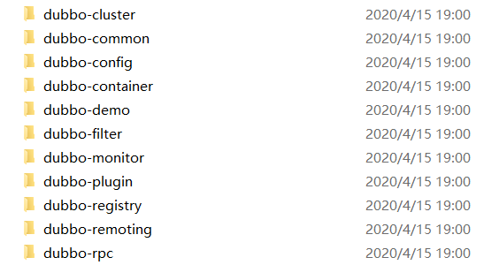

## 项目结构

首先从 GitHub 上 clone 下来 Dubbo 项目，我们根据其中各子项目的项目名，也能大概猜出来各个模块的作用。

### dubbo-common

公共逻辑子项目，定义了各子项目中 通用的 组件 和 工具类，如：IO、日志、配置处理等。

### dubbo-rpc

分布式协调服务框架的核心，该模块定义了 RPC 相关的组件，包括 服务发布、服务调用代理、远程调用结果、RPC 调用网络协议，RPC 调用监听器和过滤器等等。该模块提供了默认的 基于 dubbo 协议的实现，还提供了 hessian、http、rmi、及 webservice 等协议的实现，能够满足绝大多数项目的使用需求，另外 还提供了对自定义协议的扩展。

### dubbo-registry

注册中心子项目，它是 RPC 中 consumer 服务消费者 和 provider 服务提供者 两个重要角色的协调者，该子项目定义了核心的 注册中心组件，提供了 mutilcast、redis 和 zookeeper 等多种方式的注册中心实现，用于不同的使用场景。当然，几乎所有的项目都会选择基于 zookeeper 的实现。

### dubbo-remoting

远程通讯子项目，RPC 的实现基础就是远程通讯，consmer 要调用 provider 的远程方法必须通过 远程通讯实现。该模块定义了远程传输器、endpoint 终端、客户端、服务端、编码解码器、数据交换、缓冲区、通讯异常定义 等核心组件。他是对于远程网络通讯的抽象，提供了诸如 netty、mina、http 等 协议和技术框架的实现方式。

### dubbo-monitor

监控子项目，该模块可以监控服务调用的各种信息，例如调用耗时、调用量、调用结果等等，监控中心在调用过程中收集调用的信息，发送到监控服务，在监控服务中可以存储这些信息，对这些数据进行统计分析 和 展示。dubbo 默认提供了一个实现，该实现非常简单，只是作为默认的实现范例，生产环境使用价值不高，往往需要自行实现。

### dubbo-container

容器子项目，是一个独立的容器，以简单的 Main(类) 加载 Spring 启动，因为服务通常不需要 Tomcat/JBoss 等 Web 容器的特性，没必要用 Web 容器去加载服务。

### dubbo-config

配置中心子项目，该模块通过 配置信息，将 dubbo 组件的各个模块整合在一起，给 框架的使用者 提供 可配置的、易用的 分布式服务框架。它定义了面向 dubbo 使用者的各种信息配置，比如服务发布配置、方法发布配置、服务消费配置、应用程序配置、注册中心配置、协议配置、监控配置等等。

### dubbo-cluster

集群子项目，将多个服务提供方伪装为一个提供方，包括：负载均衡、容错、路由等，集群的地址列表可以是静态配置的，也可以是由注册中心下发。

### dubbo-admin

该子项目是一个 web 应用，可以独立部署，用于管理 dubbo 服务，该管理应用可以连接注册中心，读取和更新 注册中心中的内容。

## 实现原理

### 角色类型与运行原理

一个 Dubbo 项目 的角色主要分为如下五种。

- Provider：服务提供方；
- Consumer：服务消费方；
- Registry：服务注册与发现的注册中心；
- Container：服务运行容器；
- Monitor：统计服务的调用次数、调用时间 的监控中心。

其运行原理如下图所示。

### 工作原理

最后总结下其工作原理。

1. 服务导出：服务提供方 导出服务，监听服务端口；
2. 服务注册：服务提供方 注册服务信息到注册中心；
3. 服务订阅：服务消费方 订阅关注的服务；
4. 服务发现：当服务地址发生变更时，注册中心通知服务消费端；
5. 远程服务调用 ：根据负载均衡策略 选择服务地址，直接调用；
6. 监控：监控器 收集和展示 服务提供方、服务消费方之间 的服务调用统计信息 。
