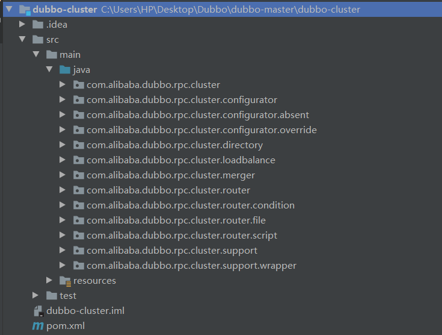

### 集群模块简介

集群，是指同一个服务 被部署在了多个服务器上，每个服务器的任务都相同，能够以较高的性价比，提升系统的 性能、可靠性、灵活性，但同时也要面对 集群中会出现的 负载均衡、容错等问题。dubbo 的集群模块，主要涉及以下几部分内容。

- 负载均衡策略：dubbo 支持的所有负载均衡策略算法；
- 集群容错：Cluster 将 Directory 中的多个 Invoker 伪装成一个 Invoker，对上层透明，伪装过程包含了容错逻辑，调用失败后，重试另一个；
- 路由：dubbo 路由规则，路由规则决定了一次 dubbo 服务调用的目标服务器，路由规则分两种：条件路由规则和脚本路由规则，并且支持可拓展；
- 配置：根据 url 上的配置规则生成配置信息；
- 分组聚合：合并返回结果；
- 本地伪装：mock 通常用于服务降级，mock 只在非业务异常时执行，如 超时、网络异常等。

集群工作过程可分为两个阶段，第一个阶段是在消费者初始化期间，集群 Cluster 为消费者创建 ClusterInvoker 实例。第二个阶段是在消费者进行 RPC 时，以 FailoverClusterInvoker 为例，该实例首先会调用 Directory 的 list()方法 获取 Invoker 列表，然后根据配置的 负载均衡策略，从 Invoker 列表 中选择一个 Inovker，最后将参数传给选择出的 Invoker 实例 进行真正的远程调用。

可将上文中出现的 Invoker 简单理解为服务提供者，Directory 的用途是保存 Invoker 列表，实现类 RegistryDirectory 是一个动态服务目录，可感知注册中心配置的变化，它所持有的 Inovker 列表会随着注册中心内容的变化而变化。每次变化后，RegistryDirectory 会动态增删 Inovker，并调用 Router 的 route 方法进行路由，过滤掉不符合路由规则的 Invoker。

下面我们来看一下 集群模块的项目结构图，结合上文的描述，可以对其有更加深刻的理解。



### 集群模块核心 API 源码解析

从上图应该也能看出其核心 API 在哪个包里。


各核心接口的源码如下。

```java
/**
 * 集群接口
 */
@SPI(FailoverCluster.NAME)
public interface Cluster {

    /**
     * 将目录调用程序合并到虚拟调用程序。
     * 基于 Directory ，创建 Invoker 对象，实现统一、透明的 Invoker 调用过程
     *
     * @param directory Directory 对象
     * @param <T>  泛型
     * @return cluster invoker
     * @throws RpcException
     */
    @Adaptive
    <T> Invoker<T> join(Directory<T> directory) throws RpcException;
}

/**
 * Configurator 接口
 */
public interface Configurator extends Comparable<Configurator> {

    /**
     * 配置规则，生成url
     */
    URL getUrl();

    /**
     * 把规则配置到URL中
     */
    URL configure(URL url);

}

@SPI
public interface ConfiguratorFactory {

    /**
     * 获得 Configurator实例
     */
    @Adaptive("protocol")
    Configurator getConfigurator(URL url);

}

public interface Directory<T> extends Node {

    /**
     * 获得服务类型，例如：com.alibaba.dubbo.demo.DemoService
     */
    Class<T> getInterface();

    /**
     * 获得所有服务 Invoker 集合
     */
    List<Invoker<T>> list(Invocation invocation) throws RpcException;
}

@SPI(RandomLoadBalance.NAME)
public interface LoadBalance {

    /**
     * 从 Invoker 集合中，选择一个合适的 Invoker
     */
    @Adaptive("loadbalance")
    <T> Invoker<T> select(List<Invoker<T>> invokers, URL url, Invocation invocation) throws RpcException;
}

@SPI
public interface Merger<T> {

    /**
     * 合并 T 数组，返回合并后的 T 对象
     *
     * @param items T 数组
     * @return T 对象
     */
    T merge(T... items);
}

/**
 * 路由规则接口
 */
public interface Router extends Comparable<Router> {

    /**
     * 获得路由规则的url
     */
    URL getUrl();

    /**
     * 筛选出跟规则匹配的Invoker集合
     *
     * @param invokers   Invoker 集合
     * @param url        refer url
     * @param invocation
     * @return routed invokers 路由后的 Invoker 集合
     * @throws RpcException
     */
    <T> List<Invoker<T>> route(List<Invoker<T>> invokers, URL url, Invocation invocation) throws RpcException;
}

@SPI
public interface RouterFactory {

    /**
     * 创建 Router 对象
     */
    @Adaptive("protocol")
    Router getRouter(URL url);
}
```
