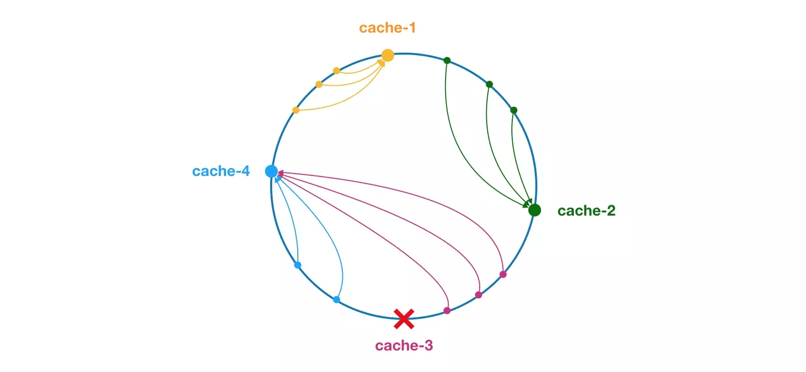
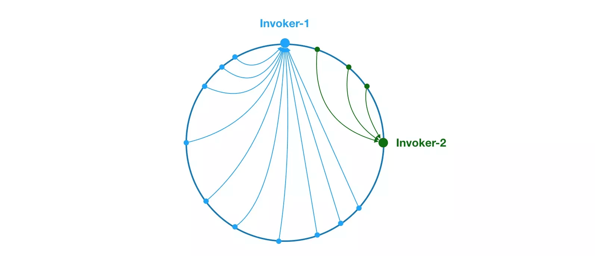
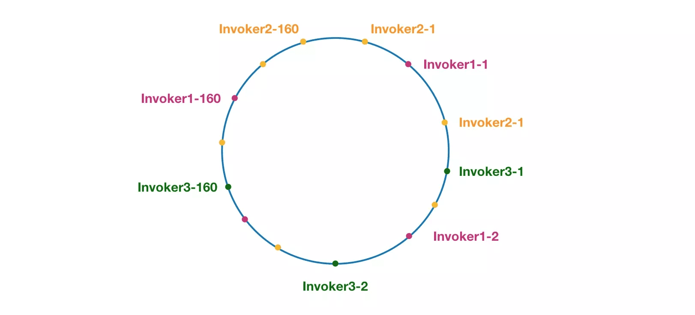

## Dubbo 负载均衡简介

负载均衡，无论在常用的中间件 及 框架中，还是现实生活中，都有所体现。比如，一个团队干活，老大肯定要尽可能把任务均匀合理地分下去，让整个团队能高速运转，能力强的多分点，能力弱的少分点，绝对不能去逮着一个人 让他累到死，让其它人闲着。这样的均匀分配任务及压力的思想 放在开发领域 即是“负载均衡”。它就相当于是一个压力均衡机制，通过各种策略，为集群中的每台服务器合理地分配压力，这样 即能提升整个集群的运行效率，又能尽量避免 某个节点因为压力过大而宕机。

在 Dubbo 中也需要负载均衡机制，将消费者的请求 合理分配到服务提供者集群的各个节点上，以提升集群的整体运行效率 和 避免单个节点压力过大而宕机的问题。Dubbo 提供了 4 种负载均衡实现，缺省为 RandomLoadBalance 加权随机调用，如下。

- RandomLoadBalance：加权随机算法，按权重设置随机概率；
- RoundRobinLoadBalance：加权轮询算法，按公约后的权重设置轮询比率；
- LeastActiveLoadBalance：最少响应时间算法，使快速响应的服务提供者 接收更多请求，慢的提供者收到更少请求；
- ConsistentHashLoadBalance：一致性 hash 算法，相同参数的请求总是发到同一提供者。

## 源码赏析

### LoadBalance 接口 和 AbstractLoadBalance

AbstractLoadBalance 实现了 LoadBalance 接口，是负载均衡的抽象类，提供了权重计算等通用功能。

```java
/**
 * LoadBalance. (SPI, Singleton, ThreadSafe)
 *
 * LoadBalance 接口
 */
@SPI(RandomLoadBalance.NAME)
public interface LoadBalance {

    /**
     * 从 Invoker 集合中，选择一个合适的 Invoker
     */
    @Adaptive("loadbalance")
    <T> Invoker<T> select(List<Invoker<T>> invokers, URL url, Invocation invocation) throws RpcException;
}


/**
 * LoadBalance 抽象类，提供了权重计算的功能
 */
public abstract class AbstractLoadBalance implements LoadBalance {

    static int calculateWarmupWeight(int uptime, int warmup, int weight) {
        // 计算权重
        int ww = (int) ((float) uptime / ((float) warmup / (float) weight));
        // 权重范围为 [0, weight] 之间
        return ww < 1 ? 1 : (ww > weight ? weight : ww);
    }

    @Override
    public <T> Invoker<T> select(List<Invoker<T>> invokers, URL url, Invocation invocation) {
        if (invokers == null || invokers.isEmpty()) {
            return null;
        }
        if (invokers.size() == 1) {
            return invokers.get(0);
        }
        return doSelect(invokers, url, invocation);
    }

    protected abstract <T> Invoker<T> doSelect(List<Invoker<T>> invokers, URL url, Invocation invocation);

    protected int getWeight(Invoker<?> invoker, Invocation invocation) {
        // 获得 weight 配置，即服务权重。默认为 100
        int weight = invoker.getUrl().getMethodParameter(invocation.getMethodName(), Constants.WEIGHT_KEY, Constants.DEFAULT_WEIGHT);
        if (weight > 0) {
            long timestamp = invoker.getUrl().getParameter(Constants.REMOTE_TIMESTAMP_KEY, 0L);
            if (timestamp > 0L) {
                // 获得启动总时长
                int uptime = (int) (System.currentTimeMillis() - timestamp);
                // 获得预热需要总时长。默认为 10 * 60 * 1000 = 10 分钟
                int warmup = invoker.getUrl().getParameter(Constants.WARMUP_KEY, Constants.DEFAULT_WARMUP);
                // 处于预热中，计算当前的权重
                if (uptime > 0 && uptime < warmup) {
                    weight = calculateWarmupWeight(uptime, warmup, weight);
                }
            }
        }
        return weight;
    }
}
```

### RandomLoadBalance

该类是基于权重随机算法的负载均衡实现类，我们先来讲讲原理，比如我有有一组服务器 servers = [A, B, C]，他们他们对应的权重为 weights = [6, 3, 1]，权重总和为 10，现在把这些权重值平铺在一维坐标值上，分别出现三个区域，A 区域为[0,6)，B 区域为[6,9)，C 区域为[9,10)，然后产生一个[0, 10)的随机数，看该数字落在哪个区间内，就用哪台服务器，这样权重越大的，被击中的概率就越大。

```java
/**
 * random load balance.
 *
 * 随机，按权重设置随机概率。
 * 在一个截面上碰撞的概率高，但调用量越大分布越均匀，而且按概率使用权重后也比较均匀，有利于动态调整提供者权重。
 */
public class RandomLoadBalance extends AbstractLoadBalance {

    public static final String NAME = "random";

    private final Random random = new Random();

    @Override
    protected <T> Invoker<T> doSelect(List<Invoker<T>> invokers, URL url, Invocation invocation) {
        int length = invokers.size(); // Number of invokers
        int totalWeight = 0; // The sum of weights
        boolean sameWeight = true; // Every invoker has the same weight?
        // 计算总权限
        for (int i = 0; i < length; i++) {
            int weight = getWeight(invokers.get(i), invocation); // 获得权重
            totalWeight += weight; // Sum
            if (sameWeight && i > 0 && weight != getWeight(invokers.get(i - 1), invocation)) {
                sameWeight = false;
            }
        }
        // 权重不相等，随机后，判断在哪个 Invoker 的权重区间中
        if (totalWeight > 0 && !sameWeight) {
            // 随机
            // If (not every invoker has the same weight & at least one invoker's weight>0), select randomly based on totalWeight.
            int offset = random.nextInt(totalWeight);
            // Return a invoker based on the random value.
            // 区间判断
            for (Invoker<T> invoker : invokers) {
                offset -= getWeight(invoker, invocation);
                if (offset < 0) {
                    return invoker;
                }
            }
        }
        // 权重相等，平均随机
        // If all invokers have the same weight value or totalWeight=0, return evenly.
        return invokers.get(random.nextInt(length));
    }
}
```

### RoundRobinLoadBalance

该类是负载均衡基于加权轮询算法的实现，在 nginx 中也有类似的实现。当我们的服务器 性能之间存在明显差异，并希望请求均匀地落到各服务器上，就需要用到加权轮询。

```java
/**
 * Round robin load balance.
 *
 * 轮循，按公约后的权重设置轮循比率。
 * 存在慢的提供者累积请求的问题，比如：第二台机器很慢，但没挂，当请求调到第二台时就卡在那，久而久之，所有请求都卡在调到第二台上。
 */
public class RoundRobinLoadBalance extends AbstractLoadBalance {

    public static final String NAME = "roundrobin";

    /**
     * 服务方法与计数器的映射
     *
     * KEY：serviceKey + "." + methodName
     */
    private final ConcurrentMap<String, AtomicPositiveInteger> sequences = new ConcurrentHashMap<String, AtomicPositiveInteger>();

    @Override
    protected <T> Invoker<T> doSelect(List<Invoker<T>> invokers, URL url, Invocation invocation) {
        String key = invokers.get(0).getUrl().getServiceKey() + "." + invocation.getMethodName();
        int length = invokers.size(); // Number of invokers
        int maxWeight = 0; // The maximum weight
        int minWeight = Integer.MAX_VALUE; // The minimum weight
        final LinkedHashMap<Invoker<T>, IntegerWrapper> invokerToWeightMap = new LinkedHashMap<Invoker<T>, IntegerWrapper>();
        int weightSum = 0;
        // 计算最小、最大权重，总的权重和。
        for (int i = 0; i < length; i++) {
            int weight = getWeight(invokers.get(i), invocation);
            maxWeight = Math.max(maxWeight, weight); // Choose the maximum weight
            minWeight = Math.min(minWeight, weight); // Choose the minimum weight
            if (weight > 0) {
                invokerToWeightMap.put(invokers.get(i), new IntegerWrapper(weight));
                weightSum += weight;
            }
        }
        // 获得 AtomicPositiveInteger 对象
        AtomicPositiveInteger sequence = sequences.get(key);
        if (sequence == null) {
            sequences.putIfAbsent(key, new AtomicPositiveInteger());
            sequence = sequences.get(key);
        }
        // 获得当前顺序号，并递增 + 1
        int currentSequence = sequence.getAndIncrement();
        // 权重不相等，顺序根据权重分配
        if (maxWeight > 0 && minWeight < maxWeight) {
            int mod = currentSequence % weightSum; // 剩余权重
            for (int i = 0; i < maxWeight; i++) { // 循环最大权重
                for (Map.Entry<Invoker<T>, IntegerWrapper> each : invokerToWeightMap.entrySet()) { // 循环 Invoker 集合
                    final Invoker<T> k = each.getKey();
                    final IntegerWrapper v = each.getValue();
                    // 剩余权重归 0 ，当前 Invoker 还有剩余权重，返回该 Invoker 对象
                    if (mod == 0 && v.getValue() > 0) {
                        return k;
                    }
                    // 若 Invoker 还有权重值，扣除它( value )和剩余权重( mod )。
                    if (v.getValue() > 0) {
                        v.decrement();
                        mod--;
                    }
                }
            }
        }
        // 权重相等，平均顺序获得
        // Round robin
        return invokers.get(currentSequence % length);
    }

    private static final class IntegerWrapper {

        /**
         * 权重值
         */
        private int value;

        public IntegerWrapper(int value) {
            this.value = value;
        }

        public int getValue() {
            return value;
        }

        public void setValue(int value) {
            this.value = value;
        }

        /**
         * 扣除一
         */
        public void decrement() {
            this.value--;
        }
    }
}
```

### LeastActiveLoadBalance

该负载均衡策略基于最少活跃调用数算法，某个服务活跃调用数越小，表明该服务提供者效率越高，也就表明单位时间内能够处理的请求更多。此时应该选择该类服务器。实现很简单，就是每一个服务都有一个活跃数 active 来记录该服务的活跃值，每收到一个请求，该 active 就会加 1，每完成一个请求，active 就减 1。在服务运行一段时间后，性能好的服务提供者处理请求的速度更快，因此活跃数下降的也越快，此时这样的服务提供者能够优先获取到新的服务请求。除了最小活跃数，还引入了权重值，也就是当活跃数一样的时候，选择利用权重法来进行选择，如果权重也一样，那么随机选择一个。

```java
/**
 * LeastActiveLoadBalance
 *
 * 最少活跃调用数，相同活跃数的随机，活跃数指调用前后计数差。
 * 使慢的提供者收到更少请求，因为越慢的提供者的调用前后计数差会越大。
 */
public class LeastActiveLoadBalance extends AbstractLoadBalance {

    public static final String NAME = "leastactive";

    private final Random random = new Random();

    @Override
    protected <T> Invoker<T> doSelect(List<Invoker<T>> invokers, URL url, Invocation invocation) {
        int length = invokers.size(); // 总个数
        int leastActive = -1; // 最小的活跃数
        int leastCount = 0; // 相同最小活跃数的个数
        int[] leastIndexes = new int[length]; // 相同最小活跃数的下标
        int totalWeight = 0; // 总权重
        int firstWeight = 0; // 第一个权重，用于于计算是否相同
        boolean sameWeight = true; // 是否所有权重相同
        // 计算获得相同最小活跃数的数组和个数
        for (int i = 0; i < length; i++) {
            Invoker<T> invoker = invokers.get(i);
            int active = RpcStatus.getStatus(invoker.getUrl(), invocation.getMethodName()).getActive(); // 活跃数
            int weight = invoker.getUrl().getMethodParameter(invocation.getMethodName(), Constants.WEIGHT_KEY, Constants.DEFAULT_WEIGHT); // 权重
            if (leastActive == -1 || active < leastActive) { // 发现更小的活跃数，重新开始
                leastActive = active; // 记录最小活跃数
                leastCount = 1; // 重新统计相同最小活跃数的个数
                leastIndexes[0] = i; // 重新记录最小活跃数下标
                totalWeight = weight; // 重新累计总权重
                firstWeight = weight; // 记录第一个权重
                sameWeight = true; // 还原权重相同标识
            } else if (active == leastActive) { // 累计相同最小的活跃数
                leastIndexes[leastCount++] = i; // 累计相同最小活跃数下标
                totalWeight += weight; // 累计总权重
                // 判断所有权重是否一样
                if (sameWeight && weight != firstWeight) {
                    sameWeight = false;
                }
            }
        }
        // assert(leastCount > 0)
        if (leastCount == 1) {
            // 如果只有一个最小则直接返回
            return invokers.get(leastIndexes[0]);
        }
        if (!sameWeight && totalWeight > 0) {
            // 如果权重不相同且权重大于0则按总权重数随机
            int offsetWeight = random.nextInt(totalWeight);
            // 并确定随机值落在哪个片断上
            for (int i = 0; i < leastCount; i++) {
                int leastIndex = leastIndexes[i];
                offsetWeight -= getWeight(invokers.get(leastIndex), invocation);
                if (offsetWeight <= 0) {
                    return invokers.get(leastIndex);
                }
            }
        }
        // 如果权重相同或权重为0则均等随机
        return invokers.get(leastIndexes[random.nextInt(leastCount)]);
    }
}
```

### ConsistentHashLoadBalance

该类是负载均衡基于 hash 一致性算法的实现。一致性哈希算法的工作原理如下。

1.  首先根据 ip 或其他的信息为缓存节点生成一个 hash，在 dubbo 中使用参数进行计算 hash。并将这个 hash 投射到 [0, 232 - 1] 的圆环上，当有查询或写入请求时，则生成一个 hash 值。
2.  然后查找第一个大于或等于该 hash 值的缓存节点，并到这个节点中查询或写入缓存项。如果当前节点挂了，则在下一次查询或写入缓存时，为缓存项查找另一个大于其 hash 值的缓存节点即可。

大致效果如下图所示（引用一下官网的图）。每个缓存节点在圆环上占据一个位置，如果缓存项 key 的 hash 值小于缓存节点 hash 值，则到该缓存节点中存储或读取缓存项，这里有两个概念不要弄混，缓存节点就好比 dubbo 中的服务提供者，会有很多的服务提供者，而缓存项就好比是服务引用的消费者。比如下面绿色点对应的缓存项也就是服务消费者将会被存储到 cache-2 节点中。由于 cache-3 挂了，原本应该存到该节点中的缓存项也就是服务消费者最终会存储到 cache-4 节点中，也就是调用 cache-4 这个服务提供者。



但 hash 一致性算法 并不能够保证 负载的平衡性，就拿上面的例子来看，cache-3 挂掉了，那该节点下的所有缓存项都要存储到 cache-4 节点中，这就导致 hash 值低的一直往高的存储，会面临一个不平衡的现象，见下图：



可以看到最后会变成类似不平衡的现象，那我们应该怎么避免这样的事情，做到平衡性，那就需要引入 “虚拟节点”，“虚拟节点” 是实际节点在 hash 空间的复制品，“虚拟节点” 在 hash 空间 中以 hash 值 排列，如下图。



可以看到各个节点都被均匀分布在圆环上，且一个服务提供者有多个节点存在，分别跟其他节点交错排列，这样做的目的就是避免数据倾斜问题，也就是由于节点不够分散，导致大量请求落到了同一个节点上，而其他节点只会接收到了少量请求的情况。类似第二张图的情况。

看完原理，接下来我们来看看代码。

```java
/**
 * ConsistentHashLoadBalance
 *
 * 一致性 Hash，相同参数的请求总是发到同一提供者。
 * 当某一台提供者挂时，原本发往该提供者的请求，基于虚拟节点，平摊到其它提供者，不会引起剧烈变动。
 */
public class ConsistentHashLoadBalance extends AbstractLoadBalance {

    /**
     * 服务方法与一致性哈希选择器的映射
     *
     * KEY：serviceKey + "." + methodName
     */
    private final ConcurrentMap<String, ConsistentHashSelector<?>> selectors = new ConcurrentHashMap<String, ConsistentHashSelector<?>>();

    @SuppressWarnings("unchecked")
    @Override
    protected <T> Invoker<T> doSelect(List<Invoker<T>> invokers, URL url, Invocation invocation) {
        String key = invokers.get(0).getUrl().getServiceKey() + "." + invocation.getMethodName();
        // 基于 invokers 集合，根据对象内存地址来计算定义哈希值
        int identityHashCode = System.identityHashCode(invokers);
        // 获得 ConsistentHashSelector 对象。若为空，或者定义哈希值变更（说明 invokers 集合发生变化），进行创建新的 ConsistentHashSelector 对象
        ConsistentHashSelector<T> selector = (ConsistentHashSelector<T>) selectors.get(key);
        if (selector == null || selector.identityHashCode != identityHashCode) {
            selectors.put(key, new ConsistentHashSelector<T>(invokers, invocation.getMethodName(), identityHashCode));
            selector = (ConsistentHashSelector<T>) selectors.get(key);
        }
        return selector.select(invocation);
    }

    private static final class ConsistentHashSelector<T> {

        /**
         * 虚拟节点与 Invoker 的映射关系
         */
        private final TreeMap<Long, Invoker<T>> virtualInvokers;
        /**
         * 每个Invoker 对应的虚拟节点数
         */
        private final int replicaNumber;
        /**
         * 定义哈希值
         */
        private final int identityHashCode;
        /**
         * 取值参数位置数组
         */
        private final int[] argumentIndex;

        ConsistentHashSelector(List<Invoker<T>> invokers, String methodName, int identityHashCode) {
            this.virtualInvokers = new TreeMap<Long, Invoker<T>>();
            // 设置 identityHashCode
            this.identityHashCode = identityHashCode;
            URL url = invokers.get(0).getUrl();
            // 初始化 replicaNumber
            this.replicaNumber = url.getMethodParameter(methodName, "hash.nodes", 160);
            // 初始化 argumentIndex
            String[] index = Constants.COMMA_SPLIT_PATTERN.split(url.getMethodParameter(methodName, "hash.arguments", "0"));
            argumentIndex = new int[index.length];
            for (int i = 0; i < index.length; i++) {
                argumentIndex[i] = Integer.parseInt(index[i]);
            }
            // 初始化 virtualInvokers
            for (Invoker<T> invoker : invokers) {
                String address = invoker.getUrl().getAddress();
                // 每四个虚拟结点为一组，为什么这样？下面会说到
                for (int i = 0; i < replicaNumber / 4; i++) {
                    // 这组虚拟结点得到惟一名称
                    byte[] digest = md5(address + i);
                    // Md5是一个16字节长度的数组，将16字节的数组每四个字节一组，分别对应一个虚拟结点，这就是为什么上面把虚拟结点四个划分一组的原因
                    for (int h = 0; h < 4; h++) {
                        // 对于每四个字节，组成一个long值数值，做为这个虚拟节点的在环中的惟一key
                        long m = hash(digest, h);
                        virtualInvokers.put(m, invoker);
                    }
                }
            }
        }

        public Invoker<T> select(Invocation invocation) {
            // 基于方法参数，获得 KEY
            String key = toKey(invocation.getArguments());
            // 计算 MD5 值
            byte[] digest = md5(key);
            // 计算 KEY 值
            return selectForKey(hash(digest, 0));
        }

        private String toKey(Object[] args) {
            StringBuilder buf = new StringBuilder();
            for (int i : argumentIndex) {
                if (i >= 0 && i < args.length) {
                    buf.append(args[i]);
                }
            }
            return buf.toString();
        }

        private Invoker<T> selectForKey(long hash) {
            // 得到大于当前 key 的那个子 Map ，然后从中取出第一个 key ，就是大于且离它最近的那个 key
            Map.Entry<Long, Invoker<T>> entry = virtualInvokers.tailMap(hash, true).firstEntry();
            // 不存在，则取 virtualInvokers 第一个
        	if (entry == null) {
        		entry = virtualInvokers.firstEntry();
        	}
        	// 存在，则返回
        	return entry.getValue();
        }

        private long hash(byte[] digest, int number) {
            return (((long) (digest[3 + number * 4] & 0xFF) << 24)
                    | ((long) (digest[2 + number * 4] & 0xFF) << 16)
                    | ((long) (digest[1 + number * 4] & 0xFF) << 8)
                    | (digest[number * 4] & 0xFF))
                    & 0xFFFFFFFFL;
        }

        // 计算 MD5
        private byte[] md5(String value) {
            MessageDigest md5;
            try {
                md5 = MessageDigest.getInstance("MD5");
            } catch (NoSuchAlgorithmException e) {
                throw new IllegalStateException(e.getMessage(), e);
            }
            md5.reset();
            byte[] bytes;
            try {
                bytes = value.getBytes("UTF-8");
            } catch (UnsupportedEncodingException e) {
                throw new IllegalStateException(e.getMessage(), e);
            }
            md5.update(bytes);
            return md5.digest();
        }
    }
}
```
