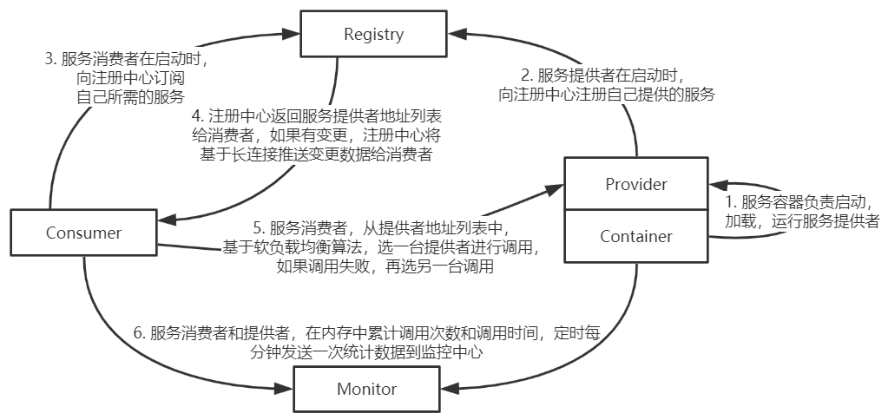
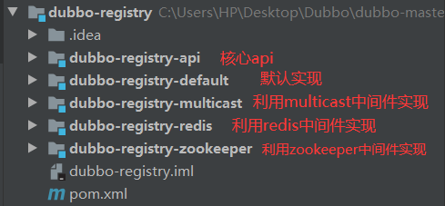
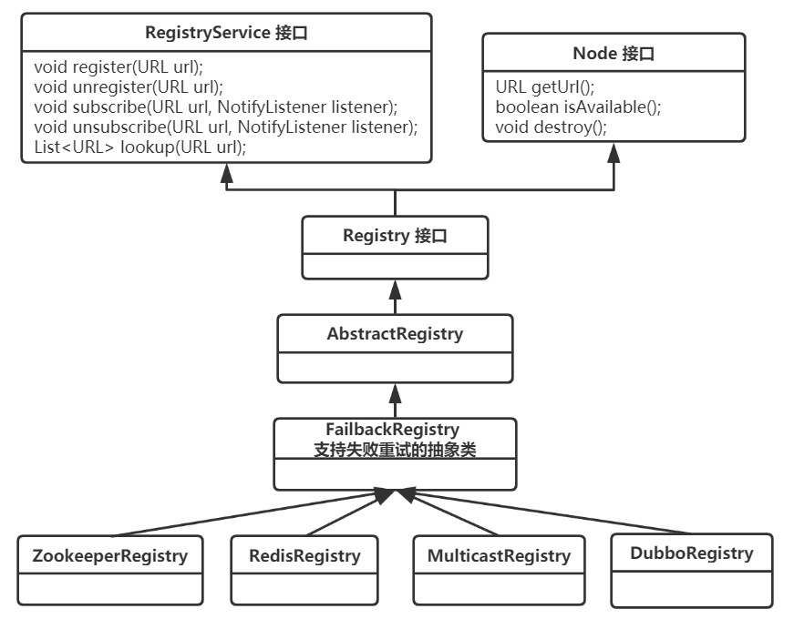
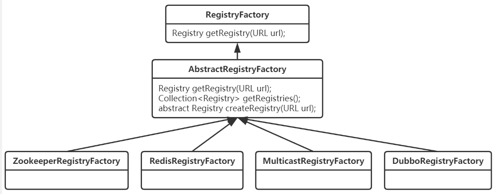

## 注册中心在 Dubbo 中的作用

服务治理框架可以大致分为 服务通信 和 服务管理 两部分，服务管理可以分为服务注册、服务订阅以及服务发现，服务提供者 Provider 会往注册中心注册服务，而消费者 Consumer 会从注册中心中订阅自己关注的服务，并在关注的服务发生变更时 得到注册中心的通知。Provider、Consumer 以及 Registry 之间的依赖关系 如下图所示。



## dubbo-registry 模块 结构分析

dubbo 的注册中心有多种实现方案，如：zookeeper、redis、multicast 等，本章先看一下 dubbo-registry 模块的核心部分 dubbo-registry-api，具体实现部分放到下章来讲。dubbo-registry 模块 的结构如下图所示。



### Registry 核心组件类图

典型的 接口 -> 抽象类 -> 实现类 的结构设计，如下图所示。



既然有 Registry 组件，那么按照很多框架的套路，肯定也有一个用于获取 Registry 实例的 RegistryFactory，其中用到了工厂方法模式，不同的工厂类用于获取不同类型的实例。其类图结构如下。



## 源码详解

根据上面的类图，我们开始从上往下 详解 dubbo 中对于注册中心的设计以及实现。

### RegistryService 接口

RegistryService 是注册中心模块的服务接口，定义了注册、取消注册、订阅、取消订阅以及查询符合条件的已注册数据 等方法。这里统一说明一下 URL，dubbo 是以总线模式来时刻传递和保存配置信息的，配置信息都被放在 URL 上进行传递，随时可以取得相关配置信息，而这里提到了 URL 有别的作用，就是作为类似于节点的作用，首先服务提供者（Provider）启动时需要提供服务，就会向注册中心写下自己的 URL 地址。然后消费者启动时需要去订阅该服务，则会订阅 Provider 注册的地址，并且消费者也会写下自己的 URL。

```java
/**
 * RegistryService. (SPI, Prototype, ThreadSafe)
 *
 * 注册中心服务接口
 */
public interface RegistryService {

    /**
     * 注册数据，比如：提供者地址，消费者地址，路由规则，覆盖规则 等数据。
     * <p>
     * 注册需处理契约：<br>
     * 1. 当URL设置了check=false时，注册失败后不报错，在后台定时重试，否则抛出异常。<br>
     * 2. 当URL设置了dynamic=false参数，则需持久存储，否则，当注册者出现断电等情况异常退出时，需自动删除。<br>
     * 3. 当URL设置了category=routers时，表示分类存储，缺省类别为providers，可按分类部分通知数据。<br>
     * 4. 当注册中心重启，网络抖动，不能丢失数据，包括断线自动删除数据。<br>
     * 5. 允许URI相同但参数不同的URL并存，不能覆盖。<br>
     *
     * @param url 注册信息，不允许为空，如：dubbo://10.20.153.10/com.alibaba.foo.BarService?version=1.0.0&application=kylin
     */
    void register(URL url);

    /**
     * 取消注册.
     * <p>
     * 取消注册需处理契约：<br>
     * 1. 如果是dynamic=false的持久存储数据，找不到注册数据，则抛IllegalStateException，否则忽略。<br>
     * 2. 按全URL匹配取消注册。<br>
     *
     * @param url 注册信息，不允许为空，如：dubbo://10.20.153.10/com.alibaba.foo.BarService?version=1.0.0&application=kylin
     */
    void unregister(URL url);

    /**
     * 订阅符合条件的已注册数据，当有注册数据变更时自动推送.
     * <p>
     * 订阅需处理契约：<br>
     * 1. 当URL设置了check=false时，订阅失败后不报错，在后台定时重试。<br>
     * 2. 当URL设置了category=routers，只通知指定分类的数据，多个分类用逗号分隔，并允许星号通配，表示订阅所有分类数据。<br>
     * 3. 允许以interface,group,version,classifier作为条件查询，如：interface=com.alibaba.foo.BarService&version=1.0.0<br>
     * 4. 并且查询条件允许星号通配，订阅所有接口的所有分组的所有版本，或：interface=*&group=*&version=*&classifier=*<br>
     * 5. 当注册中心重启，网络抖动，需自动恢复订阅请求。<br>
     * 6. 允许URI相同但参数不同的URL并存，不能覆盖。<br>
     * 7. 必须阻塞订阅过程，等第一次通知完后再返回。<br>
     *
     * @param url      订阅条件，不允许为空，如：consumer://10.20.153.10/com.alibaba.foo.BarService?version=1.0.0&application=kylin
     * @param listener 变更事件监听器，不允许为空
     */
    void subscribe(URL url, NotifyListener listener);

    /**
     * 取消订阅.
     * <p>
     * 取消订阅需处理契约：<br>
     * 1. 如果没有订阅，直接忽略。<br>
     * 2. 按全URL匹配取消订阅。<br>
     *
     * @param url      订阅条件，不允许为空，如：consumer://10.20.153.10/com.alibaba.foo.BarService?version=1.0.0&application=kylin
     * @param listener 变更事件监听器，不允许为空
     */
    void unsubscribe(URL url, NotifyListener listener);

    /**
     * 查询符合条件的已注册数据，与订阅的推模式相对应，这里为拉模式，只返回一次结果。
     *
     * @param url 查询条件，不允许为空，如：consumer://10.20.153.10/com.alibaba.foo.BarService?version=1.0.0&application=kylin
     * @return 已注册信息列表，可能为空，含义同{@link com.alibaba.dubbo.registry.NotifyListener#notify(List<URL>)}的参数。
     * @see com.alibaba.dubbo.registry.NotifyListener#notify(List)
     */
    List<URL> lookup(URL url);
}
```

### Registry 接口

注册中心接口，把节点 Node 以及注册中心服务 RegistryService 的方法整合在了这个接口里面。该接口并没有自己的方法，就是继承了 Node 和 RegistryService 接口。这里的 Node 是节点的接口，里面协定了关于节点的一些操作方法，源码如下。

```java
/**
 * 注册中心接口
 */
public interface Registry extends Node, RegistryService {
}

public interface Node {
	//获得节点地址
    URL getUrl();
    //判断节点是否可用
    boolean isAvailable();
    //销毁节点
    void destroy();
}
```

### AbstractRegistry 抽象类

实现了 Registry 接口的抽象类。为了减轻注册中心的压力，该抽象类把本地 URL 缓存到了 property 文件中，并且实现了注册中心的注册、订阅等方法。

```java
/**
 * 实现了Registry接口的抽象类，实现了如下方法：
 *
 * 1、通用的注册、订阅、查询、通知等方法
 * 2、读取和持久化注册数据到文件，以 properties 格式存储
 */
public abstract class AbstractRegistry implements Registry {

    // URL地址分隔符，用于文件缓存中，服务提供者URL分隔
    private static final char URL_SEPARATOR = ' ';
    // URL地址分隔正则表达式，用于解析文件缓存中服务提供者URL列表
    private static final String URL_SPLIT = "\\s+";

    // Log output
    protected final Logger logger = LoggerFactory.getLogger(getClass());
    /**
     *  本地磁盘缓存。
     *  1. 其中特殊的 key 值 .registies 记录注册中心列表 TODO 8019 芋艿，特殊的 key 是
     *  2. 其它均为 {@link #notified} 服务提供者列表
     */
    private final Properties properties = new Properties();
    /**
     * 注册中心缓存写入执行器。
     * 线程数=1
     */
    // File cache timing writing
    private final ExecutorService registryCacheExecutor = Executors.newFixedThreadPool(1, new NamedThreadFactory("DubboSaveRegistryCache", true));
    /**
     * 是否同步保存文件
     */
    private final boolean syncSaveFile;
    /**
     * 数据版本号
     */
    private final AtomicLong lastCacheChanged = new AtomicLong();
    /**
     * 已注册 URL 集合。
     * 注册的 URL 可以是服务提供者的，也可以是服务消费者的
     */
    private final Set<URL> registered = new ConcurrentHashSet<URL>();
    /**
     * 订阅 URL 的监听器集合
     * key：订阅者的 URL ，例如消费者的 URL
     */
    private final ConcurrentMap<URL, Set<NotifyListener>> subscribed = new ConcurrentHashMap<URL, Set<NotifyListener>>();
    /**
     * 被通知的 URL 集合
     * key1：消费者的 URL ，例如消费者的 URL ，和 {@link #subscribed} 的键一致
     * key2：分类，例如：providers、consumers、routes、configurators。【实际无 consumers ，因为消费者不会去订阅另外的消费者的列表】
     *            在 {@link Constants} 中，以 "_CATEGORY" 结尾
     */
    private final ConcurrentMap<URL, Map<String, List<URL>>> notified = new ConcurrentHashMap<URL, Map<String, List<URL>>>();
    /**
     * 注册中心 URL
     */
    private URL registryUrl;
    /**
     * 本地磁盘缓存文件，缓存注册中心的数据
     */
    private File file;
    /**
     * 是否销毁
     */
    private AtomicBoolean destroyed = new AtomicBoolean(false);

    public AbstractRegistry(URL url) {
        setUrl(url);
        // Start file save timer
        syncSaveFile = url.getParameter(Constants.REGISTRY_FILESAVE_SYNC_KEY, false);
        // 获得 `file`
        String filename = url.getParameter(Constants.FILE_KEY, System.getProperty("user.home") + "/.dubbo/dubbo-registry-" + url.getParameter(Constants.APPLICATION_KEY) + "-" + url.getAddress() + ".cache");
        File file = null;
        if (ConfigUtils.isNotEmpty(filename)) {
            file = new File(filename);
            if (!file.exists() && file.getParentFile() != null && !file.getParentFile().exists()) {
                if (!file.getParentFile().mkdirs()) {
                    throw new IllegalArgumentException("Invalid registry store file " + file + ", cause: Failed to create directory " + file.getParentFile() + "!");
                }
            }
        }
        this.file = file;
        // 加载本地磁盘缓存文件到内存缓存
        loadProperties();
        // 通知监听器，URL 变化结果
        notify(url.getBackupUrls()); // 【TODO 8020】为什么构造方法，要通知，连监听器都没注册
    }

    protected static List<URL> filterEmpty(URL url, List<URL> urls) {
        if (urls == null || urls.isEmpty()) {
            List<URL> result = new ArrayList<URL>(1);
            result.add(url.setProtocol(Constants.EMPTY_PROTOCOL));
            return result;
        }
        return urls;
    }

    @Override
    public URL getUrl() {
        return registryUrl;
    }

    protected void setUrl(URL url) {
        if (url == null) {
            throw new IllegalArgumentException("registry url == null");
        }
        this.registryUrl = url;
    }

    public Set<URL> getRegistered() {
        return registered;
    }

    public Map<URL, Set<NotifyListener>> getSubscribed() {
        return subscribed;
    }

    public Map<URL, Map<String, List<URL>>> getNotified() {
        return notified;
    }

    public File getCacheFile() {
        return file;
    }

    public Properties getCacheProperties() {
        return properties;
    }

    public AtomicLong getLastCacheChanged() {
        return lastCacheChanged;
    }

    /**
     * 保存内存缓存到本地磁盘缓存文件，即 {@link #properties} => {@link #file}
     *
     * @param version 数据版本号
     */
    public void doSaveProperties(long version) {
        if (version < lastCacheChanged.get()) {
            return;
        }
        if (file == null) {
            return;
        }
        // Save
        try {
            // 创建 .lock 文件
            File lockfile = new File(file.getAbsolutePath() + ".lock");
            if (!lockfile.exists()) {
                lockfile.createNewFile();
            }
            // 随机读写文件操作
            RandomAccessFile raf = new RandomAccessFile(lockfile, "rw");
            try {
                FileChannel channel = raf.getChannel();
                try {
                    // 获得文件锁
                    FileLock lock = channel.tryLock();
                    // 获取失败
                    if (lock == null) {
                        throw new IOException("Can not lock the registry cache file " + file.getAbsolutePath() + ", ignore and retry later, maybe multi java process use the file, please config: dubbo.registry.file=xxx.properties");
                    }
                    // 获取成功，进行保存
                    // Save
                    try {
                        if (!file.exists()) {
                            file.createNewFile();
                        }
                        FileOutputStream outputFile = new FileOutputStream(file);
                        try {
                            properties.store(outputFile, "Dubbo Registry Cache");
                        } finally {
                            outputFile.close();
                        }
                    // 释放文件锁
                    } finally {
                        lock.release();
                    }
                // 释放文件 Channel
                } finally {
                    channel.close();
                }
            // 释放随机读写文件操作
            } finally {
                raf.close();
            }
        } catch (Throwable e) {
            // 版本号过小，不保存
            if (version < lastCacheChanged.get()) {
                return;
            // 重新异步保存，一般情况下为上面的获取锁失败抛出的异常。通过这样的方式，达到保存成功。
            } else {
                registryCacheExecutor.execute(new SaveProperties(lastCacheChanged.incrementAndGet()));
            }
            logger.warn("Failed to save registry store file, cause: " + e.getMessage(), e);
        }
    }

    /**
     * 加载本地磁盘缓存文件到内存缓存，即 {@link #file} => {@link #properties}
     */
    private void loadProperties() {
        if (file != null && file.exists()) {
            InputStream in = null;
            try {
                // 文件流
                in = new FileInputStream(file);
                // 读取文件流
                properties.load(in);
                if (logger.isInfoEnabled()) {
                    logger.info("Load registry store file " + file + ", data: " + properties);
                }
            } catch (Throwable e) {
                logger.warn("Failed to load registry store file " + file, e);
            } finally {
                if (in != null) {
                    try {
                        in.close();
                    } catch (IOException e) {
                        logger.warn(e.getMessage(), e);
                    }
                }
            }
        }
    }

    /**
     * 从 `properties` 中获得缓存的 URL 集合
     *
     * @param url URL
     * @return URL 集合
     */
    public List<URL> getCacheUrls(URL url) {
        for (Map.Entry<Object, Object> entry : properties.entrySet()) {
            String key = (String) entry.getKey();
            String value = (String) entry.getValue();
            if (key != null && key.length() > 0 // 非空
                    && key.equals(url.getServiceKey()) // 服务键匹配
                    && (Character.isLetter(key.charAt(0)) || key.charAt(0) == '_') // TODO 芋艿，_ 是什么
                    && value != null && value.length() > 0) { // 值非空
                String[] arr = value.trim().split(URL_SPLIT);
                List<URL> urls = new ArrayList<URL>();
                for (String u : arr) {
                    urls.add(URL.valueOf(u));
                }
                return urls;
            }
        }
        return null;
    }

    @Override
    public List<URL> lookup(URL url) {
        List<URL> result = new ArrayList<URL>();
        Map<String, List<URL>> notifiedUrls = getNotified().get(url);
        // 有数据，遍历数据获得
        if (notifiedUrls != null && notifiedUrls.size() > 0) {
            // 遍历
            for (List<URL> urls : notifiedUrls.values()) {
                for (URL u : urls) {
                    if (!Constants.EMPTY_PROTOCOL.equals(u.getProtocol())) {
                        result.add(u);
                    }
                }
            }
        // 无数据，通过发起订阅的方式得到数据后，遍历数据获得
        } else {
            // 创建 NotifyListener 对象
            final AtomicReference<List<URL>> reference = new AtomicReference<List<URL>>();
            NotifyListener listener = new NotifyListener() {
                public void notify(List<URL> urls) {
                    reference.set(urls);
                }
            };
            // 订阅获得数据
            subscribe(url, listener); // Subscribe logic guarantees the first notify to return
            List<URL> urls = reference.get();
            // 遍历
            if (urls != null && !urls.isEmpty()) {
                for (URL u : urls) {
                    if (!Constants.EMPTY_PROTOCOL.equals(u.getProtocol())) {
                        result.add(u);
                    }
                }
            }
        }
        return result;
    }

    @Override
    public void register(URL url) {
        if (url == null) {
            throw new IllegalArgumentException("register url == null");
        }
        if (logger.isInfoEnabled()) {
            logger.info("Register: " + url);
        }
        // 添加到 registered 集合
        registered.add(url);
    }

    @Override
    public void unregister(URL url) {
        if (url == null) {
            throw new IllegalArgumentException("unregister url == null");
        }
        if (logger.isInfoEnabled()) {
            logger.info("Unregister: " + url);
        }
        // 移除出 registered 集合
        registered.remove(url);
    }

    @Override
    public void subscribe(URL url, NotifyListener listener) {
        if (url == null) {
            throw new IllegalArgumentException("subscribe url == null");
        }
        if (listener == null) {
            throw new IllegalArgumentException("subscribe listener == null");
        }
        if (logger.isInfoEnabled()) {
            logger.info("Subscribe: " + url);
        }
        // 添加到 subscribed 集合
        Set<NotifyListener> listeners = subscribed.get(url);
        if (listeners == null) {
            subscribed.putIfAbsent(url, new ConcurrentHashSet<NotifyListener>());
            listeners = subscribed.get(url);
        }
        listeners.add(listener);
    }

    @Override
    public void unsubscribe(URL url, NotifyListener listener) {
        if (url == null) {
            throw new IllegalArgumentException("unsubscribe url == null");
        }
        if (listener == null) {
            throw new IllegalArgumentException("unsubscribe listener == null");
        }
        if (logger.isInfoEnabled()) {
            logger.info("Unsubscribe: " + url);
        }
        // 移除出 subscribed 集合
        Set<NotifyListener> listeners = subscribed.get(url);
        if (listeners != null) {
            listeners.remove(listener);
        }
    }

    /**
     * 恢复注册和订阅
     *
     * @throws Exception 发生异常
     */
    protected void recover() throws Exception {
        // register 恢复注册
        Set<URL> recoverRegistered = new HashSet<URL>(getRegistered());
        if (!recoverRegistered.isEmpty()) {
            if (logger.isInfoEnabled()) {
                logger.info("Recover register url " + recoverRegistered);
            }
            for (URL url : recoverRegistered) {
                register(url);
            }
        }
        // subscribe 恢复订阅
        Map<URL, Set<NotifyListener>> recoverSubscribed = new HashMap<URL, Set<NotifyListener>>(getSubscribed());
        if (!recoverSubscribed.isEmpty()) {
            if (logger.isInfoEnabled()) {
                logger.info("Recover subscribe url " + recoverSubscribed.keySet());
            }
            for (Map.Entry<URL, Set<NotifyListener>> entry : recoverSubscribed.entrySet()) {
                URL url = entry.getKey();
                for (NotifyListener listener : entry.getValue()) {
                    subscribe(url, listener);
                }
            }
        }
    }

    /**
     * 通知监听器，URL 变化结果。
     *
     * @param urls 通知的 URL 变化结果（全量数据）
     */
    protected void notify(List<URL> urls) {
        if (urls == null || urls.isEmpty()) return;
        // 循环 `subscribed` ，通知监听器们
        for (Map.Entry<URL, Set<NotifyListener>> entry : getSubscribed().entrySet()) {
            URL url = entry.getKey();
            // 匹配
            if (!UrlUtils.isMatch(url, urls.get(0))) {
                continue;
            }
            // 通知监听器
            Set<NotifyListener> listeners = entry.getValue();
            if (listeners != null) {
                for (NotifyListener listener : listeners) {
                    try {
                        notify(url, listener, filterEmpty(url, urls));
                    } catch (Throwable t) {
                        logger.error("Failed to notify registry event, urls: " + urls + ", cause: " + t.getMessage(), t);
                    }
                }
            }
        }
    }

    /**
     * 通知监听器，URL 变化结果。
     *
     * 数据流向 `urls` => {@link #notified} => {@link #properties} => {@link #file}
     *
     * @param url 消费者 URL
     * @param listener 监听器
     * @param urls 通知的 URL 变化结果（全量数据）
     */
    protected void notify(URL url, NotifyListener listener, List<URL> urls) {
        if (url == null) {
            throw new IllegalArgumentException("notify url == null");
        }
        if (listener == null) {
            throw new IllegalArgumentException("notify listener == null");
        }
        if ((urls == null || urls.isEmpty())
                && !Constants.ANY_VALUE.equals(url.getServiceInterface())) {
            logger.warn("Ignore empty notify urls for subscribe url " + url);
            return;
        }
        if (logger.isInfoEnabled()) {
            logger.info("Notify urls for subscribe url " + url + ", urls: " + urls);
        }
        // 将 `urls` 按照 `url.parameter.category` 分类，添加到集合
        // 注意，特殊情况，使用 curator 连接 Zookeeper 时，若是服务消费者，连接断开，会出现 category=providers,configurations,routes
        Map<String, List<URL>> result = new HashMap<String, List<URL>>();
        for (URL u : urls) {
            if (UrlUtils.isMatch(url, u)) {
                String category = u.getParameter(Constants.CATEGORY_KEY, Constants.DEFAULT_CATEGORY);
                List<URL> categoryList = result.get(category);
                if (categoryList == null) {
                    categoryList = new ArrayList<URL>();
                    result.put(category, categoryList);
                }
                categoryList.add(u);
            }
        }
        if (result.size() == 0) {
            return;
        }
        // 获得消费者 URL 对应的在 `notified` 中，通知的 URL 变化结果（全量数据）
        Map<String, List<URL>> categoryNotified = notified.get(url);
        if (categoryNotified == null) {
            notified.putIfAbsent(url, new ConcurrentHashMap<String, List<URL>>());
            categoryNotified = notified.get(url);
        }
        // 【按照分类循环】处理通知的 URL 变化结果（全量数据）
        for (Map.Entry<String, List<URL>> entry : result.entrySet()) {
            String category = entry.getKey();
            List<URL> categoryList = entry.getValue();
            // 覆盖到 `notified`
            // 当某个分类的数据为空时，会依然有 urls 。其中 `urls[0].protocol = empty` ，通过这样的方式，处理所有服务提供者为空的情况。
            categoryNotified.put(category, categoryList);
            // 保存到文件
            saveProperties(url);
            // 通知监听器
            listener.notify(categoryList);
        }
    }

    /**
     * 保存单个消费者 URL 对应，在 `notified` 的数据，到文件。
     *
     * @param url 消费者 URL
     */
    private void saveProperties(URL url) {
        if (file == null) {
            return;
        }

        try {
            // 拼接 URL
            StringBuilder buf = new StringBuilder();
            Map<String, List<URL>> categoryNotified = notified.get(url);
            if (categoryNotified != null) {
                for (List<URL> us : categoryNotified.values()) {
                    for (URL u : us) {
                        if (buf.length() > 0) {
                            buf.append(URL_SEPARATOR);
                        }
                        buf.append(u.toFullString());
                    }
                }
            }
            // 设置到 properties 中
            properties.setProperty(url.getServiceKey(), buf.toString());
            // 增加数据版本号
            long version = lastCacheChanged.incrementAndGet();
            // 保存到文件
            if (syncSaveFile) {
                doSaveProperties(version);
            } else {
                registryCacheExecutor.execute(new SaveProperties(version));
            }
        } catch (Throwable t) {
            logger.warn(t.getMessage(), t);
        }
    }

    /**
     * 取消注册和订阅
     */
    @Override
    public void destroy() {
        // 已销毁，跳过
        if (!destroyed.compareAndSet(false, true)) {
            return;
        }
        if (logger.isInfoEnabled()) {
            logger.info("Destroy registry:" + getUrl());
        }
        // 取消注册
        Set<URL> destroyRegistered = new HashSet<URL>(getRegistered());
        if (!destroyRegistered.isEmpty()) {
            for (URL url : new HashSet<URL>(getRegistered())) {
                if (url.getParameter(Constants.DYNAMIC_KEY, true)) {
                    try {
                        unregister(url); // 取消注册
                        if (logger.isInfoEnabled()) {
                            logger.info("Destroy unregister url " + url);
                        }
                    } catch (Throwable t) {
                        logger.warn("Failed to unregister url " + url + " to registry " + getUrl() + " on destroy, cause: " + t.getMessage(), t);
                    }
                }
            }
        }
        // 取消订阅
        Map<URL, Set<NotifyListener>> destroySubscribed = new HashMap<URL, Set<NotifyListener>>(getSubscribed());
        if (!destroySubscribed.isEmpty()) {
            for (Map.Entry<URL, Set<NotifyListener>> entry : destroySubscribed.entrySet()) {
                URL url = entry.getKey();
                for (NotifyListener listener : entry.getValue()) {
                    try {
                        unsubscribe(url, listener); // 取消订阅
                        if (logger.isInfoEnabled()) {
                            logger.info("Destroy unsubscribe url " + url);
                        }
                    } catch (Throwable t) {
                        logger.warn("Failed to unsubscribe url " + url + " to registry " + getUrl() + " on destroy, cause: " + t.getMessage(), t);
                    }
                }
            }
        }
    }

    public String toString() {
        return getUrl().toString();
    }

    /**
     * 保存配置的 Runnable任务
     */
    private class SaveProperties implements Runnable {

        /**
         * 数据版本号
         */
        private long version;

        private SaveProperties(long version) {
            this.version = version;
        }

        public void run() {
            doSaveProperties(version);
        }
    }
}
```

### FailbackRegistry 抽象类

FailbackRegistry 抽象类 继承了上面的 AbstractRegistry，AbstractRegistry 中的注册、订阅等方法，实际上就是一些内存缓存的变化，而真正的注册订阅的实现逻辑在 FailbackRegistry 实现，并且 FailbackRegistry 提供了失败重试的机制。

```java
/**
 * 支持失败重试的 FailbackRegistry抽象类
 */
public abstract class FailbackRegistry extends AbstractRegistry {

    /**
     * 定时任务执行器
     */
    private final ScheduledExecutorService retryExecutor = Executors.
    		newScheduledThreadPool(1, new NamedThreadFactory("DubboRegistryFailedRetryTimer", true));

    /**
     * 失败重试定时器，定时检查是否有请求失败，如有，无限次重试
     */
    private final ScheduledFuture<?> retryFuture;
    /**
     * 注册失败的 URL 集合
     */
    private final Set<URL> failedRegistered = new ConcurrentHashSet<URL>();
    /**
     * 取消注册失败的 URL 集合
     */
    private final Set<URL> failedUnregistered = new ConcurrentHashSet<URL>();
    /**
     * 订阅失败的监听器集合
     */
    private final ConcurrentMap<URL, Set<NotifyListener>> failedSubscribed = new ConcurrentHashMap<URL, Set<NotifyListener>>();
    /**
     * 取消订阅失败的监听器集合
     */
    private final ConcurrentMap<URL, Set<NotifyListener>> failedUnsubscribed = new ConcurrentHashMap<URL, Set<NotifyListener>>();
    /**
     * 通知失败的 URL 集合
     */
    private final ConcurrentMap<URL, Map<NotifyListener, List<URL>>> failedNotified = new ConcurrentHashMap<URL, Map<NotifyListener, List<URL>>>();

    /**
     * 是否销毁
     */
    private AtomicBoolean destroyed = new AtomicBoolean(false);

    public FailbackRegistry(URL url) {
        super(url);
        // 重试频率，单位：毫秒
        int retryPeriod = url.getParameter(Constants.REGISTRY_RETRY_PERIOD_KEY, Constants.DEFAULT_REGISTRY_RETRY_PERIOD);
        // 创建失败重试定时器
        this.retryFuture = retryExecutor.scheduleWithFixedDelay(new Runnable() {
            public void run() {
                // Check and connect to the registry
                try {
                    retry();
                } catch (Throwable t) { // Defensive fault tolerance
                    logger.error("Unexpected error occur at failed retry, cause: " + t.getMessage(), t);
                }
            }
        }, retryPeriod, retryPeriod, TimeUnit.MILLISECONDS);
    }

    public Future<?> getRetryFuture() {
        return retryFuture;
    }

    public Set<URL> getFailedRegistered() {
        return failedRegistered;
    }

    public Set<URL> getFailedUnregistered() {
        return failedUnregistered;
    }

    public Map<URL, Set<NotifyListener>> getFailedSubscribed() {
        return failedSubscribed;
    }

    public Map<URL, Set<NotifyListener>> getFailedUnsubscribed() {
        return failedUnsubscribed;
    }

    public Map<URL, Map<NotifyListener, List<URL>>> getFailedNotified() {
        return failedNotified;
    }

    /**
     * 添加到 `failedSubscribed`
     */
    private void addFailedSubscribed(URL url, NotifyListener listener) {
        Set<NotifyListener> listeners = failedSubscribed.get(url);
        if (listeners == null) {
            failedSubscribed.putIfAbsent(url, new ConcurrentHashSet<NotifyListener>());
            listeners = failedSubscribed.get(url);
        }
        listeners.add(listener);
    }

    /**
     * 移除出 `failedSubscribed` `failedUnsubscribed` `failedNotified`
     */
    private void removeFailedSubscribed(URL url, NotifyListener listener) {
        // 移除出 `failedSubscribed`
        Set<NotifyListener> listeners = failedSubscribed.get(url);
        if (listeners != null) {
            listeners.remove(listener);
        }
        // 移除出 `failedUnsubscribed`
        listeners = failedUnsubscribed.get(url);
        if (listeners != null) {
            listeners.remove(listener);
        }
        // 移除出 `failedNotified`
        Map<NotifyListener, List<URL>> notified = failedNotified.get(url);
        if (notified != null) {
            notified.remove(listener);
        }
    }

    @Override
    public void register(URL url) {
        // 已销毁，跳过
        if (destroyed.get()){
            return;
        }
        // 添加到 `registered` 变量
        super.register(url);
        // 移除出 `failedRegistered` `failedUnregistered` 变量
        failedRegistered.remove(url);
        failedUnregistered.remove(url);
        // 向注册中心发送注册请求
        try {
            doRegister(url);
        } catch (Exception e) {
            Throwable t = e;

            // 如果开启了启动时检测，则直接抛出异常
            boolean check = getUrl().getParameter(Constants.CHECK_KEY, true)
                    && url.getParameter(Constants.CHECK_KEY, true)
                    && !Constants.CONSUMER_PROTOCOL.equals(url.getProtocol()); // 非消费者。消费者会在 `ReferenceConfig#createProxy(...)` 方法中，调用 `Invoker#avalible()` 方法，进行检查。
            boolean skipFailback = t instanceof SkipFailbackWrapperException;
            if (check || skipFailback) {
                if (skipFailback) {
                    t = t.getCause();
                }
                throw new IllegalStateException("Failed to register " + url + " to registry " + getUrl().getAddress() + ", cause: " + t.getMessage(), t);
            } else {
                logger.error("Failed to register " + url + ", waiting for retry, cause: " + t.getMessage(), t);
            }

            // 将失败的注册请求记录到 `failedRegistered`，定时重试
            failedRegistered.add(url);
        }
    }

    @Override
    public void unregister(URL url) {
        // 已销毁，跳过
        if (destroyed.get()){
            return;
        }
        // 移除出 `registered` 变量
        super.unregister(url);
        // 移除出 `failedRegistered` `failedUnregistered` 变量
        failedRegistered.remove(url);
        failedUnregistered.remove(url);
        // 向注册中心发送取消注册请求
        try {
            doUnregister(url);
        } catch (Exception e) {
            Throwable t = e;

            // 如果开启了启动时检测，则直接抛出异常
            boolean check = getUrl().getParameter(Constants.CHECK_KEY, true)
                    && url.getParameter(Constants.CHECK_KEY, true)
                    && !Constants.CONSUMER_PROTOCOL.equals(url.getProtocol());
            boolean skipFailback = t instanceof SkipFailbackWrapperException;
            if (check || skipFailback) {
                if (skipFailback) {
                    t = t.getCause();
                }
                throw new IllegalStateException("Failed to unregister " + url + " to registry " + getUrl().getAddress() + ", cause: " + t.getMessage(), t);
            } else {
                logger.error("Failed to uregister " + url + ", waiting for retry, cause: " + t.getMessage(), t);
            }

            // 将失败的取消注册请求记录到 `failedUnregistered`，定时重试
            failedUnregistered.add(url);
        }
    }

    @Override
    public void subscribe(URL url, NotifyListener listener) {
        // 已销毁，跳过
        if (destroyed.get()){
            return;
        }
        // 移除出 `subscribed` 变量
        super.subscribe(url, listener);
        // 移除出 `failedSubscribed` `failedUnsubscribed` `failedNotified`
        removeFailedSubscribed(url, listener);
        // 向注册中心发送订阅请求
        try {
            doSubscribe(url, listener);
        } catch (Exception e) {
            Throwable t = e;

            // 如果有缓存的 URL 集合，进行通知。后续订阅成功后，会使用最新的 URL 集合，进行通知。
            List<URL> urls = getCacheUrls(url);
            if (urls != null && !urls.isEmpty()) {
                notify(url, listener, urls);
                logger.error("Failed to subscribe " + url + ", Using cached list: " + urls + " from cache file: " + getUrl().getParameter(Constants.FILE_KEY, System.getProperty("user.home") + "/dubbo-registry-" + url.getHost() + ".cache") + ", cause: " + t.getMessage(), t);
            } else {
                // 如果开启了启动时检测，则直接抛出异常
                // If the startup detection is opened, the Exception is thrown directly.
                boolean check = getUrl().getParameter(Constants.CHECK_KEY, true)
                        && url.getParameter(Constants.CHECK_KEY, true);
                boolean skipFailback = t instanceof SkipFailbackWrapperException;
                if (check || skipFailback) {
                    if (skipFailback) {
                        t = t.getCause();
                    }
                    throw new IllegalStateException("Failed to subscribe " + url + ", cause: " + t.getMessage(), t);
                } else {
                    logger.error("Failed to subscribe " + url + ", waiting for retry, cause: " + t.getMessage(), t);
                }
            }

            // 将失败的订阅请求记录到 `failedSubscribed`，定时重试
            // Record a failed registration request to a failed list, retry regularly
            addFailedSubscribed(url, listener);
        }
    }

    @Override
    public void unsubscribe(URL url, NotifyListener listener) {
        // 已销毁，跳过
        if (destroyed.get()){
            return;
        }
        // 移除出 `unsubscribed` 变量
        super.unsubscribe(url, listener);
        // 移除出 `failedSubscribed` `failedUnsubscribed` `failedNotified`
        removeFailedSubscribed(url, listener);
        // 向注册中心发送取消订阅请求
        try {
            // Sending a canceling subscription request to the server side
            doUnsubscribe(url, listener);
        } catch (Exception e) {
            Throwable t = e;

            // 如果开启了启动时检测，则直接抛出异常
            // If the startup detection is opened, the Exception is thrown directly.
            boolean check = getUrl().getParameter(Constants.CHECK_KEY, true)
                    && url.getParameter(Constants.CHECK_KEY, true);
            boolean skipFailback = t instanceof SkipFailbackWrapperException;
            if (check || skipFailback) {
                if (skipFailback) {
                    t = t.getCause();
                }
                throw new IllegalStateException("Failed to unsubscribe " + url + " to registry " + getUrl().getAddress() + ", cause: " + t.getMessage(), t);
            } else {
                logger.error("Failed to unsubscribe " + url + ", waiting for retry, cause: " + t.getMessage(), t);
            }

            // 将失败的订阅请求记录到 `failedUnsubscribed`，定时重试
            // Record a failed registration request to a failed list, retry regularly
            Set<NotifyListener> listeners = failedUnsubscribed.get(url);
            if (listeners == null) {
                failedUnsubscribed.putIfAbsent(url, new ConcurrentHashSet<NotifyListener>());
                listeners = failedUnsubscribed.get(url);
            }
            listeners.add(listener);
        }
    }

    @Override
    protected void notify(URL url, NotifyListener listener, List<URL> urls) {
        if (url == null) {
            throw new IllegalArgumentException("notify url == null");
        }
        if (listener == null) {
            throw new IllegalArgumentException("notify listener == null");
        }
        // 通知监听器
        try {
            doNotify(url, listener, urls);
        } catch (Exception t) {
            // 将失败的通知记录到 `failedNotified`，定时重试
            Map<NotifyListener, List<URL>> listeners = failedNotified.get(url);
            if (listeners == null) {
                failedNotified.putIfAbsent(url, new ConcurrentHashMap<NotifyListener, List<URL>>());
                listeners = failedNotified.get(url);
            }
            listeners.put(listener, urls);
            logger.error("Failed to notify for subscribe " + url + ", waiting for retry, cause: " + t.getMessage(), t);
        }
    }

    protected void doNotify(URL url, NotifyListener listener, List<URL> urls) {
        super.notify(url, listener, urls);
    }

    @Override
    protected void recover() throws Exception {
        // register 恢复注册，添加到 `failedRegistered` ，定时重试
        Set<URL> recoverRegistered = new HashSet<URL>(getRegistered());
        if (!recoverRegistered.isEmpty()) {
            if (logger.isInfoEnabled()) {
                logger.info("Recover register url " + recoverRegistered);
            }
            for (URL url : recoverRegistered) {
                failedRegistered.add(url);
            }
        }
        // subscribe 恢复订阅，添加到 `failedSubscribed` ，定时重试
        Map<URL, Set<NotifyListener>> recoverSubscribed = new HashMap<URL, Set<NotifyListener>>(getSubscribed());
        if (!recoverSubscribed.isEmpty()) {
            if (logger.isInfoEnabled()) {
                logger.info("Recover subscribe url " + recoverSubscribed.keySet());
            }
            for (Map.Entry<URL, Set<NotifyListener>> entry : recoverSubscribed.entrySet()) {
                URL url = entry.getKey();
                for (NotifyListener listener : entry.getValue()) {
                    addFailedSubscribed(url, listener);
                }
            }
        }
    }

    /**
     * 重试
     */
    protected void retry() {
        // 重试执行注册
        if (!failedRegistered.isEmpty()) {
            Set<URL> failed = new HashSet<URL>(failedRegistered); // 避免并发冲突
            if (failed.size() > 0) {
                if (logger.isInfoEnabled()) {
                    logger.info("Retry register " + failed);
                }
                try {
                    for (URL url : failed) {
                        try {
                            // 执行注册
                            doRegister(url);
                            // 移除出 `failedRegistered`
                            failedRegistered.remove(url);
                        } catch (Throwable t) { // Ignore all the exceptions and wait for the next retry
                            logger.warn("Failed to retry register " + failed + ", waiting for again, cause: " + t.getMessage(), t);
                        }
                    }
                } catch (Throwable t) { // Ignore all the exceptions and wait for the next retry
                    logger.warn("Failed to retry register " + failed + ", waiting for again, cause: " + t.getMessage(), t);
                }
            }
        }
        // 重试执行取消注册
        if (!failedUnregistered.isEmpty()) {
            Set<URL> failed = new HashSet<URL>(failedUnregistered); // 避免并发冲突
            if (!failed.isEmpty()) {
                if (logger.isInfoEnabled()) {
                    logger.info("Retry unregister " + failed);
                }
                try {
                    for (URL url : failed) {
                        try {
                            // 执行取消注册
                            doUnregister(url);
                            // 移除出 `failedUnregistered`
                            failedUnregistered.remove(url);
                        } catch (Throwable t) { // Ignore all the exceptions and wait for the next retry
                            logger.warn("Failed to retry unregister  " + failed + ", waiting for again, cause: " + t.getMessage(), t);
                        }
                    }
                } catch (Throwable t) { // Ignore all the exceptions and wait for the next retry
                    logger.warn("Failed to retry unregister  " + failed + ", waiting for again, cause: " + t.getMessage(), t);
                }
            }
        }
        // 重试执行注册
        if (!failedSubscribed.isEmpty()) {
            Map<URL, Set<NotifyListener>> failed = new HashMap<URL, Set<NotifyListener>>(failedSubscribed); // 避免并发冲突
            for (Map.Entry<URL, Set<NotifyListener>> entry : new HashMap<URL, Set<NotifyListener>>(failed).entrySet()) {
                if (entry.getValue() == null || entry.getValue().size() == 0) {
                    failed.remove(entry.getKey());
                }
            }
            if (failed.size() > 0) {
                if (logger.isInfoEnabled()) {
                    logger.info("Retry subscribe " + failed);
                }
                try {
                    for (Map.Entry<URL, Set<NotifyListener>> entry : failed.entrySet()) {
                        URL url = entry.getKey();
                        Set<NotifyListener> listeners = entry.getValue();
                        for (NotifyListener listener : listeners) {
                            try {
                                // 执行注册
                                doSubscribe(url, listener);
                                // 移除出监听器
                                listeners.remove(listener);
                            } catch (Throwable t) { // Ignore all the exceptions and wait for the next retry
                                logger.warn("Failed to retry subscribe " + failed + ", waiting for again, cause: " + t.getMessage(), t);
                            }
                        }
                    }
                } catch (Throwable t) { // Ignore all the exceptions and wait for the next retry
                    logger.warn("Failed to retry subscribe " + failed + ", waiting for again, cause: " + t.getMessage(), t);
                }
            }
        }
        // 重试执行取消注册
        if (!failedUnsubscribed.isEmpty()) {
            Map<URL, Set<NotifyListener>> failed = new HashMap<URL, Set<NotifyListener>>(failedUnsubscribed);
            for (Map.Entry<URL, Set<NotifyListener>> entry : new HashMap<URL, Set<NotifyListener>>(failed).entrySet()) {
                if (entry.getValue() == null || entry.getValue().isEmpty()) {
                    failed.remove(entry.getKey());
                }
            }
            if (failed.size() > 0) {
                if (logger.isInfoEnabled()) {
                    logger.info("Retry unsubscribe " + failed);
                }
                try {
                    for (Map.Entry<URL, Set<NotifyListener>> entry : failed.entrySet()) {
                        URL url = entry.getKey();
                        Set<NotifyListener> listeners = entry.getValue();
                        for (NotifyListener listener : listeners) {
                            try {
                                // 执行取消注册
                                doUnsubscribe(url, listener);
                                // 移除出监听器
                                listeners.remove(listener);
                            } catch (Throwable t) { // Ignore all the exceptions and wait for the next retry
                                logger.warn("Failed to retry unsubscribe " + failed + ", waiting for again, cause: " + t.getMessage(), t);
                            }
                        }
                    }
                } catch (Throwable t) { // Ignore all the exceptions and wait for the next retry
                    logger.warn("Failed to retry unsubscribe " + failed + ", waiting for again, cause: " + t.getMessage(), t);
                }
            }
        }
        // 重试执行通知监听器
        if (!failedNotified.isEmpty()) {
            Map<URL, Map<NotifyListener, List<URL>>> failed = new HashMap<URL, Map<NotifyListener, List<URL>>>(failedNotified);
            for (Map.Entry<URL, Map<NotifyListener, List<URL>>> entry : new HashMap<URL, Map<NotifyListener, List<URL>>>(failed).entrySet()) {
                if (entry.getValue() == null || entry.getValue().size() == 0) {
                    failed.remove(entry.getKey());
                }
            }
            if (failed.size() > 0) {
                if (logger.isInfoEnabled()) {
                    logger.info("Retry notify " + failed);
                }
                try {
                    for (Map<NotifyListener, List<URL>> values : failed.values()) {
                        for (Map.Entry<NotifyListener, List<URL>> entry : values.entrySet()) {
                            try {
                                NotifyListener listener = entry.getKey();
                                List<URL> urls = entry.getValue();
                                // 通知监听器
                                listener.notify(urls);
                                // 移除出监听器
                                values.remove(listener);
                            } catch (Throwable t) { // Ignore all the exceptions and wait for the next retry
                                logger.warn("Failed to retry notify " + failed + ", waiting for again, cause: " + t.getMessage(), t);
                            }
                        }
                    }
                } catch (Throwable t) { // Ignore all the exceptions and wait for the next retry
                    logger.warn("Failed to retry notify " + failed + ", waiting for again, cause: " + t.getMessage(), t);
                }
            }
        }
    }

    @Override
    public void destroy() {
        // 忽略，若已经销毁
        if (!canDestroy()) {
            return;
        }
        // 调用父方法，取消注册和订阅
        super.destroy();
        // 销毁重试任务
        try {
            retryFuture.cancel(true);
        } catch (Throwable t) {
            logger.warn(t.getMessage(), t);
        }
    }

    // TODO: 2017/8/30 to abstract this method
    protected boolean canDestroy(){
        return destroyed.compareAndSet(false, true);
    }

    // ==== Template method ====

    protected abstract void doRegister(URL url);

    protected abstract void doUnregister(URL url);

    protected abstract void doSubscribe(URL url, NotifyListener listener);

    protected abstract void doUnsubscribe(URL url, NotifyListener listener);
}
```

### RegistryFactory 和 AbstractRegistryFactory

RegistryFactory 接口 是 Registry 的工厂接口，用来返回 Registry 实例。该接口是一个可扩展接口，可以看到该接口上有个@SPI 注解，并且默认值为 dubbo，也就是默认扩展的是 DubboRegistryFactory。AbstractRegistryFactory 则是实现了 RegistryFactory 接口 的抽象类。其源码如下。

```java
/**
 * 注册中心工厂
 */
@SPI("dubbo")
public interface RegistryFactory {

    /**
     * 根据注册中心连接地址，获取注册中心实例
     * <p>
     * 连接注册中心需处理契约：<br>
     * 1. 当设置check=false时表示不检查连接，否则在连接不上时抛出异常。<br>
     * 2. 支持URL上的username:password权限认证。<br>
     * 3. 支持backup=10.20.153.10备选注册中心集群地址。<br>
     * 4. 支持file=registry.cache本地磁盘文件缓存。<br>
     * 5. 支持timeout=1000请求超时设置。<br>
     * 6. 支持session=60000会话超时或过期设置。<br>
     *
     * @param url 注册中心地址，不允许为空
     * @return 注册中心引用，总不返回空
     */
    @Adaptive({"protocol"})
    Registry getRegistry(URL url);
}

/**
 * 注册中心抽象类
 */
public abstract class AbstractRegistryFactory implements RegistryFactory {

    // Log output
    private static final Logger LOGGER = LoggerFactory.getLogger(AbstractRegistryFactory.class);

    // The lock for the acquisition process of the registry
    private static final ReentrantLock LOCK = new ReentrantLock();

    /**
     * Registry 集合
     */
    private static final Map<String, Registry> REGISTRIES = new ConcurrentHashMap<String, Registry>();

    /**
     * Get all registries
     */
    public static Collection<Registry> getRegistries() {
        return Collections.unmodifiableCollection(REGISTRIES.values());
    }

    /**
     * 销毁所有 Registry
     */
    // TODO: 2017/8/30 to move somewhere else better
    public static void destroyAll() {
        if (LOGGER.isInfoEnabled()) {
            LOGGER.info("Close all registries " + getRegistries());
        }
        // 获得锁
        LOCK.lock();
        try {
            // 销毁
            for (Registry registry : getRegistries()) {
                try {
                    registry.destroy();
                } catch (Throwable e) {
                    LOGGER.error(e.getMessage(), e);
                }
            }
            // 清空缓存
            REGISTRIES.clear();
        } finally {
            // 释放锁
            LOCK.unlock();
        }
    }

    /**
     * 获得注册中心 Registry 对象
     *
     * @param url 注册中心地址，不允许为空
     * @return Registry 对象
     */
    @Override
    public Registry getRegistry(URL url) {
        // 修改 URL
        url = url.setPath(RegistryService.class.getName()) // + `path`
                .addParameter(Constants.INTERFACE_KEY, RegistryService.class.getName()) // + `parameters.interface`
                .removeParameters(Constants.EXPORT_KEY, Constants.REFER_KEY); // - `export`
        // 计算 key
        String key = url.toServiceString();
        // 获得锁
        // Lock the registry access process to ensure a single instance of the registry
        LOCK.lock();
        try {
            // 从缓存中获得 Registry 对象
            Registry registry = REGISTRIES.get(key);
            if (registry != null) {
                return registry;
            }
            // 缓存不存在，进行创建 Registry 对象
            registry = createRegistry(url);
            if (registry == null) {
                throw new IllegalStateException("Can not create registry " + url);
            }
            // 添加到缓存
            REGISTRIES.put(key, registry);
            return registry;
        } finally {
            // 释放锁
            // Release the lock
            LOCK.unlock();
        }
    }

    /**
     * 创建 Registry 对象
     *
     * @param url 注册中心地址
     * @return Registry 对象
     */
    protected abstract Registry createRegistry(URL url);
}
```

### NotifyListener 和 RegistryDirectory

最后我们来看一下 dubbo-registry-api 模块下的另一个比较重要的组件，NotifyListener 接口 和 RegistryDirectory 抽象类。NotifyListener 接口 只有一个 notify 方法，通知监听器。当收到服务变更通知时触发。RegistryDirectory 是注册中心服务，维护着所有可用的远程 Invoker 或者本地的 Invoker，它的 Invoker 集合是从注册中心获取的，另外，它实现了 NotifyListener 接口。比如消费方要调用某远程服务，会向注册中心订阅这个服务的所有 服务提供方，在订阅 及 服务提供方数据有变动时，回调消费方的 NotifyListener 服务的 notify 方法，回调接口传入所有服务提供方的 url 地址然后将 urls 转化为 invokers，也就是 refer 应用远程服务。源码如下。

```java
/**
 * 通知监听器
 */
public interface NotifyListener {

    /**
     * 当收到服务变更通知时触发。
     * <p>
     * 通知需处理契约：<br>
     * 1. 总是以服务接口和数据类型为维度全量通知，即不会通知一个服务的同类型的部分数据，用户不需要对比上一次通知结果。<br>
     * 2. 订阅时的第一次通知，必须是一个服务的所有类型数据的全量通知。<br>
     * 3. 中途变更时，允许不同类型的数据分开通知，比如：providers, consumers, routers, overrides，允许只通知其中一种类型，但该类型的数据必须是全量的，不是增量的。<br>
     * 4. 如果一种类型的数据为空，需通知一个empty协议并带category参数的标识性URL数据。<br>
     * 5. 通知者(即注册中心实现)需保证通知的顺序，比如：单线程推送，队列串行化，带版本对比。<br>
     *
     * @param urls 已注册信息列表，总不为空，含义同{@link com.alibaba.dubbo.registry.RegistryService#lookup(URL)}的返回值。
     */
    void notify(List<URL> urls);
}


/**
 * 基于注册中心的 Directory 实现类
 */
public class RegistryDirectory<T> extends AbstractDirectory<T> implements NotifyListener {

    private static final Logger logger = LoggerFactory.getLogger(RegistryDirectory.class);

    // ========== Dubbo SPI Adaptive 对象 BEGIN ==========

    /**
     * Cluster$Adaptive 对象
     */
    private static final Cluster cluster = ExtensionLoader.getExtensionLoader(Cluster.class).getAdaptiveExtension();
    /**
     * RouterFactory$Adaptive 对象
     */
    private static final RouterFactory routerFactory = ExtensionLoader.getExtensionLoader(RouterFactory.class).getAdaptiveExtension();
    /**
     * ConfiguratorFactory$Adaptive 对象
     */
    private static final ConfiguratorFactory configuratorFactory = ExtensionLoader.getExtensionLoader(ConfiguratorFactory.class).getAdaptiveExtension();

    // ========== 服务消费者相关 BEGIN ==========

    /**
     * 服务类型，例如：com.alibaba.dubbo.demo.DemoService
     */
    private final Class<T> serviceType; // Initialization at construction time, assertion not null
    /**
     * Consumer URL 的配置项 Map
     */
    private final Map<String, String> queryMap; // Initialization at construction time, assertion not null
    /**
     * 服务方法数组
     */
    private final String[] serviceMethods;
    /**
     * 是否引用多分组
     *
     * 服务分组：https://dubbo.gitbooks.io/dubbo-user-book/demos/service-group.html
     */
    private final boolean multiGroup;

    // ========== 注册中心相关 BEGIN ==========

    /**
     * 注册中心的 Protocol 对象
     */
    private Protocol protocol; // Initialization at the time of injection, the assertion is not null
    /**
     * 注册中心
     */
    private Registry registry; // Initialization at the time of injection, the assertion is not null
    /**
     * 注册中心的服务类，目前是 com.alibaba.dubbo.registry.RegistryService
     *
     * 通过 {@link #url} 的 {@link URL#getServiceKey()} 获得
     */
    private final String serviceKey; // Initialization at construction time, assertion not null
    /**
     * 是否禁止访问。
     *
     * 有两种情况会导致：
     *
     * 1. 没有服务提供者
     * 2. 服务提供者被禁用
     */
    private volatile boolean forbidden = false;

    // ========== 配置规则相关 BEGIN ==========

    /**
     * 原始的目录 URL
     *
     * 例如：zookeeper://127.0.0.1:2181/com.alibaba.dubbo.registry.RegistryService?application=demo-consumer&callbacks=1000&check=false&client=netty4&cluster=failback&dubbo=2.0.0&interface=com.alibaba.dubbo.demo.DemoService&methods=sayHello,callbackParam,save,update,say03,delete,say04,demo,say01,bye,say02,saves&payload=1000&pid=63400&qos.port=33333&register.ip=192.168.16.23&sayHello.async=true&side=consumer&timeout=10000&timestamp=1527056491064
     */
    private final URL directoryUrl; // Initialization at construction time, assertion not null, and always assign non null value
    /**
     * 覆写的目录 URL ，结合配置规则
     */
    private volatile URL overrideDirectoryUrl; // Initialization at construction time, assertion not null, and always assign non null value
    /**
     * 配置规则数组
     *
     * override rules
     * Priority: override>-D>consumer>provider
     * Rule one: for a certain provider <ip:port,timeout=100>
     * Rule two: for all providers <* ,timeout=5000>
     */
    private volatile List<Configurator> configurators; // The initial value is null and the midway may be assigned to null, please use the local variable reference

    // ========== 服务提供者相关 BEGIN ==========

    /**
     * [url]与[服务提供者 Invoker 集合]的映射缓存
     */
    // Map<url, Invoker> cache service url to invoker mapping.
    private volatile Map<String, Invoker<T>> urlInvokerMap; // The initial value is null and the midway may be assigned to null, please use the local variable reference
    /**
     * [方法名]与[服务提供者 Invoker 集合]的映射缓存
     */
    // Map<methodName, Invoker> cache service method to invokers mapping.
    private volatile Map<String, List<Invoker<T>>> methodInvokerMap; // The initial value is null and the midway may be assigned to null, please use the local variable reference
    /**
     * [服务提供者 Invoker 集合]缓存
     */
    // Set<invokerUrls> cache invokeUrls to invokers mapping.
    private volatile Set<URL> cachedInvokerUrls; // The initial value is null and the midway may be assigned to null, please use the local variable reference

    public RegistryDirectory(Class<T> serviceType, URL url) {
        super(url);
        if (serviceType == null) {
            throw new IllegalArgumentException("service type is null.");
        }
        if (url.getServiceKey() == null || url.getServiceKey().length() == 0) {
            throw new IllegalArgumentException("registry serviceKey is null.");
        }
        this.serviceType = serviceType;
        this.serviceKey = url.getServiceKey();
        // 获得 queryMap
        this.queryMap = StringUtils.parseQueryString(url.getParameterAndDecoded(Constants.REFER_KEY));
        // 获得 overrideDirectoryUrl 和 directoryUrl
        this.overrideDirectoryUrl = this.directoryUrl = url.setPath(url.getServiceInterface()).clearParameters().addParameters(queryMap).removeParameter(Constants.MONITOR_KEY);
        // 初始化 multiGroup
        String group = directoryUrl.getParameter(Constants.GROUP_KEY, "");
        this.multiGroup = group != null && ("*".equals(group) || group.contains(","));
        // 初始化 serviceMethods
        String methods = queryMap.get(Constants.METHODS_KEY);
        this.serviceMethods = methods == null ? null : Constants.COMMA_SPLIT_PATTERN.split(methods);
    }

    /**
     * 将overrideURL 转换为 map，供重新 refer 时使用.
     * 每次下发全部规则，全部重新组装计算
     *
     * @param urls 契约：
     *             </br>1.override://0.0.0.0/...(或override://ip:port...?anyhost=true)&para1=value1...表示全局规则(对所有的提供者全部生效)
     *             </br>2.override://ip:port...?anyhost=false 特例规则（只针对某个提供者生效）
     *             </br>3.不支持override://规则... 需要注册中心自行计算.
     *             </br>4.不带参数的override://0.0.0.0/ 表示清除override
     *
     * @return Configurator 集合
     */
    public static List<Configurator> toConfigurators(List<URL> urls) {
        // 忽略，若配置规则 URL 集合为空
        if (urls == null || urls.isEmpty()) {
            return Collections.emptyList();
        }

        // 创建 Configurator 集合
        List<Configurator> configurators = new ArrayList<Configurator>(urls.size());
        for (URL url : urls) {
            // 若协议为 `empty://` ，意味着清空所有配置规则，因此返回空 Configurator 集合
            if (Constants.EMPTY_PROTOCOL.equals(url.getProtocol())) {
                configurators.clear();
                break;
            }
            // 对应第 4 条契约，不带参数的 override://0.0.0.0/ 表示清除 override
            Map<String, String> override = new HashMap<String, String>(url.getParameters());
            // The anyhost parameter of override may be added automatically, it can't change the judgement of changing url
            // override 上的 anyhost 可能是自动添加的，不能影响改变url判断
            override.remove(Constants.ANYHOST_KEY);
            if (override.size() == 0) {
                configurators.clear();
                continue;
            }
            // 获得 Configurator 对象，并添加到 `configurators` 中
            configurators.add(configuratorFactory.getConfigurator(url));
        }
        // 排序
        Collections.sort(configurators);
        return configurators;
    }

    public void setProtocol(Protocol protocol) {
        this.protocol = protocol;
    }

    public void setRegistry(Registry registry) {
        this.registry = registry;
    }

    /**
     * 发起订阅
     *
     * @param url 消费者 URL
     */
    public void subscribe(URL url) {
        // 设置消费者 URL
        setConsumerUrl(url);
        // 向注册中心，发起订阅
        registry.subscribe(url, this);
    }

    @Override
    public void destroy() {
        if (isDestroyed()) {
            return;
        }
        // 取消订阅
        // unsubscribe.
        try {
            if (getConsumerUrl() != null && registry != null && registry.isAvailable()) {
                registry.unsubscribe(getConsumerUrl(), this);
            }
        } catch (Throwable t) {
            logger.warn("unexpeced error when unsubscribe service " + serviceKey + "from registry" + registry.getUrl(), t);
        }
        // 标记已经销毁
        super.destroy(); // must be executed after unsubscribing
        // 销毁所有 Invoker
        try {
            destroyAllInvokers();
        } catch (Throwable t) {
            logger.warn("Failed to destroy service " + serviceKey, t);
        }
    }

    @Override
    public synchronized void notify(List<URL> urls) {
        // 根据 URL 的分类或协议，分组成三个集合 。
        List<URL> invokerUrls = new ArrayList<URL>(); // 服务提供者 URL 集合
        List<URL> routerUrls = new ArrayList<URL>();
        List<URL> configuratorUrls = new ArrayList<URL>();
        for (URL url : urls) {
            String protocol = url.getProtocol();
            String category = url.getParameter(Constants.CATEGORY_KEY, Constants.DEFAULT_CATEGORY);
            if (Constants.ROUTERS_CATEGORY.equals(category) || Constants.ROUTE_PROTOCOL.equals(protocol)) {
                routerUrls.add(url);
            } else if (Constants.CONFIGURATORS_CATEGORY.equals(category) || Constants.OVERRIDE_PROTOCOL.equals(protocol)) {
                configuratorUrls.add(url);
            } else if (Constants.PROVIDERS_CATEGORY.equals(category)) {
                invokerUrls.add(url);
            } else {
                logger.warn("Unsupported category " + category + " in notified url: " + url + " from registry " + getUrl().getAddress() + " to consumer " + NetUtils.getLocalHost());
            }
        }
        // 处理配置规则 URL 集合
        // configurators
        if (!configuratorUrls.isEmpty()) {
            this.configurators = toConfigurators(configuratorUrls);
        }
        // 处理路由规则 URL 集合
        // routers
        if (!routerUrls.isEmpty()) {
            List<Router> routers = toRouters(routerUrls);
            if (routers != null) { // null - do nothing
                setRouters(routers);
            }
        }
        // 合并配置规则，到 `directoryUrl` 中，形成 `overrideDirectoryUrl` 变量。
        List<Configurator> localConfigurators = this.configurators; // local reference
        // merge override parameters
        this.overrideDirectoryUrl = directoryUrl;
        if (localConfigurators != null && !localConfigurators.isEmpty()) {
            for (Configurator configurator : localConfigurators) {
                this.overrideDirectoryUrl = configurator.configure(overrideDirectoryUrl);
            }
        }
        // 处理服务提供者 URL 集合
        // providers
        refreshInvoker(invokerUrls);
    }

    /**
     * 根据invokerURL列表转换为invoker列表。转换规则如下：
     *
     * 1.如果url已经被转换为invoker，则不在重新引用，直接从缓存中获取，注意如果url中任何一个参数变更也会重新引用
     * 2.如果传入的invoker列表不为空，则表示最新的invoker列表
     * 3.如果传入的invokerUrl列表是空，则表示只是下发的override规则或route规则，需要重新交叉对比，决定是否需要重新引用。
     *
     * @param invokerUrls 传入的参数不能为null
     */
    // TODO: 2017/8/31 FIXME The thread pool should be used to refresh the address, otherwise the task may be accumulated.
    private void refreshInvoker(List<URL> invokerUrls) {
        if (invokerUrls != null && invokerUrls.size() == 1 && invokerUrls.get(0) != null
                && Constants.EMPTY_PROTOCOL.equals(invokerUrls.get(0).getProtocol())) {
            // 设置禁止访问
            this.forbidden = true; // Forbid to access
            // methodInvokerMap 置空
            this.methodInvokerMap = null; // Set the method invoker map to null
            // 销毁所有 Invoker 集合
            destroyAllInvokers(); // Close all invokers
        } else {
            // 设置允许访问
            this.forbidden = false; // Allow to access
            // 引用老的 urlInvokerMap
            Map<String, Invoker<T>> oldUrlInvokerMap = this.urlInvokerMap; // local reference
            // 传入的 invokerUrls 为空，说明是路由规则或配置规则发生改变，此时 invokerUrls 是空的，直接使用 cachedInvokerUrls 。
            if (invokerUrls.isEmpty() && this.cachedInvokerUrls != null) {
                invokerUrls.addAll(this.cachedInvokerUrls);
            // 传入的 invokerUrls 非空，更新 cachedInvokerUrls 。
            } else {
                this.cachedInvokerUrls = new HashSet<URL>();
                this.cachedInvokerUrls.addAll(invokerUrls); //Cached invoker urls, convenient for comparison //缓存invokerUrls列表，便于交叉对比
            }
            // 忽略，若无 invokerUrls
            if (invokerUrls.isEmpty()) {
                return;
            }
            // 将传入的 invokerUrls ，转成新的 urlInvokerMap
            Map<String, Invoker<T>> newUrlInvokerMap = toInvokers(invokerUrls);// Translate url list to Invoker map
            // 转换出新的 methodInvokerMap
            Map<String, List<Invoker<T>>> newMethodInvokerMap = toMethodInvokers(newUrlInvokerMap); // Change method name to map Invoker Map
            // state change
            // If the calculation is wrong, it is not processed. 如果计算错误，则不进行处理.
            if (newUrlInvokerMap == null || newUrlInvokerMap.size() == 0) {
                logger.error(new IllegalStateException("urls to invokers error .invokerUrls.size :" + invokerUrls.size() + ", invoker.size :0. urls :" + invokerUrls.toString()));
                return;
            }
            // 若服务引用多 group ，则按照 method + group 聚合 Invoker 集合
            this.methodInvokerMap = multiGroup ? toMergeMethodInvokerMap(newMethodInvokerMap) : newMethodInvokerMap;
            this.urlInvokerMap = newUrlInvokerMap;
            // 销毁不再使用的 Invoker 集合
            try {
                destroyUnusedInvokers(oldUrlInvokerMap, newUrlInvokerMap); // Close the unused Invoker
            } catch (Exception e) {
                logger.warn("destroyUnusedInvokers error. ", e);
            }
        }
    }

    /**
     * 若服务引用多 group ，则按照 method + group 聚合 Invoker 集合
     */
    private Map<String, List<Invoker<T>>> toMergeMethodInvokerMap(Map<String, List<Invoker<T>>> methodMap) {
        Map<String, List<Invoker<T>>> result = new HashMap<String, List<Invoker<T>>>();
        // 循环方法，按照 method + group 聚合 Invoker 集合
        for (Map.Entry<String, List<Invoker<T>>> entry : methodMap.entrySet()) {
            String method = entry.getKey();
            List<Invoker<T>> invokers = entry.getValue();
            // 按照 Group 聚合 Invoker 集合的结果。其中，KEY：group VALUE：Invoker 集合。
            Map<String, List<Invoker<T>>> groupMap = new HashMap<String, List<Invoker<T>>>();
            // 循环 Invoker 集合，按照 group 聚合 Invoker 集合
            for (Invoker<T> invoker : invokers) {
                String group = invoker.getUrl().getParameter(Constants.GROUP_KEY, "");
                List<Invoker<T>> groupInvokers = groupMap.get(group);
                if (groupInvokers == null) {
                    groupInvokers = new ArrayList<Invoker<T>>();
                    groupMap.put(group, groupInvokers);
                }
                groupInvokers.add(invoker);
            }
            // 大小为 1，使用第一个
            if (groupMap.size() == 1) {
                result.put(method, groupMap.values().iterator().next());
            // 大于 1，将每个 Group 的 Invoker 集合，创建成 Cluster Invoker 对象。
            } else if (groupMap.size() > 1) {
                List<Invoker<T>> groupInvokers = new ArrayList<Invoker<T>>();
                for (List<Invoker<T>> groupList : groupMap.values()) {
                    groupInvokers.add(cluster.join(new StaticDirectory<T>(groupList)));
                }
                result.put(method, groupInvokers);
            // 大小为 0 ，使用原有值
            } else {
                result.put(method, invokers);
            }
        }
        return result;
    }

    /**
     * @param urls
     * @return null : no routers ,do nothing
     * else :routers list
     */
    private List<Router> toRouters(List<URL> urls) {
        List<Router> routers = new ArrayList<Router>();
        if (urls == null || urls.isEmpty()) {
            return routers;
        }
        for (URL url : urls) {
            // 忽略，若是 "empty://" 。一般情况下，所有路由规则被删除时，有且仅有一条协议为 "empty://" 的路由规则 URL
            if (Constants.EMPTY_PROTOCOL.equals(url.getProtocol())) {
                continue;
            }
            // 获得 "router"
            String routerType = url.getParameter(Constants.ROUTER_KEY);
            if (routerType != null && routerType.length() > 0) {
                url = url.setProtocol(routerType);
            }
            try {
                // 创建 Router 对象
                Router router = routerFactory.getRouter(url);
                // 添加到返回结果
                if (!routers.contains(router)) {
                    routers.add(router);
                }
            } catch (Throwable t) {
                logger.error("convert router url to router error, url: " + url, t);
            }
        }
        return routers;
    }

    /**
     * 将服务提供者 URL 集合，转成 Invoker 集合。若该服务提供者 URL 已经转换，则直接复用，不重新引用。
     *
     * @param urls URL 集合
     * @return invokers
     */
    private Map<String, Invoker<T>> toInvokers(List<URL> urls) {
        // 新的 `newUrlInvokerMap`
        Map<String, Invoker<T>> newUrlInvokerMap = new HashMap<String, Invoker<T>>();
        // 若为空，直接返回
        if (urls == null || urls.isEmpty()) {
            return newUrlInvokerMap;
        }
        // 已初始化的服务器提供 URL 集合
        Set<String> keys = new HashSet<String>();
        // 获得引用服务的协议
        String queryProtocols = this.queryMap.get(Constants.PROTOCOL_KEY);
        // 循环服务提供者 URL 集合，转成 Invoker 集合
        for (URL providerUrl : urls) {
            // If protocol is configured at the reference side, only the matching protocol is selected
            // 如果 reference 端配置了 protocol ，则只选择匹配的 protocol
            if (queryProtocols != null && queryProtocols.length() > 0) {
                boolean accept = false;
                String[] acceptProtocols = queryProtocols.split(","); // 可配置多个协议
                for (String acceptProtocol : acceptProtocols) {
                    if (providerUrl.getProtocol().equals(acceptProtocol)) {
                        accept = true;
                        break;
                    }
                }
                if (!accept) {
                    continue;
                }
            }
            // 忽略，若为 `empty://` 协议
            if (Constants.EMPTY_PROTOCOL.equals(providerUrl.getProtocol())) {
                continue;
            }
            // 忽略，若应用程序不支持该协议
            if (!ExtensionLoader.getExtensionLoader(Protocol.class).hasExtension(providerUrl.getProtocol())) {
                logger.error(new IllegalStateException("Unsupported protocol " + providerUrl.getProtocol() + " in notified url: " + providerUrl + " from registry " + getUrl().getAddress() + " to consumer " + NetUtils.getLocalHost()
                        + ", supported protocol: " + ExtensionLoader.getExtensionLoader(Protocol.class).getSupportedExtensions()));
                continue;
            }
            // 合并 URL 参数
            URL url = mergeUrl(providerUrl);
            // 忽略，若已经初始化
            String key = url.toFullString(); // The parameter urls are sorted
            if (keys.contains(key)) { // Repeated url
                continue;
            }
            // 添加到 `keys` 中
            keys.add(key);
            // Cache key is url that does not merge with consumer side parameters, regardless of how the consumer combines parameters, if the server url changes, then refer again
            // 如果服务端 URL 发生变化，则重新 refer 引用
            Map<String, Invoker<T>> localUrlInvokerMap = this.urlInvokerMap; // local reference
            Invoker<T> invoker = localUrlInvokerMap == null ? null : localUrlInvokerMap.get(key);
            if (invoker == null) { // Not in the cache, refer again 未在缓存中，重新引用
                try {
                    // 判断是否开启
                    boolean enabled;
                    if (url.hasParameter(Constants.DISABLED_KEY)) {
                        enabled = !url.getParameter(Constants.DISABLED_KEY, false);
                    } else {
                        enabled = url.getParameter(Constants.ENABLED_KEY, true);
                    }
                    // 若开启，创建 Invoker 对象
                    if (enabled) {
                        // 注意，引用服务
                        invoker = new InvokerDelegate<T>(protocol.refer(serviceType, url), url, providerUrl);
                    }
                } catch (Throwable t) {
                    logger.error("Failed to refer invoker for interface:" + serviceType + ",url:(" + url + ")" + t.getMessage(), t);
                }
                // 添加到 newUrlInvokerMap 中
                if (invoker != null) { // Put new invoker in cache
                    newUrlInvokerMap.put(key, invoker);
                }
            } else { // 在缓存中，直接使用缓存的 Invoker 对象，添加到 newUrlInvokerMap 中
                newUrlInvokerMap.put(key, invoker);
            }
        }
        // 清空 keys
        keys.clear();
        return newUrlInvokerMap;
    }

    /**
     * Merge url parameters. the order is: override > -D >Consumer > Provider
     *
     * 合并 URL 参数，优先级为配置规则 > 服务消费者配置 > 服务提供者配置
     *
     * @param providerUrl 服务提供者 URL
     * @return 合并后的 URL
     */
    private URL mergeUrl(URL providerUrl) {
        // 合并消费端参数
        providerUrl = ClusterUtils.mergeUrl(providerUrl, queryMap); // Merge the consumer side parameters

        // 合并配置规则
        List<Configurator> localConfigurators = this.configurators; // local reference
        if (localConfigurators != null && !localConfigurators.isEmpty()) {
            for (Configurator configurator : localConfigurators) {
                providerUrl = configurator.configure(providerUrl);
            }
        }

        // 不检查连接是否成功，总是创建 Invoker ！因为，启动检查，只有启动阶段需要。此时在检查，已经没必要了。
        providerUrl = providerUrl.addParameter(Constants.CHECK_KEY, String.valueOf(false)); // Do not check whether the connection is successful or not, always create Invoker!

        // The combination of directoryUrl and override is at the end of notify, which can't be handled here
        // 仅合并提供者参数，因为 directoryUrl 与 override 合并是在 notify 的最后，这里不能够处理
        this.overrideDirectoryUrl = this.overrideDirectoryUrl.addParametersIfAbsent(providerUrl.getParameters()); // Merge the provider side parameters

        // 【忽略】因为是对 1.0 版本的兼容
        if ((providerUrl.getPath() == null || providerUrl.getPath().length() == 0)
                && "dubbo".equals(providerUrl.getProtocol())) { // Compatible version 1.0
            //fix by tony.chenl DUBBO-44
            String path = directoryUrl.getParameter(Constants.INTERFACE_KEY);
            if (path != null) {
                int i = path.indexOf('/');
                if (i >= 0) {
                    path = path.substring(i + 1);
                }
                i = path.lastIndexOf(':');
                if (i >= 0) {
                    path = path.substring(0, i);
                }
                providerUrl = providerUrl.setPath(path);
            }
        }

        // 返回服务提供者 URL
        return providerUrl;
    }

    private List<Invoker<T>> route(List<Invoker<T>> invokers, String method) {
        // 创建 Invocation 对象
        Invocation invocation = new RpcInvocation(method, new Class<?>[0], new Object[0]);
        // 获得 Router 数组
        List<Router> routers = getRouters();
        // 根据路由规则，筛选 Invoker 集合
        if (routers != null) {
            for (Router router : routers) {
                if (router.getUrl() != null) {
                    invokers = router.route(invokers, getConsumerUrl(), invocation);
                }
            }
        }
        return invokers;
    }

    /**
     * 将invokers列表转成与方法的映射关系
     *
     * @param invokersMap Invoker列表
     * @return Invoker与方法的映射关系
     */
    private Map<String, List<Invoker<T>>> toMethodInvokers(Map<String, Invoker<T>> invokersMap) {
        // 创建新的 `methodInvokerMap`
        Map<String, List<Invoker<T>>> newMethodInvokerMap = new HashMap<String, List<Invoker<T>>>();
        // 创建 Invoker 集合
        List<Invoker<T>> invokersList = new ArrayList<Invoker<T>>();
        // According to the methods classification declared by the provider URL, the methods is compatible with the registry to execute the filtered methods
        // 按服务提供者 URL 所声明的 methods 分类，兼容注册中心执行路由过滤掉的 methods
        if (invokersMap != null && invokersMap.size() > 0) {
            // 循环每个服务提供者 Invoker
            for (Invoker<T> invoker : invokersMap.values()) {
                String parameter = invoker.getUrl().getParameter(Constants.METHODS_KEY); // methods
                if (parameter != null && parameter.length() > 0) {
                    String[] methods = Constants.COMMA_SPLIT_PATTERN.split(parameter);
                    if (methods != null && methods.length > 0) {
                        // 循环每个方法，按照方法名为维度，聚合到 `methodInvokerMap` 中
                        for (String method : methods) {
                            if (method != null && method.length() > 0 && !Constants.ANY_VALUE.equals(method)) { // 当服务提供者的方法为 "*" ，代表泛化调用
                                List<Invoker<T>> methodInvokers = newMethodInvokerMap.get(method);
                                if (methodInvokers == null) {
                                    methodInvokers = new ArrayList<Invoker<T>>();
                                    newMethodInvokerMap.put(method, methodInvokers);
                                }
                                methodInvokers.add(invoker);
                            }
                        }
                    }
                }
                // 添加到 `invokersList` 中
                invokersList.add(invoker);
            }
        }
        // 路由全 `invokersList` ，匹配合适的 Invoker 集合
        List<Invoker<T>> newInvokersList = route(invokersList, null);
        // 添加 `newInvokersList` 到 `newMethodInvokerMap` 中，表示该服务提供者的全量 Invoker 集合
        newMethodInvokerMap.put(Constants.ANY_VALUE, newInvokersList);
        // 循环，基于每个方法路由，匹配合适的 Invoker 集合
        if (serviceMethods != null && serviceMethods.length > 0) {
            for (String method : serviceMethods) {
                List<Invoker<T>> methodInvokers = newMethodInvokerMap.get(method);
                if (methodInvokers == null || methodInvokers.isEmpty()) {
                    methodInvokers = newInvokersList;
                }
                newMethodInvokerMap.put(method, route(methodInvokers, method));
            }
        }
        // 循环排序每个方法的 Invoker 集合，并设置为不可变
        // sort and unmodifiable
        for (String method : new HashSet<String>(newMethodInvokerMap.keySet())) {
            List<Invoker<T>> methodInvokers = newMethodInvokerMap.get(method);
            Collections.sort(methodInvokers, InvokerComparator.getComparator());
            newMethodInvokerMap.put(method, Collections.unmodifiableList(methodInvokers));
        }
        return Collections.unmodifiableMap(newMethodInvokerMap);
    }

    /**
     * Close all invokers
     */
    private void destroyAllInvokers() {
        Map<String, Invoker<T>> localUrlInvokerMap = this.urlInvokerMap; // local reference 本地引用，避免并发问题
        if (localUrlInvokerMap != null) {
            // 循环 urlInvokerMap ，销毁所有服务提供者 Invoker
            for (Invoker<T> invoker : new ArrayList<Invoker<T>>(localUrlInvokerMap.values())) {
                try {
                    invoker.destroy();
                } catch (Throwable t) {
                    logger.warn("Failed to destroy service " + serviceKey + " to provider " + invoker.getUrl(), t);
                }
            }
            // urlInvokerMap 清空
            localUrlInvokerMap.clear();
        }
        // methodInvokerMap 置空
        methodInvokerMap = null;
    }

    /**
     * Check whether the invoker in the cache needs to be destroyed
     * If set attribute of url: refer.autodestroy=false, the invokers will only increase without decreasing,there may be a refer leak
     *
     * @param oldUrlInvokerMap
     * @param newUrlInvokerMap
     */
    private void destroyUnusedInvokers(Map<String, Invoker<T>> oldUrlInvokerMap, Map<String, Invoker<T>> newUrlInvokerMap) {
        // 防御性编程，目前不存在这个情况
        if (newUrlInvokerMap == null || newUrlInvokerMap.size() == 0) {
            // 销毁所有服务提供者 Invoker
            destroyAllInvokers();
            return;
        }
        // check deleted invoker
        // 对比新老集合，计算需要销毁的 Invoker 集合
        List<String> deleted = null;
        if (oldUrlInvokerMap != null) {
            Collection<Invoker<T>> newInvokers = newUrlInvokerMap.values();
            for (Map.Entry<String, Invoker<T>> entry : oldUrlInvokerMap.entrySet()) {
                // 若不存在，添加到 `deleted` 中
                if (!newInvokers.contains(entry.getValue())) {
                    if (deleted == null) {
                        deleted = new ArrayList<String>();
                    }
                    deleted.add(entry.getKey());
                }
            }
        }

        // 若有需要销毁的 Invoker ，则进行销毁
        if (deleted != null) {
            for (String url : deleted) {
                if (url != null) {
                    // 移除出 `urlInvokerMap`
                    Invoker<T> invoker = oldUrlInvokerMap.remove(url);
                    if (invoker != null) {
                        try {
                            // 销毁 Invoker
                            invoker.destroy();
                            if (logger.isDebugEnabled()) {
                                logger.debug("destroy invoker[" + invoker.getUrl() + "] success. ");
                            }
                        } catch (Exception e) {
                            logger.warn("destroy invoker[" + invoker.getUrl() + "] failed. " + e.getMessage(), e);
                        }
                    }
                }
            }
        }
    }

    @Override
    public List<Invoker<T>> doList(Invocation invocation) {
        if (forbidden) {
            // 1. No service provider 2. Service providers are disabled
            throw new RpcException(RpcException.FORBIDDEN_EXCEPTION,
                "No provider available from registry " + getUrl().getAddress() + " for service " + getConsumerUrl().getServiceKey() + " on consumer " +  NetUtils.getLocalHost()
                        + " use dubbo version " + Version.getVersion() + ", please check status of providers(disabled, not registered or in blacklist).");
        }
        List<Invoker<T>> invokers = null;
        Map<String, List<Invoker<T>>> localMethodInvokerMap = this.methodInvokerMap; // local reference
        // 获得 Invoker 集合
        if (localMethodInvokerMap != null && localMethodInvokerMap.size() > 0) {
            // 获得方法名、方法参数
            String methodName = RpcUtils.getMethodName(invocation);
            Object[] args = RpcUtils.getArguments(invocation);
            // 【第一】可根据第一个参数枚举路由
            if (args != null && args.length > 0 && args[0] != null
                    && (args[0] instanceof String || args[0].getClass().isEnum())) {
//                invokers = localMethodInvokerMap.get(methodName + "." + args[0]); // The routing can be enumerated according to the first parameter
                invokers = localMethodInvokerMap.get(methodName + args[0]); // The routing can be enumerated according to the first parameter
            }
            // 【第二】根据方法名获得 Invoker 集合
            if (invokers == null) {
                invokers = localMethodInvokerMap.get(methodName);
            }
            // 【第三】使用全量 Invoker 集合。例如，`#$echo(name)` ，回声方法
            if (invokers == null) {
                invokers = localMethodInvokerMap.get(Constants.ANY_VALUE);
            }
            // 【第四】使用 `methodInvokerMap` 第一个 Invoker 集合。防御性编程。
            if (invokers == null) {
                Iterator<List<Invoker<T>>> iterator = localMethodInvokerMap.values().iterator();
                if (iterator.hasNext()) {
                    invokers = iterator.next();
                }
            }
        }
        return invokers == null ? new ArrayList<Invoker<T>>(0) : invokers;
    }

    @Override
    public Class<T> getInterface() {
        return serviceType;
    }

    @Override
    public URL getUrl() {
        return this.overrideDirectoryUrl;
    }

    @Override
    public boolean isAvailable() {
        // 若已销毁，返回不可用
        if (isDestroyed()) {
            return false;
        }
        // 任意一个 Invoker 可用，则返回可用
        Map<String, Invoker<T>> localUrlInvokerMap = urlInvokerMap;
        if (localUrlInvokerMap != null && localUrlInvokerMap.size() > 0) {
            for (Invoker<T> invoker : new ArrayList<Invoker<T>>(localUrlInvokerMap.values())) {
                if (invoker.isAvailable()) {
                    return true;
                }
            }
        }
        return false;
    }

    /**
     * Haomin: added for test purpose
     */
    public Map<String, Invoker<T>> getUrlInvokerMap() {
        return urlInvokerMap;
    }

    /**
     * Haomin: added for test purpose
     */
    public Map<String, List<Invoker<T>>> getMethodInvokerMap() {
        return methodInvokerMap;
    }

    /**
     * Invoker 排序器，根据 URL 升序
     */
    private static class InvokerComparator implements Comparator<Invoker<?>> {

        /**
         * 单例
         */
        private static final InvokerComparator comparator = new InvokerComparator();

        private InvokerComparator() {
        }

        public static InvokerComparator getComparator() {
            return comparator;
        }

        @Override
        public int compare(Invoker<?> o1, Invoker<?> o2) {
            return o1.getUrl().toString().compareTo(o2.getUrl().toString());
        }

    }

    /**
     *
     * Invoker 代理类，主要用于存储注册中心下发的 url 地址，用于重新重新 refer 时能够根据 providerURL queryMap overrideMap 重新组装
     *
     * @param <T>
     */
    private static class InvokerDelegate<T> extends InvokerWrapper<T> {

        /**
         * 服务提供者 URL
         *
         * 未经过配置合并
         */
        private URL providerUrl;

        public InvokerDelegate(Invoker<T> invoker, URL url, URL providerUrl) {
            super(invoker, url);
            this.providerUrl = providerUrl;
        }

        public URL getProviderUrl() {
            return providerUrl;
        }
    }
}
```
