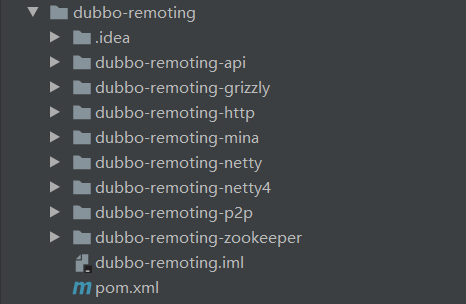
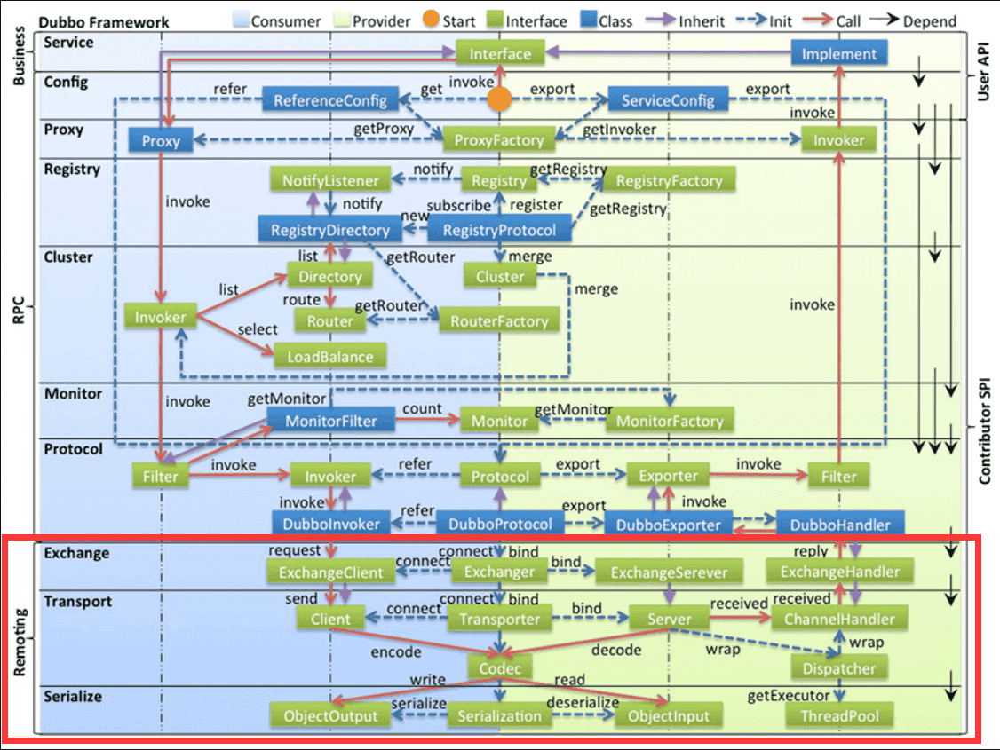

## dubbo-remoting 模块整体结构设计

服务治理框架 大致可分为 “服务通信” 和 “服务管理” 两部分，前面我们分析了有关注册中心的源码，也就是服务管理，接下来要分析的就是跟服务通信有关的源码，也就是远程通讯模块。该模块中提供了多种客户端和服务端通信的功能，而在对 NIO 框架选型上，dubbo 交由用户选择，它集成了 mina、netty、grizzly 等各类 NIO 框架来搭建 NIO 服务器和客户端，并且利用 dubbo 的 SPI 扩展机制可以让用户自定义选择。dubbo-remoting 的工程结构如下。



## dubbo-remoting-api 模块整体结构设计

本篇我们先来看一下 dubbo-remoting 中 dubbo-remoting-api 的项目结构。


dubbo-remoting-api 定义了远程通信模块最核心的 API，对于 dubbo-remoting-api 的解读会分为如下五个部分，其中第五部分会在本文介绍。

1. buffer 包：缓冲在 NIO 框架 中是很重要的存在，各个 NIO 框架 都实现了自己相应的缓存操作。这个 buffer 包 下包括了缓冲区的接口以及抽象类；
2. exchange 包：信息交换层，其中封装了请求响应模式，在传输层之上重新封装了 Request-Response 语义，为了满足 RPC 的需求。这层可以认为专注在 Request 和 Response 携带的信息上。该层是 RPC 调用 的通讯基础之一；
3. telnet 包：dubbo 支持通过 telnet 命令 来进行服务治理，该包下就封装了这些通用指令的逻辑实现；
4. transport 包：网络传输层，它只负责单向消息传输，是对 Mina、Netty、Grizzly 的抽象，它也可以扩展 UDP 传输，该层也是 RPC 调用 的通讯基础之一；
5. 最外层的源码：该部分也是我们接下来要重点解析的。

结合 dubbo-remoting-api 模块 的外层类和包划分，我们看看下面的官方架构图。



红框标注的部分是 dubbo 整体架构中的 远程通讯架构，其中 Exchange 组件 和 Transport 组件 在框架设计中起到了很重要的作用，也是支撑 Remoting 的核心。

## dubbo-remoting-api 模块最外层源码解析

### Endpoint 接口

dubbo 抽象出了一个端的概念，也就是 Endpoint 接口，这个端就是一个点，而点与点之间可以双向传输。在端的基础上再衍生出通道、客户端以及服务端的概念，也就是下面要介绍的 Channel、Client、Server 三个接口。在传输层，Client 和 Server 的区别只是语义上的区别，并不区分请求和应答职责，而在交换层，Client 和 Server 是有方向的端点，所以区分了明确的请求和应答职责。两者都具备发送的能力，只是客户端和服务端所关注的事情不一样，而 Endpoint 接口抽象的方法就是它们共同拥有的方法。这也就是它们都能被抽象成端的原因。

```java
/**
 * Endpoint. (API/SPI, Prototype, ThreadSafe)
 *
 * Endpoint 接口
 */
public interface Endpoint {

    /**
     * get url.
     *
     * @return url
     */
    URL getUrl();

    /**
     * get channel handler.
     *
     * 获得通道处理器
     *
     * @return channel handler
     */
    ChannelHandler getChannelHandler();

    /**
     * get local address.
     *
     * @return local address.
     */
    InetSocketAddress getLocalAddress();

    /**
     * send message.
     *
     * @param message 消息
     * @throws RemotingException
     */
    void send(Object message) throws RemotingException;

    /**
     * send message.
     *
     * @param message 消息
     * @param sent    already sent to socket?
     */
    void send(Object message, boolean sent) throws RemotingException;

    /**
     * close the channel.
     */
    void close();

    /**
     * Graceful close the channel.
     */
    void close(int timeout);

    void startClose();

    /**
     * is closed.
     *
     * @return closed
     */
    boolean isClosed();
}
```

### Channel 接口

该接口是通道接口，通道是信息传输的载体。Channel 可读可写，并且可以异步读写。Channel 是 client 和 server 的数据传输桥梁。Channel 和 client 是一对一的，也就是一个 client 对应一个 Channel，而 Channel 和 server 则是多对一，也就是一个 server 可以对应多个 Channel。

```java
/**
 * Channel. (API/SPI, Prototype, ThreadSafe)
 *
 * 通道接口
 * 可以看到 Channel 继承了 Endpoint，也就是端抽象出来的方法也同样是 channel 所需要的
 */
public interface Channel extends Endpoint {

	/** 获得远程地址 */
    InetSocketAddress getRemoteAddress();

    /** 判断通道是否连接 */
    boolean isConnected();

    /** 判断是否有该key的值 */
    boolean hasAttribute(String key);

    /** 获得该key对应的值 */
    Object getAttribute(String key);

    /** 设置属性 */
    void setAttribute(String key, Object value);

    /** 删除属性 */
    void removeAttribute(String key);
}
```

### ChannelHandler 接口

```java
/**
 * ChannelHandler. (API, Prototype, ThreadSafe)
 *
 * 通道处理器接口
 * 该接口负责Channel中的逻辑处理，可以看到这个接口有@SPI注解，是个可扩展接口
 */
@SPI
public interface ChannelHandler {

    /** 连接该通道 */
    void connected(Channel channel) throws RemotingException;

    /** 断开该通道 */
    void disconnected(Channel channel) throws RemotingException;

    /** 发送给这个通道消息 */
    void sent(Channel channel, Object message) throws RemotingException;

    /** 从这个通道内接收消息 */
    void received(Channel channel, Object message) throws RemotingException;

    /** 从这个通道内捕获异常 */
    void caught(Channel channel, Throwable exception) throws RemotingException;

}
```

### Client 和 Resetable 接口

```java
/**
 * Remoting Client. (API/SPI, Prototype, ThreadSafe)
 *
 * 客户端接口，可以看到它继承了 Endpoint、Channel 和 Resetable接口，继承Endpoint的原因上面已经提到过了，
 * 客户端和服务端其实只是语义上的不同，客户端就是一个点。继承 Channel 是因为客户端跟通道是一一对应的，
 * 所以做了这样的设计，还继承了 Resetable接口 是为了实现 reset方法，该方法已经打上 @Deprecated注解，不推荐使用。
 * 除了这些客户端就只需要关注一个重连的操作。
 */
public interface Client extends Endpoint, Channel, Resetable {

    /** 重连 */
    void reconnect() throws RemotingException;

    /** 重置，不推荐使用 */
    @Deprecated
    void reset(com.alibaba.dubbo.common.Parameters parameters);
}

public interface Resetable {

    // 用于根据新传入的 url 属性，重置自己内部的一些属性
    void reset(URL url);

}
```

### Server 接口

```java
/**
 * Remoting Server. (API/SPI, Prototype, ThreadSafe)
 *
 * 服务端接口，继承了 Endpoint 和 Resetable，继承 Endpoint 是因为服务端也是一个点，
 * 继承 Resetable接口 是为了继承 reset方法。除了这些以外，服务端独有的是检测是否启动成功，
 * 以及获得连接到 该服务端上的所有Channel，这里获得所有Channel其实就是获取所有连接该服务器的客户端
 */
public interface Server extends Endpoint, Resetable {

    /** 是否绑定本地端口，提供服务。即，是否启动成功，可连接，接收消息等 */
    boolean isBound();

    /** 获得连接到 服务端的通道们（客户端） */
    Collection<Channel> getChannels();

    /** 通过远程地址获得该地址对应的通道 */
    Channel getChannel(InetSocketAddress remoteAddress);

    @Deprecated
    void reset(com.alibaba.dubbo.common.Parameters parameters);
}
```

### Codec2 接口

这两个都是编解码器 接口，在网络中进行传输的数据 都是原始的字节序列，这就需要 发送端使用编码器把 要传输的有意义的信息 序列化成字节序列，接收端再使用解码器 把字节序列再反序列化成 有效信息，而同时具备这两种功能的单一组件就叫 编解码器。在 dubbo 中 Codec 是老编解码器接口，而 Codec2 是新编解码器接口，并且 dubbo 已经用 CodecAdapter 把 Codec 适配成 Codec2 了。所以在这里就只介绍下 Codec2 接口。

```java
/**
 * 编解码器接口，需要注意的是：
 * 1、Codec2 有 @SPI注解，是一个可扩展接口；
 * 2、用到了 Adaptive机制，首先去 url 中找 key 为 codec 的 value，来加载 url 携带的配置中指定的 codec的实现；
 * 3、该接口中有个枚举类型 DecodeResult，因为解码过程中，需要解决 TCP 拆包、粘包的场景，所以增加了这两种解码结果，
 *    关于TCP 拆包、粘包的场景 可用看一下Netty源码解析中的内容
 */
@SPI
public interface Codec2 {

    /** 编码 */
    @Adaptive({Constants.CODEC_KEY})
    void encode(Channel channel, ChannelBuffer buffer, Object message) throws IOException;

    /** 解码 */
    @Adaptive({Constants.CODEC_KEY})
    Object decode(Channel channel, ChannelBuffer buffer) throws IOException;

    /** 解码结果 */
    enum DecodeResult {
        /** 需要更多输入 */
        NEED_MORE_INPUT,
        /** 忽略一些输入 */
        SKIP_SOME_INPUT
    }
}
```

### Decodeable 接口

```java
/**
 * 可解码的接口，该接口有两个作用，第一是在调用真正的 decode方法 实现的时候会有一些校验，
 * 判断是否可以解码，并且对解码失败会有一些消息设置；第二个是被用来 message核对用的。
 * 后面看具体的实现会更了解该接口的作用。
 */
public interface Decodeable {

    /** 解码 */
    void decode() throws Exception;
}
```

### Dispatcher 接口

```java
/**
 * 调度器接口，不同的调度器实现，将操作转发到对应的线程池。
 * 其中 dispatch 是线程池的调度方法，需要注意的是：
 * 1、该接口是一个可扩展接口，并且默认实现AllDispatcher，也就是所有消息都派发到线程池，
 *    包括请求，响应，连接事件，断开事件，心跳等；
 * 2、用了 Adaptive注解，也就是按照 URL中的配置来加载实现类，后面两个参数是为了兼容老版本，
 *    如果这是三个key对应的值都为空，就选择AllDispatcher来实现。
 */
@SPI(AllDispatcher.NAME)
public interface Dispatcher {

    /** dispatch the message to threadpool. */
    @Adaptive({Constants.DISPATCHER_KEY, "dispather", "channel.handler"})
    // The last two parameters are reserved for compatibility with the old configuration
    ChannelHandler dispatch(ChannelHandler handler, URL url);
}
```

### Transporter 接口

```java
/**
 * 网络传输接口，需要注意的是：
 * 1、该接口是一个可扩展接口，并且默认实现 NettyTransporter；
 * 2、用了 dubbo SPI扩展机制中的Adaptive注解，加载对应的bind方法，使用url携带的server或者transporter属性值，
 *    加载对应的connect方法，使用url携带的client或者transporter属性值
 */
@SPI("netty")
public interface Transporter {

    /** 绑定一个服务器 */
    @Adaptive({Constants.SERVER_KEY, Constants.TRANSPORTER_KEY})
    Server bind(URL url, ChannelHandler handler) throws RemotingException;

    /**
     * 连接一个服务器，即创建一个客户端
     *
     * @param url     server url 服务器地址
     * @param handler 通道处理器
     * @return client 客户端
     * @throws RemotingException 当连接发生异常时
     */
    @Adaptive({Constants.CLIENT_KEY, Constants.TRANSPORTER_KEY})
    Client connect(URL url, ChannelHandler handler) throws RemotingException;
}
```

### Transporters 类

```java
/**
 * 1、该类用到了设计模式的外观模式，通过该类的包装，隐藏了内部具体的实现细节，降低了程序的复杂度，
 *    也提高了程序的可维护性。比如，它包装了调用各种实现 Transporter接口 的方法，
 *    通过 getTransporter 来获得 Transporter 的实现对象，具体实现哪个实现类，取决于url中携带的配置信息，
 *    如果url中没有相应的配置，则默认选择 @SPI 中的默认值 netty。
 * 2、bind 和 connect方法分别有两个重载方法，其中的操作只是把把字符串的url转化为URL对象。
 * 3、静态代码块中检测了一下jar包是否有重复。
 */
public class Transporters {

    static {
        // 检查重复的 jar包
        Version.checkDuplicate(Transporters.class);
        Version.checkDuplicate(RemotingException.class);
    }

    private Transporters() {
    }

    public static Server bind(String url, ChannelHandler... handler) throws RemotingException {
        return bind(URL.valueOf(url), handler);
    }

    public static Server bind(URL url, ChannelHandler... handlers) throws RemotingException {
        if (url == null) {
            throw new IllegalArgumentException("url == null");
        }
        if (handlers == null || handlers.length == 0) {
            throw new IllegalArgumentException("handlers == null");
        }
        // 创建 handler
        ChannelHandler handler;
        if (handlers.length == 1) {
            handler = handlers[0];
        } else {
            handler = new ChannelHandlerDispatcher(handlers);
        }
        // 调用Transporter的实现类对象的bind方法。
        // 例如实现NettyTransporter，则调用NettyTransporter的connect，并且返回相应的server
        return getTransporter().bind(url, handler);
    }

    public static Client connect(String url, ChannelHandler... handler) throws RemotingException {
        return connect(URL.valueOf(url), handler);
    }

    public static Client connect(URL url, ChannelHandler... handlers) throws RemotingException {
        if (url == null) {
            throw new IllegalArgumentException("url == null");
        }
        // 创建 handler
        ChannelHandler handler;
        if (handlers == null || handlers.length == 0) {
            handler = new ChannelHandlerAdapter();
        } else if (handlers.length == 1) {
            handler = handlers[0];
        } else {
            handler = new ChannelHandlerDispatcher(handlers);
        }
        // 调用Transporter的实现类对象的connect方法。
        // 例如实现NettyTransporter，则调用NettyTransporter的connect，并且返回相应的client
        return getTransporter().connect(url, handler);
    }

    public static Transporter getTransporter() {
        return ExtensionLoader.getExtensionLoader(Transporter.class).getAdaptiveExtension();
    }
}
```

### 远程通信的异常类

RemotingException、ExecutionException 和 TimeoutException 是远程通信的异常类，内容比较简单，这里就简单介绍下 一笔带过咯。

1. RemotingException 继承了 Exception 类，是远程通信的基础异常；
2. ExecutionException 继承了 RemotingException 类，ExecutionException 是远程通信的执行异常；
3. TimeoutException 继承了 RemotingException 类，TimeoutException 是超时异常。
