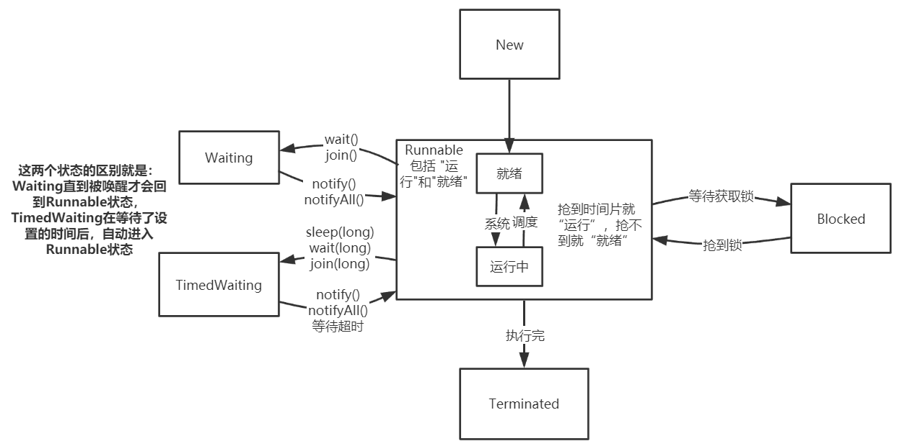

本来想看 ThreadLocal 的源码的，但发现其中最重要的 get/set 方法都是操纵的 Thread 类 中的 threadLocals 变量 (java.lang.ThreadLocal.ThreadLocalMap)，索性先来看一下 Thread 的源码吧，可以留意一下其中与 ThreadLocal 相关的属性，这样下次阅读 ThreadLocal 的核心 API 时，就能够轻易理解其原理咯。不多 BB，直接上硬菜。

实现多线程从本质上都是由 Thread 类 来完成的，其源码量很多，本次只看一些常见且重要的部分，源码和解析如下。

```java
public class Thread implements Runnable {
	/** 这里只看一些 常见的参数 */
	/** 线程名 */
	private volatile char name[];
	/** 优先级 */
	private int priority;
	/** 是否为守护线程 */
	private boolean daemon;
	/** 线程要执行的目标任务 */
	private Runnable target;
	/** 所属线程组 */
	private ThreadGroup group;
	/** 类加载器 */
	private ClassLoader contextClassLoader;
	/**
	 * ThreadLocal 能为线程设置线程私有变量 就是通过下面这个threadLocals变量完成的，
	 * ThreadLocal的get/set方法就是通过操作 各个线程的 threadLocals 变量实现的。
	 * 1、线程A持有一个 ThreadLocalMap 变量；
	 * 2、线程A调用一个类的 ThreadLocal变量 tlA 的 get/set方法；
	 * 3、tlA（ThreadLocal）的 get/set方法 获取当前线程A，调用 线程A 的 ThreadLocalMap变量 的get/put方法；
	 * 4、其它线程 调用 tlA（ThreadLocal）的 get/set方法 同理。
	 */
	ThreadLocal.ThreadLocalMap threadLocals;
	ThreadLocal.ThreadLocalMap inheritableThreadLocals;
	/** 线程栈的大小 */
	private long stackSize;
	/**
	 * Thread类定义了6个线程状态：New、Runnable、Blocked、Waiting、TimedWaiting、Terminated(终止)
	 * 实际上还会把 Runnable 再细分为 就绪(未抢到时间片) 和 运行中(抢到时间片)
	 */
	private volatile int threadStatus;
	/** 最小优先级 */
	public static final int MIN_PRIORITY = 1;
	/** 中等优先级 */
	public static final int NORM_PRIORITY = 5;
	/** 最大优先级 */
	public static final int MAX_PRIORITY = 10;

	/**
	 * 内部枚举类，用来描述线程状态，状态值有：
	 * NEW：          新建，还未调用start()方法；
	 * RUNNABLE：     运行，在java多线程模型中，就绪和运行都是运行状态；
	 * BLOCKED：      阻塞；
	 * WAITING：      等待，需要其他的线程来唤醒；
	 * TIMED_WAITING：超时等待，可以在指定的时间内自动醒来，如 sleep()方法；
	 * TERMINATED：   终止，线程执行完毕。
	 */
	public static final class State extends Enum {

		public static final State NEW;
		public static final State RUNNABLE;
		public static final State BLOCKED;
		public static final State WAITING;
		public static final State TIMED_WAITING;
		public static final State TERMINATED;
		private static final State VALUES[];

		static {
			NEW = new State("NEW", 0);
			RUNNABLE = new State("RUNNABLE", 1);
			BLOCKED = new State("BLOCKED", 2);
			WAITING = new State("WAITING", 3);
			TIMED_WAITING = new State("TIMED_WAITING", 4);
			TERMINATED = new State("TERMINATED", 5);
			VALUES = (new State[] { NEW, RUNNABLE, BLOCKED, WAITING, TIMED_WAITING, TERMINATED });
		}

		private State(String s, int i) {
			super(s, i);
		}
	}

	/**
	 * 一系列 构造方法 ------------------------------------------------------
	 * 可以看出来，其中都调用了init()方法，这也是一个约定俗成的规矩， 即，如果要在 new 时进行一些初始化操作，
	 * 那么请将初始化操作单独写在 init()方法中，然后在构造函数中调用该 init()方法
	 */
	public Thread() {
		daemon = false;
		stillborn = false;
		threadLocals = null;
		inheritableThreadLocals = null;
		threadStatus = 0;
		blockerLock = new Object();
		init(null, null, (new StringBuilder()).append("Thread-").append(nextThreadNum()).toString(), 0L);
	}

	public Thread(Runnable runnable) {
		daemon = false;
		stillborn = false;
		threadLocals = null;
		inheritableThreadLocals = null;
		threadStatus = 0;
		blockerLock = new Object();
		init(null, runnable, (new StringBuilder()).append("Thread-").append(nextThreadNum()).toString(), 0L);
	}

	Thread(Runnable runnable, AccessControlContext accesscontrolcontext) {
		daemon = false;
		stillborn = false;
		threadLocals = null;
		inheritableThreadLocals = null;
		threadStatus = 0;
		blockerLock = new Object();
		init(null, runnable, (new StringBuilder()).append("Thread-").append(nextThreadNum()).toString(), 0L,
				accesscontrolcontext);
	}

	public Thread(ThreadGroup threadgroup, Runnable runnable) {
		daemon = false;
		stillborn = false;
		threadLocals = null;
		inheritableThreadLocals = null;
		threadStatus = 0;
		blockerLock = new Object();
		init(threadgroup, runnable, (new StringBuilder()).append("Thread-").append(nextThreadNum()).toString(), 0L);
	}

	public Thread(String s) {
		daemon = false;
		stillborn = false;
		threadLocals = null;
		inheritableThreadLocals = null;
		threadStatus = 0;
		blockerLock = new Object();
		init(null, null, s, 0L);
	}

	public Thread(ThreadGroup threadgroup, String s) {
		daemon = false;
		stillborn = false;
		threadLocals = null;
		inheritableThreadLocals = null;
		threadStatus = 0;
		blockerLock = new Object();
		init(threadgroup, null, s, 0L);
	}

	public Thread(Runnable runnable, String s) {
		daemon = false;
		stillborn = false;
		threadLocals = null;
		inheritableThreadLocals = null;
		threadStatus = 0;
		blockerLock = new Object();
		init(null, runnable, s, 0L);
	}

	public Thread(ThreadGroup threadgroup, Runnable runnable, String s) {
		daemon = false;
		stillborn = false;
		threadLocals = null;
		inheritableThreadLocals = null;
		threadStatus = 0;
		blockerLock = new Object();
		init(threadgroup, runnable, s, 0L);
	}

	public Thread(ThreadGroup threadgroup, Runnable runnable, String s, long l) {
		daemon = false;
		stillborn = false;
		threadLocals = null;
		inheritableThreadLocals = null;
		threadStatus = 0;
		blockerLock = new Object();
		init(threadgroup, runnable, s, l);
	}

	private void init(ThreadGroup threadgroup, Runnable runnable, String s, long l) {
		init(threadgroup, runnable, s, l, null);
	}

	/**
	 * 初始化线程
	 */
	private void init(ThreadGroup threadgroup, Runnable runnable, String name, long l,
			AccessControlContext accesscontrolcontext) {

		// 参数校验，线程name不能为null
		if (name == null)
			throw new NullPointerException("name cannot be null");
		this.name = name.toCharArray();
		// 当前线程就是该线程的父线程
		Thread parent = currentThread();
		SecurityManager securitymanager = System.getSecurityManager();
		if (threadgroup == null) {
			if (securitymanager != null)
				threadgroup = securitymanager.getThreadGroup();
			if (threadgroup == null)
				threadgroup = parent.getThreadGroup();
		}
		threadgroup.checkAccess();
		if (securitymanager != null && isCCLOverridden(getClass()))
			securitymanager.checkPermission(SUBCLASS_IMPLEMENTATION_PERMISSION);
		threadgroup.addUnstarted();
		// 守护线程、优先级等设置为父线程的对应属性
		group = threadgroup;
		daemon = parent.isDaemon();
		priority = parent.getPriority();
		if (securitymanager == null || isCCLOverridden(parent.getClass()))
			contextClassLoader = parent.getContextClassLoader();
		else
			contextClassLoader = parent.contextClassLoader;
		inheritedAccessControlContext = accesscontrolcontext == null ? AccessController.getContext()
				: accesscontrolcontext;
		target = runnable;
		setPriority(priority);
		if (parent.inheritableThreadLocals != null)
			// 创建线程共享变量副本
			inheritableThreadLocals = ThreadLocal.createInheritedMap(parent.inheritableThreadLocals);
		stackSize = l;
		// 分配线程id
		tid = nextThreadID();
	}

	public synchronized void start() {
	    //假若当前线程初始化还未做好，不能start，0->NEW状态
	    if (threadStatus != 0)
	        throw new IllegalThreadStateException();

	    //通知group该线程即将启动，group的未启动线程数量减1
	    group.add(this);

	    boolean started = false;
	    try {
	    	// 调用native的start0()方法 启动线程，启动后执行run()方法
	        start0();
	        started = true;
	    } finally {
	        try {
	            //启动不成功，group设置当前线程启动失败
	            if (!started) {
	                group.threadStartFailed(this);
	            }
	        } catch (Throwable ignore) {

	        }
	    }
	}

	private native void start0();

	public void run() {
		if (target != null)
			target.run();
	}

	/**
	 * 请求终止线程。interrupt不会真正停止一个线程，它仅仅是给这个线程发了一个信号，
	 * 告诉它要结束了，具体要中断还是继续运行，将由被通知的线程自己处理
	 */
	public void interrupt() {
	    if (this != Thread.currentThread())
	        checkAccess();
	    synchronized (blockerLock) {
	        Interruptible b = blocker;
	        if (b != null) {
	            interrupt0();
	            b.interrupt(this);
	            return;
	        }
	    }
	    interrupt0();
	}

	private native void interrupt0();

	/**
	 * 线程main 调用了线程A的join方法，则 线程main 会被阻塞，直到线程A执行完毕
	 */
    public final void join() throws InterruptedException {
        join(0);
    }

	/**
	 * 实际上是利用 wait/notify机制 来实现的
	 */
    public final synchronized void join(long millis) throws InterruptedException {
        long base = System.currentTimeMillis();
        long now = 0;

        if (millis < 0) {
            throw new IllegalArgumentException("timeout value is negative");
        }
		// millis 为 0，所以走这个分支
        if (millis == 0) {
        	// 当前线程是否还在运行，还在运行 则main线程 进入等待状态，直到 A线程运行完毕，将其唤醒
            while (isAlive()) {
                wait(0);
            }
        } else {
            while (isAlive()) {
                long delay = millis - now;
                if (delay <= 0) {
                    break;
                }
                wait(delay);
                now = System.currentTimeMillis() - base;
            }
        }
    }

	/**
	 * 线程睡眠指定的时间，释放CPU资源，但不释放锁
	 */
	public static native void sleep(long millis) throws InterruptedException;

	/**
	 * 线程是否还在运行
	 */
	public final native boolean isAlive();
}
```

之前一直对线程状态 及 状态切换的概念模糊不清，现在通过源码中对线程状态的定义，我们可以画张图来重新回顾一下，以使我们对其有更加深刻的理解。


