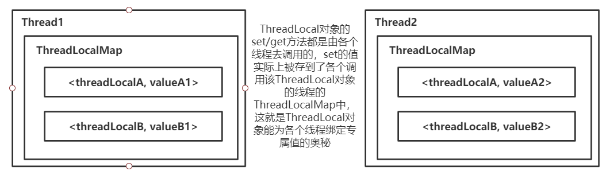

前面我们分析了 Thread 类的源码，有了前面的铺垫，通过源码 理解 ThreadLocal 的秘密就容易多了。

ThreadLocal 类 提供了 get/set 线程局部变量的实现，ThreadLocal 成员变量与正常的成员变量不同，每个线程都可以通过 ThreadLocal 成员变量 get/set 自己的专属值。ThreadLocal 实例 通常是类中的私有静态变量，常用于将状态与线程关联，例如：用户 ID 或事务 ID。

tips：在类中定义 ThreadLocal 变量时，一般在定义时就进行实例化！

```java
public class ThreadLocal<T> {

    /**
     * ThreadLocal能为每个 Thread线程 绑定一个专属值的奥秘就是：
     * 每个Thread对象都持有一个 ThreadLocalMap类型的成员变量，其key为ThreadLocal对象，
     * value为绑定的值，所以每个线程调用 ThreadLocal对象 的set(T value)方法时，都会将
     * 该ThreadLocal对象和绑定的值 以键值对的形式存入当前线程，这样，同一个ThreadLocal对象
     * 就可以为每个线程绑定一个专属值咯。
     * 每个线程调用 ThreadLocal对象的get()方法时，就可以根据 当前ThreadLocal对象 get到 绑定的值。
     */
    public void set(T value) {
    	// 获取当前线程
        Thread t = Thread.currentThread();
        // 获取当前线程对象中持有的 ThreadLocalMap类型的成员变量
        // ThreadLocalMap，看名字也知道它是一个 Map类型的 类
        ThreadLocalMap map = getMap(t);
        if (map != null)
            map.set(this, value);
        else
            createMap(t, value);
    }

    ThreadLocalMap getMap(Thread t) {
    	// 经过前面对 Thread类 源码的分析，可以知道，Thread类中有一个 ThreadLocalMap 类型的
    	// threadLocals变量
        return t.threadLocals;
    }

    void createMap(Thread t, T firstValue) {
        t.threadLocals = new ThreadLocalMap(this, firstValue);
    }

    public T get() {
        Thread t = Thread.currentThread();
        ThreadLocalMap map = getMap(t);
        if (map != null) {
        	// 通过当前 ThreadLocal对象，获取绑定的值
            ThreadLocalMap.Entry e = map.getEntry(this);
            if (e != null) {
                @SuppressWarnings("unchecked")
                T result = (T)e.value;
                return result;
            }
        }
        return setInitialValue();
    }

     public void remove() {
     	 // 获取当前线程的ThreadLocalMap成员变量，不为空就将当前 ThreadLocal对象
     	 // 对应的 键值对 remove掉
         ThreadLocalMap m = getMap(Thread.currentThread());
         if (m != null)
             m.remove(this);
     }

    /**
     * 与大部分 Map 的实现相同，底层也是使用 动态数组来保存 键值对Entry，也有rehash、resize等
     * 操作
     */
    static class ThreadLocalMap {

        /**
         * 存储键值对，key 为 ThreadLocal对象，value 为 与该ThreadLocal对象绑定的值
         * Entry的key是对ThreadLocal的弱引用，当抛弃掉ThreadLocal对象时，垃圾收集器会
         * 忽略这个key的引用而清理掉ThreadLocal对象，防止了内存泄漏
         */
        static class Entry extends WeakReference<ThreadLocal<?>> {
            Object value;

            Entry(ThreadLocal<?> k, Object v) {
                super(k);
                value = v;
            }
        }

		// 看过 HashMap 或 ConcurrentHashMap 源码的同学 一定下面对这些代码很眼熟
        /**
         * 数组初始容量
         */
        private static final int INITIAL_CAPACITY = 16;

        /**
         * Entry数组，用于存储 <ThreadLocal<?> k, Object v>键值对
         */
        private Entry[] table;

        /**
         * Entry元素数量
         */
        private int size = 0;

        /**
         * 类似于 HashMap 扩容因子机制
         */
        private int threshold; // Default to 0
        private void setThreshold(int len) {
            threshold = len * 2 / 3;
        }

        private static int nextIndex(int i, int len) {
            return ((i + 1 < len) ? i + 1 : 0);
        }

        private static int prevIndex(int i, int len) {
            return ((i - 1 >= 0) ? i - 1 : len - 1);
        }

        /**
         * 系列构造方法
         */
        ThreadLocalMap(ThreadLocal<?> firstKey, Object firstValue) {
            table = new Entry[INITIAL_CAPACITY];
            int i = firstKey.threadLocalHashCode & (INITIAL_CAPACITY - 1);
            table[i] = new Entry(firstKey, firstValue);
            size = 1;
            setThreshold(INITIAL_CAPACITY);
        }

        private ThreadLocalMap(ThreadLocalMap parentMap) {
            Entry[] parentTable = parentMap.table;
            int len = parentTable.length;
            setThreshold(len);
            table = new Entry[len];

            for (int j = 0; j < len; j++) {
                Entry e = parentTable[j];
                if (e != null) {
                    @SuppressWarnings("unchecked")
                    ThreadLocal<Object> key = (ThreadLocal<Object>) e.get();
                    if (key != null) {
                        Object value = key.childValue(e.value);
                        Entry c = new Entry(key, value);
                        int h = key.threadLocalHashCode & (len - 1);
                        while (table[h] != null)
                            h = nextIndex(h, len);
                        table[h] = c;
                        size++;
                    }
                }
            }
        }

        /**
         * 根据 ThreadLocal对象 获取其对应的 Entry实例
         */
        private Entry getEntry(ThreadLocal<?> key) {
            int i = key.threadLocalHashCode & (table.length - 1);
            Entry e = table[i];
            if (e != null && e.get() == key)
                return e;
            else
                return getEntryAfterMiss(key, i, e);
        }

        /**
         * 常规Map实现类 的set()方法，只不过这里的 key被规定为 ThreadLocal类型
         */
        private void set(ThreadLocal<?> key, Object value) {

            Entry[] tab = table;
            int len = tab.length;
            // 根据哈希码和数组长度求元素放置的位置，如果该位置有其它元素，就依次尝试往后放
            int i = key.threadLocalHashCode & (len-1);

            for (Entry e = tab[i];
                 e != null;
                 e = tab[i = nextIndex(i, len)]) {
                ThreadLocal<?> k = e.get();
				// 如果key相等，覆盖value
                if (k == key) {
                    e.value = value;
                    return;
                }
				// 如果key为null，用新key、value覆盖，同时清理历史key=null的陈旧数据
                if (k == null) {
                    replaceStaleEntry(key, value, i);
                    return;
                }
            }

            tab[i] = new Entry(key, value);
            int sz = ++size;
            // 若超过阀值，则rehash
            if (!cleanSomeSlots(i, sz) && sz >= threshold)
                rehash();
        }

        /**
         * Remove the entry for key.
         */
        private void remove(ThreadLocal<?> key) {
            Entry[] tab = table;
            int len = tab.length;
            int i = key.threadLocalHashCode & (len-1);
            for (Entry e = tab[i];
                 e != null;
                 e = tab[i = nextIndex(i, len)]) {
                if (e.get() == key) {
                    e.clear();
                    expungeStaleEntry(i);
                    return;
                }
            }
        }

        /**
         * 调整当前table的容量。首先扫描整个容器，以删除过时的条目，如果这不能充分缩小表的大小，
         * 将进行扩容操作
         */
        private void rehash() {
        	// 扫描整个容器，删除过时的条目
            expungeStaleEntries();

            // 若未能充分缩小表的大小，则进行扩容操作
            if (size >= threshold - threshold / 4)
                resize();
        }

        /**
         * 扩容为原容量的两倍
         */
        private void resize() {
            Entry[] oldTab = table;
            int oldLen = oldTab.length;
            int newLen = oldLen * 2;
            Entry[] newTab = new Entry[newLen];
            int count = 0;
			// 遍历Entry[]数组
            for (int j = 0; j < oldLen; ++j) {
                Entry e = oldTab[j];
                if (e != null) {
                    ThreadLocal<?> k = e.get();
                    // 如果key=null，把value也置null,有助于GC回收对象
                    if (k == null) {
                        e.value = null; // Help the GC
                    } else {
                        int h = k.threadLocalHashCode & (newLen - 1);
                        while (newTab[h] != null)
                            h = nextIndex(h, newLen);
                        newTab[h] = e;
                        count++;
                    }
                }
            }
			// 设置新的阈值
            setThreshold(newLen);
            size = count;
            table = newTab;
        }
    }
}
```

简单画个图总结一下 ThreadLocal 的原理，如下。



最后强调一下 ThreadLocal 的使用注意事项：

1. ThreadLocal 不是用来解决线程安全问题的，多线程不共享，不存在竞争！其目的是使线程能够使用本地变量。

2. 项目如果使用了线程池，那么线程回收后 ThreadLocal 变量要 remove 掉，否则线程池回收线程后，变量还在内存中，可能会带来意想不到的后果！例如 Tomcat 容器的线程池，可以在拦截器中处理：继承 HandlerInterceptorAdapter，然后复写 afterCompletion()方法，remove 掉变量！！！
