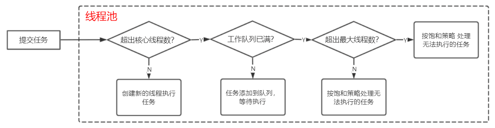

## 线程池核心组件图解

看源码之前，先了解一下该组件 最主要的几个 接口、抽象类和实现类的结构关系。


该组件中，Executor 和 ExecutorService 接口 定义了线程池最核心的几个方法，提交任务 submit
()、关闭线程池 shutdown()。抽象类 AbstractExecutorService 主要对公共行为 submit()系列方法进行了实现，这些 submit()方法 的实现使用了 模板方法模式，其中调用的 execute()方法 是未实现的 来自 Executor 接口 的方法。实现类 ThreadPoolExecutor 则对线程池进行了具体而复杂的实现。

另外还有一个常见的工具类 Executors，里面为开发者封装了一些可以直接拿来用的线程池。

## 源码赏析

话不多说，直接上源码。（这里只看最主要的代码部分）

### Executor 和 ExecutorService 接口

```java
public interface Executor {

    /**
     * 在将来的某个时间执行给定的 Runnable。该 Runnable 可以在新线程、池线程或调用线程中执行。
     */
    void execute(Runnable command);
}

public interface ExecutorService extends Executor {

    /**
     * 优雅关闭，该关闭会继续执行完以前提交的任务，但不再接受新任务。
     */
    void shutdown();

    /**
     * 提交一个有返回值的任务，并返回该任务的 未来执行完成后的结果。
     * Future的 get()方法 将在成功完成后返回任务的结果。
     */
    <T> Future<T> submit(Callable<T> task);

    <T> Future<T> submit(Runnable task, T result);

    Future<?> submit(Runnable task);
}
```

### AbstractExecutorService 抽象类

```java
/**
 * 该抽象类最主要的内容就是，实现了 ExecutorService 中的 submit()系列方法
 */
public abstract class AbstractExecutorService implements ExecutorService {

    /**
     * 提交任务 进行执行，返回获取未来结果的 Future对象。
     * 这里使用了 “模板方法模式”，execute()方法来自 Executor接口，该抽象类中并未进行实现，
     * 而是交由子类具体实现。
     */
    public Future<?> submit(Runnable task) {
        if (task == null) throw new NullPointerException();
        RunnableFuture<Void> ftask = newTaskFor(task, null);
        execute(ftask);
        return ftask;
    }

    public <T> Future<T> submit(Runnable task, T result) {
        if (task == null) throw new NullPointerException();
        RunnableFuture<T> ftask = newTaskFor(task, result);
        execute(ftask);
        return ftask;
    }

    public <T> Future<T> submit(Callable<T> task) {
        if (task == null) throw new NullPointerException();
        RunnableFuture<T> ftask = newTaskFor(task);
        execute(ftask);
        return ftask;
    }
}
```

### ThreadPoolExecutor

```java
public class ThreadPoolExecutor extends AbstractExecutorService {

    /**
     * **************
     * ** 主要属性 **
     * **************
     */

	/** 阻塞队列 */
    private final BlockingQueue<Runnable> workQueue;

    /** 用于创建线程的 线程工厂 */
    private volatile ThreadFactory threadFactory;

    /** 核心线程数 */
    private volatile int corePoolSize;

    /** 最大线程数 */
    private volatile int maximumPoolSize;


    /**
     * **************
     * ** 构造方法 **
     * **************
     */

    /** 最后都使用了最后一个构造方法的实现 */
    public ThreadPoolExecutor(int corePoolSize,
                              int maximumPoolSize,
                              long keepAliveTime,
                              TimeUnit unit,
                              BlockingQueue<Runnable> workQueue) {
        this(corePoolSize, maximumPoolSize, keepAliveTime, unit, workQueue,
             Executors.defaultThreadFactory(), defaultHandler);
    }

    public ThreadPoolExecutor(int corePoolSize,
                              int maximumPoolSize,
                              long keepAliveTime,
                              TimeUnit unit,
                              BlockingQueue<Runnable> workQueue,
                              ThreadFactory threadFactory) {
        this(corePoolSize, maximumPoolSize, keepAliveTime, unit, workQueue,
             threadFactory, defaultHandler);
    }

    public ThreadPoolExecutor(int corePoolSize,
                              int maximumPoolSize,
                              long keepAliveTime,
                              TimeUnit unit,
                              BlockingQueue<Runnable> workQueue,
                              RejectedExecutionHandler handler) {
        this(corePoolSize, maximumPoolSize, keepAliveTime, unit, workQueue,
             Executors.defaultThreadFactory(), handler);
    }

    public ThreadPoolExecutor(int corePoolSize,
                              int maximumPoolSize,
                              long keepAliveTime,
                              TimeUnit unit,
                              BlockingQueue<Runnable> workQueue,
                              ThreadFactory threadFactory,
                              RejectedExecutionHandler handler) {
        if (corePoolSize < 0 ||
            maximumPoolSize <= 0 ||
            maximumPoolSize < corePoolSize ||
            keepAliveTime < 0)
            throw new IllegalArgumentException();
        if (workQueue == null || threadFactory == null || handler == null)
            throw new NullPointerException();
        this.corePoolSize = corePoolSize;
        this.maximumPoolSize = maximumPoolSize;
        this.workQueue = workQueue;
        this.keepAliveTime = unit.toNanos(keepAliveTime);
        this.threadFactory = threadFactory;
        this.handler = handler;
    }

    /**
     * **************
     * ** 主要实现 **
     * **************
     */

	/** 执行 Runnable任务 */
    public void execute(Runnable command) {
        if (command == null)
            throw new NullPointerException();
        /*
         * 分三步进行：
         *
         * 1、如果运行的线程少于 corePoolSize，尝试开启一个新的线程；否则尝试进入工作队列
         *
         * 2. 如果工作队列没满，则进入工作队列；否则 判断是否超出最大线程数
         *
         * 3. 如果未超出最大线程数，则尝试开启一个新的线程；否则 按饱和策略处理无法执行的任务
         */
        int c = ctl.get();
        if (workerCountOf(c) < corePoolSize) {
            if (addWorker(command, true))
                return;
            c = ctl.get();
        }
        if (isRunning(c) && workQueue.offer(command)) {
            int recheck = ctl.get();
            if (! isRunning(recheck) && remove(command))
                reject(command);
            else if (workerCountOf(recheck) == 0)
                addWorker(null, false);
        }
        else if (!addWorker(command, false))
            reject(command);
    }

    /**
     * 优雅关闭，在其中执行以前提交的任务，但不接受新任务。如果已关闭，则调用没有其他效果。
     */
    public void shutdown() {
        final ReentrantLock mainLock = this.mainLock;
        mainLock.lock();
        try {
            checkShutdownAccess();
            advanceRunState(SHUTDOWN);
            interruptIdleWorkers();
            onShutdown(); // hook for ScheduledThreadPoolExecutor
        } finally {
            mainLock.unlock();
        }
        tryTerminate();
    }
}
```

ThreadPoolExecutor 中的 execute()方法 执行 Runnable 任务 的流程逻辑可以用下图表示。



### 工具类 Executors

看类名也知道，它最主要的作用就是提供 static 的工具方法，为开发者提供各种封装好的 具有各自特性的线程池。

```java
public class Executors {

    /**
     * 创建一个固定线程数量的线程池
     */
    public static ExecutorService newFixedThreadPool(int nThreads) {
        return new ThreadPoolExecutor(nThreads, nThreads,
                                      0L, TimeUnit.MILLISECONDS,
                                      new LinkedBlockingQueue<Runnable>());
    }

    /**
     * 创建一个单线程的线程池
     */
    public static ExecutorService newSingleThreadExecutor() {
        return new FinalizableDelegatedExecutorService
            (new ThreadPoolExecutor(1, 1,
                                    0L, TimeUnit.MILLISECONDS,
                                    new LinkedBlockingQueue<Runnable>()));
    }

    /**
     * 创建一个缓存的，可动态伸缩的线程池。
     * 可以看出来：核心线程数为0，最大线程数为Integer.MAX_VALUE，如果任务数在某一瞬间暴涨，
     * 这个线程池很可能会把 服务器撑爆。
     * 另外需要注意的是，它们底层都是使用了 ThreadPoolExecutor，只不过帮我们配好了参数
     */
    public static ExecutorService newCachedThreadPool() {
        return new ThreadPoolExecutor(0, Integer.MAX_VALUE,
                                      60L, TimeUnit.SECONDS,
                                      new SynchronousQueue<Runnable>());
    }
}
```
