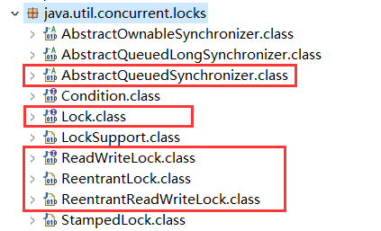
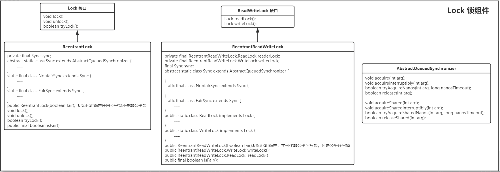

## 类图结构

J.U.C 的锁组件中 类相对较少，从 JDK 相应的包中也能看出来，下图标记了其中最主要的几个接口和类，也是本文要分析的重点。



下图 将这几个接口和类 以类图的方式展现出来，其中包含了它们所声明的主要方法。



## Lock 组件

Lock 组件的结构很简单，只有一个接口和一个实现类，源码如下。

```java
public interface Lock {

    /**
     * 获取锁
     */
    void lock();

    /**
     * 获取锁，除非当前线程中断
     */
    void lockInterruptibly() throws InterruptedException;

    /**
     * 只有当调用时 锁是空闲的情况下，才获取锁
     */
    boolean tryLock();

    /**
     * 如果锁在给定的等待时间内空闲且当前线程未被中断，则获取该锁
     */
    boolean tryLock(long time, TimeUnit unit) throws InterruptedException;

    /**
     * 释放锁
     */
    void unlock();
}

public class ReentrantLock implements Lock, java.io.Serializable {

	/** 提供所有实现机制的同步器，ReentrantLock 的主要方法都依赖于该对象进行实现 */
    private final Sync sync;

    /**
     * ReentrantLock锁 的同步控制基础。它的两个子类分别实现了公平锁和非公平锁，如下。
     */
    abstract static class Sync extends AbstractQueuedSynchronizer {
        private static final long serialVersionUID = -5179523762034025860L;

        abstract void lock();

        /**
         * Performs non-fair tryLock.  tryAcquire is implemented in
         * subclasses, but both need nonfair try for trylock method.
         */
        final boolean nonfairTryAcquire(int acquires) {
            final Thread current = Thread.currentThread();
            int c = getState();
            if (c == 0) {
                if (compareAndSetState(0, acquires)) {
                    setExclusiveOwnerThread(current);
                    return true;
                }
            }
            else if (current == getExclusiveOwnerThread()) {
                int nextc = c + acquires;
                if (nextc < 0) // overflow
                    throw new Error("Maximum lock count exceeded");
                setState(nextc);
                return true;
            }
            return false;
        }

        protected final boolean tryRelease(int releases) {
            int c = getState() - releases;
            if (Thread.currentThread() != getExclusiveOwnerThread())
                throw new IllegalMonitorStateException();
            boolean free = false;
            if (c == 0) {
                free = true;
                setExclusiveOwnerThread(null);
            }
            setState(c);
            return free;
        }

        final boolean isLocked() {
            return getState() != 0;
        }
    }

    /**
     * 非公平锁，基于上面的 Sync类
     */
    static final class NonfairSync extends Sync {
        private static final long serialVersionUID = 7316153563782823691L;

        final void lock() {
            if (compareAndSetState(0, 1))
                setExclusiveOwnerThread(Thread.currentThread());
            else
                acquire(1);
        }

        protected final boolean tryAcquire(int acquires) {
            return nonfairTryAcquire(acquires);
        }
    }

    /**
     * 公平锁，基于上面的 Sync类
     */
    static final class FairSync extends Sync {
        private static final long serialVersionUID = -3000897897090466540L;

        final void lock() {
            acquire(1);
        }

        protected final boolean tryAcquire(int acquires) {
            final Thread current = Thread.currentThread();
            int c = getState();
            if (c == 0) {
                if (!hasQueuedPredecessors() &&
                    compareAndSetState(0, acquires)) {
                    setExclusiveOwnerThread(current);
                    return true;
                }
            }
            else if (current == getExclusiveOwnerThread()) {
                int nextc = c + acquires;
                if (nextc < 0)
                    throw new Error("Maximum lock count exceeded");
                setState(nextc);
                return true;
            }
            return false;
        }
    }

    /**
     * 无参初始化时，默认实例化 非公平锁
     */
    public ReentrantLock() {
        sync = new NonfairSync();
    }

    /**
     * 可通过参数fair 控制实例化的是 公平锁还是非公平锁
     */
    public ReentrantLock(boolean fair) {
        sync = fair ? new FairSync() : new NonfairSync();
    }

    public void lock() {
        sync.lock();
    }

    public boolean tryLock() {
        return sync.nonfairTryAcquire(1);
    }

    public boolean tryLock(long timeout, TimeUnit unit)
            throws InterruptedException {
        return sync.tryAcquireNanos(1, unit.toNanos(timeout));
    }

    public void unlock() {
        sync.release(1);
    }

    public boolean isLocked() {
        return sync.isLocked();
    }

    public final boolean isFair() {
        return sync instanceof FairSync;
    }
}
```

## ReadWriteLock 组件

ReadWriteLock 组件的结构也很简单，与上面的 Lock 组件 不同的是，它提供了 公平的读锁写锁，以及非公平的读锁写锁。

```java
public interface ReadWriteLock {
    /**
     * 获取一个 读锁
     */
    Lock readLock();

    /**
     * 获取一个 写锁
     */
    Lock writeLock();
}

public class ReentrantReadWriteLock implements ReadWriteLock, java.io.Serializable {

    /** 由内部类提供的读锁 */
    private final ReentrantReadWriteLock.ReadLock readerLock;
    /** 由内部类提供的写锁 */
    private final ReentrantReadWriteLock.WriteLock writerLock;
    /** 提供所有实现机制的同步器 */
    final Sync sync;

    /**
     * 默认创建 非公平的读锁写锁
     */
    public ReentrantReadWriteLock() {
        this(false);
    }

    /**
     * 由参数 fair 指定读锁写锁是公平的还是非公平的
     */
    public ReentrantReadWriteLock(boolean fair) {
        sync = fair ? new FairSync() : new NonfairSync();
        readerLock = new ReadLock(this);
        writerLock = new WriteLock(this);
    }

    /**
     * 获取写锁
     * 获取读锁
     */
    public ReentrantReadWriteLock.WriteLock writeLock() { return writerLock; }
    public ReentrantReadWriteLock.ReadLock  readLock()  { return readerLock; }

    abstract static class Sync extends AbstractQueuedSynchronizer {

        protected final boolean tryRelease(int releases) {
            if (!isHeldExclusively())
                throw new IllegalMonitorStateException();
            int nextc = getState() - releases;
            boolean free = exclusiveCount(nextc) == 0;
            if (free)
                setExclusiveOwnerThread(null);
            setState(nextc);
            return free;
        }

        protected final boolean tryAcquire(int acquires) {
            /*
             * Walkthrough:
             * 1. If read count nonzero or write count nonzero
             *    and owner is a different thread, fail.
             * 2. If count would saturate, fail. (This can only
             *    happen if count is already nonzero.)
             * 3. Otherwise, this thread is eligible for lock if
             *    it is either a reentrant acquire or
             *    queue policy allows it. If so, update state
             *    and set owner.
             */
            Thread current = Thread.currentThread();
            int c = getState();
            int w = exclusiveCount(c);
            if (c != 0) {
                // (Note: if c != 0 and w == 0 then shared count != 0)
                if (w == 0 || current != getExclusiveOwnerThread())
                    return false;
                if (w + exclusiveCount(acquires) > MAX_COUNT)
                    throw new Error("Maximum lock count exceeded");
                // Reentrant acquire
                setState(c + acquires);
                return true;
            }
            if (writerShouldBlock() ||
                !compareAndSetState(c, c + acquires))
                return false;
            setExclusiveOwnerThread(current);
            return true;
        }

        protected final boolean tryReleaseShared(int unused) {
            Thread current = Thread.currentThread();
            if (firstReader == current) {
                // assert firstReaderHoldCount > 0;
                if (firstReaderHoldCount == 1)
                    firstReader = null;
                else
                    firstReaderHoldCount--;
            } else {
                HoldCounter rh = cachedHoldCounter;
                if (rh == null || rh.tid != getThreadId(current))
                    rh = readHolds.get();
                int count = rh.count;
                if (count <= 1) {
                    readHolds.remove();
                    if (count <= 0)
                        throw unmatchedUnlockException();
                }
                --rh.count;
            }
            for (;;) {
                int c = getState();
                int nextc = c - SHARED_UNIT;
                if (compareAndSetState(c, nextc))
                    // Releasing the read lock has no effect on readers,
                    // but it may allow waiting writers to proceed if
                    // both read and write locks are now free.
                    return nextc == 0;
            }
        }

        protected final int tryAcquireShared(int unused) {
            /*
             * Walkthrough:
             * 1. If write lock held by another thread, fail.
             * 2. Otherwise, this thread is eligible for
             *    lock wrt state, so ask if it should block
             *    because of queue policy. If not, try
             *    to grant by CASing state and updating count.
             *    Note that step does not check for reentrant
             *    acquires, which is postponed to full version
             *    to avoid having to check hold count in
             *    the more typical non-reentrant case.
             * 3. If step 2 fails either because thread
             *    apparently not eligible or CAS fails or count
             *    saturated, chain to version with full retry loop.
             */
            Thread current = Thread.currentThread();
            int c = getState();
            if (exclusiveCount(c) != 0 &&
                getExclusiveOwnerThread() != current)
                return -1;
            int r = sharedCount(c);
            if (!readerShouldBlock() &&
                r < MAX_COUNT &&
                compareAndSetState(c, c + SHARED_UNIT)) {
                if (r == 0) {
                    firstReader = current;
                    firstReaderHoldCount = 1;
                } else if (firstReader == current) {
                    firstReaderHoldCount++;
                } else {
                    HoldCounter rh = cachedHoldCounter;
                    if (rh == null || rh.tid != getThreadId(current))
                        cachedHoldCounter = rh = readHolds.get();
                    else if (rh.count == 0)
                        readHolds.set(rh);
                    rh.count++;
                }
                return 1;
            }
            return fullTryAcquireShared(current);
        }

        /**
         * Performs tryLock for write, enabling barging in both modes.
         * This is identical in effect to tryAcquire except for lack
         * of calls to writerShouldBlock.
         */
        final boolean tryWriteLock() {
            Thread current = Thread.currentThread();
            int c = getState();
            if (c != 0) {
                int w = exclusiveCount(c);
                if (w == 0 || current != getExclusiveOwnerThread())
                    return false;
                if (w == MAX_COUNT)
                    throw new Error("Maximum lock count exceeded");
            }
            if (!compareAndSetState(c, c + 1))
                return false;
            setExclusiveOwnerThread(current);
            return true;
        }

        /**
         * Performs tryLock for read, enabling barging in both modes.
         * This is identical in effect to tryAcquireShared except for
         * lack of calls to readerShouldBlock.
         */
        final boolean tryReadLock() {
            Thread current = Thread.currentThread();
            for (;;) {
                int c = getState();
                if (exclusiveCount(c) != 0 &&
                    getExclusiveOwnerThread() != current)
                    return false;
                int r = sharedCount(c);
                if (r == MAX_COUNT)
                    throw new Error("Maximum lock count exceeded");
                if (compareAndSetState(c, c + SHARED_UNIT)) {
                    if (r == 0) {
                        firstReader = current;
                        firstReaderHoldCount = 1;
                    } else if (firstReader == current) {
                        firstReaderHoldCount++;
                    } else {
                        HoldCounter rh = cachedHoldCounter;
                        if (rh == null || rh.tid != getThreadId(current))
                            cachedHoldCounter = rh = readHolds.get();
                        else if (rh.count == 0)
                            readHolds.set(rh);
                        rh.count++;
                    }
                    return true;
                }
            }
        }

        final boolean isWriteLocked() {
            return exclusiveCount(getState()) != 0;
        }
    }

    /**
     * 非公平锁
     */
    static final class NonfairSync extends Sync {

        final boolean writerShouldBlock() {
            return false; // writers can always barge
        }
        final boolean readerShouldBlock() {
            /* As a heuristic to avoid indefinite writer starvation,
             * block if the thread that momentarily appears to be head
             * of queue, if one exists, is a waiting writer.  This is
             * only a probabilistic effect since a new reader will not
             * block if there is a waiting writer behind other enabled
             * readers that have not yet drained from the queue.
             */
            return apparentlyFirstQueuedIsExclusive();
        }
    }

    /**
     * 公平锁
     */
    static final class FairSync extends Sync {

        final boolean writerShouldBlock() {
            return hasQueuedPredecessors();
        }
        final boolean readerShouldBlock() {
            return hasQueuedPredecessors();
        }
    }

    /**
     * 读锁
     */
    public static class ReadLock implements Lock, java.io.Serializable {

        private final Sync sync;

        protected ReadLock(ReentrantReadWriteLock lock) {
            sync = lock.sync;
        }

        public void lock() {
            sync.acquireShared(1);
        }

        public void lockInterruptibly() throws InterruptedException {
            sync.acquireSharedInterruptibly(1);
        }

        public boolean tryLock() {
            return sync.tryReadLock();
        }

        public boolean tryLock(long timeout, TimeUnit unit)
                throws InterruptedException {
            return sync.tryAcquireSharedNanos(1, unit.toNanos(timeout));
        }

        public void unlock() {
            sync.releaseShared(1);
        }
    }

    /**
     * 写锁
     */
    public static class WriteLock implements Lock, java.io.Serializable {

        private final Sync sync;

        protected WriteLock(ReentrantReadWriteLock lock) {
            sync = lock.sync;
        }

        public void lock() {
            sync.acquire(1);
        }

        public void lockInterruptibly() throws InterruptedException {
            sync.acquireInterruptibly(1);
        }

        public boolean tryLock( ) {
            return sync.tryWriteLock();
        }

        public boolean tryLock(long timeout, TimeUnit unit)
                throws InterruptedException {
            return sync.tryAcquireNanos(1, unit.toNanos(timeout));
        }

        public void unlock() {
            sync.release(1);
        }
    }

    public final boolean isFair() {
        return sync instanceof FairSync;
    }

    public boolean isWriteLocked() {
        return sync.isWriteLocked();
    }
}
```

## AbstractQueuedSynchronizer

最后看一下抽象类 AbstractQueuedSynchronizer，在同步组件的实现中，AQS 是核心部分，同步组件的实现者通过使用 AQS 提供的模板方法实现同步组件语义，AQS 则实现了对同步状态的管理，以及对阻塞线程进行排队，等待通知等等一些底层的实现处理。AQS 的核心包括：同步队列，独占式锁的获取和释放，共享锁的获取和释放以及可中断锁，超时等待锁获取这些特性的实现，而这些实际上则是 AQS 提供出来的模板方法。源码如下。

```java
public abstract class AbstractQueuedSynchronizer extends AbstractOwnableSynchronizer
    implements java.io.Serializable {

    /**
     * 当共享资源被某个线程占有，其他请求该资源的线程将会阻塞，从而进入同步队列。
     * 就数据结构而言，队列的实现方式无外乎两者一是通过数组的形式，另外一种则是链表的形式。
     * AQS中的同步队列则是通过链式方式进行实现，下面的内部类Node便是其实现的载体
     */
    static final class Node {

        /** Marker to indicate a node is waiting in shared mode */
        static final Node SHARED = new Node();
        /** Marker to indicate a node is waiting in exclusive mode */
        static final Node EXCLUSIVE = null;

        // 节点从同步队列中取消
        static final int CANCELLED =  1;
        // 后继节点的线程处于等待状态，如果当前节点释放同步状态会通知后继节点，
        // 使得后继节点的线程能够运行；
        static final int SIGNAL    = -1;
        // 当前节点进入等待队列中
        static final int CONDITION = -2;
        // 表示下一次共享式同步状态获取将会无条件传播下去
        static final int PROPAGATE = -3;

		// 节点状态
        volatile int waitStatus;

		// 当前节点/线程的前驱节点
        volatile Node prev;

		// 当前节点/线程的后驱节点
        volatile Node next;

		// 加入同步队列的线程引用
        volatile Thread thread;

		// 等待队列中的下一个节点
        Node nextWaiter;

        final boolean isShared() {
            return nextWaiter == SHARED;
        }

        final Node predecessor() throws NullPointerException {
            Node p = prev;
            if (p == null)
                throw new NullPointerException();
            else
                return p;
        }

        Node() {    // Used to establish initial head or SHARED marker
        }

        Node(Thread thread, Node mode) {     // Used by addWaiter
            this.nextWaiter = mode;
            this.thread = thread;
        }

        Node(Thread thread, int waitStatus) { // Used by Condition
            this.waitStatus = waitStatus;
            this.thread = thread;
        }
    }

    /**
     * AQS实际上通过头尾指针来管理同步队列，同时实现包括获取锁失败的线程进行入队，
     * 释放锁时对同步队列中的线程进行通知等核心方法。
     */
    private transient volatile Node head;
    private transient volatile Node tail;

    /**
     * 获取独占式锁
     */
    public final void acquire(int arg) {
        if (!tryAcquire(arg) &&
            acquireQueued(addWaiter(Node.EXCLUSIVE), arg))
            selfInterrupt();
    }

    /**
     * 释放独占式锁
     */
    public final boolean release(int arg) {
        if (tryRelease(arg)) {
            Node h = head;
            if (h != null && h.waitStatus != 0)
                unparkSuccessor(h);
            return true;
        }
        return false;
    }

    /**
     * 获取可中断式锁
     */
    public final void acquireInterruptibly(int arg)
            throws InterruptedException {
        if (Thread.interrupted())
            throw new InterruptedException();
        if (!tryAcquire(arg))
            doAcquireInterruptibly(arg);
    }

    /**
     * 获取共享锁
     */
    public final void acquireShared(int arg) {
        if (tryAcquireShared(arg) < 0)
            doAcquireShared(arg);
    }

    /**
     * 释放共享锁
     */
    public final boolean releaseShared(int arg) {
        if (tryReleaseShared(arg)) {
            doReleaseShared();
            return true;
        }
        return false;
    }
}
```
