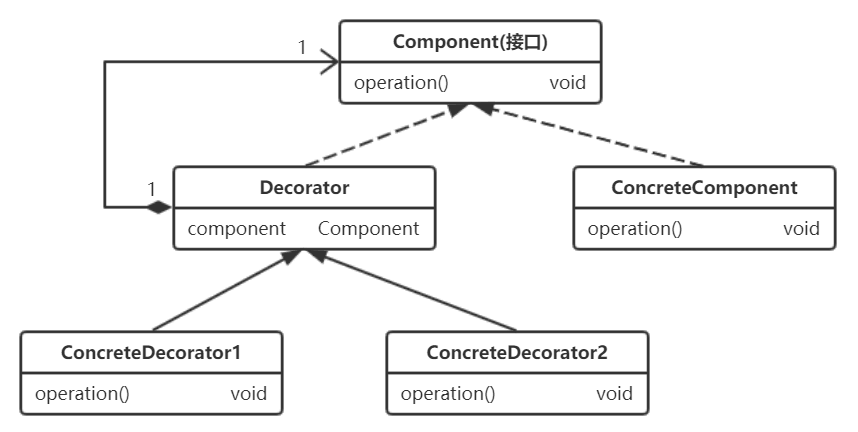

设计模式是解决问题的方案，从大神的代码中学习对设计模式的使用，可以有效提升个人编码及设计代码的能力。本系列博文用于总结阅读过的框架源码（Spring 系列、Mybatis）及 JDK 源码中 所使用过的设计模式，并结合个人工作经验，重新理解设计模式。

本篇博文主要看一下结构型的几个设计模式，即，适配器模式、代理模式 及 装饰器模式。

## 适配器模式

#### 个人理解

从名字就很好理解，主要起到一个连接适配的作用。生活中也有很多这样的例子，比如我们给笔记本充电，不能直接使用国家标准电源，都需要一个“电源适配器”来适配电源输入的电流。使用适配器模式最大的好处就是复用现有组件。应用程序需要复用现有的类，但接口不能被该应用程序兼容，则无法直接使用。这种场景下就适合使用适配器模式实现接口的适配，从而完成组件的复用。

很明显，适配器模式通过提供 Adapter 的方式完成接口适配，实现了程序复用 Adaptee(被适配者) 的需求，避免了修改 Adaptee 实现接口，当有新的 Adaptee 需要被复用时，只要添加新的 Adapter 即可，这是符合“开放封闭”原则的。

本模式的应用也比较广泛，因为实际的开发中也有很多适配工作要做，所以 这些都可以考虑使用适配器模式。在 spring 及 mybatis 中也使用了本模式，分析如下。

#### Spring 中的应用

Spring 在 AOP 模块中，设计了一套 AdvisorAdapter 组件，将各种 Advice 对象适配成了相对应的 MethodInterceptor 对象。其中，AfterReturningAdviceAdapter、MethodBeforeAdviceAdapter 及 ThrowsAdviceAdapter 实现类扮演了“适配器”的角色，AfterReturningAdvice、MethodBeforeAdvice 及 ThrowsAdvice 扮演了“被适配者”角色，而 AfterReturningAdviceInterceptor、MethodBeforeAdviceInterceptor 及 ThrowsAdviceInterceptor 则扮演了“适配目标”的角色。其源码实现如下。

```java
/**
 * Advice 适配器的顶级接口
 * @author Rod Johnson
 */
public interface AdvisorAdapter {

    /**
     * 此适配器是否能适配 给定的 advice 对象
     */
    boolean supportsAdvice(Advice advice);

    /**
     * 获取传入的 advisor 中的 Advice 对象，将其适配成 MethodInterceptor 对象
     */
    MethodInterceptor getInterceptor(Advisor advisor);
}


/**
 * 将 AfterReturningAdvice 适配成 AfterReturningAdviceInterceptor 的适配器
 * @author Rod Johnson
 * @author Juergen Hoeller
 */
@SuppressWarnings("serial")
class AfterReturningAdviceAdapter implements AdvisorAdapter, Serializable {

    public boolean supportsAdvice(Advice advice) {
        return (advice instanceof AfterReturningAdvice);
    }

    public MethodInterceptor getInterceptor(Advisor advisor) {
        AfterReturningAdvice advice = (AfterReturningAdvice) advisor.getAdvice();
        return new AfterReturningAdviceInterceptor(advice);
    }
}


/**
 * 将 MethodBeforeAdvice 适配成 MethodBeforeAdviceInterceptor 的适配器
 * @author Rod Johnson
 * @author Juergen Hoeller
 */
@SuppressWarnings("serial")
class MethodBeforeAdviceAdapter implements AdvisorAdapter, Serializable {

    public boolean supportsAdvice(Advice advice) {
        return (advice instanceof MethodBeforeAdvice);
    }

    public MethodInterceptor getInterceptor(Advisor advisor) {
        MethodBeforeAdvice advice = (MethodBeforeAdvice) advisor.getAdvice();
        return new MethodBeforeAdviceInterceptor(advice);
    }
}


/**
 * 将 ThrowsAdvice 适配成 ThrowsAdviceInterceptor 的适配器
 * @author Rod Johnson
 * @author Juergen Hoeller
 */
@SuppressWarnings("serial")
class ThrowsAdviceAdapter implements AdvisorAdapter, Serializable {

    public boolean supportsAdvice(Advice advice) {
        return (advice instanceof ThrowsAdvice);
    }

    public MethodInterceptor getInterceptor(Advisor advisor) {
        return new ThrowsAdviceInterceptor(advisor.getAdvice());
    }
}


/**
 * 下面这三个接口的实现类 均为 “被适配者”
 */
public interface AfterReturningAdvice extends AfterAdvice {

    /**
     * 目标方法method执行后，AOP会回调此方法，注意，它还传入了method的返回值
     */
    void afterReturning(Object returnValue, Method method, Object[] args, Object target) throws Throwable;
}

public interface MethodBeforeAdvice extends BeforeAdvice {

    /**
     * 目标方法method要开始执行时，AOP会回调此方法
     */
    void before(Method method, Object[] args, Object target) throws Throwable;
}

public interface ThrowsAdvice extends AfterAdvice {

}


/**
 * 下面这三个类均为“适配目标”
 */
public class AfterReturningAdviceInterceptor implements MethodInterceptor, AfterAdvice, Serializable {

    private final AfterReturningAdvice advice;

    /**
     * 为给定的 advice 创建一个 AfterReturningAdviceInterceptor 对象
     */
    public AfterReturningAdviceInterceptor(AfterReturningAdvice advice) {
        Assert.notNull(advice, "Advice must not be null");
        this.advice = advice;
    }

    public Object invoke(MethodInvocation mi) throws Throwable {
        Object retVal = mi.proceed();
        this.advice.afterReturning(retVal, mi.getMethod(), mi.getArguments(), mi.getThis());
        return retVal;
    }
}

public class MethodBeforeAdviceInterceptor implements MethodInterceptor, Serializable {

    private MethodBeforeAdvice advice;

    /**
     * 为指定的advice创建对应的MethodBeforeAdviceInterceptor对象
     */
    public MethodBeforeAdviceInterceptor(MethodBeforeAdvice advice) {
        Assert.notNull(advice, "Advice must not be null");
        this.advice = advice;
    }

    /**
     * 这个invoke方法是拦截器的回调方法，会在代理对象的方法被调用时触发回调
     */
    public Object invoke(MethodInvocation mi) throws Throwable {
        // 首先触发了advice的before()方法的回调
        // 然后才是MethodInvocation的process()方法回调
        this.advice.before(mi.getMethod(), mi.getArguments(), mi.getThis() );
        return mi.proceed();
    }
}

public class ThrowsAdviceInterceptor implements MethodInterceptor, AfterAdvice {

    private static final String AFTER_THROWING = "afterThrowing";

    private static final Log logger = LogFactory.getLog(ThrowsAdviceInterceptor.class);

    private final Object throwsAdvice;

    private final Map<Class, Method> exceptionHandlerMap = new HashMap<Class, Method>();

    public ThrowsAdviceInterceptor(Object throwsAdvice) {
        Assert.notNull(throwsAdvice, "Advice must not be null");
        this.throwsAdvice = throwsAdvice;

        // 配置 throwsAdvice 的回调
        Method[] methods = throwsAdvice.getClass().getMethods();
        for (Method method : methods) {
            if (method.getName().equals(AFTER_THROWING) &&
                    (method.getParameterTypes().length == 1 || method.getParameterTypes().length == 4) &&
                    Throwable.class.isAssignableFrom(method.getParameterTypes()[method.getParameterTypes().length - 1])
                ) {
                // 配置异常处理
                this.exceptionHandlerMap.put(method.getParameterTypes()[method.getParameterTypes().length - 1], method);
                if (logger.isDebugEnabled()) {
                    logger.debug("Found exception handler method: " + method);
                }
            }
        }

        if (this.exceptionHandlerMap.isEmpty()) {
            throw new IllegalArgumentException(
                    "At least one handler method must be found in class [" + throwsAdvice.getClass() + "]");
        }
    }

    public Object invoke(MethodInvocation mi) throws Throwable {
        // 把对目标对象的方法调用放入 try/catch 中，并在 catch 中触发
        // throwsAdvice 的回调，把异常接着向外抛，不做过多处理
        try {
            return mi.proceed();
        }
        catch (Throwable ex) {
            Method handlerMethod = getExceptionHandler(ex);
            if (handlerMethod != null) {
                invokeHandlerMethod(mi, ex, handlerMethod);
            }
            throw ex;
        }
    }
}


/**
 * 本类的 getInterceptors() 方法使用上述 适配器组件，完成了
 * 从 Advice 到 MethodInterceptor 的适配工作
 */
public class DefaultAdvisorAdapterRegistry implements AdvisorAdapterRegistry, Serializable {

    /**
     * 持有AdvisorAdapter的list，这个list中的AdvisorAdapter与
     * 实现 spring AOP 的 Advice 增强功能相对应
     */
    private final List<AdvisorAdapter> adapters = new ArrayList<AdvisorAdapter>(3);

    /**
     * 将已实现的 AdviceAdapter 加入 list
     */
    public DefaultAdvisorAdapterRegistry() {
        registerAdvisorAdapter(new MethodBeforeAdviceAdapter());
        registerAdvisorAdapter(new AfterReturningAdviceAdapter());
        registerAdvisorAdapter(new ThrowsAdviceAdapter());
    }

    public MethodInterceptor[] getInterceptors(Advisor advisor) throws UnknownAdviceTypeException {
        List<MethodInterceptor> interceptors = new ArrayList<MethodInterceptor>(3);

        // 从Advisor通知器中获取配置的Advice
        Advice advice = advisor.getAdvice();

        // 如果advice是MethodInterceptor类型的，直接加进interceptors，不用适配
        if (advice instanceof MethodInterceptor) {
            interceptors.add((MethodInterceptor) advice);
        }

        // 如果advice不是MethodInterceptor类型的，就将其适配成MethodInterceptor，
        // 当前的DefaultAdvisorAdapterRegistry对象 在初始化时就已经为 adapters 添加了
        // 三种 AdvisorAdapter 的实例
        for (AdvisorAdapter adapter : this.adapters) {
            // 依次使用 adapters集合中的 adapter 对 advice 进行适配
            // 将其适配成 MethodInterceptor 对象
            if (adapter.supportsAdvice(advice)) {
                interceptors.add(adapter.getInterceptor(advisor));
            }
        }
        if (interceptors.isEmpty()) {
            throw new UnknownAdviceTypeException(advisor.getAdvice());
        }
        return interceptors.toArray(new MethodInterceptor[interceptors.size()]);
    }

    public void registerAdvisorAdapter(AdvisorAdapter adapter) {
        this.adapters.add(adapter);
    }

    /**
     * 如果adviceObject是Advisor的实例，则将adviceObject转换成Advisor类型并返回
     */
    public Advisor wrap(Object adviceObject) throws UnknownAdviceTypeException {
        if (adviceObject instanceof Advisor) {
            return (Advisor) adviceObject;
        }
        if (!(adviceObject instanceof Advice)) {
            throw new UnknownAdviceTypeException(adviceObject);
        }
        Advice advice = (Advice) adviceObject;
        if (advice instanceof MethodInterceptor) {
            return new DefaultPointcutAdvisor(advice);
        }
        for (AdvisorAdapter adapter : this.adapters) {
            if (adapter.supportsAdvice(advice)) {
                return new DefaultPointcutAdvisor(advice);
            }
        }
        throw new UnknownAdviceTypeException(advice);
    }
}
```

像这样整理出来以后，其类结构及层次设计还是比较清晰明了的，比起很多书上范例的浅尝辄止，结合这些实际场景及源码去理解这些设计模式，要让人更加印象深刻。

#### Mybatis 中的应用

MyBatis 的日志模块中使用了适配器模式，MyBatis 内部调用其日志模块时，使用了其内部接口（org.apache.ibatis.logging.Log）。但是 Log4j、Slf4j 等第三方日志框架对外提供的接口各不相同，MyBatis 为了集成和复用这些第三方日志框架，在其日志模块中提供了多种 Adapter 实现 如：Log4jImpl、Slf4jImpl 等等，它们将这些 “第三方日志框架对外的接口方法” 适配成 “Log 接口方法”，这样 MyBatis 内部就可以统一通过该 Log 接口调用第三方日志框架的功能了。

其中，Log 接口定义了日志模块的功能，日志适配器 Log4jImpl、Slf4jImpl 等通过实现此接口，将对应框架中的日志类 (Logger) 里的方法 适配成 Log 接口中定义的方法。

```java
/**
 * mybatis的日志接口，统一了不同日志框架的 日志操作，
 * 由各实现类 对各日志框架进行具体的适配
 */
public interface Log {

  boolean isDebugEnabled();

  boolean isTraceEnabled();

  void error(String s, Throwable e);

  void error(String s);

  void debug(String s);

  void trace(String s);

  void warn(String s);
}


/**
 * Log4j 日志框架适配器
 */
public class Log4jImpl implements Log {

  /**
   * 注意！！！！！
   * 下面的 log 对象是 Log4j框架的 org.apache.log4j.Logger
   * 本适配器完成了 “org.apache.log4j.Logger中的方法” 到
   * “org.apache.ibatis.logging.Log中的方法” 的适配
   * 从下面的代码中可以很轻易地看出来
   */
  private final Logger log;

  private static final String FQCN = Log4jImpl.class.getName();

  public Log4jImpl(String clazz) {
    log = Logger.getLogger(clazz);
  }

  /**
   * ！！！！！！！！！！！！！！！
   * 具体适配过程如下：
   * ！！！！！！！！！！！！！！！
   */
  @Override
  public boolean isDebugEnabled() {
    return log.isDebugEnabled();
  }

  @Override
  public boolean isTraceEnabled() {
    return log.isTraceEnabled();
  }

  @Override
  public void error(String s, Throwable e) {
    log.log(FQCN, Level.ERROR, s, e);
  }

  @Override
  public void error(String s) {
    log.log(FQCN, Level.ERROR, s, null);
  }

  @Override
  public void debug(String s) {
    log.log(FQCN, Level.DEBUG, s, null);
  }

  @Override
  public void trace(String s) {
    log.log(FQCN, Level.TRACE, s, null);
  }

  @Override
  public void warn(String s) {
    log.log(FQCN, Level.WARN, s, null);
  }
}


/**
 * JDK 日志组件适配器
 */
public class Jdk14LoggingImpl implements Log {

  /**
   * 使用了JDK中的日志类 java.util.logging.Logger
   */
  private final Logger log;

  public Jdk14LoggingImpl(String clazz) {
    log = Logger.getLogger(clazz);
  }

  @Override
  public boolean isDebugEnabled() {
    return log.isLoggable(Level.FINE);
  }

  @Override
  public boolean isTraceEnabled() {
    return log.isLoggable(Level.FINER);
  }

  @Override
  public void error(String s, Throwable e) {
    log.log(Level.SEVERE, s, e);
  }

  @Override
  public void error(String s) {
    log.log(Level.SEVERE, s);
  }

  @Override
  public void debug(String s) {
    log.log(Level.FINE, s);
  }

  @Override
  public void trace(String s) {
    log.log(Level.FINER, s);
  }

  @Override
  public void warn(String s) {
    log.log(Level.WARNING, s);
  }
}
```

## 代理模式

#### 个人理解

代理模式的实际应用 主要体现在框架开发中，日常业务上的开发工作中很少有场景需要使用该模式。而代理模式中 动态代理尤为重要，不管是自己公司的内部框架 还是 一些知名的开源框架，很多重要的实现都用到了该模式。比如，有些 CS 架构中，Client 端的远程方法调用 就使用了动态代理，在 invoke()方法中 为被代理对象调用的方法 织入远程调用处理，然后将远程处理的结果返回给调用者；Spring 的 AOP 也是优先使用 JDK 动态代理来完成；Mybatis 为 JDBC 操作织入日志处理，等等。下面我们结合源码来深入理解一下这个模式。

#### 动态代理原理

静态代理没什么好讲的，很少见用到，功能也比较薄弱，本篇重点讲解动态代理。首先了解一下 JDK 动态代理的原理，这对理解 Spring AOP 部分的源码及实现原理也很有帮助。

JDK 动态代理的实现原理是，动态创建代理类井通过指定类加载器加载，然后在创建代理对象时将 InvokerHandler 对象作为构造参数传入。当调用代理对象的方法时，会调用 InvokerHandler 的 invoke() 方法，并最终调用真正业务对象的相应方法。 JDK 动态代理不仅在 Spring 及 MyBatis 的多个模块中都有所涉及， 在其它很多开源框架中也能看到其身影。

```java
/**
 * 一般会使用实现了 InvocationHandler 的类作为代理对象的生产工厂，
 * 并且通过持有被代理对象target，来在invoke()方法中对被代理对象的目标方法进行调用和增强，
 * 这些我们都能通过下面这段代码看懂，但代理对象是如何生成的？invoke()方法又是如何被调用的呢？
 */
public class ProxyFactory implements InvocationHandler{

    private Object target = null;

    public Object getInstanse(Object target){

        this.target = target;
        return Proxy.newProxyInstance(target.getClass().getClassLoader(),
                target.getClass().getInterfaces(), this);
    }

    @Override
    public Object invoke(Object proxy, Method method, Object[] args)
            throws Throwable {

        Object ret = null;
        System.out.println("前置增强");
        ret = method.invoke(target, args);
        System.out.println("后置增强");
        return ret;
    }
}


/**
 * 实现了接口MyInterface和接口的play()方法，可以作为被代理类
 */
public class TargetObject implements MyInterface {

    @Override
    public void play() {
        System.out.println("妲己，陪你玩 ~");

    }
}


/**
 * 测试类
 */
public class ProxyTest {

    public static void main(String[] args) {
        TargetObject target = new TargetObject();
        // ProxyFactory 实现了 InvocationHandler接口，其中的 getInstanse() 方法利用 Proxy 类
        // 生成了target目标对象的代理对象，并返回；且ProxyFactory持有对target的引用，可以在
        // invoke() 中完成对 target 相应方法的调用，以及目标方法前置后置的增强处理
        ProxyFactory proxyFactory = new ProxyFactory();
        // 这个mi就是JDK的 Proxy 类动态生成的代理类 $Proxy0 的实例，该实例中的方法都持有对
        // invoke() 方法的回调，所以当调用其方法时，就能够执行 invoke() 中的增强处理
        MyInterface mi = (MyInterface)proxyFactory.getInstanse(target);
        // 这样可以看到 mi 的 Class 到底是什么
        System.out.println(mi.getClass());
        // 这里实际上调用的就是 $Proxy0代理类中对 play() 方法的实现，结合下面的代码可以看到
        // play() 方法通过 super.h.invoke() 完成了对 InvocationHandler对象(proxyFactory)中
        // invoke()方法的回调，所以我们才能够通过 invoke() 方法实现对 target 对象方法的
        // 前置后置增强处理
        mi.play();
        // 总的来说，就是在invoke()方法中完成target目标方法的调用，及前置后置增强，
        // JDK动态生成的代理类中对 invoke() 方法进行了回调
    }

    /**
     * 将ProxyGenerator生成的动态代理类的输出到文件中，利用反编译工具luyten等就可
     * 以看到生成的代理类的源码咯，下面给出了其反编译好的代码实现
     */
    @Test
    public void generatorSrc(){
        byte[] bytesFile = ProxyGenerator.generateProxyClass("$Proxy0", TargetObject.class.getInterfaces());
        FileOutputStream fos = null;
        try{
            String path = System.getProperty("user.dir") + "\\$Proxy0.class";
            File file = new File(path);
            fos = new FileOutputStream(file);
            fos.write(bytesFile);
            fos.flush();
        } catch (Exception e){
            e.printStackTrace();
        } finally{
            try {
                fos.close();
            } catch (IOException e) {
                // TODO Auto-generated catch block
                e.printStackTrace();
            }
        }
    }
}


/**
 * Proxy生成的代理类，可以看到，其继承了Proxy，并且实现了被代理类的接口
 */
public final class $Proxy0 extends Proxy implements MyInterface {
    private static Method m1;
    private static Method m0;
    private static Method m3;
    private static Method m2;

    static {
        try {
            $Proxy0.m1 = Class.forName("java.lang.Object").getMethod("equals", Class.forName("java.lang.Object"));
            $Proxy0.m0 = Class.forName("java.lang.Object").getMethod("hashCode", (Class<?>[])new Class[0]);
            //实例化MyInterface的play方法
            $Proxy0.m3 = Class.forName("com.shuitu.test.MyInterface").getMethod("play", (Class<?>[])new Class[0]);
            $Proxy0.m2 = Class.forName("java.lang.Object").getMethod("toString", (Class<?>[])new Class[0]);
        }
        catch (NoSuchMethodException ex) {
            throw new NoSuchMethodError(ex.getMessage());
        }
        catch (ClassNotFoundException ex2) {
            throw new NoClassDefFoundError(ex2.getMessage());
        }
    }

    public $Proxy0(final InvocationHandler invocationHandler) {
        super(invocationHandler);
    }

    public final void play() {
        try {
        	// 这个 h 其实就是我们调用 Proxy.newProxyInstance() 方法时传进去的ProxyFactory(InvocationHandler对象)，
        	// 该对象的 invoke() 方法中实现了对目标对象的目标方法的增强。看到这里，利用动态代理实现方法增强的
        	// 实现原理就全部理清咯
            super.h.invoke(this, $Proxy0.m3, null);
        }
        catch (Error | RuntimeException error) {
            throw new RuntimeException();
        }
        catch (Throwable t) {
            throw new UndeclaredThrowableException(t);
        }
    }

    public final boolean equals(final Object o) {
        try {
            return (boolean)super.h.invoke(this, $Proxy0.m1, new Object[] { o });
        }
        catch (Error | RuntimeException error) {
            throw new RuntimeException();
        }
        catch (Throwable t) {
            throw new UndeclaredThrowableException(t);
        }
    }

    public final int hashCode() {
        try {
            return (int)super.h.invoke(this, $Proxy0.m0, null);
        }
        catch (Error | RuntimeException error) {
            throw new RuntimeException();
        }
        catch (Throwable t) {
            throw new UndeclaredThrowableException(t);
        }
    }

    public final String toString() {
        try {
            return (String)super.h.invoke(this, $Proxy0.m2, null);
        }
        catch (Error | RuntimeException error) {
            throw new RuntimeException();
        }
        catch (Throwable t) {
            throw new UndeclaredThrowableException(t);
        }
    }
}
```

#### Spring 中的应用

Spring 在生成动态代理类时，会优先选择使用 JDK 动态代理，除非被代理类没有实现接口。

```java
/**
 * 可以看到，其实现了 InvocationHandler 接口，所以肯定也定义了一个 使用 java.lang.reflect.Proxy
 * 动态生成代理对象的方法，并在实现的 invoke() 方法中为代理对象织入增强方法
 */
final class JdkDynamicAopProxy implements AopProxy, InvocationHandler, Serializable {

    public Object getProxy() {
        return getProxy(ClassUtils.getDefaultClassLoader());
    }

    /**
     * 获取 JVM 动态生成的代理对象
     */
    public Object getProxy(ClassLoader classLoader) {
        if (logger.isDebugEnabled()) {
            logger.debug("Creating JDK dynamic proxy: target source is " + this.advised.getTargetSource());
        }

        // 获取代理类要实现的接口
        Class[] proxiedInterfaces = AopProxyUtils.completeProxiedInterfaces(this.advised);
        findDefinedEqualsAndHashCodeMethods(proxiedInterfaces);

        // 通过 Proxy 生成代理对象
        return Proxy.newProxyInstance(classLoader, proxiedInterfaces, this);
    }

    /**
     * 本类所生成的代理对象中，所有方法的调用 都会回调本方法。
     * 根据用户的配置，对指定的切面进行相应的增强
     */
    public Object invoke(Object proxy, Method method, Object[] args) throws Throwable {
        MethodInvocation invocation;
        Object oldProxy = null;
        boolean setProxyContext = false;

        // 通过 targetSource 可以获取被代理对象
        TargetSource targetSource = this.advised.targetSource;
        Class targetClass = null;
        Object target = null;

        try {
            // 如果目标对象调用的是 Obejct 类中的基本方法，如：equals、hashCode 则进行相应的处理
            if (!this.equalsDefined && AopUtils.isEqualsMethod(method)) {
                // 如果目标对象没有重写 Object 类的基本方法：equals(Object other)
                return equals(args[0]);
            }
            if (!this.hashCodeDefined && AopUtils.isHashCodeMethod(method)) {
                // 如果目标对象没有重写 Object类的基本方法：hashCode()
                return hashCode();
            }
            if (!this.advised.opaque && method.getDeclaringClass().isInterface() &&
                    method.getDeclaringClass().isAssignableFrom(Advised.class)) {
                // 使用代理配置对 ProxyConfig 进行服务调用
                return AopUtils.invokeJoinpointUsingReflection(this.advised, method, args);
            }

            Object retVal;

            if (this.advised.exposeProxy) {
                // 如果有必要，可以援引
                oldProxy = AopContext.setCurrentProxy(proxy);
                setProxyContext = true;
            }

            // 获取目标对象，为目标方法的调用做准备
            target = targetSource.getTarget();
            if (target != null) {
                targetClass = target.getClass();
            }

            // 获取定义好的拦截器链
            List<Object> chain = this.advised.getInterceptorsAndDynamicInterceptionAdvice(method, targetClass);

            // 如果没有配置拦截器，就直接调用目标对象target的method方法，并获取返回值
            if (chain.isEmpty()) {
                retVal = AopUtils.invokeJoinpointUsingReflection(target, method, args);
            }
            else {
                // 如果有拦截器链，则需要先调用拦截器链中的拦截器，再调用目标的对应方法
                // 这里通过构造 ReflectiveMethodInvocation 来实现
                invocation = new ReflectiveMethodInvocation(proxy, target, method, args, targetClass, chain);
                // 沿着拦截器链继续向下处理
                retVal = invocation.proceed();
            }

            // 获取 method 返回值的类型
            Class<?> returnType = method.getReturnType();
            if (retVal != null && retVal == target && returnType.isInstance(proxy) &&
                    !RawTargetAccess.class.isAssignableFrom(method.getDeclaringClass())) {
                // 特殊提醒：它返回“this”，方法的返回类型与类型兼容。
                // 注意，如果 target 在另一个返回的对象中设置了对自身的引用，spring 将无法处理
                retVal = proxy;
            } else if (retVal == null && returnType != Void.TYPE && returnType.isPrimitive()) {
                throw new AopInvocationException("Null return value from advice does not match primitive return type for: " + method);
            }
            return retVal;
        }
        finally {
            if (target != null && !targetSource.isStatic()) {
                // 必须来自 TargetSource.
                targetSource.releaseTarget(target);
            }
            if (setProxyContext) {
                // 存储旧的 proxy.
                AopContext.setCurrentProxy(oldProxy);
            }
        }
    }
}
```

#### Mybatis 中的应用

Mybatis 的 PooledConnection 类中封装了数据库连接的代理对象，对数据库连接的操作大都会通过该代理对象完成。

```java
/**
 * Mybatis 封装的数据库连接类，它实现了 InvocationHandler 接口，封装了真正的
 * 数据库连接对象 (java.sql.Connection) 及其代理对象，该代理对象是通过
 * JDK 动态代理类 Proxy 产生的
 * @author Clinton Begin
 */
class PooledConnection implements InvocationHandler {

  private static final String CLOSE = "close";
  private static final Class<?>[] IFACES = new Class<?>[] { Connection.class };

  private final int hashCode;

  /**
   * 记录当前 PooledConnection对象 是从哪个 PooledDataSource(数据库连接池)对象获取的。
   * 当调用 close() 方法时会将 PooledConnection 放回该 dataSource 连接池
   */
  private final PooledDataSource dataSource;
  /** 真正的 数据库连接对象 */
  private final Connection realConnection;
  /** 数据库连接的 代理对象 */
  private final Connection proxyConnection;
  /** 从连接池中取出该连接的时间戳 */
  private long checkoutTimestamp;
  /** 该连接创建的时间戳 */
  private long createdTimestamp;
  /** 最后一次被使用的时间戳 */
  private long lastUsedTimestamp;
  /** 由数据库 URL、用户名 和 密码 计算出来的 hash值，可用于标识该连接所在的连接池 */
  private int connectionTypeCode;
  /**
   * 检测当前 PooledConnection 是否有效，主要是为了防止程序通过 close() 方法
   * 将连接归还给连接池之后，依然通过该连接操作数据库
   */
  private boolean valid;

  /**
   * 注意该构造方法中对 proxyConnection 的初始化
   */
  public PooledConnection(Connection connection, PooledDataSource dataSource) {
    this.hashCode = connection.hashCode();
    this.realConnection = connection;
    this.dataSource = dataSource;
    this.createdTimestamp = System.currentTimeMillis();
    this.lastUsedTimestamp = System.currentTimeMillis();
    this.valid = true;
    // 这里使用了 JDK 的 Proxy 为数据库连接创建了一个代理对象，对该代理对象的所有操作
    // 都会回调 本类中的 invoke() 方法
    this.proxyConnection = (Connection) Proxy.newProxyInstance(Connection.class.getClassLoader(), IFACES, this);
  }

  /**
   * 实现了 InvocationHandler 接口中的方法
   */
  @Override
  public Object invoke(Object proxy, Method method, Object[] args) throws Throwable {
    String methodName = method.getName();
    // 如果调用的是 close() 方法，则将其放入连接池，而不是真正关闭数据库连接
    if (CLOSE.equals(methodName)) {
      dataSource.pushConnection(this);
      return null;
    }
    try {
      if (!Object.class.equals(method.getDeclaringClass())) {
        // 通过 valid 字段检测连接是否有效
        checkConnection();
      }
      // 调用真正数据库连接对象的对应方法
      return method.invoke(realConnection, args);
    } catch (Throwable t) {
      throw ExceptionUtil.unwrapThrowable(t);
    }
  }
}
```

## 装饰器模式

#### 个人理解

在实际生产中，新需求在软件的整个生命过程中总是不断出现的。当有新需求出现时，就需要为某些组件添加新的功能来满足这些需求。 添加新功能的方式有很多，我们可以直接修改已有组件的代码井添加相应的新功能，但这样会破坏己有组件的稳定性，修改完成后，整个组件需要重新进行测试才能上线使用。 这种方式显然违反了 “开放封闭” 原则。

另一种方式是使用继承，我们可以创建子类并在子类中添加新功能实现扩展。 这种方法是静态的，用户不能控制增加行为的方式和时机。 而且有些情况下继承是不可行的，例如 己有组件是被 final 修饰的类。 另外，如果待添加的新功能存在多种组合，使用继承方式可能会导致大量子类的出现。 例如，有 4 个待添加的新功能，系统需要动态使用任意多个功能的组合， 则需要添加 15 个子类才能满足全部需求。

装饰器模式能够帮助我们解决上述问题，装饰器可以动态地为对象添加功能，它是基于组合的方式实现该功能的。在实践中，我们应该尽量使用组合的方式来扩展系统的功能，而非使用继承的方式。通过装饰器模式的介绍，可以帮助读者更好地理解设计模式中常见的一句话：组合优于继承。下面先来看一下装饰器模式的类图，及其核心角色。



- Component (组件)：组件接口定义了全部 “组件实现类” 以及所有 “装饰器实现” 的行为。
- ConcreteComponent (具体组件实现类)：通常情况下，具体组件实现类就是被装饰器装饰的原始对象，该类提供了 Component 接口中定义的最基本的功能，其他高级功能或后续添加的新功能，都是通过装饰器的方式添加到该类的对象之上的。
- Decorator (装饰器)：所有装饰器的父类，它是一个实现了 Component 接口的抽象类，并持有一个 Component 被装饰对象，这就实现了装饰器的嵌套组合和复用。
- ConcreteDecorator (具体的装饰器实现类)：该实现类要向被装饰对象添加某些功能，被装饰的对象只要是 Component 类型即可。

#### Mybatis 中的应用

在 MyBatis 的缓存模块中，使用了装饰器模式的变体，其中将 Decorator 接口和 Component 接口合并为一个 Component 接口，即，去掉了 Decorator 这个中间层，ConcreteDecorator 直接实现了 Component 接口。

MyBatis 中缓存模块相关的代码位于 cache 包下， 其中 Cache 接口是缓存模块的核心接口，它定义了所有缓存的基本行为，扮演了 Component 的角色。实现类 PerpetualCache 扮演了 ConcreteComponent 的角色，其实现比较简单，底层使用 HashMap 记录缓存项，也是通过该 HashMap 对象的方法实现了 Cache 接口中定义的相应方法。而 cache 包下的 decorators 包中，则定义了一系列 ConcreteDecorator 的实现，如 BlockingCache、FifoCache 及 LruCache 等等，它们都持有一个 Cache 类型的对象，通过嵌套组合的方式为该 Cache 对象 装饰相应的功能。其源码实现如下。

```java
public interface Cache {

  /** 该缓存对象的 id */
  String getId();

  /** 向缓存中添加数据，一般 key 是 CacheKey，value 是查询结果 */
  void putObject(Object key, Object value);

  /** 根据指定的 key，在缓存中查找对应的结果对象 */
  Object getObject(Object key);

  /** 删除 key 对应的缓存项 */
  Object removeObject(Object key);

  /** 清空缓存 */
  void clear();

  /** 缓存项的个数，该方法不会被 MyBatis 核心代码使用，所以可提供空实现 */
  int getSize();

  /**
   * 获取读写锁，该方法不会被 MyBatis 核心代码使用，所以可提供空实现。
   * 这里在接口中为此方法提供了默认实现，也是 JDK8 的新特性
   */
  default ReadWriteLock getReadWriteLock() {
    return null;
  }
}


public class PerpetualCache implements Cache {

  /** Cache 对象的唯一标识 */
  private final String id;
  /** 用于记录缓存项的 Map 对象 */
  private final Map<Object, Object> cache = new HashMap<>();

  public PerpetualCache(String id) {
    this.id = id;
  }

  @Override
  public String getId() {
    return id;
  }

  /**
   * ！！！！！！！！！！！！！！！！！！！！！！！！！！！！！！！！！！！！
   * 下面所有的方法都是通过 cache 这个 HashMap对象 的相应方法实现的
   * ！！！！！！！！！！！！！！！！！！！！！！！！！！！！！！！！！！！！
   */
  @Override
  public int getSize() {
    return cache.size();
  }

  @Override
  public void putObject(Object key, Object value) {
    cache.put(key, value);
  }

  @Override
  public Object getObject(Object key) {
    return cache.get(key);
  }

  @Override
  public Object removeObject(Object key) {
    return cache.remove(key);
  }

  @Override
  public void clear() {
    cache.clear();
  }

  /**
   * ！！！！！！！！！！！！！！！！！！！！！！！！！！！！！！！！！！！！！！！！！
   * 重写了 equals() 和 hashCode() 方法，两者都只关心 id 字段，并不关心 cache 字段
   * ！！！！！！！！！！！！！！！！！！！！！！！！！！！！！！！！！！！！！！！！！
   */
  @Override
  public boolean equals(Object o) {
    if (getId() == null) {
      throw new CacheException("Cache instances require an ID.");
    }
    if (this == o) {
      return true;
    }
    if (!(o instanceof Cache)) {
      return false;
    }

    Cache otherCache = (Cache) o;
    return getId().equals(otherCache.getId());
  }

  @Override
  public int hashCode() {
    if (getId() == null) {
      throw new CacheException("Cache instances require an ID.");
    }
    return getId().hashCode();
  }
}


/**
 * 阻塞版本的缓存装饰器，它会保证只有一个线程到数据库中查找指定 key 对应的数据。
 * 假设线程 A 在 BlockingCache 中未查找到 keyA 对应的缓存项时，线程 A 会获取 keyA 对应的锁，
 * 这样后续线程在查找 keyA 时会被阻塞
 */
public class BlockingCache implements Cache {

  /** 阻塞超时时长 */
  private long timeout;
  /** 被装饰的底层 Cache 对象 */
  private final Cache delegate;
  /** 每个 key 都有对应的 ReentrantLock 对象 */
  private final ConcurrentHashMap<Object, ReentrantLock> locks;

  public BlockingCache(Cache delegate) {
    this.delegate = delegate;
    this.locks = new ConcurrentHashMap<>();
  }

  @Override
  public Object getObject(Object key) {
    // 获取该 key 对应的锁
    acquireLock(key);
    // 查询 key
    Object value = delegate.getObject(key);
    // 缓存中有 key 对应的缓存项，则释放锁，否则继续持有锁
    if (value != null) {
      releaseLock(key);
    }
    return value;
  }

  private void acquireLock(Object key) {
    // 获取 ReentrantLock 对象
    Lock lock = getLockForKey(key);
    // 获取锁，带超时时长
    if (timeout > 0) {
      try {
        boolean acquired = lock.tryLock(timeout, TimeUnit.MILLISECONDS);
        // 超时，则抛出异常
        if (!acquired) {
          throw new CacheException("Couldn't get a lock in " + timeout + " for the key " +  key + " at the cache " + delegate.getId());
        }
      } catch (InterruptedException e) {
        throw new CacheException("Got interrupted while trying to acquire lock for key " + key, e);
      }
    } else {
      // 获取锁，不带起时时长
      lock.lock();
    }
  }

  private ReentrantLock getLockForKey(Object key) {
    // 创建 ReentrantLock 对象，尝试添加到 locks 集合中，若 locks 集合中已经有了
    // 相应的 ReentrantLock 对象，则使用 locks 集合中的 ReentrantLock 对象
    return locks.computeIfAbsent(key, k -> new ReentrantLock());
  }

  @Override
  public void putObject(Object key, Object value) {
    try {
      // 向缓存中添加缓存项
      delegate.putObject(key, value);
    } finally {
      // 释放锁
      releaseLock(key);
    }
  }

  private void releaseLock(Object key) {
    // 获取锁
    ReentrantLock lock = locks.get(key);
    // 锁是否被当前线程持有
    if (lock.isHeldByCurrentThread()) {
      // 释放锁
      lock.unlock();
    }
  }

  @Override
  public String getId() {
    return delegate.getId();
  }

  @Override
  public int getSize() {
    return delegate.getSize();
  }

  @Override
  public Object removeObject(Object key) {
    // despite of its name, this method is called only to release locks
    releaseLock(key);
    return null;
  }

  @Override
  public void clear() {
    delegate.clear();
  }

  public long getTimeout() {
    return timeout;
  }

  public void setTimeout(long timeout) {
    this.timeout = timeout;
  }
}


/**
 * 在很多场景中，为了控制缓存的大小，系统需要按照一定的规则清理缓存。
 * FifoCache 是先入先出版本的装饰器，当向缓存添加数据时，如果缓存项的个数已经达到上限，
 * 则会将缓存中最老(即最早进入缓存)的缓存项删除
 */
public class FifoCache implements Cache {

  /** 底层被装饰的底层 Cache 对象 */
  private final Cache delegate;
  /** 用于记录 key 进入缓存的先后顺序，使用的是 LinkedList<Object> 类型的集合对象 */
  private final Deque<Object> keyList;
  /** 记录了缓存项的上限，超过该值，则需要清理最老的缓存项 */
  private int size;

  public FifoCache(Cache delegate) {
    this.delegate = delegate;
    this.keyList = new LinkedList<>();
    this.size = 1024;
  }

  @Override
  public void putObject(Object key, Object value) {
    // 检测并清理缓存
    cycleKeyList(key);
    // 添加缓存项
    delegate.putObject(key, value);
  }

  private void cycleKeyList(Object key) {
    // 记录 key
    keyList.addLast(key);
    // 如果达到缓存上限，则清理最老的缓存项
    if (keyList.size() > size) {
      Object oldestKey = keyList.removeFirst();
      delegate.removeObject(oldestKey);
    }
  }

  @Override
  public String getId() {
    return delegate.getId();
  }

  @Override
  public int getSize() {
    return delegate.getSize();
  }

  public void setSize(int size) {
    this.size = size;
  }

  @Override
  public Object getObject(Object key) {
    return delegate.getObject(key);
  }

  @Override
  public Object removeObject(Object key) {
    return delegate.removeObject(key);
  }

  @Override
  public void clear() {
    delegate.clear();
    keyList.clear();
  }
}
```
