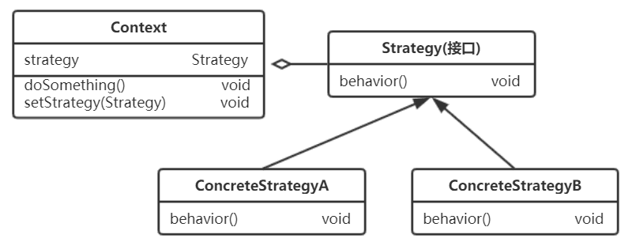
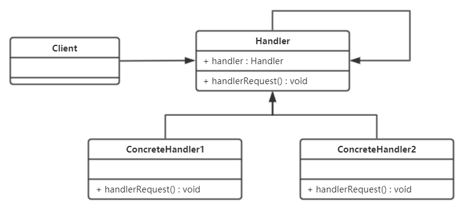
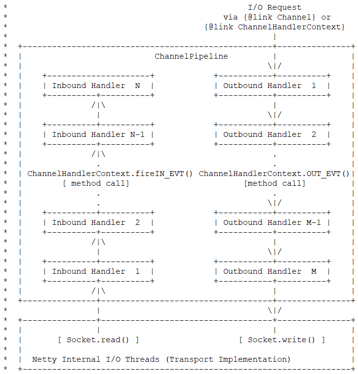

设计模式是解决问题的方案，从大神的代码中学习对设计模式的使用，可以有效提升个人编码及设计代码的能力。本系列博文用于总结阅读过的框架源码（Spring 系列、Mybatis）及 JDK 源码中 所使用过的设计模式，并结合个人工作经验，重新理解设计模式。

本篇博文主要看一下行为型的几个设计模式，即，策略模式、模板方法模式、迭代器模式、观察者模式 及 责任链模式。

## 策略模式

#### 个人理解

去年看了蛮多源码，发现 框架的开发者在实际使用设计模式时，大都会根据实际情况 使用其变体，老老实实按照书上的类图及定义去设计代码的比较少。不过我们依然还是先看一下书上的定义，然后比较一下理论与实践的一些差别吧。策略模式的类图及定义如下。



定义一系列算法，封装每个算法 并使它们可以互换。该模式的主要角色如下：

- Strategy 接口：用于定义一个算法族，它们都具有 behavior()方法；
- Context：使用该算法的类，持有 Strategy 对象，其中的 setStrategy(Strategy stra)方法可以动态地改变 strategy 对象，以此改变自己所使用的算法。

很多书上都使用 Duck 和 QuackBehavior 作为示例进行说明，这里就不重复咯，主要看一下 Spring 中是如何使用该模式的。

#### Spring 中的实现

Spring 的 AbstractAutowireCapableBeanFactory 在进行 bean 实例化时使用了策略模式的变种，其中 InstantiationStrategy 接口 定义了实例化方法，实现类 SimpleInstantiationStrategy 和 CglibSubclassingInstantiationStrategy 分别实现了各自的算法，AbstractAutowireCapableBeanFactory 则通过持有 InstantiationStrategy 对象，对算进行使用。其源码实现如下。

```java
/**
 * 本接口用于定义bean实例的创建，通过给定的RootBeanDefinition对象
 * 本组件使用了策略模式，因为各种情况，需要使用不同的方法来实现，包括使用CGLIB动态创建子类
 * @author Rod Johnson
 * @since 1.1
 */
public interface InstantiationStrategy {

    /**
     * 返回一个bean实例，使用BeanFactory给定的参数
     */
    Object instantiate(RootBeanDefinition beanDefinition, String beanName, BeanFactory owner)
            throws BeansException;

    Object instantiate(RootBeanDefinition beanDefinition, String beanName, BeanFactory owner,
            Constructor<?> ctor, Object[] args) throws BeansException;

    Object instantiate(RootBeanDefinition beanDefinition, String beanName, BeanFactory owner,
            Object factoryBean, Method factoryMethod, Object[] args) throws BeansException;

}


public class SimpleInstantiationStrategy implements InstantiationStrategy {

    /**
     * 具体使用哪个策略进行bean的实例化，是在这个实现类中决定的
     */
    public Object instantiate(RootBeanDefinition beanDefinition, String beanName, BeanFactory owner) {
        // 如果beanDefinition中没有方法覆盖，则使用Java的反射机制实例化对象，否则使用CGLIB策略
        if (beanDefinition.getMethodOverrides().isEmpty()) {
            Constructor<?> constructorToUse;
            synchronized (beanDefinition.constructorArgumentLock) {
                // 获取对象的构造方法或生成对象的工厂方法对bean进行实例化
                constructorToUse = (Constructor<?>) beanDefinition.resolvedConstructorOrFactoryMethod;

                // 如果前面没有获取到构造方法，则通过反射获取
                if (constructorToUse == null) {
                    // 使用JDK的反射机制，判断要实例化的Bean是否是接口
                    final Class clazz = beanDefinition.getBeanClass();
                    // 如果clazz是一个接口，直接抛出异常
                    if (clazz.isInterface()) {
                        throw new BeanInstantiationException(clazz, "Specified class is an interface");
                    }
                    try {
                        if (System.getSecurityManager() != null) {
                            // 这里是一个匿名内置类，使用反射机制获取Bean的构造方法
                            constructorToUse = AccessController.doPrivileged(new PrivilegedExceptionAction<Constructor>() {
                                public Constructor run() throws Exception {
                                    return clazz.getDeclaredConstructor((Class[]) null);
                                }
                            });
                        }
                        else {
                            constructorToUse =	clazz.getDeclaredConstructor((Class[]) null);
                        }
                        beanDefinition.resolvedConstructorOrFactoryMethod = constructorToUse;
                    }
                    catch (Exception ex) {
                        throw new BeanInstantiationException(clazz, "No default constructor found", ex);
                    }
                }
            }
            // 使用BeanUtils实例化，通过反射机制调用”构造方法.newInstance(arg)”来进行实例化
            return BeanUtils.instantiateClass(constructorToUse);
        }
        else {
            /**
             * ！！！！！！！！！！！！！！
             * 使用CGLIB来实例化对象
             * 调用了其子类CglibSubclassingInstantiationStrategy中的实现
             * ！！！！！！！！！！！！！！
             */
            return instantiateWithMethodInjection(beanDefinition, beanName, owner);
        }
    }
}


public class CglibSubclassingInstantiationStrategy extends SimpleInstantiationStrategy {

    /**
     * 下面两个方法都通过实例化自己的私有静态内部类CglibSubclassCreator，
     * 然后调用该内部类对象的实例化方法instantiate()完成实例化
     */
    protected Object instantiateWithMethodInjection(
            RootBeanDefinition beanDefinition, String beanName, BeanFactory owner) {

        // 必须生成cglib子类
        return new CglibSubclassCreator(beanDefinition, owner).instantiate(null, null);
    }

    @Override
    protected Object instantiateWithMethodInjection(
            RootBeanDefinition beanDefinition, String beanName, BeanFactory owner,
            Constructor ctor, Object[] args) {

        return new CglibSubclassCreator(beanDefinition, owner).instantiate(ctor, args);
    }

    /**
     * 为避免3.2之前的Spring版本中的外部cglib依赖而创建的内部类
     */
    private static class CglibSubclassCreator {

        private final RootBeanDefinition beanDefinition;

        private final BeanFactory owner;

        public CglibSubclassCreator(RootBeanDefinition beanDefinition, BeanFactory owner) {
            this.beanDefinition = beanDefinition;
            this.owner = owner;
        }

        //使用CGLIB进行Bean对象实例化
        public Object instantiate(Constructor ctor, Object[] args) {
            //实例化Enhancer对象，并为Enhancer对象设置父类，生成Java对象的参数，比如：基类、回调方法等
            Enhancer enhancer = new Enhancer();
            //将Bean本身作为其父类
            enhancer.setSuperclass(this.beanDefinition.getBeanClass());
            enhancer.setCallbackFilter(new CallbackFilterImpl());
            enhancer.setCallbacks(new Callback[] {
                    NoOp.INSTANCE,
                    new LookupOverrideMethodInterceptor(),
                    new ReplaceOverrideMethodInterceptor()
            });

            //使用CGLIB的create方法生成实例对象
            return (ctor == null) ? enhancer.create() : enhancer.create(ctor.getParameterTypes(), args);
        }
    }
}


public abstract class AbstractAutowireCapableBeanFactory extends AbstractBeanFactory
		implements AutowireCapableBeanFactory {

    /** 创建bean实例的策略，注意 这里直接实例化的是 CglibSubclassingInstantiationStrategy 对象 */
    private InstantiationStrategy instantiationStrategy = new CglibSubclassingInstantiationStrategy();

    /**
     * 设置用于创建bean实例的实例化策略，默认使用CglibSubclassingInstantiationStrategy
     */
    public void setInstantiationStrategy(InstantiationStrategy instantiationStrategy) {
        this.instantiationStrategy = instantiationStrategy;
    }

    protected InstantiationStrategy getInstantiationStrategy() {
        return this.instantiationStrategy;
    }

    /**
     * 使用默认的无参构造方法实例化Bean对象
     */
    protected BeanWrapper instantiateBean(final String beanName, final RootBeanDefinition mbd) {
        try {
            Object beanInstance;
            final BeanFactory parent = this;
            // 获取系统的安全管理接口，JDK标准的安全管理API
            if (System.getSecurityManager() != null) {
                // 这里是一个匿名内置类，根据实例化策略创建实例对象
                beanInstance = AccessController.doPrivileged(new PrivilegedAction<Object>() {
                    public Object run() {
                        return getInstantiationStrategy().instantiate(mbd, beanName, parent);
                    }
                }, getAccessControlContext());
            }
            else {

                /**
                 * ！！！！！！！！！！！！！！
                 * 使用初始化策略实例化Bean对象
                 * ！！！！！！！！！！！！！！
                 */
                beanInstance = getInstantiationStrategy().instantiate(mbd, beanName, parent);
            }
            BeanWrapper bw = new BeanWrapperImpl(beanInstance);
            initBeanWrapper(bw);
            return bw;
        }
        catch (Throwable ex) {
            throw new BeanCreationException(mbd.getResourceDescription(), beanName, "Instantiation of bean failed", ex);
        }
    }

    ...

}
```

与标准的策略模式的设计区别在于，实现类 CglibSubclassingInstantiationStrategy 并不是直接实现了 InstantiationStrategy 接口，而是继承了 SimpleInstantiationStrategy，SimpleInstantiationStrategy 直接实现了 通过 JDK 反射机制实例化 bean 的策略，而 CglibSubclassingInstantiationStrategy 则是在自己的私有静态内部类中 完成的 通过 CGLIB 实例化 bean 的策略。

另外，虽然 AbstractAutowireCapableBeanFactory 默认持有的是 CglibSubclassingInstantiationStrategy 的实例，但具体使用哪个实现类中的策略，则是由 CglibSubclassingInstantiationStrategy 的父类 SimpleInstantiationStrategy 中的 instantiate()方法决定的。也就是说，虽然持有的是 CglibSubclassingInstantiationStrategy 对象，但实际上可能使用的是 JDK 反射机制实例化 bean 的策略。

设计模式的生产实践可能比 理论上的那些示例复杂的多，所以，若想确实提高自己代码的设计能力，还是要摆脱书本，多看实际应用。

#### Mybatis 中的实现

mybatis 的 DefaultSqlSession 使用了策略模式，DefaultSqlSession 扮演了 Context 的角色，Executor 接口及其实现类扮演了策略接口及实现。DefaultSqlSession 持有 Executor 对象，在 DefaultSqlSession 实例化时通过构造方法传入具体的 Executor 对象，根据持有的 Executor 对象的不同，而使用不同的策略进行数据库操作。具体使用哪个 Executor 的实例，由 Configuration 的 newExecutor() 方法决定。

```java
public class DefaultSqlSession implements SqlSession {

  private final Executor executor;

  /**
   * 在构造方法中为 executor 赋值，没有提供专门的set方法
   */
  public DefaultSqlSession(Configuration configuration, Executor executor, boolean autoCommit) {
    this.configuration = configuration;
    this.executor = executor;
    this.dirty = false;
    this.autoCommit = autoCommit;
  }

  /**
   * executor的不同，决定了DefaultSqlSession使用哪种策略执行SQL操作
   */
  @Override
  public void select(String statement, Object parameter, RowBounds rowBounds, ResultHandler handler) {
    try {
      MappedStatement ms = configuration.getMappedStatement(statement);
      executor.query(ms, wrapCollection(parameter), rowBounds, handler);
    } catch (Exception e) {
      throw ExceptionFactory.wrapException("Error querying database.  Cause: " + e, e);
    } finally {
      ErrorContext.instance().reset();
    }
  }

  @Override
  public int update(String statement, Object parameter) {
    try {
      dirty = true;
      MappedStatement ms = configuration.getMappedStatement(statement);
      return executor.update(ms, wrapCollection(parameter));
    } catch (Exception e) {
      throw ExceptionFactory.wrapException("Error updating database.  Cause: " + e, e);
    } finally {
      ErrorContext.instance().reset();
    }
  }
}


public interface Executor {

  int update(MappedStatement ms, Object parameter) throws SQLException;

  <E> List<E> query(MappedStatement ms, Object parameter, RowBounds rowBounds, ResultHandler resultHandler, CacheKey cacheKey, BoundSql boundSql) throws SQLException;

  void commit(boolean required) throws SQLException;

  void rollback(boolean required) throws SQLException;

  Transaction getTransaction();

  ......
}


public abstract class BaseExecutor implements Executor {

  ......

  protected BaseExecutor(Configuration configuration, Transaction transaction) {
    this.transaction = transaction;
    this.deferredLoads = new ConcurrentLinkedQueue<>();
    this.localCache = new PerpetualCache("LocalCache");
    this.localOutputParameterCache = new PerpetualCache("LocalOutputParameterCache");
    this.closed = false;
    this.configuration = configuration;
    this.wrapper = this;
  }

  ......
}


public class SimpleExecutor extends BaseExecutor {

  public SimpleExecutor(Configuration configuration, Transaction transaction) {
    super(configuration, transaction);
  }

  @Override
  public int doUpdate(MappedStatement ms, Object parameter) throws SQLException {
    Statement stmt = null;
    try {
      Configuration configuration = ms.getConfiguration();
      StatementHandler handler = configuration.newStatementHandler(this, ms, parameter, RowBounds.DEFAULT, null, null);
      stmt = prepareStatement(handler, ms.getStatementLog());
      return handler.update(stmt);
    } finally {
      closeStatement(stmt);
    }
  }

  @Override
  public <E> List<E> doQuery(MappedStatement ms, Object parameter, RowBounds rowBounds, ResultHandler resultHandler, BoundSql boundSql) throws SQLException {
    Statement stmt = null;
    try {
      // 获取配置对象
      Configuration configuration = ms.getConfiguration();
      // 创建 StatementHandler 对象，实际返回的是 RoutingStatementHandler 对象，前面介绍过，
      // 其中根据 MappedStatement.statementType 选择具体的 StatementHandler 实现
      StatementHandler handler = configuration.newStatementHandler(wrapper, ms, parameter, rowBounds, resultHandler, boundSql);
      // 完成 Statement 的创建和初始化，该方法首先会调用 StatementHandler.prepare() 方法
      // 创建 Statement 对象， 然后调用 StatementHandler. parameterize() 方法处理占位符
      stmt = prepareStatement(handler, ms.getStatementLog());
      // 调用 StatementHandler.query() 方法，执行 SQL 语句，并通过 ResultSetHandler 完成
      // 结果集的映射
      return handler.query(stmt, resultHandler);
    } finally {
      // 关闭 Statement 对象
      closeStatement(stmt);
    }
  }

  ......
}


public class BatchExecutor extends BaseExecutor {

  @Override
  public int doUpdate(MappedStatement ms, Object parameterObject) throws SQLException {
    // 获取配置对象
    final Configuration configuration = ms.getConfiguration();
    // 创建 StatementHandler 对象
    final StatementHandler handler = configuration.newStatementHandler(this, ms, parameterObject, RowBounds.DEFAULT, null, null);
    final BoundSql boundSql = handler.getBoundSql();
    // 获取 SQL 语句
    final String sql = boundSql.getSql();
    final Statement stmt;
    // 如果当前执行的 SQL 模式与上次执行的 SQL 模式相同且对应的 MappedStatement 对象相同
    if (sql.equals(currentSql) && ms.equals(currentStatement)) {
      // 获取 statementList 集合中最后一个 Statement 对象
      int last = statementList.size() - 1;
      stmt = statementList.get(last);
      applyTransactionTimeout(stmt);
      // 绑定实参，处理占位符 “？”
      handler.parameterize(stmt);//fix Issues 322
      // 查找对应的 BatchResult 对象，并记录用户传入的实参
      BatchResult batchResult = batchResultList.get(last);
      batchResult.addParameterObject(parameterObject);
    } else {
      Connection connection = getConnection(ms.getStatementLog());
      // 创建新的 Statement 对象
      stmt = handler.prepare(connection, transaction.getTimeout());
      // 绑定实参，处理占位符“？”
      handler.parameterize(stmt);    //fix Issues 322
      // 更新 currentSql 和 currentStatement
      currentSql = sql;
      currentStatement = ms;
      // 将新创建的 Statement 对象添加到 statementList 集合中
      statementList.add(stmt);
      // 添加新的 BatchResult 对象
      batchResultList.add(new BatchResult(ms, sql, parameterObject));
    }
    // 底层通过调用 Statement.addBatch() 方法添加 SQL 语句
    handler.batch(stmt);
    return BATCH_UPDATE_RETURN_VALUE;
  }

  ......
}


public class Configuration {

  /**
   * 在这个方法中决定使用哪个 Executor 实现
   */
  public Executor newExecutor(Transaction transaction, ExecutorType executorType) {
    executorType = executorType == null ? defaultExecutorType : executorType;
    executorType = executorType == null ? ExecutorType.SIMPLE : executorType;
    Executor executor;
    if (ExecutorType.BATCH == executorType) {
      executor = new BatchExecutor(this, transaction);
    } else if (ExecutorType.REUSE == executorType) {
      executor = new ReuseExecutor(this, transaction);
    } else {
      executor = new SimpleExecutor(this, transaction);
    }
    if (cacheEnabled) {
      executor = new CachingExecutor(executor);
    }
    executor = (Executor) interceptorChain.pluginAll(executor);
    return executor;
  }

  ......
}
```

## 模板方法模式

#### 个人理解

在该模式中，一个算法可以分为多个步骤，这些步骤的执行次序在一个被称为“模板方法”的方法中定义，而算法的每个步骤都对应着一个方法，这些方法被称为 “基本方法”。 模板方法按照它定义的顺序依次调用多个基本方法，从而实现整个算法流程。在模板方法模式中，会将模板方法的实现以及那些固定不变的基本方法的实现放在父类中，而那些不固定的基 本方法在父类中只是抽象方法，其真正的实现代码会被延迟到子类中完成。

我觉得这是最简单且常用的设计模式之一咯，自己在实现一些功能时也会使用这种模式，在抽象类中定义好流程的执行顺序，通用的流程在抽象类中实现，个性化的流程交给各个子类去实现。spring 及 mybatis 中均有应用。

#### Spring 中的应用

Spring 中的 AbstractApplicationContext 和其子类 AbstractRefreshableApplicationContext、GenericApplicationContext 使用了模板方法模式。源码实现及详细注释如下。

```java
public abstract class AbstractApplicationContext extends DefaultResourceLoader
		implements ConfigurableApplicationContext, DisposableBean {

    /**
     * 告诉子类启动refreshBeanFactory()方法，BeanDefinition资源文件的载入
     * 从子类的refreshBeanFactory()方法启动开始
     */
    protected ConfigurableListableBeanFactory obtainFreshBeanFactory() {
        // 这里使用了模板方法模式，自己定义了流程，个性化的方法实现交由子类完成
        // 其中，refreshBeanFactory() 和 getBeanFactory()为抽象方法
        refreshBeanFactory();
        ConfigurableListableBeanFactory beanFactory = getBeanFactory();
        if (logger.isDebugEnabled()) {
            logger.debug("Bean factory for " + getDisplayName() + ": " + beanFactory);
        }
        return beanFactory;
    }

    protected abstract void refreshBeanFactory() throws BeansException, IllegalStateException;

    public abstract ConfigurableListableBeanFactory getBeanFactory() throws IllegalStateException;

}


public abstract class AbstractRefreshableApplicationContext extends AbstractApplicationContext {

    /**
     * 在这里完成了容器的初始化，并赋值给自己private的beanFactory属性，为下一步调用做准备
     * 从父类AbstractApplicationContext继承的抽象方法，自己做了实现
     */
    @Override
    protected final void refreshBeanFactory() throws BeansException {
        // 如果已经建立了IoC容器，则销毁并关闭容器
        if (hasBeanFactory()) {
            destroyBeans();
            closeBeanFactory();
        }
        try {
            // 创建IoC容器，DefaultListableBeanFactory类实现了ConfigurableListableBeanFactory接口
            DefaultListableBeanFactory beanFactory = createBeanFactory();
            beanFactory.setSerializationId(getId());
            // 定制化IoC容器，如设置启动参数，开启注解的自动装配等
            customizeBeanFactory(beanFactory);
            // 载入BeanDefinition，这里又使用了一个委派模式，在当前类定义此抽象方法，子类容器具体实现
            loadBeanDefinitions(beanFactory);
            synchronized (this.beanFactoryMonitor) {
                // 给自己的属性赋值
                this.beanFactory = beanFactory;
            }
        }
        catch (IOException ex) {
            throw new ApplicationContextException("I/O error parsing bean definition source for " + getDisplayName(), ex);
        }
    }

    @Override
    public final ConfigurableListableBeanFactory getBeanFactory() {
        synchronized (this.beanFactoryMonitor) {
            if (this.beanFactory == null) {
                throw new IllegalStateException("BeanFactory not initialized or already closed - " +
                        "call 'refresh' before accessing beans via the ApplicationContext");
            }
            return this.beanFactory;
        }
    }
}


public class GenericApplicationContext extends AbstractApplicationContext implements BeanDefinitionRegistry {

    @Override
    protected final void refreshBeanFactory() throws IllegalStateException {
        if (this.refreshed) {
            throw new IllegalStateException(
                    "GenericApplicationContext does not support multiple refresh attempts: just call 'refresh' once");
        }
        this.beanFactory.setSerializationId(getId());
        this.refreshed = true;
    }

    public final ConfigurableListableBeanFactory getBeanFactory() {
        return this.beanFactory;
    }
}
```

#### Mybatis 中的应用

mybatis 的 Executor 组件使用了该模式，其中抽象类 BaseExecutor 定义了模板方法和抽象方法，实现类 SimpleExecutor、BatchExecutor 及 ReuseExecutor 对抽象方法进行具体实现。源码如下。

```java
public abstract class BaseExecutor implements Executor {

  @Override
  public int update(MappedStatement ms, Object parameter) throws SQLException {
    ErrorContext.instance().resource(ms.getResource()).activity("executing an update").object(ms.getId());
    // 判断当前 Executor 是否已经关闭
    if (closed) {
      throw new ExecutorException("Executor was closed.");
    }
    // clearLocalCache() 方法中会调用 localCache()、localOutputParameterCache() 两个
    // 缓存的 clear() 方法完成清理工作。这是影响一级缓存中数据存活时长的第三个方面
    clearLocalCache();
    // 调用 doUpdate() 抽象方法执行 SQL 语句
    return doUpdate(ms, parameter);
  }

  public List<BatchResult> flushStatements(boolean isRollBack) throws SQLException {
    // 判断当前 Executor 是否已经关闭
    if (closed) {
      throw new ExecutorException("Executor was closed.");
    }
    // 调用抽象方法 doFlushStatements()，其参数 isRollBack 表示是否执行 Executor 中缓存的
    // SQL 语句，false 表示执行，true 表示不执行
    return doFlushStatements(isRollBack);
  }

  /**
   * 调用 doQuery() 方法完成数据库查询，并得到映射后的结果集对象，
   */
  private <E> List<E> queryFromDatabase(MappedStatement ms, Object parameter, RowBounds rowBounds, ResultHandler resultHandler, CacheKey key, BoundSql boundSql) throws SQLException {
    List<E> list;
    // 在缓存中添加占位符
    localCache.putObject(key, EXECUTION_PLACEHOLDER);
    try {
      // 调用 doQuery() 抽象方法，完成数据库查询操作，并返回结果集对象
      list = doQuery(ms, parameter, rowBounds, resultHandler, boundSql);
    } finally {
      // 删除占位符
      localCache.removeObject(key);
    }
    // 将真正的结采对象添加到一级缓存中
    localCache.putObject(key, list);
    // 是否为存储过程调用
    if (ms.getStatementType() == StatementType.CALLABLE) {
      // 缓存输出类型的参数
      localOutputParameterCache.putObject(key, parameter);
    }
    return list;
  }

  @Override
  public <E> Cursor<E> queryCursor(MappedStatement ms, Object parameter, RowBounds rowBounds) throws SQLException {
    BoundSql boundSql = ms.getBoundSql(parameter);
    return doQueryCursor(ms, parameter, rowBounds, boundSql);
  }

  protected abstract int doUpdate(MappedStatement ms, Object parameter)
      throws SQLException;

  protected abstract List<BatchResult> doFlushStatements(boolean isRollback)
      throws SQLException;

  protected abstract <E> List<E> doQuery(MappedStatement ms, Object parameter, RowBounds rowBounds, ResultHandler resultHandler, BoundSql boundSql)
      throws SQLException;

  protected abstract <E> Cursor<E> doQueryCursor(MappedStatement ms, Object parameter, RowBounds rowBounds, BoundSql boundSql)
      throws SQLException;
}


public class SimpleExecutor extends BaseExecutor {

  @Override
  public int doUpdate(MappedStatement ms, Object parameter) throws SQLException {
    Statement stmt = null;
    try {
      Configuration configuration = ms.getConfiguration();
      StatementHandler handler = configuration.newStatementHandler(this, ms, parameter, RowBounds.DEFAULT, null, null);
      stmt = prepareStatement(handler, ms.getStatementLog());
      return handler.update(stmt);
    } finally {
      closeStatement(stmt);
    }
  }

  @Override
  public <E> List<E> doQuery(MappedStatement ms, Object parameter, RowBounds rowBounds, ResultHandler resultHandler, BoundSql boundSql) throws SQLException {
    Statement stmt = null;
    try {
      // 获取配置对象
      Configuration configuration = ms.getConfiguration();
      // 创建 StatementHandler 对象，实际返回的是 RoutingStatementHandler 对象，前面介绍过，
      // 其中根据 MappedStatement.statementType 选择具体的 StatementHandler 实现
      StatementHandler handler = configuration.newStatementHandler(wrapper, ms, parameter, rowBounds, resultHandler, boundSql);
      // 完成 Statement 的创建和初始化，该方法首先会调用 StatementHandler.prepare() 方法
      // 创建 Statement 对象， 然后调用 StatementHandler. parameterize() 方法处理占位符
      stmt = prepareStatement(handler, ms.getStatementLog());
      // 调用 StatementHandler.query() 方法，执行 SQL 语句，并通过 ResultSetHandler 完成
      // 结果集的映射
      return handler.query(stmt, resultHandler);
    } finally {
      // 关闭 Statement 对象
      closeStatement(stmt);
    }
  }

  @Override
  protected <E> Cursor<E> doQueryCursor(MappedStatement ms, Object parameter, RowBounds rowBounds, BoundSql boundSql) throws SQLException {
    Configuration configuration = ms.getConfiguration();
    StatementHandler handler = configuration.newStatementHandler(wrapper, ms, parameter, rowBounds, null, boundSql);
    Statement stmt = prepareStatement(handler, ms.getStatementLog());
    Cursor<E> cursor = handler.queryCursor(stmt);
    stmt.closeOnCompletion();
    return cursor;
  }

  @Override
  public List<BatchResult> doFlushStatements(boolean isRollback) {
    return Collections.emptyList();
  }

  private Statement prepareStatement(StatementHandler handler, Log statementLog) throws SQLException {
    Statement stmt;
    Connection connection = getConnection(statementLog);
    stmt = handler.prepare(connection, transaction.getTimeout());
    handler.parameterize(stmt);
    return stmt;
  }
}


public class BatchExecutor extends BaseExecutor {

  @Override
  public int doUpdate(MappedStatement ms, Object parameterObject) throws SQLException {
    // 获取配置对象
    final Configuration configuration = ms.getConfiguration();
    // 创建 StatementHandler 对象
    final StatementHandler handler = configuration.newStatementHandler(this, ms, parameterObject, RowBounds.DEFAULT, null, null);
    final BoundSql boundSql = handler.getBoundSql();
    // 获取 SQL 语句
    final String sql = boundSql.getSql();
    final Statement stmt;
    // 如果当前执行的 SQL 模式与上次执行的 SQL 模式相同且对应的 MappedStatement 对象相同
    if (sql.equals(currentSql) && ms.equals(currentStatement)) {
      // 获取 statementList 集合中最后一个 Statement 对象
      int last = statementList.size() - 1;
      stmt = statementList.get(last);
      applyTransactionTimeout(stmt);
      // 绑定实参，处理占位符 “？”
      handler.parameterize(stmt);//fix Issues 322
      // 查找对应的 BatchResult 对象，并记录用户传入的实参
      BatchResult batchResult = batchResultList.get(last);
      batchResult.addParameterObject(parameterObject);
    } else {
      Connection connection = getConnection(ms.getStatementLog());
      // 创建新的 Statement 对象
      stmt = handler.prepare(connection, transaction.getTimeout());
      // 绑定实参，处理占位符“？”
      handler.parameterize(stmt);    //fix Issues 322
      // 更新 currentSql 和 currentStatement
      currentSql = sql;
      currentStatement = ms;
      // 将新创建的 Statement 对象添加到 statementList 集合中
      statementList.add(stmt);
      // 添加新的 BatchResult 对象
      batchResultList.add(new BatchResult(ms, sql, parameterObject));
    }
    // 底层通过调用 Statement.addBatch() 方法添加 SQL 语句
    handler.batch(stmt);
    return BATCH_UPDATE_RETURN_VALUE;
  }

  @Override
  public <E> List<E> doQuery(MappedStatement ms, Object parameterObject, RowBounds rowBounds, ResultHandler resultHandler, BoundSql boundSql)
      throws SQLException {
    Statement stmt = null;
    try {
      flushStatements();
      Configuration configuration = ms.getConfiguration();
      StatementHandler handler = configuration.newStatementHandler(wrapper, ms, parameterObject, rowBounds, resultHandler, boundSql);
      Connection connection = getConnection(ms.getStatementLog());
      stmt = handler.prepare(connection, transaction.getTimeout());
      handler.parameterize(stmt);
      return handler.query(stmt, resultHandler);
    } finally {
      closeStatement(stmt);
    }
  }

  @Override
  protected <E> Cursor<E> doQueryCursor(MappedStatement ms, Object parameter, RowBounds rowBounds, BoundSql boundSql) throws SQLException {
    flushStatements();
    Configuration configuration = ms.getConfiguration();
    StatementHandler handler = configuration.newStatementHandler(wrapper, ms, parameter, rowBounds, null, boundSql);
    Connection connection = getConnection(ms.getStatementLog());
    Statement stmt = handler.prepare(connection, transaction.getTimeout());
    handler.parameterize(stmt);
    Cursor<E> cursor = handler.queryCursor(stmt);
    stmt.closeOnCompletion();
    return cursor;
  }

  @Override
  public List<BatchResult> doFlushStatements(boolean isRollback) throws SQLException {
    try {
      // results 集合用于储存批处理的结采
      List<BatchResult> results = new ArrayList<>();
      // 如果明确指定了要回滚事务，则直接返回空集合，忽略 statementList 集合中记录的 SQL 语句
      if (isRollback) {
        return Collections.emptyList();
      }
      // 遍历 statementList 集合
      for (int i = 0, n = statementList.size(); i < n; i++) {
        // 获取 Statement 对象
        Statement stmt = statementList.get(i);
        applyTransactionTimeout(stmt);
        // 获取对应 BatchResult 对象
        BatchResult batchResult = batchResultList.get(i);
        try {
          // 调用 Statement.executeBatch() 方法批量执行其中记录的 SQL 语句，并使用返回的 int 数组
          // 更新 BatchResult.updateCounts 字段，其中每一个元素都表示一条 SQL 语句影响的记录条数
          batchResult.setUpdateCounts(stmt.executeBatch());
          MappedStatement ms = batchResult.getMappedStatement();
          List<Object> parameterObjects = batchResult.getParameterObjects();
          // 获取配置的 KeyGenerator 对象
          KeyGenerator keyGenerator = ms.getKeyGenerator();
          if (Jdbc3KeyGenerator.class.equals(keyGenerator.getClass())) {
            Jdbc3KeyGenerator jdbc3KeyGenerator = (Jdbc3KeyGenerator) keyGenerator;
            // 获取数据库生成的主键，并设置到 parameterObjects 中，前面已经分析过，这里不再重复
            jdbc3KeyGenerator.processBatch(ms, stmt, parameterObjects);
          } else if (!NoKeyGenerator.class.equals(keyGenerator.getClass())) { //issue #141
            // 对于其他类型的 KeyGenerator，会调用其 processAfter() 方法
            for (Object parameter : parameterObjects) {
              keyGenerator.processAfter(this, ms, stmt, parameter);
            }
          }
          // Close statement to close cursor #1109
          closeStatement(stmt);
        } catch (BatchUpdateException e) {
          StringBuilder message = new StringBuilder();
          message.append(batchResult.getMappedStatement().getId())
              .append(" (batch index #")
              .append(i + 1)
              .append(")")
              .append(" failed.");
          if (i > 0) {
            message.append(" ")
                .append(i)
                .append(" prior sub executor(s) completed successfully, but will be rolled back.");
          }
          throw new BatchExecutorException(message.toString(), e, results, batchResult);
        }
        // 添加 BatchResult 到 results 集合
        results.add(batchResult);
      }
      return results;
    } finally {
      // 关闭所有 Statement 对象，并清空 currentSql 字段、清空 statementList 集合、
      // 清空 batchResultList 集合（略）
      for (Statement stmt : statementList) {
        closeStatement(stmt);
      }
      currentSql = null;
      statementList.clear();
      batchResultList.clear();
    }
  }
}


public class ReuseExecutor extends BaseExecutor {

  @Override
  public int doUpdate(MappedStatement ms, Object parameter) throws SQLException {
    Configuration configuration = ms.getConfiguration();
    StatementHandler handler = configuration.newStatementHandler(this, ms, parameter, RowBounds.DEFAULT, null, null);
    Statement stmt = prepareStatement(handler, ms.getStatementLog());
    return handler.update(stmt);
  }

  @Override
  public <E> List<E> doQuery(MappedStatement ms, Object parameter, RowBounds rowBounds, ResultHandler resultHandler, BoundSql boundSql) throws SQLException {
    Configuration configuration = ms.getConfiguration();
    StatementHandler handler = configuration.newStatementHandler(wrapper, ms, parameter, rowBounds, resultHandler, boundSql);
    Statement stmt = prepareStatement(handler, ms.getStatementLog());
    return handler.query(stmt, resultHandler);
  }

  @Override
  protected <E> Cursor<E> doQueryCursor(MappedStatement ms, Object parameter, RowBounds rowBounds, BoundSql boundSql) throws SQLException {
    Configuration configuration = ms.getConfiguration();
    StatementHandler handler = configuration.newStatementHandler(wrapper, ms, parameter, rowBounds, null, boundSql);
    Statement stmt = prepareStatement(handler, ms.getStatementLog());
    return handler.queryCursor(stmt);
  }

  @Override
  public List<BatchResult> doFlushStatements(boolean isRollback) {
    for (Statement stmt : statementMap.values()) {
      closeStatement(stmt);
    }
    statementMap.clear();
    return Collections.emptyList();
  }
}
```

可以看得出来，模板方法就是 BaseExecutor 的 update()、flushStatements()、queryFromDatabase() 及 queryCursor()，分别使用了抽象方法 doUpdate()、doFlushStatements()、doQuery() 及 doQueryCursor()。

## 迭代器模式

#### 个人理解

这个模式最经典的实现莫过于 Java 的集合类咯。同样还是先简单介绍一下这个设计模式，然后结合 ArrayList 的源码进行分析。

本设计模式用于提供一种遍历集合元素的方法，且不暴露集合对象的内部表示。其主要角色 和 简单实现如下：

- Aggregate：聚合类，有一个可以获取 Iterator 对象的 iterator() 方法；
- Iterator：主要定义了 hasNest() 和 next()方法；

```java
public interface Aggregate {
    Iterator iterator();
}


public class ConcreteAggregate implements Aggregate {

    private Integer[] elements;

    public ConcreteAggregate() {
        elements = new Integer[10];
        for (int i = 0; i < elements.length; i++) {
            elements[i] = i;
        }
    }

    @Override
    public Iterator iterator() {
        return new ConcreteIterator(elements);
    }
}


public interface Iterator<Integer> {

    boolean hasNext();

    Integer next();
}


public class ConcreteIterator<Integer> implements Iterator {

    private Integer[] elements;
    private int position = 0;

    public ConcreteIterator(Integer[] elements) {
        this.elements = elements;
    }

    @Override
    public boolean hasNext() {
        return position < elements.length;
    }

    @Override
    public Integer next() {
        return elements[position ++];
    }
}


public class Client {

    public static void main(String[] args) {
        Aggregate aggregate = new ConcreteAggregate();
        Iterator<Integer> iterator = aggregate.iterator();
        while (iterator.hasNext()) {
            System.out.println(iterator.next());
        }
    }
}
```

#### ArrayList 对迭代器模式的实现

```java
public class ArrayList<E> extends AbstractList<E>
        implements List<E>, RandomAccess, Cloneable, java.io.Serializable {

    /**
     * 存储ArrayList元素的数组缓冲区。ArrayList的容量是此数组缓冲区的长度
     */
    transient Object[] elementData; // non-private to simplify nested class access

    /**
     * ArrayList的大小（其包含的元素数）
     */
    private int size;

    /**
     * 以正确的顺序返回此列表中元素的迭代器
     */
    public Iterator<E> iterator() {
        return new Itr();
    }

    /**
     * ArrayList的私有内部类，其实现了Iterator接口，所以也是一个迭代器
     * AbstractList.Itr的优化版本
     */
    private class Itr implements Iterator<E> {
        int cursor;       // 要返回的下一个元素的索引
        int lastRet = -1; // 返回的最后一个元素的索引；如果没有则返回 -1
        int expectedModCount = modCount;

        public boolean hasNext() {
            return cursor != size;
        }

        @SuppressWarnings("unchecked")
        public E next() {
            checkForComodification();
            int i = cursor;
            if (i >= size)
                throw new NoSuchElementException();
            Object[] elementData = ArrayList.this.elementData;
            if (i >= elementData.length)
                throw new ConcurrentModificationException();
            cursor = i + 1;
            return (E) elementData[lastRet = i];
        }
    }
}
```

## 观察者模式

#### 个人理解

这个模式也是平时很少使用的，所以就简单介绍一下，然后结合 JDK 中的源码加深理解。该模式用于定义对象之间的一对多依赖，当一个对象状态改变时，它的所有依赖都会收到通知，然后自动更新。类图和主要角色如下：


- Subject 主题：具有注册、移除及通知观察者的功能，主题是通过维护一个观察者列表来实现这些功能的；
- Observer 观察者：其注册需要 Subject 的 registerObserver()方法。

#### JDK 中的源码实现

java.util 包中提供了 Observable 类和 Observer 接口，其中要求，被观察者需要继承 Observable 类，观察则需要实现 Observer 接口。下面看一下其源码实现。

```java
/**
 * 当一个类希望获知 所观察的对象的变化时，可以通过实现本接口来完成
 * 而被观察的对象则需要继承 Observable 类
 * @author  Chris Warth
 * @see     java.util.Observable
 * @since   JDK1.0
 */
public interface Observer {
    /**
     * 每当所观察的对象发生更改时，此方法都会被调用。应用程序调用Observable对象的
     * notifyObservators()方法时，将通知所有注册的观察者 本对象（被观察者）已更新
     */
    void update(Observable o, Object arg);
}


/**
 * 这个类表示一个可被观察的对象，或者模型视图范例中的“数据”。它可以被继承，
 * 以表示该类 可以被观察到。
 * 一个Observable对象可以有一个或多个观察者，观察者可以是实现了Observer接口的任何对象。
 * 在一个Observable实例更改之后，调用其notifyObservers()方法，该方法可以通过调用 所有
 * 已注册的Observer对象的update()方法通知其所有观察者，被观察的对象已更新。
 * @author  Chris Warth
 * @see     java.util.Observable#notifyObservers()
 * @see     java.util.Observable#notifyObservers(java.lang.Object)
 * @see     java.util.Observer
 * @see     java.util.Observer#update(java.util.Observable, java.lang.Object)
 * @since   JDK1.0
 */
public class Observable {
    private boolean changed = false;
    /**
     * 通过一个Vector来维护 观察者列表。
     * 由于该集合主要涉及元素的增删操作，所以个人认为使用LinkedList
     * 效果会更好一下
     */
    private Vector<Observer> obs;

    public Observable() {
        obs = new Vector<>();
    }

    /**
     * 注册 观察者对象
     */
    public synchronized void addObserver(Observer o) {
        if (o == null)
            throw new NullPointerException();
        if (!obs.contains(o)) {
            obs.addElement(o);
        }
    }

    /**
     * 移除观察者对象
     */
    public synchronized void deleteObserver(Observer o) {
        obs.removeElement(o);
    }

    public void notifyObservers() {
        notifyObservers(null);
    }

    /**
     * 如果此对象已更改，则通知其所有观察者，然后调用clearChanged()方法 清除更改标记
     */
    public void notifyObservers(Object arg) {
        // 一个临时数组缓冲区，用作当前观察者状态的快照
        Object[] arrLocal;

        synchronized (this) {
            if (!changed)
                return;
            arrLocal = obs.toArray();
            clearChanged();
        }

        for (int i = arrLocal.length-1; i>=0; i--)
            ((Observer)arrLocal[i]).update(this, arg);
    }

    /**
     * 清除观察者列表，使此对象不再具有任何观察者
     */
    public synchronized void deleteObservers() {
        obs.removeAllElements();
    }

    /**
     * 将本对象标记为已更改
     */
    protected synchronized void setChanged() {
        changed = true;
    }

    /**
     * 清除本对象的更改标准
     */
    protected synchronized void clearChanged() {
        changed = false;
    }

    /**
     * 查看本对象是否已更改
     */
    public synchronized boolean hasChanged() {
        return changed;
    }

    /**
     * 返回观察者列表的长度
     */
    public synchronized int countObservers() {
        return obs.size();
    }
}
```

## 责任链模式

一般用在消息请求的处理上，如 Netty 的 ChannelHandler 组件，Tomcat 对 HTTP 请求的处理。我们当然可以将 请求的处理逻辑都写在一个类中，但这个类会非常雕肿且不易于维护，不符合开发封闭原则。

在责任链模式中，将上述臃肿的请求处理逻辑 拆分到多个 功能逻辑单一的 Handler 处理类中，这样我们就可以根据业务需求，将多个 Handler 对象组合成一条责任链，实现请求的处理。在一条责任链中，每个 Handler 对象 都包含对下一个 Handler 对象 的引用，一个 Handler 对象 处理完请求消息（或不能处理该请求）时， 会把请求传给下一个 Handler 对象 继续处理，依此类推，直至整条责任链结束。简单看一下责任链模式的类图。



#### Netty 中的应用

在 Netty 中，将 Channel 的数据管道抽象为 ChannelPipeline，消息在 ChannelPipeline 中流动和传递。ChannelPipeline 是 ChannelHandler 的容器，持有 I/O 事件拦截器 ChannelHandler 的链表，负责对 ChannelHandler 的管理和调度。由 ChannelHandler 对 I/O 事件 进行拦截和处理，并可以通过接口方便地新增和删除 ChannelHandler 来实现不同业务逻辑的处理。下图是 ChannelPipeline 源码中描绘的责任链事件处理过程。

其具体过程处理如下：

1. 底层 SocketChannel 的 read 方法 读取 ByteBuf，触发 ChannelRead 事件，由 I/O 线程 NioEventLoop 调用 ChannelPipeline 的 fireChannelRead()方法，将消息传输到 ChannelPipeline 中。

2. 消息依次被 InboundHandler 1、InboundHandler 2 … InboundHandler N 拦截处理，在这个过程中，任何 ChannelHandler 都可以中断当前的流程，结束消息的传递。

3. 当调用 ChannelHandlerContext 的 write()方法 发送消息，消息从 OutbountHandler 1 开始 一直到 OutboundHandler N，最终被添加到消息发送缓冲区中等待刷新和发送。

在 Netty 中将事件根据源头的不同分为 InBound 事件 和 OutBound 事件。InBound 事件 通常由 I/O 线程 触发，例如 TCP 链路 建立和关闭、读事件等等，分别会触发相应的事件方法。而 OutBound 事件 则一般由用户主动发起的 网络 I/O 操作，例如用户发起的连接操作，绑定操作和消息发送操作等，也会分别触发相应的事件方法。由于 netty 中提供了一个抽象类 ChannelHandlerAdapter，它默认不处理拦截的事件。所以，在实际编程过程中，我们只需要继承 ChannelHandlerAdapter，在我们的 自定义 Handler 中覆盖业务关心的事件方法即可。其源码如下。

```java
/**
 * 它扮演了 责任链模式中的 Client角色，持有 构造 并使用 ChannelHandler责任链
 */
public interface ChannelPipeline
        extends ChannelInboundInvoker, ChannelOutboundInvoker, Iterable<Entry<String, ChannelHandler>> {

    ChannelPipeline addFirst(EventExecutorGroup group, String name, ChannelHandler handler);

    ChannelPipeline addLast(String name, ChannelHandler handler);

    ChannelPipeline addLast(EventExecutorGroup group, String name, ChannelHandler handler);

    ChannelPipeline addFirst(ChannelHandler... handlers);

    ChannelPipeline addFirst(EventExecutorGroup group, ChannelHandler... handlers);

    ChannelPipeline addLast(ChannelHandler... handlers);

    ChannelPipeline addLast(EventExecutorGroup group, ChannelHandler... handlers);

    ChannelPipeline remove(ChannelHandler handler);

    ChannelPipeline replace(ChannelHandler oldHandler, String newName, ChannelHandler newHandler);

    ChannelHandler get(String name);

    @Override
    ChannelPipeline fireChannelRegistered();

    @Override
    ChannelPipeline fireChannelUnregistered();

    @Override
    ChannelPipeline fireChannelActive();

    @Override
    ChannelPipeline fireChannelInactive();

    @Override
    ChannelPipeline fireExceptionCaught(Throwable cause);

    @Override
    ChannelPipeline fireUserEventTriggered(Object event);

    @Override
    ChannelPipeline fireChannelRead(Object msg);

    @Override
    ChannelPipeline fireChannelReadComplete();

    @Override
    ChannelPipeline fireChannelWritabilityChanged();
}


/**
 * ChannelHandler本身并不是链式结构的，链式结构是交由 ChannelHandlerContext
 * 进行维护的
 */
public interface ChannelHandler {

    void handlerAdded(ChannelHandlerContext ctx) throws Exception;

    void handlerRemoved(ChannelHandlerContext ctx) throws Exception;

    void exceptionCaught(ChannelHandlerContext ctx, Throwable cause) throws Exception;x
}


/**
 * DefaultChannelHandlerContext 持有一个 final 的 ChannelHandler对象，
 * 其父类 AbstractChannelHandlerContext 是一个双向链表的结构设计，这样就保证了
 * ChannelHandler 的 责任链式处理
 */
final class DefaultChannelHandlerContext extends AbstractChannelHandlerContext {

    private final ChannelHandler handler;

    DefaultChannelHandlerContext(
            DefaultChannelPipeline pipeline, EventExecutor executor, String name, ChannelHandler handler) {
        super(pipeline, executor, name, isInbound(handler), isOutbound(handler));
        if (handler == null) {
            throw new NullPointerException("handler");
        }
        this.handler = handler;
    }

    @Override
    public ChannelHandler handler() {
        return handler;
    }

    private static boolean isInbound(ChannelHandler handler) {
        return handler instanceof ChannelInboundHandler;
    }

    private static boolean isOutbound(ChannelHandler handler) {
        return handler instanceof ChannelOutboundHandler;
    }
}


/**
 * 很容易看出来，这是一个双向链表的结构设计
 */
abstract class AbstractChannelHandlerContext extends DefaultAttributeMap
        implements ChannelHandlerContext, ResourceLeakHint {

    private static final InternalLogger logger = InternalLoggerFactory.getInstance(AbstractChannelHandlerContext.class);
    volatile AbstractChannelHandlerContext next;
    volatile AbstractChannelHandlerContext prev;

	......

}
```
