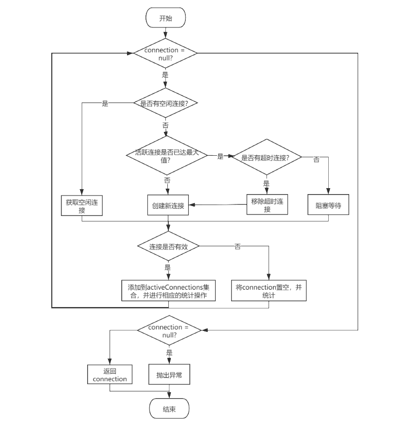

在数据持久层，数据源和事务是两个非常重要的组件，对数据持久层的影响很大，在实际开发中，一般会使用 Mybatis 集成第三方数据源组件，如：c3p0、Druid，另外，Mybatis 也提供了自己的数据库连接池实现，本文会通过 Mybatis 的源码实现来了解数据库连接池的设计。而事务方面，一般使用 Spring 进行事务的管理，这里不做详细分析。下面我们看一下 Mybatis 是如何对这两部分进行封装的。

## 1 DataSource

常见的数据源都会实现 javax.sql.DataSource 接口，Mybatis 中提供了两个该接口的实现类，分别是：PooledDataSource 和 UnpooledDataSource，并使用不同的工厂类分别管理这两个类的对象。

### 1.1 DataSourceFactory

DataSourceFactory 系列类 的设计比较简单，DataSourceFactory 作为顶级接口，UnpooledDataSourceFactory 实现了该接口，PooledDataSourceFactory 又继承了 UnpooledDataSourceFactory。

```java
public interface DataSourceFactory {

  // 设置 DataSource 的属性，一般紧跟在 DataSource 初始化之后
  void setProperties(Properties props);

  // 获取 DataSource对象
  DataSource getDataSource();
}


public class UnpooledDataSourceFactory implements DataSourceFactory {

  private static final String DRIVER_PROPERTY_PREFIX = "driver.";
  private static final int DRIVER_PROPERTY_PREFIX_LENGTH = DRIVER_PROPERTY_PREFIX.length();

  protected DataSource dataSource;

  // 在实例化该工厂时，就完成了 DataSource 的实例化
  public UnpooledDataSourceFactory() {
    this.dataSource = new UnpooledDataSource();
  }

  @Override
  public void setProperties(Properties properties) {
    Properties driverProperties = new Properties();
    // 创建 dataSource 对应的 MetaObject
    MetaObject metaDataSource = SystemMetaObject.forObject(dataSource);
    // 处理 properties 中配置的数据源信息
    for (Object key : properties.keySet()) {
      String propertyName = (String) key;
      if (propertyName.startsWith(DRIVER_PROPERTY_PREFIX)) {
        // 以 "driver." 开头的配置项是对 DataSource 的配置，将其记录到 driverProperties 中
        String value = properties.getProperty(propertyName);
        driverProperties.setProperty(propertyName.substring(DRIVER_PROPERTY_PREFIX_LENGTH), value);
      } else if (metaDataSource.hasSetter(propertyName)) {
        String value = (String) properties.get(propertyName);
        Object convertedValue = convertValue(metaDataSource, propertyName, value);
        metaDataSource.setValue(propertyName, convertedValue);
      } else {
        throw new DataSourceException("Unknown DataSource property: " + propertyName);
      }
    }
    if (driverProperties.size() > 0) {
      // 设置数据源 UnpooledDataSource 的 driverProperties属性，
      // PooledDataSource 中持有 UnpooledDataSource对象
      metaDataSource.setValue("driverProperties", driverProperties);
    }
  }

  @Override
  public DataSource getDataSource() {
    return dataSource;
  }
}


public class PooledDataSourceFactory extends UnpooledDataSourceFactory {

  // 与 UnpooledDataSourceFactory 的不同之处是，其初始化的 DataSource 为 PooledDataSource
  public PooledDataSourceFactory() {
    this.dataSource = new PooledDataSource();
  }
}
```

### 1.2 UnpooledDataSource

本实现类实现了 DataSource 接口 中的 getConnection() 及其重载方法，用于获取数据库连接。其中的主要属性及方法如下：

```java
public class UnpooledDataSource implements DataSource {

  // 加载 Driver驱动类 的类加载器
  private ClassLoader driverClassLoader;

  // 数据库连接驱动的相关配置，通过 UnpooledDataSourceFactory 的 setProperties()方法 设置进来的
  private Properties driverProperties;

  // 缓存所有已注册的 数据库连接驱动Driver
  private static Map<String, Driver> registeredDrivers = new ConcurrentHashMap<>();

  // 数据库连接驱动名称
  private String driver;
  // 数据库url
  private String url;
  // 用户名
  private String username;
  // 密码
  private String password;

  // 是否自动提交事务
  private Boolean autoCommit;
  // 默认的事务隔离级别
  private Integer defaultTransactionIsolationLevel;
  // 默认的网络连接超时时间
  private Integer defaultNetworkTimeout;

  /**
   * UnpooledDataSource 被加载时，会通过该静态代码块将已经在 DriverManager
   * 中注册的 JDBC Driver 注册到 registeredDrivers 中
   */
  static {
    Enumeration<Driver> drivers = DriverManager.getDrivers();
    while (drivers.hasMoreElements()) {
      Driver driver = drivers.nextElement();
      registeredDrivers.put(driver.getClass().getName(), driver);
    }
  }

  // getConnection() 及其重载方法、doGetConnection(String username, String password)方法
  // 最终都会调用本方法
  private Connection doGetConnection(Properties properties) throws SQLException {
    // 初始化数据库驱动，该方法会创建配置中指定的 Driver对象，
    // 并将其注册到 DriverManager 和 registeredDrivers 中
    initializeDriver();
    Connection connection = DriverManager.getConnection(url, properties);
    // 配置数据库连接属性，如：连接超时时间、是否自动提交事务、事务隔离级别
    configureConnection(connection);
    return connection;
  }

  private synchronized void initializeDriver() throws SQLException {
    // 判断驱动是否已注册
    if (!registeredDrivers.containsKey(driver)) {
      Class<?> driverType;
      try {
        if (driverClassLoader != null) {
          // 注册驱动
          driverType = Class.forName(driver, true, driverClassLoader);
        } else {
          driverType = Resources.classForName(driver);
        }
        // 通过反射获取 Driver实例对象
        Driver driverInstance = (Driver)driverType.newInstance();
        // 注册驱动到 DriverManager，DriverProxy 是 UnpooledDataSource 的内部类
        // 也是 Driver 的静态代理类
        DriverManager.registerDriver(new DriverProxy(driverInstance));
        // 将 driver 缓存到 registeredDrivers
        registeredDrivers.put(driver, driverInstance);
      } catch (Exception e) {
        throw new SQLException("Error setting driver on UnpooledDataSource. Cause: " + e);
      }
    }
  }

  private void configureConnection(Connection conn) throws SQLException {
    // 连接超时时间
    if (defaultNetworkTimeout != null) {
      conn.setNetworkTimeout(Executors.newSingleThreadExecutor(), defaultNetworkTimeout);
    }
    // 是否自动提交事务
    if (autoCommit != null && autoCommit != conn.getAutoCommit()) {
      conn.setAutoCommit(autoCommit);
    }
    // 事务隔离级别
    if (defaultTransactionIsolationLevel != null) {
      conn.setTransactionIsolation(defaultTransactionIsolationLevel);
    }
  }
}
```

### 1.3 PooledDataSource

数据库建立连接是非常耗时的，且并发的连接数也非常有限。而数据库连接池可以实现数据库的重用、提高响应速度、防止数据库因连接过多而假死等。
**数据库连接池的设计思路一般为：**

1. **连接池初始化时创建一定数量的连接，并添加到连接池中备用；**
2. **当程序需要使用数据库连接时，从连接池中请求，用完后会将其返还给连接池，而不是直接关闭；**
3. **连接池会控制总连接上限及空闲连接上线，如果连接池中的连接总数已达上限，且都被占用，后续的连接请求会短暂阻塞后重新尝试获取连接，如此循环，直到有连接可用；**
4. **如果连接池中空闲连接较多，已达到空闲连接上限，则返回的连接会被关闭掉，以降低系统开销。**

PooledDataSource 实现了简易的数据库连接池功能，其创建数据库连接的功能依赖了上面的 UnpooledDataSource。

#### 1.3.1 PooledConnection

PooledDataSource 通过管理 PooledConnection 来实现对 java.sql.Connection 的管理。PooledConnection 封装了 java.sql.Connection 数据库连接对象 及其代理对象（JDK 动态代理生成的）。PooledConnection 继承了 JDK 动态代理 的 InvocationHandler 接口。

```java
class PooledConnection implements InvocationHandler {

  // 记录当前 PooledConnection对象 所属的 PooledDataSource对象
  // 当调用 close()方法 时会将 PooledConnection 放回该 PooledDataSource
  private final PooledDataSource dataSource;
  // 真正的数据库连接对象
  private final Connection realConnection;
  // 代理连接对象
  private final Connection proxyConnection;
  // 从连接池中取出该连接时的时间戳
  private long checkoutTimestamp;
  // 创建该连接时的时间戳
  private long createdTimestamp;
  // 最后一次使用的 时间戳
  private long lastUsedTimestamp;
  // 由 数据库URL、用户名、密码 计算出来的 hash值，可用于标识该连接所在的连接池
  private int connectionTypeCode;
  // 检测当前 PooledConnection连接池连接对象 是否有效，主要用于 防止程序通过 close()方法 将
  // 连接还给连接池之后，依然通过该连接操作数据库
  private boolean valid;

  /**
   * invoke()方法 是本类的重点实现，也是 proxyConnection代理连接对象 的代理逻辑实现
   * 它会对 close()方法 的调用进行处理，并在调用 realConnection对象 的方法之前进行校验
   */
  @Override
  public Object invoke(Object proxy, Method method, Object[] args) throws Throwable {
    String methodName = method.getName();
    // 如果调用的是 close()方法，则将其放进连接池，而不是真的关闭连接
    if (CLOSE.hashCode() == methodName.hashCode() && CLOSE.equals(methodName)) {
      dataSource.pushConnection(this);
      return null;
    }
    try {
      if (!Object.class.equals(method.getDeclaringClass())) {
        // 通过上面的 valid字段 校验连接是否有效
        checkConnection();
      }
      // 调用 realConnection对象 的对应方法
      return method.invoke(realConnection, args);
    } catch (Throwable t) {
      throw ExceptionUtil.unwrapThrowable(t);
    }

  }

  private void checkConnection() throws SQLException {
    if (!valid) {
      throw new SQLException("Error accessing PooledConnection. Connection is invalid.");
    }
  }
}
```

#### 1.3.2 PoolState

PoolState 主要用于管理 PooledConnection 对象状态，其通过持有两个 List&lt;PooledConnection&gt;集合 分别管理空闲状态的连接 和 活跃状态的连接。另外，PoolState 还定义了一系列用于统计的字段。

```java
public class PoolState {

  // 所属的连接池对象
  protected PooledDataSource dataSource;

  // 空闲的连接
  protected final List<PooledConnection> idleConnections = new ArrayList<>();
  // 活跃的连接
  protected final List<PooledConnection> activeConnections = new ArrayList<>();

  // 请求数据库连接的次数
  protected long requestCount = 0;
  // 获取连接的累计时间（accumulate累计）
  protected long accumulatedRequestTime = 0;
  // CheckoutTime = 记录 应用从连接池取出连接到归还连接的时长
  // accumulatedCheckoutTime = 所有连接累计的CheckoutTime
  protected long accumulatedCheckoutTime = 0;
  // 超时连接的个数（当连接长时间未归还给连接池时，会被认为连接超时）
  protected long claimedOverdueConnectionCount = 0;
  // 累计超时时间
  protected long accumulatedCheckoutTimeOfOverdueConnections = 0;
  // 累计等待时间
  protected long accumulatedWaitTime = 0;
  // 等待次数
  protected long hadToWaitCount = 0;
  // 无效的连接数
  protected long badConnectionCount = 0;

  public PoolState(PooledDataSource dataSource) {
    this.dataSource = dataSource;
  }

  public synchronized long getRequestCount() {
    return requestCount;
  }

  public synchronized long getAverageRequestTime() {
    return requestCount == 0 ? 0 : accumulatedRequestTime / requestCount;
  }

  public synchronized long getAverageWaitTime() {
    return hadToWaitCount == 0 ? 0 : accumulatedWaitTime / hadToWaitCount;

  }

  public synchronized long getHadToWaitCount() {
    return hadToWaitCount;
  }

  public synchronized long getBadConnectionCount() {
    return badConnectionCount;
  }

  public synchronized long getClaimedOverdueConnectionCount() {
    return claimedOverdueConnectionCount;
  }

  public synchronized long getAverageOverdueCheckoutTime() {
    return claimedOverdueConnectionCount == 0 ? 0 : accumulatedCheckoutTimeOfOverdueConnections / claimedOverdueConnectionCount;
  }

  public synchronized long getAverageCheckoutTime() {
    return requestCount == 0 ? 0 : accumulatedCheckoutTime / requestCount;
  }

  public synchronized int getIdleConnectionCount() {
    return idleConnections.size();
  }

  public synchronized int getActiveConnectionCount() {
    return activeConnections.size();
  }

  @Override
  public synchronized String toString() {
    StringBuilder builder = new StringBuilder();
    builder.append("\n===CONFINGURATION==============================================");
    builder.append("\n jdbcDriver                     ").append(dataSource.getDriver());
    builder.append("\n jdbcUrl                        ").append(dataSource.getUrl());
    builder.append("\n jdbcUsername                   ").append(dataSource.getUsername());
    builder.append("\n jdbcPassword                   ").append(dataSource.getPassword() == null ? "NULL" : "************");
    builder.append("\n poolMaxActiveConnections       ").append(dataSource.poolMaximumActiveConnections);
    builder.append("\n poolMaxIdleConnections         ").append(dataSource.poolMaximumIdleConnections);
    builder.append("\n poolMaxCheckoutTime            ").append(dataSource.poolMaximumCheckoutTime);
    builder.append("\n poolTimeToWait                 ").append(dataSource.poolTimeToWait);
    builder.append("\n poolPingEnabled                ").append(dataSource.poolPingEnabled);
    builder.append("\n poolPingQuery                  ").append(dataSource.poolPingQuery);
    builder.append("\n poolPingConnectionsNotUsedFor  ").append(dataSource.poolPingConnectionsNotUsedFor);
    builder.append("\n ---STATUS-----------------------------------------------------");
    builder.append("\n activeConnections              ").append(getActiveConnectionCount());
    builder.append("\n idleConnections                ").append(getIdleConnectionCount());
    builder.append("\n requestCount                   ").append(getRequestCount());
    builder.append("\n averageRequestTime             ").append(getAverageRequestTime());
    builder.append("\n averageCheckoutTime            ").append(getAverageCheckoutTime());
    builder.append("\n claimedOverdue                 ").append(getClaimedOverdueConnectionCount());
    builder.append("\n averageOverdueCheckoutTime     ").append(getAverageOverdueCheckoutTime());
    builder.append("\n hadToWait                      ").append(getHadToWaitCount());
    builder.append("\n averageWaitTime                ").append(getAverageWaitTime());
    builder.append("\n badConnectionCount             ").append(getBadConnectionCount());
    builder.append("\n===============================================================");
    return builder.toString();
  }
}
```

#### 1.3.3 PooledDataSource

PooledDataSource 管理的数据库连接对象 是由其持有的 UnpooledDataSource 对象 创建的，并由 PoolState 管理所有连接的状态。
PooledDataSource 的 getConnection()方法 会首先调用 popConnection()方法 获取 PooledConnection 对象，然后通过 PooledConnection 的 getProxyConnection()方法 获取数据库连接的代理对象。popConnection()方法 是 PooledDataSource 的核心逻辑之一，其整体的逻辑关系如下图：



```java
public class PooledDataSource implements DataSource {

  private static final Log log = LogFactory.getLog(PooledDataSource.class);

  // 管理连接池状态 并统计连接信息
  private final PoolState state = new PoolState(this);

  // 该对象用于生成真正的数据库连接对象，构造函数中会初始化该字段
  private final UnpooledDataSource dataSource;

  // 最大活跃连接数
  protected int poolMaximumActiveConnections = 10;
  // 最大空闲连接数
  protected int poolMaximumIdleConnections = 5;
  // 最大Checkout时长
  protected int poolMaximumCheckoutTime = 20000;
  // 在无法获取连接时，线程需要等待的时间
  protected int poolTimeToWait = 20000;
  // 本地坏连接最大数
  protected int poolMaximumLocalBadConnectionTolerance = 3;
  // 检测数据库连接是否可用时，给数据库发送的sql语句
  protected String poolPingQuery = "NO PING QUERY SET";
  // 是否允许发送上述语句
  protected boolean poolPingEnabled;
  // 当连接超过poolPingConnectionsNotUsedFor毫秒未使用，
  // 就发送一次上述sql，检测连接连接是否正常
  protected int poolPingConnectionsNotUsedFor;

  // 根据数据库URL、用户名、密码 生成的一个hash值，
  // 该hash值用于标记当前的连接池，在构造函数中初始化
  private int expectedConnectionTypeCode;

  /**
   * 下面的两个 getConnection()方法 都会调用 popConnection()
   * 获取 PooledConnection对象，然后调用该对象的 getProxyConnection()方法
   * 获取数据库连接的代理对象
   */
  @Override
  public Connection getConnection() throws SQLException {
    return popConnection(dataSource.getUsername(), dataSource.getPassword()).getProxyConnection();
  }

  @Override
  public Connection getConnection(String username, String password) throws SQLException {
    return popConnection(username, password).getProxyConnection();
  }

  /**
   * 本方法实现了连接池获取连接对象的具体逻辑，是 PooledDataSource 的核心逻辑之一
   */
  private PooledConnection popConnection(String username, String password) throws SQLException {
    boolean countedWait = false;
    PooledConnection conn = null;
    long t = System.currentTimeMillis();
    int localBadConnectionCount = 0;

    // 循环获取数据库连接对象，直到获取成功
    while (conn == null) {
      // 连接池的连接是公共资源，要对线程加锁
      synchronized (state) {
        // 如果连接池中有空闲的 数据库连接对象，就取出一个
        if (!state.idleConnections.isEmpty()) {
          conn = state.idleConnections.remove(0);
          if (log.isDebugEnabled()) {
            log.debug("Checked out connection " + conn.getRealHashCode() + " from pool.");
          }
        } else {
          // 没有空闲的连接对象，就判断一下 活跃的连接数是否已达 设定的峰值
          if (state.activeConnections.size() < poolMaximumActiveConnections) {
            // 还没达到峰值 就创建一个新的连接
            conn = new PooledConnection(dataSource.getConnection(), this);
            if (log.isDebugEnabled()) {
              log.debug("Created connection " + conn.getRealHashCode() + ".");
            }
          } else {
            // 如果活跃的连接已达上限，就取出最老的活跃连接对象，判断其是否超时
            PooledConnection oldestActiveConnection = state.activeConnections.get(0);
            long longestCheckoutTime = oldestActiveConnection.getCheckoutTime();
            if (longestCheckoutTime > poolMaximumCheckoutTime) {
              // 如果最老的连接超时了，就在 PoolState 中记录一下相关信息，然后将该连接对象释放掉
              state.claimedOverdueConnectionCount++;
              state.accumulatedCheckoutTimeOfOverdueConnections += longestCheckoutTime;
              state.accumulatedCheckoutTime += longestCheckoutTime;
              state.activeConnections.remove(oldestActiveConnection);
              // 如果最老的连接不是 自动提交事务的，就将事务回滚掉
              if (!oldestActiveConnection.getRealConnection().getAutoCommit()) {
                try {
                  oldestActiveConnection.getRealConnection().rollback();
                } catch (SQLException e) {
                  /*
                     Just log a message for debug and continue to execute the following
                     statement like nothing happened.
                     Wrap the bad connection with a new PooledConnection, this will help
                     to not interrupt current executing thread and give current thread a
                     chance to join the next competition for another valid/good database
                     connection. At the end of this loop, bad {@link @conn} will be set as null.
                   */
                  log.debug("Bad connection. Could not roll back");
                }
              }
              // 从最老连接中取出真正的 数据库连接对象及相关信息，用来构建新的 PooledConnection对象
              conn = new PooledConnection(oldestActiveConnection.getRealConnection(), this);
              conn.setCreatedTimestamp(oldestActiveConnection.getCreatedTimestamp());
              conn.setLastUsedTimestamp(oldestActiveConnection.getLastUsedTimestamp());
              // 将最老活跃连接设为无效
              oldestActiveConnection.invalidate();
              if (log.isDebugEnabled()) {
                log.debug("Claimed overdue connection " + conn.getRealHashCode() + ".");
              }
            } else {
              // 如果最老的连接对象也没超时，则进入阻塞等待，
              // 等待时间 poolTimeToWait 可自行设置
              try {
                if (!countedWait) {
                  // 等待次数加一
                  state.hadToWaitCount++;
                  countedWait = true;
                }
                if (log.isDebugEnabled()) {
                  log.debug("Waiting as long as " + poolTimeToWait + " milliseconds for connection.");
                }
                long wt = System.currentTimeMillis();
                // native方法，使执行到这里的线程阻塞等待 poolTimeToWait毫秒
                state.wait(poolTimeToWait);
                // 统计累计等待的时间
                state.accumulatedWaitTime += System.currentTimeMillis() - wt;
              } catch (InterruptedException e) {
                break;
              }
            }
          }
        }
        // 到了这里 基本上就获取到连接对象咯，但我们还要确认一下该连接对象是否是有效的 可用的
        if (conn != null) {
          // ping一下数据库服务器，确认该连接对象是否有效
          if (conn.isValid()) {
            // 如果事务提交配置为手动的，则先让该连接回滚一下事务，防止脏数据的出现
            if (!conn.getRealConnection().getAutoCommit()) {
              conn.getRealConnection().rollback();
            }
            // 设置 由数据库URL、用户名、密码 计算出来的hash值，可用于标识该连接所在的连接池
            conn.setConnectionTypeCode(assembleConnectionTypeCode(dataSource.getUrl(), username, password));
            // 设置 从连接池中取出该连接时的时间戳
            conn.setCheckoutTimestamp(System.currentTimeMillis());
            // 设置 最后一次使用的时间戳
            conn.setLastUsedTimestamp(System.currentTimeMillis());
            // 将该连接加入活跃的连接对象列表
            state.activeConnections.add(conn);
            // 请求数据库连接的次数加一
            state.requestCount++;
            // 计算 获取连接的累计时间（accumulate累计）
            state.accumulatedRequestTime += System.currentTimeMillis() - t;
          // 如果获取到的连接无效
          } else {
            if (log.isDebugEnabled()) {
              log.debug("A bad connection (" + conn.getRealHashCode() + ") was returned from the pool, getting another connection.");
            }
            // 对无效连接进行统计
            state.badConnectionCount++;
            localBadConnectionCount++;
            conn = null;
            // 如果无效连接超出 阈值，则抛出异常
            if (localBadConnectionCount > (poolMaximumIdleConnections + poolMaximumLocalBadConnectionTolerance)) {
              if (log.isDebugEnabled()) {
                log.debug("PooledDataSource: Could not get a good connection to the database.");
              }
              throw new SQLException("PooledDataSource: Could not get a good connection to the database.");
            }
          }
        }
      }

    }

    // 如果到了这里 连接还为空，则抛出一个未知的服务异常
    if (conn == null) {
      if (log.isDebugEnabled()) {
        log.debug("PooledDataSource: Unknown severe error condition.  The connection pool returned a null connection.");
      }
      throw new SQLException("PooledDataSource: Unknown severe error condition.  The connection pool returned a null connection.");
    }

    // 返回数据库连接对象
    return conn;
  }

  /**
   * 看一下之前讲过的 PooledConnection 中的 动态代理方法invoke()，可以发现
   * 当调用数据库连接代理对象的 close()方法 时，并未关闭真正的数据库连接，
   * 而是调用了本方法，将连接对象归还给连接池，方便后续使用，本方法也是 PooledDataSource 的核心逻辑之一
   */
  protected void pushConnection(PooledConnection conn) throws SQLException {
    // 国际惯例，操作公共资源先上个锁
    synchronized (state) {
      // 先将该连接从活跃的连接对象列表中剔除
      state.activeConnections.remove(conn);
      // 如果该连接有效
      if (conn.isValid()) {
        // 如果连接池中的空闲连接数未达到阈值 且 该连接确实属于
        // 本连接池（通过之前获取的 expectedConnectionTypeCode 进行校验）
        if (state.idleConnections.size() < poolMaximumIdleConnections && conn.getConnectionTypeCode() == expectedConnectionTypeCode) {
          // CheckoutTime = 应用从连接池取出连接到归还连接的时长
          // accumulatedCheckoutTime = 所有连接累计的CheckoutTime
          state.accumulatedCheckoutTime += conn.getCheckoutTime();
          // 不是自动提交事务的连接 先回滚一波
          if (!conn.getRealConnection().getAutoCommit()) {
            conn.getRealConnection().rollback();
          }
          // 从 conn 中取出真正的 数据库连接对象，重新封装成 PooledConnection
          PooledConnection newConn = new PooledConnection(conn.getRealConnection(), this);
          // 将 newConn 放进空闲连接对象列表
          state.idleConnections.add(newConn);
          // 设置 newConn 的相关属性
          newConn.setCreatedTimestamp(conn.getCreatedTimestamp());
          newConn.setLastUsedTimestamp(conn.getLastUsedTimestamp());
          // 将原本的 conn 作废
          conn.invalidate();
          if (log.isDebugEnabled()) {
            log.debug("Returned connection " + newConn.getRealHashCode() + " to pool.");
          }
          // 唤醒阻塞等待的线程
          state.notifyAll();
        } else {
          // 如果空闲连接已达阈值 或 该连接对象不属于本连接池，则做好统计数据
          // 回滚连接的事务，关闭真正的连接，最后作废 该conn
          state.accumulatedCheckoutTime += conn.getCheckoutTime();
          if (!conn.getRealConnection().getAutoCommit()) {
            conn.getRealConnection().rollback();
          }
          conn.getRealConnection().close();
          if (log.isDebugEnabled()) {
            log.debug("Closed connection " + conn.getRealHashCode() + ".");
          }
          conn.invalidate();
        }
      // 如果该连接是无效的，则记录一下无效的连接数
      } else {
        if (log.isDebugEnabled()) {
          log.debug("A bad connection (" + conn.getRealHashCode() + ") attempted to return to the pool, discarding connection.");
        }
        state.badConnectionCount++;
      }
    }
  }

  /**
   * 关闭连接池中 所有活跃的 及 空闲的连接
   * 当修改连接池的配置（如：用户名、密码、URL等），都会调用本方法
   */
  public void forceCloseAll() {
    // 日常上锁
    synchronized (state) {
      // 更新当前连接池的标识
      expectedConnectionTypeCode = assembleConnectionTypeCode(dataSource.getUrl(), dataSource.getUsername(), dataSource.getPassword());
      // 依次关闭活跃的连接对象
      for (int i = state.activeConnections.size(); i > 0; i--) {
        try {
          PooledConnection conn = state.activeConnections.remove(i - 1);
          conn.invalidate();

          Connection realConn = conn.getRealConnection();
          if (!realConn.getAutoCommit()) {
            realConn.rollback();
          }
          realConn.close();
        } catch (Exception e) {
          // ignore
        }
      }
      // 依次关闭空闲的连接对象
      for (int i = state.idleConnections.size(); i > 0; i--) {
        try {
          PooledConnection conn = state.idleConnections.remove(i - 1);
          conn.invalidate();

          Connection realConn = conn.getRealConnection();
          if (!realConn.getAutoCommit()) {
            realConn.rollback();
          }
          realConn.close();
        } catch (Exception e) {
          // ignore
        }
      }
    }
    if (log.isDebugEnabled()) {
      log.debug("PooledDataSource forcefully closed/removed all connections.");
    }
  }
}
```

最后，我们来看一下 popConnection() 和 pushConnection() 都调用了的 isValid()方法，该方法除了检测 PooledConnection 中的 valid 字段 外 还还会调用 PooledDataSource 中的 pingConnection()方法，让数据库连接对象 执行指定的 sql 语句，检测连接是否正常。

```java
class PooledConnection implements InvocationHandler {
  /**
   * 检测 PooledConnection对象 的有效性
   */
  public boolean isValid() {
    return valid && realConnection != null && dataSource.pingConnection(this);
  }
}


public class PooledDataSource implements DataSource {
  /**
   * ping 一下数据库，检测数据库连接是否正常
   */
  protected boolean pingConnection(PooledConnection conn) {
    boolean result = true;

    try {
      result = !conn.getRealConnection().isClosed();
    } catch (SQLException e) {
      if (log.isDebugEnabled()) {
        log.debug("Connection " + conn.getRealHashCode() + " is BAD: " + e.getMessage());
      }
      result = false;
    }

    if (result) {
      // 是否允许发送检测语句，检测数据库连接是否正常，poolPingEnabled 可自行配置
      // 该检测会牺牲一定的系统资源，以提高安全性
      if (poolPingEnabled) {
        // 超过 poolPingConnectionsNotUsedFor毫秒 未使用的连接 才会检测其连接状态
        if (poolPingConnectionsNotUsedFor >= 0 && conn.getTimeElapsedSinceLastUse() > poolPingConnectionsNotUsedFor) {
          try {
            if (log.isDebugEnabled()) {
              log.debug("Testing connection " + conn.getRealHashCode() + " ...");
            }
            // 获取真正的连接对象，执行 poolPingQuery = "NO PING QUERY SET" sql语句
            Connection realConn = conn.getRealConnection();
            try (Statement statement = realConn.createStatement()) {
              statement.executeQuery(poolPingQuery).close();
            }
            if (!realConn.getAutoCommit()) {
              realConn.rollback();
            }
            result = true;
            if (log.isDebugEnabled()) {
              log.debug("Connection " + conn.getRealHashCode() + " is GOOD!");
            }
            // 如果上面这段代码抛出异常，则说明数据库连接有问题，将该连接关闭，返回false
          } catch (Exception e) {
            log.warn("Execution of ping query '" + poolPingQuery + "' failed: " + e.getMessage());
            try {
              conn.getRealConnection().close();
            } catch (Exception e2) {
              //ignore
            }
            result = false;
            if (log.isDebugEnabled()) {
              log.debug("Connection " + conn.getRealHashCode() + " is BAD: " + e.getMessage());
            }
          }
        }
      }
    }
    return result;
  }
}
```

## 2 Transaction

遵循 “接口-实现类” 的设计原则，Mybatis 也是先使用 Transaction 接口 对数据库事务做了抽象，而实现类则只提供了两个，即：JdbcTransaction 和 ManagedTransaction。这两种对象的获取，使用了两个对应的工厂类 JdbcTransactionFactory 和 ManagedTransactionFactory。
不过一般我们并不会使用 Mybatis 管理事务，而是将 Mybatis 集成到 Spring，由 Spring 进行事务的管理。细节部分会在后面的文章中详细讲解。

```java
public interface Transaction {

  /**
   * 获取连接对象
   */
  Connection getConnection() throws SQLException;

  /**
   * 提交事务
   */
  void commit() throws SQLException;

  /**
   * 回滚事务
   */
  void rollback() throws SQLException;

  /**
   * 关闭数据库连接
   */
  void close() throws SQLException;

  /**
   * 获取配置的事务超时时间
   */
  Integer getTimeout() throws SQLException;
}

public class JdbcTransaction implements Transaction {

  private static final Log log = LogFactory.getLog(JdbcTransaction.class);

  // 当前事务对应的数据库连接
  protected Connection connection;
  // 当前事务对应的数据源
  protected DataSource dataSource;
  // 事务隔离级别
  protected TransactionIsolationLevel level;
  // 是否自动提交
  protected boolean autoCommit;

  public JdbcTransaction(DataSource ds, TransactionIsolationLevel desiredLevel, boolean desiredAutoCommit) {
    dataSource = ds;
    level = desiredLevel;
    autoCommit = desiredAutoCommit;
  }

  public JdbcTransaction(Connection connection) {
    this.connection = connection;
  }

  @Override
  public Connection getConnection() throws SQLException {
    if (connection == null) {
      openConnection();
    }
    return connection;
  }

  // 提交、回滚、关闭等操作的代码都比较简单，只对原生的 JDBC操作 做了简单封装
  @Override
  public void commit() throws SQLException {
    if (connection != null && !connection.getAutoCommit()) {
      if (log.isDebugEnabled()) {
        log.debug("Committing JDBC Connection [" + connection + "]");
      }
      connection.commit();
    }
  }

  @Override
  public void rollback() throws SQLException {
    if (connection != null && !connection.getAutoCommit()) {
      if (log.isDebugEnabled()) {
        log.debug("Rolling back JDBC Connection [" + connection + "]");
      }
      connection.rollback();
    }
  }

  @Override
  public void close() throws SQLException {
    if (connection != null) {
      resetAutoCommit();
      if (log.isDebugEnabled()) {
        log.debug("Closing JDBC Connection [" + connection + "]");
      }
      connection.close();
    }
  }

  protected void setDesiredAutoCommit(boolean desiredAutoCommit) {
    try {
      if (connection.getAutoCommit() != desiredAutoCommit) {
        if (log.isDebugEnabled()) {
          log.debug("Setting autocommit to " + desiredAutoCommit + " on JDBC Connection [" + connection + "]");
        }
        connection.setAutoCommit(desiredAutoCommit);
      }
    } catch (SQLException e) {
      // Only a very poorly implemented driver would fail here,
      // and there's not much we can do about that.
      throw new TransactionException("Error configuring AutoCommit.  "
          + "Your driver may not support getAutoCommit() or setAutoCommit(). "
          + "Requested setting: " + desiredAutoCommit + ".  Cause: " + e, e);
    }
  }

  protected void resetAutoCommit() {
    try {
      if (!connection.getAutoCommit()) {
        // MyBatis does not call commit/rollback on a connection if just selects were performed.
        // Some databases start transactions with select statements
        // and they mandate a commit/rollback before closing the connection.
        // A workaround is setting the autocommit to true before closing the connection.
        // Sybase throws an exception here.
        if (log.isDebugEnabled()) {
          log.debug("Resetting autocommit to true on JDBC Connection [" + connection + "]");
        }
        connection.setAutoCommit(true);
      }
    } catch (SQLException e) {
      if (log.isDebugEnabled()) {
        log.debug("Error resetting autocommit to true "
            + "before closing the connection.  Cause: " + e);
      }
    }
  }

  protected void openConnection() throws SQLException {
    if (log.isDebugEnabled()) {
      log.debug("Opening JDBC Connection");
    }
    connection = dataSource.getConnection();
    if (level != null) {
      connection.setTransactionIsolation(level.getLevel());
    }
    setDesiredAutoCommit(autoCommit);
  }

  @Override
  public Integer getTimeout() throws SQLException {
    return null;
  }

}

public class ManagedTransaction implements Transaction {

  private static final Log log = LogFactory.getLog(ManagedTransaction.class);

  // 数据源
  private DataSource dataSource;
  // 事务隔离级别
  private TransactionIsolationLevel level;
  // 对应的数据库连接
  private Connection connection;
  // 控制是否关闭持有的连接，在 close()方法 中用其判断是否真的关闭连接
  private final boolean closeConnection;

  // 本类的实现也很简单，commit()、rollback()方法 都是空实现
  public ManagedTransaction(Connection connection, boolean closeConnection) {
    this.connection = connection;
    this.closeConnection = closeConnection;
  }

  public ManagedTransaction(DataSource ds, TransactionIsolationLevel level, boolean closeConnection) {
    this.dataSource = ds;
    this.level = level;
    this.closeConnection = closeConnection;
  }

  @Override
  public Connection getConnection() throws SQLException {
    if (this.connection == null) {
      openConnection();
    }
    return this.connection;
  }

  @Override
  public void commit() throws SQLException {
    // Does nothing
  }

  @Override
  public void rollback() throws SQLException {
    // Does nothing
  }

  @Override
  public void close() throws SQLException {
    if (this.closeConnection && this.connection != null) {
      if (log.isDebugEnabled()) {
        log.debug("Closing JDBC Connection [" + this.connection + "]");
      }
      this.connection.close();
    }
  }

  protected void openConnection() throws SQLException {
    if (log.isDebugEnabled()) {
      log.debug("Opening JDBC Connection");
    }
    this.connection = this.dataSource.getConnection();
    if (this.level != null) {
      this.connection.setTransactionIsolation(this.level.getLevel());
    }
  }

  @Override
  public Integer getTimeout() throws SQLException {
    return null;
  }

}

public interface TransactionFactory {

  /**
   * 配置 TransactionFactory对象，一般会在完成 TransactionFactory对象
   * 初始化之后 就进行自定义属性配置
   */
  default void setProperties(Properties props) {
    // NOP
  }

  /**
   * 在指定的数据库连接上创建 Transaction事务对象
   */
  Transaction newTransaction(Connection conn);

  /**
   * 从指定数据源获取数据库连接，并在此连接上创建 Transaction对象
   */
  Transaction newTransaction(DataSource dataSource, TransactionIsolationLevel level, boolean autoCommit);
}

public class JdbcTransactionFactory implements TransactionFactory {

  @Override
  public Transaction newTransaction(Connection conn) {
    return new JdbcTransaction(conn);
  }

  @Override
  public Transaction newTransaction(DataSource ds, TransactionIsolationLevel level, boolean autoCommit) {
    return new JdbcTransaction(ds, level, autoCommit);
  }
}

public class ManagedTransactionFactory implements TransactionFactory {

  private boolean closeConnection = true;

  @Override
  public void setProperties(Properties props) {
    if (props != null) {
      String closeConnectionProperty = props.getProperty("closeConnection");
      if (closeConnectionProperty != null) {
        closeConnection = Boolean.valueOf(closeConnectionProperty);
      }
    }
  }

  @Override
  public Transaction newTransaction(Connection conn) {
    return new ManagedTransaction(conn, closeConnection);
  }

  @Override
  public Transaction newTransaction(DataSource ds, TransactionIsolationLevel level, boolean autoCommit) {
    // Silently ignores autocommit and isolation level, as managed transactions are entirely
    // controlled by an external manager.  It's silently ignored so that
    // code remains portable between managed and unmanaged configurations.
    return new ManagedTransaction(ds, level, closeConnection);
  }
}
```
