# mybatis 反射

- Author: [HuiFer](https://github.com/huifer)
- Description: 该文介绍 mybatis 反射相关类的源码
- 源码阅读工程: [SourceHot-Mybatis](https://github.com/SourceHot/mybatis-read.git)

## addDefaultConstructor

- mybatis 的反射相关内容在`org.apache.ibatis.reflection` 下存放. 本片主要讲解`org.apache.ibatis.reflection.Reflector`类, 先看一下该类的属性

```java
public class Reflector {

     /**
        * 实体类.class
        */
       private final Class<?> type;
       /**
        * 可读 属性
        */
       private final String[] readablePropertyNames;
       /**
        * 可写 属性值
        */
       private final String[] writablePropertyNames;
       /**
        * set 方法列表
        */
       private final Map<String, Invoker> setMethods = new HashMap<>();
       /**
        * get 方法列表
        */
       private final Map<String, Invoker> getMethods = new HashMap<>();
       /**
        * set 的数据类型
        */
       private final Map<String, Class<?>> setTypes = new HashMap<>();
       /**
        * get 的数据类型
        */
       private final Map<String, Class<?>> getTypes = new HashMap<>();
       /**
        * 构造函数
        */
       private Constructor<?> defaultConstructor;

       /**
        * 缓存数据, 大写KEY
        */
       private Map<String, String> caseInsensitivePropertyMap = new HashMap<>();

}
```

- 构造方法, 构造方法传入一个类的字节码,在构造方法中设置相关的属性值

```java
public class Reflector {

/**
 * @param clazz 待解析类的字节码
 */
public Reflector(Class<?> clazz) {
    type = clazz;
    // 构造方法
    addDefaultConstructor(clazz);
    // get 方法
    addGetMethods(clazz);
    // set 方法
    addSetMethods(clazz);
    // 字段值
    addFields(clazz);
    readablePropertyNames = getMethods.keySet().toArray(new String[0]);
    writablePropertyNames = setMethods.keySet().toArray(new String[0]);
    for (String propName : readablePropertyNames) {
        // 循环操作设置到缓存中,
        caseInsensitivePropertyMap.put(propName.toUpperCase(Locale.ENGLISH), propName);
    }
    for (String propName : writablePropertyNames) {
        caseInsensitivePropertyMap.put(propName.toUpperCase(Locale.ENGLISH), propName);
    }
}
}
```

- `addDefaultConstructor` 方法 , 下面截图内容为 JDK8 mybatis 中 的内容

```java
    private void addDefaultConstructor(Class<?> clazz) {

        // 获取类里面的所有构造方法
        Constructor<?>[] constructors = clazz.getDeclaredConstructors();
        // 过滤得到空参构造 constructor -> constructor.getParameterTypes().length == 0
        Arrays.stream(constructors).filter(constructor -> constructor.getParameterTypes().length == 0)
                .findAny().ifPresent(constructor -> {
            System.out.println("有空参构造");
            this.defaultConstructor = constructor;
        });
    }
```

- 创建一个测试类

```java
public class People {
    private String name;

    public People() {
    }

    public People(String name) {
        this.name = name;
    }

    @Override
    public String toString() {
        return "People{" +
                "name='" + name + '\'' +
                '}';
    }

    public String getName() {
        return name;
    }

    public void setName(String name) {
        this.name = name;
    }
}

```

```java
import org.junit.jupiter.api.Test;

import java.lang.reflect.Constructor;

class HfReflectorTest {
    @Test
    void getDefaultConstructorTest() throws Exception {
        Reflector reflector = new Reflector(People.class);
        // 获取空参构造方法
        Constructor<?> defaultConstructor = reflector.getDefaultConstructor();
        People o = (People) defaultConstructor.newInstance();
        o.setName("hhh");

        System.out.println(o);
    }
}
```

- 准备工作完成了开始进行 debug , 在`org.apache.ibatis.reflection.Reflector#addDefaultConstructor`这个方法上打上断点

  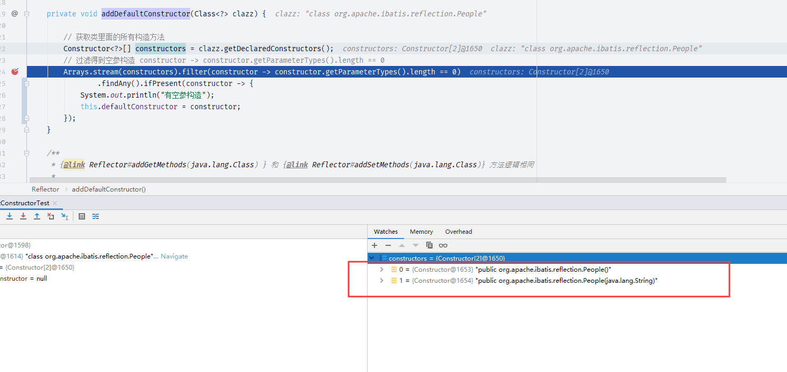

  观察`constructors`属性存在两个方法,这两个方法就是我在`People`类中的构造方法.

  根据语法内容我们应该对`parameterTypes`属性进行查看

  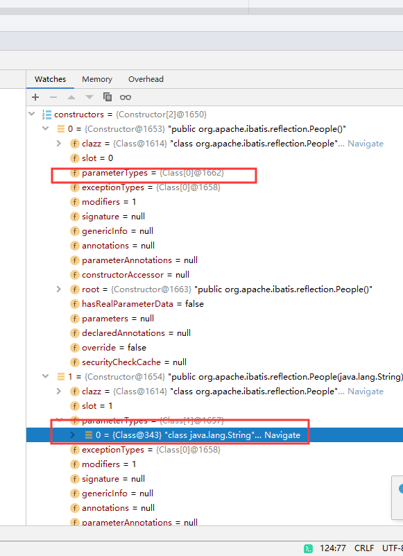

可以发现空参构造的`parameterTypes`长度是 0.因此可以确认`org.apache.ibatis.reflection.Reflector#addDefaultConstructor`方法获取了空参构造

- 继续看`org.apache.ibatis.reflection.Reflector#getDefaultConstructor`方法, 该方法是获取构造函数的方法,如果构造函数没有就抛出异常,这也是为什么我们的实体类需要把空参构造写上去的原因。

  ```java
      public Constructor<?> getDefaultConstructor() {
          if (defaultConstructor != null) {
              return defaultConstructor;
          } else {
              // 如果没有空参构造抛出的异常
              throw new ReflectionException("There is no default constructor for " + type);
          }
      }
  ```

## addGetMethods

- 该方法获取了所有`get`和`is`开头的方法

  ```java
      private void addGetMethods(Class<?> clazz) {
          // 反射方法
          Map<String, List<Method>> conflictingGetters = new HashMap<>();
          Method[] methods = getClassMethods(clazz);
          // JDK8 filter 过滤get 开头的方法
          Arrays.stream(methods).filter(m -> m.getParameterTypes().length == 0 && PropertyNamer.isGetter(m.getName()))
                  .forEach(m -> addMethodConflict(conflictingGetters, PropertyNamer.methodToProperty(m.getName()), m));
          resolveGetterConflicts(conflictingGetters);
      }
  ```

- 该方法中依旧使用了 JDK8 语法通过`m.getParameterTypes().length == 0 && PropertyNamer.isGetter(m.getName())`来判断是否是`get`或·`is`开头的内容

- 调用`org.apache.ibatis.reflection.property.PropertyNamer`

  ```java
      public static boolean isGetter(String name) {
          // 在语义上 is 开头的也是get开头的
          return (name.startsWith("get") && name.length() > 3) || (name.startsWith("is") && name.length() > 2);
      }
  ```

- `resolveGetterConflicts`方法后续介绍

## getClassMethods

- `org.apache.ibatis.reflection.Reflector#getClassMethods`,该方法将传入对象的所有可见方法都获取到进行唯一标识处理成一个`Map`对象 添加方法为`org.apache.ibatis.reflection.Reflector#addUniqueMethods`

  ```java
      private Method[] getClassMethods(Class<?> clazz) {
          // 方法唯一标识: 方法
          Map<String, Method> uniqueMethods = new HashMap<>();
          Class<?> currentClass = clazz;
          while (currentClass != null && currentClass != Object.class) {
              // getDeclaredMethods 获取 public ,private , protcted 方法
              addUniqueMethods(uniqueMethods, currentClass.getDeclaredMethods());

              // we also need to look for interface methods -
              // because the class may be abstract
              // 当前类是否继承别的类(实现接口)如果继承则需要进行操作
              Class<?>[] interfaces = currentClass.getInterfaces();
              for (Class<?> anInterface : interfaces) {
                  // getMethods 获取本身和父类的 public 方法
                  addUniqueMethods(uniqueMethods, anInterface.getMethods());
              }

              // 循环往上一层一层寻找最后回到 Object 类 的上级为null 结束
              currentClass = currentClass.getSuperclass();
          }

          Collection<Method> methods = uniqueMethods.values();

          return methods.toArray(new Method[0]);
      }

  ```

- `org.apache.ibatis.reflection.Reflector#addUniqueMethods`

  ```java
      private void addUniqueMethods(Map<String, Method> uniqueMethods, Method[] methods) {
          for (Method currentMethod : methods) {
              // 桥接, 具体还不知道
              // TODO: 2019/12/9 JAVA 桥接方法
              if (!currentMethod.isBridge()) {
                  // 方法的唯一标识
                  String signature = getSignature(currentMethod);
                  // check to see if the method is already known
                  // if it is known, then an extended class must have
                  // overridden a method
                  if (!uniqueMethods.containsKey(signature)) {
                      uniqueMethods.put(signature, currentMethod);
                  }
              }
          }
      }
  ```

- 唯一标识方法`org.apache.ibatis.reflection.Reflector#getSignature`

  ```java
      /**
       * 方法唯一标识,返回值类型#方法名称：参数列表
       *
       * @param method
       * @return
       */
      private String getSignature(Method method) {
          StringBuilder sb = new StringBuilder();
          Class<?> returnType = method.getReturnType();
          if (returnType != null) {
              sb.append(returnType.getName()).append('#');
          }
          sb.append(method.getName());
          Class<?>[] parameters = method.getParameterTypes();
          for (int i = 0; i < parameters.length; i++) {
              sb.append(i == 0 ? ':' : ',').append(parameters[i].getName());
          }
          return sb.toString();
      }
  ```

- 照旧我们进行 debug 当前方法为`toString`方法

  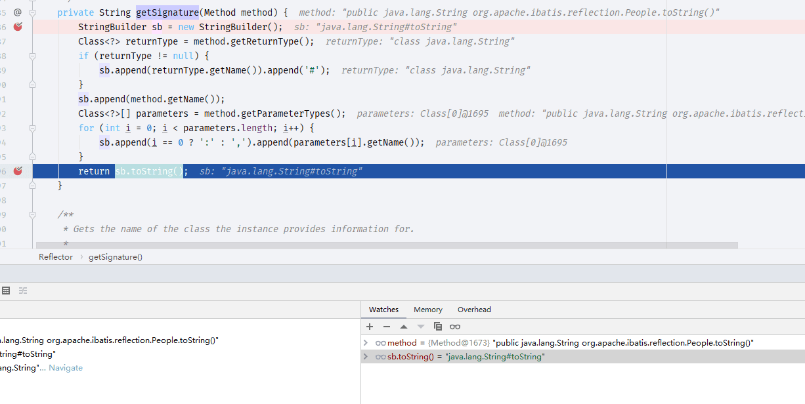

  从返回结果可以看到`sb.toString`返回的是： `返回值类型#方法名`

  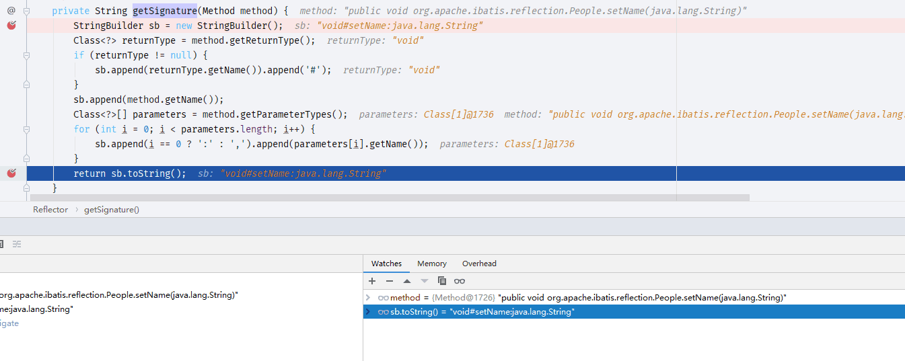

  上图返回结果为`void#setName:java.lang.String` 命名规则：`返回值类型#方法名称:参数列表`

  回过头看看`uniqueMethods`里面是什么

  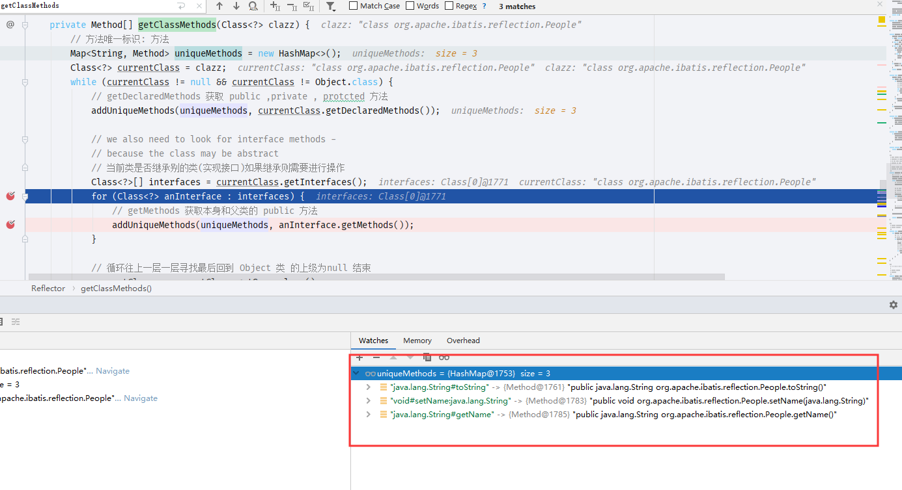

  方法签名:方法

  目前完成了一部分还有一个继承问题需要 debug 看一下, 编写一个`Man`继承`People` 还需要实现接口

  ```java
  public class Man extends People implements TestManInterface {
      @Override
      public Integer inte() {
          return 1;
      }

      public String hello() {
          return "hello";
      }
  }

  ```

  ```java
  public interface TestManInterface {
      public Integer inte();
  }
  ```

  目标明确了就直接在

  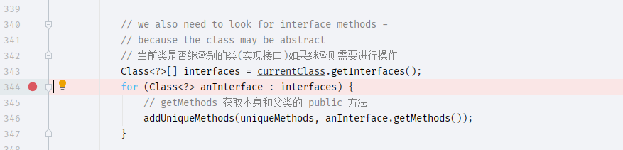

  这里打断点了

  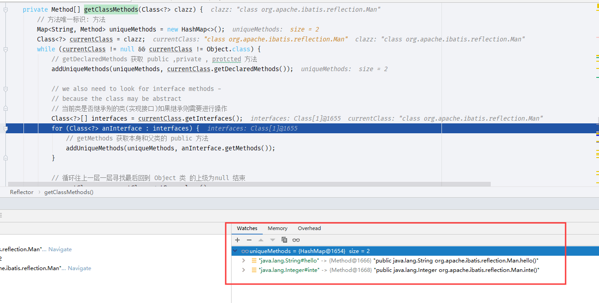

  在进入循环之前回率先加载本类的所有可见方法

  ```java
       if (!uniqueMethods.containsKey(signature)) {
           // 如果存在该方法唯一签名则不添加
                      uniqueMethods.put(signature, currentMethod);
                  }
  ```

  接下来断点继续往下走

  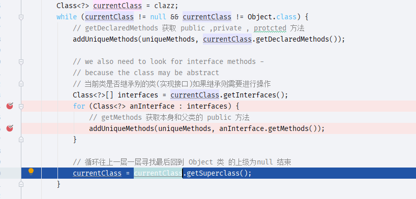

  走到这一步我们来看看`currentClass.getSuperclass()`是不是上一级的类

  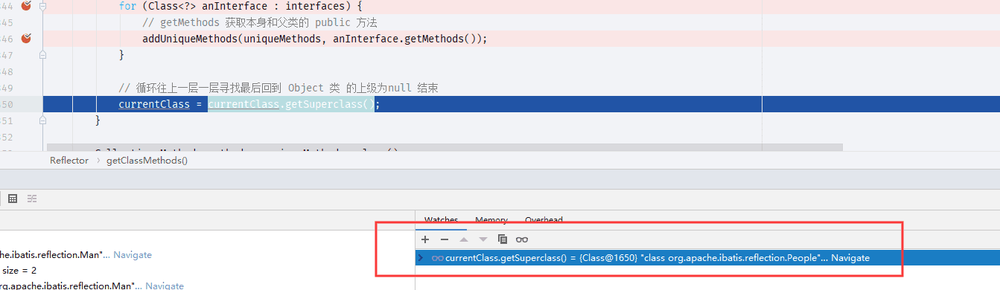

  通过断点可见这个`currentClass`现在是`People`类,根据之前所说的最终`uniqueMethods`应该存在父类的方法

  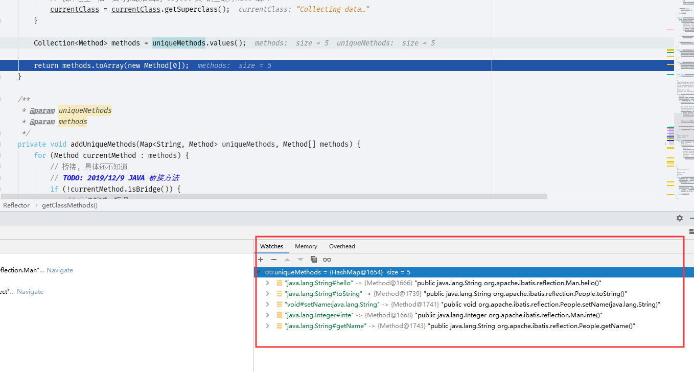

  可以看到父类的方法也都存在了

## resolveGetterConflicts

- `org.apache.ibatis.reflection.Reflector#resolveGetterConflicts`

  这个方法解决了`get`方法的冲突问题,同名方法不同返回值

  ```java
  private void resolveGetterConflicts(Map<String, List<Method>> conflictingGetters) {
          for (Entry<String, List<Method>> entry : conflictingGetters.entrySet()) {
              Method winner = null;
              String propName = entry.getKey();
              boolean isAmbiguous = false;
              for (Method candidate : entry.getValue()) {
                  if (winner == null) {
                      winner = candidate;
                      continue;
                  }
                  Class<?> winnerType = winner.getReturnType();
                  Class<?> candidateType = candidate.getReturnType();
                  if (candidateType.equals(winnerType)) {
                      if (!boolean.class.equals(candidateType)) {
                          isAmbiguous = true;
                          break;
                      } else if (candidate.getName().startsWith("is")) {
                          winner = candidate;
                      }
                  } else if (candidateType.isAssignableFrom(winnerType)) {
                      // OK getter type is descendant
                  } else if (winnerType.isAssignableFrom(candidateType)) {
                      winner = candidate;
                  } else {
                      isAmbiguous = true;
                      break;
                  }
              }
              addGetMethod(propName, winner, isAmbiguous);
          }
      }
  ```

## addFields

- `org.apache.ibatis.reflection.Reflector#addFields`

  获取类的所有字段没什么好说的直接递归就可以获取了.

  ```jade
      private void addFields(Class<?> clazz) {
          Field[] fields = clazz.getDeclaredFields();
          for (Field field : fields) {
              if (!setMethods.containsKey(field.getName())) {
                  // issue #379 - removed the check for final because JDK 1.5 allows
                  // modification of final fields through reflection (JSR-133). (JGB)
                  // pr #16 - final static can only be set by the classloader
                  int modifiers = field.getModifiers();
                  if (!(Modifier.isFinal(modifiers) && Modifier.isStatic(modifiers))) {
                      addSetField(field);
                  }
              }
              if (!getMethods.containsKey(field.getName())) {
                  addGetField(field);
              }
          }
          if (clazz.getSuperclass() != null) {
              addFields(clazz.getSuperclass());
          }
      }
  ```

## 属性查看

- 下图为一个类的解析结果

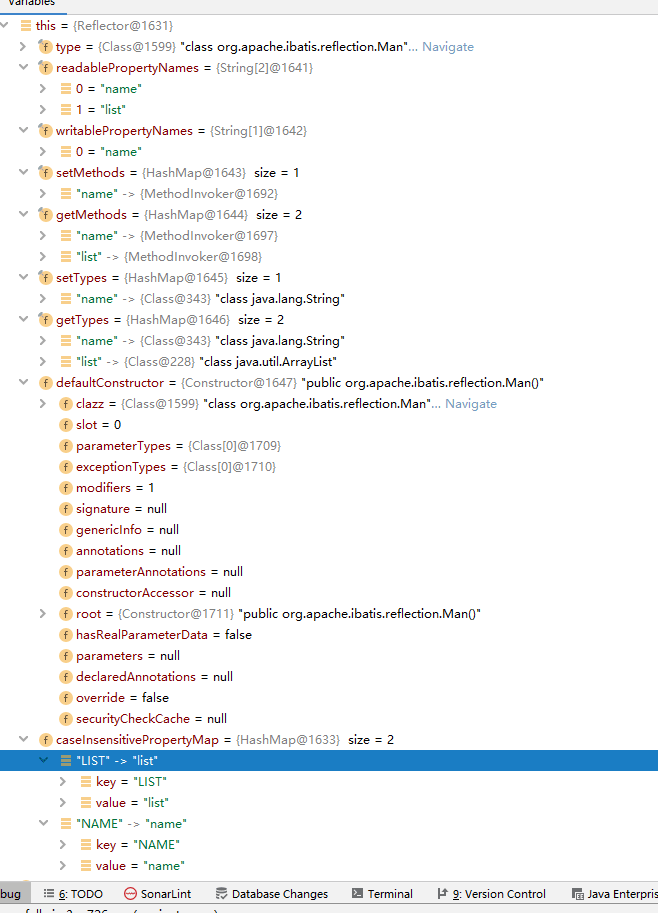
