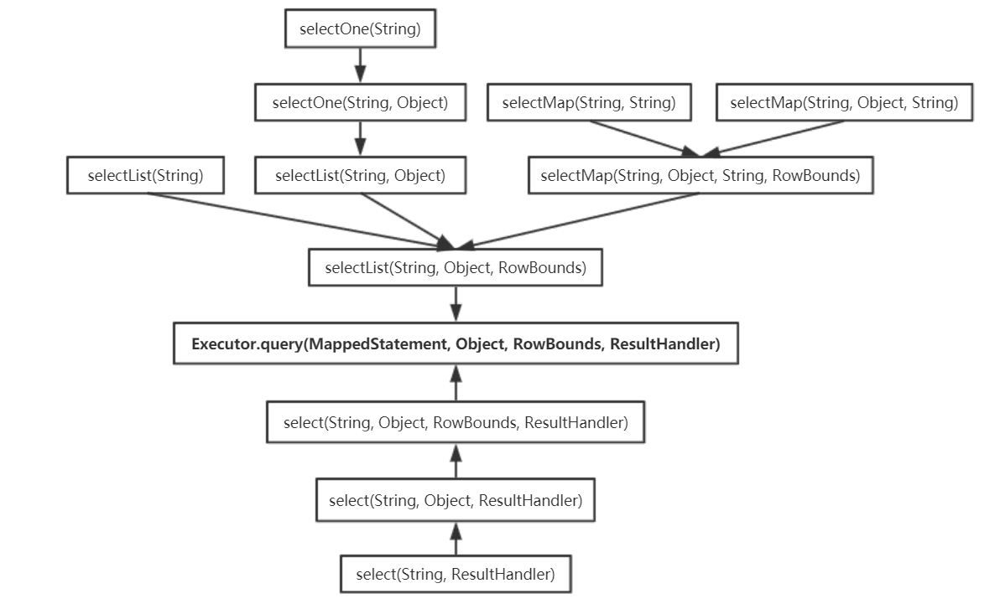

SqlSession 是 MyBatis 核心接口之一，也是 MyBatis 接口层的主要组成部分，对外提供 MyBatis 常用的 API。mybatis 提供了两个 SqlSession 接口的实现，分别为 DefaultSqlSession、SqlSessionManager，其中最常用的是 DefaultSqlSession。另外，跟前面分析过的源码 mybatis 的源码一样，mybatis 也为 SqlSession 提供了相应的工厂接口 SqlSessionFactory，及实现该接口的实现 DefaultSqlSessionFactory（SqlSessionManager 同时实现了 SqlSession 和 SqlSessionFactory 接口）。

## 1 SqlSession

在 SqlSession 中定义了常用的数据库操作以及事务的相关操作，为了方便用户使用，每种类型的操作都提供了多种重载。

```java
public interface SqlSession extends Closeable {
  // 泛型方法，参数是要执行查询的sql语句，返回值为查询的结果对象
  <T> T selectOne(String statement);

  // 第二个参数表示 需要用户传入的实参，即 sql语句绑定的实参
  <T> T selectOne(String statement, Object parameter);

  // 查询结果有多条记录，会封装成 结果对象列表 并返回
  <E> List<E> selectList(String statement);

  // 参数 + 多记录结果集
  <E> List<E> selectList(String statement, Object parameter);

  // 参数RowBounds主要用于逻辑分页，逻辑分页会将所有的结果都查询到，
  // 然后根据RowBounds中提供的offset和limit值来获取最后的结果
  <E> List<E> selectList(String statement, Object parameter, RowBounds rowBounds);

  // mapKey表示将结果集中的哪一列（如 主键列或编码列）作为Map的key，
  // value则为列值 对应的那条记录
  <K, V> Map<K, V> selectMap(String statement, String mapKey);

  // 多了个parameter参数，其它与上面相同
  <K, V> Map<K, V> selectMap(String statement, Object parameter, String mapKey);

  // 多了个RowBounds参数，其它与上面相同
  <K, V> Map<K, V> selectMap(String statement, Object parameter, String mapKey, RowBounds rowBounds);

  // 除了返回值是Cursor对象，其它与selectList相同
  <T> Cursor<T> selectCursor(String statement);
  <T> Cursor<T> selectCursor(String statement, Object parameter);
  <T> Cursor<T> selectCursor(String statement, Object parameter, RowBounds rowBounds);

  // 查询出的结果集 将由传入的ResultHandler对象处理，其它与selectList相同
  void select(String statement, Object parameter, ResultHandler handler);
  void select(String statement, ResultHandler handler);
  void select(String statement, Object parameter, RowBounds rowBounds, ResultHandler handler);

  // 执行insert语句
  int insert(String statement);
  int insert(String statement, Object parameter);

  // 执行update语句
  int update(String statement);
  int update(String statement, Object parameter);

  // 执行delete语句
  int delete(String statement);
  int delete(String statement, Object parameter);

  // 提交事务
  void commit();
  void commit(boolean force);

  // 回滚事务
  void rollback();
  void rollback(boolean force);

  // 将对数据库的操作请求 刷到数据库
  List<BatchResult> flushStatements();

  // 关闭当前session
  void close();

  // 清空缓存
  void clearCache();

  // 获取Configuration对象
  Configuration getConfiguration();

  // 获取type对应的Mapper对象
  <T> T getMapper(Class<T> type);

  // 获取该SqlSession对应的数据库连接
  Connection getConnection();
}
```

### 1.1 DefaultSqlSession

DefaultSqlSession 是单独使用 MyBatis 进行开发时，最常用的 SqISession 接口实现。其实现了 SqISession 接口中定义的方法，及各方法的重载。select()系列方法、selectOne()系列方法、selectList()系列方法、selectMap()系列方法之间的调用关系如下图，殊途同归，它们最终都会调用 Executor 的 query()方法。



上述重载方法最终都是通过调用 Executor 的 query(MappedStatement, Object, RowBounds,ResultHandler)方法实现数据库查询操作的，但各自对结果对象进行了相应的调整，例如：selectOne()方法是从结果对象集合中获取了第一个元素返回；selectMap()方法会将 List 类型的结果集 转换成 Map 类型集合返回；select()方法是将结果集交由用户指定的 ResultHandler 对象处理，且没有返回值；selectList()方法则是直接返回结果对象集合。
DefaultSqlSession 的 insert()方法、update()方法、delete()方法也有多个重载，它们最后都是通过调用 DefaultSqlSession 的 update(String, Object)方法实现的，该重载首先会将 dirty 字段置为 true，然后再通过 Executor 的 update()方法完成数据库修改操作。
DefaultSqlSession 的 commit()方法、rollback()方法以及 close()方法都会调用 Executor 中相应的方法，其中就会涉及清空缓存的操作，之后就会将 dirty 字段设置为 false。
上述的 dirty 字段主要在 isCommitOrRollbackRequired()方法中，与 autoCommit 字段以及用户传入的 force 参数共同决定是否提交/回滚事务。该方法的返回值将作为 Executor 的 commit()方法和 rollback()方法的参数。

```java
  private boolean isCommitOrRollbackRequired(boolean force) {
    return (!autoCommit && dirty) || force;
  }
```

## 2 SqlSessionFactory

SqlSessionFactory 负责创建 SqlSession 对象，其中包含了多个 openSession()方法的重载，可以通过其参数指定事务的隔离级别、底层使用 Executor 的类型、以及是否自动提交事务等方面的配置。

```java
public interface SqlSessionFactory {

  // 提供了openSession()方法的多种重载，根据相应的参数 可以指定事务的隔离级别、
  // 底层使用的Executor类型、以及是否自动提交事务等配置
  SqlSession openSession();
  SqlSession openSession(boolean autoCommit);
  SqlSession openSession(Connection connection);
  SqlSession openSession(TransactionIsolationLevel level);
  SqlSession openSession(ExecutorType execType);
  SqlSession openSession(ExecutorType execType, boolean autoCommit);
  SqlSession openSession(ExecutorType execType, TransactionIsolationLevel level);
  SqlSession openSession(ExecutorType execType, Connection connection);

  Configuration getConfiguration();
}
```

### 2.1 DefaultSqlSessionFactory

DefaultSqlSessionFactory 是 SqlSessionFactory 接口的默认实现，主要提供了两种创建 DefaultSqlSession 对象的方式，一种方式是通过数据源获取数据库连接，并创建 Executor 对象以及 DefaultSqlSession 对象；另一种方式是用户提供数据库连接对象，DefaultSqlSessionFactory 根据该数据库连接对象获取 autoCommit 属性，创建 Executor 对象以及 DefaultSqlSession 对象。

DefaultSqISessionFactory 提供的所有 openSession()方法重载都是基于上述两种方式创建 DefaultSqlSession 对象的。

```java
public class DefaultSqlSessionFactory implements SqlSessionFactory {

  private final Configuration configuration;

  public DefaultSqlSessionFactory(Configuration configuration) {
    this.configuration = configuration;
  }

  private SqlSession openSessionFromDataSource(ExecutorType execType, TransactionIsolationLevel level, boolean autoCommit) {
    Transaction tx = null;
    try {
      // 获取配置的Environment对象
      final Environment environment = configuration.getEnvironment();
      // 从environment中获取TransactionFactory对象，如果没有，就创建一个ManagedTransactionFactory实例并返回
      final TransactionFactory transactionFactory = getTransactionFactoryFromEnvironment(environment);
      // 从事务工厂中获取一个事务对象
      tx = transactionFactory.newTransaction(environment.getDataSource(), level, autoCommit);
      // 根据事务对象tx和配置的Executor类型execType创建Executor实例
      // ExecutorType是个枚举类型，有三个值 SIMPLE, REUSE, BATCH，分别对应了
      // SimpleExecutor、ReuseExecutor、BatchExecutor
      final Executor executor = configuration.newExecutor(tx, execType);
      // 创建DefaultSqlSession对象
      return new DefaultSqlSession(configuration, executor, autoCommit);
    } catch (Exception e) {
      closeTransaction(tx); // may have fetched a connection so lets call close()
      throw ExceptionFactory.wrapException("Error opening session.  Cause: " + e, e);
    } finally {
      ErrorContext.instance().reset();
    }
  }

  private SqlSession openSessionFromConnection(ExecutorType execType, Connection connection) {
    try {
      boolean autoCommit;
      try {
        // 根据当前连接对象获取autoCommit属性（是否自动提交事务）
        autoCommit = connection.getAutoCommit();
      } catch (SQLException e) {
        autoCommit = true;
      }
      // 除了获取autoCommit属性的方式和上面不一样外，下面的处理都与上面完全相同
      final Environment environment = configuration.getEnvironment();
      final TransactionFactory transactionFactory = getTransactionFactoryFromEnvironment(environment);
      final Transaction tx = transactionFactory.newTransaction(connection);
      final Executor executor = configuration.newExecutor(tx, execType);
      return new DefaultSqlSession(configuration, executor, autoCommit);
    } catch (Exception e) {
      throw ExceptionFactory.wrapException("Error opening session.  Cause: " + e, e);
    } finally {
      ErrorContext.instance().reset();
    }
  }

  private TransactionFactory getTransactionFactoryFromEnvironment(Environment environment) {
    if (environment == null || environment.getTransactionFactory() == null) {
      return new ManagedTransactionFactory();
    }
    return environment.getTransactionFactory();
  }

  private void closeTransaction(Transaction tx) {
    if (tx != null) {
      try {
        tx.close();
      } catch (SQLException ignore) {
        // Intentionally ignore. Prefer previous error.
      }
    }
  }

  @Override
  public SqlSession openSession() {
    return openSessionFromDataSource(configuration.getDefaultExecutorType(), null, false);
  }

  @Override
  public SqlSession openSession(boolean autoCommit) {
    return openSessionFromDataSource(configuration.getDefaultExecutorType(), null, autoCommit);
  }

  @Override
  public SqlSession openSession(ExecutorType execType) {
    return openSessionFromDataSource(execType, null, false);
  }

  @Override
  public SqlSession openSession(TransactionIsolationLevel level) {
    return openSessionFromDataSource(configuration.getDefaultExecutorType(), level, false);
  }

  @Override
  public SqlSession openSession(ExecutorType execType, TransactionIsolationLevel level) {
    return openSessionFromDataSource(execType, level, false);
  }

  @Override
  public SqlSession openSession(ExecutorType execType, boolean autoCommit) {
    return openSessionFromDataSource(execType, null, autoCommit);
  }

  @Override
  public SqlSession openSession(Connection connection) {
    return openSessionFromConnection(configuration.getDefaultExecutorType(), connection);
  }

  @Override
  public SqlSession openSession(ExecutorType execType, Connection connection) {
    return openSessionFromConnection(execType, connection);
  }

  @Override
  public Configuration getConfiguration() {
    return configuration;
  }
}
```

### 2.2 SqlSessionManager

SqlSessionManager 同时实现了 SqlSession 接口和 SqlSessionFactory 接口，所以同时提供了 SqlSessionFactory 创建 SqlSession 对象，以及 SqlSession 操纵数据库的功能。

SqlSessionManager 与 DefaultSqlSessionFactory 的主要不同点 SqlSessionManager 提供了两种模式，第一种模式与 DefaultSqlSessionFactory 的行为相同，同一线程每次通过 SqlSessionManager 对象访问数据库时，都会创建新的 SqlSession 对象完成数据库操作。第二种模式是 SqlSessionManager 通过 localSqlSession 这 ThreadLocal 变量，记录与当前线程绑定的 SqlSession 对象，供当前线程循环使用，从而避免在同一线程多次创建 SqlSession 对象带来的性能损失。

SqlSessionManager 的构造方法是唯一且私有的，如果要创建 SqlSessionManager 对象，需要调用其 newInstance()方法（但需要注意的是，这不是单例模式，因为每次调用 newInstance()方法都返回了一个新的对象）。

SqlSessionManager 的 openSession()系列方法，都是通过直接调用其持有的
DefaultSqlSessionFactory 实例来实现的。

```java
public class SqlSessionManager implements SqlSessionFactory, SqlSession {

  // 通过持有DefaultSqlSessionFactory对象 来产生SqlSession对象
  private final SqlSessionFactory sqlSessionFactory;

  // 用于记录一个与当前线程绑定的SqlSession对象
  private final ThreadLocal<SqlSession> localSqlSession = new ThreadLocal<SqlSession>();

  // localSqlSession中记录的SqlSession对象的代理对象（JDK动态代理）
  // SqlSessionManager初始化时 生成本代理对象，可以看下 下面的构造函数
  private final SqlSession sqlSessionProxy;

  // 私有的构造函数，也是SqlSessionManager唯一的构造函数
  private SqlSessionManager(SqlSessionFactory sqlSessionFactory) {
    // 传入的这个SqlSessionFactory对象 往往是DefaultSqlSessionFactory的实例
    this.sqlSessionFactory = sqlSessionFactory;
    // JDK动态代理生成代理对象，可以看得出，SqlSessionInterceptor一定实现了
    // InvocationHandler接口
    this.sqlSessionProxy = (SqlSession) Proxy.newProxyInstance(
        SqlSessionFactory.class.getClassLoader(),
        new Class[]{SqlSession.class},
        new SqlSessionInterceptor());
  }

  // 通过newInstance()方法创建SqlSessionManager对象，有多种重载，
  // 但最后都是new了一个DefaultSqlSessionFactory的实例
  public static SqlSessionManager newInstance(Reader reader) {
    return new SqlSessionManager(new SqlSessionFactoryBuilder().build(reader, null, null));
  }

  public static SqlSessionManager newInstance(Reader reader, String environment) {
    return new SqlSessionManager(new SqlSessionFactoryBuilder().build(reader, environment, null));
  }

  public static SqlSessionManager newInstance(Reader reader, Properties properties) {
    return new SqlSessionManager(new SqlSessionFactoryBuilder().build(reader, null, properties));
  }

  public static SqlSessionManager newInstance(InputStream inputStream) {
    return new SqlSessionManager(new SqlSessionFactoryBuilder().build(inputStream, null, null));
  }

  public static SqlSessionManager newInstance(InputStream inputStream, String environment) {
    return new SqlSessionManager(new SqlSessionFactoryBuilder().build(inputStream, environment, null));
  }

  public static SqlSessionManager newInstance(InputStream inputStream, Properties properties) {
    return new SqlSessionManager(new SqlSessionFactoryBuilder().build(inputStream, null, properties));
  }

  public static SqlSessionManager newInstance(SqlSessionFactory sqlSessionFactory) {
    return new SqlSessionManager(sqlSessionFactory);
  }

  // openSession()系列方法都是通过当前SqlSessionManager对象持有的
  // DefaultSqlSessionFactory实例的openSession()实现的
  @Override
  public SqlSession openSession() {
    return sqlSessionFactory.openSession();
  }

  @Override
  public SqlSession openSession(boolean autoCommit) {
    return sqlSessionFactory.openSession(autoCommit);
  }

  @Override
  public SqlSession openSession(Connection connection) {
    return sqlSessionFactory.openSession(connection);
  }

  @Override
  public SqlSession openSession(TransactionIsolationLevel level) {
    return sqlSessionFactory.openSession(level);
  }

  @Override
  public SqlSession openSession(ExecutorType execType) {
    return sqlSessionFactory.openSession(execType);
  }

  @Override
  public SqlSession openSession(ExecutorType execType, boolean autoCommit) {
    return sqlSessionFactory.openSession(execType, autoCommit);
  }

  @Override
  public SqlSession openSession(ExecutorType execType, TransactionIsolationLevel level) {
    return sqlSessionFactory.openSession(execType, level);
  }

  @Override
  public SqlSession openSession(ExecutorType execType, Connection connection) {
    return sqlSessionFactory.openSession(execType, connection);
  }
}
```

SqlSessionManager 中实现的 SqlSession 接口方法，例如 select ()系列方法、update()系列方法等，都是直接调用 sqlSessionProxy 代理对象对应的方法实现的。在创建该代理对象时使用的 InvocationHandler 对象是 SqlSessionlnterceptor，它是 SqISessionManager 的内部类。

```java
  private class SqlSessionInterceptor implements InvocationHandler {

    public SqlSessionInterceptor() { }

    @Override
    public Object invoke(Object proxy, Method method, Object[] args) throws Throwable {
      // 获取 与当前线程绑定的SqlSession
      final SqlSession sqlSession = SqlSessionManager.this.localSqlSession.get();
      // 如果有绑定的SqlSession对象
      if (sqlSession != null) { // 模式二
        try {
          // 调用真正的sqlSession对象，完成数据库操作
          return method.invoke(sqlSession, args);
        } catch (Throwable t) {
          throw ExceptionUtil.unwrapThrowable(t);
        }
      // 如果没有绑定的SqlSession对象
      } else { // 模式一
        // 创建一个新的SqlSession对象
        final SqlSession autoSqlSession = openSession();
        try {
          // 通过反射调用该SqlSession对象的方法，完成数据库操作
          final Object result = method.invoke(autoSqlSession, args);
          // 提交事务
          autoSqlSession.commit();
          return result;
        } catch (Throwable t) {
          // 出异常就回滚
          autoSqlSession.rollback();
          throw ExceptionUtil.unwrapThrowable(t);
        } finally {
          // 关闭该SqlSession对象
          autoSqlSession.close();
        }
      }
    }
  }
```

通过对 SqlSessionlnterceptor 的分析可知，第一种模式中新建的 SqlSession 在使用完成后会立即关闭。在第二种模式中，与当前线程绑定的 SqISession 对象需要先通过 SqlSessionManager 的 startManagedSession()方法进行设置，此方法也存在多种重载，但都彼此相似 且简单。

```java
  public void startManagedSession() {
    this.localSqlSession.set(openSession());
  }

  public void startManagedSession(boolean autoCommit) {
    this.localSqlSession.set(openSession(autoCommit));
  }

  public void startManagedSession(Connection connection) {
    this.localSqlSession.set(openSession(connection));
  }

  public void startManagedSession(TransactionIsolationLevel level) {
    this.localSqlSession.set(openSession(level));
  }

  public void startManagedSession(ExecutorType execType) {
    this.localSqlSession.set(openSession(execType));
  }

  public void startManagedSession(ExecutorType execType, boolean autoCommit) {
    this.localSqlSession.set(openSession(execType, autoCommit));
  }

  public void startManagedSession(ExecutorType execType, TransactionIsolationLevel level) {
    this.localSqlSession.set(openSession(execType, level));
  }

  public void startManagedSession(ExecutorType execType, Connection connection) {
    this.localSqlSession.set(openSession(execType, connection));
  }

  public boolean isManagedSessionStarted() {
    return this.localSqlSession.get() != null;
  }
```

当需要提交/回滚事务，或关闭 IocalSqlSession 中记录的 SqlSession 对象时，需要通过 SqlSessionManager 的 commit()、rollback()以及 close()方法完成，其中会先检测当前线程是否绑定了 SqlSession 对象，如果未绑定则抛出异常，如果绑定了则调用该 SqlSession 对象的相应方法。

```java
  @Override
  public void clearCache() {
    final SqlSession sqlSession = localSqlSession.get();
    if (sqlSession == null) {
      throw new SqlSessionException("Error:  Cannot clear the cache.  No managed session is started.");
    }
    sqlSession.clearCache();
  }

  @Override
  public void commit() {
    final SqlSession sqlSession = localSqlSession.get();
    if (sqlSession == null) {
      throw new SqlSessionException("Error:  Cannot commit.  No managed session is started.");
    }
    sqlSession.commit();
  }

  @Override
  public void commit(boolean force) {
    final SqlSession sqlSession = localSqlSession.get();
    if (sqlSession == null) {
      throw new SqlSessionException("Error:  Cannot commit.  No managed session is started.");
    }
    sqlSession.commit(force);
  }

  @Override
  public void rollback() {
    final SqlSession sqlSession = localSqlSession.get();
    if (sqlSession == null) {
      throw new SqlSessionException("Error:  Cannot rollback.  No managed session is started.");
    }
    sqlSession.rollback();
  }

  @Override
  public void rollback(boolean force) {
    final SqlSession sqlSession = localSqlSession.get();
    if (sqlSession == null) {
      throw new SqlSessionException("Error:  Cannot rollback.  No managed session is started.");
    }
    sqlSession.rollback(force);
  }

  @Override
  public List<BatchResult> flushStatements() {
    final SqlSession sqlSession = localSqlSession.get();
    if (sqlSession == null) {
      throw new SqlSessionException("Error:  Cannot rollback.  No managed session is started.");
    }
    return sqlSession.flushStatements();
  }

  @Override
  public void close() {
    final SqlSession sqlSession = localSqlSession.get();
    if (sqlSession == null) {
      throw new SqlSessionException("Error:  Cannot close.  No managed session is started.");
    }
    try {
      sqlSession.close();
    } finally {
      localSqlSession.set(null);
    }
  }
```
