# Mybatis DyanmicSqlSourcce

- Author: [HuiFer](https://github.com/huifer)
- 源码阅读工程: [SourceHot-Mybatis](https://github.com/SourceHot/mybatis-read.git)

- `org.apache.ibatis.scripting.xmltags.DynamicSqlSource`
- `org.apache.ibatis.scripting.xmltags.DynamicContext.DynamicContext`

```XML
    <select id="list" resultType="com.huifer.mybatis.entity.HsSell">
        select * from hs_sell
        <trim prefix="WHERE" prefixOverrides="AND |OR">
            <if test="ID != null">
                and ID = #{ID,jdbcType=INTEGER}
            </if>

        </trim>
    </select>

```

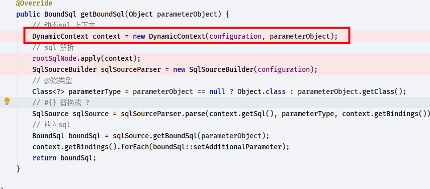

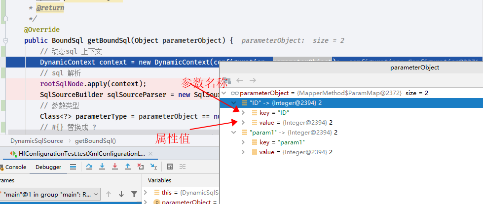

```java
public class MixedSqlNode implements SqlNode {
    private final List<SqlNode> contents;

    public MixedSqlNode(List<SqlNode> contents) {
        this.contents = contents;
    }

    @Override
    public boolean apply(DynamicContext context) {
        // 调用 salNode 对象本身的 apply 方法解析 sql
        contents.forEach(node -> node.apply(context));
        return true;
    }
}
```

- 根据 mapper.xml 文件中的代码流程 需要走

  `org.apache.ibatis.scripting.xmltags.StaticTextSqlNode#apply`

  `org.apache.ibatis.scripting.xmltags.TrimSqlNode#apply`

  `org.apache.ibatis.scripting.xmltags.IfSqlNode#apply`

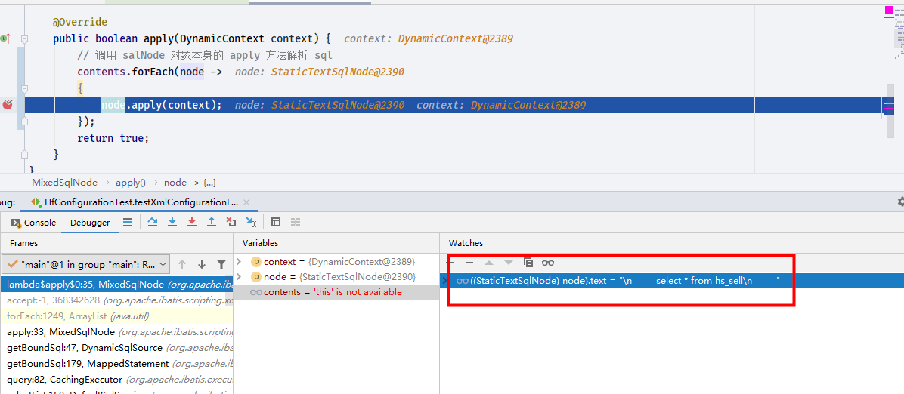

```java
/**
 * @author Clinton Begin
 */
public class StaticTextSqlNode implements SqlNode {
    private final String text;

    public StaticTextSqlNode(String text) {
        this.text = text;
    }

    /**
     * 静态文本apply 方法
     * @param context
     * @return
     */
    @Override
    public boolean apply(DynamicContext context) {
        context.appendSql(text);
        return true;
    }

}
```

- `org.apache.ibatis.scripting.xmltags.DynamicContext#appendSql`

  ```java
    public void appendSql(String sql) {
        sqlBuilder.add(sql);
    }
  ```

- 解析`trim`标签

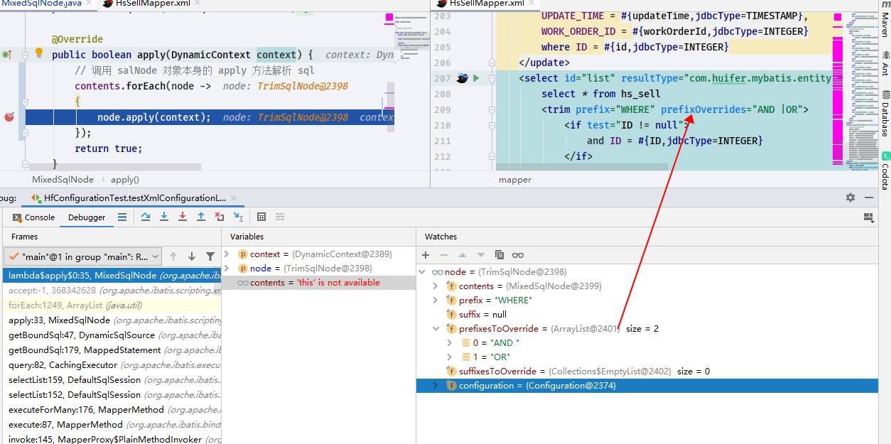

- 在解析`trim`的时候会往下解析下级标签

  ```java
      @Override
      public boolean apply(DynamicContext context) {
          FilteredDynamicContext filteredDynamicContext = new FilteredDynamicContext(context);
         // 解析下级标签的入口
          boolean result = contents.apply(filteredDynamicContext);
          filteredDynamicContext.applyAll();
          return result;
      }
  ```

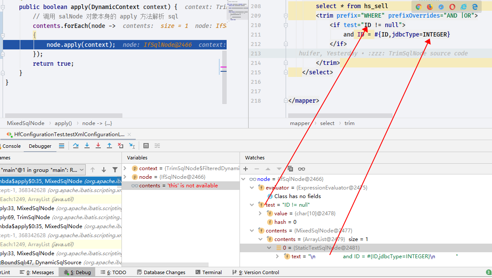

```java
    @Override
    public boolean apply(DynamicContext context) {
        if (evaluator.evaluateBoolean(test, context.getBindings())) {
            contents.apply(context);
            return true;
        }
        return false;
    }

```

- `evaluator.evaluateBoolean(test, context.getBindings())`方法

```java
    /**
     * @param expression      判断语句,ID != null
     * @param parameterObject 参数列表
     * @return
     */
    public boolean evaluateBoolean(String expression, Object parameterObject) {
        Object value = OgnlCache.getValue(expression, parameterObject);
        if (value instanceof Boolean) {
            return (Boolean) value;
        }
        if (value instanceof Number) {
            return new BigDecimal(String.valueOf(value)).compareTo(BigDecimal.ZERO) != 0;
        }
        return value != null;
    }

```

```java
    /**
     * 取值
     * @param expression  判断语句,ID=NULL
     * @param root 参数列表
     * @return
     */
    public static Object getValue(String expression, Object root) {
        try {
            Map context = Ognl.createDefaultContext(root, MEMBER_ACCESS, CLASS_RESOLVER, null);
            // 判断是否存在 expression 的判断内容 (判断ID是否存在)
            return Ognl.getValue(parseExpression(expression), context, root);
        } catch (OgnlException e) {
            throw new BuilderException("Error evaluating expression '" + expression + "'. Cause: " + e, e);
        }
    }

```

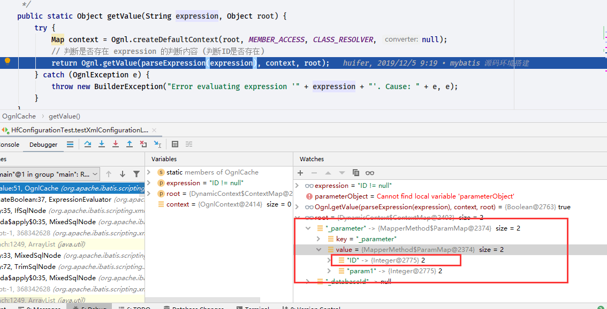

存在返回`true`

执行完成就得到了一个 sql

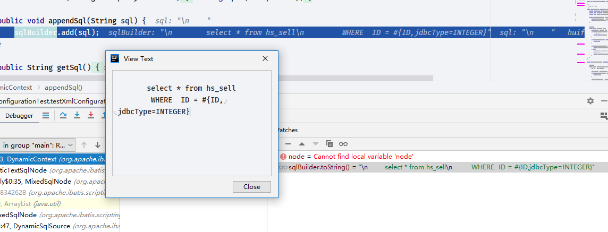

继续执行`org.apache.ibatis.scripting.xmltags.DynamicSqlSource#getBoundSql`方法


- 发送 sql`org.apache.ibatis.executor.SimpleExecutor#doQuery`

- 调用链路如下

- `org.apache.ibatis.executor.CachingExecutor#query(org.apache.ibatis.mapping.MappedStatement, java.lang.Object, org.apache.ibatis.session.RowBounds, org.apache.ibatis.session.ResultHandler)`

  - `org.apache.ibatis.executor.CachingExecutor#query(org.apache.ibatis.mapping.MappedStatement, java.lang.Object, org.apache.ibatis.session.RowBounds, org.apache.ibatis.session.ResultHandler, org.apache.ibatis.cache.CacheKey, org.apache.ibatis.mapping.BoundSql)`

  - `org.apache.ibatis.executor.Executor#query(org.apache.ibatis.mapping.MappedStatement, java.lang.Object, org.apache.ibatis.session.RowBounds, org.apache.ibatis.session.ResultHandler, org.apache.ibatis.cache.CacheKey, org.apache.ibatis.mapping.BoundSql)`

  - `org.apache.ibatis.executor.BaseExecutor#query(org.apache.ibatis.mapping.MappedStatement, java.lang.Object, org.apache.ibatis.session.RowBounds, org.apache.ibatis.session.ResultHandler, org.apache.ibatis.cache.CacheKey, org.apache.ibatis.mapping.BoundSql)`

    ```java
        @SuppressWarnings("unchecked")
        @Override
        public <E> List<E> query(MappedStatement ms, Object parameter, RowBounds rowBounds, ResultHandler resultHandler, CacheKey key, BoundSql boundSql) throws SQLException {
            ErrorContext.instance().resource(ms.getResource()).activity("executing a query").object(ms.getId());
            if (closed) {
                // 判断当前是否关闭
                throw new ExecutorException("Executor was closed.");
            }
            if (queryStack == 0 && ms.isFlushCacheRequired()) {
                // 查询堆栈==0 和 是否需要刷新缓存
                // 清理本地缓存
                clearLocalCache();
            }
            List<E> list;
            try {
    //            堆栈+1,防止重新清理缓存
                queryStack++;
                // 通过 缓存key 在本地缓存中获取
                list = resultHandler == null ? (List<E>) localCache.getObject(key) : null;
                if (list != null) {
                    // 通过缓存 key 查到后处理  localOutputParameterCache
                    handleLocallyCachedOutputParameters(ms, key, parameter, boundSql);
                } else {
                    // 没有查询到从数据库查询
                    list = queryFromDatabase(ms, parameter, rowBounds, resultHandler, key, boundSql);
                }
            } finally {
                // 堆栈-1
                queryStack--;
            }
            if (queryStack == 0) {
                for (DeferredLoad deferredLoad : deferredLoads) {
                    deferredLoad.load();
                }
                // 清空线程安全队列(延迟队列)
                // issue #601
                deferredLoads.clear();
                if (configuration.getLocalCacheScope() == LocalCacheScope.STATEMENT) {
                    // STATEMENT 清空本地缓存
                    // issue #482
                    clearLocalCache();
                }
            }
            return list;
        }

    ```

    - `org.apache.ibatis.executor.BaseExecutor#queryFromDatabase`

      ```java
          private <E> List<E> queryFromDatabase(MappedStatement ms, Object parameter, RowBounds rowBounds, ResultHandler resultHandler, CacheKey key, BoundSql boundSql) throws SQLException {
              List<E> list;
              localCache.putObject(key, EXECUTION_PLACEHOLDER);
              try {
                  list = doQuery(ms, parameter, rowBounds, resultHandler, boundSql);
              } finally {
                  localCache.removeObject(key);
              }
              localCache.putObject(key, list);
              if (ms.getStatementType() == StatementType.CALLABLE) {
                  localOutputParameterCache.putObject(key, parameter);
              }
              return list;
          }

      ```

      - `org.apache.ibatis.executor.BaseExecutor#doQuery`
      - `org.apache.ibatis.executor.SimpleExecutor#doQuery`

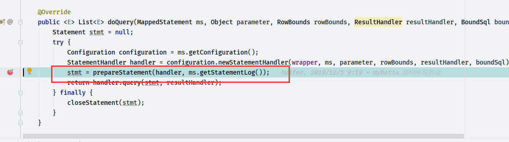

```java
    private Statement prepareStatement(StatementHandler handler, Log statementLog) throws SQLException {
        Statement stmt;
        // 数据库连接
        Connection connection = getConnection(statementLog);
        // stms 创建
        // org.apache.ibatis.executor.statement.BaseStatementHandler.prepare
        stmt = handler.prepare(connection, transaction.getTimeout());
        // 参数放入
        handler.parameterize(stmt);
        return stmt;
    }

```

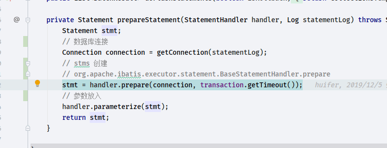

- `org.apache.ibatis.executor.statement.BaseStatementHandler#prepare`
  - `org.apache.ibatis.executor.statement.PreparedStatementHandler#instantiateStatement`

```java
    @Override
    public Statement prepare(Connection connection, Integer transactionTimeout) throws SQLException {
        ErrorContext.instance().sql(boundSql.getSql());
        Statement statement = null;
        try {
            statement = instantiateStatement(connection);
            setStatementTimeout(statement, transactionTimeout);
            setFetchSize(statement);
            return statement;
        } catch (SQLException e) {
            closeStatement(statement);
            throw e;
        } catch (Exception e) {
            closeStatement(statement);
            throw new ExecutorException("Error preparing statement.  Cause: " + e, e);
        }
    }

```

```java
    @Override
    protected Statement instantiateStatement(Connection connection) throws SQLException {
        String sql = boundSql.getSql();
        if (mappedStatement.getKeyGenerator() instanceof Jdbc3KeyGenerator) {
            String[] keyColumnNames = mappedStatement.getKeyColumns();
            if (keyColumnNames == null) {
                return connection.prepareStatement(sql, PreparedStatement.RETURN_GENERATED_KEYS);
            } else {
                return connection.prepareStatement(sql, keyColumnNames);
            }
        } else if (mappedStatement.getResultSetType() == ResultSetType.DEFAULT) {
            return connection.prepareStatement(sql);
        } else {
            return connection.prepareStatement(sql, mappedStatement.getResultSetType().getValue(), ResultSet.CONCUR_READ_ONLY);
        }
    }

```

- 这个方法都去了`java.sql.Connection#prepareStatement(java.lang.String, java.lang.String[])`

- 接下来需要考虑的问题是如何将`?`换成我们的参数`2`

  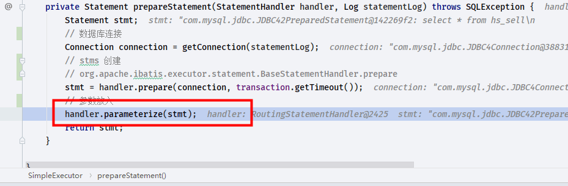

- `org.apache.ibatis.executor.statement.StatementHandler#parameterize`
  - `org.apache.ibatis.executor.statement.RoutingStatementHandler#parameterize`
    - `org.apache.ibatis.executor.statement.StatementHandler#parameterize`
      - `org.apache.ibatis.executor.statement.PreparedStatementHandler#parameterize`
        - `org.apache.ibatis.executor.parameter.ParameterHandler`
          - `org.apache.ibatis.scripting.defaults.DefaultParameterHandler#setParameters`

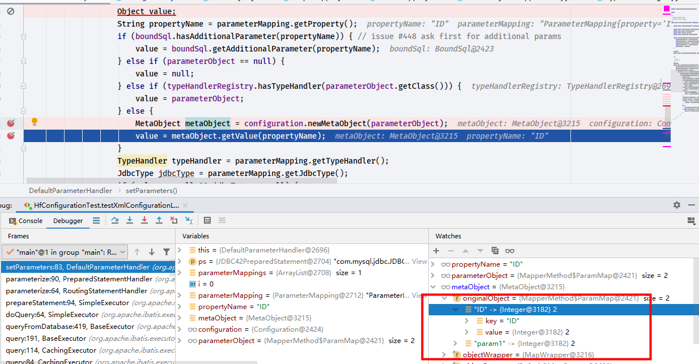

这样就拿到了`value`的值

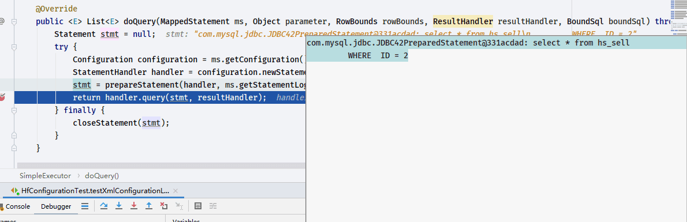

准备工作就绪了发送就可以了

`doQuery`的工作完成了继续往下走

```java
    @Override
    public <E> List<E> doQuery(MappedStatement ms, Object parameter, RowBounds rowBounds, ResultHandler resultHandler, BoundSql boundSql) throws SQLException {
        Statement stmt = null;
        try {
            Configuration configuration = ms.getConfiguration();
            StatementHandler handler = configuration.newStatementHandler(wrapper, ms, parameter, rowBounds, resultHandler, boundSql);
            stmt = prepareStatement(handler, ms.getStatementLog());
            return handler.query(stmt, resultHandler);
        } finally {
            closeStatement(stmt);
        }
    }

```

- `org.apache.ibatis.executor.statement.RoutingStatementHandler#query`
  - `org.apache.ibatis.executor.statement.PreparedStatementHandler#query`
    - `org.apache.ibatis.executor.resultset.ResultSetHandler#handleResultSets`
    - `org.apache.ibatis.executor.resultset.DefaultResultSetHandler#handleResultSets`

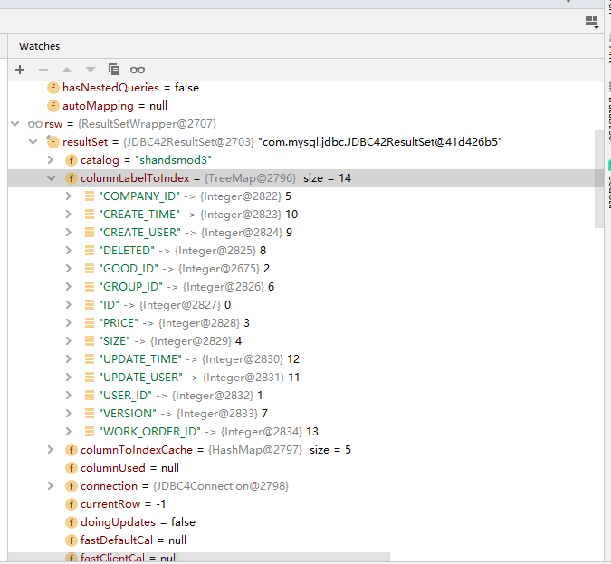

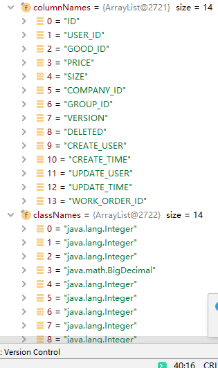

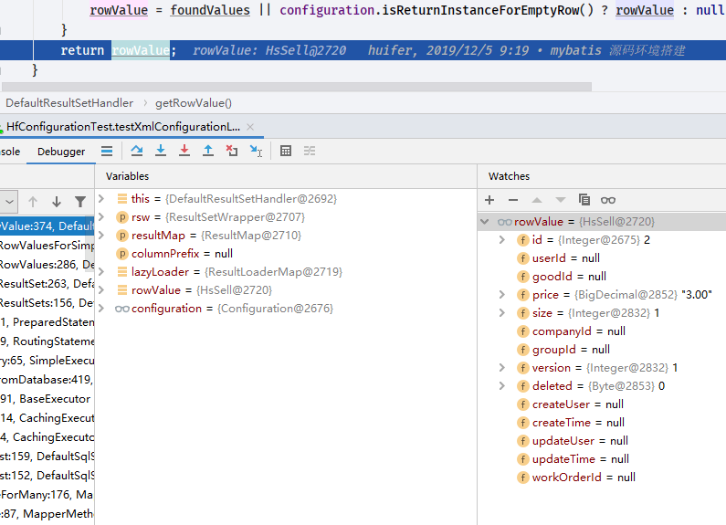

处理后结果如上

```java
    /**
     * 处理查询结果
     * @param stmt
     * @return
     * @throws SQLException
     */
    @Override
    public List<Object> handleResultSets(Statement stmt) throws SQLException {
        ErrorContext.instance().activity("handling results").object(mappedStatement.getId());

        final List<Object> multipleResults = new ArrayList<>();

        int resultSetCount = 0;
        ResultSetWrapper rsw = getFirstResultSet(stmt);

        List<ResultMap> resultMaps = mappedStatement.getResultMaps();
        int resultMapCount = resultMaps.size();
        validateResultMapsCount(rsw, resultMapCount);
        while (rsw != null && resultMapCount > resultSetCount) {
            ResultMap resultMap = resultMaps.get(resultSetCount);
            handleResultSet(rsw, resultMap, multipleResults, null);
            rsw = getNextResultSet(stmt);
            cleanUpAfterHandlingResultSet();
            resultSetCount++;
        }

        String[] resultSets = mappedStatement.getResultSets();
        if (resultSets != null) {
            while (rsw != null && resultSetCount < resultSets.length) {
                ResultMapping parentMapping = nextResultMaps.get(resultSets[resultSetCount]);
                if (parentMapping != null) {
                    String nestedResultMapId = parentMapping.getNestedResultMapId();
                    ResultMap resultMap = configuration.getResultMap(nestedResultMapId);
                    handleResultSet(rsw, resultMap, null, parentMapping);
                }
                rsw = getNextResultSet(stmt);
                cleanUpAfterHandlingResultSet();
                resultSetCount++;
            }
        }

        // 查询结果
        return collapseSingleResultList(multipleResults);
    }

```
