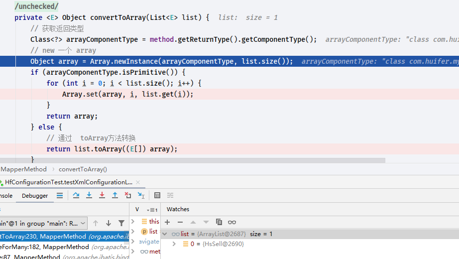
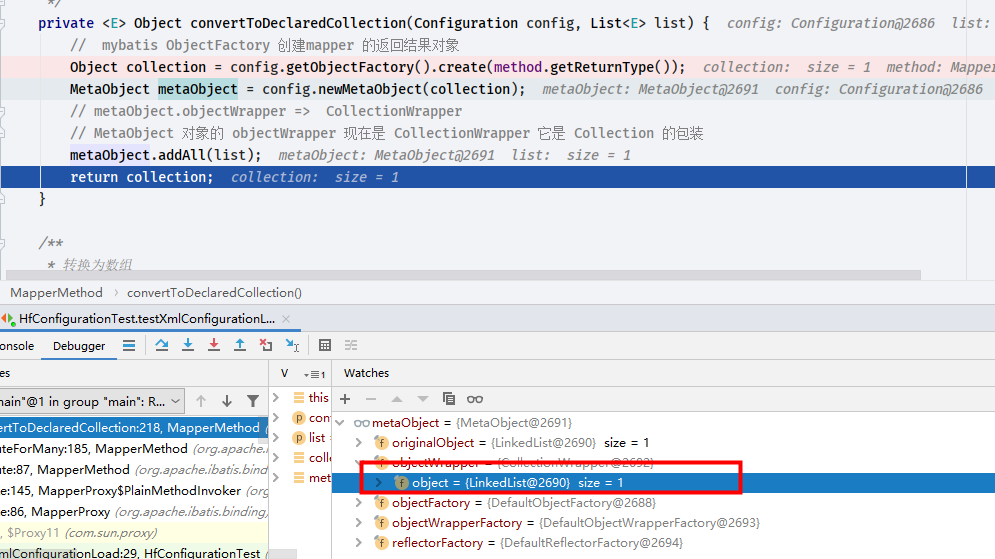

# MapperMethod

- Author: [HuiFer](https://github.com/huifer)
- Description: 该文介绍 mybatis MapperMethod 源码
- 源码地址: `org.apache.ibatis.binding.MapperMethod`,核心方法是`execute`
- 源码阅读工程: [SourceHot-Mybatis](https://github.com/SourceHot/mybatis-read.git)

```java
    /**
     * CRUD 不同的执行处理
     *
     * @param sqlSession
     * @param args
     * @return
     */
    public Object execute(SqlSession sqlSession, Object[] args) {
        Object result;
        switch (command.getType()) {
            case INSERT: {
                Object param = method.convertArgsToSqlCommandParam(args);
                result = rowCountResult(sqlSession.insert(command.getName(), param));
                break;
            }
            case UPDATE: {
                Object param = method.convertArgsToSqlCommandParam(args);
                result = rowCountResult(sqlSession.update(command.getName(), param));
                break;
            }
            case DELETE: {
                Object param = method.convertArgsToSqlCommandParam(args);
                result = rowCountResult(sqlSession.delete(command.getName(), param));
                break;
            }
            case SELECT:
                if (method.returnsVoid() && method.hasResultHandler()) {
                    executeWithResultHandler(sqlSession, args);
                    result = null;
                } else if (method.returnsMany()) {
                    result = executeForMany(sqlSession, args);
                } else if (method.returnsMap()) {
                    result = executeForMap(sqlSession, args);
                } else if (method.returnsCursor()) {
                    result = executeForCursor(sqlSession, args);
                } else {
                    Object param = method.convertArgsToSqlCommandParam(args);
                    result = sqlSession.selectOne(command.getName(), param);
                    if (method.returnsOptional()
                            && (result == null || !method.getReturnType().equals(result.getClass()))) {
                        result = Optional.ofNullable(result);
                    }
                }
                break;
            case FLUSH:
                result = sqlSession.flushStatements();
                break;
            default:
                throw new BindingException("Unknown execution method for: " + command.getName());
        }
        if (result == null && method.getReturnType().isPrimitive() && !method.returnsVoid()) {
            throw new BindingException("Mapper method '" + command.getName()
                    + " attempted to return null from a method with a primitive return type (" + method.getReturnType() + ").");
        }
        return result;
    }

```

```java
    /**
     * 根据 resultHandler 进行处理
     *
     * @param sqlSession
     * @param args
     */
    private void executeWithResultHandler(SqlSession sqlSession, Object[] args) {
        MappedStatement ms = sqlSession.getConfiguration().getMappedStatement(command.getName());
        if (!StatementType.CALLABLE.equals(ms.getStatementType())
                && void.class.equals(ms.getResultMaps().get(0).getType())) {
            throw new BindingException("method " + command.getName()
                    + " needs either a @ResultMap annotation, a @ResultType annotation,"
                    + " or a resultType attribute in XML so a ResultHandler can be used as a parameter.");
        }
        Object param = method.convertArgsToSqlCommandParam(args);
        // 判断是否有 RowBounds
        if (method.hasRowBounds()) {
            RowBounds rowBounds = method.extractRowBounds(args);
            sqlSession.select(command.getName(), param, rowBounds, method.extractResultHandler(args));
        } else {
            sqlSession.select(command.getName(), param, method.extractResultHandler(args));
        }
    }

```

- 返回值为多个的情况

```java
    /**
     * 针对多个查询结果进行 ,转换成不同的 list 或者数组
     *
     * @param sqlSession
     * @param args
     * @param <E>
     * @return
     */
    private <E> Object executeForMany(SqlSession sqlSession, Object[] args) {
        List<E> result;
        Object param = method.convertArgsToSqlCommandParam(args);
        if (method.hasRowBounds()) {
            RowBounds rowBounds = method.extractRowBounds(args);
            // 直接 list
            result = sqlSession.selectList(command.getName(), param, rowBounds);
        } else {
            result = sqlSession.selectList(command.getName(), param);
        }
        // issue #510 Collections & arrays support
        if (!method.getReturnType().isAssignableFrom(result.getClass())) {
            if (method.getReturnType().isArray()) {
                // 转换成 array
                return convertToArray(result);
            } else {
                // 转换成 collection
                return convertToDeclaredCollection(sqlSession.getConfiguration(), result);
            }
        }
        return result;
    }

```

### convertToArray

```java
    /**
     * 转换为数组
     *
     * @param list 数据库查询结果
     * @param <E>
     * @return
     */
    @SuppressWarnings("unchecked")
    private <E> Object convertToArray(List<E> list) {
        // 获取返回类型
        Class<?> arrayComponentType = method.getReturnType().getComponentType();
        // new 一个 array
        Object array = Array.newInstance(arrayComponentType, list.size());
        if (arrayComponentType.isPrimitive()) {
            for (int i = 0; i < list.size(); i++) {
                Array.set(array, i, list.get(i));
            }
            return array;
        } else {
            // 通过  toArray方法转换
            return list.toArray((E[]) array);
        }
    }

```

### convertToDeclaredCollection

```java
    /**
     * 转换为不同的list对象
     *
     * @param config
     * @param list 数据库查询结果
     * @param <E>
     * @return
     */
    private <E> Object convertToDeclaredCollection(Configuration config, List<E> list) {
        //  mybatis ObjectFactory 创建mapper 的返回结果对象
        Object collection = config.getObjectFactory().create(method.getReturnType());
        MetaObject metaObject = config.newMetaObject(collection);
        // metaObject.objectWrapper =>  CollectionWrapper
        // MetaObject 对象的 objectWrapper 现在是 CollectionWrapper 它是 Collection 的包装
        metaObject.addAll(list);
        return collection;
    }

```

- 上述两个为转换的过程,其实质还是在 `org.apache.ibatis.session.SqlSession` 中做执行操作

## debug

- 修改 mapper 返回数组对`org.apache.ibatis.binding.MapperMethod#convertToArray`方法进行测试

```java
    HsSell[] list(@Param("ID") Integer id);
```



- 修改 mapper,对`org.apache.ibatis.binding.MapperMethod#convertToDeclaredCollection`进行测试

  ```java
      LinkedList<HsSell> list(@Param("ID") Integer id);
  ```


