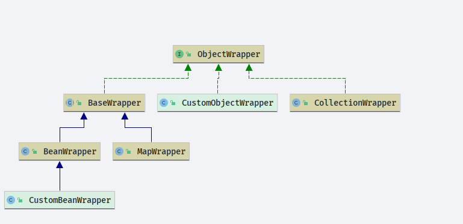

# Mybatis ObjectWrapper

- Author: [HuiFer](https://github.com/huifer)
- 源码阅读工程: [SourceHot-Mybatis](https://github.com/SourceHot/mybatis-read.git)
- 源码位于: `org.apache.ibatis.reflection.wrapper.ObjectWrapper`‘

类图：



```java
public interface ObjectWrapper {

    /**
     * 根据 prop 获取属性值
     *
     * @param prop
     * @return
     */
    Object get(PropertyTokenizer prop);

    /**
     * 设置属性
     *
     * @param prop  属性值名称
     * @param value 属性值
     */
    void set(PropertyTokenizer prop, Object value);

    /**
     * 获取属性
     *
     * @param name
     * @param useCamelCaseMapping
     * @return
     */
    String findProperty(String name, boolean useCamelCaseMapping);

    /**
     * get 方法名,可读方法名
     *
     * @return
     */
    String[] getGetterNames();

    /**
     * set 方法名,可写方法名
     *
     * @return
     */
    String[] getSetterNames();

    /**
     * set 数据类型, 获取可写的数据类型
     *
     * @param name
     * @return
     */
    Class<?> getSetterType(String name);

    /**
     * get 数据类型, 获取可读的数据类型
     *
     * @param name
     * @return
     */
    Class<?> getGetterType(String name);

    /**
     * 判断是否包含set方法
     *
     * @param name
     * @return
     */
    boolean hasSetter(String name);

    /**
     * 判断是否包含get方法
     *
     * @param name
     * @return
     */
    boolean hasGetter(String name);

    /**
     * 初始化数据
     *
     * @param name
     * @param prop
     * @param objectFactory
     * @return
     */
    MetaObject instantiatePropertyValue(String name, PropertyTokenizer prop, ObjectFactory objectFactory);

    /**
     * 判断是不是 list
     *
     * @return
     */
    boolean isCollection();

    /**
     * list add
     *
     * @param element
     */
    void add(Object element);

    /**
     * list addAll
     *
     * @param element
     * @param <E>
     */
    <E> void addAll(List<E> element);

}
```

## BaseWrapper

```java
/**
 * @author Clinton Begin
 */
public abstract class BaseWrapper implements ObjectWrapper {

    protected static final Object[] NO_ARGUMENTS = new Object[0];
    protected final MetaObject metaObject;

    protected BaseWrapper(MetaObject metaObject) {
        this.metaObject = metaObject;
    }

    /**
     * 处理集合对象
     * @param prop
     * @param object
     * @return
     */
    protected Object resolveCollection(PropertyTokenizer prop, Object object) {
        if ("".equals(prop.getName())) {
            return object;
        } else {
            return metaObject.getValue(prop.getName());
        }
    }

    /**
     * 对象获取,根据index
     * map.get(index)
     * 数组 array[index]
     * list list.get(index)
     * @param prop
     * @param collection
     * @return
     */
    protected Object getCollectionValue(PropertyTokenizer prop, Object collection) {
        if (collection instanceof Map) {
            // 如果是Map类型，则index为key
            return ((Map) collection).get(prop.getIndex());
        } else {
            // index 作为下标直接获取
            int i = Integer.parseInt(prop.getIndex());
            if (collection instanceof List) {
                return ((List) collection).get(i);
            } else if (collection instanceof Object[]) {
                return ((Object[]) collection)[i];
            } else if (collection instanceof char[]) {
                return ((char[]) collection)[i];
            } else if (collection instanceof boolean[]) {
                return ((boolean[]) collection)[i];
            } else if (collection instanceof byte[]) {
                return ((byte[]) collection)[i];
            } else if (collection instanceof double[]) {
                return ((double[]) collection)[i];
            } else if (collection instanceof float[]) {
                return ((float[]) collection)[i];
            } else if (collection instanceof int[]) {
                return ((int[]) collection)[i];
            } else if (collection instanceof long[]) {
                return ((long[]) collection)[i];
            } else if (collection instanceof short[]) {
                return ((short[]) collection)[i];
            } else {
                throw new ReflectionException("The '" + prop.getName() + "' property of " + collection + " is not a List or Array.");
            }
        }
    }

    /**
     * 设置属性值 ,List , object[] , char[] boolean byte double float int long short
     * map -> put(index,value)
     * list -> list.set(index,value)
     * array -> array[index] = value
     * @param prop
     * @param collection
     * @param value
     */
    protected void setCollectionValue(PropertyTokenizer prop, Object collection, Object value) {
        if (collection instanceof Map) {
            // map -> index:value
            ((Map) collection).put(prop.getIndex(), value);
        } else {
            // 数组 -> array[index]=value
            int i = Integer.parseInt(prop.getIndex());
            if (collection instanceof List) {
                ((List) collection).set(i, value);
            } else if (collection instanceof Object[]) {
                ((Object[]) collection)[i] = value;
            } else if (collection instanceof char[]) {
                ((char[]) collection)[i] = (Character) value;
            } else if (collection instanceof boolean[]) {
                ((boolean[]) collection)[i] = (Boolean) value;
            } else if (collection instanceof byte[]) {
                ((byte[]) collection)[i] = (Byte) value;
            } else if (collection instanceof double[]) {
                ((double[]) collection)[i] = (Double) value;
            } else if (collection instanceof float[]) {
                ((float[]) collection)[i] = (Float) value;
            } else if (collection instanceof int[]) {
                ((int[]) collection)[i] = (Integer) value;
            } else if (collection instanceof long[]) {
                ((long[]) collection)[i] = (Long) value;
            } else if (collection instanceof short[]) {
                ((short[]) collection)[i] = (Short) value;
            } else {
                throw new ReflectionException("The '" + prop.getName() + "' property of " + collection + " is not a List or Array.");
            }
        }
    }

}
```

## BeanWrapper

```java
public class BeanWrapper extends BaseWrapper {

    private final Object object;

    private final MetaClass metaClass;

    /**
     * 构造
     * @param metaObject
     * @param object
     */
    public BeanWrapper(MetaObject metaObject, Object object) {
        super(metaObject);
        this.object = object;
        this.metaClass = MetaClass.forClass(object.getClass(), metaObject.getReflectorFactory());
    }

    @Override
    public Object get(PropertyTokenizer prop) {
        // 索引不为空
        if (prop.getIndex() != null) {
            // 实例化集合对象
            Object collection = resolveCollection(prop, object);
            return getCollectionValue(prop, collection);
        } else {
            // 没有索引
            return getBeanProperty(prop, object);
        }
    }

    @Override
    public void set(PropertyTokenizer prop, Object value) {
        // 是否存在索引
        if (prop.getIndex() != null) {
            Object collection = resolveCollection(prop, object);
            // 向上层调用 BaseWrapper
            setCollectionValue(prop, collection, value);
        } else {
            // 本类方法
            setBeanProperty(prop, object, value);
        }
    }

    @Override
    public String findProperty(String name, boolean useCamelCaseMapping) {
        return metaClass.findProperty(name, useCamelCaseMapping);
    }

    @Override
    public String[] getGetterNames() {
        return metaClass.getGetterNames();
    }

    @Override
    public String[] getSetterNames() {
        return metaClass.getSetterNames();
    }

    @Override
    public Class<?> getSetterType(String name) {
        PropertyTokenizer prop = new PropertyTokenizer(name);
        if (prop.hasNext()) {

            MetaObject metaValue = metaObject.metaObjectForProperty(prop.getIndexedName());
            // 是否null
            if (metaValue == SystemMetaObject.NULL_META_OBJECT) {
                return metaClass.getSetterType(name);
            } else {
                return metaValue.getSetterType(prop.getChildren());
            }
        } else {
            return metaClass.getSetterType(name);
        }
    }

    @Override
    public Class<?> getGetterType(String name) {
        PropertyTokenizer prop = new PropertyTokenizer(name);
        if (prop.hasNext()) {
            MetaObject metaValue = metaObject.metaObjectForProperty(prop.getIndexedName());
            if (metaValue == SystemMetaObject.NULL_META_OBJECT) {
                return metaClass.getGetterType(name);
            } else {
                return metaValue.getGetterType(prop.getChildren());
            }
        } else {
            return metaClass.getGetterType(name);
        }
    }

    @Override
    public boolean hasSetter(String name) {
        PropertyTokenizer prop = new PropertyTokenizer(name);
        if (prop.hasNext()) {
            if (metaClass.hasSetter(prop.getIndexedName())) {
                MetaObject metaValue = metaObject.metaObjectForProperty(prop.getIndexedName());
                if (metaValue == SystemMetaObject.NULL_META_OBJECT) {
                    return metaClass.hasSetter(name);
                } else {
                    return metaValue.hasSetter(prop.getChildren());
                }
            } else {
                return false;
            }
        } else {
            return metaClass.hasSetter(name);
        }
    }

    /**
     * 是否包含 name 的get 方法
     * @param name
     * @return
     */
    @Override
    public boolean hasGetter(String name) {
        PropertyTokenizer prop = new PropertyTokenizer(name);
        if (prop.hasNext()) {
            if (metaClass.hasGetter(prop.getIndexedName())) {
                MetaObject metaValue = metaObject.metaObjectForProperty(prop.getIndexedName());
                if (metaValue == SystemMetaObject.NULL_META_OBJECT) {
                    return metaClass.hasGetter(name);
                } else {
                    return metaValue.hasGetter(prop.getChildren());
                }
            } else {
                return false;
            }
        } else {
            return metaClass.hasGetter(name);
        }
    }

    /**
     * 数据嵌套处理 a.b.c  需要处理成 a->b->c
     * @param name
     * @param prop
     * @param objectFactory
     * @return
     */
    @Override
    public MetaObject instantiatePropertyValue(String name, PropertyTokenizer prop, ObjectFactory objectFactory) {
        MetaObject metaValue;
        Class<?> type = getSetterType(prop.getName());
        try {
            Object newObject = objectFactory.create(type);
            // 出现嵌套处理 instantiatePropertyValue->set
            metaValue = MetaObject.forObject(newObject, metaObject.getObjectFactory(), metaObject.getObjectWrapperFactory(), metaObject.getReflectorFactory());
            set(prop, newObject);
        } catch (Exception e) {
            throw new ReflectionException("Cannot set value of property '" + name + "' because '" + name + "' is null and cannot be instantiated on instance of " + type.getName() + ". Cause:" + e.toString(), e);
        }
        return metaValue;
    }

    /**
     * 获取 object 的  prop 属性值
     * @param prop
     * @param object
     * @return
     */
    private Object getBeanProperty(PropertyTokenizer prop, Object object) {
        try {
            // 获取get 方法
            Invoker method = metaClass.getGetInvoker(prop.getName());
            try {
                // 获取属性值
                return method.invoke(object, NO_ARGUMENTS);
            } catch (Throwable t) {
                throw ExceptionUtil.unwrapThrowable(t);
            }
        } catch (RuntimeException e) {
            throw e;
        } catch (Throwable t) {
            throw new ReflectionException("Could not get property '" + prop.getName() + "' from " + object.getClass() + ".  Cause: " + t.toString(), t);
        }
    }

    /**
     * 设置 object 的属性 prop 值为 value
     * @param prop
     * @param object
     * @param value
     */
    private void setBeanProperty(PropertyTokenizer prop, Object object, Object value) {
        try {
            // 获取set 方法
            Invoker method = metaClass.getSetInvoker(prop.getName());
            Object[] params = {value};
            try {
                // 设置属性
                method.invoke(object, params);
            } catch (Throwable t) {
                throw ExceptionUtil.unwrapThrowable(t);
            }
        } catch (Throwable t) {
            throw new ReflectionException("Could not set property '" + prop.getName() + "' of '" + object.getClass() + "' with value '" + value + "' Cause: " + t.toString(), t);
        }
    }

    @Override
    public boolean isCollection() {
        return false;
    }

    @Override
    public void add(Object element) {
        throw new UnsupportedOperationException();
    }

    @Override
    public <E> void addAll(List<E> list) {
        throw new UnsupportedOperationException();
    }

}
```

## MapWrapper

```java
public class MapWrapper extends BaseWrapper {

    private final Map<String, Object> map;

    public MapWrapper(MetaObject metaObject, Map<String, Object> map) {
        super(metaObject);
        this.map = map;
    }

    @Override
    public Object get(PropertyTokenizer prop) {
        // 是否有索引
        if (prop.getIndex() != null) {
            Object collection = resolveCollection(prop, map);
            // 嗲用 BaseWrapper
            return getCollectionValue(prop, collection);
        } else {
            // 获取
            return map.get(prop.getName());
        }
    }

    @Override
    public void set(PropertyTokenizer prop, Object value) {
        if (prop.getIndex() != null) {
            Object collection = resolveCollection(prop, map);
            setCollectionValue(prop, collection, value);
        } else {
            map.put(prop.getName(), value);
        }
    }

    @Override
    public String findProperty(String name, boolean useCamelCaseMapping) {
        return name;
    }

    @Override
    public String[] getGetterNames() {
        return map.keySet().toArray(new String[map.keySet().size()]);
    }

    @Override
    public String[] getSetterNames() {
        return map.keySet().toArray(new String[map.keySet().size()]);
    }

    @Override
    public Class<?> getSetterType(String name) {
        PropertyTokenizer prop = new PropertyTokenizer(name);
        if (prop.hasNext()) {
            MetaObject metaValue = metaObject.metaObjectForProperty(prop.getIndexedName());
            if (metaValue == SystemMetaObject.NULL_META_OBJECT) {
                return Object.class;
            } else {
                return metaValue.getSetterType(prop.getChildren());
            }
        } else {
            if (map.get(name) != null) {
                return map.get(name).getClass();
            } else {
                return Object.class;
            }
        }
    }

    @Override
    public Class<?> getGetterType(String name) {
        PropertyTokenizer prop = new PropertyTokenizer(name);
        if (prop.hasNext()) {
            MetaObject metaValue = metaObject.metaObjectForProperty(prop.getIndexedName());
            if (metaValue == SystemMetaObject.NULL_META_OBJECT) {
                return Object.class;
            } else {
                return metaValue.getGetterType(prop.getChildren());
            }
        } else {
            if (map.get(name) != null) {
                return map.get(name).getClass();
            } else {
                return Object.class;
            }
        }
    }

    @Override
    public boolean hasSetter(String name) {
        return true;
    }

    @Override
    public boolean hasGetter(String name) {
        PropertyTokenizer prop = new PropertyTokenizer(name);
        if (prop.hasNext()) {
            if (map.containsKey(prop.getIndexedName())) {
                MetaObject metaValue = metaObject.metaObjectForProperty(prop.getIndexedName());
                if (metaValue == SystemMetaObject.NULL_META_OBJECT) {
                    return true;
                } else {
                    return metaValue.hasGetter(prop.getChildren());
                }
            } else {
                return false;
            }
        } else {
            return map.containsKey(prop.getName());
        }
    }

    @Override
    public MetaObject instantiatePropertyValue(String name, PropertyTokenizer prop, ObjectFactory objectFactory) {
        HashMap<String, Object> map = new HashMap<>();
        set(prop, map);
        return MetaObject.forObject(map, metaObject.getObjectFactory(), metaObject.getObjectWrapperFactory(), metaObject.getReflectorFactory());
    }

    @Override
    public boolean isCollection() {
        return false;
    }

    @Override
    public void add(Object element) {
        throw new UnsupportedOperationException();
    }

    @Override
    public <E> void addAll(List<E> element) {
        throw new UnsupportedOperationException();
    }

}
```

## CollectionWrapper

```java
public class CollectionWrapper implements ObjectWrapper {

    private final Collection<Object> object;

    public CollectionWrapper(MetaObject metaObject, Collection<Object> object) {
        this.object = object;
    }

    @Override
    public Object get(PropertyTokenizer prop) {
        throw new UnsupportedOperationException();
    }

    @Override
    public void set(PropertyTokenizer prop, Object value) {
        throw new UnsupportedOperationException();
    }

    @Override
    public String findProperty(String name, boolean useCamelCaseMapping) {
        throw new UnsupportedOperationException();
    }

    @Override
    public String[] getGetterNames() {
        throw new UnsupportedOperationException();
    }

    @Override
    public String[] getSetterNames() {
        throw new UnsupportedOperationException();
    }

    @Override
    public Class<?> getSetterType(String name) {
        throw new UnsupportedOperationException();
    }

    @Override
    public Class<?> getGetterType(String name) {
        throw new UnsupportedOperationException();
    }

    @Override
    public boolean hasSetter(String name) {
        throw new UnsupportedOperationException();
    }

    @Override
    public boolean hasGetter(String name) {
        throw new UnsupportedOperationException();
    }

    @Override
    public MetaObject instantiatePropertyValue(String name, PropertyTokenizer prop, ObjectFactory objectFactory) {
        throw new UnsupportedOperationException();
    }

    /**
     * 是否是list
     *
     * @return true
     */
    @Override
    public boolean isCollection() {
        return true;
    }

    /**
     * java {@link Collection#add(Object)}
     *
     * @param element
     */
    @Override
    public void add(Object element) {
        object.add(element);
    }

    /**
     * java {@link Collection#addAll(Collection)}
     *
     * @param element
     * @param <E>
     */
    @Override
    public <E> void addAll(List<E> element) {
        object.addAll(element);
    }

}
```
