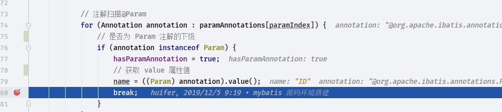
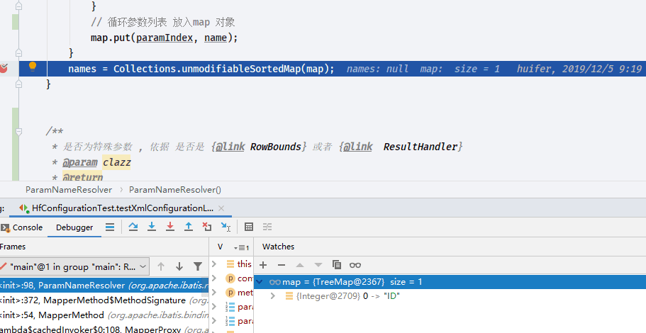
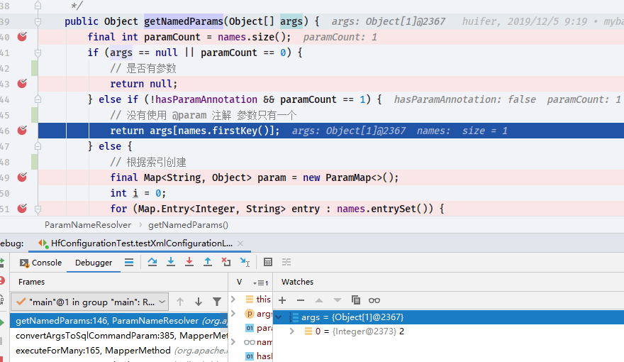
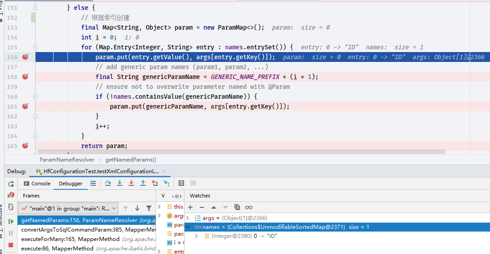
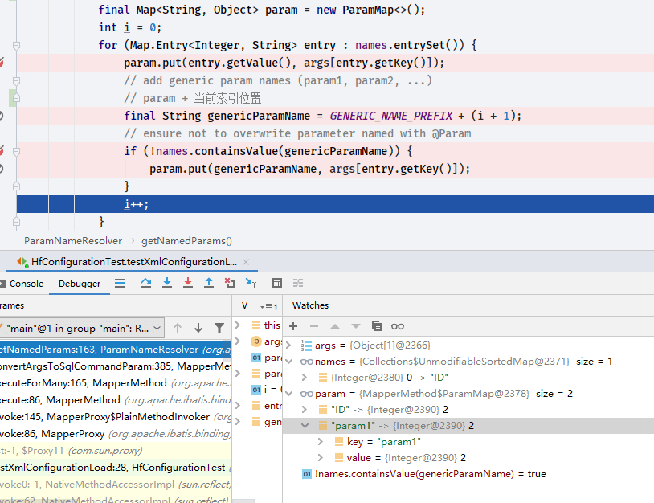

# ParamNameResolver 源码解析

- Author: [HuiFer](https://github.com/huifer)
- Description: 该文介绍 mybatis `@Param` 注解和`ParamNameResolver`
- 源码阅读工程: [SourceHot-Mybatis](https://github.com/SourceHot/mybatis-read.git)

## 源码

- `org.apache.ibatis.reflection.ParamNameResolver`

```java
/**
 * {@link Param} 注解的扫描工具和处理工具
 */
public class ParamNameResolver {

    public static final String GENERIC_NAME_PREFIX = "param";

    /**
     * <p>
     * The key is the index and the value is the name of the parameter.<br />
     * The name is obtained from {@link Param} if specified. When {@link Param} is not specified,
     * the parameter index is used. Note that this index could be different from the actual index
     * when the method has special parameters (i.e. {@link RowBounds} or {@link ResultHandler}).
     * </p>
     *
     * {@link ParamNameResolver#ParamNameResolver(org.apache.ibatis.session.Configuration, java.lang.reflect.Method)} 中的map 变量值转换而得
     * {参数索引: 参数名称(arg0,Param注解的value)}
     *
     */
    private final SortedMap<Integer, String> names;

    private boolean hasParamAnnotation;

    public ParamNameResolver(Configuration config, Method method) {
        // 方法参数类型
        final Class<?>[] paramTypes = method.getParameterTypes();
        // 参数上的注解
        final Annotation[][] paramAnnotations = method.getParameterAnnotations();
        //  参数索引和参数名称
        // {参数索引:参数名称}
        final SortedMap<Integer, String> map = new TreeMap<>();
        int paramCount = paramAnnotations.length;
        // get names from @Param annotations
        for (int paramIndex = 0; paramIndex < paramCount; paramIndex++) {
            if (isSpecialParameter(paramTypes[paramIndex])) {
                // skip special parameters
                // 如果是特殊类型跳过
                continue;
            }
            String name = null;

            // 注解扫描@Param
            for (Annotation annotation : paramAnnotations[paramIndex]) {
                // 是否为 Param 注解的下级
                if (annotation instanceof Param) {
                    hasParamAnnotation = true;
                    // 获取 value 属性值
                    name = ((Param) annotation).value();
                    break;
                }
            }
            if (name == null) {
                // 如果没有写 @param 处理方式如下
                // @Param was not specified.
                if (config.isUseActualParamName()) {
                    name = getActualParamName(method, paramIndex);
                }
                if (name == null) {
                    // use the parameter index as the name ("0", "1", ...)
                    // gcode issue #71
                    name = String.valueOf(map.size());
                }
            }
            // 循环参数列表 放入map 对象
            map.put(paramIndex, name);
        }
        names = Collections.unmodifiableSortedMap(map);
    }


    /**
     * 是否为特殊参数 , 依据 是否是 {@link RowBounds} 或者 {@link  ResultHandler}
     * @param clazz
     * @return
     */
    private static boolean isSpecialParameter(Class<?> clazz) {
        return RowBounds.class.isAssignableFrom(clazz) || ResultHandler.class.isAssignableFrom(clazz);
    }

    /**
     * 返回方法名  参数索引
     * @param method
     * @param paramIndex
     * @return
     */
    private String getActualParamName(Method method, int paramIndex) {
        return ParamNameUtil.getParamNames(method).get(paramIndex);
    }

    /**
     * Returns parameter names referenced by SQL providers.
     */
    public String[] getNames() {
        return names.values().toArray(new String[0]);
    }

    /**
     * <p>
     * A single non-special parameter is returned without a name.
     * Multiple parameters are named using the naming rule.
     * In addition to the default names, this method also adds the generic names (param1, param2,
     * ...).
     * </p>
     * <p>
     * 通常参数异常在这个地方抛出 param ... 异常
     * 获取参数名称,和参数传递的真实数据
     */
    public Object getNamedParams(Object[] args) {
        final int paramCount = names.size();
        if (args == null || paramCount == 0) {
            // 是否有参数
            return null;
        } else if (!hasParamAnnotation && paramCount == 1) {
            // 没有使用 @param 注解 参数只有一个
            return args[names.firstKey()];
        } else {
            // 根据索引创建
            final Map<String, Object> param = new ParamMap<>();
            int i = 0;
            for (Map.Entry<Integer, String> entry : names.entrySet()) {
                param.put(entry.getValue(), args[entry.getKey()]);
                // add generic param names (param1, param2, ...)
                // param + 当前索引位置
                final String genericParamName = GENERIC_NAME_PREFIX + (i + 1);
                // ensure not to overwrite parameter named with @Param
                if (!names.containsValue(genericParamName)) {
                    param.put(genericParamName, args[entry.getKey()]);
                }
                i++;
            }
            return param;
        }
    }
}

```

## debug 阶段

- 测试用例为同一个 ， 每次修改 mapper 方法参数来进行 debug

```java
@Test
    void testXmlConfigurationLoad() throws IOException {
        Reader reader = Resources.getResourceAsReader("mybatis-config-demo.xml");
        SqlSessionFactory factory = new SqlSessionFactoryBuilder().build(reader);
        Configuration configuration = factory.getConfiguration();
        SqlSession sqlSession = factory.openSession();
        HsSellMapper mapper = sqlSession.getMapper(HsSellMapper.class);
        List<HsSell> list = mapper.list(2);
        List<Object> objects = sqlSession.selectList("com.huifer.mybatis.mapper.HsSellMapper.list");
        assertEquals(list.size(), objects.size());


    }
```

```java
    List<HsSell> list( Integer id);

```

如果不写`@Param`称则返回


```java
    List<HsSell> list(@Param("ID") Integer id);
```

- 写`@Param`返回





- `org.apache.ibatis.reflection.ParamNameResolver#getNamedParams`

  ```java
      List<HsSell> list( Integer id);
  ```



```java
    List<HsSell> list(@Param("ID") Integer id);
```

​ 写上`@Param`




