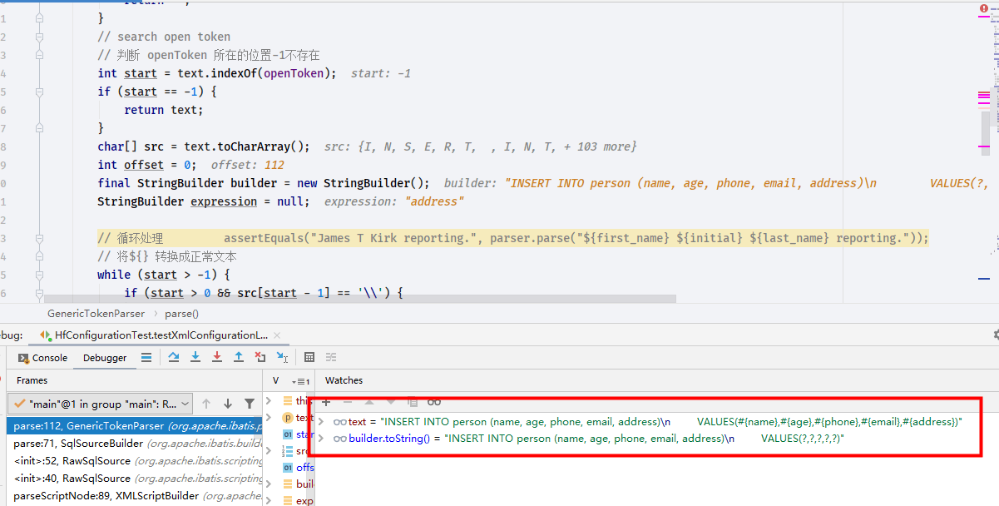

# GenericTokenParser

- Author: [HuiFer](https://github.com/huifer)
- 源码阅读工程: [SourceHot-Mybatis](https://github.com/SourceHot/mybatis-read.git)

```java
/**
 * Copyright 2009-2019 the original author or authors.
 * <p>
 * Licensed under the Apache License, Version 2.0 (the "License");
 * you may not use this file except in compliance with the License.
 * You may obtain a copy of the License at
 * <p>
 * http://www.apache.org/licenses/LICENSE-2.0
 * <p>
 * Unless required by applicable law or agreed to in writing, software
 * distributed under the License is distributed on an "AS IS" BASIS,
 * WITHOUT WARRANTIES OR CONDITIONS OF ANY KIND, either express or implied.
 * See the License for the specific language governing permissions and
 * limitations under the License.
 */
package org.apache.ibatis.parsing;

/**
 * @author Clinton Begin
 */
public class GenericTokenParser {

    /**
     * 开始标记
     */
    private final String openToken;
    /**
     * 结束标记
     */
    private final String closeToken;
    /**
     * 标记处理器
     */
    private final TokenHandler handler;

    public GenericTokenParser(String openToken, String closeToken, TokenHandler handler) {
        this.openToken = openToken;
        this.closeToken = closeToken;
        this.handler = handler;
    }

    /**
     * 核心处理方法 , 看测试类{@link org.apache.ibatis.parsing.GenericTokenParserTest}
     * @param text
     * @return
     */
    public String parse(String text) {
        // 判断是否空
        if (text == null || text.isEmpty()) {
            return "";
        }
        // search open token
        // 判断 openToken 所在的位置-1不存在
        int start = text.indexOf(openToken);
        if (start == -1) {
            return text;
        }
        char[] src = text.toCharArray();
        int offset = 0;
        final StringBuilder builder = new StringBuilder();
        StringBuilder expression = null;

        // 循环处理         assertEquals("James T Kirk reporting.", parser.parse("${first_name} ${initial} ${last_name} reporting."));
        // 将${} 转换成正常文本
        while (start > -1) {
            if (start > 0 && src[start - 1] == '\\') {
                // `\` 忽略这个参数
                // this open token is escaped. remove the backslash and continue.
                builder.append(src, offset, start - offset - 1).append(openToken);
                // offset 重新计算进行下一步循环
                offset = start + openToken.length();
            } else {
                // found open token. let's search close token.
                if (expression == null) {
                    expression = new StringBuilder();
                } else {
                    expression.setLength(0);
                }
                builder.append(src, offset, start - offset);
                offset = start + openToken.length();
                int end = text.indexOf(closeToken, offset);
                while (end > -1) {
                    if (end > offset && src[end - 1] == '\\') {
                        // 遇到`\`该参数不需要处理
                        // this close token is escaped. remove the backslash and continue.
                        expression.append(src, offset, end - offset - 1).append(closeToken);
                        // 计算offset重新推算替换的字符串
                        offset = end + closeToken.length();
                        end = text.indexOf(closeToken, offset);
                    } else {
                        expression.append(src, offset, end - offset);
                        break;
                    }
                }
                if (end == -1) {
                    // end == -1 closeToken 不存在,获取后面的所有字符串, openToken - closeToken 之间的内容
                    // close token was not found.
                    builder.append(src, start, src.length - start);
                    offset = src.length;
                } else {
                    // closeToken存在 继续执行
                    builder.append(handler.handleToken(expression.toString()));
                    offset = end + closeToken.length();
                }
            }
            start = text.indexOf(openToken, offset);
        }
        if (offset < src.length) {
            builder.append(src, offset, src.length - offset);
        }
        // 返回的是一个替换后的sql脚本
        return builder.toString();
    }
}

```

- 一个具体的例子`org.apache.ibatis.builder.SqlSourceBuilder.ParameterMappingTokenHandler`
  - 具体类`org.apache.ibatis.builder.SqlSourceBuilder`

```java
        /**
         * ? 的来源
         *
         * @param content
         * @return
         */
        @Override
        public String handleToken(String content) {
            parameterMappings.add(buildParameterMapping(content));
            return "?";
        }

```

```java
    /**
     * sql 参数类型 ， 返回值
     *
     * <select id="selectByPrimaryKey" parameterType="java.lang.Integer" resultMap="BaseResultMap">
     * <!--@mbg.generated-->
     * select
     * <include refid="Base_Column_List" />
     * from hs_sell
     * where ID = #{id,jdbcType=INTEGER}
     * </select>
     * => 替换成问号
     * select
     * <p>
     * <p>
     * ID, USER_ID, GOOD_ID, PRICE, `SIZE`, COMPANY_ID, GROUP_ID, VERSION, DELETED, CREATE_USER,
     * CREATE_TIME, UPDATE_USER, UPDATE_TIME, WORK_ORDER_ID
     * <p>
     * from hs_sell
     * where ID = ?
     *
     * @param originalSql          sql文本
     * @param parameterType        默认 object
     * @param additionalParameters
     * @return
     */
    public SqlSource parse(String originalSql, Class<?> parameterType, Map<String, Object> additionalParameters) {
        ParameterMappingTokenHandler handler = new ParameterMappingTokenHandler(configuration, parameterType, additionalParameters);
//        org.apache.ibatis.builder.SqlSourceBuilder.ParameterMappingTokenHandler.handleToken
        GenericTokenParser parser = new GenericTokenParser("#{", "}", handler);
        String sql = parser.parse(originalSql);
        return new StaticSqlSource(configuration, sql, handler.getParameterMappings());
    }

```


