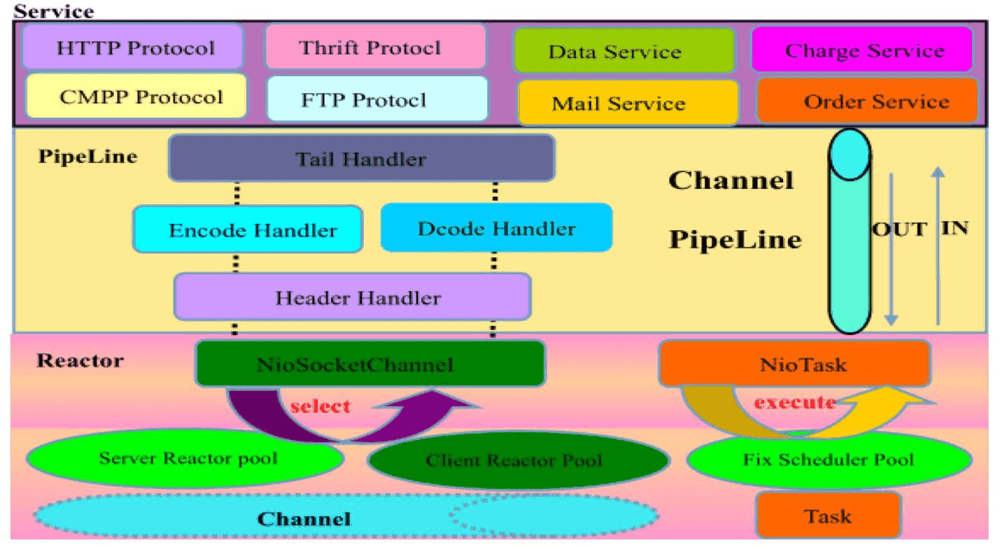

本博文用于重点分析 Netty 的逻辑架构及关键的架构质量属性，希望有助于大家从 Netty 的架构设计中汲取营养，设计出高性能、高可靠
性和可扩展的程序。

## Netty 的三层架构设计

Netty 采用了典型的三层网络架构进行设计和开发，其逻辑架构图如下所示。

### 通信调度层 Reactor

它由一系列辅助类完成，包括 Reactor 线程 NioEventLoop 及其父类，NioSocketChannel / NioServerSocketChannel 及其父类，Buffer 组件，Unsafe 组件 等。该层的主要职责就是**监听网络的读写和连接操作**，负责**将网络层的数据读取到内存缓冲区**，然后触发各种网络事件，例如连接创建、连接激活、读事件、写事件等，将这些事件触发到 PipeLine 中，由 PipeLine 管理的责任链来进行后续的处理。

### 责任链层 Pipeline

它负责上述的各种网络事件 在责任链中的有序传播，同时负责动态地编排责任链。责任链可以选择监听和处理自己关心的事件，它可以拦截处理事件，以及向前向后传播事件。不同应用的 Handler 节点 的功能也不同，通常情况下，往往会开发 编解码 Hanlder 用于消息的编解码，可以将外部的协议消息转换成 内部的 POJO 对象，这样上层业务则只需要关心处理业务逻辑即可，不需要感知底层的协议差异和线程模型差异，实现了架构层面的分层隔离。

### 业务逻辑编排层 Service ChannelHandler

业务逻辑编排层通常有两类：一类是纯粹的业务逻辑编排，还有一类是其他的应用层协议插件，用于特定协议相关的会话和链路管理。例如，CMPP 协议，用于管理和中国移动短信系统的对接。

架构的不同层面，需要关心和处理的对象都不同，通常情况下，对于业务开发者，只需要关心责任链的拦截和 业务 Handler 的编排。因为应用层协议栈往往是开发一次，到处运行，所以实际上对于业务开发者来说，只需要关心服务层的业务逻辑开发即可。各种应用协议以插件的形式提供，只有协议开发人员需要关注协议插件，对于其他业务开发人员来说，只需关心业务逻辑定制。这种分层的架构设计理念实现了 NIO 框架 各层之间的解耦，便于上层业务协议栈的开发和业务逻辑的定制。

正是由于 Netty 的分层架构设计非常合理，基于 Netty 的各种应用服务器和协议栈开发才能够如雨后春笋般得到快速发展。

## 关键的架构质量属性

### 性能

影响最终产品的性能因素非常多，其中软件因素如下。

- 架构不合理导致的性能问题；
- 编码实现不合理导致的性能问题，例如，锁没用好导致的性能瓶颈。

硬件因素如下。

- 服务器硬件配置太低导致的性能问题；
- 带宽、磁盘的 IOPS 等限制导致的 IO 操作 性能差；
- 测试环境被共用导致被测试的软件产品受到影响。

尽管影响产品性能的因素非常多，但是架构的性能模型合理与否对性能的影响非常大。如果一个产品的架构设计得不好，无论开发如何努力，都很难开发出一个高性能、高可用的软件产品。

“性能是设计出来的，而不是测试出来的”。下面我们看看 Netty 的架构设计是如何实现高性能的。

1. 采用非阻塞的 NIO 类库，基于 Reactor 模式实现，解决了传统 同步阻塞 IO 模式 下一个服务端无法平滑地处理线性增长的客户端的问题。
2. TCP 接收和发送缓冲区**使用直接内存代替堆内存，避免了内存复制**，提升了 IO 读取和写入的性能。
3. 支持通过内存池的方式循环利用 ByteBuffer，避免了频繁创建和销毁 ByteBuffer 带来的性能损耗。
4. 可配置的 IO 线程数、TCP 参数 等，为不同的用户场景提供定制化的调优参数，满足不同的性能场景。
5. 采用环形数组缓冲区实现无锁化并发编程，代替传统的线程安全容器或者锁。
6. 合理地使用线程安全容器、原子类等，提升系统的并发处理能力。
7. 关键资源的处理使用单线程串行化的方式，避免多线程并发访问带来的锁竞争和额外的 CPU 资源消耗问题。
8. 通过引用计数器及时地申请释放不再被引用的对象，细粒度的内存管理降低了 GC 的频率，减少了频繁 GC 带来的延时和 CPU 损耗。

### 可靠性

作为一个高性能的异步通信框架，架构的可靠性是大家选择的另一个重要依据。下面我们看一下 Netty 架构 的可靠性设计。

**1、链路有效性检测**  
由于长连接不需要每次发送消息都创建链路，也不需要在消息交互完成时关闭链路，因此相对于短连接性能更高。对于长连接，一旦链路建立成功便一直维系双方之间的链路，直到系统退出。

为了保证长连接的链路有效性，往往需要通过心跳机制周期性地进行链路检测。使用周期性心跳的原因是：在系统空闲时，例如凌晨，往往没有业务消息。如果此时链路被防火墙 Hang 住，或者遭遇网络闪断、网络单通等，通信双方无法识别出这类链路异常。等到第二天业务高峰期到来时，瞬间的海量业务冲击会导致消息积压无法发送给对方，由于链路的重建需要时间，这期间业务会大量失败 (集群或者分布式组网情况会好一些)。为了解决这个问题，需要周期性的 “心跳检测” 对链路进行有效性检查，一旦发生问题，可以及时关闭链路，重建 TCP 连接。

当有业务消息时，无须心跳检测，可以由业务消息进行链路可用性检测。所以心跳消息往往是在链路空闲时发送的。为了支持心跳机制，Netty 提供了如下两种链路空闲检测机制。

- 读空闲超时机制：当经过 连续的周期 T 没有消息可读时，触发 超时 Handler，用户可以基于 该读空闲超时 Handler 发送心跳消息，进行链路检测，如果连续 N 个周期 仍然没有读取到心跳消息，可以主动关闭这条链路。
- 写空闲超时机制：当经过 连续的周期 T 没有消息要发送时，触发 超时 Handler，用户可以基于 该写空闲超时 Handler 发送心跳消息，进行链路检测，如果连续 N 个周期 仍然没有接收到对方的心跳消息，可以主动关闭这条链路。

为了满足不同用户场景的心跳定制，Netty 提供了空闲状态检测事件通知机制，用户可以订阅：空闲超时事件、读空闲超时机制、写空闲超时事件，在接收到对应的空闲事件之后，灵活地进行定制。

**2、内存保护机制**
Netty 提供多种机制对内存进行保护，包括以下几个方面。

- 通过对象引用计数器对 Netty 的 ByteBuffer 等内置对象进行细粒度的内存申请和释放，对非法的对象引用进行检测和保护。
- 通过内存池来重用 ByteBuffer，节省内存。
- 可设置的内存容量上限，包括 ByteBuffer、线程池线程数等。

### 可定制性

Netty 的可定制性主要体现在以下几点。

- 责任链模式：ChannelPipeline 基于责任链模式开发，便于业务逻辑的拦截、定制和扩展。
- 基于接口的开发：关键的类库都提供了接口或者抽象类，如果 Netty 自身的实现无法满足用户的需求，可以由用户自定义实现相关接口。
- 提供了大量工厂类，通过重载这些工厂类可以按需创建出用户实现的对象。
- 提供了大量的系统参数供用户按需设置，增强系统的场景定制性。

### 可扩展性

基于 Netty 的 基本 NIO 框架，可以方便地进行应用层协议定制，例如，HTTP 协议栈、Thrift 协议栈、FTP 协议栈 等。这些扩展不需要修改 Netty 的源码，直接基于 Netty 的二进制类库即可实现协议的扩展和定制。目前，业界存在大量的基于 Netty 框架 开发的协议，例如基于 Netty 的 HTTP 协议、Dubbo 协议、RocketMQ 内部私有协议 等。
