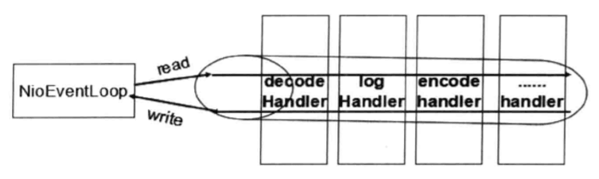

作为一个高性能的 NIO 通信框架，Netty 被广泛应用于大数据处理、互联网消息中间件、游戏和金融行业等。大多数应用场景对底层的通信框架都有很高的性能要求，作为综合性能最高的 NIO 框架 之一，Netty 可以完全满足不同领域对高性能通信的需求。本章我们将从架构层对 Netty 的高性能设计和关键代码实现进行剖析，看 Netty 是如何支撑高性能网络通信的。

## RPC 调用性能模型分析

### 传统 RPC 调用性能差的原因

**一、网络传输方式问题。**  
传统的 RPC 框架 或者基于 RMI 等方式的 远程过程调用 采用了同步阻塞 I/O，当客户端的并发压力或者网络时延增大之后，同步阻塞 I/O 会由于频繁的 wait 导致 I/O 线程 经常性的阻塞，由于线程无法高效的工作，I/O 处理能力自然下降。

采用 BIO 通信模型 的服务端，通常由一个独立的 Acceptor 线程 负责监听客户端的连接，接收到客户端连接之后，为其创建一个新的线程处理请求消息，处理完成之后，返回应答消息给客户端，线程销毁，这就是典型的 “ 一请求，一应答 ” 模型。该架构最大的问题就是不具备弹性伸缩能力，当并发访问量增加后，服务端的线程个数和并发访问数成线性正比，由于线程是 Java 虛拟机 非常宝贵的系统资源，当线程数膨胀之后，系统的性能急剧下降，随着并发量的继续增加，可能会发生句柄溢出、线程堆栈溢出等问题，并导致服务器最终宕机。

**二、序列化性能差。**  
Java 序列化 存在如下几个典型问题：

1. Java 序列化机制是 Java 内部的一 种对象编解码技术，无法跨语言使用。例如对于异构系统之间的对接，Java 序列化 后的码流需要能够通过其他语言反序列化成原始对象，这很难支持。
2. 相比于其他开源的序列化框架，Java 序列化 后的码流太大，无论是网络传输还是持久化到磁盘，都会导致额外的资源占用。
3. 序列化性能差，资源占用率高 ( 主要是 CPU 资源占用高 )。

**三、线程模型问题。**  
由于采用 同步阻塞 I/O，这会导致每个 TCP 连接 都占用 1 个线程，由于线程资源是 JVM 虚拟机 非常宝贵的资源，当 I/O 读写阻塞导致线程无法及时释放时，会导致系统性能急剧下降，严重的甚至会导致虚拟机无法创建新的线程。

### IO 通信性能三原则

尽管影响 I/O 通信性能 的因素非常多，但是从架构层面看主要有三个要素。

1. 传输：用什么样的通道将数据发送给对方。可以选择 BIO、NIO 或者 AIO，I/O 模型 在很大程度上决定了通信的性能；
2. 协议：采用什么样的通信协议，HTTP 等公有协议或者内部私有协议。协议的选择不同，性能也不同。相比于公有协议，内部私有协议的性能通常可以被设计得更优；
3. 线程模型：数据报如何读取？读取之后的编解码在哪个线程进行，编解码后的消息如何派发，Reactor 线程模型的不同，对性能的影响也非常大。

## 异步非阻塞通信

在 I/O 编程 过程中，当需要同时处理多个客户端接入请求时，可以利用多线程或者 I/O 多路复用技术 进行处理。I/O 多路复用技术 通过把多个 I/O 的阻塞复用到同一个 select 的阻塞上，从而使得系统在单线程的情况下可以同时处理多个客户端请求。与传统的多线程 / 多进程模型比，I/O 多路复用 的最大优势是系统开销小，系统不需要创建新的额外进程或者线程，也不需要维护这些进程和线程的运行，降低了系统的维护工作量，节省了系统资源。

JDK1.4 提供了对非阻塞 I/O 的支持，JDK1.5 使用 epoll 替代了传统的 select / poll，极大地提升了 NIO 通信 的性能。

与 Socket 和 ServerSocket 类相对应，NIO 也提供了 SocketChannel 和 ServerSocketChannel 两种不同的套接字通道实现。这两种新增的通道都支持阻塞和非阻塞两种模式。阻塞模式使用非常简单，但是性能和可靠性都不好，非阻塞模式则正好相反。开发人员一般可以根据自己的需要来选择合适的模式，一般来说，低负载、低并发的应用程序可以选择 同步阻塞 I/O 以降低编程复杂度。但是对于高负载、高并发的网络应用，需要使用 NIO 的非阻塞模式进行开发。

Netty 的 I/O 线程 NioEventLoop 由于聚合了 多路复用器 Selector，可以同时并发处理成百上千个客户端 SocketChannel。由于读写操作都是非阻塞的，这就可以充分提升 I/O 线程 的运行效率，避免由频繁的 I/O 阻塞 导致的线程挂起。另外，由于 Netty 采用了异步通信模式，一个 I/O 线程 可以并发处理 N 个客户端连接和读写操作，这从根本上解决了传统 同步阻塞 I/O “ 一连接，一线程 ” 模型，架构的性能、弹性伸缩能力和可靠性都得到了极大的提升。

## 高效的 Reactor 线程模型

常用的 Reactor 线程模型 有三种，分别如下。

1. Reactor 单线程模型；
2. Reactor 多线程模型；
3. 主从 Reactor 多线程模型。

Reactor 单线程模型，指的是所有的 I/O 操作 都在同一个 NIO 线程 上面完成，NIO 线程 的职责如下：

1. 作为 NIO 服务端，接收客户端的 TCP 连接；
2. 作为 NIO 客户端，向服务端发起 TCP 连接；
3. 读取通信对端的请求或者应答消息；
4. 向通信对端发送消息请求或者应答消息。

由于 Reactor 模式 使用的是 异步非阻塞 I/O，所有的 I/O 操作 都不会导致阻塞，理论上一个线程可以独立处理所有 I/O 相关的操作。从架构层面看，一个 NIO 线程 确实可以完成其承担的职责。例如，通过 Acceptor 接收客户端的 TCP 连接请求消息，链路建立成功之后，通过 Dispatch 将对应的 ByteBuffer 派发到指定的 Handler 上进行消息解码。用户 Handler 可以通过 NIO 线程 将消息发送给客户端。

对于一些小容量应用场景，可以使用单线程模型，但是对于高负载、大并发的应用却不合适，主要原因如下。

1. 一个 NIO 线程 同时处理成百上千的链路，性能上无法支撑。即便 NIO 线程 的 CPU 负荷 达到 100%，也无法满足海量消息的编码，解码、读取和发送；
2. 当 NIO 线程 负载过重之后，处理速度将变慢，这会导致大量客户端连接超时，超时之后往往会进行重发，这更加重了 NIO 线程 的负载，最终会导致大量消息积压和处理超时，NIO 线程 会成为系统的性能瓶颈；
3. 可靠性问题。一旦 NIO 线程 意外跑飞，或者进入死循环，会导致整个系统通信模块不可用，不能接收和处理外部消息，造成节点故障。

为了解决这些问题，演进出了 Reactor 多线程模型，下面我们看一下 Reactor 多线程模型。

Rector 多线程模型 与单线程模型最大的区别就是有一组 NIO 线程 处理 I/O 操作，它的特点如下。

1. 有一个专门的 NIO 线程 —— Acceptor 线程 用于监听服务端口，接收客户端的 TCP 连接请求；
2. 网络 IO 操作 —— 读、写等由一个 NIO 线程池 负责，线程池可以采用标准的 JDK 线程池 实现，它包含一个任务队列和 N 个可用的线程，由这些 NIO 线程 负责消息的读取、解码、编码和发送；
3. 1 个 NIO 线程 可以同时处理 N 条链路，但是 1 个链路只对应 1 个 NIO 线程，以防止发生并发操作问题。

在绝大多数场景下，Reactor 多线程模型 都可以满足性能需求，但是，在极特殊应用场景中，一个 NIO 线程 负责监听和处理所有的客户端连接可能会存在性能问题。例如百万客户端并发连接，或者服务端需要对客户端的握手消息进行安全认证，认证本身非常损耗性能。在这类场景下，单独一个 Acceptor 线程 可能会存在性能不足问题，为了解决性能问题，产生了第三种 Reactor 线程模型 —— 主从 Reactor 多线程模型。

主从 Reactor 线程模型 的特点是，服务端用于接收客户端连接的不再是个单线程的连接处理 Acceptor，而是一个独立的 Acceptor 线程池。Acceptor 接收到客户端 TCP 连接请求 处理完成后 ( 可能包含接入认证等 )，将新创建的 SocketChannel 注册到 I/O 处理线程池 的某个 I/O 线程 上，由它负责 SocketChannel 的读写和编解码工作。Acceptor 线程池 只用于客户端的登录、握手和安全认证，一旦链路建立成功，就将链路注册到 I/O 处理线程池的 I/O 线程 上，每个 I/O 线程 可以同时监听 N 个链路，对链路产生的 IO 事件 进行相应的 消息读取、解码、编码及消息发送等操作。

利用 主从 Reactor 线程模型，可以解决 1 个 Acceptor 线程 无法有效处理所有客户端连接的性能问题。因此，Netty 官方 也推荐使用该线程模型。

事实上，Netty 的线程模型并非固定不变，通过在启动辅助类中创建不同的 EventLoopGroup 实例 并进行适当的参数配置，就可以支持上述三种 Reactor 线程模型。可以根据业务场景的性能诉求，选择不同的线程模型。

Netty 单线程模型 服务端代码示例如下。

```java
    EventLoopGroup reactor = new NioEventLoopGroup(1);
    ServerBootstrap bootstrap = new ServerBootstrap();
    bootstrap.group(reactor, reactor)
            .channel(NioServerSocketChannel.class)
            ......
```

Netty 多线程模型 代码示例如下。.

```java
    EventLoopGroup acceptor = new NioEventLoopGroup(1);
    EventLoopGroup ioGroup = new NioEventLoopGroup();
    ServerBootstrap bootstrap = new ServerBootstrap();
    bootstrap.group(acceptor, ioGroup)
            .channel(NioServerSocketChannel.class)
            ......
```

Netty 主从多线程模型 代码示例如下。

```java
    EventLoopGroup acceptorGroup = new NioEventLoopGroup();
    EventLoopGroup ioGroup = new NioEventLoopGroup();
    ServerBootstrap bootstrap = new ServerBootstrap();
    bootstrap.group(acceptorGroup, ioGroup)
            .channel(NioServerSocketChannel.class)
            ......
```

## 无锁化的串行设计

在大多数场景下，并行多线程处理可以提升系统的并发性能。但是，如果对于共享资源的并发访问处理不当，会带来严重的锁竞争，这最终会导致性能的下降。为了尽可能地避免锁竞争带来的性能损耗，可以通过串行化设计，即消息的处理尽可能在同一个线程内完成，期间不进行线程切换，这样就避免了多线程竞争和同步锁。

为了尽可能提升性能，Netty 对消息的处理 采用了串行无锁化设计，在 I/O 线程 内部进行串行操作，避免多线程竞争导致的性能下降。Netty 的串行化设计工作原理图如下图所示。



Netty 的 NioEventLoop 读取到消息之后，直接调用 ChannelPipeline 的 fireChannelRead(Object msg)，只要用户不主动切换线程，一直会由 NioEventLoop 调用到 用户的 Handler，期间不进行线程切换。这种串行化处理方式避免了多线程操作导致的锁的竞争，从性能角度看是最优的。

## 零拷贝

Netty 的 “ 零拷贝 ” 主要体现在如下三个方面。

第一种情况。Netty 的接收和发送 ByteBuffer 采用 堆外直接内存 (DIRECT BUFFERS) 进行 Socket 读写，不需要进行字节缓冲区的二次拷贝。如果使用传统的 堆内存(HEAP BUFFERS) 进行 Socket 读写，JVM 会将 堆内存 Buffer 拷贝一份到 直接内存 中，然后才写入 Socket。相比于堆外直接内存，消息在发送过程中多了一次缓冲区的内存拷贝。

下面我们继续看第二种 “ 零拷贝 ” 的实现 CompositeByteBuf，它对外将多个 ByteBuf 封装成一个 ByteBuf，对外提供统一封装后的 ByteBuf 接口。CompositeByteBuf 实际就是个 ByteBuf 的装饰器，它将多个 ByteBuf 组合成一个集合，然后对外提供统一的 ByteBuf 接口，添加 ByteBuf，不需要做内存拷贝。

第三种 “ 零拷贝 ” 就是文件传输，Netty 文件传输类 DefaultFileRegion 通过 transferTo()方法 将文件发送到目标 Channel 中。很多操作系统直接将文件缓冲区的内容发送到目标 Channel 中，而不需要通过循环拷贝的方式，这是一种更加高效的传输方式，提升了传输性能，降低了 CPU 和内存占用，实现了文件传输的 “ 零拷贝 ” 。

## 内存池

随着 JVM 虚拟机 和 JIT 即时编译技术 的发展，对象的分配和回收是个非常轻量级的工作。但是对于 缓冲区 Buffer，情况却稍有不同，特别是对于堆外直接内存的分配和回收，是一件耗时的操作。为了尽量重用缓冲区，Netty 提供了基于内存池的缓冲区重用机制。ByteBuf 的子类中提供了多种 PooledByteBuf 的实现，基于这些实现 Netty 提供了多种内存管理策略，通过在启动辅助类中配置相关参数，可以实现差异化的定制。

## Socket 与 SocketChannel

网络由下往上分为 物理层、数据链路层、网络层、传输层和应用层。IP 协议 对应于网络层，TCP 协议 对应于传输层，而 HTTP 协议 对应于应用层，三者从本质上来说没有可比性，Socket 则是对 TCP/IP 协议 的封装和应用 (程序员层面上)。也可以说，TPC/IP 协议 是传输层协议，主要解决数据如何在网络中传输，而 HTTP 是应用层协议，主要解决如何包装数据。Socket 是对 TCP/IP 协议 的封装，Socket 本身并不是协议，而是一个 调用接口(API)。 通过 Socket，我们才能使用 TCP/IP 协议。

### 一、利用 Socket 建立网络连接的步骤

建立 Socket 连接 至少需要一对套接字，其中一个运行于客户端，称为 clientSocket ，另一个运行于服务器端，称为 serverSocket 。套接字之间的连接过程分为三个步骤：服务器监听，客户端请求，连接确认。

1. 服务器监听：服务器端套接字并不定位具体的客户端套接字，而是处于等待连接的状态，实时监控网络状态，等待客户端的连接请求。
2. 客户端请求：指客户端的套接字提出连接请求，要连接的目标是服务器端的套接字。为此，客户端的套接字必须首先描述它要连接的服务器的套接字，指出服务器端套接字的地址和端口号，然后就向服务器端套接字提出连接请求。
3. 连接确认：当服务器端套接字监听到或者说接收到客户端套接字的连接请求时，就响应客户端套接字的请求，建立一个新的线程，把服务器端套接字的描述发给 客户端，一旦客户端确认了此描述，双方就正式建立连接。而服务器端套接字继续处于监听状态，继续接收其他客户端套接字的连接请求。

### 二、HTTP 连接 的特点

HTTP 协议 是 Web 联网 的基础，也是手机联网常用的协议之一，HTTP 协议 是建立在 TCP 协议 之上的一种应用。HTTP 连接 最显著的特点是客户端发送的每次请求 都需要服务器回送响应，在请求结束后，会主动释放连接。从建立连接到关闭连接的过程称为 “一次连接”。

### 三、TCP 和 UDP 的区别

1. TCP 是面向连接的，虽然说网络的不安全不稳定特性决定了多少次握手都不能保证连接的可靠性，但 TCP 的三次握手在很大程度上 保证了连接的可靠性。而 UDP 不是面向连接的，UDP 传送数据前并不与对方建立连接，对接收到的数据也不发送确认信号，发送端不知道数据是否会正确接收，当然也不用重发，所以说 UDP 是无连接的、不可靠的一种数据传输协议。
2. 也正由于 1 所说的特点，使得 UDP 的开销更小，数据传输速率更高，因为不必进行收发数据的确认，所以 UDP 的实时性更好。

### 四、Socket 与 SocketChannel 有什么区别

Socket、SocketChannel 二者的实质都是一样的，都是为了实现客户端与服务器端的连接而存在的，但是在使用上却有很大的区别。具体如下：

1. 所属包不同。Socket 在 java.net 包 中，而 SocketChannel 在 java.nio 包 中。
2. 异步方式不同。从包的不同，我们大体可以推断出他们主要的区别：Socket 是阻塞连接，SocketChannel 可以设置为非阻塞连接。使用 ServerSocket 与 Socket 的搭配，服务端 Socket 往往要为每一个 客户端 Socket 分配一个线程，而每一个线程都有可能处于长时间的阻塞状态中。过多的线程也会影响服务器的性能。而使用 SocketChannel 与 ServerSocketChannel 的搭配可以非阻塞通信，这样使得服务器端只需要一个线程就能处理所有 客户端 Socket 的请求。
3. 性能不同。一般来说，高并发场景下，使用 SocketChannel 与 ServerSocketChannel 的搭配会有更好的性能。
4. 使用方式不同。Socket、ServerSocket 类 可以传入不同参数直接实例化对象并绑定 IP 和 端口。而 SocketChannel、ServerSocketChannel 类 需要借助 Selector 类。

下面是 SocketChannel 方式 需要用到的几个核心类：

ServerSocketChannel：ServerSocket 的替代类, 支持阻塞通信与非阻塞通信。

SocketChannel：Socket 的替代类, 支持阻塞通信与非阻塞通信。

Selector：为 ServerSocketChannel 监控接收客户端连接就绪事件, 为 SocketChannel 监控连接服务器读就绪和写就绪事件。

SelectionKey：代表 ServerSocketChannel 及 SocketChannel 向 Selector 注册事件的句柄。当一个 SelectionKey 对象 位于 Selector 对象 的 selected-keys 集合 中时，就表示与这个 SelectionKey 对象 相关的事件发生了。在 SelectionKey 类 中有如下几个静态常量：

- SelectionKey.OP_ACCEPT，客户端连接就绪事件，等于监听 serverSocket.accept()，返回一个 socket。
- SelectionKey.OP_CONNECT，准备连接服务器就绪，跟上面类似，只不过是对于 socket 的，相当于监听了 socket.connect()。
- SelectionKey.OP_READ，读就绪事件, 表示输入流中已经有了可读数据, 可以执行读操作了。
- SelectionKey.OP_WRITE，写就绪事件, 表示可以执行写操作了。
