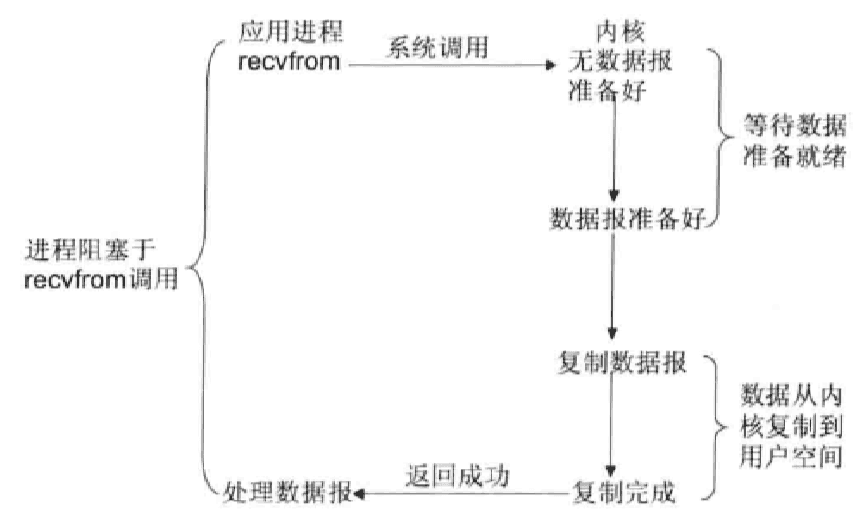
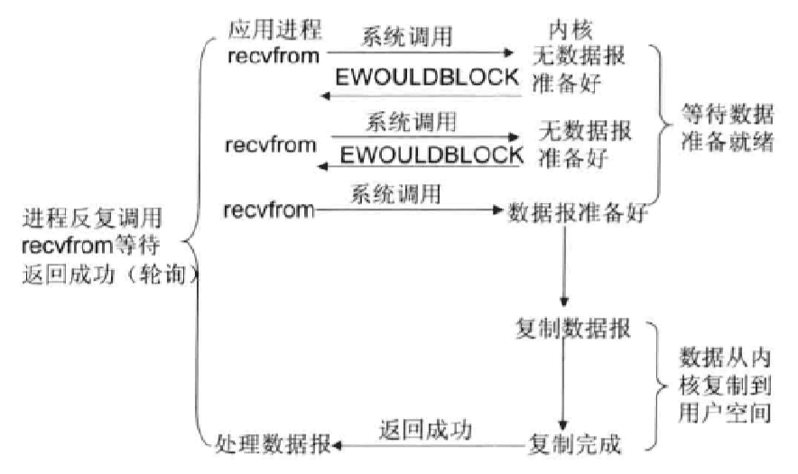
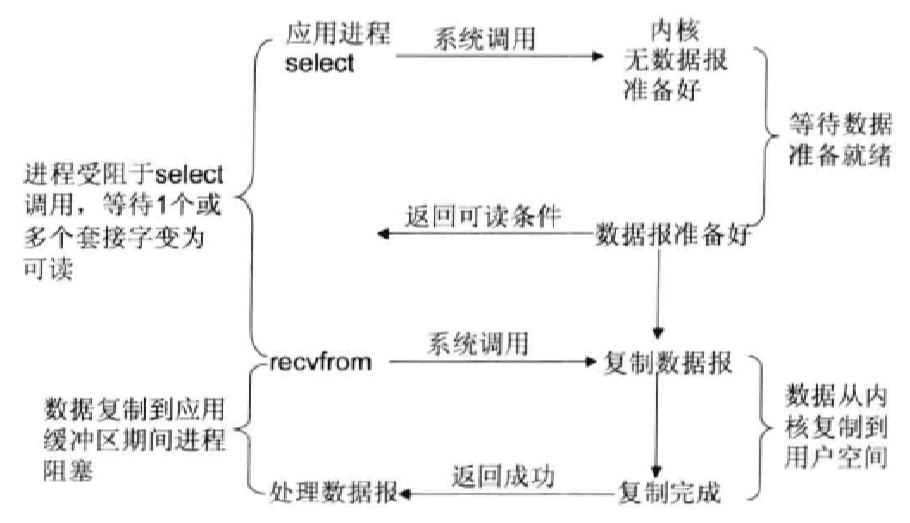
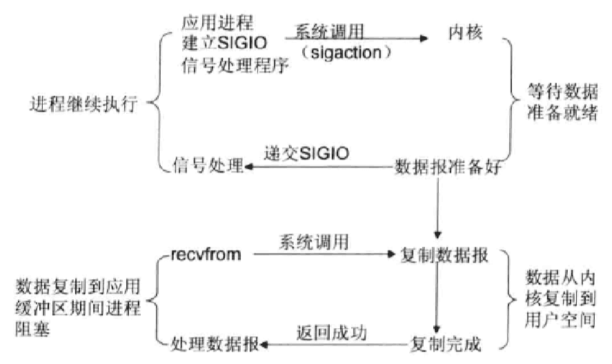
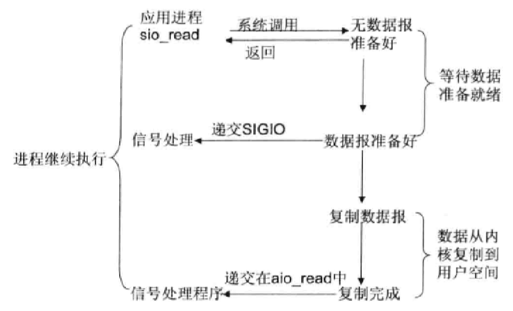
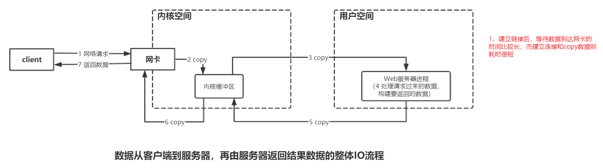

## Linux 网络 IO 模型简介

Linux 的内核将所有外部设备都看做一个文件来操作，对一个文件的读写操作会调用内核提供的系统命令，返回一个 fd (file descriptor，文件描述符)。而对一个 socket 的读写也会有相应的描述符，称为 socket fd (socket 描述符)，描述符就是一个数字，它指向内核中的一个结构体(文件路径，数据区等一些属性)。根据 UNIX 网络编程对 I/O 模型 的分类，UNIX 提供了 5 种 I/O 模型，分别如下。

#### 1、阻塞 IO 模型

在内核将数据准备好之前，系统调用会一直等待所有的套接字（Socket）传来数据，默认的是阻塞方式。

Java 中的 socket.read()方法 最终会调用底层操作系统的 recvfrom 方法，OS 会判断来自网络的数据报是否准备好，当数据报准备好了之后，OS 就会将数据从内核空间拷贝到用户空间（因为我们的用户程序只能获取用户空间的内存，无法直接获取内核空间的内存）。拷贝完成之后 socket.read() 就会解除阻塞，并得到网络数据的结果。

BIO 中的阻塞，就是阻塞在 2 个地方：

1. OS 等待数据报通过网络发送过来，如果建立连接后数据一直没过来，就会白白浪费线程的资源；
2. 将数据从内核空间拷贝到用户空间。

在这 2 个时候，我们的线程会一直被阻塞，啥事情都不干。

#### 2、非阻塞 IO 模型

每次应用程序询问内核是否有数据报准备好，当有数据报准备好时，就进行拷贝数据报的操作，从内核拷贝到用户空间，和拷贝完成返回的这段时间，应用进程是阻塞的。但在没有数据报准备好时，并不会阻塞程序，内核直接返回未准备好的信号，等待应用进程的下一次询问。但是，轮寻对于 CPU 来说是较大的浪费，一般只有在特定的场景下才使用。

从图中可以看到，非阻塞 IO 的 recvfrom 调用 会立即得到一个返回结果(数据报是否准备好)，我们可以根据返回结果继续执行不同的逻辑。而阻塞 IO 的 recvfrom 调用，如果无数据报准备好，一定会被阻塞住。虽然 非阻塞 IO 比 阻塞 IO 少了一段阻塞的过程，但事实上 非阻塞 IO 这种方式也是低效的，因为我们不得不使用轮询方法区一直问 OS：“我的数据好了没啊”。

**BIO 不会在 拷贝数据之前 阻塞，但会在将数据从内核空间拷贝到用户空间时阻塞。一定要注意这个地方，Non-Blocking 还是会阻塞的。**

#### 3、IO 复用模型

Linux 提供 select/poll，进程通过将一个或多个 fd 传递给 select 或 poll 系统 调用，阻塞发生在 select/poll 操作上。select/poll 可以帮我们侦测多个 fd 是否处于就绪状态，它们顺序扫描 fd 是否就绪，但支持的 fd 数量有限，因此它的使用也受到了一些制约。Linux 还提供了一个 epoll 系统调用，epoll 使用 基于事件驱动方式 代替 顺序扫描，因此性能更高，当有 fd 就绪时，立即回调函数 rollback。

#### 4、信号驱动 IO 模型

首先开启套接口信号驱动 IO 功能，并通过系统调用 sigaction 执行一个信号处理函数（此系统调用立即返回，进程继续工作，它是非阻塞的）。当数据准备就绪时，就为该进程生成一个 SIGIO 信号，通过信号回调通知应用程序调用 recvfrom 来读取数据，并通知主循环函数处理数据。

#### 5、异步 IO 模型

告知内核启动某个操作，并让内核在整个操作完成后(包括将数据从内核复制到用户自己的缓冲区)通知我们。这种模型与信号驱动模型的主要区别是：信号驱动 IO 由内核通知我们何时可以开始一个 IO 操作；异步 IO 模型 由内核通知我们 IO 操作何时已经完成。

从这五种 IO 模型的结构 也可以看出，阻塞程度：阻塞 IO>非阻塞 IO>多路转接 IO>信号驱动 IO>异步 IO，效率是由低到高的。

最后，我们看一下数据从客户端到服务器，再由服务器返回结果数据的整体 IO 流程，以便我们更好地理解上述的 IO 模型。

## IO 多路复用技术

Java NIO 的核心类库中 多路复用器 Selector 就是基于 epoll 的多路复用技术实现。

在 IO 编程 过程中，当需要同时处理多个客户端接入请求时，可以利用多线程或者 IO 多路复用技术 进行处理。IO 多路复用技术 通过把多个 IO 的阻塞复用到同一个 select 的阻塞上，从而使得系统在单线程的情况下可以同时处理多个客户端请求。与传统的多线程/多进程模型比，IO 多路复用 的最大优势是系统开销小，系统不需要创建新的额外进程或线程，也不需要维护这些进程和线程的运行，降低了系统的维护工作量，节省了系统资源，IO 多路复用 的主要应用场景如下。

- 服务器需要同时处理多个处于监听状态或者多个连接状态的套接字;
- 服务器需要同时处理多种网络协议的套接字。

目前支持 IO 多路复用 的系统调用有 select、pselect、poll、epoll，在 Linux 网络编程 过程中，很长一段时间都使用 select 做轮询和网络事件通知，然而 select 的一些固有缺陷导致了它的应用受到了很大的限制，最终 Linux 选择了 epoll。epoll 与 select 的原理比较类似，为了克服 select 的缺点，epoll 作了很多重大改进，现总结如下。

1. 支持一个进程打开的 socket 描述符 (fd) 不受限制(仅受限于操作系统的最大文件句柄数)；
2. IO 效率 不会随着 FD 数目的增加而线性下降；
3. epoll 的 API 更加简单。

值得说明的是，用来克服 select/poll 缺点的方法不只有 epoll, epoll 只是一种 Linux 的实现方案。
