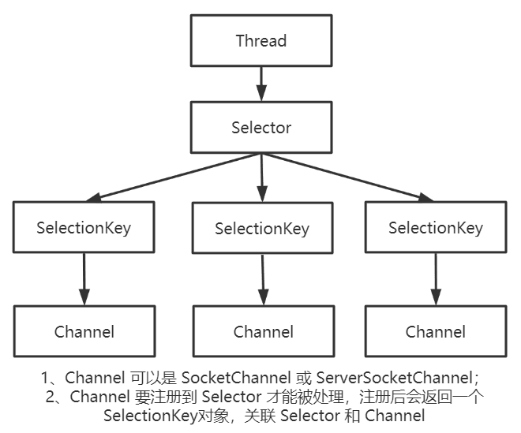
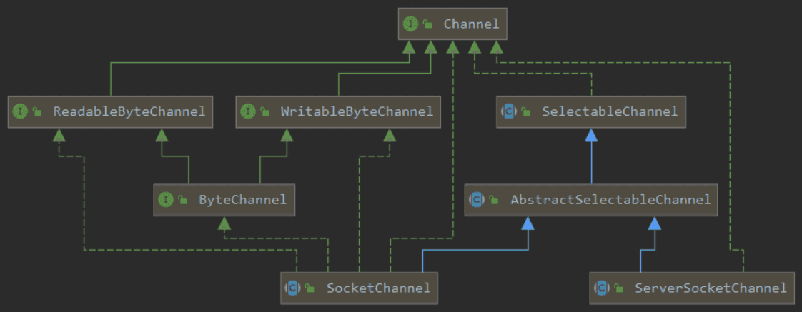

Selector、SelectionKey 和 Channel 这三个组件构成了 Java nio 包的核心，也是 Reactor 模型在代码层面的体现。Selector 能让单线程同时处理多个客户端 Channel，非常适用于高并发，传输数据量较小的场景。要使用 Selector，首先要将对应的 Channel 及 IO 事件（读、写、连接）注册到 Selector，注册后会产生一个 SelectionKey 对象，用于关联 Selector 和 Channel，及后续的 IO 事件处理。这三者的关系如下图所示。



对 nio 编程不熟的同学可以搜索一些简单的 demo 跑一下，下面 我们直接进入源码，窥探一些 nio 的奥秘。

### Selector

其实，不管是 Selector 还是 SelectionKey 的源码，其具体实现类都是依赖于底层操作系统的，这里我们只看一下抽象类 Selector 的源码，日后有事件，再找一些具体的实现类深入分析一下。

```java
public abstract class Selector implements Closeable {

    protected Selector() { }

    /**
     * 获取一个 Selector对象，具体实现依赖于底层操作系统
     */
    public static Selector open() throws IOException {
        return SelectorProvider.provider().openSelector();
    }

    /**
     * 判断该 Selector 是否已开启
     */
    public abstract boolean isOpen();

    /**
     * 当前所有向Selector注册的Channel 所对应的SelectionKey的集合
     */
    public abstract Set<SelectionKey> keys();

    /**
     * 相关事件已经被 Selector 捕获的 SelectionKey的集合
     */
    public abstract Set<SelectionKey> selectedKeys();

    /**
     * 阻塞到至少有一个通道在你注册的事件上就绪了
     */
    public abstract int select() throws IOException;

    /**
     * 和select()一样，除了最长会阻塞timeout毫秒
     */
    public abstract int select(long timeout) throws IOException;

    /**
     * 此方法执行非阻塞的选择操作，如果自从上一次选择操作后，
     * 没有通道变成可选择的，则此方法直接返回 0
     */
    public abstract int selectNow() throws IOException;

    /**
     * 用完Selector后调用其close()方法会关闭该Selector，且使注册到该Selector上的所有SelectionKey实例无效
     * 通道本身并不会关闭
     */
    public abstract void close() throws IOException;
}
```

### SelectionKey

表示 SelectableChannel 在 Selector 中的注册的标记 / 句柄。

```java
public abstract class SelectionKey {

    protected SelectionKey() { }


    // -- Channel and selector operations --

    /**
     * 获取该 SelectionKey 对应的Channel，Channel注册到Selector时会产生该 SelectionKey对象
     */
    public abstract SelectableChannel channel();

    /**
     * 获取该 SelectionKey 对应的 Selector
     */
    public abstract Selector selector();

    /**
     * 该 SelectionKey 是否是有效的
     */
    public abstract boolean isValid();

    // ------ Operation-set accessors ------

    /**
     * 获取该 SelectionKey 的兴趣事件 (既 SelectionKey 的4个 事件静态常量)
     */
    public abstract int interestOps();

    /**
     * 设置该 SelectionKey 的兴趣事件
     */
    public abstract SelectionKey interestOps(int ops);

    /**
     * 获取该 SelectionKey 的已操作集
     */
    public abstract int readyOps();


    // ------ Operation bits and bit-testing convenience methods ------

    /**
     * channel中的数据是否已经可以读取
     */
    public static final int OP_READ = 1 << 0;

    /**
     * channel是否可以开始写入数据
     */
    public static final int OP_WRITE = 1 << 2;

    /**
     * channel是否已经建立连接
     */
    public static final int OP_CONNECT = 1 << 3;

    /**
     * ServerSocketChannel 是否可以与客户端建立连接
     */
    public static final int OP_ACCEPT = 1 << 4;

    /**
     * channel是否可读
     */
    public final boolean isReadable() {
        return (readyOps() & OP_READ) != 0;
    }

    /**
     * channel是否可写
     */
    public final boolean isWritable() {
        return (readyOps() & OP_WRITE) != 0;
    }

    /**
     * channel是否建立连接
     */
    public final boolean isConnectable() {
        return (readyOps() & OP_CONNECT) != 0;
    }

    /**
     * ServerSocketChannel是否可与客户端channel建立连接
     */
    public final boolean isAcceptable() {
        return (readyOps() & OP_ACCEPT) != 0;
    }
}
```

### Channel 组件

平时编码用的比较多的就是 SocketChannel 和 ServerSocketChannel，而将 Channel 与 Selecor 关联到一起的核心 API 则定义在它们的公共父类 SelectableChannel 中，整个 Channel 组件的核心类图如下所示。



#### SelectableChannel

```java
public abstract class SelectableChannel extends AbstractInterruptibleChannel implements Channel {

    protected SelectableChannel() { }

    /**
     * 当前channel是否注册到了某个selector上，新创建的channel都是未注册状态
     */
    public abstract boolean isRegistered();

    /**
     * 根据给定的 Selector，获取本channel注册上去的 SelectionKey
     */
    public abstract SelectionKey keyFor(Selector sel);

    /**
     * 将当前channel及关注的事件，注册到Selector上，返回一个 SelectionKey
     */
    public final SelectionKey register(Selector sel, int ops) throws ClosedChannelException {
        return register(sel, ops, null);
    }

    public abstract SelectionKey register(Selector sel, int ops, Object att) throws ClosedChannelException;

    /**
     * 设置该channel的阻塞模式，默认为 true阻塞
     */
    public abstract SelectableChannel configureBlocking(boolean block) throws IOException;

    /**
     * 是否为阻塞IO模式
     */
    public abstract boolean isBlocking();
}
```

#### ServerSocketChannel

相当于 BIO 中的 ServerSocket，主要用于服务端与客户端建立连接通信的 channel。

```java
public abstract class ServerSocketChannel extends AbstractSelectableChannel implements NetworkChannel {

    protected ServerSocketChannel(SelectorProvider provider) {
        super(provider);
    }

    /**
     * 获取一个 ServerSocketChannel实例，具体实现依赖底层操作系统
     */
    public static ServerSocketChannel open() throws IOException {
        return SelectorProvider.provider().openServerSocketChannel();
    }

    // -- ServerSocket-specific operations --

    /**
     * 绑定ip地址及要监听的端口
     */
    public final ServerSocketChannel bind(SocketAddress local) throws IOException {
        return bind(local, 0);
    }

    public abstract ServerSocketChannel bind(SocketAddress local, int backlog) throws IOException;

    /**
     * 与一个客户端channel建立连接，返回该客户端的存根 SocketChannel
     */
    public abstract SocketChannel accept() throws IOException;
}
```

#### SocketChannel

相当于 BIO 中的 Socket，主要用于通信双方的读写操作。

```java
public abstract class SocketChannel extends AbstractSelectableChannel
    	implements ByteChannel, ScatteringByteChannel, GatheringByteChannel, NetworkChannel {

    protected SocketChannel(SelectorProvider provider) {
        super(provider);
    }

    /**
     * 根据 SocketAddress 获取一个 SocketChannel，具体实现依赖底层操作系统
     */
    public static SocketChannel open(SocketAddress remote) throws IOException {
        SocketChannel sc = open();
        try {
            sc.connect(remote);
        } catch (Throwable x) {
            try {
                sc.close();
            } catch (Throwable suppressed) {
                x.addSuppressed(suppressed);
            }
            throw x;
        }
        assert sc.isConnected();
        return sc;
    }

    public static SocketChannel open() throws IOException {
        return SelectorProvider.provider().openSocketChannel();
    }

    // -- Socket-specific operations --

    /**
     * 绑定要连接的远程服务的ip及端口
     */
    @Override
    public abstract SocketChannel bind(SocketAddress local) throws IOException;

    /**
     * 该channel与服务端是否已连接
     */
    public abstract boolean isConnected();

    // -- ByteChannel operations --

    /**
     * 将 channel 中的数据读到 ByteBuffer
     */
    public abstract int read(ByteBuffer dst) throws IOException;

    public final long read(ByteBuffer[] dsts) throws IOException {
        return read(dsts, 0, dsts.length);
    }

    public abstract long read(ByteBuffer[] dsts, int offset, int length) throws IOException;

    /**
     * 将 ByteBuffer 中的数据写到 channel
     */
    public abstract int write(ByteBuffer src) throws IOException;

    public final long write(ByteBuffer[] srcs) throws IOException {
        return write(srcs, 0, srcs.length);
    }

    public abstract long write(ByteBuffer[] srcs, int offset, int length) throws IOException;
}
```
