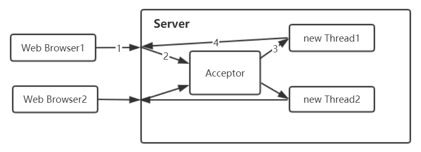
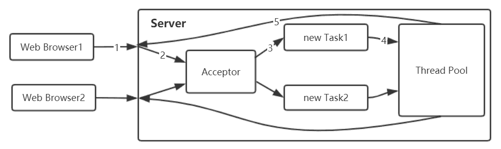
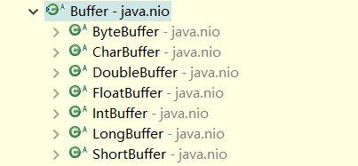
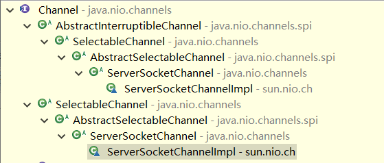
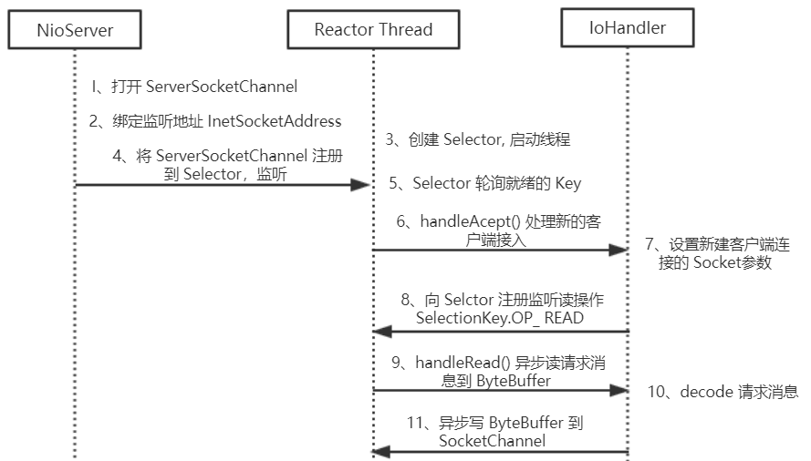
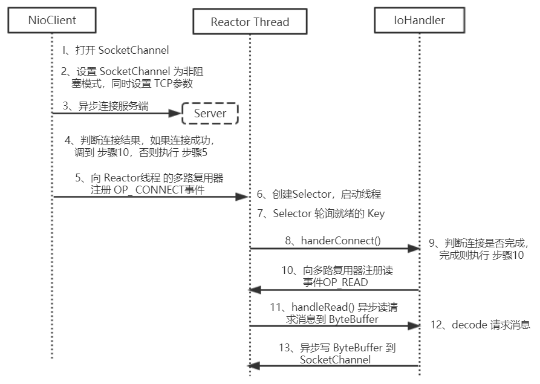
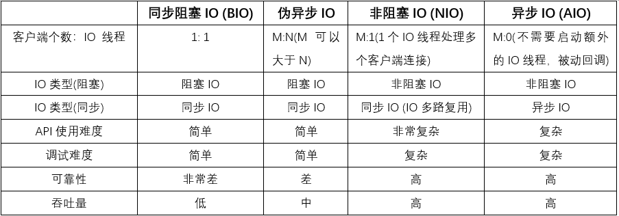

## 传统的 BIO 编程

网络编程的基本模型是 Client/Server 模型，也就是两个进程之间进行相互通信，其中服务端提供位置信息(绑定的 IP 地址和监听端口)，客户端通过连接操作向服务端监听的地址发起连接请求，通过三次握手建立连接，如果连接建立成功，双方就可以通过网络套接字(Socket) 进行通信。

在基于传统同步阻塞模型开发中，ServerSocket 负责绑定 IP 地址，启动监听端口，Socket 负责发起连接操作。连接成功之后，双方通过输入和输出流进行同步阻塞式通信。

### BIO 通信模型

通过下面的通信模型图可以发现，采用 BIO 通信模型的服务端，通常由一个独立的 Acceptor 线程 负责监听客户端的连接，它接收到客户
端连接请求之后为每个客户端创建一个新的线程进行链路处理，处理完成之后，通过输出流返回应答给客户端，线程销毁。这就是典型的 “一请求一应答” 通信模型。



该模型最大的问题就是缺乏弹性伸缩能力，当客户端并发访问量增加后，服务端的线程个数和客户端并发访问数呈 1: 1 的正比关系，由于线程是 Java 虚拟机 非常宝贵的系统资源，当线程数膨胀之后，系统的性能将急剧下降，随着并发访问量的继续增大，系统会发生线程堆栈溢出、创建新线程失败等问题，并最终导致进程宕机或者僵死，不能对外提供服务。

在高性能服务器应用领域，往往需要面向成千上万个客户端的并发连接，这种模型显然无法满足高性能、高并发接入的场景。为了改进 一线程一连接 模型，后来又演进出了一种通过线程池或者消息队列实现 1 个或者多个线程处理 N 个客户端的模型，由于它的底层通信机制依然使用 同步阻塞 IO，所以被称为 “伪异步”。

## 伪异步 IO 编程

为了解决 同步阻塞 IO 面临的一个链路需要一个线程处理的问题，后来有人对它的线程模型进行了优化，后端通过一个线程池来处理多个客户端的请求接入，形成 客户端个数 M：线程池最大线程数 N 的比例关系，其中 M 可以远远大于 N。通过线程池可以灵活地调配线程资源，设置线程的最大值，防止由于海量并发接入导致线程耗尽。

### 伪异步 IO 模型图

采用线程池和任务队列可以实现一种叫做 伪异步的 IO 通信框架，其模型图下。当有新的客户端接入时，将客户端的 Socket 封装成一个 Task 对象 (该类实现了 java.lang.Runnable 接口)，投递到后端的线程池中进行处理，JDK 的线程池维护一个消息队列和 N 个活跃线程，对消息队列中的任务进行处理。由于线程池可以设置消息队列的大小和最大线程数，因此，它的资源占用是可控的，无论多少个客户端并发访问，都不会导致资源的耗尽和宕机。



伪异步 IO 通信框架 采用了线程池实现，因此避免了为每个请求都创建一个独立线程造成的线程资源耗尽问题。但是由于它底层的通信依然采用同步阻塞模型，因此无法从根本上解决问题。

### 伪异步 IO 编程弊端分析

要对 伪异步 IO 编程 的弊端进行深入分析，首先我们看两个 Java 同步 IO 的 API 说明，随后结合代码进行详细分析。

```java
public abstract class InputStream implements Closeable {

    /**
     * Reads the next byte of data from the input stream. The value byte is
     * returned as an <code>int</code> in the range <code>0</code> to
     * <code>255</code>. If no byte is available because the end of the stream
     * has been reached, the value <code>-1</code> is returned. This method
     * blocks until input data is available, the end of the stream is detected,
     * or an exception is thrown.
     *
     * <p> A subclass must provide an implementation of this method.
     *
     * @return     the next byte of data, or <code>-1</code> if the end of the
     *             stream is reached.
     * @exception  IOException  if an I/O error occurs.
     */
    public abstract int read() throws IOException;
}
```

注意其中的一句话 **“This method blocks until input data is available, the end of the stream is detected, or an exception is thrown”**，当对 Socket 的输入流进行读取操作的时候，它会一直阻塞下去，直到发生如下三种事件。

- 有数据可读；
- 可用数据已经读取完毕；
- 发生空指针或者 IO 异常。

这意味着当对方发送请求或者应答消息比较缓慢，或者网络传输较慢时，读取输入流一方的通信线程将被长时间阻塞，如果对方要 60s 才能够将数据发送完成，读取一方的 IO 线程 也将会被同步阻塞 60s，在此期间，其他接入消息只能在消息队列中排队。

下面我们接着对输出流进行分析，还是看 JDK IO 类库 输出流的 API 文档，然后结合文档说明进行故障分析。

```java
public abstract class OutputStream implements Closeable, Flushable {

    /**
     * Writes an array of bytes. This method will block until the bytes are *actually written.
     *
     * @param      b   the data.
     * @exception  IOException  if an I/O error occurs.
     * @see        java.io.OutputStream#write(byte[], int, int)
     */
    public void write(byte b[]) throws IOException {
        write(b, 0, b.length);
    }
}
```

当调用 OutputStream 的 write()方法 写输出流的时候，它将会被阻塞，直到所有要发送的字节全部写入完毕，或者发生异常。学习过 TCP/IP 相关知识的人都知道，当消息的接收方处理缓慢的时候，将不能及时地从 TCP 缓冲区 读取数据，这将会导致发送方的 TCP window size 不断减小，直到为 0，双方处于 Keep-Alive 状态，消息发送方将不能再向 TCP 缓冲区 写入消息，这时如果采用的是 同步阻塞 IO，write 操作 将会被无限期阻塞，直到 TCP window size 大于 0 或者发生 IO 异常。

通过对输入和输出流的 API 文档 进行分析，我们了解到读和写操作都是同步阻塞的，阻塞的时间取决于对方 IO 线程 的处理速度和 网络 IO 的传输速度。本质上来讲，我们无法保证生产环境的网络状况和对方的应用程序能足够快，如果我们的应用程序依赖对方的处理速度，它的可靠性就非常差。也许在实验室进行的性能测试结果令人满意，但是一旦上线运行，面对恶劣的网络环境和良莠不齐的第三方系统，问题就会如火山一样喷发。

伪异步 IO 实际上仅仅是对之前 IO 线程模型 的一个简单优化，它无法从根本上解决 同步 IO 导致的通信线程阻塞问题。下面我们就简单分析下通信对方返回应答时间过长会引起的级联故障。

1. 服务端处理缓慢，返回应答消息耗费 60s， 平时只需要 10ms。
2. 采用伪异步 I/O 的线程正在读取故障服务节点的响应，由于读取输入流是阻塞的，它将会被同步阻塞 60s。
3. 假如所有的可用线程都被故障服务器阻塞，那后续所有的 1/O 消息都将在队列中排队。
4. 由于线程池采用阻塞队列实现，当队列积满之后，后续入队列的操作将被阻塞。
5. 由于前端只有一个 Accptor 线程接收客户端接入，它被阻塞在线程池的同步阻塞队列之后，新的客户端请求消息将被拒绝，客户端会发生大量的连接超时。
6. 由于几乎所有的连接都超时，调用者会认为系统已经崩溃，无法接收新的请求消息。

## NIO 编程

与 Socket 类 和 ServerSocket 类 相对应，NIO 也提供了 SocketChannel 和 ServerSocketChannel 两种不同的套接字通道实现。这两种新增的通道都支持阻塞和非阻塞两种模式。阻塞模式使用非常简单，但是性能和可靠性都不好，非阻塞模式则正好相反。开发人员可以根据自
己的需要来选择合适的模式。一般来说，低负载、低并发的应用程序可以选择 同步阻塞 IO，以降低编程复杂度；对于高负载、高并发的网络应用，需要使用 NIO 的非阻塞模式进行开发。

### NIO 类库简介

NIO 类库 是在 JDK 1.4 中引入的。NIO 弥补了原来 同步阻塞 IO 的不足，它在 标准 Java 代码 中提供了高速的、面向块的 IO。下面我们简单看一下 NIO 类库 及其 相关概念。

**1、缓冲区 Buffer**  
Buffer 对象 包含了一些要写入或者要读出的数据。在 NIO 类库 中加入 Buffer 对象，是其与 原 IO 类库 的一个重要区别。在面向流的 IO 中，可以将数据直接写入或者将数据直接读到 Stream 对象 中。在 NIO 库中，所有数据都是用缓冲区处理的。在读取数据时，它是直接读到缓冲区中的；在写入数据时，写入到缓冲区中。任何时候访问 NIO 中的数据，都是通过缓冲区进行操作。

缓冲区实质上是一个数组。通常它是一个字节数组（ByteBuffer），也可以使用其他种类的数组。但是一个缓冲区不仅仅是一个数组，缓冲区提供了对数据的结构化访问以及维护读写位置（limit）等信息。最常用的缓冲区是 ByteBuffer，一个 ByteBuffer 提供了一组功能用于操作 byte 数组。除了 ByteBuffer，还有其他的一些缓冲区，事实上，每一种 Java 基本类型（除了 boolean）都对应有一种与之对应的缓冲区，如：CharBuffer、IntBuffer、DoubleBuffer 等等。Buffer 组件中主要类的类图如下所示。



除了 ByteBuffer，每一个 Buffer 类 都有完全一样的操作，只是它们所处理的数据类型不一样。因为大多数 标准 IO 操作 都使用 ByteBuffer，所以它在具有一般缓冲区的操作之外还提供了一些特有的操作，以方便网络读写。

**2、通道 Channel**  
Channel 是一个通道，它就像自来水管一样，网络数据通过 Channel 读取和写入。通道与流的不同之处在于通道是双向的，可以用于读、写，或者二者同时进行；流是单向的，要么是 InputStream，要么是 OutputStream。因为 Channel 是全双工的，所以它可以比流更好地映射底层操作系统的 API。特别是在 UNIX 网络编程模型 中，底层操作系统的通道都是全双工的，同时支持读写操作。Channel 组件中 主要类的类图如下所示，从中我们可以看到最常用的 ServerSocketChannel 和 SocketChannel。



**3、多路复用器 Selector**  
多路复用器 Selector 是 Java NIO 编程 的基础，熟练地掌握 Selector 对于 NIO 编程 至关重要。多路复用器提供选择已经就绪的任务的能力。简单来讲，Selector 会不断地轮询 “注册在其上的 Channel”，如果某个 Channel 上面发生读或者写事件，这个 Channel 就处于就绪状态，会被 Selector 轮询出来，然后通过 SelectionKey 可以获取 “就绪 Channel 的集合”，进行后续的 IO 操作。

一个 多路复用器 Selector 可以同时轮询多个 Channel，由于 JDK 使用了 epoll() 代替传统的 select 的实现，所以它并没有最大连接句柄的限制。这也就意味着，只需要一个线程负责 Selector 的轮询，就可以接入成千上万的客户端。下面，我们通过 NIO 编程的序列图 和 源码分析来熟悉相关的概念。

### NIO 服务端序列图



下面，我们看一下 NIO 服务端 的主要创建过程。

1、打开 ServerSocketChannel，用于监听客户端的连接，它是所有客户端连接的
父管道，示例代码如下。

```java
    ServerSocketChannel acceptorSvr = ServerSocketChannel.open();
```

2、绑定监听端口，设置连接为非阻塞模式，示例代码如下。

```java
    acceptorSvr.socket().bind(new InetSocketAddress(InetAddress.getByName("IP"), port));
    acceptorSvr.configureBlocking(false);
```

3、创建 Reactor 线程，创建多路复用器并启动线程，示例代码如下。

```java
    Selector selector = Selector.open();
    New Thread (new ReactorTask()).start();
```

4、将 ServerSocketChannel 注册到 Reactor 线程 的 多路复用器 Selector 上，监听 ACCEPT 事件，示例代码如下。

```java
    SelectionKey key = acceptorSvr.register(selector, SelectionKey.OP_ ACCEPT, ioHandler);
```

5、多路复用器在线程 run()方法 的无限循环体内轮询 准备就绪的 Key，示例代码如下。

```java
    int num = selector.select();
    Set selectedKeys = selector.selectedKeys();
    Iterator it = selectedKeys.iterator();
    while (it.hasNext()) {
        SelectionKey key = (SelectionKey) it.next();
        // .... deal with IO event ...
```

6、多路复用器 Selector 监听到有新的客户端接入，处理新的接入请求，完成 TCP 三次握手，建立物理链路，示例代码如下。

```java
    SocketChannel channel = svrChannel.accept();
```

7、设置客户端链路为非阻塞模式，示例代码如下。

```java
    channel.configureBlocking(false);
    channel.socket().setReuseAddress(true);
    ......
```

8、将新接入的客户端连接注册到 Reactor 线程 的多路复用器上，监听读操作，读取客户端发送的网络消息，示例代码如下。

```java
    SelectionKey key = socketChannel.register(selector, SelectionKey.OP_READ, ioHandler);
```

9、异步读取客户端请求消息到缓冲区，示例代码如下。

```java
    int readNumber = channel.read(receivedBuffer);
```

10、对 ByteBuffer 进行编解码，如果有半包消息指针 reset，继续读取后续的报文，将解码成功的消息封装成 Task，投递到业务线程池中,进行业务逻辑编排，示例代码如下。

```java
    List messageList = null;
    while (byteBuffer.hasRemain()) {
        byteBuffer.mark();
        Object message = decode(byteBuffer) ;
        if (message == null) {
            byteBuffer.reset();
            break;
        }
        messageList.add(message);
    }
    if (!byteBuffer.hasRemain()) {
        byteBuffer.clear();
    } else {
        byteBuffer.compact();
    }
    if (messageList != null && !messageList.isEmpty()) {
        for (Object message : messageList) {
            handlerTask(message);
        }
    }
```

11、将 POJO 对象 encode 成 ByteBuffer，调用 SocketChannel 的 异步 write 接口，将消息异步发送给客户端，示例代码如下。

```java
    socketChannel.write(byteBuffer);
```

注意：如果发送区 TCP 缓冲区满，会导致写半包，此时，需要注册监听写操作位，循环写，直到整包消息写入 TCP 缓冲区。对于 “半包问题” 此处暂不赘述，后续会单独写一篇详细分析 Netty 的处理策略。

### NIO 客户端序列图



1、打开 SocketChannel，绑定客户端本地地址 (可选，默认系统会随机分配一个可用的本地地址)，示例代码如下。

```java
    SocketChannel clientChannel = SocketChannel.open();
```

2、设置 SocketChannel 为非阻塞模式，同时设置客户端连接的 TCP 参数，示例代码如下。

```java
    clientChannel.configureBlocking(false);
    socket.setReuseAddress(true);
    socket.setReceiveBufferSize(BUFFER_SIZE);
    socket.setSendBufferSize(BUFFER_SIZE);
```

3、异步连接服务端，示例代码如下。

```java
    boolean connected = clientChannel.connect( new InetSocketAddress("ip", port) );
```

4、判断是否连接成功，如果连接成功，则直接注册读状态位到多路复用器中，如果当前没有连接成功，则重连 (异步连接，返回 false，说明客户端已经发送 syne 包，服务端没有返回 ack 包，物理链路还没有建立)，示例代码如下。

```java
    if (connected) {
        clientChannel.register(selector, SelectionKey.OP_READ, ioHandler);
    } else {
        clientChannel.register(selector, SelectionKey.OP_CONNECT, ioHandler);
    }
```

5、向 Reactor 线程 的多路复用器注册 OP_CONNECT 状态位，监听服务端的 TCP ACK 应答，示例代码如下。

```java
    clientChannel.register(selector, SelectionKey.OP_CONNECT, ioHandler);
```

6、创建 Reactor 线程，创建多路复用器并启动线程，代码如下。

```java
    Selector selector = Selector.open();
    New Thread( new ReactorTask() ).start();
```

7、多路复用器在线程 run()方法 的无限循环体内轮询 准备就绪的 Key，代码如下。

```java
    int num = selector.select();
    Set selectedKeys = selector.selectedKeys();
    Iterator it = selectedKeys.iterator();
    while (it.hasNext()) {
        SelectionKey key = (SelectionKey) it.next();
        // ... deal with IO event ...
    }
```

8、接收 connect 事件，并进行处理，示例代码如下。

```java
    if (key.isConnectable()) {
        // handlerConnect();
    }
```

9、判断连接结果，如果连接成功，注册读事件到多路复用器，示例代码如下。

```java
    if(channel.finishConnect()) {
        registerRead();
    }
```

10、注册读事件到多路复用器，示例代码如下。

```java
    clientChannel.register(selector, SelectionKey.OP_READ, ioHandler);
```

11、异步读客户端请求消息到缓冲区，示例代码如下。

```java
    int readNumber = channel.read(receivedBuffer);
```

12、对 ByteBuffer 进行编解码，如果有半包消息接收缓冲区 Reset，继续读取后续的报文，将解码成功的消息封装成 Task，投递到业务线程池中，进行业务逻辑编排。示例代码如下。

```java
    List messageList = null;
    while (byteBuffer.hasRemain()) {
        byteBuffer.mark();
        object message = decode(byteBuffer);
        if (message == nu11) {
            byteBuffer.reset();
            break;
        }
        messageList.add(message);
    }
    if (!byteBuffer.hasRemain()) {
        byteBuffer.clear();
    } else {
        byteBuffer.compact();
    }
    if ( messageList != null && !messageList.isEmpty() )
        for (Object message : messageList) {
            handlerTask(message);
        }
    }
```

13、将 POJO 对象 encode 成 ByteBuffer，调用 SocketChannel 的 异步 write 接口，将消息异步发送给客户端。示例代码如下。

```java
    socketChannel.write(buffer);
```

## AIO 编程

NIO2.0 引入了新的异步通道的概念，并提供了异步文件通道和异步套接字通道的实现。异步通道提供以下两种方式获取获取操作结果。

- 通过 java.util.concurrent.Future 类 来表示异步操作的结果;
- 在执行异步操作的时候传入一个 java.nio.channels.CompletionHandler 接口 的实现类作为操作完成的回调。

NIO2.0 的异步套接字通道是真正的 异步非阻塞 IO，对应于 UNIX 网络编程 中的 事件驱动 IO (AIO)。它不需要通过多路复用器 (Selector) 对注册的通道进行轮询操作即可实现异步读写，从而简化了 NIO 的编程模型。

由于在实际开发中使用较少，所以这里不对 AIO 进行详细分析。

## 四种 IO 编程模型的对比

对比之前，这里再澄清一下 “伪异步 IO” 的概念。伪异步 IO 的概念完全来源于实践，并没有官方说法。在 JDK NIO 编程 没有流行之前，为了解决 Tomcat 通信线程同步 IO 导致业务线程被挂住的问题，大家想到了一个办法，在通信线程和业务线程之间做个缓冲区，这个缓冲区用于隔离 IO 线程 和业务线程间的直接访问，这样业务线程就不会被 IO 线程 阻塞。而对于后端的业务侧来说，将消息或者 Task 放到线程池后就返回了，它不再直接访问 IO 线程 或者进行 IO 读写，这样也就不会被同步阻塞。



## 选择 Netty 开发项目的理由

从可维护性角度看，由于 NIO 采用了异步非阻塞编程模型，而且是一个 IO 线程 处理多条链路，它的调试和跟踪非常麻烦，特别是生产环境中的问题，我们无法进行有效的调试和跟踪，往往只能靠一些日志来辅助分析，定位难度很大。

### 为什么不选择 Java 原生 NIO 进行开发

1. NIO 的类库和 API 使用起来非常繁杂，需要熟练掌握 Selector、ServerSocketChannel、SocketChannel、ByteBuffer 等。
2. 需要具备其他的额外技能做铺垫，例如，熟悉 Java 多线程编程。这是因为 NIO 编程 涉及到 Reactor 模式，你必须对 多线程 和 网路编程 非常熟悉，才能编写出高质量的 NIO 程序。
3. 可靠性能力补齐，工作量和难度都非常大。例如客户端面临：断连重连、网络闪断、半包读写、失败缓存、网络拥塞和异常码流的处理，等问题。
4. JDK NIO 的 BUG，例如臭名昭著的 epoll bug，它会导致 Selector 空轮询，最终导致 CPU 100%。虽然官方声称修复了该问题，但是直到 JDK 1.7 版本 该问题仍旧未得到彻底的解决。

### 为什么选择 Netty 进行开发

Netty 是业界最流行的 NIO 框架 之一，它的健壮性、功能、性能、可定制性和可扩展性在同类框架中都是首屈一指的，已经得到成百上千的商用项目验证，例如 Hadoop 的 RPC 框架 Avro ，阿里的 RPC 框架 Dubbo 就使用了 Netty 作为底层通信框架。通过对 Netty 的分析，我们将它的优点总结如下。

- API 使用简单，开发门槛低；
- 功能强大，预置了多种编解码功能，支持多种主流协议；
- 定制能力强，可以通过 ChannelHandler 对通信框架进行灵活地扩展；
- 性能高，通过与其他业界主流的 NIO 框架 对比，Netty 的综合性能最优；
- 成熟、稳定，Netty 修复了已经发现的所有 JDK NIO BUG，业务开发人员不需要再为 NIO 的 BUG 而烦恼；
- 社区活跃，版本迭代周期短，发现的 BUG 可以被及时修复，同时，更多的新功能会加入；
- 经历了大规模的商业应用考验，质量得到验证。Netty 在互联网、大数据、网络游戏、企业应用、电信软件等众多行业已经得到了成功商用，证明它已经完全能够满足不同行业的商业应用了。

正是因为这些优点，Netty 逐渐成为了 Java NIO 编程 的首选框架。
