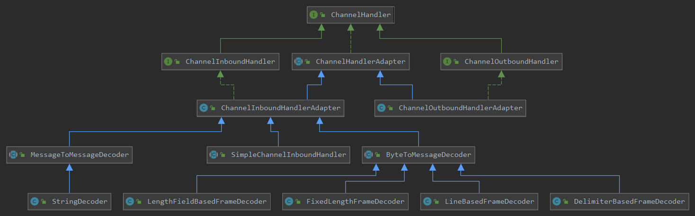

Netty 的 ChannelPipeline 和 ChannelHandler 机制类似于 Servlet 和 Filter 过滤器，这类拦截器实际上是职责链模式的一种变形，主要是为了方便事件的拦截和用户业务逻辑的定制。

Servlet Filter 能够以声明的方式（web.xml 配置文件）插入到 HTTP 请求响应的处理过程中，用于拦截请求和响应，以便能够查看、提取或以某种方式操作正在客户端和服务器之间交换的数据。拦截器封装了业务定制逻辑，能够实现对 Web 应用程序 的预处理和事后处理。

Netty 的 Channel 过滤器 实现原理与 Servlet Filter 机制 一致，它将 Channel 的数据管道 抽象为 ChannelPipeline，消息在 ChannelPipeline 中流动和传递。ChannelPipeline 持有 I/O 事件拦截器 ChannelHandler 链表，由 ChannelHandler 链表 对 IO 事件 进行拦截和处理，可以通过新增和删除 ChannelHandler 来实现不同的业务逻辑定制，不需要对已有的 ChannelHandler 进行修改，能够实现对修改封闭和对扩展的支持。

下面我们对 ChannelPipeline 和 ChannelHandler 的功能进行简单地介绍，然后分析下其源码设计。

## ChannelPipeline 的功能和作用

ChannelPipeline 是 ChannelHandler 的容器，它负责 ChannelHandler 的管理、事件拦截与调度。

#### ChannelPipeline 的事件处理

下图展示了一个消息被 ChannelPipeline 的 ChannelHandler 链拦截和处理的全过程。

```java
 *                                                 I/O Request
 *                                            via {@link Channel} or
 *                                        {@link ChannelHandlerContext}
 *                                                      |
 *  +---------------------------------------------------+---------------+
 *  |                           ChannelPipeline         |               |
 *  |                                                  \|/              |
 *  |    +---------------------+            +-----------+----------+    |
 *  |    | Inbound Handler  N  |            | Outbound Handler  1  |    |
 *  |    +----------+----------+            +-----------+----------+    |
 *  |              /|\                                  |               |
 *  |               |                                  \|/              |
 *  |    +----------+----------+            +-----------+----------+    |
 *  |    | Inbound Handler N-1 |            | Outbound Handler  2  |    |
 *  |    +----------+----------+            +-----------+----------+    |
 *  |              /|\                                  .               |
 *  |               .                                   .               |
 *  | ChannelHandlerContext.fireIN_EVT() ChannelHandlerContext.OUT_EVT()|
 *  |        [ method call]                       [method call]         |
 *  |               .                                   .               |
 *  |               .                                  \|/              |
 *  |    +----------+----------+            +-----------+----------+    |
 *  |    | Inbound Handler  2  |            | Outbound Handler M-1 |    |
 *  |    +----------+----------+            +-----------+----------+    |
 *  |              /|\                                  |               |
 *  |               |                                  \|/              |
 *  |    +----------+----------+            +-----------+----------+    |
 *  |    | Inbound Handler  1  |            | Outbound Handler  M  |    |
 *  |    +----------+----------+            +-----------+----------+    |
 *  |              /|\                                  |               |
 *  +---------------+-----------------------------------+---------------+
 *                  |                                  \|/
 *  +---------------+-----------------------------------+---------------+
 *  |               |                                   |               |
 *  |       [ Socket.read() ]                    [ Socket.write() ]     |
 *  |                                                                   |
 *  |  Netty Internal I/O Threads (Transport Implementation)            |
 *  +-------------------------------------------------------------------+
```

从上图可以看出 消息读取和发送处理全流程为：

1. 底层的 SocketChannel.read()方法 读取 ByteBuf，触发 ChannelRead 事件，由 IO 线程 NioEventLoop 调用 ChannelPipeline 的 fireChannelRead(Object msg)方法，将消息传输到 ChannelPipeline 中。
2. 消息依次被 HeadHandler、ChannelHandler1、ChannelHandler2 … TailHandler 拦截和处理，在这个过程中，任何 ChannelHandler 都可以中断当前的流程，结束消息的传递。
3. 调用 ChannelHandlerContext 的 write 方法 发送消息，消息从 TailHandler 开始途经 ChannelHandlerN … ChannelHandler1、HeadHandler，最终被添加到消息发送缓冲区中等待刷新和发送，在此过程中也可以中断消息的传递，例如当编码失败时，就需要中断流程，构造异常的 Future 返回。

Netty 中的事件分为 Inbound 事件 和 Outbound 事件。Inbound 事件 通常由 I/O 线程 触发，例如 TCP 链路建立事件、链路关闭事件、读事件、异常通知事件等，它对应上图的左半部分。触发 Inbound 事件 的方法如下。

1. ChannelHandlerContext.fireChannelRegistered()：Channel 注册事件；
2. ChannelHandlerContext.fireChannelActive()：TCP 链路建立成功，Channel 激活事件；
3. ChannelHandlerContext.fireChannelRead(Object)：读事件；
4. ChannelHandlerContext.fireChannelReadComplete()：读操作完成通知事件；
5. ChannelHandlerContext.fireExceptionCaught(Throwable)：异常通知事件；
6. ChannelHandlerContext.fireUserEventTriggered(Object)：用户自定义事件；
7. ChannelHandlerContext.fireChannelWritabilityChanged()：Channel 的可写状态变化；
8. ChannelHandlerContext.fireChannellnactive()：TCP 连接关闭，链路不可用通知事件。

Outbound 事件 通常是由用户主动发起的 网络 IO 操作，例如用户发起的连接操作、绑定操作、消息发送等操作，它对应上图的右半部分。触发 Outbound 事件 的方法如下：

1. ChannelHandlerContext.bind(SocketAddress, ChannelPromise)：绑定本地地址事件；
2. ChannelHandlerContext.connect(SocketAddress, SocketAddress, ChannelPromise)：连接服务端事件；
3. ChannelHandlerContext.write(Object, ChannelPromise)：发送事件；
4. ChannelHandlerContext.flush()：刷新事件；
5. ChannelHandlerContext.read()：读事件；
6. ChannelHandlerContext.disconnect(ChannelPromise)：断开连接事件；
7. ChannelHandlerContext.close(ChannelPromise)：关闭当前 Channel 事件。

#### ChannelPipeline 自定义拦截器

ChannelPipeline 通过 ChannelHandler 来实现事件的拦截和处理，由于 ChannelHandler 中的事件种类繁多，不同的 ChannelHandler 可能只需要关心其中的个别事件，所以，自定义的 ChannelHandler 只需要继承 ChannelInboundHandlerAdapter / ChannelOutboundHandlerAdapter，覆盖自己关心的方法即可。

下面的两个示例分别展示了：拦截 Channel Active 事件，打印 TCP 链路建立成功日志，和 链路关闭的时候释放资源，代码如下。

```java
public class MyInboundHandler extends ChannelInboundHandlerAdapter {
	@Override
	public void channelActive(ChannelHandlerContext context) {
		System.out.println("欢迎来到，LPL！");
		context.fireChannelActive();
	}
}

public class MyOutboundHandler extends ChannelOutboundHandlerAdapter {
	@Override
	public void close(ChannelHandlerContext ctx, ChannelPromise promise) throws Exception {
		System.out.println("游戏结束...");
		ctx.close();
	}
}
```

#### 构建 pipeline

使用 Netty 时，用户不需要自己创建 pipeline，因为使用 ServerBootstrap 或者 Bootstrap 进行配置后，Netty 会为每个 Channel 连接 创建一个独立的 pipeline。我们只需将自定义的 ChannelHandler 加入到 pipeline 即可。相关代码如下。

```java
ServerBootstrap server = new ServerBootstrap();
server.childHandler(new ChannelInitializer<SocketChannel>() {
    @Override
    public void initChannel(SocketChannel ch) throws Exception {
		ChannelPipeline pipeline = ch.pipeline();
    	/** 解析自定义协议 */
    	pipeline.addLast(new MyDecoder());
    	pipeline.addLast(new MyEncoder());
    	pipeline.addLast(new SocketHandler());
    	/** 解析Http请求 */
		pipeline.addLast(new HttpServerCodec());
		//主要是将同一个http请求或响应的多个消息对象变成一个 fullHttpRequest完整的消息对象
		pipeline.addLast(new HttpObjectAggregator(64 * 1024));
		//主要用于处理大数据流,比如一个1G大小的文件如果你直接传输肯定会撑暴jvm内存的 ,加上这个handler我们就不用考虑这个问题了
		pipeline.addLast(new ChunkedWriteHandler());
    }
});
```

对于类似编解码这样的 ChannelHandler，它存在先后顺序，例如 MessageToMessageDecoder，在它之前往往需要有 ByteToMessageDecoder 将 ByteBuf 解码为对象，然后将对象做二次解码 得到最终的 POJO 对象。pipeline 支持指定位置添加或者删除 ChannelHandler。

#### ChannelPipeline 的主要特性

ChannelPipeline 支持运行时动态的添加或者删除 ChannelHandler，在某些场景下这个特性非常实用。例如当业务高峰期需要对系统做拥塞保护时，就可以根据当前的系统时间进行判断，如果处于业务高峰期，则动态地将 系统拥塞保护 ChannelHandler 添加到当前的 ChannelPipeline 中，当高峰期过去之后，再动态删除 拥塞保护 ChannelHandler。

ChannelPipeline 是线程安全的，这意味着 N 个业务线程可以并发地操作 ChannelPipeline 而不存在多线程并发问题。但 ChannelHandler 不是线程安全的，这意味着 我们需要自己保证 ChannelHandler 的线程安全。

## ChannelPipeline 源码解析

ChannelPipeline 的代码比较简单，它实际上是一个 ChannelHandler 容器，内部维护了一个 ChannelHandler 的链表和迭代器，可以方便地进行 ChannelHandler 的 CRUD。

另外一个比较重要的部分是，当发生某个 I/O 事件 时，如 链路建立、链路关闭、读写操作 等，都会产一个事件，事件在 pipeline 中传播和处理，它是事件处理的总入口。由于 网络 I/O 相关的事件有限，因此 Netty 对这些事件进行了统一抽象，Netty 提供的 和用户自定义的 ChannelHandler 会对感兴趣的事件进行拦截和处理。

pipeline 中以 fireXXX 命名的方法都是从 I/O 线程 流向 用户业务 Handler 的 inbound 事件，它们的实现因功能而异，但是处理步骤类似，都是 调用 HeadHandler 对应的 fireXXX 方法，然后执行事件相关的逻辑操作。

```java
public interface ChannelPipeline
        extends ChannelInboundInvoker, ChannelOutboundInvoker, Iterable<Entry<String, ChannelHandler>> {

    /**
     * 管理 ChannelHandler 的api
     */
    ChannelPipeline addFirst(String name, ChannelHandler handler);

    ChannelPipeline addFirst(EventExecutorGroup group, String name, ChannelHandler handler);

    ChannelPipeline addLast(String name, ChannelHandler handler);

    ChannelPipeline addLast(EventExecutorGroup group, String name, ChannelHandler handler);

    ChannelPipeline addBefore(String baseName, String name, ChannelHandler handler);

    ChannelPipeline addBefore(EventExecutorGroup group, String baseName, String name, ChannelHandler handler);

    ChannelPipeline addAfter(String baseName, String name, ChannelHandler handler);

    ChannelPipeline addAfter(EventExecutorGroup group, String baseName, String name, ChannelHandler handler);

    ChannelPipeline addFirst(ChannelHandler... handlers);

    ChannelPipeline addFirst(EventExecutorGroup group, ChannelHandler... handlers);

    ChannelPipeline addLast(ChannelHandler... handlers);

    ChannelPipeline addLast(EventExecutorGroup group, ChannelHandler... handlers);

    ChannelPipeline remove(ChannelHandler handler);

    ChannelHandler remove(String name);

    <T extends ChannelHandler> T remove(Class<T> handlerType);

    ChannelHandler removeFirst();

    ChannelHandler removeLast();

    ChannelPipeline replace(ChannelHandler oldHandler, String newName, ChannelHandler newHandler);

    ChannelHandler replace(String oldName, String newName, ChannelHandler newHandler);

    <T extends ChannelHandler> T replace(Class<T> oldHandlerType, String newName, ChannelHandler newHandler);

    ChannelHandler first();

    ChannelHandler last();

    ChannelHandler get(String name);

    <T extends ChannelHandler> T get(Class<T> handlerType);

    /**
     * 处理 I/O事件 的api
     */
    @Override
    ChannelPipeline fireChannelRegistered();

    @Override
    ChannelPipeline fireChannelUnregistered();

    @Override
    ChannelPipeline fireChannelActive();

    @Override
    ChannelPipeline fireChannelInactive();

    @Override
    ChannelPipeline fireExceptionCaught(Throwable cause);

    @Override
    ChannelPipeline fireUserEventTriggered(Object event);

    @Override
    ChannelPipeline fireChannelRead(Object msg);

    @Override
    ChannelPipeline fireChannelReadComplete();

    @Override
    ChannelPipeline fireChannelWritabilityChanged();

    @Override
    ChannelPipeline flush();
}
```

## ChannelHandler 的功能和作用

ChannelHandler 负责对 I/O 事件 进行拦截处理，它可以选择性地 拦截处理感兴趣的事件，也可以透传和终止事件的传递。基于 ChannelHandler 接口，我们可以方便地进行业务逻辑定制，如 打印日志、统一封装异常信息、性能统计和消息编解码等。

#### ChannelHandlerAdapter

大部分 ChannelHandler 都会选择性 拦截处理感兴趣的 I/O 事件，忽略其他事件，然后交由下一个 ChannelHandler 进行拦截处理。这会导致一个问题：自定义 ChannelHandler 必须要实现 ChannelHandler 的所有接口，包括它不关心的那些事件处理接口，这会导致用户代码的冗余和臃肿，代码的可维护性也会变差。

为了解决这个问题，Netty 提供了 ChannelHandlerAdapter 基类，和 ChannelInboundHandlerAdapter / ChannelOutboundHandlerAdapter 两个实现类，如果 自定义 ChannelHandler 关心某个事件，只需要继承 ChannelInboundHandlerAdapter / ChannelOutboundHandlerAdapter 覆盖对应的方法即可，对于不关心的，可以直接继承使用父类的方法，这样子类的代码就会非常简洁清晰。

## ChannelHandler 组件 的类结构

相对于 ByteBuf 和 Channel，ChannelHandler 的类继承关系稍微简单些，但是它的子类非常多，功能各异，主要可以分为如下四类。

1. ChannelPipeline 的系统 ChannelHandler，用于 I/O 操作 和对事件进行预处理，对用户不可见，这类 ChannelHandler 主要包括 HeadHandler 和 TailHandler；
2. 编解码 ChannelHandler，如 MessageToMessageEncoder、MessageToMessageDecoder、MessageToMessageCodec；
3. 其他系统功能性 ChannelHandler，如 流量整型 Handler、读写超时 Handler、日志 Handler 等；
4. 自定义 ChannelHandler。

ChannelHandler 组件 的核心类及常用类的类图如下。


