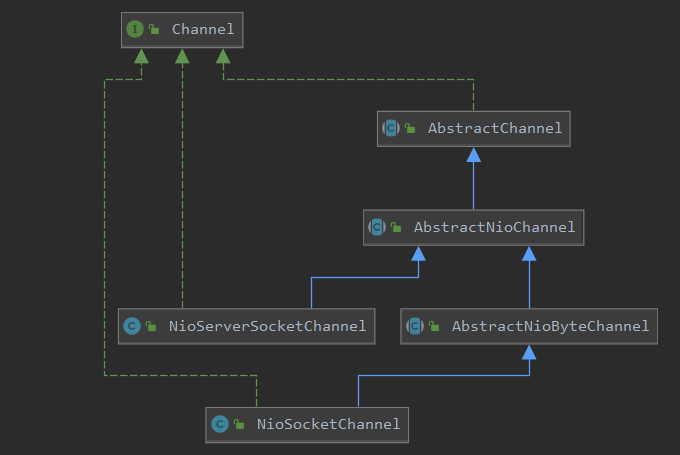

类似于 java.nio 包 的 Channel，Netty 提供了自己的 Channel 和其子类实现，用于异步 I/O 操作 等。Unsafe 是 Channel 的内部接口，聚合在 Channel 中协助进行网络读写相关的操作，因为它的设计初衷就是 Channel 的内部辅助类，不应该被 Netty 框架 的上层使用者调用，所以被命名为 Unsafe。

## Channel 组件

Netty 的 **Channel 组件 是 Netty 对网络操作的封装**，**如 网络数据的读写，与客户端建立连接**，主动关闭连接 等，也包含了 Netty 框架 相关的一些功能，如 获取该 Chanel 的 **EventLoop、ChannelPipeline** 等。另外，Netty 并没有直接使用 java.nio 包 的 SocketChannel 和 ServerSocketChannel，而是**使用 NioSocketChannel 和 NioServerSocketChannel 对其进行了进一步的封装**。下面我们先从 Channel 接口 的 API 开始分析，然后看一下其重要子类的源码实现。

为了便于后面的阅读源码，我们先看下 NioSocketChannel 和 NioServerSocketChannel 的继承关系类图。


#### Channel 接口

```java
public interface Channel extends AttributeMap, ChannelOutboundInvoker, Comparable<Channel> {

    /**
     * Channel 需要注册到 EventLoop 的多路复用器上，用于处理 I/O事件，
     * EventLoop 实际上就是处理网络读写事件的 Reactor线程。
     */
    EventLoop eventLoop();

    /**
     * ChannelMetadata 封装了 TCP参数配置
     */
    ChannelMetadata metadata();

    /**
     * 对于服务端Channel而言，它的父Channel为空；
     * 对于客户端Channel，它的 父Channel 就是创建它的 ServerSocketChannel
     */
    Channel parent();

    /**
     * 每个 Channel 都有一个全局唯一标识
     */
    ChannelId id();

    /**
     * 获取当前 Channel 的配置信息，如 CONNECT_TIMEOUT_MILLIS
     */
    ChannelConfig config();

    /**
     * 当前 Channel 是否已经打开
     */
    boolean isOpen();

    /**
     * 当前 Channel 是否已注册进 EventLoop
     */
    boolean isRegistered();

    /**
     * 当前 Channel 是否已激活
     */
    boolean isActive();

    /**
     * 当前 Channel 的本地绑定地址
     */
    SocketAddress localAddress();

    /**
     * 当前 Channel 的远程绑定地址
     */
    SocketAddress remoteAddress();

    /**
     * 当前 Channel 是否可写
     */
    boolean isWritable();

    /**
     * 当前 Channel 内部的 Unsafe对象
     */
    Unsafe unsafe();

    /**
     * 当前 Channel 持有的 ChannelPipeline
     */
    ChannelPipeline pipeline();

	/**
	 * 从当前 Channel 中读取数据到第一个 inbound缓冲区 中，如果数据被成功读取，
	 * 触发ChannelHandler.channelRead(ChannelHandlerContext,Object)事件。
	 * 读取操作API调用完成之后，紧接着会触发ChannelHandler.channelReadComplete(ChannelHandlerContext)事件，
	 * 这样业务的ChannelHandler可以决定是否需要继续读取数据。如果己经有读操作请求被挂起，则后续的读操作会被忽略。
	 */
    @Override
    Channel read();

    /**
     * 将之前写入到发送环形数组中的消息全部写入到目标Chanel中，发送给通信对方
     */
    @Override
    Channel flush();
}
```

#### AbstractChannel

```java
public abstract class AbstractChannel extends DefaultAttributeMap implements Channel {

	// 父Channel
    private final Channel parent;
    // Channel的全局唯一标识
    private final ChannelId id;
    // 内部辅助类 Unsafe
    private final Unsafe unsafe;
    // Netty 会为每一个 channel 创建一个 pipeline
    private final DefaultChannelPipeline pipeline;

	// 本地地址
    private volatile SocketAddress localAddress;
    // 远程主机地址
    private volatile SocketAddress remoteAddress;
    // 注册到了哪个 EventLoop 上
    private volatile EventLoop eventLoop;
    // 是否已注册
    private volatile boolean registered;

	/**
	 * channnel 会将 网络IO操作 触发到 ChannelPipeline 对应的事件方法。
	 * Netty 基于事件驱动，我们也可以理解为当 Chnanel 进行 IO操作 时会产生对应的IO 事件，
	 * 然后驱动事件在 ChannelPipeline 中传播，由对应的 ChannelHandler 对事件进行拦截和处理，
	 * 不关心的事件可以直接忽略
	 */
    @Override
    public ChannelFuture bind(SocketAddress localAddress) {
        return pipeline.bind(localAddress);
    }

    @Override
    public ChannelFuture bind(SocketAddress localAddress, ChannelPromise promise) {
        return pipeline.bind(localAddress, promise);
    }

    @Override
    public ChannelFuture connect(SocketAddress remoteAddress) {
        return pipeline.connect(remoteAddress);
    }

    @Override
    public ChannelFuture connect(SocketAddress remoteAddress, SocketAddress localAddress) {
        return pipeline.connect(remoteAddress, localAddress);
    }

    @Override
    public ChannelFuture connect(SocketAddress remoteAddress, ChannelPromise promise) {
        return pipeline.connect(remoteAddress, promise);
    }

    @Override
    public ChannelFuture connect(SocketAddress remoteAddress, SocketAddress localAddress, ChannelPromise promise) {
        return pipeline.connect(remoteAddress, localAddress, promise);
    }

    @Override
    public ChannelFuture disconnect() {
        return pipeline.disconnect();
    }

    @Override
    public ChannelFuture disconnect(ChannelPromise promise) {
        return pipeline.disconnect(promise);
    }

    @Override
    public ChannelFuture close() {
        return pipeline.close();
    }

    @Override
    public ChannelFuture close(ChannelPromise promise) {
        return pipeline.close(promise);
    }

    @Override
    public ChannelFuture deregister() {
        return pipeline.deregister();
    }

    @Override
    public ChannelFuture deregister(ChannelPromise promise) {
        return pipeline.deregister(promise);
    }

    @Override
    public Channel flush() {
        pipeline.flush();
        return this;
    }

    @Override
    public Channel read() {
        pipeline.read();
        return this;
    }

    @Override
    public ChannelFuture write(Object msg) {
        return pipeline.write(msg);
    }

    @Override
    public ChannelFuture write(Object msg, ChannelPromise promise) {
        return pipeline.write(msg, promise);
    }

    @Override
    public ChannelFuture writeAndFlush(Object msg) {
        return pipeline.writeAndFlush(msg);
    }

    @Override
    public ChannelFuture writeAndFlush(Object msg, ChannelPromise promise) {
        return pipeline.writeAndFlush(msg, promise);
    }
}
```

#### AbstractNioChannel

```java
public abstract class AbstractNioChannel extends AbstractChannel {

	// AbstractNioChannel 是 NioSocketChannel和NioServerSocketChannel 的公共父类，所以定义
	// 了一个 java.nio 的 SocketChannel 和 ServerSocketChannel 的公共父类 SelectableChannel，
	// 用于设置 SelectableChannel参数 和进行 IO操作
    private final SelectableChannel ch;
    // 它代表了 JDK 的 SelectionKey.OP_READ
    protected final int readInterestOp;
    // 该 SelectionKey 是 Channel 注册到 EventLoop 后返回的，
    // 由于 Channel 会面临多个业务线程的并发写操作，当 SelectionKey 被修改了，
    // 需要让其他业务线程感知到变化，所以使用volatile保证修改的可见性
    volatile SelectionKey selectionKey;

    /**
     * Channel 的注册
     */
    @Override
    protected void doRegister() throws Exception {
        boolean selected = false;
        for (;;) {
            try {
                selectionKey = javaChannel().register(eventLoop().unwrappedSelector(), 0, this);
                return;
            } catch (CancelledKeyException e) {
                if (!selected) {
                    // Force the Selector to select now as the "canceled" SelectionKey may still be
                    // cached and not removed because no Select.select(..) operation was called yet.
                    eventLoop().selectNow();
                    selected = true;
                } else {
                    // We forced a select operation on the selector before but the SelectionKey is still cached
                    // for whatever reason. JDK bug ?
                    throw e;
                }
            }
        }
    }

    protected SelectableChannel javaChannel() {
        return ch;
    }

    @Override
    protected void doBeginRead() throws Exception {
        // Channel.read() 或 ChannelHandlerContext.read() 被调用
        final SelectionKey selectionKey = this.selectionKey;
        if (!selectionKey.isValid()) {
            return;
        }

        readPending = true;

        final int interestOps = selectionKey.interestOps();
        if ((interestOps & readInterestOp) == 0) {
            selectionKey.interestOps(interestOps | readInterestOp);
        }
    }
}
```

#### NioServerSocketChannel

```java
public class NioServerSocketChannel extends AbstractNioMessageChannel
                             implements io.netty.channel.socket.ServerSocketChannel {

    // java.nio 包的内容，用于获取 java.nio.channels.ServerSocketChannel 实例
    private static final SelectorProvider DEFAULT_SELECTOR_PROVIDER = SelectorProvider.provider();

    private static ServerSocketChannel newSocket(SelectorProvider provider) {
        try {
            /**
             * 获取的是 java.nio.channels.ServerSocketChannel 实例
             */
            return provider.openServerSocketChannel();
        } catch (IOException e) {
            throw new ChannelException("Failed to open a server socket.", e);
        }
    }

    /**
     * Create a new instance
     */
    public NioServerSocketChannel() {
        this(newSocket(DEFAULT_SELECTOR_PROVIDER));
    }

    /**
     * 在父类中完成了 非阻塞IO的配置，及事件的注册
     */
    public NioServerSocketChannel(ServerSocketChannel channel) {
        super(null, channel, SelectionKey.OP_ACCEPT);
        config = new NioServerSocketChannelConfig(this, javaChannel().socket());
    }

    /**
     * 对 NioServerSocketChannel 来说，它的读取操作就是接收客户端的连接，创建 NioSocketChannel对象
     */
    @Override
    protected int doReadMessages(List<Object> buf) throws Exception {
        // 首先通过 ServerSocketChannel 的 accept()方法 接收新的客户端连接，
        // 获取 java.nio.channels.SocketChannel 对象
        SocketChannel ch = SocketUtils.accept(javaChannel());

        try {
            // 如果获取到客户端连接对象 SocketChannel，则利用当前的 NioServerSocketChannel、EventLoop
            // 和 SocketChannel 创建新的 NioSocketChannel，并添加到 buf 中
            if (ch != null) {
                buf.add(new NioSocketChannel(this, ch));
                return 1;
            }
        } catch (Throwable t) {
            logger.warn("Failed to create a new channel from an accepted socket.", t);

            try {
                ch.close();
            } catch (Throwable t2) {
                logger.warn("Failed to close a socket.", t2);
            }
        }

        return 0;
    }
}
```

#### NioSocketChannel

```java
public class NioSocketChannel extends AbstractNioByteChannel implements io.netty.channel.socket.SocketChannel {

    // 与 NioServerSocketChannel 一样，也依赖了 java.nio包 的API
    private static final SelectorProvider DEFAULT_SELECTOR_PROVIDER = SelectorProvider.provider();

    /**
     * 从这里可以看出，NioSocketChannel 对 java.nio.channels.SocketChannel 做了进一步封装
     * 使其 适用于 Netty框架
     */
    private static SocketChannel newSocket(SelectorProvider provider) {
        try {
            return provider.openSocketChannel();
        } catch (IOException e) {
            throw new ChannelException("Failed to open a socket.", e);
        }
    }

    /**
     * Create a new instance
     */
    public NioSocketChannel() {
        this(DEFAULT_SELECTOR_PROVIDER);
    }

    public NioSocketChannel(SelectorProvider provider) {
        this(newSocket(provider));
    }

    public NioSocketChannel(SocketChannel socket) {
        this(null, socket);
    }

    public NioSocketChannel(Channel parent, SocketChannel socket) {
        // 在父类中完成 非阻塞IO的配置，注册事件
        super(parent, socket);
        config = new NioSocketChannelConfig(this, socket.socket());
    }

    @Override
    protected SocketChannel javaChannel() {
        return (SocketChannel) super.javaChannel();
    }

    @Override
    public boolean isActive() {
        SocketChannel ch = javaChannel();
        return ch.isOpen() && ch.isConnected();
    }

    /**
     * 与远程服务器建立连接
     */
    @Override
    protected boolean doConnect(SocketAddress remoteAddress, SocketAddress localAddress) throws Exception {
        if (localAddress != null) {
            doBind0(localAddress);
        }

        boolean success = false;
        try {
            // 根据远程地址建立TCP连接，对连接结果进行判断
            boolean connected = SocketUtils.connect(javaChannel(), remoteAddress);
            if (!connected) {
                selectionKey().interestOps(SelectionKey.OP_CONNECT);
            }
            success = true;
            return connected;
        } finally {
            if (!success) {
                doClose();
            }
        }
    }

    /**
     * 关闭 Channel
     */
    @Override
    protected void doClose() throws Exception {
        super.doClose();
        javaChannel().close();
    }

    /**
     * 从 Channel 中读取数据
     */
    @Override
    protected int doReadBytes(ByteBuf byteBuf) throws Exception {
        final RecvByteBufAllocator.Handle allocHandle = unsafe().recvBufAllocHandle();
        allocHandle.attemptedBytesRead(byteBuf.writableBytes());
        return byteBuf.writeBytes(javaChannel(), allocHandle.attemptedBytesRead());
    }

    @Override
    protected int doWriteBytes(ByteBuf buf) throws Exception {
        final int expectedWrittenBytes = buf.readableBytes();
        return buf.readBytes(javaChannel(), expectedWrittenBytes);
    }

    /**
     * 向 Channel 中写数据
     */
    @Override
    protected void doWrite(ChannelOutboundBuffer in) throws Exception {
        SocketChannel ch = javaChannel();
        int writeSpinCount = config().getWriteSpinCount();
        do {
            if (in.isEmpty()) {
                // All written so clear OP_WRITE
                clearOpWrite();
                // Directly return here so incompleteWrite(...) is not called.
                return;
            }

            // Ensure the pending writes are made of ByteBufs only.
            int maxBytesPerGatheringWrite = ((NioSocketChannelConfig) config).getMaxBytesPerGatheringWrite();
            ByteBuffer[] nioBuffers = in.nioBuffers(1024, maxBytesPerGatheringWrite);
            int nioBufferCnt = in.nioBufferCount();

            // Always us nioBuffers() to workaround data-corruption.
            // See https://github.com/netty/netty/issues/2761
            switch (nioBufferCnt) {
                case 0:
                    // We have something else beside ByteBuffers to write so fallback to normal writes.
                    writeSpinCount -= doWrite0(in);
                    break;
                case 1: {
                    // Only one ByteBuf so use non-gathering write
                    // Zero length buffers are not added to nioBuffers by ChannelOutboundBuffer, so there is no need
                    // to check if the total size of all the buffers is non-zero.
                    ByteBuffer buffer = nioBuffers[0];
                    int attemptedBytes = buffer.remaining();
                    final int localWrittenBytes = ch.write(buffer);
                    if (localWrittenBytes <= 0) {
                        incompleteWrite(true);
                        return;
                    }
                    adjustMaxBytesPerGatheringWrite(attemptedBytes, localWrittenBytes, maxBytesPerGatheringWrite);
                    in.removeBytes(localWrittenBytes);
                    --writeSpinCount;
                    break;
                }
                default: {
                    // Zero length buffers are not added to nioBuffers by ChannelOutboundBuffer, so there is no need
                    // to check if the total size of all the buffers is non-zero.
                    // We limit the max amount to int above so cast is safe
                    long attemptedBytes = in.nioBufferSize();
                    final long localWrittenBytes = ch.write(nioBuffers, 0, nioBufferCnt);
                    if (localWrittenBytes <= 0) {
                        incompleteWrite(true);
                        return;
                    }
                    // Casting to int is safe because we limit the total amount of data in the nioBuffers to int above.
                    adjustMaxBytesPerGatheringWrite((int) attemptedBytes, (int) localWrittenBytes,
                            maxBytesPerGatheringWrite);
                    in.removeBytes(localWrittenBytes);
                    --writeSpinCount;
                    break;
                }
            }
        } while (writeSpinCount > 0);

        incompleteWrite(writeSpinCount < 0);
    }
}
```

## Unsafe 功能简介

Unsafe 接口 实际上是 **Channel 接口 的辅助接口**，它不应该被用户代码直接调用。**实际的 IO 读写操作 都是由 Unsafe 接口 负责完成的**。

```java
public interface Channel extends AttributeMap, ChannelOutboundInvoker, Comparable<Channel> {

    interface Unsafe {

        /**
         * 返回绑定的 本地地址
         */
        SocketAddress localAddress();

        /**
         * 返回绑定的 远程地址
         */
        SocketAddress remoteAddress();

        /**
         * 将 Channel 注册到 EventLoop 上
         */
        void register(EventLoop eventLoop, ChannelPromise promise);

        /**
         * 绑定 本地地址 到 Channel 上
         */
        void bind(SocketAddress localAddress, ChannelPromise promise);

        /**
         * 连接到远程服务器
         */
        void connect(SocketAddress remoteAddress, SocketAddress localAddress, ChannelPromise promise);

        /**
         * 断开连接
         */
        void disconnect(ChannelPromise promise);

        /**
         * 关闭 Channel
         */
        void close(ChannelPromise promise);

        /**
         * 读就绪 网络事件
         */
        void beginRead();

        /**
         * 发送数据
         */
        void write(Object msg, ChannelPromise promise);

        /**
         * 将缓冲区的数据 刷到 Channel
         */
        void flush();
    }
}
```

#### AbstractUnsafe

```java
public abstract class AbstractChannel extends DefaultAttributeMap implements Channel {

    protected abstract class AbstractUnsafe implements Unsafe {
        /**
         * 将当前 Unsafe 对应的 Channel 注册到 EventLoop 的多路复用器上，
         * 然后调用 DefaultChannelPipeline 的 fireChannelRegistered()方法，
         * 如果 Channel 被激活 则调用 DefaultChannelPipeline 的 fireChannelActive()方法
         */
        @Override
        public final void register(EventLoop eventLoop, final ChannelPromise promise) {
            if (eventLoop == null) {
                throw new NullPointerException("eventLoop");
            }
            if (isRegistered()) {
                promise.setFailure(new IllegalStateException("registered to an event loop already"));
                return;
            }
            if (!isCompatible(eventLoop)) {
                promise.setFailure(
                        new IllegalStateException("incompatible event loop type: " + eventLoop.getClass().getName()));
                return;
            }

            AbstractChannel.this.eventLoop = eventLoop;

            if (eventLoop.inEventLoop()) {
                register0(promise);
            } else {
                try {
                    eventLoop.execute(new Runnable() {
                        @Override
                        public void run() {
                            register0(promise);
                        }
                    });
                } catch (Throwable t) {
                    logger.warn(
                            "Force-closing a channel whose registration task was not accepted by an event loop: {}",
                            AbstractChannel.this, t);
                    closeForcibly();
                    closeFuture.setClosed();
                    safeSetFailure(promise, t);
                }
            }
        }

        private void register0(ChannelPromise promise) {
            try {
                // check if the channel is still open as it could be closed in the mean time when the register
                // call was outside of the eventLoop
                if (!promise.setUncancellable() || !ensureOpen(promise)) {
                    return;
                }
                boolean firstRegistration = neverRegistered;
                doRegister();
                neverRegistered = false;
                registered = true;

                // Ensure we call handlerAdded(...) before we actually notify the promise. This is needed as the
                // user may already fire events through the pipeline in the ChannelFutureListener.
                pipeline.invokeHandlerAddedIfNeeded();

                safeSetSuccess(promise);
                pipeline.fireChannelRegistered();
                // Only fire a channelActive if the channel has never been registered. This prevents firing
                // multiple channel actives if the channel is deregistered and re-registered.
                if (isActive()) {
                    if (firstRegistration) {
                        pipeline.fireChannelActive();
                    } else if (config().isAutoRead()) {
                        // This channel was registered before and autoRead() is set. This means we need to begin read
                        // again so that we process inbound data.
                        //
                        // See https://github.com/netty/netty/issues/4805
                        beginRead();
                    }
                }
            } catch (Throwable t) {
                // Close the channel directly to avoid FD leak.
                closeForcibly();
                closeFuture.setClosed();
                safeSetFailure(promise, t);
            }
        }

        /**
         * 绑定指定的端口，对于服务端 用于绑定监听端口，
         * 对于客户端，主要用于指定 客户端Channel 的本地绑定Socket地址。
         */
        @Override
        public final void bind(final SocketAddress localAddress, final ChannelPromise promise) {
            assertEventLoop();

            if (!promise.setUncancellable() || !ensureOpen(promise)) {
                return;
            }

            // See: https://github.com/netty/netty/issues/576
            if (Boolean.TRUE.equals(config().getOption(ChannelOption.SO_BROADCAST)) &&
                localAddress instanceof InetSocketAddress &&
                !((InetSocketAddress) localAddress).getAddress().isAnyLocalAddress() &&
                !PlatformDependent.isWindows() && !PlatformDependent.maybeSuperUser()) {
                // Warn a user about the fact that a non-root user can't receive a
                // broadcast packet on *nix if the socket is bound on non-wildcard address.
                logger.warn(
                        "A non-root user can't receive a broadcast packet if the socket " +
                        "is not bound to a wildcard address; binding to a non-wildcard " +
                        "address (" + localAddress + ") anyway as requested.");
            }

            boolean wasActive = isActive();
            try {
                doBind(localAddress);
            } catch (Throwable t) {
                safeSetFailure(promise, t);
                closeIfClosed();
                return;
            }

            if (!wasActive && isActive()) {
                invokeLater(new Runnable() {
                    @Override
                    public void run() {
                        pipeline.fireChannelActive();
                    }
                });
            }

            safeSetSuccess(promise);
        }

        /**
         * 客户端 或 服务端，主动关闭连接
         */
        @Override
        public final void disconnect(final ChannelPromise promise) {
            assertEventLoop();

            if (!promise.setUncancellable()) {
                return;
            }

            boolean wasActive = isActive();
            try {
                doDisconnect();
            } catch (Throwable t) {
                safeSetFailure(promise, t);
                closeIfClosed();
                return;
            }

            if (wasActive && !isActive()) {
                invokeLater(new Runnable() {
                    @Override
                    public void run() {
                        pipeline.fireChannelInactive();
                    }
                });
            }

            safeSetSuccess(promise);
            closeIfClosed(); // doDisconnect() might have closed the channel
        }

        /**
         * 在链路关闭之前需要首先判断是否处于刷新状态，如果处于刷新状态说明还有消息尚
         * 未发送出去，需要等到所有消息发送完成再关闭链路，因此，将关闭操作封装成Runnable稍后再执行
         */
        @Override
        public final void close(final ChannelPromise promise) {
            assertEventLoop();

            close(promise, CLOSE_CLOSED_CHANNEL_EXCEPTION, CLOSE_CLOSED_CHANNEL_EXCEPTION, false);
        }

        /**
         * 本方法实际上将消息添加到环形发送数组中，并不是真正的写Channel
         */
        @Override
        public final void write(Object msg, ChannelPromise promise) {
            assertEventLoop();

            ChannelOutboundBuffer outboundBuffer = this.outboundBuffer;
            if (outboundBuffer == null) {
                // If the outboundBuffer is null we know the channel was closed and so
                // need to fail the future right away. If it is not null the handling of the rest
                // will be done in flush0()
                // See https://github.com/netty/netty/issues/2362
                safeSetFailure(promise, newWriteException(initialCloseCause));
                // release message now to prevent resource-leak
                ReferenceCountUtil.release(msg);
                return;
            }

            int size;
            try {
                msg = filterOutboundMessage(msg);
                size = pipeline.estimatorHandle().size(msg);
                if (size < 0) {
                    size = 0;
                }
            } catch (Throwable t) {
                safeSetFailure(promise, t);
                ReferenceCountUtil.release(msg);
                return;
            }

            outboundBuffer.addMessage(msg, size, promise);
        }

        /**
         * 将缓冲区中待发送的消息全部写入 Channel，并发送给通信对方
         */
        @Override
        public final void flush() {
            assertEventLoop();

            ChannelOutboundBuffer outboundBuffer = this.outboundBuffer;
            if (outboundBuffer == null) {
                return;
            }

            outboundBuffer.addFlush();
            flush0();
        }

        @SuppressWarnings("deprecation")
        protected void flush0() {
            if (inFlush0) {
                // Avoid re-entrance
                return;
            }

            final ChannelOutboundBuffer outboundBuffer = this.outboundBuffer;
            if (outboundBuffer == null || outboundBuffer.isEmpty()) {
                return;
            }

            inFlush0 = true;

            // Mark all pending write requests as failure if the channel is inactive.
            if (!isActive()) {
                try {
                    if (isOpen()) {
                        outboundBuffer.failFlushed(FLUSH0_NOT_YET_CONNECTED_EXCEPTION, true);
                    } else {
                        // Do not trigger channelWritabilityChanged because the channel is closed already.
                        outboundBuffer.failFlushed(newFlush0Exception(initialCloseCause), false);
                    }
                } finally {
                    inFlush0 = false;
                }
                return;
            }

            try {
                doWrite(outboundBuffer);
            } catch (Throwable t) {
                if (t instanceof IOException && config().isAutoClose()) {
                    /**
                     * Just call {@link #close(ChannelPromise, Throwable, boolean)} here which will take care of
                     * failing all flushed messages and also ensure the actual close of the underlying transport
                     * will happen before the promises are notified.
                     *
                     * This is needed as otherwise {@link #isActive()} , {@link #isOpen()} and {@link #isWritable()}
                     * may still return {@code true} even if the channel should be closed as result of the exception.
                     */
                    initialCloseCause = t;
                    close(voidPromise(), t, newFlush0Exception(t), false);
                } else {
                    try {
                        shutdownOutput(voidPromise(), t);
                    } catch (Throwable t2) {
                        initialCloseCause = t;
                        close(voidPromise(), t2, newFlush0Exception(t), false);
                    }
                }
            } finally {
                inFlush0 = false;
            }
        }
    }
}
```

#### AbstractNioUnsafe

AbstractNioUnsafe 是 AbstractUnsafe 类 的 NIO 实现，它主要实现了 connect 、finishConnect 等方法。

```java
public abstract class AbstractNioChannel extends AbstractChannel {

        /**
         * 获取当前的连接状态进行缓存，然后发起连接操作。
         */
        @Override
        public final void connect(
                final SocketAddress remoteAddress, final SocketAddress localAddress, final ChannelPromise promise) {
            if (!promise.setUncancellable() || !ensureOpen(promise)) {
                return;
            }

            try {
                if (connectPromise != null) {
                    // Already a connect in process.
                    throw new ConnectionPendingException();
                }

                boolean wasActive = isActive();
                if (doConnect(remoteAddress, localAddress)) {
                    fulfillConnectPromise(promise, wasActive);
                } else {
                    connectPromise = promise;
                    requestedRemoteAddress = remoteAddress;

                    // Schedule connect timeout.
                    int connectTimeoutMillis = config().getConnectTimeoutMillis();
                    if (connectTimeoutMillis > 0) {
                        connectTimeoutFuture = eventLoop().schedule(new Runnable() {
                            @Override
                            public void run() {
                                ChannelPromise connectPromise = AbstractNioChannel.this.connectPromise;
                                ConnectTimeoutException cause =
                                        new ConnectTimeoutException("connection timed out: " + remoteAddress);
                                if (connectPromise != null && connectPromise.tryFailure(cause)) {
                                    close(voidPromise());
                                }
                            }
                        }, connectTimeoutMillis, TimeUnit.MILLISECONDS);
                    }

                    promise.addListener(new ChannelFutureListener() {
                        @Override
                        public void operationComplete(ChannelFuture future) throws Exception {
                            if (future.isCancelled()) {
                                if (connectTimeoutFuture != null) {
                                    connectTimeoutFuture.cancel(false);
                                }
                                connectPromise = null;
                                close(voidPromise());
                            }
                        }
                    });
                }
            } catch (Throwable t) {
                promise.tryFailure(annotateConnectException(t, remoteAddress));
                closeIfClosed();
            }
        }

        /**
         * 对 TCP三次握手连接结果 进行判断
         */
        @Override
        public final void finishConnect() {
            // Note this method is invoked by the event loop only if the connection attempt was
            // neither cancelled nor timed out.

            assert eventLoop().inEventLoop();

            try {
                boolean wasActive = isActive();
                doFinishConnect();
                fulfillConnectPromise(connectPromise, wasActive);
            } catch (Throwable t) {
                fulfillConnectPromise(connectPromise, annotateConnectException(t, requestedRemoteAddress));
            } finally {
                // Check for null as the connectTimeoutFuture is only created if a connectTimeoutMillis > 0 is used
                // See https://github.com/netty/netty/issues/1770
                if (connectTimeoutFuture != null) {
                    connectTimeoutFuture.cancel(false);
                }
                connectPromise = null;
            }
        }
	}
}
```
