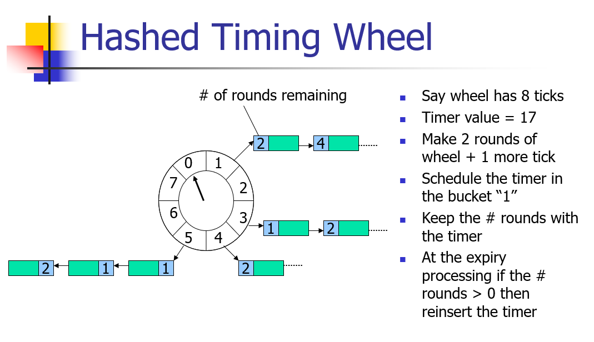
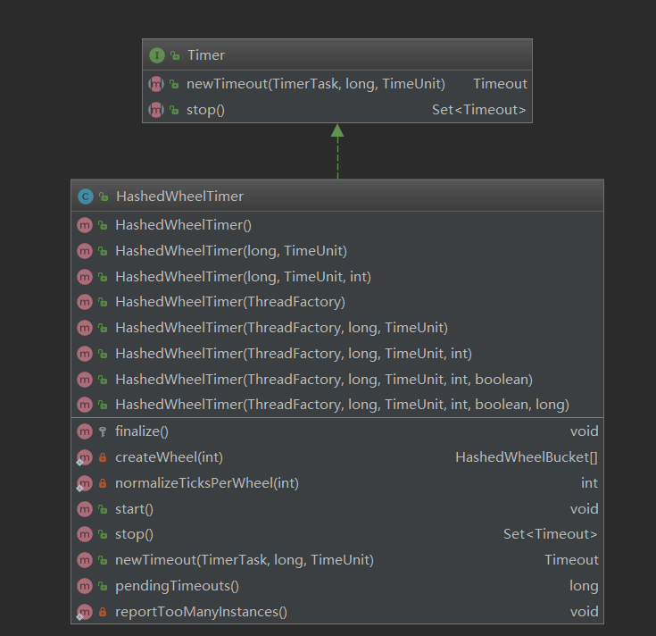
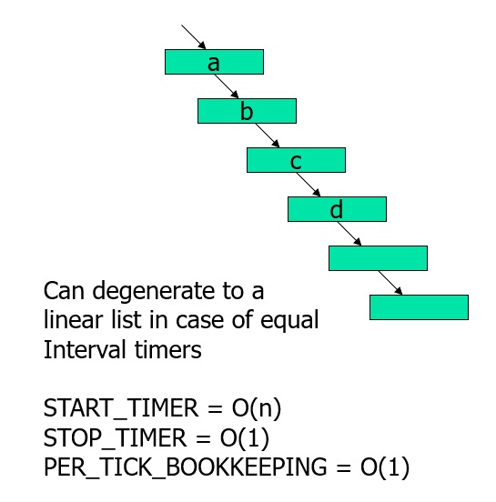
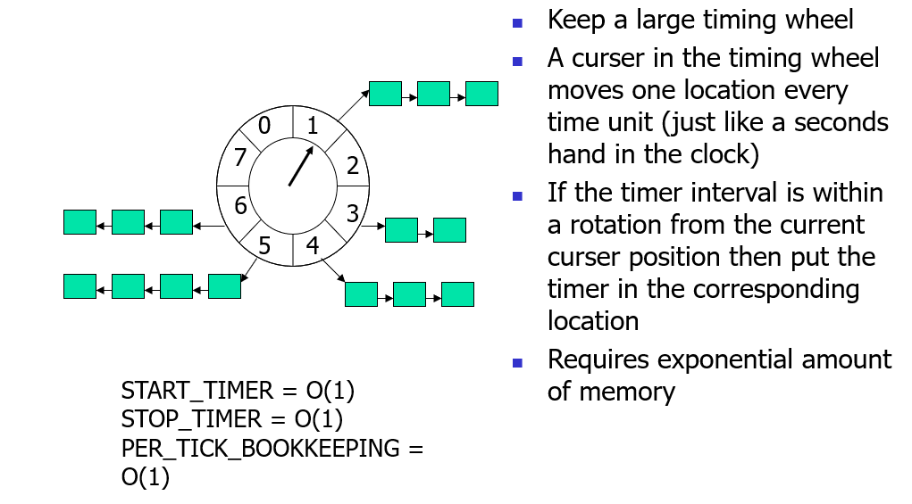
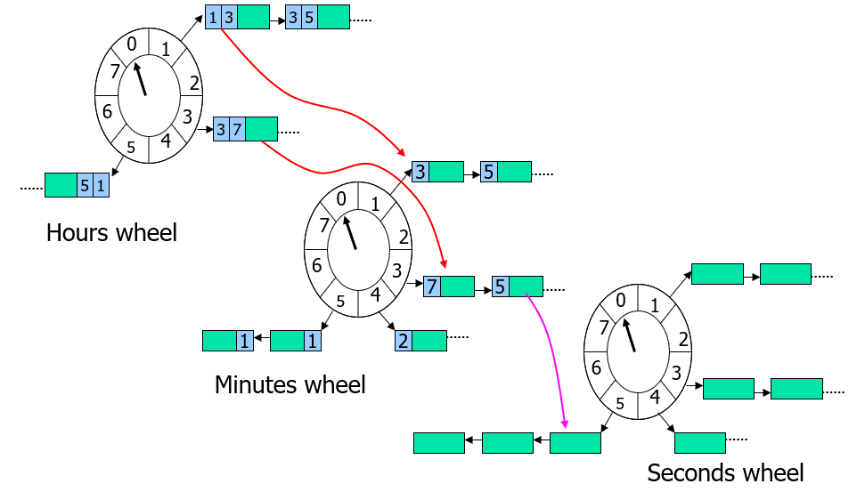
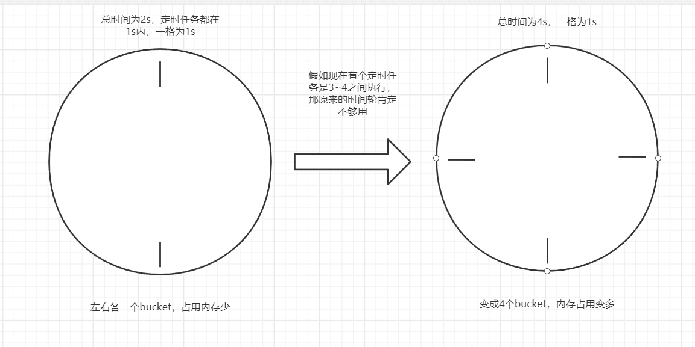

# 前言

前段时间在给自己的玩具项目设计的时候就遇到了一个场景需要定时任务，于是就趁机了解了目前主流的一些定时任务方案，比如下面这些：

- Timer（halo 博客源码中用到了）
- ScheduledExecutorService
- ThreadPoolTaskScheduler（基于 ScheduledExecutorService）
- Netty 的 schedule（用到了 PriorityQueue）
- Netty 的 HashedWheelTimer（时间轮）
- Kafka 的 TimingWheel（层级时间轮）

还有一些分布式的定时任务：

- Quartz
- xxl-job（我实习公司就在用这个）
- ...

因为我玩具项目实现业务 ACK 的方案就打算用 HashedWheelTimer，所以本节核心是分析 HashedWheelTimer，另外会提下它与 schedule 的区别，其它定时任务实现原理就请自动 Google 吧。

> Netty Version：4.1.42

# HashedWheelTimer 实现图示



大致有个理解就行，关于蓝色格子中的数字，其实就是剩余时钟轮数，这里听不懂也没关系，等后面看到源码解释就懂了~~（大概）~~。

# HashedWheelTimer 简答使用例子

这里顺便列出 schedule 的使用方式，下面是某个 Handler 中的代码：

```java
@Override
public void handlerAdded(final ChannelHandlerContext ctx) {
    // 定时任务
    ScheduledFuture<?> hello_world = ctx.executor().schedule(() -> {
        ctx.channel().write("hello world");
    }, 3, TimeUnit.SECONDS);

    // 构造一个 Timer 实例，同样只执行一次
    Timer timer = new HashedWheelTimer();
    Timeout timeout1 = timer.newTimeout(timeout -> System.out.println("5s 后执行该任务"), 5, TimeUnit.SECONDS);

    // 取消任务
    timeout1.cancel();
}
```

# HashedWheelTimer 源码

### 继承关系、方法



### 构造函数、属性

请记住这些属性的是干啥用的，后面会频繁遇到：
`io.netty.util.HashedWheelTimer#HashedWheelTimer(java.util.concurrent.ThreadFactory, long, java.util.concurrent.TimeUnit, int, boolean, long)`

```java
public HashedWheelTimer(
        ThreadFactory threadFactory,
        long tickDuration, TimeUnit unit, int ticksPerWheel, boolean leakDetection,
        long maxPendingTimeouts) {

    if (threadFactory == null) {
        throw new NullPointerException("threadFactory");
    }
    if (unit == null) {
        throw new NullPointerException("unit");
    }
    if (tickDuration <= 0) {
        throw new IllegalArgumentException("tickDuration must be greater than 0: " + tickDuration);
    }
    if (ticksPerWheel <= 0) {
        throw new IllegalArgumentException("ticksPerWheel must be greater than 0: " + ticksPerWheel);
    }

    // 初始化时间轮，数组长度必须是2的幂次方，便于取模
    // Normalize ticksPerWheel to power of two and initialize the wheel.
    wheel = createWheel(ticksPerWheel);
    // 用于取模运算, tick & mask
    mask = wheel.length - 1;

    // Convert tickDuration to nanos.
    // 毫秒转纳秒
    long duration = unit.toNanos(tickDuration);

    // Prevent overflow.
    // 防止溢出
    if (duration >= Long.MAX_VALUE / wheel.length) {
        throw new IllegalArgumentException(String.format(
                "tickDuration: %d (expected: 0 < tickDuration in nanos < %d",
                tickDuration, Long.MAX_VALUE / wheel.length));
    }

    // 时间刻度设置太小，自动设置为MILLISECOND_NANOS， 并弹出警告日志
    if (duration < MILLISECOND_NANOS) {
        logger.warn("Configured tickDuration {} smaller then {}, using 1ms.",
                    tickDuration, MILLISECOND_NANOS);
        this.tickDuration = MILLISECOND_NANOS;
    } else {
        this.tickDuration = duration;
    }

    // 初始化工作线程，注意这里还没有启动
    // 另外需要注意的是本类中的startTime是在worker第一次启动之后才初始化的，
    // 跟io.netty.util.concurrent.ScheduledFutureTask.START_TIME在类加载的时候初始化是不一样的
    workerThread = threadFactory.newThread(worker);

    // 用来跟踪内存问题的，本节忽略，主讲定时任务的实现
    leak = leakDetection || !workerThread.isDaemon() ? leakDetector.track(this) : null;

    // 最大允许任务等待数
    this.maxPendingTimeouts = maxPendingTimeouts;

    // HashedWheelTimer实例如果超过64个就会弹出警告，告诉你HashedWheelTimer不是这样用的，单个应用只需要一个单例即可
    if (INSTANCE_COUNTER.incrementAndGet() > INSTANCE_COUNT_LIMIT &&
        WARNED_TOO_MANY_INSTANCES.compareAndSet(false, true)) {
        reportTooManyInstances();
    }
}
```

### 添加定时任务

添加定时任务其实就是 Timer 接口的 newTimeOut 方法：
`io.netty.util.HashedWheelTimer#newTimeout`

```java
@Override
public Timeout newTimeout(TimerTask task, long delay, TimeUnit unit) {
    if (task == null) {
        throw new NullPointerException("task");
    }
    if (unit == null) {
        throw new NullPointerException("unit");
    }

    // 获取当前等待任务数
    long pendingTimeoutsCount = pendingTimeouts.incrementAndGet();

    // 如果超出最大等待
    if (maxPendingTimeouts > 0 && pendingTimeoutsCount > maxPendingTimeouts) {
        pendingTimeouts.decrementAndGet();
        throw new RejectedExecutionException("Number of pending timeouts ("
            + pendingTimeoutsCount + ") is greater than or equal to maximum allowed pending "
            + "timeouts (" + maxPendingTimeouts + ")");
    }

    // 尝试启动workerThread，startTime=0时会startTimeInitialized.await()，最终就是调用Worker的run方法
    start();

    // Add the timeout to the timeout queue which will be processed on the next tick.
    // During processing all the queued HashedWheelTimeouts will be added to the correct HashedWheelBucket.
    // 这条算式我们可以稍微改下，更容易理解些：
    // long deadline = System.nanoTime() + unit.toNanos(delay) - startTime;
    //                                 ↓
    // long deadline = unit.toNanos(delay) - (System.nanoTime() - startTime)
    // 我感觉这样更容易理解些，含义为： 距离任务执行的剩余时间 = 任务截止时间 - (当前时间 - 任务对象初始化时间)
    long deadline = System.nanoTime() + unit.toNanos(delay) - startTime;

    // Guard against overflow.
    if (delay > 0 && deadline < 0) {
        deadline = Long.MAX_VALUE;
    }

    // 构建任务对象
    HashedWheelTimeout timeout = new HashedWheelTimeout(this, task, deadline);
    // 将任务对象添加到mpsc队列中，mpsc是多生产者单消费者的队列模型，另外mpscQueue是无锁队列，靠的CAS实现的。
    timeouts.add(timeout);
    // 返回任务对象，该对象可以用于取消任务、获取任务信息等
    return timeout;
}
```

这里我们再跟进 start 方法看看：
`io.netty.util.HashedWheelTimer#start`

```java
public void start() {
    switch (WORKER_STATE_UPDATER.get(this)) {
        case WORKER_STATE_INIT:
            if (WORKER_STATE_UPDATER.compareAndSet(this, WORKER_STATE_INIT, WORKER_STATE_STARTED)) {
                // 一半会来到这里，最终就是调用到Worker的run方法
                workerThread.start();
            }
            break;
        case WORKER_STATE_STARTED:
            break;
        case WORKER_STATE_SHUTDOWN:
            throw new IllegalStateException("cannot be started once stopped");
        default:
            throw new Error("Invalid WorkerState");
    }

    // Wait until the startTime is initialized by the worker.
    while (startTime == 0) {
        try {
            // 如果startTime异常，Worker的run方法会处理这种异常，重新唤醒
            startTimeInitialized.await();
        } catch (InterruptedException ignore) {
            // Ignore - it will be ready very soon.
        }
    }
}
```

### 定时任务执行

定时任务的执行逻辑其实就在 Worker 的 run 方法中：
`io.netty.util.HashedWheelTimer.Worker#run`

```java
// 用于处理取消的任务
private final Set<Timeout> unprocessedTimeouts = new HashSet<Timeout>();

// 时钟指针转动的次数
private long tick;

@Override
public void run() {
    // Initialize the startTime.
    startTime = System.nanoTime();
    if (startTime == 0) {
        // We use 0 as an indicator for the uninitialized value here, so make sure it's not 0 when initialized.
        startTime = 1;
    }

    // Notify the other threads waiting for the initialization at start().
    // 之前如果startTime=0，就会进入await状态，这里就要唤醒它
    startTimeInitialized.countDown();

    do {
        /*
            * 等待到下一次 tick 时如果没有时间延迟返回tickDuration * (tick + 1);
            * 如果延迟了则不空转，立马返回“当前时间”
            * 这个“当前时间”是什么呢？比如时钟指针原本第三次 tick 是在300ms，但是由于前面的任务阻塞了50ms，导致进来的时候已经是350ms了
            * 那么这里的返回值就会变成350ms，至于返回值变成350ms会怎么样？貌似也没有怎么样，就是不等待马上执行罢了
            */
        final long deadline = waitForNextTick();
        if (deadline > 0) {
            // 与运算取模，取出数组桶的坐标，相信这个没少见过了
            int idx = (int) (tick & mask);
            // 前面说过HashedWheelTimeout是可以取消任务的，其实就是在这里取消的
            processCancelledTasks();
            // 在时间轮中取出“指针指向的块”
            HashedWheelBucket bucket =
                    wheel[idx];
            // 将任务填充到时间块中
            transferTimeoutsToBuckets();
            // 取出任务并执行
            bucket.expireTimeouts(deadline);
            tick++;
        }
    } while (WORKER_STATE_UPDATER.get(HashedWheelTimer.this) == WORKER_STATE_STARTED);

    // Fill the unprocessedTimeouts so we can return them from stop() method.
    for (HashedWheelBucket bucket: wheel) {
        bucket.clearTimeouts(unprocessedTimeouts);
    }
    for (;;) {
        HashedWheelTimeout timeout = timeouts.poll();
        if (timeout == null) {
            break;
        }
        if (!timeout.isCancelled()) {
            unprocessedTimeouts.add(timeout);
        }
    }
    // 处理取消的任务
    processCancelledTasks();
}
```

- 取消任务的逻辑这里就不展开看了，也比较简单，有兴趣自行补充即可。

看看上面的 transferTimeoutsToBuckets 方法，如果你看不懂上面图中蓝色格子数字是什么意思，那就认真看看这个方法：
`io.netty.util.HashedWheelTimer.Worker#transferTimeoutsToBuckets`

```java
private void transferTimeoutsToBuckets() {
    // transfer only max. 100000 timeouts per tick to prevent a thread to stale the workerThread when it just
    // adds new timeouts in a loop.
    for (int i = 0; i < 100000; i++) {
        // 取出一个任务对象
        HashedWheelTimeout timeout = timeouts.poll();
        if (timeout == null) {
            // all processed
            break;
        }
        // 如果任务被取消了，则直接过掉
        if (timeout.state() == HashedWheelTimeout.ST_CANCELLED) {
            // Was cancelled in the meantime.
            continue;
        }

        /*
            * remainingRounds的含义就是:时钟还要完整转几回才能执行到任务
            * 比如你的任务是在2500ms之后才执行的（deadline = 2500ms），时钟总共10个刻度，而 tickDuration 为100ms，当前时钟指针已经拨动三次（tick=3）
            * 那 2500 / 100 = 25
            * (25 - 3) / 10 约等于 2
            * 2 就表示 时钟转完当前圈（25-10=15），还要再转一圈（15-10），在第三圈才能执行到该任务
            */
        long calculated = timeout.deadline / tickDuration;
        timeout.remainingRounds = (calculated - tick) / wheel.length;

        final long ticks = Math.max(calculated, tick); // Ensure we don't schedule for past.
        int stopIndex = (int) (ticks & mask);

        // 将任务填充到“时间块”中
        HashedWheelBucket bucket = wheel[stopIndex];
        bucket.addTimeout(timeout);
    }
}
```

继续看看上面 run 方法中的 bucket.expireTimeouts(deadline);，这里面就是拿出任务并执行的逻辑：
`io.netty.util.HashedWheelTimer.HashedWheelBucket#expireTimeouts`

```java
/**
    * Expire all {@link HashedWheelTimeout}s for the given {@code deadline}.
    */
public void expireTimeouts(long deadline) {
    HashedWheelTimeout timeout = head;

    // process all timeouts
    while (timeout != null) {
        HashedWheelTimeout next = timeout.next;
        // 如果剩余轮数 <=0，则表示当前轮就要执行任务了
        if (timeout.remainingRounds <= 0) {
            next = remove(timeout);
            if (timeout.deadline <= deadline) {
                // 执行任务
                timeout.expire();
            } else {
                // The timeout was placed into a wrong slot. This should never happen.
                throw new IllegalStateException(String.format(
                        "timeout.deadline (%d) > deadline (%d)", timeout.deadline, deadline));
            }
        }
        // 如果任务被取消了
        else if (timeout.isCancelled()) {
            next = remove(timeout);
        }
        // 如果任务没被取消，而且剩余轮数>0，则扣除轮数，让任务继续等到至后面轮数
        else {
            timeout.remainingRounds --;
        }
        timeout = next;
    }
}
```

# 和 schedule 对比

关于 schedule 方法加入的定时任务什么时候被执行，你可以参考我之前写的[这篇博客](https://wenjie.store/archives/netty-nioeventloop-boot-2)，在时间操作上和 HashedWheelTimer 大同小异。

schedule 方法也是 Netty 的定时任务实现之一，但是底层的数据结构和 HashedWheelTimer 不一样，schedule 方法用到的数据结构其实和 ScheduledExecutorService 类似，是 PriorityQueue，它是一个优先级的队列。

除此之外，schedule 方法其实也用到 MpscQueue，只是任务执行的时候，会把任务从 PriorityQueue 转移到 MpscQueue 上。

下面来跟踪下 schedule 方法看看，由于主要是看数据结构的区别，所以一些地方在这里我就不深追了

首先来到如下代码：
`io.netty.util.concurrent.AbstractScheduledEventExecutor#schedule(java.lang.Runnable, long, java.util.concurrent.TimeUnit)`

```java
@Override
public ScheduledFuture<?> schedule(Runnable command, long delay, TimeUnit unit) {
    ObjectUtil.checkNotNull(command, "command");
    ObjectUtil.checkNotNull(unit, "unit");
    if (delay < 0) {
        delay = 0;
    }
    validateScheduled0(delay, unit);

    return schedule(new ScheduledFutureTask<Void>(
            this, command, null, ScheduledFutureTask.deadlineNanos(unit.toNanos(delay))));
}
```

继续跟进 schedule 方法看看：
`io.netty.util.concurrent.AbstractScheduledEventExecutor#schedule(io.netty.util.concurrent.ScheduledFutureTask<V>)`

```java
private <V> ScheduledFuture<V> schedule(final ScheduledFutureTask<V> task) {
    if (inEventLoop()) {
        scheduledTaskQueue().add(task.setId(nextTaskId++));
    } else {
        executeScheduledRunnable(new Runnable() {
            @Override
            public void run() {
                scheduledTaskQueue().add(task.setId(nextTaskId++));
            }
        }, true, task.deadlineNanos());
    }

    return task;
}
```

继续跟进 scheduledTaskQueue()方法：
`io.netty.util.concurrent.AbstractScheduledEventExecutor#scheduledTaskQueue`

```java
PriorityQueue<ScheduledFutureTask<?>> scheduledTaskQueue() {
    if (scheduledTaskQueue == null) {
        scheduledTaskQueue = new DefaultPriorityQueue<ScheduledFutureTask<?>>(
                SCHEDULED_FUTURE_TASK_COMPARATOR,
                // Use same initial capacity as java.util.PriorityQueue
                11);
    }
    return scheduledTaskQueue;
}
```

可以看到返回值就是 PriorityQueue，它是一个最小堆实现的优先队列。

# 扩展

### 不同实现的时间复杂度

这里我就直接贴下网上大佬给出的解释：

如果使用最小堆实现的优先级队列：


- 大致意思就是你的任务如果插入到堆顶，时间复杂度为 O(log(n))。

如果使用链表（既然有说道，那就扩展下）：


- 中间插入后的事件复杂度为 O(n)

单个时间轮：


- 复杂度可以降至 O(1)。

记录轮数的时间轮（其实就是文章开头的那个）：


层级时间轮：


- 时间复杂度是 O(n)，n 是轮子的数量，除此之外还要计算一个轮子上的 bucket。

### 单时间轮缺点

根据上面的图其实不难理解，如果任务是很久之后才执行的、同时要保证任务低延迟，那么单个时间轮所需的 bucket 数就会变得非常多，从而导致内存占用持续升高（CPU 空转时间还是不变的，仅仅是内存需求变高了），如下图：



Netty 对于单个时间轮的优化方式就是记录下 remainingRounds，从而减少 bucket 过多的内存占用。

### 时间轮和 PriorityQueue 对比

看完上面的时间复杂度对比，你可能会觉得：

- Q：时间轮的复杂度只有 O(1)，schedule 和 ScheduledExecutorService 这种都是 O(log(n))，那时间轮不是碾压吗？

- A：你不要忘了，如果任务是在很久之后才执行的，那么时间轮就会产生很多空转，这是非常浪费 CPU 性能的，这种空转消耗可以通过增大 tickDuration 来避免，但这样做又会产生降低定时任务的精度，可能导致一些任务推到很迟才执行。
- A：而 ScheduledExecutorService 不会有这个问题。

另外，Netty 时间轮的实现模型抽象出来是大概这个样子的：

```java
for(Tasks task : tasks) {
    task.doXxx();
}
```

这个抽象是个什么意思呢？你要注意一个点，这里的任务循环执行是同步的，**这意味着你第一个任务执行很慢延迟很高，那么后面的任务全都会被堵住**，所以你加进时间轮的任务不可以是耗时任务，比如一些延迟很高的数据库查询，如果有这种耗时任务，最好再嵌入线程池处理，不要让任务阻塞在这一层。

> 原文链接：https://wenjie.store/archives/netty-hashedwheeltimer-and-schedule
