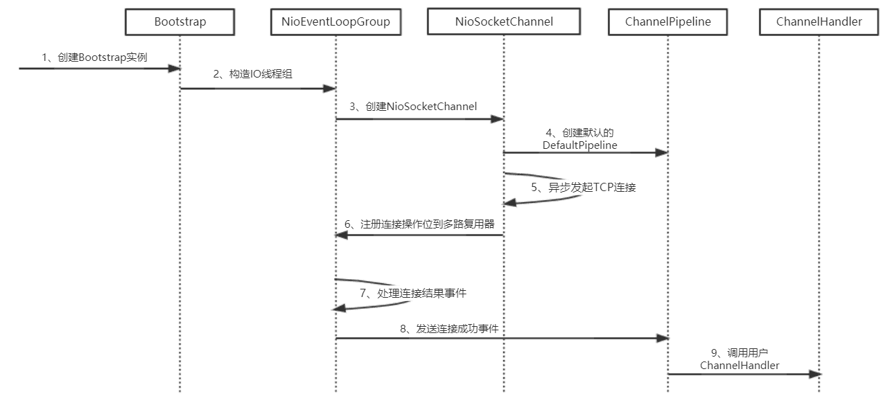

相对于服务端，Netty 客户端 的创建更加复杂，除了要考虑线程模型、异步连接、客户端连接超时等因素外，还需要对连接过程中的各种异常进行考虑。本章将对 Netty 客户端 创建的关键流程和源码进行分析，以期读者能够了解客户端创建的细节。

## 基于 Netty 创建客户端的流程分析

Netty 为了向使用者屏蔽 NIO 通信 的底层细节，在和用户交互的边界做了封装，目的就是为了减少用户开发工作量，降低开发难度。Bootstrap 是 Socket 客户端创建工具类，用户通过 Bootstrap 可以方便地创建 Netty 的客户端并发起 异步 TCP 连接操作。

### 基于 Netty 创建客户端 时序图



### Netty 创建客户端 流程分析

1. 用户线程创建 Bootstrap 实例，通过 API 设置客户端相关的参数，异步发起客户端连接；
2. 创建处理客户端连接、I/O 读写的 Reactor 线程组 NioEventLoopGroup。可以通过构造函数指定 IO 线程 的个数，默认为 CPU 内核数的 2 倍；
3. 通过 Bootstrap 的 ChannelFactory 和用户指定的 Channel 类型 创建用于客户端连接的 NioSocketChannel，它的功能类似于 JDK NIO 类库 提供的 SocketChannel；
4. 创建默认的 Channel、Handler、Pipeline，用于调度和执行网络事件；
5. 异步发起 TCP 连接，判断连接是否成功。如果成功，则直接将 NioSocketChannel 注册到多路复用器上，监听读操作位，用于数据报读取和消息发送；如果没有立即连接成功，则注册连接监听位到多路复用器，等待连接结果；
6. 注册对应的网络监听状态位到多路复用器；
7. 由多路复用器在 IO 现场中轮询各 Channel，处理连接结果；
8. 如果连接成功，设置 Future 结果，发送连接成功事件，触发 ChanneIPipeline 执行；
9. 由 ChannelPipeline 调度执行系统和用户的 ChannelHandler，执行业务逻辑。

## Netty 客户端创建源码分析

Netty 客户端 的创建流程比较繁琐，下面我们针对关键步骤和代码进行分析，通过梳理关键流程来掌握客户端创建的原理。

### 客户端连接辅助类 BootStrap

Bootstrap 是 Netty 提供的客户端连接工具类，主要用于简化客户端的创建，下面我们对它的 主要 API 进行讲解。

设置 lO 线程组：NIO 的特点就是，一个多路复用器可以同时处理上干条链路，这就意味着，NIO 模式中 一个线程可以处理多个 TCP 连接。考虑到 lO 线程 的处理性能，大多数 NIO 框架 都采用线程池的方式处理 IO 读写，Netty 也不例外。客户端相对于服务端，只需要一个处理 IO 读写 的线程组即可，因为 Bootstrap 提供了 设置 IO 线程组 的接口，代码如下。

```java
public abstract class AbstractBootstrap<B extends AbstractBootstrap<B, C>, C extends Channel> implements Cloneable {

    volatile EventLoopGroup group;

    public B group(EventLoopGroup group) {
        if (group == null) {
            throw new NullPointerException("group");
        } else if (this.group != null) {
            throw new IllegalStateException("group set already");
        } else {
            this.group = group;
            return this;
        }
    }
}
```

由于 Netty 的 NIO 线程组 默认采用 EventLoopGroup 接口，因此线程组参数使用 EventLoopGroup。

TCP 参数设置接口：无论是 NIO，还是 BIO，创建客户端套接字的时候通常都会设置连接参数，例如接收和发送缓冲区大小、连接超时时间等。Bootstrap 也提供了客户端 TCP 参数设置接口，代码如下。

```java
public <T> B option(ChannelOption<T> option, T value) {
    if (option == null) {
        throw new NullPointerException("option");
    } else {
        if (value == null) {
            synchronized(this.options) {
                this.options.remove(option);
            }
        } else {
            synchronized(this.options) {
                this.options.put(option, value);
            }
        }

        return this;
    }
}
```

Netty 提供的 主要 TCP 参数 如下。

1、SO_TIMEOUT：控制读取操作将阻塞多少毫秒。如果返回值为 0，计时器就被禁止了，该线程将无限期阻塞；
2、SO_SNDBUF：套接字使用的发送缓冲区大小；
3、SO_RCVBUF：套接字使用的接收缓冲区大小；
4、SO_REUSEADDR：用于决定 如果网络上仍然有数据向旧的 ServerSocket 传输数据，是否允许新的 ServerSocket 绑定到与旧的 ServerSocket 同样的端口上。SO_REUSEADDR 选项 的默认值与操作系统有关，在某些操作系统中，允许重用端口，而在某些操作系统中不允许重用端口；
5、CONNECT_TIMEOUT_MILLIS：客户端连接超时时间，由于 NIO 原生的客户端 并不提供设置连接超时的接口，因此，Netty 采用的是自定义连接超时定时器负责检测和超时控制；

Channel 接口：用于指定客户端使用的 Channel 接口，对于 TCP 客户端连接，默认使用 NioSocketChannel，代码如下。

```java
public B channel(Class<? extends C> channelClass) {
    if (channelClass == null) {
        throw new NullPointerException("channelClass");
    } else {
        return this.channelFactory((io.netty.channel.ChannelFactory)(new ReflectiveChannelFactory(channelClass)));
    }
}
```

BootstrapChannelFactory 利用 参数 channelClass，通过反射机制创建 NioSocketChannel 对象。

设置 Handler 接口：Bootstrap 为了简化 Handler 的编排，提供了 Channellnitializer，它继承了 ChannelHandlerAdapter，当 TCP 链路 注册成功之后，调用 initChannel 接口，用于设置用户 ChanneIHandler。它的代码如下。

```java
public abstract class ChannelInitializer<C extends Channel> extends ChannelInboundHandlerAdapter {

    public final void channelRegistered(ChannelHandlerContext ctx) throws Exception {
        if (this.initChannel(ctx)) {
            ctx.pipeline().fireChannelRegistered();
        } else {
            ctx.fireChannelRegistered();
        }
    }
}
```

最后一个比较重要的接口就是发起客户端连接，代码如下。

```java
ChannelFuture f = b.connect(host, port).sync();
```

### 客户端连接操作

首先要创建和初始化 NioSocketChannel，代码如下。

```java
public class Bootstrap extends AbstractBootstrap<Bootstrap, Channel> {

    public ChannelFuture connect(SocketAddress remoteAddress, SocketAddress localAddress) {
        if (remoteAddress == null) {
            throw new NullPointerException("remoteAddress");
        } else {
            this.validate();
            return this.doResolveAndConnect(remoteAddress, localAddress);
        }
    }

    private ChannelFuture doResolveAndConnect(final SocketAddress remoteAddress, final SocketAddress localAddress) {
    	// 首先要创建和初始化 NioSocketChannel
        ChannelFuture regFuture = this.initAndRegister();
        final Channel channel = regFuture.channel();
        if (regFuture.isDone()) {
        	// 初始化 Channel 之后，将其注册到 Selector 上
            return !regFuture.isSuccess() ? regFuture : this.doResolveAndConnect0(channel, remoteAddress, localAddress, channel.newPromise());
        } else {
            final PendingRegistrationPromise promise = new PendingRegistrationPromise(channel);
            regFuture.addListener(new ChannelFutureListener() {
                public void operationComplete(ChannelFuture future) throws Exception {
                    Throwable cause = future.cause();
                    if (cause != null) {
                        promise.setFailure(cause);
                    } else {
                        promise.registered();
                        Bootstrap.this.doResolveAndConnect0(channel, remoteAddress, localAddress, promise);
                    }

                }
            });
            return promise;
        }
    }

    private ChannelFuture doResolveAndConnect0(final Channel channel, SocketAddress remoteAddress, final SocketAddress localAddress, final ChannelPromise promise) {
        try {
            EventLoop eventLoop = channel.eventLoop();
            AddressResolver<SocketAddress> resolver = this.resolver.getResolver(eventLoop);
            if (!resolver.isSupported(remoteAddress) || resolver.isResolved(remoteAddress)) {
                doConnect(remoteAddress, localAddress, promise);
                return promise;
            }

            Future<SocketAddress> resolveFuture = resolver.resolve(remoteAddress);
            if (resolveFuture.isDone()) {
                Throwable resolveFailureCause = resolveFuture.cause();
                if (resolveFailureCause != null) {
                    channel.close();
                    promise.setFailure(resolveFailureCause);
                } else {
                    doConnect((SocketAddress)resolveFuture.getNow(), localAddress, promise);
                }

                return promise;
            }

            resolveFuture.addListener(new FutureListener<SocketAddress>() {
                public void operationComplete(Future<SocketAddress> future) throws Exception {
                    if (future.cause() != null) {
                        channel.close();
                        promise.setFailure(future.cause());
                    } else {
                        Bootstrap.doConnect((SocketAddress)future.getNow(), localAddress, promise);
                    }

                }
            });
        } catch (Throwable var9) {
            promise.tryFailure(var9);
        }

        return promise;
    }

    private static void doConnect(final SocketAddress remoteAddress, final SocketAddress localAddress, final ChannelPromise connectPromise) {
        final Channel channel = connectPromise.channel();
        channel.eventLoop().execute(new Runnable() {
            public void run() {
                if (localAddress == null) {
                    channel.connect(remoteAddress, connectPromise);
                } else {
                    channel.connect(remoteAddress, localAddress, connectPromise);
                }

                connectPromise.addListener(ChannelFutureListener.CLOSE_ON_FAILURE);
            }
        });
    }
}
```

需要注意的是，SocketChannel 执行 connect() 操作后有以下三种结果。

1. 连接成功，返回 True；
2. 暂时没有连接上，服务端没有返回 ACK 应答，连接结果不确定，返回 False；
3. 连接失败，直接抛出 IO 异常。

如果是第二种结果，需要将 NioSocketChannel 中的 selectionKey 设置为 OP_CONNECT，监听连接结果。异步连接返回之后，需要判断连接结果，如果连接成功，则触发 ChannelActive 事件。ChannelActive 事件 最终会将 NioSocketChannel 中的 selectionKey 设置为 SelectionKey.OP_READ，用于监听网络读操作。如果没有立即连接上服务端，则注册 SelectionKey.OP_CONNECT 到多路复用器。如果连接过程发生异常，则关闭链路，进入连接失败处理流程。

### 异步连接结果通知

NioEventLoop 的 Selector 轮询 客户端连接 Channel，当服务端返回握手应答之后，对连接结果进行判断，代码如下。

```java
if ((readyOps & 8) != 0) {
    int ops = k.interestOps();
    ops &= -9;
    k.interestOps(ops);
    unsafe.finishConnect();
}
```

下面对 finishConnect()方法 进行分析，代码如下。

```java
try {
    boolean wasActive = AbstractNioChannel.this.isActive();
    AbstractNioChannel.this.doFinishConnect();
    this.fulfillConnectPromise(AbstractNioChannel.this.connectPromise, wasActive);
} catch (Throwable var5) {
    ......
}
```

doFinishConnect()方法 用于判断 JDK 的 SocketChannel 的连接结果，如果未出错 表示连接成功，其他值或者发生异常表示连接失败。

```java
protected void doFinishConnect() throws Exception {
    if (!this.javaChannel().finishConnect()) {
        throw new Error();
    }
}
```

连接成功之后，调用 fufillConectPromise()方法，触发链路激活事件，该事件由 ChannelPipeline 进行传播。

### 客户端连接超时机制

对于 SocketChannel 接口，JDK 并没有提供连接超时机制，需要 NIO 框架或者用户自己扩展实现。Netty 利用定时器提供了客户端连接超时控制功能，下面我们对该功能进行详细讲解。

首先,用户在创建 Netty 客户端的时候，可以通过 ChannelOption.CONNECT_TIMEOUT_MILLIS 配置项设置连接超时时间，代码如下。

```java
Bootstrap b = new Bootstrap();
b.group(workerGroup);
b.channel(NioSocketChannel.class);
b.option(ChannelOption.SO_KEEPALIVE, true);
b.option(ChannelOption.CONNECT_TIMEOUT_MILLIS, 3000);
```
