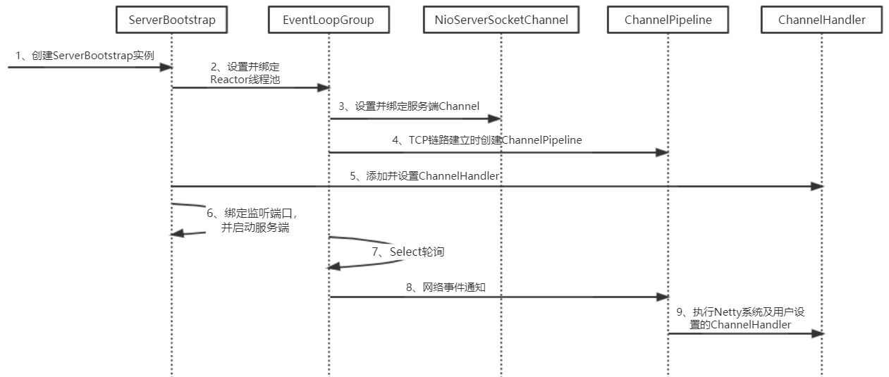
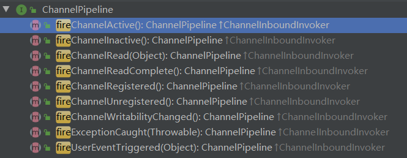
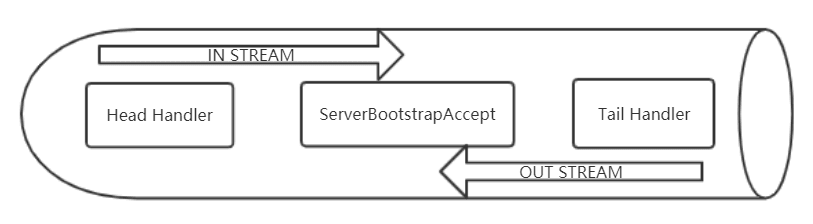

## Netty 服务端创建源码分析

当我们直接使用 JDK 的 NIO 类库 开发基于 NIO 的异步服务端时，需要用到 多路复用器 Selector、ServerSocketChannel、SocketChannel、ByteBuffer、SelectionKey 等，相比于传统的 BIO 开发，NIO 的开发要复杂很多，开发出稳定、高性能的异步通信框架，一直是个难题。Netty 为了向使用者屏蔽 NIO 通信 的底层细节，在和用户交互的边界做了封装，目的就是为了减少用户开发工作量，降低开发难度。ServerBootstrap 是 Socket 服务端 的启动辅助类，用户通过 ServerBootstrap 可以方便地创建 Netty 的服务端。

### Netty 服务端创建时序图



下面我们对 Netty 服务端创建 的关键步骤和原理进行详细解析。

1、**创建 ServerBootstrap 实例**。ServerBootstrap 是 Netty 服务端 的 启动辅助类，它提供了一系列的方法用于设置服务端启动相关的参数。底层对各种 原生 NIO 的 API 进行了封装，减少了用户与 底层 API 的接触，降低了开发难度。ServerBootstrap 中只有一个 public 的无参的构造函数可以给用户直接使用，ServerBootstrap 只开放一个无参的构造函数 的根本原因是 它的参数太多了，而且未来也可能会发生变化，为了解决这个问题，就需要引入 Builder 建造者模式。

2、**设置并绑定 Reactor 线程池**。Netty 的 Reactor 线程池 是 EventLoopGroup，它实际上是一个 EventLoop 数组。EventLoop 的职责是处理所有注册到本线程多路复用器 Selector 上的 Channel，Selector 的轮询操作由绑定的 EventLoop 线程 的 run()方法 驱动，在一个循环体内循环执行。值得说明的是，EventLoop 的职责不仅仅是处理 网络 IO 事件，用户自定义的 Task 和 定时任务 Task 也统一由 EventLoop 负责处理，这样线程模型就实现了统一。从调度层面看，也不存在从 EventLoop 线程 中再启动其他类型的线程用于异步执行另外的任务，这样就避免了多线程并发操作和锁竞争，提升了 IO 线程 的处理和调度性能。

3、**设置并绑定 服务端 Channel**。作为 NIO 服务端，需要创建 ServerSocketChannel，Netty 对 原生 NIO 类库 进行了封装，对应的实现是 NioServerSocketChannel。对于用户而言，不需要关心 服务端 Channel 的底层实现细节和工作原理，只需要指定具体使用哪种服务端 Channel 即可。因此，Netty 中 ServerBootstrap 的基类 提供了 channel()方法，用于指定 服务端 Channel 的类型。Netty 通过工厂类，利用反射创建 NioServerSocketChannel 对象。由于服务端监听端口往往只需要在系统启动时才会调用，因此反射对性能的影响并不大。相关代
码如下。

```java
public abstract class AbstractBootstrap<B extends AbstractBootstrap<B, C>, C extends Channel> implements Cloneable {

    /**
     * 通过 参数channelClass 创建一个 Channel实例，
     */
    public B channel(Class<? extends C> channelClass) {
        if (channelClass == null) {
            throw new NullPointerException("channelClass");
        }
        return channelFactory(new ReflectiveChannelFactory<C>(channelClass));
    }
}
```

4、**链路建立的时候创建并初始化 ChannelPipeline**。ChannelPipeline 并不是 NIO 服务端 必需的，它本质就是一个负责处理网络事件的职责链，负责管理和执行 ChannelHandler。网络事件以事件流的形式在 ChannelPipeline 中流转，由 ChannelPipeline 根据 ChannelHandler 的执行策略 调度 ChannelHandler 的执行。典型的网络事件如下。

1. 链路注册；
2. 链路激活；
3. 链路断开；
4. 接收到请求消息；
5. 请求消息接收并处理完毕；
6. 发送应答消息；
7. 链路发生异常；
8. 发生用户自定义事件。

5、**初始化 ChannelPipeline 完成之后，添加并设置 ChannelHandler**。ChannelHandler 是 Netty 提供给用户定制和扩展的关键接口。利用 ChannelHandler 用户可以完成大多数的功能定制，例如消息编解码、心跳、安全认证、TSL/SSL 认证、流量控制和流量整形等。Netty 同时也提供了大量的 系统 ChannelHandler 供用户使用，比较实用的 系统 ChannelHandler 总结如下。

1. 系统编解码框架，ByteToMessageCodec；
2. 基于长度的半包解码器，LengthFieldBasedFrameDecoder；
3. 码流日志打印 Handler，LoggingHandler；
4. SSL 安全认证 Handler，SslHandler；
5. 链路空闲检测 Handler，IdleStateHandler；
6. 流量整形 Handler，ChannelTrafficShapingHandler；
7. Base64 编解码，Base64Decoder 和 Base64Encoder。  
   创建和添加 ChannelHandler 的代码示例如下。

```java
    .childHandler( new ChannelInitializer<SocketChannel>() {
            @Override
            public void initChannel(SocketChannel ch) throws Exception {
                ch.pipeline().addLast( new EchoServerHandler() );
            }
    });
```

6、**绑定并启动监听端口**。在绑定监听端口之前系统会做一系列的初始化和检测工作，完成之后，会启动监听端口，并将 ServerSocketChannel 注册到 Selector 上监听客户端连接。

7、**Selector 轮询**。由 Reactor 线程 NioEventLoop 负责调度和执行 Selector 轮询操作，选择准备就绪的 Channel 集合，相关代码如下。

```java
public final class NioEventLoop extends SingleThreadEventLoop {

    private void select(boolean oldWakenUp) throws IOException {
        Selector selector = this.selector;

		......

        int selectedKeys = selector.select(timeoutMillis);
        selectCnt ++;

  		......

    }
}
```

8、**当轮询到 准备就绪的 Channel 之后，就由 Reactor 线程 NioEventLoop 执行 ChannelPipeline 的相应方法，最终调度并执行 ChannelHandler**，接口如下图所示。



9、**执行 Netty 中 系统的 ChannelHandler 和 用户添加定制的 ChannelHandler** 。ChannelPipeline 根据网络事件的类型，调度并执行 ChannelHandler，相关代码如下。

```java
public class DefaultChannelPipeline implements ChannelPipeline {

    @Override
    public final ChannelPipeline fireChannelRead(Object msg) {
        AbstractChannelHandlerContext.invokeChannelRead(head, msg);
        return this;
    }
}
```

### 结合 Netty 源码 对服务端的创建过程进行解析

首先通过构造函数创建 ServerBootstrap 实例，随后，通常会创建两个 EventLoopGroup 实例 (也可以只创建一个并共享)，代码如下。

```java
	EventLoopGroup acceptorGroup = new NioEventLoopGroup();
	EventLoopGroup iOGroup = new NioEventLoopGroup();
```

NioEventLoopGroup 实际就是一个 Reactor 线程池，负责调度和执行客户端的接入、网络读写事件的处理、用户自定义任务和定时任务的执行。通过 ServerBootstrap 的 group()方法 将两个 EventLoopGroup 实例 传入，代码如下。

```java
public class ServerBootstrap extends AbstractBootstrap<ServerBootstrap, ServerChannel> {

    /**
     * Set the {@link EventLoopGroup} for the parent (acceptor) and the child (client). These
     * {@link EventLoopGroup}'s are used to handle all the events and IO for {@link ServerChannel} and
     * {@link Channel}'s.
     */
    public ServerBootstrap group(EventLoopGroup parentGroup, EventLoopGroup childGroup) {
        super.group(parentGroup);
        if (childGroup == null) {
            throw new NullPointerException("childGroup");
        }
        if (this.childGroup != null) {
            throw new IllegalStateException("childGroup set already");
        }
        this.childGroup = childGroup;
        return this;
    }
}
```

其中 parentGroup 对象 被设置进了 ServerBootstrap 的父类 AbstractBootstrap 中，代码如下。

```java
public abstract class AbstractBootstrap<B extends AbstractBootstrap<B, C>, C extends Channel> implements Cloneable {

    volatile EventLoopGroup group;

    /**
     * The {@link EventLoopGroup} which is used to handle all the events for the to-be-created
     * {@link Channel}
     */
    public B group(EventLoopGroup group) {
        if (group == null) {
            throw new NullPointerException("group");
        }
        if (this.group != null) {
            throw new IllegalStateException("group set already");
        }
        this.group = group;
        return self();
    }
}
```

该方法会被客户端和服务端重用，用于设置 工作 IO 线程，执行和调度网络事件的读写。线程组和线程类型设置完成后，需要设置 服务端 Channel 用于端口监听和客户端链路接入。Netty 通过 Channel 工厂类 来创建不同类型的 Channel，对于服务端，需要创建 NioServerSocketChannel。所以，通过指定 Channel 类型 的方式创建 Channel 工厂。ReflectiveChannelFactory 可以根据 Channel 的类型 通过反射创建 Channel 的实例，服务端需要创建的是 NioServerSocketChannel 实例，代码如下。

```java
public class ReflectiveChannelFactory<T extends Channel> implements ChannelFactory<T> {

    private final Constructor<? extends T> constructor;

    public ReflectiveChannelFactory(Class<? extends T> clazz) {
        ObjectUtil.checkNotNull(clazz, "clazz");
        try {
            this.constructor = clazz.getConstructor();
        } catch (NoSuchMethodException e) {
            throw new IllegalArgumentException("Class " + StringUtil.simpleClassName(clazz) +
                    " does not have a public non-arg constructor", e);
        }
    }

    @Override
    public T newChannel() {
        try {
            return constructor.newInstance();
        } catch (Throwable t) {
            throw new ChannelException("Unable to create Channel from class " + constructor.getDeclaringClass(), t);
        }
    }
}
```

指定 NioServerSocketChannel 后，需要设置 TCP 的一些参数，作为服务端，主要是设置 TCP 的 backlog 参数。

backlog 指定了内核为此套接口排队的最大连接个数，对于给定的监听套接口，内核要维护两个队列：未链接队列 和 已连接队列，根据 TCP 三次握手 的 三个子过程来分隔这两个队列。服务器处于 listen 状态 时，收到客户端 syn 过程(connect) 时在未完成队列中创建一个新的条目，然后用三次握手的第二个过程，即服务器的 syn 响应客户端，此条目在第三个过程到达前 (客户端对服务器 syn 的 ack) 一直保留在未完成连接队列中，如果三次握手完成，该条目将从未完成连接队列搬到已完成连接队列尾部。当进程调用 accept 时，从已完成队列中的头部取出一个条目给进程，当已完成队列为空时进程将睡眠，直到有条目在已完成连接队列中才唤醒。backlog 被规定为两个队列总和的最大值，大多数实现默认值为 5，但在高并发 Web 服务器 中此值显然不够。 需要设置此值更大一些的原因是，未完成连接队列的长度可能因为客户端 syn 的到达及等待三次握手的第三个过程延时 而增大。Netty 默认的 backlog 为 100，当然，用户可以修改默认值，这需要根据实际场景和网络状况进行灵活设置。

TCP 参数 设置完成后，用户可以为启动辅助类和其父类分别指定 Handler。两者 Handler 的用途不同：子类中的 Handler 是 NioServerSocketChannel 对应的 ChannelPipeline 的 Handler；父类中的 Handler 是客户端新接入的连接 SocketChannel 对应的 ChannelPipeline 的 Handler。两者的区别可以通过下图来展示。


本质区别就是：ServerBootstrap 中的 Handler 是 NioServerSocketChannel 使用的，所有连接该监听端口的客户端都会执行它；父类 AbstractBootstrap 中的 Handler 是个工厂类，它为每个新接入的客户端都创建一个新的 Handler。

服务端启动的最后一步，就是绑定本地端口，启动服务，下面我们来分析下这部分代码。

```java
public abstract class AbstractBootstrap<B extends AbstractBootstrap<B, C>, C extends Channel> implements Cloneable {

    private ChannelFuture doBind(final SocketAddress localAddress) {
        final ChannelFuture regFuture = initAndRegister();
        final Channel channel = regFuture.channel();
        if (regFuture.cause() != null) {
            return regFuture;
        }

        if (regFuture.isDone()) {
            // At this point we know that the registration was complete and successful.
            ChannelPromise promise = channel.newPromise();
            doBind0(regFuture, channel, localAddress, promise);
            return promise;
        } else {
            // Registration future is almost always fulfilled already, but just in case it's not.
            final PendingRegistrationPromise promise = new PendingRegistrationPromise(channel);
            regFuture.addListener(new ChannelFutureListener() {
                @Override
                public void operationComplete(ChannelFuture future) throws Exception {
                    Throwable cause = future.cause();
                    if (cause != null) {
                        // Registration on the EventLoop failed so fail the ChannelPromise directly to not cause an
                        // IllegalStateException once we try to access the EventLoop of the Channel.
                        promise.setFailure(cause);
                    } else {
                        // Registration was successful, so set the correct executor to use.
                        // See https://github.com/netty/netty/issues/2586
                        promise.registered();

                        doBind0(regFuture, channel, localAddress, promise);
                    }
                }
            });
            return promise;
        }
    }
}
```

先看下上述代码调用的 initAndRegister()方法。它首先实例化了一个 NioServerSocketChannel 类型 的 Channel 对象。相关代码如下。

```java
    final ChannelFuture initAndRegister() {
        Channel channel = null;
        try {
            channel = channelFactory.newChannel();
            init(channel);
        } catch (Throwable t) {
            if (channel != null) {
                // channel can be null if newChannel crashed (eg SocketException("too many open files"))
                channel.unsafe().closeForcibly();
                // as the Channel is not registered yet we need to force the usage of the GlobalEventExecutor
                return new DefaultChannelPromise(channel, GlobalEventExecutor.INSTANCE).setFailure(t);
            }
            // as the Channel is not registered yet we need to force the usage of the GlobalEventExecutor
            return new DefaultChannelPromise(new FailedChannel(), GlobalEventExecutor.INSTANCE).setFailure(t);
        }

        ChannelFuture regFuture = config().group().register(channel);
        if (regFuture.cause() != null) {
            if (channel.isRegistered()) {
                channel.close();
            } else {
                channel.unsafe().closeForcibly();
            }
        }
        return regFuture;
    }
```

NioServerSocketChannel 创建成功后，对它进行初始化，初始化工作主要有以下三点。

```java
    @Override
    void init(Channel channel) throws Exception {
        final Map<ChannelOption<?>, Object> options = options0();
        synchronized (options) {
            setChannelOptions(channel, options, logger);
        }

        // 1、设置 Socket参数 和 NioServerSocketChannel 的附加属性
        final Map<AttributeKey<?>, Object> attrs = attrs0();
        synchronized (attrs) {
            for (Entry<AttributeKey<?>, Object> e: attrs.entrySet()) {
                @SuppressWarnings("unchecked")
                AttributeKey<Object> key = (AttributeKey<Object>) e.getKey();
                channel.attr(key).set(e.getValue());
            }
        }

        // 2、将 AbstractBootstrap 的 Handler 添加到 NioServerSocketChannel
        //    的 ChannelPipeline 中
        ChannelPipeline p = channel.pipeline();

        final EventLoopGroup currentChildGroup = childGroup;
        final ChannelHandler currentChildHandler = childHandler;
        final Entry<ChannelOption<?>, Object>[] currentChildOptions;
        final Entry<AttributeKey<?>, Object>[] currentChildAttrs;
        synchronized (childOptions) {
            currentChildOptions = childOptions.entrySet().toArray(newOptionArray(0));
        }
        synchronized (childAttrs) {
            currentChildAttrs = childAttrs.entrySet().toArray(newAttrArray(0));
        }

        // 3、将用于服务端注册的 Handler ServerBootstrapAcceptor 添加到 ChannelPipeline 中
        p.addLast(new ChannelInitializer<Channel>() {
            @Override
            public void initChannel(final Channel ch) throws Exception {
                final ChannelPipeline pipeline = ch.pipeline();
                ChannelHandler handler = config.handler();
                if (handler != null) {
                    pipeline.addLast(handler);
                }

                ch.eventLoop().execute(new Runnable() {
                    @Override
                    public void run() {
                        pipeline.addLast(new ServerBootstrapAcceptor(
                                ch, currentChildGroup, currentChildHandler, currentChildOptions, currentChildAttrs));
                    }
                });
            }
        });
    }
```

到此，Netty 服务端监听的相关资源已经初始化完毕，就剩下最后一步，注册 NioServerSocketChannel 到 Reactor 线程 的多路复用器上，然后轮询客户端连接事件。在分析注册代码之前，我们先通过下图，看看目前 NioServerSocketChannel 的 ChannelPipeline 的组成。

最后，我们看下 NioServerSocketChannel 的注册。当 NioServerSocketChannel 初始化完成之后，需要将它注册到 Reactor 线程 的多路复用器上监听新客户端的接入，代码如下。

```java
public abstract class AbstractChannel extends DefaultAttributeMap implements Channel {

    protected abstract class AbstractUnsafe implements Unsafe {

        /**
         * 将完成初始化的 NioServerSocketChannel 注册到 Reactor线程
         * 的多路复用器上，监听新客户端的接入
         */
        @Override
        public final void register(EventLoop eventLoop, final ChannelPromise promise) {

            ......

            // 首先判断是否是 NioEventLoop 自身发起的操作。如果是，则不存在并发操作，直接
            // 执行 Channel注册；如果由其他线程发起，则封装成一个 Task 放入消息队列中异步执行。
            // 此处，由于是由 ServerBootstrap 所在线程执行的注册操作，所以会将其封装成 Task 投递
            // 到 NioEventLoop 中执行
            if (eventLoop.inEventLoop()) {
                register0(promise);
            } else {
                try {
                    eventLoop.execute(new Runnable() {
                        @Override
                        public void run() {
                            register0(promise);
                        }
                    });
                } catch (Throwable t) {

                    ......

                }
            }
        }

        private void register0(ChannelPromise promise) {
            try {
                // check if the channel is still open as it could be closed in the mean time when the register
                // call was outside of the eventLoop
                if (!promise.setUncancellable() || !ensureOpen(promise)) {
                    return;
                }
                boolean firstRegistration = neverRegistered;
                // 该方法在本类中是一个空实现，下面看一下它在子类 AbstractNioChannel 中的实现
                doRegister();
                neverRegistered = false;
                registered = true;

                pipeline.invokeHandlerAddedIfNeeded();

                safeSetSuccess(promise);
                pipeline.fireChannelRegistered();
                if (isActive()) {
                    if (firstRegistration) {
                        pipeline.fireChannelActive();
                    } else if (config().isAutoRead()) {
                        beginRead();
                    }
                }
            } catch (Throwable t) {
                closeForcibly();
                closeFuture.setClosed();
                safeSetFailure(promise, t);
            }
        }
	}
}


public abstract class AbstractNioChannel extends AbstractChannel {

    @Override
    protected void doRegister() throws Exception {
        boolean selected = false;
        for (;;) {
            try {
            	// 将 NioServerSocketChannel 注册到 NioEventLoop 的 多路复用器Selector 上
                selectionKey = javaChannel().register(eventLoop().unwrappedSelector(), 0, this);
                return;
            } catch (CancelledKeyException e) {

                ......

            }
        }
    }
}
```

到此，服务端监听启动部分源码已经分析完成。

## 结合 Netty 源码 对客户端接入过程进行解析

负责处理网络读写、连接和客户端请求接入的 Reactor 线程 就是 NioEventLoop，下面我们看下 NioEventLoop 是如何处理新的客户端连接接入的。当 多路复用器 检测到新的准备就绪的 Channel 时，默认执行 processSelectedKeysOptimized()方法，代码如下。

```java
public final class NioEventLoop extends SingleThreadEventLoop {

    private void processSelectedKeys() {
        if (selectedKeys != null) {
            processSelectedKeysOptimized();
        } else {
            processSelectedKeysPlain(selector.selectedKeys());
        }
    }

    private void processSelectedKeysOptimized() {
        for (int i = 0; i < selectedKeys.size; ++i) {
            final SelectionKey k = selectedKeys.keys[i];
            selectedKeys.keys[i] = null;

            final Object a = k.attachment();

            if (a instanceof AbstractNioChannel) {
                // 根据就绪的操作位 SelectionKey，执行不同的操作
                processSelectedKey(k, (AbstractNioChannel) a);
            } else {
                @SuppressWarnings("unchecked")
                NioTask<SelectableChannel> task = (NioTask<SelectableChannel>) a;
                processSelectedKey(k, task);
            }

            if (needsToSelectAgain) {
                selectedKeys.reset(i + 1);
                selectAgain();
                i = -1;
            }
        }
    }

    // 根据就绪的操作位 SelectionKey，执行不同的操作
    private void processSelectedKey(SelectionKey k, AbstractNioChannel ch) {
        // 由于不同的 Channel 执行不同的操作，所以 NioUnsafe 被设计成接口
        // 由不同的 Channel 内部的 NioUnsafe实现类 负责具体实现
        final AbstractNioChannel.NioUnsafe unsafe = ch.unsafe();
        if (!k.isValid()) {
            final EventLoop eventLoop;
            try {
                eventLoop = ch.eventLoop();
            } catch (Throwable ignored) {
                return;
            }
            if (eventLoop != this || eventLoop == null) {
                return;
            }
            unsafe.close(unsafe.voidPromise());
            return;
        }

        try {
            int readyOps = k.readyOps();
            if ((readyOps & SelectionKey.OP_CONNECT) != 0) {
                int ops = k.interestOps();
                ops &= ~SelectionKey.OP_CONNECT;
                k.interestOps(ops);
                unsafe.finishConnect();
            }

            if ((readyOps & SelectionKey.OP_WRITE) != 0) {
                ch.unsafe().forceFlush();
            }

            // read()方法 的实现有两个，分别是 NioByteUnsafe 和 NioMessageUnsafe，
            // 对于 NioServerSocketChannel，它使用的是 NioMessageUnsafe
            // 下面看一下 NioMessageUnsafe 对 read() 方法的实现
            if ((readyOps & (SelectionKey.OP_READ | SelectionKey.OP_ACCEPT)) != 0 || readyOps == 0) {
                unsafe.read();
            }
        } catch (CancelledKeyException ignored) {
            unsafe.close(unsafe.voidPromise());
        }
    }
}


public abstract class AbstractNioMessageChannel extends AbstractNioChannel {

    private final class NioMessageUnsafe extends AbstractNioUnsafe {

        private final List<Object> readBuf = new ArrayList<Object>();

        @Override
        public void read() {
            assert eventLoop().inEventLoop();
            final ChannelConfig config = config();
            final ChannelPipeline pipeline = pipeline();
            final RecvByteBufAllocator.Handle allocHandle = unsafe().recvBufAllocHandle();
            allocHandle.reset(config);

            boolean closed = false;
            Throwable exception = null;
            try {
                try {
                    do {
                        // 接收新的客户端连接并创建 NioSocketChannel
                        int localRead = doReadMessages(readBuf);
                        if (localRead == 0) {
                            break;
                        }
                        if (localRead < 0) {
                            closed = true;
                            break;
                        }
                        allocHandle.incMessagesRead(localRead);
                    } while (allocHandle.continueReading());
                } catch (Throwable t) {
                    exception = t;
                }

                int size = readBuf.size();
                for (int i = 0; i < size; i ++) {
                    readPending = false;
                    // 接收到新的客户端连接后，触发 ChannelPipeline 的 channelRead方法。
                    // 事件在 ChannelPipeline 中传递，执行 ServerBootstrapAcceptor 的
                    // channelRead方法
                    pipeline.fireChannelRead(readBuf.get(i));
                }

                ......

            }
        }
    }
}


public class NioServerSocketChannel extends AbstractNioMessageChannel
                             implements io.netty.channel.socket.ServerSocketChannel {

    /**
     * 接收新的客户端连接并创建 NioSocketChannel
     */
    @Override
    protected int doReadMessages(List<Object> buf) throws Exception {
        SocketChannel ch = SocketUtils.accept(javaChannel());

        try {
            if (ch != null) {
                buf.add(new NioSocketChannel(this, ch));
                return 1;
            }
        } catch (Throwable t) {

            ......

        }
        return 0;
    }
}


public class ServerBootstrap extends AbstractBootstrap<ServerBootstrap, ServerChannel> {

    private static class ServerBootstrapAcceptor extends ChannelInboundHandlerAdapter {

        /**
         * 该方法主要分为如下三个步骤。
         */
        @Override
        @SuppressWarnings("unchecked")
        public void channelRead(ChannelHandlerContext ctx, Object msg) {
            final Channel child = (Channel) msg;
			// 第一步:将启动时传入的 childHandler 加入到客户端 SocketChannel 的 ChannelPipeline 中
            child.pipeline().addLast(childHandler);
			// 第二步:设置客户端 SocketChannel 的 TCP参数
            setChannelOptions(child, childOptions, logger);
            for (Entry<AttributeKey<?>, Object> e: childAttrs) {
                child.attr((AttributeKey<Object>) e.getKey()).set(e.getValue());
            }
			// 第三步:注册 SocketChannel 到多路复用器
            try {
                childGroup.register(child).addListener(new ChannelFutureListener() {
                    @Override
                    public void operationComplete(ChannelFuture future) throws Exception {
                        if (!future.isSuccess()) {
                            forceClose(child, future.cause());
                        }
                    }
                });
            } catch (Throwable t) {
                forceClose(child, t);
            }
        }
	}
}
```

下面我们展开看下 NioSocketChannel 的 register()方法。NioSocketChannel 的注册方法与 ServerSocketChannel 的一致, 也是将 Channel 注册到 Reactor 线程 的多路复用器上。由于注册的操作位是 0，所以，此时 NioSocketChannel 还不能读取客户端发送的消息，下面我们看看 是什么时候修改监听操作位为 OP_READ 的。

执行完注册操作之后，紧接着会触发 ChannelReadComplete 事件。我们继续分析 ChannelReadComplete 在 ChannelPipeline 中的处理流程：Netty 的 Header 和 Tail 本身不关注 ChannelReadComplete 事件 就直接透传，执行完 ChannelReadComplete 后，接着执行 PipeLine 的 read()方法，最终执行 HeadHandler 的 read()方法。

HeadHandler 的 read()方法用来将网络操作位修改为读操作。创建 NioSocketChannel 的时候已经将 AbstractNioChannel 的 readInterestOp 设置为 OP\_ READ，这样，执行 selectionKey. interestOps(interestOps | readInterestOp)操作 时就会把操作位设置为 OP_READ。代码如下。

```java
public abstract class AbstractNioByteChannel extends AbstractNioChannel {

    protected AbstractNioByteChannel(Channel parent, SelectableChannel ch) {
        super(parent, ch, SelectionKey.OP_READ);
    }
}
```

到此，新接入的客户端连接处理完成，可以进行网络读写等 IO 操作。
