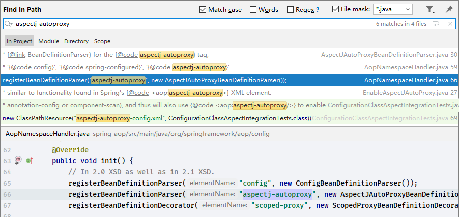
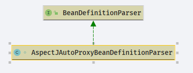

# Spring AOP 如何生效

- Author: [HuiFer](https://github.com/huifer)
- 源码阅读仓库: [SourceHot-Spring](https://github.com/SourceHot/spring-framework-read)

## 解析

- 在使用 Spring AOP 技术的时候会有下面这段代码在 xml 配置文件中出现,来达到 Spring 支持 AOP

```xml
    <aop:aspectj-autoproxy/>
```

- 源码阅读目标找到了,那么怎么去找入口或者对这句话的标签解析方法呢?项目中使用搜索

  

  这样就找到了具体解析方法了

### `org.springframework.aop.config.AspectJAutoProxyBeanDefinitionParser`

- 类图



```java
    @Override
    @Nullable
    public BeanDefinition parse(Element element, ParserContext parserContext) {
        // 注册 <aop:aspectj-autoproxy/>
        AopNamespaceUtils.registerAspectJAnnotationAutoProxyCreatorIfNecessary(parserContext, element);
        // 子类解析
        extendBeanDefinition(element, parserContext);
        return null;
    }

```

```java
    /**
     * 注册 <aop:aspectj-autoproxy/>
     * @param parserContext
     * @param sourceElement
     */
    public static void registerAspectJAnnotationAutoProxyCreatorIfNecessary(
            ParserContext parserContext, Element sourceElement) {

        // 注册或者升级bean
        BeanDefinition beanDefinition = AopConfigUtils.registerAspectJAnnotationAutoProxyCreatorIfNecessary(
                parserContext.getRegistry(), parserContext.extractSource(sourceElement));
        // proxy-target-class 和 expose-proxy 标签处理
        useClassProxyingIfNecessary(parserContext.getRegistry(), sourceElement);
        // 注册组件并且交给监听器
        registerComponentIfNecessary(beanDefinition, parserContext);
    }

```

- `org.springframework.aop.config.AopConfigUtils.registerAspectJAnnotationAutoProxyCreatorIfNecessary(org.springframework.beans.factory.support.BeanDefinitionRegistry, java.lang.Object)`

```java
    @Nullable
    public static BeanDefinition registerAspectJAnnotationAutoProxyCreatorIfNecessary(
            BeanDefinitionRegistry registry, @Nullable Object source) {

        // 注册或者升级 AspectJ
        return registerOrEscalateApcAsRequired(AnnotationAwareAspectJAutoProxyCreator.class, registry, source);
    }

```

- `org.springframework.aop.config.AopConfigUtils.registerOrEscalateApcAsRequired`

```java
    /**
     * 注册或者升级 bean
     * @param cls 类
     * @param registry 注册器
     * @param source 源类
     * @return
     */
    @Nullable
    private static BeanDefinition registerOrEscalateApcAsRequired(
            Class<?> cls, BeanDefinitionRegistry registry, @Nullable Object source) {

        Assert.notNull(registry, "BeanDefinitionRegistry must not be null");

        // 判断注册器是否包含org.springframework.aop.config.internalAutoProxyCreator
        if (registry.containsBeanDefinition(AUTO_PROXY_CREATOR_BEAN_NAME)) {
            // 获取注册器
            BeanDefinition apcDefinition = registry.getBeanDefinition(AUTO_PROXY_CREATOR_BEAN_NAME);
            // 创建新的bean对象
            if (!cls.getName().equals(apcDefinition.getBeanClassName())) {
                int currentPriority = findPriorityForClass(apcDefinition.getBeanClassName());
                int requiredPriority = findPriorityForClass(cls);
                if (currentPriority < requiredPriority) {
                    apcDefinition.setBeanClassName(cls.getName());
                }
            }
            // 即将创建的Bean对象和当前的注册器相同返回null
            return null;
        }

        RootBeanDefinition beanDefinition = new RootBeanDefinition(cls);
        beanDefinition.setSource(source);
        // 设置加载顺序
        beanDefinition.getPropertyValues().add("order", Ordered.HIGHEST_PRECEDENCE);
        beanDefinition.setRole(BeanDefinition.ROLE_INFRASTRUCTURE);
        // 注册bean定义
        registry.registerBeanDefinition(AUTO_PROXY_CREATOR_BEAN_NAME, beanDefinition);
        return beanDefinition;
    }

```

### org.springframework.aop.config.AopNamespaceUtils.useClassProxyingIfNecessary

```java
    /**
     * proxy-target-class 和 expose-proxy 标签处理
     */
    private static void useClassProxyingIfNecessary(BeanDefinitionRegistry registry, @Nullable Element sourceElement) {
        if (sourceElement != null) {
            // 处理 proxy-target-class
            boolean proxyTargetClass = Boolean.parseBoolean(sourceElement.getAttribute(PROXY_TARGET_CLASS_ATTRIBUTE));
            if (proxyTargetClass) {
                AopConfigUtils.forceAutoProxyCreatorToUseClassProxying(registry);
            }
            // 处理 expose-proxy
            boolean exposeProxy = Boolean.parseBoolean(sourceElement.getAttribute(EXPOSE_PROXY_ATTRIBUTE));
            if (exposeProxy) {
                AopConfigUtils.forceAutoProxyCreatorToExposeProxy(registry);
            }
        }
    }

```

- `org.springframework.aop.config.AopConfigUtils.forceAutoProxyCreatorToUseClassProxying`

```java
    public static void forceAutoProxyCreatorToUseClassProxying(BeanDefinitionRegistry registry) {
        if (registry.containsBeanDefinition(AUTO_PROXY_CREATOR_BEAN_NAME)) {
            BeanDefinition definition = registry.getBeanDefinition(AUTO_PROXY_CREATOR_BEAN_NAME);
            definition.getPropertyValues().add("proxyTargetClass", Boolean.TRUE);
        }
    }

```

- `forceAutoProxyCreatorToExposeProxy`方法就不贴出代码了,操作和`forceAutoProxyCreatorToUseClassProxying`一样都是将读取到的数据放入 bean 对象作为一个属性存储

## 总结

- 实现`org.springframework.beans.factory.xml.BeanDefinitionParser`接口的类,多用于对 xml 标签的解析,并且入口为`parse`方法,如果是一个 bean 对象通常会和 Spring 监听器一起出现
