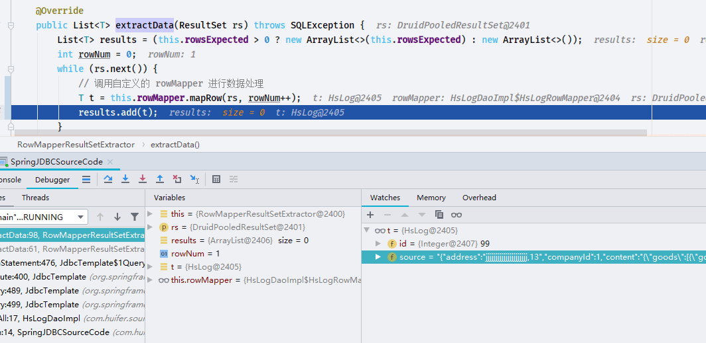

# Spring JDBC

- Author: [HuiFer](https://github.com/huifer)
- 源码阅读仓库: [SourceHot-Spring](https://github.com/SourceHot/spring-framework-read)

## 环境搭建

- 依赖

  ```gradle
      compile(project(":spring-jdbc"))
      compile group: 'com.alibaba', name: 'druid', version: '1.1.21'
      compile group: 'mysql', name: 'mysql-connector-java', version: '5.1.47'
  ```

- db 配置

  ```properties
  jdbc.url=
  jdbc.driverClass=
  jdbc.username=
  jdbc.password=
  ```

- 实体对象

  ```java
  public class HsLog {
      private Integer id;

      private String source;

      public Integer getId() {
          return id;
      }

      public void setId(Integer id) {
          this.id = id;
      }

      public String getSource() {
          return source;
      }

      public void setSource(String source) {
          this.source = source;
      }
  }
  ```

- DAO

  ```java
  public interface HsLogDao {
      List<HsLog> findAll();

      void save(HsLog hsLog);
  }

  ```

- 实现类

  ```java
  public class HsLogDaoImpl extends JdbcDaoSupport implements HsLogDao {


      @Override
      public List<HsLog> findAll() {
          return this.getJdbcTemplate().query("select * from hs_log", new HsLogRowMapper());

      }

      @Override
      public void save(HsLog hsLog) {
          this.getJdbcTemplate().update("insert into hs_log (SOURCE) values(?)"
                  , new Object[]{
                          hsLog.getSource(),
                        }

          );
      }

      class HsLogRowMapper implements RowMapper<HsLog> {

          public HsLog mapRow(ResultSet rs, int rowNum) throws SQLException {

              HsLog log = new HsLog();
              log.setId(rs.getInt("id"));
              log.setSource(rs.getString("source"));
              return log;
          }

      }
  }

  ```

- xml

  ```xml
  <?xml version="1.0" encoding="UTF-8"?>
  <beans xmlns:xsi="http://www.w3.org/2001/XMLSchema-instance"
         xmlns="http://www.springframework.org/schema/beans"
         xmlns:context="http://www.springframework.org/schema/context"
         xsi:schemaLocation="http://www.springframework.org/schema/beans
          http://www.springframework.org/schema/beans/spring-beans.xsd
      http://www.springframework.org/schema/context http://www.springframework.org/schema/context/spring-context-4.2.xsd"
  >

      <context:property-placeholder location="classpath:db.properties"/>


      <bean id="dataSource" class="com.alibaba.druid.pool.DruidDataSource" init-method="init" destroy-method="close">
          <property name="url"
                    value="${jdbc.url}"/>
          <property name="driverClassName" value="${jdbc.driverClass}"/>
          <property name="username" value="${jdbc.username}"/>
          <property name="password" value="${jdbc.password}"/>
          <!-- 配置监控统计拦截的filters -->
          <property name="filters" value="stat"/>

          <!-- 配置初始化大小、最小、最大 -->
          <property name="maxActive" value="20"/>
          <property name="initialSize" value="1"/>
          <property name="minIdle" value="1"/>

          <!-- 配置获取连接等待超时的时间 -->
          <property name="maxWait" value="60000"/>

          <!-- 配置间隔多久才进行一次检测，检测需要关闭的空闲连接，单位是毫秒 -->
          <property name="timeBetweenEvictionRunsMillis" value="60000"/>

          <!-- 配置一个连接在池中最小生存的时间，单位是毫秒 -->
          <property name="minEvictableIdleTimeMillis" value="300000"/>

          <property name="testWhileIdle" value="true"/>
          <property name="testOnBorrow" value="false"/>
          <property name="testOnReturn" value="false"/>

          <!-- 打开PSCache，并且指定每个连接上PSCache的大小 -->
          <property name="poolPreparedStatements" value="true"/>
          <property name="maxOpenPreparedStatements" value="20"/>
      </bean>
      <bean id="jdbcTemplate" class="org.springframework.jdbc.core.JdbcTemplate">
          <property name="dataSource" ref="dataSource"></property>
      </bean>

      <bean id="hsLogDao" class="com.huifer.source.spring.dao.impl.HsLogDaoImpl">
          <property name="jdbcTemplate" ref="jdbcTemplate"/>
      </bean>
  </beans>
  ```

- 运行方法

  ```java

  public class SpringJDBCSourceCode {
      public static void main(String[] args) {
          ApplicationContext applicationContext = new ClassPathXmlApplicationContext("JDBC-demo.xml");
          HsLogDaoImpl bean = applicationContext.getBean(HsLogDaoImpl.class);
          System.out.println(bean.findAll());
          HsLog hsLog = new HsLog();
          hsLog.setSource("jlkjll");
          bean.save(hsLog);

      }
  }

  ```

## 链接对象构造

`Connection con = DataSourceUtils.getConnection(obtainDataSource());`

```java
    public static Connection getConnection(DataSource dataSource) throws CannotGetJdbcConnectionException {
        try {
            return doGetConnection(dataSource);
        }
        catch (SQLException ex) {
            throw new CannotGetJdbcConnectionException("Failed to obtain JDBC Connection", ex);
        }
        catch (IllegalStateException ex) {
            throw new CannotGetJdbcConnectionException("Failed to obtain JDBC Connection: " + ex.getMessage());
        }
    }

```

### org.springframework.jdbc.datasource.DataSourceUtils#doGetConnection

```java
    public static Connection doGetConnection(DataSource dataSource) throws SQLException {
        Assert.notNull(dataSource, "No DataSource specified");

        ConnectionHolder conHolder = (ConnectionHolder) TransactionSynchronizationManager.getResource(dataSource);
        if (conHolder != null && (conHolder.hasConnection() || conHolder.isSynchronizedWithTransaction())) {
            conHolder.requested();
            if (!conHolder.hasConnection()) {
                logger.debug("Fetching resumed JDBC Connection from DataSource");
                // 设置连接对象
                conHolder.setConnection(fetchConnection(dataSource));
            }
            return conHolder.getConnection();
        }
        // Else we either got no holder or an empty thread-bound holder here.

        logger.debug("Fetching JDBC Connection from DataSource");
        // 获取链接
        Connection con = fetchConnection(dataSource);

        // 当前线程支持同步
        if (TransactionSynchronizationManager.isSynchronizationActive()) {
            try {
                // Use same Connection for further JDBC actions within the transaction.
                // Thread-bound object will get removed by synchronization at transaction completion.
                // 在同一个事物中使用同一个链接对象
                ConnectionHolder holderToUse = conHolder;
                if (holderToUse == null) {
                    holderToUse = new ConnectionHolder(con);
                }
                else {
                    holderToUse.setConnection(con);
                }
                // 记录链接数量
                holderToUse.requested();
                TransactionSynchronizationManager.registerSynchronization(
                        new ConnectionSynchronization(holderToUse, dataSource));
                holderToUse.setSynchronizedWithTransaction(true);
                if (holderToUse != conHolder) {
                    TransactionSynchronizationManager.bindResource(dataSource, holderToUse);
                }
            }
            catch (RuntimeException ex) {
                // Unexpected exception from external delegation call -> close Connection and rethrow.
                releaseConnection(con, dataSource);
                throw ex;
            }
        }

        return con;
    }

```

## 释放资源

`releaseConnection(con, dataSource);`

- `org.springframework.jdbc.datasource.DataSourceUtils#releaseConnection`

```java
    public static void releaseConnection(@Nullable Connection con, @Nullable DataSource dataSource) {
        try {
            doReleaseConnection(con, dataSource);
        }
        catch (SQLException ex) {
            logger.debug("Could not close JDBC Connection", ex);
        }
        catch (Throwable ex) {
            logger.debug("Unexpected exception on closing JDBC Connection", ex);
        }
    }

```

```java
public static void doReleaseConnection(@Nullable Connection con, @Nullable DataSource dataSource) throws SQLException {
        if (con == null) {
            return;
        }
        if (dataSource != null) {
            ConnectionHolder conHolder = (ConnectionHolder) TransactionSynchronizationManager.getResource(dataSource);
            if (conHolder != null && connectionEquals(conHolder, con)) {
                // It's the transactional Connection: Don't close it.
                // 连接数-1
                conHolder.released();
                return;
            }
        }
        // 处理其他情况
        doCloseConnection(con, dataSource);
    }
```

### org.springframework.transaction.support.ResourceHolderSupport

链接数

```java
    /**
     * Increase the reference count by one because the holder has been requested
     * (i.e. someone requested the resource held by it).
     */
    public void requested() {
        this.referenceCount++;
    }

    /**
     * Decrease the reference count by one because the holder has been released
     * (i.e. someone released the resource held by it).
     */
    public void released() {
        this.referenceCount--;
    }
```

## 查询解析

### org.springframework.jdbc.core.JdbcTemplate

```XML
    <bean id="jdbcTemplate" class="org.springframework.jdbc.core.JdbcTemplate">
        <property name="dataSource" ref="dataSource"></property>
    </bean>

```

- 从配置中可以知道 JdbcTemplate 需要 dataSource 属性, 就从这里开始讲起
- `org.springframework.jdbc.support.JdbcAccessor.setDataSource`, 这段代码就只做了赋值操作(依赖注入)

```java
public void setDataSource(@Nullable DataSource dataSource) {
        this.dataSource = dataSource;
    }
```

- 下面`hsLogDao`也是依赖注入本篇不做详细讲述。

### org.springframework.jdbc.core.JdbcTemplate#query(java.lang.String, org.springframework.jdbc.core.RowMapper<T>)

```java
    @Override
    public List<HsLog> findAll() {
        return this.getJdbcTemplate().query("select * from hs_log", new HsLogRowMapper());
    }

```

```java
    @Override
    @Nullable
    public <T> T query(final String sql, final ResultSetExtractor<T> rse) throws DataAccessException {
        Assert.notNull(sql, "SQL must not be null");
        Assert.notNull(rse, "ResultSetExtractor must not be null");
        if (logger.isDebugEnabled()) {
            logger.debug("Executing SQL query [" + sql + "]");
        }

        /**
         * Callback to execute the query.
         */
        class QueryStatementCallback implements StatementCallback<T>, SqlProvider {
            @Override
            @Nullable
            public T doInStatement(Statement stmt) throws SQLException {
                ResultSet rs = null;
                try {
                    // 执行sql
                    rs = stmt.executeQuery(sql);
                    // 1. org.springframework.jdbc.core.RowMapperResultSetExtractor.extractData
                    return rse.extractData(rs);
                }
                finally {
                    JdbcUtils.closeResultSet(rs);
                }
            }

            @Override
            public String getSql() {
                return sql;
            }
        }

        return execute(new QueryStatementCallback());
    }

```

```java
	@Override
    @Nullable
    public <T> T execute(StatementCallback<T> action) throws DataAccessException {
        Assert.notNull(action, "Callback object must not be null");

        Connection con = DataSourceUtils.getConnection(obtainDataSource());
        Statement stmt = null;
        try {
            stmt = con.createStatement();
            applyStatementSettings(stmt);
            // 执行
            T result = action.doInStatement(stmt);
            handleWarnings(stmt);
            return result;
        }
        catch (SQLException ex) {
            // Release Connection early, to avoid potential connection pool deadlock
            // in the case when the exception translator hasn't been initialized yet.
            String sql = getSql(action);
            JdbcUtils.closeStatement(stmt);
            stmt = null;
            DataSourceUtils.releaseConnection(con, getDataSource());
            con = null;
            throw translateException("StatementCallback", sql, ex);
        }
        finally {
            JdbcUtils.closeStatement(stmt);
            DataSourceUtils.releaseConnection(con, getDataSource());
        }
    }
```

```java
    @Override
    public List<T> extractData(ResultSet rs) throws SQLException {
        List<T> results = (this.rowsExpected > 0 ? new ArrayList<>(this.rowsExpected) : new ArrayList<>());
        int rowNum = 0;
        while (rs.next()) {
            // 调用自定义的 rowMapper 进行数据处理
            T t = this.rowMapper.mapRow(rs, rowNum++);
            results.add(t);
        }
        return results;
    }

```



这样就可以获取到了

方法`result`没有什么操作直接返回即可

```java
    private static <T> T result(@Nullable T result) {
        Assert.state(result != null, "No result");
        return result;
    }
```

## 插入解析

```java
@Override
    public void save(HsLog hsLog) {
        this.getJdbcTemplate().update("insert into hs_log (SOURCE) values(?)"
                , new Object[]{
                        hsLog.getSource(),
                      }

        );
    }
```

`org.springframework.jdbc.core.JdbcTemplate#update(org.springframework.jdbc.core.PreparedStatementCreator, org.springframework.jdbc.core.PreparedStatementSetter)`

```java
    protected int update(final PreparedStatementCreator psc, @Nullable final PreparedStatementSetter pss)
            throws DataAccessException {

        logger.debug("Executing prepared SQL update");

        return updateCount(execute(psc, ps -> {
            try {
                if (pss != null) {
                    // 设置请求参数
                   pss.setValues(ps);
                }
                int rows = ps.executeUpdate();
                if (logger.isTraceEnabled()) {
                    logger.trace("SQL update affected " + rows + " rows");
                }
                return rows;
            }
            finally {
                if (pss instanceof ParameterDisposer) {
                    ((ParameterDisposer) pss).cleanupParameters();
                }
            }
        }));
    }

```
