# Spring RMI

- Author: [HuiFer](https://github.com/huifer)
- 源码阅读仓库: [SourceHot-Spring](https://github.com/SourceHot/spring-framework-read)
- Spring 远程服务调用

## DEMO

### 服务提供方

- 服务提供方需要准备**接口**、**接口实现泪**
- 接口

```java
public interface IDemoRmiService {
    int add(int a, int b);
}

```

- 接口实现

```java
public class IDemoRmiServiceImpl implements IDemoRmiService {
    @Override
    public int add(int a, int b) {
        return a + b;
    }
}
```

- xml 配置文件

```xml
<?xml version="1.0" encoding="UTF-8"?>
<beans xmlns:xsi="http://www.w3.org/2001/XMLSchema-instance"
       xmlns="http://www.springframework.org/schema/beans"
       xsi:schemaLocation="http://www.springframework.org/schema/beans http://www.springframework.org/schema/beans/spring-beans.xsd">

    <bean id="demoRmiService" class="com.huifer.source.spring.rmi.impl.IDemoRmiServiceImpl"/>
    <bean id="demoRmi" class="org.springframework.remoting.rmi.RmiServiceExporter">
        <!--        服务-->
        <property name="service" ref="demoRmiService"/>
        <!--        服务名称-->
        <property name="serviceName" value="springRmi"/>
        <!--        服务接口-->
        <property name="serviceInterface" value="com.huifer.source.spring.rmi.IDemoRmiService"/>
        <!--        注册端口-->
        <property name="registryPort" value="9999"/>
    </bean>
</beans>
```

- 运行

```java
public class RMIServerSourceCode {
    public static void main(String[] args) throws Exception {
        ClassPathXmlApplicationContext context = new ClassPathXmlApplicationContext("rmi/RMISourceCode.xml");
    }
}

```

### 服务调用方

- xml 配置

```java
<?xml version="1.0" encoding="UTF-8"?>
<beans xmlns="http://www.springframework.org/schema/beans"
       xmlns:xsi="http://www.w3.org/2001/XMLSchema-instance"
       xsi:schemaLocation="http://www.springframework.org/schema/beans http://www.springframework.org/schema/beans/spring-beans.xsd">

    <bean id="rmiClient" class="org.springframework.remoting.rmi.RmiProxyFactoryBean">
        <property name="serviceUrl" value="rmi://localhost:9999/springRmi"/>
        <property name="serviceInterface" value="com.huifer.source.spring.rmi.IDemoRmiService"/>
    </bean>


</beans>
```

**注意:rmi 使用小写**
大写报错信息:

```text
Exception in thread "main" org.springframework.beans.factory.BeanCreationException: Error creating bean with name 'rmiClient' defined in class path resource [rmi/RMIClientSourceCode.xml]: Invocation of init method failed; nested exception is org.springframework.remoting.RemoteLookupFailureException: Service URL [RMI://localhost:9999/springRmi] is invalid; nested exception is java.net.MalformedURLException: invalid URL scheme: RMI://localhost:9999/springRmi
	at org.springframework.beans.factory.support.AbstractAutowireCapableBeanFactory.initializeBean(AbstractAutowireCapableBeanFactory.java:1795)
	at org.springframework.beans.factory.support.AbstractAutowireCapableBeanFactory.doCreateBean(AbstractAutowireCapableBeanFactory.java:559)
	at org.springframework.beans.factory.support.AbstractAutowireCapableBeanFactory.createBean(AbstractAutowireCapableBeanFactory.java:478)
	at org.springframework.beans.factory.support.AbstractBeanFactory.lambda$doGetBean$0(AbstractBeanFactory.java:309)
	at org.springframework.beans.factory.support.DefaultSingletonBeanRegistry.getSingleton(DefaultSingletonBeanRegistry.java:272)
	at org.springframework.beans.factory.support.AbstractBeanFactory.doGetBean(AbstractBeanFactory.java:306)
	at org.springframework.beans.factory.support.AbstractBeanFactory.getBean(AbstractBeanFactory.java:176)
	at org.springframework.beans.factory.support.DefaultListableBeanFactory.preInstantiateSingletons(DefaultListableBeanFactory.java:877)
	at org.springframework.context.support.AbstractApplicationContext.finishBeanFactoryInitialization(AbstractApplicationContext.java:953)
	at org.springframework.context.support.AbstractApplicationContext.refresh(AbstractApplicationContext.java:579)
	at org.springframework.context.support.ClassPathXmlApplicationContext.<init>(ClassPathXmlApplicationContext.java:163)
	at org.springframework.context.support.ClassPathXmlApplicationContext.<init>(ClassPathXmlApplicationContext.java:90)
	at com.huifer.source.spring.rmi.RMIClientSourceCode.main(RMIClientSourceCode.java:7)
Caused by: org.springframework.remoting.RemoteLookupFailureException: Service URL [RMI://localhost:9999/springRmi] is invalid; nested exception is java.net.MalformedURLException: invalid URL scheme: RMI://localhost:9999/springRmi
	at org.springframework.remoting.rmi.RmiClientInterceptor.lookupStub(RmiClientInterceptor.java:209)
	at org.springframework.remoting.rmi.RmiClientInterceptor.prepare(RmiClientInterceptor.java:147)
	at org.springframework.remoting.rmi.RmiClientInterceptor.afterPropertiesSet(RmiClientInterceptor.java:134)
	at org.springframework.remoting.rmi.RmiProxyFactoryBean.afterPropertiesSet(RmiProxyFactoryBean.java:68)
	at org.springframework.beans.factory.support.AbstractAutowireCapableBeanFactory.invokeInitMethods(AbstractAutowireCapableBeanFactory.java:1868)
	at org.springframework.beans.factory.support.AbstractAutowireCapableBeanFactory.initializeBean(AbstractAutowireCapableBeanFactory.java:1791)
	... 12 more
Caused by: java.net.MalformedURLException: invalid URL scheme: RMI://localhost:9999/springRmi
	at java.rmi.Naming.intParseURL(Naming.java:290)
	at java.rmi.Naming.parseURL(Naming.java:237)
	at java.rmi.Naming.lookup(Naming.java:96)
	at org.springframework.remoting.rmi.RmiClientInterceptor.lookupStub(RmiClientInterceptor.java:201)
	... 17 more

```

- 运行

```java
public class RMIClientSourceCode {
    public static void main(String[] args) {
        ClassPathXmlApplicationContext context = new ClassPathXmlApplicationContext("rmi/RMIClientSourceCode.xml");
        IDemoRmiService rmiClient = context.getBean("rmiClient", IDemoRmiService.class);
        int add = rmiClient.add(1, 2);
        System.out.println(add);
    }
}
```

---

## 服务端初始化

- `org.springframework.remoting.rmi.RmiServiceExporter`,该类定义了 spring 的远程服务信息

### RmiServiceExporter

- 基础属性如下

```java
 public class RmiServiceExporter extends RmiBasedExporter implements InitializingBean, DisposableBean {
/**
     * 服务名称,rmi的服务名,在Spring中使用ref指向impl实现类
     */
    private String serviceName;

    /**
     *
     */
    private int servicePort = 0;  // anonymous port

    private RMIClientSocketFactory clientSocketFactory;

    private RMIServerSocketFactory serverSocketFactory;

    private Registry registry;

    /**
     * 注册的IP地址
     */
    private String registryHost;

    /**
     * 注册的端口
     */
    private int registryPort = Registry.REGISTRY_PORT;

    /**
     * 进行远程对象调用的Socket工厂
     */
    private RMIClientSocketFactory clientSocketFactory;

    /**
     * 接收远程调用服务端的Socket工厂
     */
    private RMIServerSocketFactory serverSocketFactory;

    /**
     * true: 该参数在获取{@link Registry}时测试是否建立连接,如果建立连接则直接使用,否则创建新连接
     * 是否总是创建{@link Registry}
     */
    private boolean alwaysCreateRegistry = false;

    /**
     * 设置替换RMI注册表中的绑定关系
     */
    private boolean replaceExistingBinding = true;

    private Remote exportedObject;

    /**
     * 创建{@link Registry}
     */
    private boolean createdRegistry = false;
}
```

- 属性设置不说了,看接口实现了那些
  1. InitializingBean: 初始化 bean 调用`afterPropertiesSet`方法
  2. DisposableBean: 摧毁 bean 调用`destroy`方法

```java

    @Override
    public void afterPropertiesSet() throws RemoteException {
        prepare();
    }


    public void prepare() throws RemoteException {
        // 校验service
        checkService();

        // 服务名称校验
        if (this.serviceName == null) {
            throw new IllegalArgumentException("Property 'serviceName' is required");
        }

        // Check socket factories for exported object.
        if (this.clientSocketFactory instanceof RMIServerSocketFactory) {
            this.serverSocketFactory = (RMIServerSocketFactory) this.clientSocketFactory;
        }
        if ((this.clientSocketFactory != null && this.serverSocketFactory == null) ||
                (this.clientSocketFactory == null && this.serverSocketFactory != null)) {
            throw new IllegalArgumentException(
                    "Both RMIClientSocketFactory and RMIServerSocketFactory or none required");
        }

        // Check socket factories for RMI registry.
        if (this.registryClientSocketFactory instanceof RMIServerSocketFactory) {
            this.registryServerSocketFactory = (RMIServerSocketFactory) this.registryClientSocketFactory;
        }
        if (this.registryClientSocketFactory == null && this.registryServerSocketFactory != null) {
            throw new IllegalArgumentException(
                    "RMIServerSocketFactory without RMIClientSocketFactory for registry not supported");
        }

        this.createdRegistry = false;

        // Determine RMI registry to use.
        if (this.registry == null) {
            // registry 获取
            this.registry = getRegistry(this.registryHost, this.registryPort,
                    this.registryClientSocketFactory, this.registryServerSocketFactory);
            this.createdRegistry = true;
        }

        // Initialize and cache exported object.
        // 初始化并且获取缓存的object
        this.exportedObject = getObjectToExport();

        if (logger.isDebugEnabled()) {
            logger.debug("Binding service '" + this.serviceName + "' to RMI registry: " + this.registry);
        }

        // Export RMI object.
        // 导出RMI object
        if (this.clientSocketFactory != null) {
            UnicastRemoteObject.exportObject(
                    this.exportedObject, this.servicePort, this.clientSocketFactory, this.serverSocketFactory);
        }
        else {
            UnicastRemoteObject.exportObject(this.exportedObject, this.servicePort);
        }

        // Bind RMI object to registry.
        // 对象绑定,把serviceName 和 到处的RMI对象进行绑定,JDK实现
        try {
            if (this.replaceExistingBinding) {
                this.registry.rebind(this.serviceName, this.exportedObject);
            }
            else {
                this.registry.bind(this.serviceName, this.exportedObject);
            }
        }
        catch (AlreadyBoundException ex) {
            // Already an RMI object bound for the specified service name...
            unexportObjectSilently();
            throw new IllegalStateException(
                    "Already an RMI object bound for name '" + this.serviceName + "': " + ex.toString());
        }
        catch (RemoteException ex) {
            // Registry binding failed: let's unexport the RMI object as well.
            unexportObjectSilently();
            throw ex;
        }
    }

```

#### checkService

- 校验 service 是否为空

```java
    /**
     * Check whether the service reference has been set.
     *
     * 校验service
     * @see #setService
     */
    protected void checkService() throws IllegalArgumentException {
        Assert.notNull(getService(), "Property 'service' is required");
    }
```

#### getRegistry

- 获取 Registry 实例
  - 简单说就是通过 host 和 port 创建 socket

```java
    protected Registry getRegistry(String registryHost, int registryPort,
                                   @Nullable RMIClientSocketFactory clientSocketFactory, @Nullable RMIServerSocketFactory serverSocketFactory)
            throws RemoteException {

        if (registryHost != null) {
            // Host explicitly specified: only lookup possible.
            if (logger.isDebugEnabled()) {
                logger.debug("Looking for RMI registry at port '" + registryPort + "' of host [" + registryHost + "]");
            }
            // 通过 host port socket创建
            Registry reg = LocateRegistry.getRegistry(registryHost, registryPort, clientSocketFactory);
            testRegistry(reg);
            return reg;
        }

        else {
            return getRegistry(registryPort, clientSocketFactory, serverSocketFactory);
        }
    }
```

#### getObjectToExport

- 初始化并且获取缓存的 object

```java
    protected Remote getObjectToExport() {
        // determine remote object
        if (getService() instanceof Remote &&
                (getServiceInterface() == null || Remote.class.isAssignableFrom(getServiceInterface()))) {
            // conventional RMI service
            // 获取service
            return (Remote) getService();
        }
        else {
            // RMI invoker
            if (logger.isDebugEnabled()) {
                logger.debug("RMI service [" + getService() + "] is an RMI invoker");
            }
            // RMI 包装类
            /**
             * 1. getProxyForService() 获取代理的接口
             * 2. 创建RMI包装对象 RmiInvocationWrapper
             */
            return new RmiInvocationWrapper(getProxyForService(), this);
        }
    }

```

#### getProxyForService

- 获取代理服务

```java
    protected Object getProxyForService() {
        //  service 校验
        checkService();
        // 校验接口
        checkServiceInterface();

        // 代理工厂
        ProxyFactory proxyFactory = new ProxyFactory();
        // 添加代理接口
        proxyFactory.addInterface(getServiceInterface());

        if (this.registerTraceInterceptor != null ? this.registerTraceInterceptor : this.interceptors == null) {
            // 添加切面
            proxyFactory.addAdvice(new RemoteInvocationTraceInterceptor(getExporterName()));
        }
        if (this.interceptors != null) {
            AdvisorAdapterRegistry adapterRegistry = GlobalAdvisorAdapterRegistry.getInstance();
            for (Object interceptor : this.interceptors) {
                proxyFactory.addAdvisor(adapterRegistry.wrap(interceptor));
            }
        }
        // 设置代理类
        proxyFactory.setTarget(getService());

        proxyFactory.setOpaque(true);

        // 获取代理对象
        return proxyFactory.getProxy(getBeanClassLoader());
    }

```

- 这里要注意,切片方法的`invoke`调用
- `RmiInvocationWrapper`的`invoke`方法会在调用方调用接口时候触发

#### rebind 和 bind

- 绑定和重新绑定
- 这部分源码在: `sun.rmi.registry.RegistryImpl`

```java
    public void rebind(String var1, Remote var2) throws RemoteException, AccessException {
        checkAccess("Registry.rebind");
        this.bindings.put(var1, var2);
    }


```

```java
    public void bind(String var1, Remote var2) throws RemoteException, AlreadyBoundException, AccessException {
        checkAccess("Registry.bind");
        synchronized(this.bindings) {
            Remote var4 = (Remote)this.bindings.get(var1);
            if (var4 != null) {
                throw new AlreadyBoundException(var1);
            } else {
                this.bindings.put(var1, var2);
            }
        }
    }
```

- 共同维护` private Hashtable<String, Remote> bindings = new Hashtable(101);`这个对象

#### unexportObjectSilently

- 出现异常时候调用方法

```java

    private void unexportObjectSilently() {
        try {
            UnicastRemoteObject.unexportObject(this.exportedObject, true);
        }
        catch (NoSuchObjectException ex) {
            if (logger.isInfoEnabled()) {
                logger.info("RMI object for service '" + this.serviceName + "' is not exported anymore", ex);
            }
        }
    }

```

---

## 客户端初始化

### RmiProxyFactoryBean

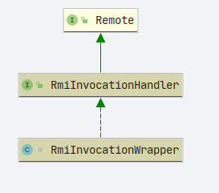

- 该类实现了`InitializingBean`接口直接看`afterPropertiesSet`方法

- `org.springframework.remoting.rmi.RmiProxyFactoryBean`

  - ```java
        @Override
        public void afterPropertiesSet() {
            super.afterPropertiesSet();
            Class<?> ifc = getServiceInterface();
            Assert.notNull(ifc, "Property 'serviceInterface' is required");
            this.serviceProxy = new ProxyFactory(ifc, this).getProxy(getBeanClassLoader());
        }
    ```

  - `org.springframework.remoting.rmi.RmiClientInterceptor#afterPropertiesSet`

    - ```java
          @Override
          public void afterPropertiesSet() {
              super.afterPropertiesSet();
              prepare();
          }
      ```

    - `org.springframework.remoting.support.UrlBasedRemoteAccessor#afterPropertiesSet`

      - ```java
            @Override
            public void afterPropertiesSet() {
                if (getServiceUrl() == null) {
                    throw new IllegalArgumentException("Property 'serviceUrl' is required");
                }
            }

        ```

### org.springframework.remoting.support.UrlBasedRemoteAccessor#afterPropertiesSet

- 该方法对 `serviceUrl`进行空判断，如果是空的抛出异常

```java
    /**
     * 判断服务地址是否为空
     */
    @Override
    public void afterPropertiesSet() {
        if (getServiceUrl() == null) {
            throw new IllegalArgumentException("Property 'serviceUrl' is required");
        }
    }
```

### org.springframework.remoting.rmi.RmiClientInterceptor#afterPropertiesSet

```java
    @Override
    public void afterPropertiesSet() {
        super.afterPropertiesSet();
        prepare();
    }
```

1. 调用父类的`afterPropertiesSet`方法判断`serviceUrl`是否为空
2. 执行`prepare()`方法

```java
    public void prepare() throws RemoteLookupFailureException {
        // Cache RMI stub on initialization?
        if (this.lookupStubOnStartup) {
            // 获取remote对象
            Remote remoteObj = lookupStub();
            if (logger.isDebugEnabled()) {
                if (remoteObj instanceof RmiInvocationHandler) {
                    logger.debug("RMI stub [" + getServiceUrl() + "] is an RMI invoker");
                }
                else if (getServiceInterface() != null) {
                    // 是否接口
                    boolean isImpl = getServiceInterface().isInstance(remoteObj);
                    logger.debug("Using service interface [" + getServiceInterface().getName() +
                            "] for RMI stub [" + getServiceUrl() + "] - " +
                            (!isImpl ? "not " : "") + "directly implemented");
                }
            }
            if (this.cacheStub) {
                this.cachedStub = remoteObj;
            }
        }
    }

```

#### org.springframework.remoting.rmi.RmiClientInterceptor#lookupStub

```java
protected Remote lookupStub() throws RemoteLookupFailureException {
        try {
            Remote stub = null;
            if (this.registryClientSocketFactory != null) {
                // RMIClientSocketFactory specified for registry access.
                // Unfortunately, due to RMI API limitations, this means
                // that we need to parse the RMI URL ourselves and perform
                // straight LocateRegistry.getRegistry/Registry.lookup calls.
                // 通过 serviceUrl 创建 URL
                URL url = new URL(null, getServiceUrl(), new DummyURLStreamHandler());
                // url 的协议
                String protocol = url.getProtocol();
                if (protocol != null && !"rmi".equals(protocol)) {
                    throw new MalformedURLException("Invalid URL scheme '" + protocol + "'");
                }
                // 获取host
                String host = url.getHost();
                // 获取port
                int port = url.getPort();
                // 获取serviceName
                String name = url.getPath();
                if (name != null && name.startsWith("/")) {
                    name = name.substring(1);
                }
                // 创建 Registry
                Registry registry = LocateRegistry.getRegistry(host, port, this.registryClientSocketFactory);
                // 获取Remote
                stub = registry.lookup(name);
            }
            else {
                // Can proceed with standard RMI lookup API...
                stub = Naming.lookup(getServiceUrl());
            }
            if (logger.isDebugEnabled()) {
                logger.debug("Located RMI stub with URL [" + getServiceUrl() + "]");
            }
            return stub;
        }
        catch (MalformedURLException ex) {
            throw new RemoteLookupFailureException("Service URL [" + getServiceUrl() + "] is invalid", ex);
        }
        catch (NotBoundException ex) {
            throw new RemoteLookupFailureException(
                    "Could not find RMI service [" + getServiceUrl() + "] in RMI registry", ex);
        }
        catch (RemoteException ex) {
            throw new RemoteLookupFailureException("Lookup of RMI stub failed", ex);
        }
    }
```

### org.springframework.remoting.rmi.RmiProxyFactoryBean#afterPropertiesSet

```java
    @Override
    public void afterPropertiesSet() {
        super.afterPropertiesSet();
        // 获取 服务提供的接口
        Class<?> ifc = getServiceInterface();
        // 如果服务接口不为空
        Assert.notNull(ifc, "Property 'serviceInterface' is required");
        // 创建服务代理
        this.serviceProxy = new ProxyFactory(ifc, this).getProxy(getBeanClassLoader());
    }

```

### 增强调用

- 通过类图我们可以知道`RmiProxyFactoryBean`实现了`MethodInterceptor`,具体实现方法在`org.springframework.remoting.rmi.RmiClientInterceptor#invoke`

```java
    @Override
    public Object invoke(MethodInvocation invocation) throws Throwable {
        // 获取remote
        Remote stub = getStub();
        try {
            // 真正的invoke调用
            return doInvoke(invocation, stub);
        }
        catch (RemoteConnectFailureException ex) {
            return handleRemoteConnectFailure(invocation, ex);
        }
        catch (RemoteException ex) {
            if (isConnectFailure(ex)) {
                return handleRemoteConnectFailure(invocation, ex);
            }
            else {
                throw ex;
            }
        }
    }

```

```java
    protected Remote getStub() throws RemoteLookupFailureException {
        if (!this.cacheStub || (this.lookupStubOnStartup && !this.refreshStubOnConnectFailure)) {
            // 如果缓存stub存在直接获取,否则创建
            return (this.cachedStub != null ? this.cachedStub : lookupStub());
        }
        else {
            synchronized (this.stubMonitor) {
                if (this.cachedStub == null) {
                    this.cachedStub = lookupStub();
                }
                return this.cachedStub;
            }
        }
    }
```

- `org.springframework.remoting.rmi.RmiClientInterceptor#doInvoke(org.aopalliance.intercept.MethodInvocation, org.springframework.remoting.rmi.RmiInvocationHandler)`

```java
    @Nullable
    protected Object doInvoke(MethodInvocation methodInvocation, RmiInvocationHandler invocationHandler)
            throws RemoteException, NoSuchMethodException, IllegalAccessException, InvocationTargetException {

        if (AopUtils.isToStringMethod(methodInvocation.getMethod())) {
            return "RMI invoker proxy for service URL [" + getServiceUrl() + "]";
        }

        /**
         * 1. 参数组装成对象{@link RemoteInvocationBasedAccessor#createRemoteInvocation(org.aopalliance.intercept.MethodInvocation)}
         * 2. invoke 执行 简单来说就是调用{@link RmiInvocationHandler#invoke(RemoteInvocation)}方法
         */
        return invocationHandler.invoke(createRemoteInvocation(methodInvocation));
    }
```

- `RmiInvocationHandler`类图


最后的`invoke`方法

- `org.springframework.remoting.rmi.RmiInvocationWrapper#invoke`

  ```java
      /**
       * Delegates the actual invocation handling to the RMI exporter.
       *
       *
       * 远程调用的时候会执行
       * @see RmiBasedExporter#invoke(org.springframework.remoting.support.RemoteInvocation, Object)
       */
      @Override
      @Nullable
      public Object invoke(RemoteInvocation invocation)
              throws RemoteException, NoSuchMethodException, IllegalAccessException, InvocationTargetException {

          return this.rmiExporter.invoke(invocation, this.wrappedObject);
      }
  ```

  - 继续跟踪`org.springframework.remoting.rmi.RmiBasedExporter#invoke`

    ```java
        @Override
        protected Object invoke(RemoteInvocation invocation, Object targetObject)
                throws NoSuchMethodException, IllegalAccessException, InvocationTargetException {

            return super.invoke(invocation, targetObject);
        }
    ```

    - 继续跟踪`org.springframework.remoting.support.RemoteInvocationBasedExporter#invoke`

      ```java
          protected Object invoke(RemoteInvocation invocation, Object targetObject)
                  throws NoSuchMethodException, IllegalAccessException, InvocationTargetException {

              if (logger.isTraceEnabled()) {
                  logger.trace("Executing " + invocation);
              }
              try {
                  return getRemoteInvocationExecutor().invoke(invocation, targetObject);
              }
              catch (NoSuchMethodException ex) {
                  if (logger.isDebugEnabled()) {
                      logger.debug("Could not find target method for " + invocation, ex);
                  }
                  throw ex;
              }
              catch (IllegalAccessException ex) {
                  if (logger.isDebugEnabled()) {
                      logger.debug("Could not access target method for " + invocation, ex);
                  }
                  throw ex;
              }
              catch (InvocationTargetException ex) {
                  if (logger.isDebugEnabled()) {
                      logger.debug("Target method failed for " + invocation, ex.getTargetException());
                  }
                  throw ex;
              }
          }

      ```

- 关键语句**`return getRemoteInvocationExecutor().invoke(invocation, targetObject);`**

类图

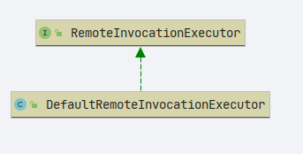

```java
public class DefaultRemoteInvocationExecutor implements RemoteInvocationExecutor {

    @Override
    public Object invoke(RemoteInvocation invocation, Object targetObject)
            throws NoSuchMethodException, IllegalAccessException, InvocationTargetException {

        Assert.notNull(invocation, "RemoteInvocation must not be null");
        Assert.notNull(targetObject, "Target object must not be null");
        return invocation.invoke(targetObject);
    }

}
```

```java
    public Object invoke(Object targetObject)
            throws NoSuchMethodException, IllegalAccessException, InvocationTargetException {

        Method method = targetObject.getClass().getMethod(this.methodName, this.parameterTypes);
        return method.invoke(targetObject, this.arguments);
    }
```

- 这部分流程相对清晰,从对象中获取函数,调用这个函数

---

## 服务端 debug

- `org.springframework.remoting.rmi.RmiServiceExporter#afterPropertiesSet`打上断点

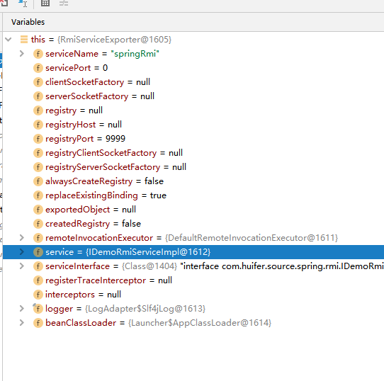

可以看到此时的数据字段和我们的 xml 配置中一致

- `org.springframework.remoting.rmi.RmiServiceExporter#prepare`断点

  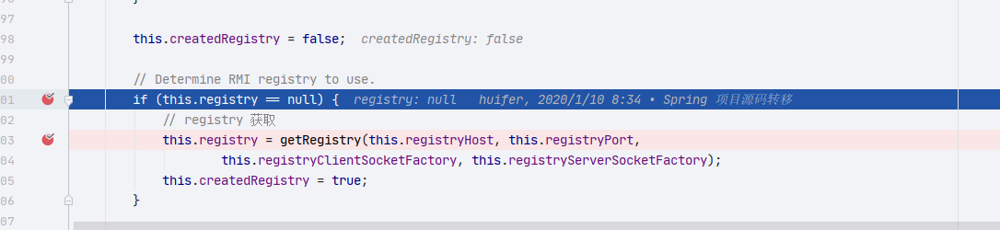

  往下一直走

  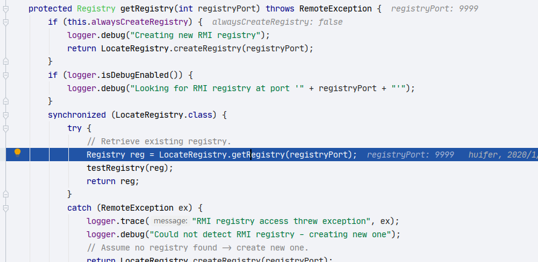

  ​ 这一行是 jdk 的就不进去看了

  执行完成就创建出了 `Registry`

  

- `org.springframework.remoting.rmi.RmiBasedExporter#getObjectToExport`

  直接看结果对象

  

- 执行 bind

  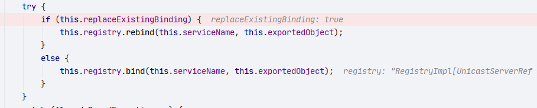

  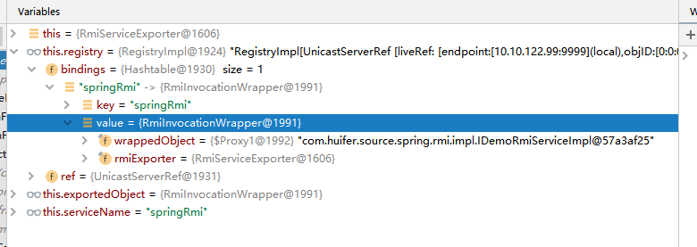

- 此时服务端信息已经成功记录并且启动

## 客户端 debug

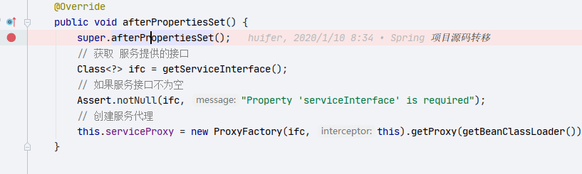

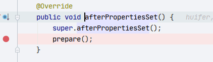

remote 对象

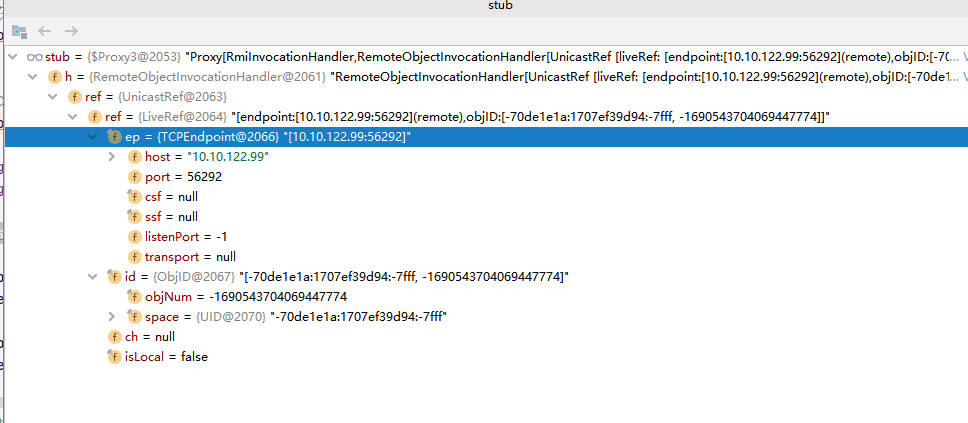

- 服务提供接口


- serviceProxy

  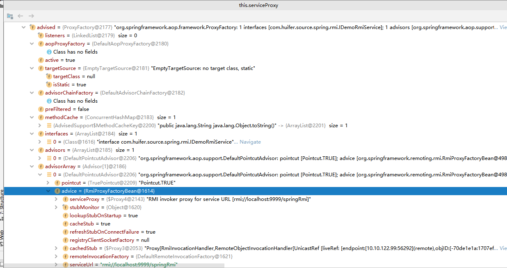

- 方法调用
  - 使用的是 AOP 技术进行的，AOP 相关技术不在此处展开

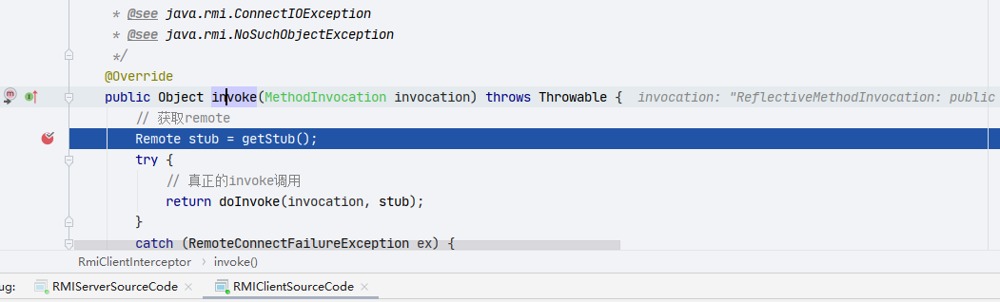

stub 对象

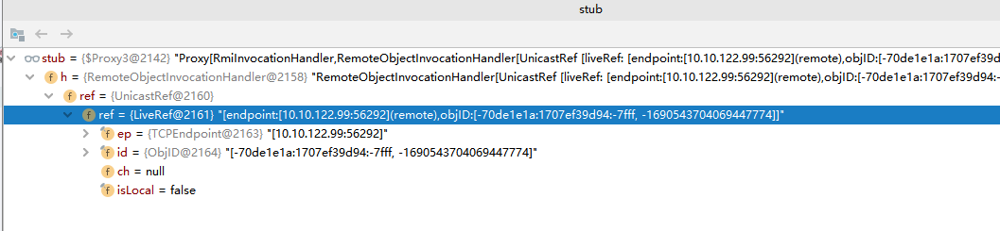

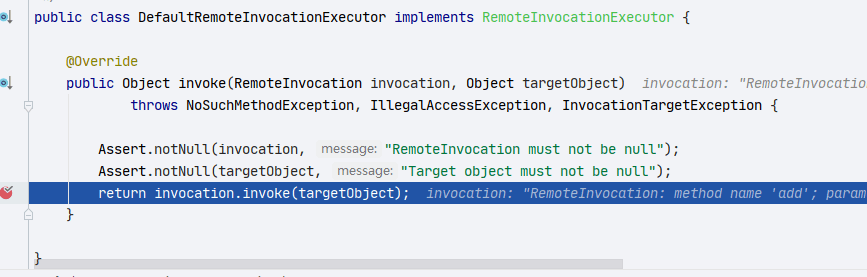

- `invocation`

  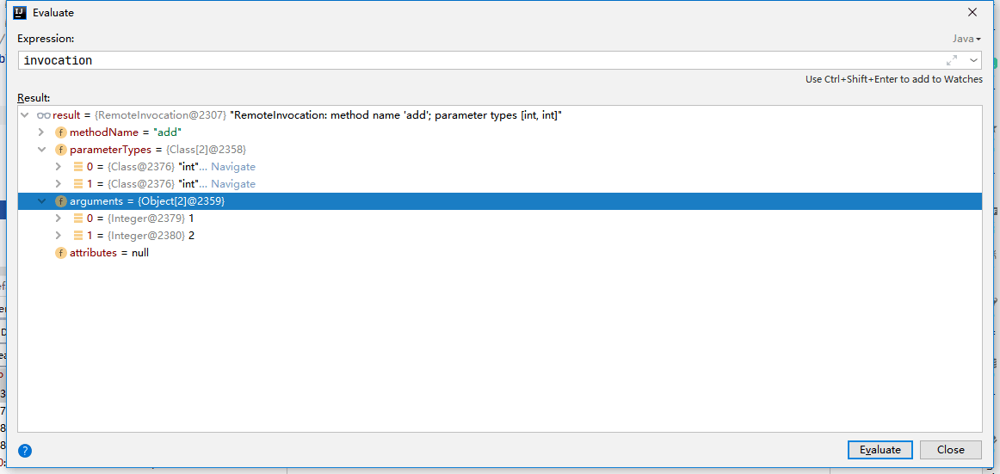

- `targetObject`

  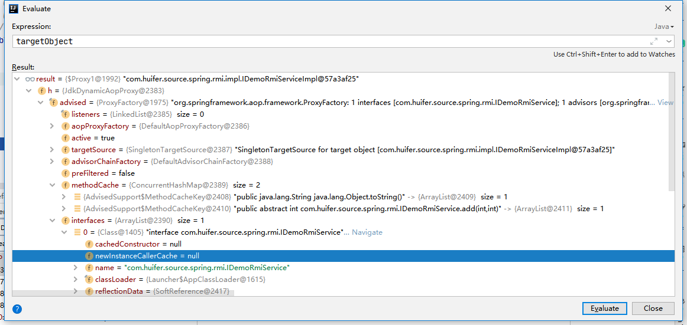

- 反射执行`method`结束整个调用

  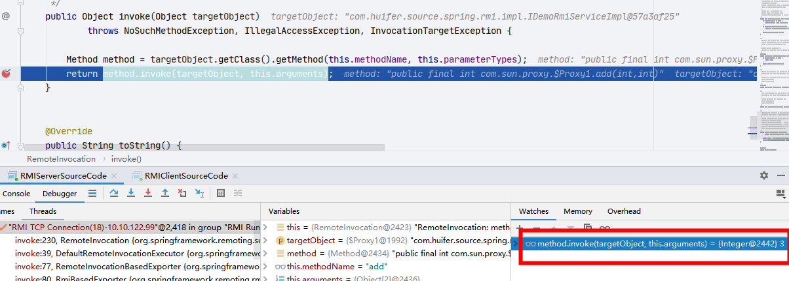

  此时得到结果 RMI 调用结束
