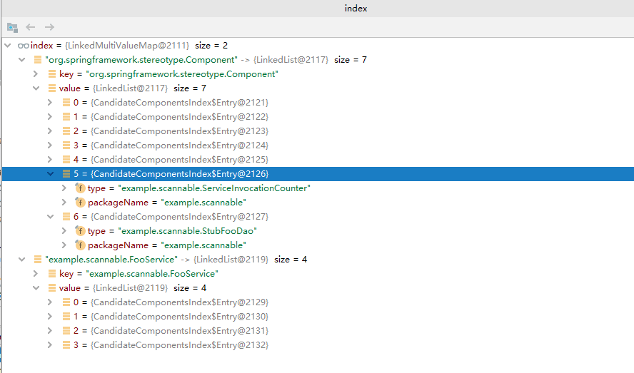

# Spring5 新特性 - spring.components

- Author: [HuiFer](https://github.com/huifer)
- 源码阅读仓库: [SourceHot-Spring](https://github.com/SourceHot/spring-framework-read)

## 解析

- 相关类: `org.springframework.context.index.CandidateComponentsIndexLoader`
- 测试用例: `org.springframework.context.annotation.ClassPathScanningCandidateComponentProviderTests.defaultsWithIndex`,`org.springframework.context.index.CandidateComponentsIndexLoaderTests`
- `CandidateComponentsIndexLoader`是怎么找出来的,全文搜索`spring.components`

### 使用介绍

- 下面是从`resources/example/scannable/spring.components`测试用例中复制过来的,从中可以发现等号左侧放的是我们写的组件,等号右边是属于什么组件

```
example.scannable.AutowiredQualifierFooService=example.scannable.FooService
example.scannable.DefaultNamedComponent=org.springframework.stereotype.Component
example.scannable.NamedComponent=org.springframework.stereotype.Component
example.scannable.FooService=example.scannable.FooService
example.scannable.FooServiceImpl=org.springframework.stereotype.Component,example.scannable.FooService
example.scannable.ScopedProxyTestBean=example.scannable.FooService
example.scannable.StubFooDao=org.springframework.stereotype.Component
example.scannable.NamedStubDao=org.springframework.stereotype.Component
example.scannable.ServiceInvocationCounter=org.springframework.stereotype.Component
example.scannable.sub.BarComponent=org.springframework.stereotype.Component
```

### debug

- 入口 `org.springframework.context.index.CandidateComponentsIndexLoader.loadIndex`

```java
    @Nullable
    public static CandidateComponentsIndex loadIndex(@Nullable ClassLoader classLoader) {
        ClassLoader classLoaderToUse = classLoader;
        if (classLoaderToUse == null) {
            classLoaderToUse = CandidateComponentsIndexLoader.class.getClassLoader();
        }
        return cache.computeIfAbsent(classLoaderToUse, CandidateComponentsIndexLoader::doLoadIndex);
    }

```

```java
    /**
     * 解析  META-INF/spring.components 文件
     * @param classLoader
     * @return
     */
    @Nullable
    private static CandidateComponentsIndex doLoadIndex(ClassLoader classLoader) {
        if (shouldIgnoreIndex) {
            return null;
        }

        try {
            Enumeration<URL> urls = classLoader.getResources(COMPONENTS_RESOURCE_LOCATION);
            if (!urls.hasMoreElements()) {
                return null;
            }
            List<Properties> result = new ArrayList<>();
            while (urls.hasMoreElements()) {
                URL url = urls.nextElement();
                // 读取META-INF/spring.components文件转换成map对象
                Properties properties = PropertiesLoaderUtils.loadProperties(new UrlResource(url));
                result.add(properties);
            }
            if (logger.isDebugEnabled()) {
                logger.debug("Loaded " + result.size() + "] index(es)");
            }
            int totalCount = result.stream().mapToInt(Properties::size).sum();
            // 查看CandidateComponentsIndex方法
            return (totalCount > 0 ? new CandidateComponentsIndex(result) : null);
        }
        catch (IOException ex) {
            throw new IllegalStateException("Unable to load indexes from location [" +
                    COMPONENTS_RESOURCE_LOCATION + "]", ex);
        }
    }

```

```java
  CandidateComponentsIndex(List<Properties> content) {
        this.index = parseIndex(content);
    }

    /**
     * 解析  MATE-INF\spring.components 转换成 map
     *
     * @param content
     * @return
     */
    private static MultiValueMap<String, Entry> parseIndex(List<Properties> content) {
        MultiValueMap<String, Entry> index = new LinkedMultiValueMap<>();
        for (Properties entry : content) {
            entry.forEach((type, values) -> {
                String[] stereotypes = ((String) values).split(",");
                for (String stereotype : stereotypes) {
                    index.add(stereotype, new Entry((String) type));
                }
            });
        }
        return index;
    }
```



- 该类给`org.springframework.context.annotation.ClassPathScanningCandidateComponentProvider.findCandidateComponents`提供了帮助

```java
    public Set<BeanDefinition> findCandidateComponents(String basePackage) {
        // 扫描
        /**
         * if 测试用例: {@link org.springframework.context.annotation.ClassPathScanningCandidateComponentProviderTests#defaultsWithIndex()}
         * 解析 spring.components文件
         */
        if (this.componentsIndex != null && indexSupportsIncludeFilters()) {
            return addCandidateComponentsFromIndex(this.componentsIndex, basePackage);
        }
        else {
            return scanCandidateComponents(basePackage);
        }
    }

```
