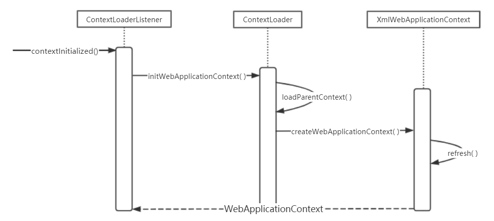
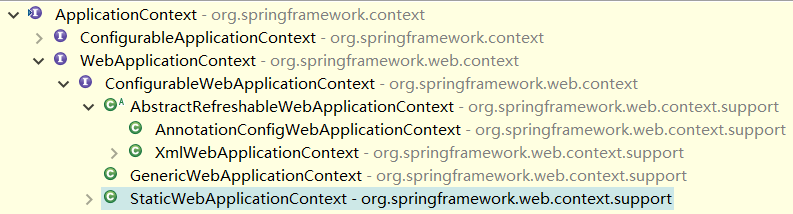

## 1 Web 环境中的 SpringMVC

在 Web 环境 中，SpringMVC 是建立在 IoC 容器 基础上的。了解 SpringMVC，首先要了解 Spring 的 IoC 容器 是如何在 Web 环境 中被载入并起作用的。

Spring 的 IoC 是一个独立模块，它并不直接在 Web 容器 中发挥作用，如果要在 Web 环境 中使用 IoC 容器，需要 Spring 为 IoC 设计一个启动过程，把 IoC 容器 导入，并在 Web 容器 中建立起来。具体说来，这个启动过程是和 Web 容器 的启动过程集成在一起的。在这个过程中，一方面处理 Web 容器 的启动，另一方面通过设计特定的 Web 容器拦截器，将 IoC 容器 载人到 Web 环境 中来，并将其初始化。在这个过程建立完成以后，IoC 容器 才能正常工作，而 SpringMVC 是建立在 IoC 容器 的基础上的，这样才能建立起 MVC 框架 的运行机制，从而响应从 Web 容器 传递的 HTTP 请求。

下面以 Tomcat 作为 Web 容器 的例子进行分析。在 Tomcat 中，web.xml 是应用的部署描述文件。在 web.xml 中常常经常能看到与 Spring 相关的部署描述。

```xml
<servlet>
	<servlet-name>sample</servlet-name>
	<servlet-class>org.springframework.web.servlet.DispatcherServlet</servlet-class>
	<load-on-startup>6</load-on-startup>
</servlet>
<servlet-mapping>
	<servlet-name>sample</servlet-name>
	<url-pattern>/*</url-pattern>
</servlet-mapping>
<context-param>
	<param-name>contextConfigLocation</param-name>
	<param-value>/WEB-INF/applicationContext.xml</param-value>
</context-param>
<listener>
	<listener-class>org.springframework.web.context.ContextLoaderListener</listener-class>
</listener>
```

web.xml 是 SpringMVC 与 Tomcat 的接口部分。这个部署描述文件中，首先定义了一个 Servlet 对象，它是 SpringMVC 的 DispatcherServlet。这个 DispatcherServlet 是 MVC 中很重要的一个类，起着分发请求的作用。

同时，在部署描述中，还为这个 DispatcherServlet 定义了对应的 URL 映射，以指定这个 Servlet 需要处理的 HTTP 请求范围。context-param 参数 用来指定 IoC 容器 读取 Bean 的 XML 文件 的路径，在这里，这个配置文件被定义为 WEB-INF/applicationContext.xml。其中可以看到 Spring 应用 的 Bean 配置。

最后，作为 Spring MVC 的启动类，ContextLoaderListener 被定义为一个监听器，这个监听器是与 Web 服务器 的生命周期相关联的，由 ContextLoaderListener 监听器 负责完成 IoC 容器 在 Web 环境 中的启动工作。

DispatchServlet 和 ContextLoaderListener 提供了在 Web 容器 中对 Spring 的接口，也就是说，这些接口与 Web 容器 耦合是通过 ServletContext 来实现的（ServletContext 是容器和应用沟通的桥梁，从一定程度上讲 ServletContext 就是 servlet 规范 的体现）。这个 ServletContext 为 Spring 的 IoC 容器 提供了一个宿主环境，在宿主环境中，Spring MVC 建立起一个 IoC 容器 的体系。这个 IoC 容器体系 是通过 ContextLoaderListener 的初始化来建立的，在建立 IoC 容器体系 后，把 DispatchServlet 作为 Spring MVC 处理 Web 请求 的转发器建立起来，从而完成响应 HTTP 请求 的准备。有了这些基本配置，建立在 IoC 容器 基础上的 SpringMVC 就可以正常地发挥作用了。下面我们看一下 IoC 容器 在 Web 容器 中的启动代码实现。

## 2 IoC 容器启动的基本过程

IoC 容器 的启动过程就是建立上下文的过程，该上下文是与 ServletContext 相伴而生的，同时也是 IoC 容器 在 Web 应用环境 中的具体表现之一。由 ContextLoaderListener 启动的上下文为根上下文。在根上下文的基础上，还有一个与 Web MVC 相关的上下文用来保存控制器(DispatcherServlet)需要的 MVC 对象，作为根上下文的子上下文，构成一个层次化的上下文体系。在 Web 容器 中启动 Spring 应用程序 时，首先建立根上下文，然后建立这个上下文体系，这个上下文体系的建立是由 ContextLoder 来完成的，其 UML 时序图 如下图所示。



在 web.xml 中，已经配置了 ContextLoaderListener，它是 Spring 提供的类，是为在 Web 容器 中建立 IoC 容器 服务的，它实现了 ServletContextListener 接口，这个接口是在 Servlet API 中定义的，提供了与 Servlet 生命周期 结合的回调，比如上下文初始化 contextInitialized()方法 和 上下文销毁 contextDestroyed()方法。而在 Web 容器 中，建立 WebApplicationContext 的过程，是在 contextInitialized()方法 中完成的。另外，ContextLoaderListener 还继承了 ContextLoader，具体的载入 IoC 容器 的过程是由 ContextLoader 来完成的。

在 ContextLoader 中，完成了两个 IoC 容器 建立的基本过程，一个是在 Web 容器 中建立起 双亲 IoC 容器，另一个是生成相应的 WebApplicationContext 并将其初始化。

## 3 Web 容器中的上下文设计

先从 Web 容器 中的上下文入手，看看 Web 环境 中的上下文设置有哪些特别之处，然后再到 ContextLoaderListener 中去了解整个容器启动的过程。为了方便在 Web 环境 中使用 IoC 容器，
Spring 为 Web 应用 提供了上下文的扩展接口 WebApplicationContext 来满足启动过程的需要，其继承关系如下图所示。



在这个类继承关系中，可以从熟悉的 XmlWebApplicationContext 入手来了解它的接口实现。在接口设计中，最后是通过 ApplicationContex 接口 与 BeanFactory 接口 对接的，而对于具体的功能实现，很多都是封装在其基类 AbstractRefreshableWebApplicationContext 中完成的。

同样，在源代码中，也可以分析出类似的继承关系，在 WebApplicationContext 中可以看到相关的常量设计，比如 ROOT* WEB* APPLICATION_CONTEXT_ATTRIBUTE 等，这个常量是用来索引在 ServletContext 中存储的根上下文的。这个接口类定义的接口方法比较简单，在这个接口中，定义了一
个 getServletContext()方法，通过这个方法可以得到当前 Web 容器 的 Servlet 上下文环境，通过
这个方法，相当于提供了一个 Web 容器级别的 全局环境。

```java
public interface WebApplicationContext extends ApplicationContext {

    /**
     * 该常量用于在 ServletContext 中存取根上下文
     */
    String ROOT_WEB_APPLICATION_CONTEXT_ATTRIBUTE = WebApplicationContext.class.getName() + ".ROOT";

    /**
     * 对于 WebApplicationContext 来说，需要得到 Web容器 的 ServletContext
     */
    ServletContext getServletContext();
}
```

在启动过程中，Spring 会使用一个默认的 WebApplicationContext 实现作为 IoC 容器，这个默认使用的 IoC 容器 就是 XmlWebApplicationContext，它继承了 ApplicationContext，在 ApplicationContext 的基础上，增加了对 Web 环境 和 XML 配置定义 的处理。在 XmlWebApplicationContext 的初始化过程中，Web 容器 中的 IoC 容器 被建立起来，从而在 Web 容器 中建立起整个 Spring 应用。与前面博文中分析的 IoC 容器 的初始化一样，这个过程也有 loadBeanDefinition()方法 对 BeanDefinition 的载入。在 Web 环境 中，对定位 BeanDefinition 的 Resource 有特别的要求，这个要求的处理体现在对 getDefaultConfigLocations()方法 的处理中。这里使用了默认的 BeanDefinition 的配置路径，这个路径在 XmlWebApplicationContext 中作为一个常量定义好了，即 /WEB-INF/applicationContext.xml。

```java
public class XmlWebApplicationContext extends AbstractRefreshableWebApplicationContext {

    /** 若不指定其它文件，Spring 默认从 "/WEB-INF/applicationContext.xml" 目录文件 初始化 IoC容器 */
    public static final String DEFAULT_CONFIG_LOCATION = "/WEB-INF/applicationContext.xml";

    /** 默认的配置文件在 /WEB-INF/ 目录下 */
    public static final String DEFAULT_CONFIG_LOCATION_PREFIX = "/WEB-INF/";

    /** 默认的配置文件后缀名为 .xml */
    public static final String DEFAULT_CONFIG_LOCATION_SUFFIX = ".xml";

    /**
     * 此加载过程在容器 refresh() 时启动
     */
    @Override
    protected void loadBeanDefinitions(DefaultListableBeanFactory beanFactory) throws BeansException, IOException {
        // 使用 XmlBeanDefinitionReader 对指定的 BeanFactory 进行解析
        XmlBeanDefinitionReader beanDefinitionReader = new XmlBeanDefinitionReader(beanFactory);

        // 初始化 beanDefinitionReader 的属性，其中，设置 ResourceLoader 是因为 XmlBeanDefinitionReader
        // 是 DefaultResource 的子类，所有这里同样会使用 DefaultResourceLoader 来定位 BeanDefinition
        beanDefinitionReader.setEnvironment(this.getEnvironment());
        beanDefinitionReader.setResourceLoader(this);
        beanDefinitionReader.setEntityResolver(new ResourceEntityResolver(this));

        // 该方法是一个空实现
        initBeanDefinitionReader(beanDefinitionReader);
        // 使用初始化完成的 beanDefinitionReader 来加载 BeanDefinitions
        loadBeanDefinitions(beanDefinitionReader);
    }

    protected void initBeanDefinitionReader(XmlBeanDefinitionReader beanDefinitionReader) {
    }

    /**
     * 获取所有的配置文件，然后一个一个载入 BeanDefinition
     */
    protected void loadBeanDefinitions(XmlBeanDefinitionReader reader) throws IOException {
        String[] configLocations = getConfigLocations();
        if (configLocations != null) {
            for (String configLocation : configLocations) {
                reader.loadBeanDefinitions(configLocation);
            }
        }
    }

    /**
     * 获取默认路径 "/WEB-INF/***.xml" 下的配置文件，
     * 或者获取 "/WEB-INF/applicationContext.xml" 配置文件
     */
    @Override
    protected String[] getDefaultConfigLocations() {
        if (getNamespace() != null) {
            return new String[] {DEFAULT_CONFIG_LOCATION_PREFIX + getNamespace() + DEFAULT_CONFIG_LOCATION_SUFFIX};
        }
        else {
            return new String[] {DEFAULT_CONFIG_LOCATION};
        }
    }
}
```

从上面的代码中可以看到，在 XmlWebApplicationContext 中，基本的上下文功能都已经通过类的继承获得，这里需要处理的是，如何获取 BeanDefinition 信息，在这里，就转化为如何在 Web 容器环境 中获得 BeanDefinition 信息。在获得 BeanDefinition 信息 之后，后面的过程基本上就和前面分析的 XmlFileSystemBeanFactory 一样，是通过 XmlBeanDefinitionReader 来载入 BeanDefinition 信息 的，最终完成整个上下文的初始化过程。

## 4 ContextLoader 的设计与实现

对于 Spring 承载的 Web 应用 而言，可以指定在 Web 应用程序 启动时载入 IoC 容器（或者称为 WebApplicationContext）。这个功能是由 ContextLoaderListener 来完成的，它是在 Web 容器 中配置的监听器，会监听 Web 容器 的启动，然后载入 IoC 容器。这个 ContextLoaderListener 通过使用 ContextLoader 来完成实际的 WebApplicationContext，也就是 IoC 容器 的初始化工作。这个 ContextLoader 就像 Spring 应用程序 在 Web 容器 中的启动器。这个启动过程是在 Web 容器 中发生的，所以需要根据 Web 容器 部署的要求来定义 ContextLoader，相关的配置在概述中已经看到了，这里就不重复了。

为了了解 IoC 容器 在 Web 容器 中的启动原理，这里对 启动器 ContextLoaderListener 的实现进行分析。**这个监听器是启动 根 IoC 容器 并把它载入到 Web 容器 的主要功能模块，也是整个 Spring Web 应用 加载 IoC 的第一个地方**。从加载过程可以看到，首先从 Servlet 事件 中得到 ServletContext，然后可以读取配置在 web.xml 中的各个相关的属性值，接着 ContextLoader 会实例化 WebApplicationContext，并完成其载人和初始化过程。这个被初始化的第一个上下文，作为根上下文而存在，这个根上下文载入后，被绑定到 Web 应用程序 的 ServletContext 上。任何需要访问根上下文的应用程序代码都可以从 WebApplicationContextUtils 类 的静态方法中得到。

下面分析具体的根上下文的载人过程。在 ContextLoaderListener 中，实现的是 **ServletContextListener 接口，这个接口里的函数会结合 Web 容器 的生命周期被调用**。因为 ServletContextListener 是 ServletContext 的监听者，如果 ServletContext 发生变化，会触发出相应的事件，而监听器一直在对这些事件进行监听，如果接收到了监听的事件，就会做出预先设计好的响应动作。由于 ServletContext 的变化而触发的监听器的响应具体包括：在服务器启动时，ServletContext 被创建的时候，服务器关闭时，ServletContext 将被销毁的时候等。对应这些事件及 Web 容器状态 的变化，在监听器中定义了对应的事件响应的回调方法。比如，在服务器启动时，ServletContextListener 的 contextInitialized()方法 被调用，服务器将要关闭时，ServletContextListener 的 contextDestroyed()方法 被调用。了解了 Web 容器 中监听器的工作原理，下面看看服务器启动时 ContextLoaderListener 的调用完成了什么。在这个初始化回调中，创建了 ContextLoader，同时会利用创建出来的 ContextLoader 来完成 IoC 容器 的初始化。

```java
public class ContextLoaderListener extends ContextLoader implements ServletContextListener {

    private ContextLoader contextLoader;

    /**
     * 启动 web应用 的根上下文
     */
    public void contextInitialized(ServletContextEvent event) {
        // 由于本类直接继承了 ContextLoader，所以能直接使用 ContextLoader 来初始化 IoC容器
        this.contextLoader = createContextLoader();
        if (this.contextLoader == null) {
            this.contextLoader = this;
        }
        // 具体的初始化工作交给 ContextLoader 完成
        this.contextLoader.initWebApplicationContext(event.getServletContext());
    }
}


public class ContextLoader {

    public static final String CONTEXT_CLASS_PARAM = "contextClass";

    public static final String CONTEXT_ID_PARAM = "contextId";

    public static final String CONTEXT_INITIALIZER_CLASSES_PARAM = "contextInitializerClasses";

    public static final String CONFIG_LOCATION_PARAM = "contextConfigLocation";

    public static final String LOCATOR_FACTORY_SELECTOR_PARAM = "locatorFactorySelector";

    public static final String LOCATOR_FACTORY_KEY_PARAM = "parentContextKey";

    private static final String DEFAULT_STRATEGIES_PATH = "ContextLoader.properties";

    private static final Properties defaultStrategies;

    static {
        // Load default strategy implementations from properties file.
        // This is currently strictly internal and not meant to be customized
        // by application developers.
        try {
            ClassPathResource resource = new ClassPathResource(DEFAULT_STRATEGIES_PATH, ContextLoader.class);
            defaultStrategies = PropertiesLoaderUtils.loadProperties(resource);
        }
        catch (IOException ex) {
            throw new IllegalStateException("Could not load 'ContextLoader.properties': " + ex.getMessage());
        }
    }

    /**
     * 由 ContextLoader 完成根上下文在 Web容器 中的创建。这个根上下文是作为 Web容器 中唯一的实例而存在的，
     * 根上下文创建成功后会被存到 Web容器 的 ServletContext 中，供需要时使用。存取这个根上下文的路径是由
     * Spring 预先设置好的，在 WebApplicationContext.ROOT_WEB_APPLICATION_CONTEXT_ATTRIBUTE 中进行了定义
     */
    public WebApplicationContext initWebApplicationContext(ServletContext servletContext) {
        // 如果 ServletContext 中已经包含了根上下文，则抛出异常
        if (servletContext.getAttribute(WebApplicationContext.ROOT_WEB_APPLICATION_CONTEXT_ATTRIBUTE) != null) {
            throw new IllegalStateException(
                    "Cannot initialize context because there is already a root application context present - " +
                    "check whether you have multiple ContextLoader* definitions in your web.xml!");
        }
        Log logger = LogFactory.getLog(ContextLoader.class);
        servletContext.log("Initializing Spring root WebApplicationContext");
        if (logger.isInfoEnabled()) {
            logger.info("Root WebApplicationContext: initialization started");
        }
        long startTime = System.currentTimeMillis();

        try {
            if (this.context == null) {
                // 这里创建在 ServletContext 中存储的根上下文
                this.context = createWebApplicationContext(servletContext);
            }
            if (this.context instanceof ConfigurableWebApplicationContext) {
                ConfigurableWebApplicationContext cwac = (ConfigurableWebApplicationContext) this.context;
                if (!cwac.isActive()) {
                    if (cwac.getParent() == null) {
                        // 载入根上下文的 双亲上下文
                        ApplicationContext parent = loadParentContext(servletContext);
                        cwac.setParent(parent);
                    }
                    // 配置并初始化 IoC容器，看到下面方法中的 Refresh单词 应该能想到
                    // AbstractApplicationContext 中的 refresh()方法，猜到它是前面介绍的 IoC容器 的初始化入口
                    configureAndRefreshWebApplicationContext(cwac, servletContext);
                }
            }
            // 将上面创建的 WebApplicationContext实例 存到 ServletContext 中，注意同时被存入的常量
            // ROOT_WEB_APPLICATION_CONTEXT_ATTRIBUTE，以后的应用都会根据这个属性获取根上下文
            servletContext.setAttribute(WebApplicationContext.ROOT_WEB_APPLICATION_CONTEXT_ATTRIBUTE, this.context);

            ClassLoader ccl = Thread.currentThread().getContextClassLoader();
            if (ccl == ContextLoader.class.getClassLoader()) {
                currentContext = this.context;
            }
            else if (ccl != null) {
                currentContextPerThread.put(ccl, this.context);
            }

            if (logger.isDebugEnabled()) {
                logger.debug("Published root WebApplicationContext as ServletContext attribute with name [" +
                        WebApplicationContext.ROOT_WEB_APPLICATION_CONTEXT_ATTRIBUTE + "]");
            }
            if (logger.isInfoEnabled()) {
                long elapsedTime = System.currentTimeMillis() - startTime;
                logger.info("Root WebApplicationContext: initialization completed in " + elapsedTime + " ms");
            }

            return this.context;
        }
        catch (RuntimeException ex) {
            logger.error("Context initialization failed", ex);
            servletContext.setAttribute(WebApplicationContext.ROOT_WEB_APPLICATION_CONTEXT_ATTRIBUTE, ex);
            throw ex;
        }
        catch (Error err) {
            logger.error("Context initialization failed", err);
            servletContext.setAttribute(WebApplicationContext.ROOT_WEB_APPLICATION_CONTEXT_ATTRIBUTE, err);
            throw err;
        }
    }

    /**
     * 创建 WebApplicationContext 的实例化对象
     */
    protected WebApplicationContext createWebApplicationContext(ServletContext sc) {
        // 判断使用什么样的类在 Web容器 中作为 IoC容器
        Class<?> contextClass = determineContextClass(sc);
        if (!ConfigurableWebApplicationContext.class.isAssignableFrom(contextClass)) {
            throw new ApplicationContextException("Custom context class [" + contextClass.getName() +
                    "] is not of type [" + ConfigurableWebApplicationContext.class.getName() + "]");
        }
        // 直接实例化需要产生的 IoC容器
        return (ConfigurableWebApplicationContext) BeanUtils.instantiateClass(contextClass);
    }

    /**
     * 在确定使用何种 IoC容器 的过程中可以看到，应用可以在部署描述符中指定使用什么样的 IoC容器，
     * 这个指定操作是通过 CONTEXT_ CLASS_ PARAM参数 的设置完成的。如果没有指定特定的 IoC容器，
     * 将使用默认的 IoC容器，也就是 XmlWebApplicationContext对象 作为在 Web环境 中使用的 IoC容器。
     */
    protected Class<?> determineContextClass(ServletContext servletContext) {
        // 获取 servletContext 中对 CONTEXT_CLASS_PARAM（contextClass）参数 的配置
        String contextClassName = servletContext.getInitParameter(CONTEXT_CLASS_PARAM);
        if (contextClassName != null) {
            try {
                // 获取配置的 contextClassName 对应的 clazz对象
                return ClassUtils.forName(contextClassName, ClassUtils.getDefaultClassLoader());
            }
            catch (ClassNotFoundException ex) {
                throw new ApplicationContextException(
                        "Failed to load custom context class [" + contextClassName + "]", ex);
            }
        }
        else {
            // 如果没有配置 CONTEXT_CLASS_PARAM，则使用默认的 ContextClass
            contextClassName = defaultStrategies.getProperty(WebApplicationContext.class.getName());
            try {
                return ClassUtils.forName(contextClassName, ContextLoader.class.getClassLoader());
            }
            catch (ClassNotFoundException ex) {
                throw new ApplicationContextException(
                        "Failed to load default context class [" + contextClassName + "]", ex);
            }
        }
    }

    protected void configureAndRefreshWebApplicationContext(ConfigurableWebApplicationContext wac, ServletContext sc) {
        if (ObjectUtils.identityToString(wac).equals(wac.getId())) {
            // The application context id is still set to its original default value
            // -> assign a more useful id based on available information
            String idParam = sc.getInitParameter(CONTEXT_ID_PARAM);
            if (idParam != null) {
                wac.setId(idParam);
            }
            else {
                // Generate default id...
                if (sc.getMajorVersion() == 2 && sc.getMinorVersion() < 5) {
                    // Servlet <= 2.4: resort to name specified in web.xml, if any.
                    wac.setId(ConfigurableWebApplicationContext.APPLICATION_CONTEXT_ID_PREFIX +
                            ObjectUtils.getDisplayString(sc.getServletContextName()));
                }
                else {
                    wac.setId(ConfigurableWebApplicationContext.APPLICATION_CONTEXT_ID_PREFIX +
                            ObjectUtils.getDisplayString(sc.getContextPath()));
                }
            }
        }

        // 设置 ServletContext 及配置文件的位置参数
        wac.setServletContext(sc);
        String initParameter = sc.getInitParameter(CONFIG_LOCATION_PARAM);
        if (initParameter != null) {
            wac.setConfigLocation(initParameter);
        }
        customizeContext(sc, wac);
        // IoC容器 初始化的入口，想不起来的把前面 IoC容器 初始化的博文再读10遍
        wac.refresh();
    }
}
```

这就是 IoC 容器 在 Web 容器 中的启动过程，与应用中启动 IoC 容器 的方式相类似，所不同的是这里需要考虑 Web 容器 的环境特点，比如各种参数的设置，IoC 容器 与 Web 容器 ServletContext 的结合等。在初始化这个上下文以后，该上下文会被存储到 SevletContext 中，这样就建立了一个全局的关于整个应用的上下文。同时，在启动 SpringMVC 时，我们还会看到这个上下文被以后的 DispatcherServlet 在进行自己持有的上下文的初始化时，设置为 DispatcherServlet 自带的上下文的双亲上下文。
