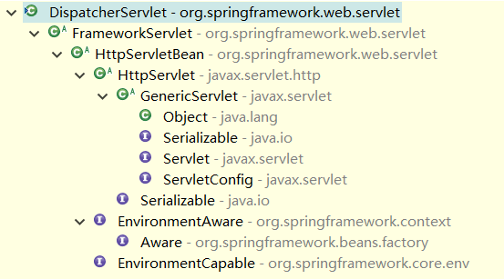
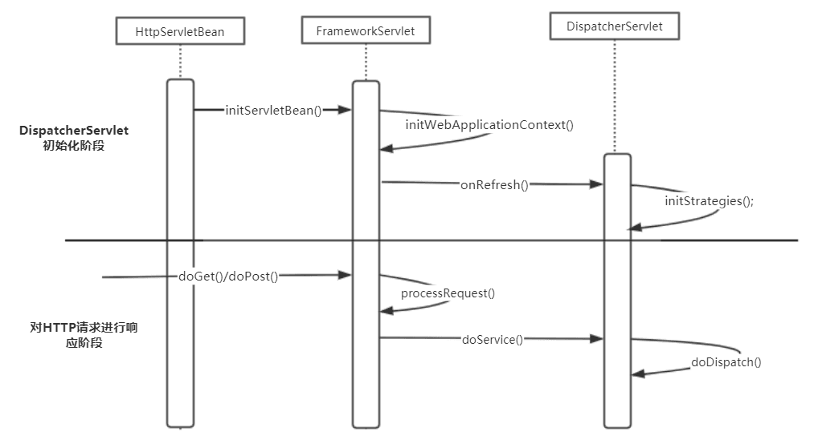
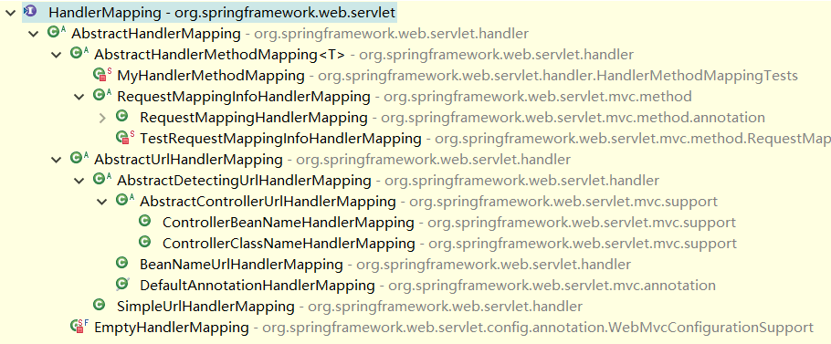

## 1 SpringMVC 应用场景

在使用 SpringMVC 时，除了要在 web.xml 中配置 ContextLoaderListener 外，还要对 DispatcherServlet 进行配置。作为一个 Servlet，这个 DispatcherServlet 实现的是 Sun 的 J2EE 核心模式 中的 前端控制器模式(Front Controller)， 作为一个前端控制器，所有的 Web 请求 都需要通过它来进行转发、匹配、数据处理，然后转由页面进行展现，因此这个 DispatcerServlet 可以看成是 SpringMVC 实现 中最为核心的部分。

在 SpringMVC 中，对于不同的 Web 请求 的映射需求，SpringMVC 提供了不同的 HandlerMapping 的实现，可以让应用开发选取不同的映射策略。DispatcherSevlet 默认了 BeanNameUrlHandlerMapping 作为映射策略实现。除了映射策略可以定制外，SpringMVC 还提供了各种 Controller 的实现来供应用扩展和使用，以应对不同的控制器使用场景，这些 Controller 控制器 需要实现 handleRequest()接口方法，并返回 ModelAndView 对象。SpringMVC 还提供了各种视图实现，比如常用的 JSP 视图。除此之外，SpringMVC 还提供了拦截器供应用使用，允许应用对 Web 请求 进行拦截，以及前置处理和后置处理。

## 2 SpringMVC 设计概览

在完成对 ContextLoaderListener 的初始化以后，Web 容器 开始初始化 DispatcherServlet，这个初始化的启动与在 web.xml 中对载入次序的定义有关。DispatcherServlet 会建立自己的上下文来持有 SpringMVC 的 Bean 对象，在建立这个自己持有的 IoC 容器 时，会**从 ServletContext 中得到根上下文**作为 DispatcherServlet 持有上下文的双亲上下文。有了这个根上下文，再对自己持有的上下文进行初始化，最后把自己持有的这个上下文保存到 ServletContext 中，供以后检索和使用。

为了解这个过程，可以从 DispatcherServlet 的父类 FrameworkServlet 的代码入手，去探寻 DispatcherServlet 的启动过程，它同时也是 SpringMVC 的启动过程。ApplicationContext 的创建过程和 ContextLoader 创建根上下文的过程有许多类似的地方。下面来看一下这个 DispatcherServlet 类 的继承关系。



DispatcherServlet 通过继承 FrameworkServlet 和 HttpServletBean 而继承了 HttpServlet，通过使用 Servlet API 来对 HTTP 请求 进行响应，成为 SpringMVC 的前端处理器，同时成为 MVC 模块 与 Web 容器 集成的处理前端。

DispatcherServlet 的工作大致可以分为两个部分：一个是初始化部分，由 initServletBean()方法 启动，通过 initWebApplicationContext()方法 最终调用 DispatcherServlet 的 initStrategies()方法，在这个方法里，DispatcherServlet 对 MVC 模块 的其他部分进行了初始化，比如 handlerMapping、ViewResolver 等；另一个是对 HTTP 请求 进行响应，作为一个 Servlet，Web 容器 会调用 Servlet 的 doGet() 和 doPost()方法，在经过 FrameworkServlet 的 processRequest() 简单处理后，会调用 DispatcherServlet 的 doService()方法，在这个方法调用中封装了 doDispatch()，这个 doDispatch() 是 Dispatcher 实现 MVC 模式 的主要部分，下图为 DispatcherServlet 的处理过程时序图。



## 3 DispatcherServlet 的启动和初始化

前面大致描述了 SpringMVC 的工作流程，下面看一下 DispatcherServlet 的启动和初始化的代码设计及实现。

作为 Servlet，DispatcherServlet 的启动与 Servlet 的启动过程是相联系的。在 Servlet 的初始化过程中，Servlet 的 init()方法 会被调用，以进行初始化，DispatcherServlet 的基类 HttpServletBean 实现了该方法。在初始化开始时，需要读取配置在 ServletContext 中的 Bean 属性参数，这些属性参数设置在 web.xml 的 Web 容器初始化参数 中。使用编程式的方式来设置这些 Bean 属性，在这里可以看到对 PropertyValues 和 BeanWrapper 的使用。对于这些和依赖注人相关的类的使用，在分析 IoC 容器 的初始化时，尤其是在依赖注入实现分析时，有过“亲密接触”。只是这里的依赖注人是与 Web 容器 初始化相关的。

接着会执行 DispatcherServlet 持有的 IoC 容器 的初始化过程，在这个初始化过程中，一个新的上下文被建立起来，这个 DispatcherServlet 持有的上下文被设置为根上下文的子上下文。一个 Web 应用 中可以容纳多个 Servlet 存在；与此相对应，对于应用在 Web 容器 中的上下体系，一个根上下文可以作为许多 Servlet 上下文 的双亲上下文。了解 IoC 工作原理的读者知道，在向 IoC 容器 getBean() 时，IoC 容器 会首先向其双亲上下文去 getBean()，也就是说，在根上下文中定义的 Bean 是可以被各个 Servlet 持有的上下文得到和共享的。DispatcherServlet 持有的 上下文被建立起来以后，也需要和其他 IoC 容器 一样完成初始化，这个初始化也是通过 refresh()方法 来完成的。最后，DispatcherServlet 给这个自己持有的上下文命名，并把它设置到 Web 容器 的上下文中，这个名称和在 web.xml 中设置的 DispatcherServlet 的 Servlet 名称 有关，从而保证了这个上下文在 Web 环境上下文体系 中的唯一性。

```java
public abstract class HttpServletBean extends HttpServlet implements EnvironmentCapable, EnvironmentAware {

    public final void init() throws ServletException {
        if (logger.isDebugEnabled()) {
            logger.debug("Initializing servlet '" + getServletName() + "'");
        }

        // 获取 Servlet 的初始化参数，对 bean属性 进行配置
        try {
            PropertyValues pvs = new ServletConfigPropertyValues(getServletConfig(), this.requiredProperties);
            BeanWrapper bw = PropertyAccessorFactory.forBeanPropertyAccess(this);
            ResourceLoader resourceLoader = new ServletContextResourceLoader(getServletContext());
            bw.registerCustomEditor(Resource.class, new ResourceEditor(resourceLoader, getEnvironment()));
            initBeanWrapper(bw);
            bw.setPropertyValues(pvs, true);
        }
        catch (BeansException ex) {
            logger.error("Failed to set bean properties on servlet '" + getServletName() + "'", ex);
            throw ex;
        }

        // 这个方法会调用子类的实现，进行具体的初始化
        initServletBean();

        if (logger.isDebugEnabled()) {
            logger.debug("Servlet '" + getServletName() + "' configured successfully");
        }
    }
}


public abstract class FrameworkServlet extends HttpServletBean {

    /** 此 servlet 的 WebApplicationContext */
    private WebApplicationContext webApplicationContext;

    /** 我们是否应该将当前 Servlet 的上下文 webApplicationContext 设为 ServletContext 的属性 */
    private boolean publishContext = true;

    public FrameworkServlet() {
    }

    public FrameworkServlet(WebApplicationContext webApplicationContext) {
        this.webApplicationContext = webApplicationContext;
    }

    /**
     * 覆盖了父类 HttpServletBean 的空实现
     */
    @Override
    protected final void initServletBean() throws ServletException {
        getServletContext().log("Initializing Spring FrameworkServlet '" + getServletName() + "'");
        if (this.logger.isInfoEnabled()) {
            this.logger.info("FrameworkServlet '" + getServletName() + "': initialization started");
        }
        long startTime = System.currentTimeMillis();

        try {
            // 初始化上下文
            this.webApplicationContext = initWebApplicationContext();
            initFrameworkServlet();
        }
        catch (ServletException ex) {
            this.logger.error("Context initialization failed", ex);
            throw ex;
        }
        catch (RuntimeException ex) {
            this.logger.error("Context initialization failed", ex);
            throw ex;
        }

        if (this.logger.isInfoEnabled()) {
            long elapsedTime = System.currentTimeMillis() - startTime;
            this.logger.info("FrameworkServlet '" + getServletName() + "': initialization completed in " +
                    elapsedTime + " ms");
        }
    }

    /**
     * 为这个 Servlet 初始化一个公共的 WebApplicationContext实例
     */
    protected WebApplicationContext initWebApplicationContext() {
        // 获取根上下文作为当前 MVC上下文 的双亲上下文，这个根上下文保存在 ServletContext 中
        WebApplicationContext rootContext =
                WebApplicationContextUtils.getWebApplicationContext(getServletContext());
        WebApplicationContext wac = null;

        if (this.webApplicationContext != null) {
            // 可以在本对象被构造时注入一个 webApplicationContext实例
            wac = this.webApplicationContext;
            if (wac instanceof ConfigurableWebApplicationContext) {
                ConfigurableWebApplicationContext cwac = (ConfigurableWebApplicationContext) wac;
                if (!cwac.isActive()) {
                    // 上下文尚未刷新 -> 提供诸如设置父上下文、设置应用程序上下文id等服务
                    if (cwac.getParent() == null) {
                        // 上下文实例在没有显式父实例的情况下被注入 ->
                        // 将根上下文（如果有的话；可以为空）设置为父上下文
                        cwac.setParent(rootContext);
                    }
                    configureAndRefreshWebApplicationContext(cwac);
                }
            }
        }
        if (wac == null) {
            // 在本对象被构造时没有注入上下文实例 ->
            // 查看是否已在 servlet上下文 中注册了上下文实例。
            // 如果存在一个，则假定父上下文（如果有的话）已经被设置，
            // 并且用户已经执行了任何初始化，例如设置上下文ID
            wac = findWebApplicationContext();
        }
        if (wac == null) {
            // 没有为此 servlet 定义上下文实例 -> 创建本地实例
            wac = createWebApplicationContext(rootContext);
        }

        if (!this.refreshEventReceived) {
            // 上下文不是支持刷新的 ConfigurableApplicationContext，或者
            // 在构造时注入的上下文已经完成刷新 -> 在此处手动触发 onRefresh()方法
            onRefresh(wac);
        }

        if (this.publishContext) {
            // 把当前建立的上下文保存到 ServletContext 中，使用的属性名是和 当前servlet名 相关的
            String attrName = getServletContextAttributeName();
            getServletContext().setAttribute(attrName, wac);
            if (this.logger.isDebugEnabled()) {
                this.logger.debug("Published WebApplicationContext of servlet '" + getServletName() +
                        "' as ServletContext attribute with name [" + attrName + "]");
            }
        }

        return wac;
    }
}
```

至此，这个 MVC 的上下文就建立起来了，具体取得根上下文的过程在 WebApplicationContextUtils 中实现。这个根上下文是 ContextLoader 设置到 ServletContext 中去的，使用的属性是 ROOT_WEB_APPLICATION_CONTEXT_ATTRIBUTE，ContextLoader 还对这个 IoC 容器 的 Bean 配置文件进行了设置，默认的位置是在 /WEB-INF/applicationContext.xml 文件 中。由于这个根上下文是 DispatcherServlet 建立的上下文的 双亲上下文，所以根上下文中管理的 Bean 也可以被 DispatcherServlet 的上下文使用。通过 getBean() 向 IoC 容器 获取 Bean 时，容器会先到它的 双亲 IoC 容器 中获取。

```java
/**
 * 这是一个封装了很多静态方法的抽象工具类，所以只能调用其静态方法，
 * 不能对其进行实例化
 */
public abstract class WebApplicationContextUtils {
    /**
     * 使用了 WebApplicationContext 的 ROOT_WEB_APPLICATION_CONTEXT_ATTRIBUTE属性，获取
     * ServletContext 中的根上下文，这个属性代表的根上下文在 ContextLoaderListener 初始化的
     * 过程中被建立
     */
    public static WebApplicationContext getWebApplicationContext(ServletContext sc) {
        return getWebApplicationContext(sc, WebApplicationContext.ROOT_WEB_APPLICATION_CONTEXT_ATTRIBUTE);
    }

    /**
     * 查找此 web应用程序 的自定义 WebApplicationContext
     */
    public static WebApplicationContext getWebApplicationContext(ServletContext sc, String attrName) {
        Assert.notNull(sc, "ServletContext must not be null");
        Object attr = sc.getAttribute(attrName);
        if (attr == null) {
            return null;
        }
        if (attr instanceof RuntimeException) {
            throw (RuntimeException) attr;
        }
        if (attr instanceof Error) {
            throw (Error) attr;
        }
        if (attr instanceof Exception) {
            throw new IllegalStateException((Exception) attr);
        }
        if (!(attr instanceof WebApplicationContext)) {
            throw new IllegalStateException("Context attribute is not of type WebApplicationContext: " + attr);
        }
        return (WebApplicationContext) attr;
    }
)
```

回到 FrameworkServlet 的实现中来看一下，DispatcherServlet 的上下文是怎样建立的，这个建立过程与前面建立根上下文的过程非常类似。建立 DispatcherServlet 的上下文，需要把根上下文作为参数传递给它。然后使用反射技术来实例化上下文对象，并为它设置参数。根据默认的配置，这个上下文对象也是 XmlWebApplicationContext 对象，这个类型是在 DEFAULT_CONTEXT_CLASS 参数 中设置好并允许 BeanUtilis 使用的。在实例化结束后，需要为这个上下文对象设置好一些基本的配置，这些配置包括它的双亲上下文、Bean 配置文件 的位置等。完成这些配置以后，最后通过调用 IoC 容器 的 refresh()方法 来完成 IoC 容器 的最终初始化，这和前面我们对 IoC 容器实现原理 的分析中所看到的 IoC 容器初始化 的过程是一致的。

```java
public abstract class FrameworkServlet extends HttpServletBean {

    /**
     * 为此 servlet 实例化一个 WebApplicationContext，可以是默认的 XmlWebApplicationContext，
     * 也可以是用户设置的自定义 Context上下文
     */
    protected WebApplicationContext createWebApplicationContext(WebApplicationContext parent) {
        return createWebApplicationContext((ApplicationContext) parent);
    }

    protected WebApplicationContext createWebApplicationContext(ApplicationContext parent) {
        // 默认为 XmlWebApplicationContext.class
        Class<?> contextClass = getContextClass();
        if (this.logger.isDebugEnabled()) {
            this.logger.debug("Servlet with name '" + getServletName() +
                    "' will try to create custom WebApplicationContext context of class '" +
                    contextClass.getName() + "'" + ", using parent context [" + parent + "]");
        }
        if (!ConfigurableWebApplicationContext.class.isAssignableFrom(contextClass)) {
            throw new ApplicationContextException(
                    "Fatal initialization error in servlet with name '" + getServletName() +
                    "': custom WebApplicationContext class [" + contextClass.getName() +
                    "] is not of type ConfigurableWebApplicationContext");
        }
        // 实例化需要的上下文对象，并为其设置属性
        ConfigurableWebApplicationContext wac =
                (ConfigurableWebApplicationContext) BeanUtils.instantiateClass(contextClass);

        wac.setEnvironment(getEnvironment());
        // 这里设置的 双亲上下文，就是在 ContextLoader 中建立的根上下文
        wac.setParent(parent);
        wac.setConfigLocation(getContextConfigLocation());

        // 配置并且刷新 WebApplicationContext对象
        configureAndRefreshWebApplicationContext(wac);

        return wac;
    }

    protected void configureAndRefreshWebApplicationContext(ConfigurableWebApplicationContext wac) {
        if (ObjectUtils.identityToString(wac).equals(wac.getId())) {
            // 应用程序上下文id 仍设置为其原始默认值，如果该 id 不为空的话
            if (this.contextId != null) {
                wac.setId(this.contextId);
            }
            else {
                // 生成默认的 id
                ServletContext sc = getServletContext();
                if (sc.getMajorVersion() == 2 && sc.getMinorVersion() < 5) {
                    // 当 Servlet <= 2.4：如果有，请使用 web.xml 中指定的名称。
                    String servletContextName = sc.getServletContextName();
                    if (servletContextName != null) {
                        wac.setId(ConfigurableWebApplicationContext.APPLICATION_CONTEXT_ID_PREFIX + servletContextName +
                                "." + getServletName());
                    }
                    else {
                        wac.setId(ConfigurableWebApplicationContext.APPLICATION_CONTEXT_ID_PREFIX + getServletName());
                    }
                }
                else {
                    // Servlet 2.5 的 getContextPath 可用！
                    wac.setId(ConfigurableWebApplicationContext.APPLICATION_CONTEXT_ID_PREFIX +
                            ObjectUtils.getDisplayString(sc.getContextPath()) + "/" + getServletName());
                }
            }
        }

        // 设置其它配置信息
        wac.setServletContext(getServletContext());
        wac.setServletConfig(getServletConfig());
        wac.setNamespace(getNamespace());
        wac.addApplicationListener(new SourceFilteringListener(wac, new ContextRefreshListener()));

        // 在刷新上下文的任何情况下，都将会调用 此wac 的 env的 initPropertySources()方法。
        // 在此处执行此方法，以确保在刷新上下文之前，servlet属性源 已准备就绪
        ConfigurableEnvironment env = wac.getEnvironment();
        if (env instanceof ConfigurableWebEnvironment) {
            ((ConfigurableWebEnvironment)env).initPropertySources(getServletContext(), getServletConfig());
        }

        postProcessWebApplicationContext(wac);

        applyInitializers(wac);

        // IoC容器 都是通过该方法完成 容器初始化的
        wac.refresh();
    }
}
```

这时候 DispatcherServlet 中的 IoC 容器 已经建立起来了，这个 IoC 容器 是 根上下文 的子容器。如果要查找一个由 DispatcherServlet 所持有的 IoC 容器 来管理的 Bean，系统会首先到 根上下文 中去查找。如果查找不到，才会到 DispatcherServlet 所管理的 IoC 容器 去进行查找，这是由 IoC 容器 的 getBean() 的实现来决定的。通过一系列在 Web 容器 中执行的动作，在这个上下文体系建立和初始化完毕的基础上，SpringMVC 就可以发挥其作用了。下面来分析一下 SpringMVC 的具体实现。

在前面分析 DispatchServlet 的初始化过程中可以看到，DispatchServlet 持有一个以自己的 Servlet 名称 命名的 IoC 容器。这个 IoC 容器 是一个 WebApplicationContext 对象，这个 IoC 容器 建立起来以后，意味着 DispatcherServlet 拥有自己的 Bean 定义空间，这为使用各个独立的 XML 文件 来配置 MVC 中各个 Bean 创造了条件。由于在初始化结束以后，与 Web 容器 相关的加载过程实际上已经完成了，SpringMVC 的具体实现和普通的 Spring 应用程序 的实现并没有太大的差别。

在 DispatcherServlet 的初始化过程中，以对 HandlerMapping 的初始化调用作为触发点，了解 SpringMVC 模块 初始化的方法调用关系。这个调用关系最初是由 HttpServletBean 的 init()方法 触发的，这个 HttpServletBean 是 HttpServlet 的子类。接着会在 HttpServletBean 的子类 FrameworkServlet 中对 IoC 容器 完成初始化，在这个初始化方法中，会调用 DispatcherServlet 的 initStrategies()方法，该方法包括对各种 MVC 框架 的实现元素，比如支持国际化的 LocalResolver、支持 request 映射的 HandlerMappings，以及视图生成的 ViewResolver 等。由该方法启动整个 SpringMVC 框架 的初始化。

```java
public class DispatcherServlet extends FrameworkServlet {
    /**
     * 初始化此 servlet 使用的策略对象。
     * 可以在子类中重写，以便初始化进一步的策略对象（U8C）
     */
    protected void initStrategies(ApplicationContext context) {
        // 请求解析
        initMultipartResolver(context);
        // 多语言，国际化
        initLocaleResolver(context);
        // 主题view层
        initThemeResolver(context);
        // 解析 url 和 Method 的对应关系
        initHandlerMappings(context);
        // 适配器匹配
        initHandlerAdapters(context);
        // 异常解析
        initHandlerExceptionResolvers(context);
        // 视图转发，根据视图名字匹配到一个具体模板
        initRequestToViewNameTranslator(context);
        // 解析模板中的内容
        initViewResolvers(context);

        initFlashMapManager(context);
    }
}
```

对于具体的初始化过程，根据上面的方法名称，很容易理解。以 HandlerMapping 为例来说明这个 initHandlerMappings()过程。这里的 Mapping 关系 的作用是，为 HTTP 请求 找到相应的 Controller 控制器，从而利用这些 控制器 Controller 去完成设计好的数据处理工作。

HandlerMappings 完成对 MVC 中 Controller 的定义和配置，只不过在 Web 这个特定的应用环境中，这些控制器是与具体的 HTTP 请求 相对应的。在 HandlerMapping 初始化 的过程中，把在 Bean 配置文件 中配置好的 HandlerMapping 从 IoC 容器 中取得。

```java
    /**
     * 初始化此类使用的 HandlerMappings。
     * 如果在 BeanFactory 中没有为此命名空间定义的 HandlerMapping bean，则默认为 BeanNameUrlHandlerMapping
     */
    private void initHandlerMappings(ApplicationContext context) {
        this.handlerMappings = null;

        // 这个 detectAllHandlerMappings 默认为 true，表示从所有的 IoC容器 中获取所有的HandlerMappings
        if (this.detectAllHandlerMappings) {
            // 查找所有的 HandlerMapping，从 应用上下文context 及其双亲上下文中
            Map<String, HandlerMapping> matchingBeans = BeanFactoryUtils.beansOfTypeIncludingAncestors(
                    context, HandlerMapping.class, true, false);
            if (!matchingBeans.isEmpty()) {
                this.handlerMappings = new ArrayList<HandlerMapping>(
                        matchingBeans.values());
                // 保持 HandlerMappings 的有序性
                OrderComparator.sort(this.handlerMappings);
            }
        }
        else {
            try {
                // 根据名称从当前的 IoC容器 中通过 getBean() 获 取HandlerMapping
                HandlerMapping hm = context.getBean(HANDLER_MAPPING_BEAN_NAME,
                        HandlerMapping.class);
                this.handlerMappings = Collections.singletonList(hm);
            }
            catch (NoSuchBeanDefinitionException ex) {
                // 忽略，稍后将添加默认的 HandlerMapping
            }
        }

        // 如果找不到其他映射，请通过注册默认的 HandlerMapping 确保至少有一个 HandlerMapping
        if (this.handlerMappings == null) {
            this.handlerMappings = getDefaultStrategies(context, HandlerMapping.class);
            if (logger.isDebugEnabled()) {
                logger.debug("No HandlerMappings found in servlet '" + getServletName()
                        + "': using default");
            }
        }
    }
```

经过以上读取过程，handlerMappings 变量 就已经获取了在 Bean 中配置好的映射关系。其他的初始化过程和 handlerMappings 比较类似，都是直接从 IoC 容器 中读入配置，所以这里的 MVC 初始化过程 是建立在 IoC 容器 已经初始化完成的基础上的。

## 4 SpringMVC 处理分发 HTTP 请求

### 4.1 HandlerMapping 的配置和设计原理

前面分析了 DispatcherServlet 对 SpringMVC 框架 的初始化过程，在此基础上，我们再进一步分析 HandlerMapping 的实现原理，看看这个 MVC 框架 中比较关键的控制部分是如何实现的。

在初始化完成时，在上下文环境中已定义的所有 HandlerMapping 都已经被加载了，这些加载的 handlerMappings 被放在一个 List 中并被排序，存储着 HTTP 请求 对应的映射数据。这个 List 中的每一个元素都对应着一个具体 handlerMapping 的配置，一般每一个 handlerMapping 可以持有一系列从 URL 请求 到 Controller 的映射，而 SpringMVC 提供了一系列的 HandlerMapping 实现。



以 SimpleUrlHandlerMapping 为例来分析 HandlerMapping 的设计与实现。在 SimpleUrlHandlerMapping 中，定义了一个 Map 来持有一系列的映射关系。通过这些在 HandlerMapping 中定义的映射关系，即这些 URL 请求 和控制器的对应关系，使 SpringMVC
应用 可以根据 HTTP 请求 确定一个对应的 Controller。具体来说，这些映射关系是通过 HandlerMapping 接口 来封装的，在 HandlerMapping 接口 中定义了一个 getHandler()方法，通过这个方法，可以获得与 HTTP 请求 对应的 HandlerExecutionChain，在这个 HandlerExecutionChain 中，封装了具体的 Controller 对象。

```java
public interface HandlerMapping {

    String PATH_WITHIN_HANDLER_MAPPING_ATTRIBUTE = HandlerMapping.class.getName() + ".pathWithinHandlerMapping";

    String BEST_MATCHING_PATTERN_ATTRIBUTE = HandlerMapping.class.getName() + ".bestMatchingPattern";

    String INTROSPECT_TYPE_LEVEL_MAPPING = HandlerMapping.class.getName() + ".introspectTypeLevelMapping";

    String URI_TEMPLATE_VARIABLES_ATTRIBUTE = HandlerMapping.class.getName() + ".uriTemplateVariables";

    String MATRIX_VARIABLES_ATTRIBUTE = HandlerMapping.class.getName() + ".matrixVariables";

    String PRODUCIBLE_MEDIA_TYPES_ATTRIBUTE = HandlerMapping.class.getName() + ".producibleMediaTypes";

    /**
     * 返回的这个 HandlerExecutionChain 不但持有 handler本身，还包括了处理这个 HTTP请求 的拦截器链
     */
    HandlerExecutionChain getHandler(HttpServletRequest request) throws Exception;

}
```

这个 HandlerExecutionChain 的实现看起来比较简洁，它持有一个 拦截器链(HandlerInterceptor 对象列表) 和一个 handler 对象，这个 handler 对象 实际上就是 HTTP 请求 对应的 Controller，在持有这个 handler 对象 的同时，还在 HandlerExecutionChain 中设置了一个拦截器链，通过这个拦截器链中的拦截器，可以为 handler 对象 提供功能的增强。要完成这些工作，需要对拦截器链和 handler 都进行配置，这些配置都是在 HandlerExecutionChain 的初始化函数中完成的。为了维护这个拦截器链和 handler，HandlerExecutionChain 还提供了一系列与拦截器链维护相关的操作，比如，为拦截器链增加拦截器的 addInterceptor()方法。

```java
public class HandlerExecutionChain {

    private static final Log logger = LogFactory.getLog(HandlerExecutionChain.class);

    private final Object handler;

    private HandlerInterceptor[] interceptors;

    private List<HandlerInterceptor> interceptorList;

    private int interceptorIndex = -1;


    public HandlerExecutionChain(Object handler) {
        this(handler, null);
    }

    public HandlerExecutionChain(Object handler, HandlerInterceptor[] interceptors) {
        if (handler instanceof HandlerExecutionChain) {
            HandlerExecutionChain originalChain = (HandlerExecutionChain) handler;
            this.handler = originalChain.getHandler();
            this.interceptorList = new ArrayList<HandlerInterceptor>();
            CollectionUtils.mergeArrayIntoCollection(originalChain.getInterceptors(), this.interceptorList);
            CollectionUtils.mergeArrayIntoCollection(interceptors, this.interceptorList);
        }
        else {
            this.handler = handler;
            this.interceptors = interceptors;
        }
    }

    public Object getHandler() {
        return this.handler;
    }

    /**
     * 为拦截器链 添加拦截器
     */
    public void addInterceptor(HandlerInterceptor interceptor) {
        initInterceptorList();
        this.interceptorList.add(interceptor);
    }

    /**
     * 批量添加拦截器
     */
    public void addInterceptors(HandlerInterceptor[] interceptors) {
        if (interceptors != null) {
            initInterceptorList();
            this.interceptorList.addAll(Arrays.asList(interceptors));
        }
    }

    /**
     * 延迟初始化 interceptorList 和 interceptors集合
     */
    private void initInterceptorList() {
        if (this.interceptorList == null) {
            this.interceptorList = new ArrayList<HandlerInterceptor>();
        }
        if (this.interceptors != null) {
            this.interceptorList.addAll(Arrays.asList(this.interceptors));
            this.interceptors = null;
        }
    }

    public HandlerInterceptor[] getInterceptors() {
        if (this.interceptors == null && this.interceptorList != null) {
            this.interceptors = this.interceptorList.toArray(new HandlerInterceptor[this.interceptorList.size()]);
        }
        return this.interceptors;
    }

    @Override
    public String toString() {
        if (this.handler == null) {
            return "HandlerExecutionChain with no handler";
        }
        StringBuilder sb = new StringBuilder();
        sb.append("HandlerExecutionChain with handler [").append(this.handler).append("]");
        if (!CollectionUtils.isEmpty(this.interceptorList)) {
            sb.append(" and ").append(this.interceptorList.size()).append(" interceptor");
            if (this.interceptorList.size() > 1) {
                sb.append("s");
            }
        }
        return sb.toString();
    }
}
```

HandlerExecutionChain 中定义的 Handler 和 HandlerInterceptor[]属性 需要在定义 HandlerMapping 时配置好，例如对具体的 SimpleURLHandlerMapping，要做的就是根据 URL 映射 的方式，注册 Handler 和 HandlerInterceptor[]，从而维护一个反映这种映射关系的 handlerMap。当需要匹配 HTTP 请求 时，需要查询这个 handlerMap 中的信息来得到对应的 HandlerExecutionChain。这些信息是什么时候配置好的呢?这里有一个注册过程，这个注册过程在容器对 Bean 进行依赖注入时发生，它实际上是通过一个 Bean 的 postProcessor() 来完成的。以 SimpleHandlerMapping 为例，需要注意的是，这里用到了对容器的回调，只有 SimpleHandlerMapping 是 ApplicationContextAware 的子类才能启动这个注册过程。这个注册过程完成的是反映 URL 和 Controller 之间映射关系的 handlerMap 的建立。


```java
public class SimpleUrlHandlerMapping extends AbstractUrlHandlerMapping {

    @Override
    public void initApplicationContext() throws BeansException {
        super.initApplicationContext();
        registerHandlers(this.urlMap);
    }

    /**
     * 为相应的路径注册 URL映射 中指定的所有 handlers处理程序
     */
    protected void registerHandlers(Map<String, Object> urlMap) throws BeansException {
        if (urlMap.isEmpty()) {
            logger.warn("Neither 'urlMap' nor 'mappings' set on SimpleUrlHandlerMapping");
        }
        else {
            // 这里对 bean 的配置进行解析，然后调用父类的 registerHandler()方法 进行解析
            for (Map.Entry<String, Object> entry : urlMap.entrySet()) {
                String url = entry.getKey();
                Object handler = entry.getValue();
                // 如果 url 没有斜线，就在前面加上斜线
                if (!url.startsWith("/")) {
                    url = "/" + url;
                }
                // Remove whitespace from handler bean name.
                if (handler instanceof String) {
                    handler = ((String) handler).trim();
                }
                // 这里调用的是父类的方法
                registerHandler(url, handler);
            }
        }
    }
}
```

这个 SimpleUrlHandlerMapping 注册过程的完成，很大一部分需要它的基类来配合，这个基类就是 AbstractUrlHandlerMapping。在 AbstractUrlHandlerMapping 的处理过程中，如果使用 Bean 的名称作为映射，那么直接从容器中获取这个 HTTP 映射 对应的 Bean，然后还要对不同的 URL 配置 进行解析处理，比如在 HTTP 请求 中配置成 “/” 和 通配符“/\*” 的 URL，以及正常的 URL 请求，完成这个解析处理过程以后，会把 URL 和 handler 作为键值对放到一个 handlerMap 中去。

```java
public abstract class AbstractHandlerMapping extends WebApplicationObjectSupport implements HandlerMapping, Ordered {

    /**
     * 为给定的 URL路径 注册指定的 handler处理程序
     */
    protected void registerHandler(String[] urlPaths, String beanName) throws BeansException, IllegalStateException {
        Assert.notNull(urlPaths, "URL path array must not be null");
        for (String urlPath : urlPaths) {
            registerHandler(urlPath, beanName);
        }
    }

    /**
     * 为给定的 URL路径 注册指定的 handler处理程序
     */
    protected void registerHandler(String urlPath, Object handler) throws BeansException, IllegalStateException {
        Assert.notNull(urlPath, "URL path must not be null");
        Assert.notNull(handler, "Handler object must not be null");
        Object resolvedHandler = handler;

        // 如果使用 bean名称 进行映射，就直接从 IoC容器 中获取该 bean名称 对应的 handler
        if (!this.lazyInitHandlers && handler instanceof String) {
            String handlerName = (String) handler;
            if (getApplicationContext().isSingleton(handlerName)) {
                resolvedHandler = getApplicationContext().getBean(handlerName);
            }
        }

        Object mappedHandler = this.handlerMap.get(urlPath);
        if (mappedHandler != null) {
            if (mappedHandler != resolvedHandler) {
                throw new IllegalStateException(
                        "Cannot map " + getHandlerDescription(handler) + " to URL path [" + urlPath +
                        "]: There is already " + getHandlerDescription(mappedHandler) + " mapped.");
            }
        }
        else {
            // 处理 URL 是 "/" 的映射，把这个 "/" 映射的 controller 设置到 rootHandler 中
            if (urlPath.equals("/")) {
                if (logger.isInfoEnabled()) {
                    logger.info("Root mapping to " + getHandlerDescription(handler));
                }
                setRootHandler(resolvedHandler);
            }
            // 处理 URL 是 "/" 的映射，把这个 "/" 映射的 controller 设置到 defaultHandler 中
            else if (urlPath.equals("/*")) {
                if (logger.isInfoEnabled()) {
                    logger.info("Default mapping to " + getHandlerDescription(handler));
                }
                setDefaultHandler(resolvedHandler);
            }
            // 处理正常的 URL映射，此 handlerMap 的 key 和 value 分别代表 URL 和 映射的Controller
            else {
                this.handlerMap.put(urlPath, resolvedHandler);
                if (logger.isInfoEnabled()) {
                    logger.info("Mapped URL path [" + urlPath + "] onto " + getHandlerDescription(handler));
                }
            }
        }
    }

    /**
     * 为此 handler映射 设置 根handler，即要为根路径（"/"）注册的 handler
     * <p>Default is {@code null}, indicating no root handler.
     */
    public void setRootHandler(Object rootHandler) {
        this.rootHandler = rootHandler;
    }

    public Object getRootHandler() {
        return this.rootHandler;
    }

    /**
     * 设置 此handler映射 的默认 handler。如果未找到特定映射，则将返回 此handler
     */
    public void setDefaultHandler(Object defaultHandler) {
        this.defaultHandler = defaultHandler;
    }

    public Object getDefaultHandler() {
        return this.defaultHandler;
    }
}
```

这里的 handlerMap 是一个 HashMap，其中保存了 “URL 请求” --> “Controller 对象” 的映射关系，这个 handlerMap 是在 AbstractUrlHandlerMapping 中定义的（ Map<String, object> handlerMap = new LinkedHashMap<String, object>() ），这个配置好 URL 请求 和 handler 映射数据 的 handlerMap，为 SpringMVC 响应 HTTP 请求 准备好了基本的映射数据，根据这个 handlerMap 以及设置于其中的映射数据，可以方便地由 URL 请求 得到它所对应的 handler。有了这些准备工作，SpringMVC 就可以等待 HTTP 请求 的到来了。

### 4.2 使用 HandlerMapping 完成请求的映射处理

继续通过 SimpleUrlHandlerMapping 的实现 来分析 HandlerMapping 的 接口方法 getHandler()，该方法会根据初始化时得到的映射关系来生成 DispatcherServlet 需要的 HandlerExecutionChain，也就是说，这个 getHandler()方法 是实际使用 HandlerMapping 完成请求的映射处理的地方。在前面的 HandlerExecutionChain 的执行过程中，首先在 AbstractHandlerMapping 中启动 getHandler() 的调用。

```java
public abstract class AbstractHandlerMapping extends WebApplicationObjectSupport implements HandlerMapping, Ordered {
    /**
     * 查找给定请求的 handler，如果找不到特定的 handler，则返回到 defaultHandler
     */
    public final HandlerExecutionChain getHandler(HttpServletRequest request) throws Exception {
        // 这里用到了模板方法模式，getHandler() 是一个模板方法，定义了流程，getHandlerInternal() 则是
        // 一个抽象方法，交由子类实现
        Object handler = getHandlerInternal(request);
        // 如果找不到特定的 handler，则取 defaultHandler
        if (handler == null) {
            handler = getDefaultHandler();
        }
        // defaultHandler 也没有则返回 null
        if (handler == null) {
            return null;
        }
        // 如果该 handler 是 String类型的，说明它是一个 beanName
        // 根据该 beanName 从 IoC容器 中获取真正的 handler对象
        if (handler instanceof String) {
            String handlerName = (String) handler;
            handler = getApplicationContext().getBean(handlerName);
        }
        // 这里把 handler 添加到到 HandlerExecutionChain 中
        return getHandlerExecutionChain(handler, request);
    }
}
```

取得 handler 的具体过程在 getHandlerInternal()方法 中实现，这个方法接受 HTTP 请求 作为参数，它的实现在 AbstractHandlerMapping 的子类 AbstractUrlHandlerMapping 中，这个实现过程包括从 HTTP 请求 中得到 URL，并根据 URL 到 urlMapping 中获得 handler。

```java
public abstract class AbstractUrlHandlerMapping extends AbstractHandlerMapping {
    /**
     * 查找 给定请求的URL 对应的 handler
     */
    @Override
    protected Object getHandlerInternal(HttpServletRequest request) throws Exception {
        // 从 request 中获取请求的 URL路径
        String lookupPath = getUrlPathHelper().getLookupPathForRequest(request);
        // 将得到的 URL路径 与 handler 进行匹配，得到对应的 handler，如果没有对应的 handler
        // 则返回 null，这样 默认的handler 会被使用
        Object handler = lookupHandler(lookupPath, request);
        if (handler == null) {
            // We need to care for the default handler directly, since we need to
            // expose the PATH_WITHIN_HANDLER_MAPPING_ATTRIBUTE for it as well.
            Object rawHandler = null;
            if ("/".equals(lookupPath)) {
                rawHandler = getRootHandler();
            }
            // 使用 默认的handler
            if (rawHandler == null) {
                rawHandler = getDefaultHandler();
            }
            if (rawHandler != null) {
                // Bean name or resolved handler?
                if (rawHandler instanceof String) {
                    String handlerName = (String) rawHandler;
                    rawHandler = getApplicationContext().getBean(handlerName);
                }
                validateHandler(rawHandler, request);
                handler = buildPathExposingHandler(rawHandler, lookupPath, lookupPath, null);
            }
        }
        if (handler != null && logger.isDebugEnabled()) {
            logger.debug("Mapping [" + lookupPath + "] to " + handler);
        }
        else if (handler == null && logger.isTraceEnabled()) {
            logger.trace("No handler mapping found for [" + lookupPath + "]");
        }
        return handler;
    }

    /**
     * 查找给定 URL路径 的 handler实例
     */
    protected Object lookupHandler(String urlPath, HttpServletRequest request) throws Exception {
        // 直接匹配
        Object handler = this.handlerMap.get(urlPath);
        if (handler != null) {
            // Bean name or resolved handler?
            if (handler instanceof String) {
                String handlerName = (String) handler;
                handler = getApplicationContext().getBean(handlerName);
            }
            validateHandler(handler, request);
            return buildPathExposingHandler(handler, urlPath, urlPath, null);
        }
        // 正则匹配
        List<String> matchingPatterns = new ArrayList<String>();
        for (String registeredPattern : this.handlerMap.keySet()) {
            if (getPathMatcher().match(registeredPattern, urlPath)) {
                matchingPatterns.add(registeredPattern);
            }
        }
        String bestPatternMatch = null;
        Comparator<String> patternComparator = getPathMatcher().getPatternComparator(urlPath);
        if (!matchingPatterns.isEmpty()) {
            Collections.sort(matchingPatterns, patternComparator);
            if (logger.isDebugEnabled()) {
                logger.debug("Matching patterns for request [" + urlPath + "] are " + matchingPatterns);
            }
            bestPatternMatch = matchingPatterns.get(0);
        }
        if (bestPatternMatch != null) {
            handler = this.handlerMap.get(bestPatternMatch);
            // Bean name or resolved handler?
            if (handler instanceof String) {
                String handlerName = (String) handler;
                handler = getApplicationContext().getBean(handlerName);
            }
            validateHandler(handler, request);
            String pathWithinMapping = getPathMatcher().extractPathWithinPattern(bestPatternMatch, urlPath);

            // There might be multiple 'best patterns', let's make sure we have the correct URI template variables
            // for all of them
            Map<String, String> uriTemplateVariables = new LinkedHashMap<String, String>();
            for (String matchingPattern : matchingPatterns) {
                if (patternComparator.compare(bestPatternMatch, matchingPattern) == 0) {
                    Map<String, String> vars = getPathMatcher().extractUriTemplateVariables(matchingPattern, urlPath);
                    Map<String, String> decodedVars = getUrlPathHelper().decodePathVariables(request, vars);
                    uriTemplateVariables.putAll(decodedVars);
                }
            }
            if (logger.isDebugEnabled()) {
                logger.debug("URI Template variables for request [" + urlPath + "] are " + uriTemplateVariables);
            }
            return buildPathExposingHandler(handler, bestPatternMatch, pathWithinMapping, uriTemplateVariables);
        }
        // No handler found...
        return null;
    }
}
```

经过这一系列对 HTTP 请求 进行解析和匹配 handler 的过程，得到了与请求对应的 handler 处理器。在返回的 handler 中，已经完成了在 HandlerExecutionChain 中进行封装的工作，为 handler 对 HTTP 请求 的响应做好了准备。

### 4.3 DispatcherServlet 对 HTTP 请求的分发处理

DispatcherServlet 是 SpringMVC 框架 中非常重要的一个类，不但建立了自己持有的 IoC 容器，还肩负着请求分发处理的重任，对 HTTP 请求 的处理是在 doService()方法 中完成的。DispatcherServlet 是 HttpServlet 的子类 ，与其他 HttpServlet 一样，可以通过 doService() 来响应 HTTP 的请求。然而，依照 SpringMVC 的使用，业务逻辑的调用入口是在 handler 的 handler()方法 中实现的，这是连接 SpringMVC 和应用业务逻辑实现的地方。

```java
public class DispatcherServlet extends FrameworkServlet {

    /** 此 DispatcherServlet 使用的 HandlerMapping对象列表 */
    private List<HandlerMapping> handlerMappings;

    /** 此 DispatcherServlet 使用的 HandlerAdapter对象列表 */
    private List<HandlerAdapter> handlerAdapters;


    /**
     * 公开 DispatcherServlet 特定的请求属性，并将其委托给 doDispatch()方法 进行实际的分发
     */
    @Override
    protected void doService(HttpServletRequest request, HttpServletResponse response)
            throws Exception {
        if (logger.isDebugEnabled()) {
            // 得到 请求的URI
            String requestUri = urlPathHelper.getRequestUri(request);
            String resumed = WebAsyncUtils.getAsyncManager(request).hasConcurrentResult()
                    ? " resumed" : "";
            logger.debug("DispatcherServlet with name '" + getServletName() + "'"
                    + resumed + " processing " + request.getMethod() + " request for ["
                    + requestUri + "]");
        }

        // Keep a snapshot of the request attributes in case of an include,
        // to be able to restore the original attributes after the include.
        Map<String, Object> attributesSnapshot = null;
        if (WebUtils.isIncludeRequest(request)) {
            logger.debug("Taking snapshot of request attributes before include");
            attributesSnapshot = new HashMap<String, Object>();
            Enumeration<?> attrNames = request.getAttributeNames();
            while (attrNames.hasMoreElements()) {
                String attrName = (String) attrNames.nextElement();
                if (this.cleanupAfterInclude
                        || attrName.startsWith("org.springframework.web.servlet")) {
                    attributesSnapshot.put(attrName, request.getAttribute(attrName));
                }
            }
        }

        // 使框架对象对处理程序和视图对象可用
        request.setAttribute(WEB_APPLICATION_CONTEXT_ATTRIBUTE,
                getWebApplicationContext());
        request.setAttribute(LOCALE_RESOLVER_ATTRIBUTE, this.localeResolver);
        request.setAttribute(THEME_RESOLVER_ATTRIBUTE, this.themeResolver);
        request.setAttribute(THEME_SOURCE_ATTRIBUTE, getThemeSource());

        FlashMap inputFlashMap = this.flashMapManager.retrieveAndUpdate(request,
                response);
        if (inputFlashMap != null) {
            request.setAttribute(INPUT_FLASH_MAP_ATTRIBUTE,
                    Collections.unmodifiableMap(inputFlashMap));
        }
        request.setAttribute(OUTPUT_FLASH_MAP_ATTRIBUTE, new FlashMap());
        request.setAttribute(FLASH_MAP_MANAGER_ATTRIBUTE, this.flashMapManager);

        try {
            doDispatch(request, response);
        }
        finally {
            if (WebAsyncUtils.getAsyncManager(request).isConcurrentHandlingStarted()) {
                return;
            }
            // Restore the original attribute snapshot, in case of an include.
            if (attributesSnapshot != null) {
                restoreAttributesAfterInclude(request, attributesSnapshot);
            }
        }
    }

    /**
     * 中央控制器,控制请求的转发
     * 对请求的处理实际上是由 doDispatch() 来完成的，它是 DispatcherServlet 完成 HTTP请求 分发处理的主要方法,
     * 包括准备 ModelAndView，调用 getHandler()方法 来响应 HTTP请求，然后通过执行 Handler的处理 来获取请求的
     * 处理结果，最后把结果返回出去
     */
    protected void doDispatch(HttpServletRequest request, HttpServletResponse response)
            throws Exception {
        HttpServletRequest processedRequest = request;
        HandlerExecutionChain mappedHandler = null;
        boolean multipartRequestParsed = false;

        WebAsyncManager asyncManager = WebAsyncUtils.getAsyncManager(request);

        try {
            // 为视图准备好一个 ModelAndView，这个 ModelAndView 持有 handler处理请求的结果
            ModelAndView mv = null;
            Exception dispatchException = null;

            try {
                // 1.检查是否是文件上传的请求
                processedRequest = checkMultipart(request);
                multipartRequestParsed = processedRequest != request;

                // 2.取得处理当前请求的 Controller对象，这里也称为 hanlder处理器，这里并不是
                // 直接返回 controller对象，而是返回的 HandlerExecutionChain请求处理器链对象，
                // 该对象封装了 handler 和 interceptors
                mappedHandler = getHandler(processedRequest, false);
                // 如果 handler 为空,则返回 404
                if (mappedHandler == null || mappedHandler.getHandler() == null) {
                    noHandlerFound(processedRequest, response);
                    return;
                }

                // 3. 获取处理 request 的处理器适配器 HandlerAdapter
                HandlerAdapter ha = getHandlerAdapter(mappedHandler.getHandler());

                // 获取 请求方式，如：GET, POST, PUT
                String method = request.getMethod();
                boolean isGet = "GET".equals(method);
                if (isGet || "HEAD".equals(method)) {

                    long lastModified = ha.getLastModified(request,
                            mappedHandler.getHandler());
                    if (logger.isDebugEnabled()) {
                        String requestUri = urlPathHelper.getRequestUri(request);
                        logger.debug("Last-Modified value for [" + requestUri + "] is: "
                                + lastModified);
                    }
                    if (new ServletWebRequest(request, response).checkNotModified(
                            lastModified) && isGet) {
                        return;
                    }
                }

                // 4.拦截器的预处理方法
                if (!mappedHandler.applyPreHandle(processedRequest, response)) {
                    return;
                }

                try {
                    // 5.实际的处理器处理请求,返回结果视图对象
                    mv = ha.handle(processedRequest, response,
                            mappedHandler.getHandler());
                }
                finally {
                    if (asyncManager.isConcurrentHandlingStarted()) {
                        return;
                    }
                }

                // 结果视图对象的处理
                applyDefaultViewName(request, mv);
                // 6.拦截器的后处理方法
                mappedHandler.applyPostHandle(processedRequest, response, mv);
            }
            catch (Exception ex) {
                dispatchException = ex;
            }
            processDispatchResult(processedRequest, response, mappedHandler, mv,
                    dispatchException);
        }
        catch (Exception ex) {
            // 请求成功响应之后的方法
            triggerAfterCompletion(processedRequest, response, mappedHandler, ex);
        }
        catch (Error err) {
            triggerAfterCompletionWithError(processedRequest, response, mappedHandler,
                    err);
        }
        finally {
            if (asyncManager.isConcurrentHandlingStarted()) {
                // Instead of postHandle and afterCompletion
                mappedHandler.applyAfterConcurrentHandlingStarted(processedRequest,
                        response);
                return;
            }
            // 清除多部分请求使用的所有资源
            if (multipartRequestParsed) {
                cleanupMultipart(processedRequest);
            }
        }
    }

    /**
     * 返回此请求的 HandlerExecutionChain，按顺序尝试所有的 HandlerMapping
     */
    @Deprecated
    protected HandlerExecutionChain getHandler(HttpServletRequest request, boolean cache)
            throws Exception {
        return getHandler(request);
    }

    /**
     * 返回此请求的 HandlerExecutionChain
     */
    protected HandlerExecutionChain getHandler(HttpServletRequest request)
            throws Exception {
        // 遍历 此servlet 使用的 HandlerMapping列表
        for (HandlerMapping hm : this.handlerMappings) {
            if (logger.isTraceEnabled()) {
                logger.trace("Testing handler map [" + hm
                        + "] in DispatcherServlet with name '" + getServletName() + "'");
            }
            // 查找给定请求的 handler
            HandlerExecutionChain handler = hm.getHandler(request);
            if (handler != null) {
                return handler;
            }
        }
        return null;
    }

    /**
     * 返回 此处理程序对象handler 的 HandlerAdapter
     */
    protected HandlerAdapter getHandlerAdapter(Object handler) throws ServletException {
        // 对所有持有的 HandlerAdapter 进行匹配
        for (HandlerAdapter ha : this.handlerAdapters) {
            if (logger.isTraceEnabled()) {
                logger.trace("Testing handler adapter [" + ha + "]");
            }
            if (ha.supports(handler)) {
                return ha;
            }
        }
        throw new ServletException("No adapter for handler [" + handler
                + "]: The DispatcherServlet configuration needs to include a HandlerAdapter that supports this handler");
    }
}
```

通过判断，可以知道这个 handler 是不是 Controller 接口 的实现，比如可以通过具体 HandlerAdapter 的实现来了解这个适配过程。以 SimpleControllerHandlerAdapter 的实现 为例来了解这个判断是怎样起作用的。

```java
public class SimpleControllerHandlerAdapter implements HandlerAdapter {

    // 判断要执行的 handler 是不是 Controller类型的
    public boolean supports(Object handler) {
        return (handler instanceof Controller);
    }

    public ModelAndView handle(HttpServletRequest request, HttpServletResponse response, Object handler)
            throws Exception {

        return ((Controller) handler).handleRequest(request, response);
    }

    public long getLastModified(HttpServletRequest request, Object handler) {
        if (handler instanceof LastModified) {
            return ((LastModified) handler).getLastModified(request);
        }
        return -1L;
    }

}
```

经过上面一系列的处理，得到了 handler 对象，接着就可以开始调用 handler 对象 中的 HTTP 响应动作了。在 handler 中封装了应用业务逻辑，由这些逻辑对 HTTP 请求 进行相应的处理，生成需要的数据，并把这些数据封装到 ModelAndView 对象 中去，这个 ModelAndView 的数据封装是 SpringMVC 框架 的要求。对 handler 来说， 这些都是通过调用 handler()方法 中的 handleRequest()方法 来触发完成的。在得到 ModelAndView 对象 以后，这个 ModelAndView 对象 会被交给 MVC 模式 中的视图类，由视图类对 ModelAndView 对象 中的数据进行呈现。
