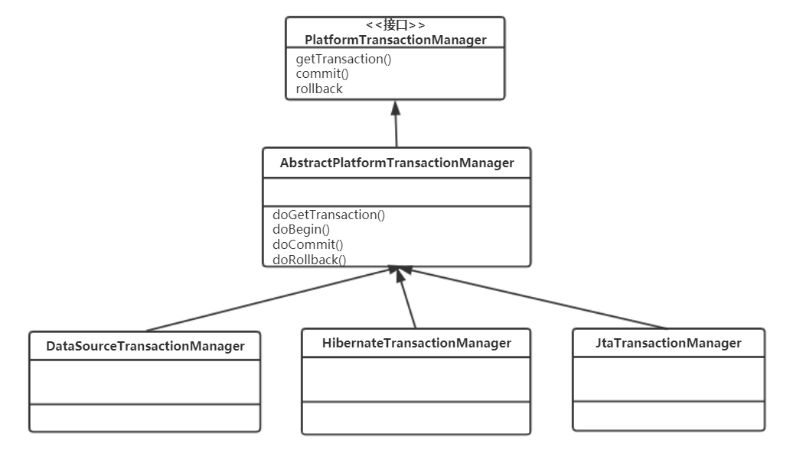
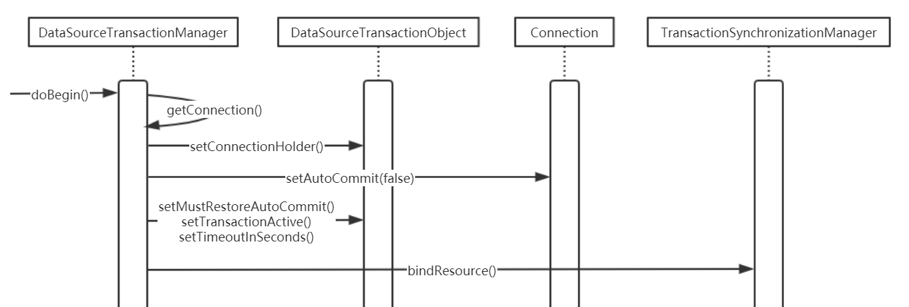

## 1 Spring 事务处理的应用场景

下面，我们以 DataSourceTransactionManager 事务管理器 为例，看一下在具体的事务管理器中如何实现事务创建、提交和回滚这些底层的事务处理操作。DataSourceTransationManager 和其他事务管理器一样，如 JtaTransactionManager，JpaTransactionManager 和 JdoTransactionManager，都继承自 AbstractPlatformManager，作为一个基类，AbstractPlatfromManager 封装了 Spring 事务处理 中通用的处理部分，比如事务的创建、提交、回滚，事务状态和信息的处理，与线程的绑定等，有了这些通用处理的支持，对于具体的事务管理器而言，它们只需要处理和具体数据源相关的组件设置就可以了，比如在 HibernateTransactionManager 中，就只需要配置好和 Hibnernate 事务处理 相关的接口以及相关的设置。所以，从 PlatformTransactionManager 组件 的设计关系上，我们也可以看到，Spring 事务处理 的主要过程是分两个部分完成的，通用的事务处理框架是在 AbstractPlatformManager 中完成，而 Spring 的事务接口与数据源实现的接口，多半是由具体的事务管理器来完成，它们都是作为 AbstractPlatformManager 的子类来是使用的。

可以看到，在 PlatformTransactionManager 组件 的设计中 ，通过 PlatformTransactionManager 接口 设计了一系列与事务处理息息相关的接口方法，如 getTransaction()、commit()、rollback() 这些和事务处理相关的统一接口。对于这些接口的实现，很大一部分是由 AbstractTransactionManager 抽象类 来完成的，这个类中的 doGetTransaction()、doCommit() 等方法和 PlatformTransactionManager 的方法对应，实现的是事务处理中相对通用的部分。在这个 AbstractPlatformManager 下，为具体的数据源配置了不同的事务处理器，以处理不同数据源的事务处理，从而形成了一个从抽象到具体的事务处理中间平台设计，使应用通过声明式事务处理，即开即用事务处理服务，隔离那些与特定的数据源相关的具体实现。



## 2 DataSourceTransactionManager 的实现

我们先看一下 DataSourceTransactionManager，在这个事务管理器中，它的实现直接与事务处理的底层实现相关。在事务开始的时候，会调用 doBegin()方法，首先会得到相对应的 Connection，然后可以根据事务设置的需要，对 Connection 的相关属性进行配置，比如将 Connection 的 autoCommit 功能 关闭，并对像 TimeoutInSeconds 这样的事务处理参数进行设置，最后通过 TransactionSynchronizationManager 来对资源进行绑定。

从下面的代码中可以看到，DataSourceTransactionManager 作为 AbstractPlatformTransactionManager 的子类，在 AbstractPlatformTransactionManager 中已经为事务实现设计好了一系列的模板方法，比如 事务的提交、回滚处理等。在 DataSourceTransactionManager 中， 可以看到对模板方法中一些抽象方法的具体实现。例如，由 DataSourceTransactionManager 的 doBegin()方法 实现负责事务的创建工作。具体来说，如果使用 DataSource 创建事务，最终通过设置 Connection 的 autoCommit 属性 来对事务处理进行配置。在实现过程中，需要把数据库的 Connection 和当前的线程进行绑定。对于事务的提交和回滚，都是通过直接调用 Connection 的提交和回滚来完成的，在这个实现过程中，如何取得事务处理场景中的 Connection 对象，也是一个值得注意的地方。

上面介绍了使用 DataSourceTransactionManager 实现事务创建、提交和回滚的过程，基本上与单独使用 Connection 实现事务处理是一样的，也是通过设置 autoCommit 属性，调用 Connection 的 commit() 和 rollback()方法 来完成的。而我们在声明式事务处理中看到的那些事务处理属性，并不在 DataSourceTransactionManager 中完成，这和我们在前面分析中看到的是一致的。



```java
public class DataSourceTransactionManager extends AbstractPlatformTransactionManager
		implements ResourceTransactionManager, InitializingBean {

    /** 持有 javax.sql.DataSource对象 */
    private DataSource dataSource;

    /**
     * 这里是产生 Transaction对象 的地方，为 Transaction 的创建提供服务，对数据库而言，
     * 事务工作是由 Connection 来完成的。这里把数据库的 Connection对象 放到了 ConnectionHolder 中，
     * 然后封装到一个 DataSourceTransactionObject对象 中，在这个封装过程中增加了许多为事务处理服务的
     * 控制数据
     */
    @Override
    protected Object doGetTransaction() {
        DataSourceTransactionObject txObject = new DataSourceTransactionObject();
        txObject.setSavepointAllowed(isNestedTransactionAllowed());
        // 获取与当前线程绑定的 数据库Connection，这个 Connection 在第一个事务开始
        // 的地方与线程绑定
        ConnectionHolder conHolder =
            (ConnectionHolder) TransactionSynchronizationManager.getResource(this.dataSource);
        txObject.setConnectionHolder(conHolder, false);
        return txObject;
    }

    /**
     * 判断是否存在活跃的事务，由 ConnectionHolder 的 transactionActive属性 来控制
     */
    @Override
    protected boolean isExistingTransaction(Object transaction) {
        DataSourceTransactionObject txObject = (DataSourceTransactionObject) transaction;
        return (txObject.getConnectionHolder() != null && txObject.getConnectionHolder().isTransactionActive());
    }

    /**
     * 这里是处理事务开始的地方，在这里设置隔离级别，但忽略超时
     */
    @Override
    protected void doBegin(Object transaction, TransactionDefinition definition) {
        DataSourceTransactionObject txObject = (DataSourceTransactionObject) transaction;
        Connection con = null;

        try {
            if (txObject.getConnectionHolder() == null ||
                    txObject.getConnectionHolder().isSynchronizedWithTransaction()) {
                Connection newCon = this.dataSource.getConnection();
                if (logger.isDebugEnabled()) {
                    logger.debug("Acquired Connection [" + newCon + "] for JDBC transaction");
                }
                txObject.setConnectionHolder(new ConnectionHolder(newCon), true);
            }

            txObject.getConnectionHolder().setSynchronizedWithTransaction(true);
            con = txObject.getConnectionHolder().getConnection();

            Integer previousIsolationLevel = DataSourceUtils.prepareConnectionForTransaction(con, definition);
            txObject.setPreviousIsolationLevel(previousIsolationLevel);

            // 这里是 数据库Connection 完成事务处理的重要配置，需要把 autoCommit属性 关掉
            if (con.getAutoCommit()) {
                txObject.setMustRestoreAutoCommit(true);
                if (logger.isDebugEnabled()) {
                    logger.debug("Switching JDBC Connection [" + con + "] to manual commit");
                }
                con.setAutoCommit(false);
            }
            txObject.getConnectionHolder().setTransactionActive(true);

            int timeout = determineTimeout(definition);
            if (timeout != TransactionDefinition.TIMEOUT_DEFAULT) {
                txObject.getConnectionHolder().setTimeoutInSeconds(timeout);
            }

            // 把当前的 数据库Connection 与线程绑定
            if (txObject.isNewConnectionHolder()) {
                TransactionSynchronizationManager.bindResource(getDataSource(), txObject.getConnectionHolder());
            }
        }

        catch (Throwable ex) {
            DataSourceUtils.releaseConnection(con, this.dataSource);
            throw new CannotCreateTransactionException("Could not open JDBC Connection for transaction", ex);
        }
    }

    /**
     * 事务提交的具体实现
     */
    @Override
    protected void doCommit(DefaultTransactionStatus status) {
        // 取得 Connection 以后，通过Connection 进行提交
        DataSourceTransactionObject txObject = (DataSourceTransactionObject) status.getTransaction();
        Connection con = txObject.getConnectionHolder().getConnection();
        if (status.isDebug()) {
            logger.debug("Committing JDBC transaction on Connection [" + con + "]");
        }
        try {
            con.commit();
        }
        catch (SQLException ex) {
            throw new TransactionSystemException("Could not commit JDBC transaction", ex);
        }
    }

    /**
     * 事务提交的具体实现，通过 Connection对象 的 rollback()方法 实现
     */
    @Override
    protected void doRollback(DefaultTransactionStatus status) {
        DataSourceTransactionObject txObject = (DataSourceTransactionObject) status.getTransaction();
        Connection con = txObject.getConnectionHolder().getConnection();
        if (status.isDebug()) {
            logger.debug("Rolling back JDBC transaction on Connection [" + con + "]");
        }
        try {
            con.rollback();
        }
        catch (SQLException ex) {
            throw new TransactionSystemException("Could not roll back JDBC transaction", ex);
        }
    }
}
```

上面介绍了使用 DataSourceTransactionManager 实现事务创建、提交和回滚的过程，基本上与单独使用 Connection 实现事务处理是一样的，也是通过设置 autoCommit 属性，调用 Connection 的 commit() 和 rollback()方法 来完成的。看到这里，大家一定会觉得非常的熟悉。而我们在声明式事务处理中看到的那些事务处理属性，并不在 DataSourceTransactionManager 中完成，这和我们在前面分析中看到的是一致的。

## 3 小结

总体来说，从声明式事务的整个实现中我们看到，声明式事务处理完全可以看成是一个具体的 Spring AOP 应用。从这个角度来看，Spring 事务处理 的实现本身就为应用开发者提供了一个非常优秀的 AOP 应用 参考实例。在 Spring 的声明式事务处理中，采用了 IoC 容器 的 Bean 配置 为事务方法调用提供事务属性设置，从而为应用对事务处理的使用提供方便。

有了声明式的使用方式，可以把对事务处理的实现与应用代码分离出来。从 Spring 实现 的角度来看，声明式事务处理的大致实现过程是这样的：在为事务处理配置好 AOP 的基础设施(比如，对应的 Proxy 代理对象 和 事务处理 Interceptor 拦截器对象)之后，首先需要完成对这些事务属性配置的读取，这些属性的读取处理是在 TransactionInterceptor 中实现的，在完成这些事务处理属性的读取之后，Spring 为事务处理的具体实现做好了准备。可以看到，Spring 声明式事务处理 的过程同时也是一个整合事务处理实现到 Spring AOP 和 IoC 容器 中去的过程。我们在整个过程中可以看到下面一些要点，在这些要点中，体现了对 Spring 框架 的基本特性的灵活使用。

- 如何封装各种不同事务处理环境下的事务处理，具体来说，作为应用平台的 Spring，它没法对应用使用什么样的事务处理环境做出限制，这样，对应用户使用的不同的事务处理器，Spring 事务处理平台 都需要为用户提供服务。这些事务处理实现包括在应用中常见的 DataSource 的 Connection、Hibermate 的 Transaction 等，Spring 事务处理 通过一种统一的方式把它们封装起来，从而实现一个通用的事务处理过程，实现这部分事务处理对应用透明，使应用即开即用。
- 如何读取事务处理属性值，在事务处理属性正确读取的基础上，结合事务处理代码，从而完成在既定的事务处理配置下，事务处理方法的实现。
- 如何灵活地使用 Spring AOP 框架，对事务处理进行封装，提供给应用即开即用的声明式事务处理功能。

在这个过程中，有几个 Spring 事务处理 的核心类是我们需要关注的。其中包括 **TransactionInterceptor**，它是使用 AOP 实现声明式事务处理的拦截器，封装了 Spring 对声明式事务处理实现的基本过程；还包括 TransactionAttributeSource 和 **TransactionAttribute** 这两个类，它们封装了对声明式事务处理属性的识别，以及信息的读入和配置。我们看到的 TransactionAttribute 对象，可以视为对事务处理属性的数据抽象，如果在使用声明式事务处理的时候，应用没有配置这些属性，Spring 将为用户提供 DefaultTransactionAttribute 对象，该对象提供了默认的事务处理属性设置。

在事务处理过程中，可以看到 **TransactionInfo** 和 **TransactionStatus** 这两个对象，它们是存放事务处理信息的主要数据对象，它们通过与线程的绑定来实现事务的隔离性。具体来说，TransactionInfo 对象 本身就像是一个栈，对应着每一次事务方法的调用，它会保存每一次事务方法调用的事务处理信息。值得注意的是，在 TransactionInfo 对象 中，它持有 TransactionStatus 对象，这个 TransactionStatus 是非常重要的。由这个 TransactionStatus 来掌管事务执行的详细信息，包括具体的事务对象、事务执行状态、事务设置状态等。

在事务的创建、启动、提交和回滚的过程中，都需要与这个 TransactionStatus 对象 中的数据打交道。在准备完这些与事务管理有关的数据之后，具体的事务处理是由 事务处理器 TransactionManager 来完成的。在事务处理器完成事务处理的过程中，与具体事务处理器无关的操作都被封装到 AbstractPlatformTransactionManager 中实现了。这个抽象的事务处理器为不同的具体事务处理器提供了通用的事务处理模板，它封装了在事务处理过程中，与具体事务处理器无关的公共的事务处理部分。我们在具体的事务处理器(比如 DataSourceTransactionManager 和 HibernateTransactionManager)的实现中可以看到，最为底层的事务创建、挂起、提交、回滚操作。

在 Spring 中，也可以通过编程式的方法来使用事务处理器，以帮助我们处理事务。在编程式的事务处理使用中, TransactionDefinition 是定义事务处理属性的类。对于事务处理属性，Spring 还提供了一个默认的事务属性 DefaultTransactionDefinition 来供用户使用。这种事务处理方式在实现上看起来比声明式事务处理要简单，但编程式实现事务处理却会造成事务处理与业务代码的紧密耦合，因而不经常被使用。在这里，我们之所以举编程式使用事务处理的例子，是因为通过了解编程式事务处理的使用，可以清楚地了解 Spring 统一实现事务处理的大致过程。

有了这个背景，结合对声明式事务处理实现原理的详细分析，比如在声明式事务处理中，使用 AOP 对事务处理进行封装，对事务属性配置进行的处理，与线程绑定从而处理事务并发，并结合事务处理器的使用等，能够在很大程度上提高我们对整个 Spring 事务处理实现 的理解。
