作者: [Java4ye](https://github.com/Java4ye)

### 概览

本文将讲解 Spring 的原理，看看一个 Bean 是怎么被创建出来的，中间经历过那几道工序加工，它的生命周期是怎样的，以及有哪些扩展点，后置处理器可以使用，让你对 Spring 多一些了解！

### 目录

本文会先大概介绍下这些知识点 👇

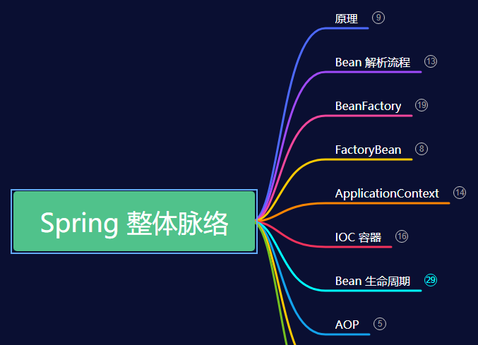

### 印象中的 Spring

脑海中有这么一条公式：

👉 IOC = 工厂模式 + XML + 反射

👉 而 DI , AOP ， **事务** 等也都在 XML 中很直观的表现出来

虽然我们现在大部分用这个注解来代替，但是原理还是基本一样的 🐖

注解使用起来很方便，但是学习的话，还是建议先通过这个 XML ，毕竟结构性的文档，有层次感，可以留下更深的印象~ 😄

### 小小 Spring

把 Spring 浓缩一下，就有了这么一点小东西 🐖

想了下，我们用 Spring ，其中最主要的一点，就是用它来帮我们管理，创建这个 Bean 。

那么先从源头看起 —— Bean 从哪来 (＠\_＠;)

### Bean 解析流程

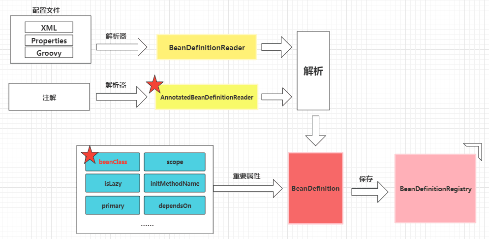

如图所示，就是通过 **解析器**，对我们的 XML 文件或者注解进行解析，最后将这些信息封装在 BeanDefinition 类中，并通过 BeanDefinitionRegistry 接口将这些信息 **注册** 起来，放在 beanDefinitionMap 变量中, key : beanName , value ：BeanDefinition 。

简单看看 BeanDefinition 中的属性叭

### BeanDefinition

- beanClass : bean 的类型 ，实例化时用的 🐖
- scope : 作用范围有 singleton，prototype

- isLazy : **懒加载** ，true 的话 会在 getBean 时生成，而且 scope 的 prototype 无效，false 在 Spring 启动过程中直接生成
- initMethodName : 初始化方法，当然是初始化时调用 🐖
- primary : 主要的，有多个 Bean 时使用它
- dependsOn : 依赖的 Bean，必须等依赖 Bean 创建好才可以创建

> PS: @Component ，@Bean , <bean/> 都会被解析成 BeanDefinition

### 反射

有了原料后呢，咋们再来看看这个 **工厂** BeanFactory

先简单想一想这个工厂要怎么创建这个 Bean 呢？

没错，肯定就是这个 **反射** 啦 😄

那么，结合我们从原料中获取的重要属性之一的 beanClass ，我们可以画出这么一张图 👇

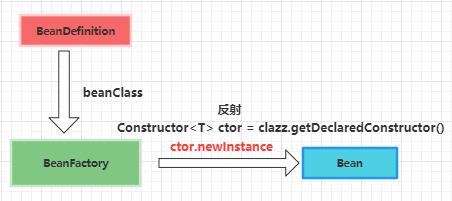

那么我们再来看看这个 BeanFactory 叭 😄

### BeanFactory

先来看看 作为 IOC 容器的**根接口** 的 BeanFactory 提供了什么方法吧 👇

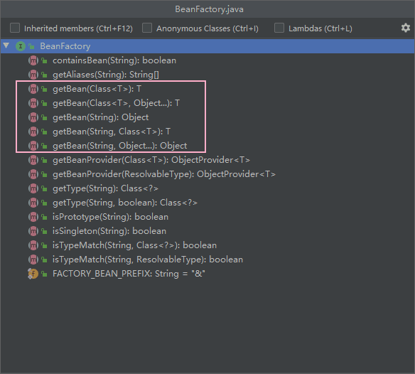

主要是这个 getBean 方法，以及 **别名获取**，**类型获取** 方法和其他一些判断方法如 ：**单例**，**多例**，**类型匹配**，**包含 bean**

我们来简单看看它的子接口都有哪些叭~😄

这里分享个小技巧叭 🐖

看源码的时候，一般就直接看这个**默认**接口 如这里的 DefaultListableBeanFactory

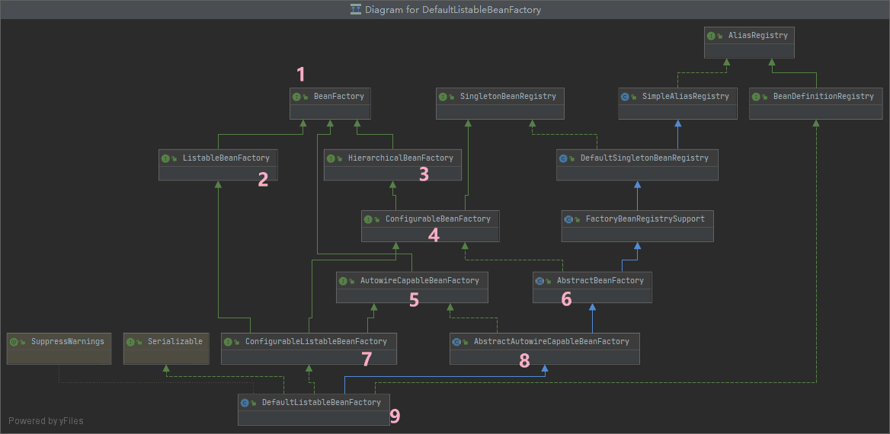

基本上看个类名就知道大概作用了，那么先对号入座下 👇

**ListableBeanFactory**

> 👉 遍历 bean

**HierarchicalBeanFactory**

> 👉 提供 父子关系，可以获取上一级的 BeanFactory

**ConfigurableBeanFactory**

> 👉 实现了 SingletonBeanRegistry ，主要是 单例 Bean 的注册，生成

**AutowireCapableBeanFactory**

> 👉 和自动装配有关的

**AbstractBeanFactory**

> 👉 单例缓存，以及 FactoryBean 相关的

**ConfigurableListableBeanFactory**

> 👉 预实例化单例 Bean，分析，修改 BeanDefinition

**AbstractAutowireCapableBeanFactory**

> 👉 创建 Bean ，属性注入，实例化，调用初始化方法 等等

**DefaultListableBeanFactory**

> 👉 支持单例 Bean ，Bean 别名 ，父子 BeanFactory，Bean 类型转化 ，Bean 后置处理，FactoryBean，自动装配等

是不是非常丰富 😄

### FactoryBean

FactoryBean ，它本身就是个 Bean，算是小工厂 ，归 BeanFactory 这个大工厂管理的。

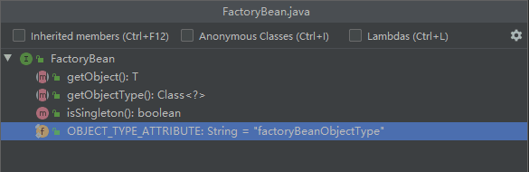

可以看到它就只有三个方法

1. `getObject()` 获取对象
2. `isSingleton()` 单例对象
3. `getObjectType()` 返回的是 Bean 对象的类型

相比大工厂 BeanFactory 少了特别多东西，没有严格的 Bean 生命周期流程 😄

FactoryBean 对象本身也是一个 Bean，是一个小工厂，可以生产另外的 Bean

BeanFactory 是 Spring 容器的根接口，是大工厂，生产各种各样的 Bean

beanName 就是正常对象

“&”+beanName ， 获取的是实现了该接口的 FactoryBean 工厂对象

大致如下 👇

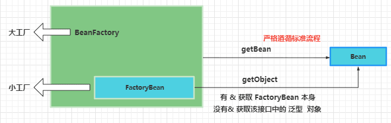

### ApplicationContext

我们再来看看这个 ApplicationContext

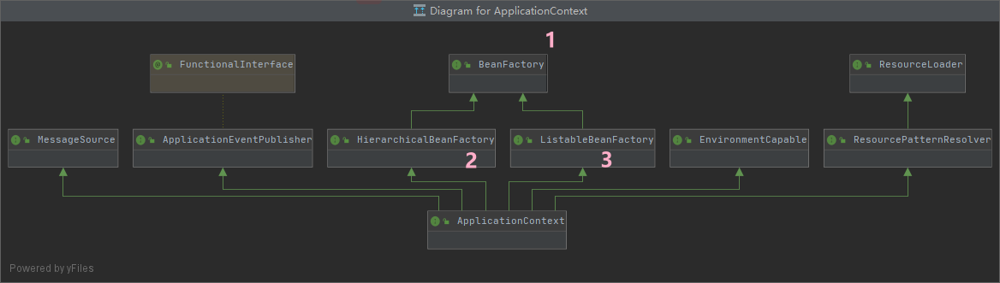

可以看到它扩展了很多功能，除了 BeanFactory ，它还可以**创建 , 获取 Bean**，以及处理**国际化**，**事件**，**获取资源**等

- EnvironmentCapable 获取 环境变量 的功能，可以获取到 **操作系统变量** 和 **JVM 环境变量**
- ListableBeanFactory 获取所有 BeanNames，判断某个 BeanName 是否存在 BeanDefinition 对象，统计 BeanDefinition 对象，获取某个类型对应的所有 beanNames 等功能
- HierarchicalBeanFactory 获取父 BeanFactory ，判断某个 name 是否存在 bean 对象的功能
- MessageSource **国际化功能**，获取某个国际化资源
- ApplicationEventPublisher **事件发布功能**（重点）
- ResourcePatternResolver **加载，获取资源的功能**，这里的资源可能是文件，图片 等某个 URL 资源都可以

还有这三个重要的类 👇,就不一一介绍先啦 😄

1. ClassPathXmlApplicationContext
2. AnnotationConfigApplicationContext
3. FileSystemXmlApplicationContext

赶紧来看看这个核心叭！

### IOC 容器

当然，这时候出场的肯定是 IOC 啦。

我们都知道 IOC 是 **控制反转** ，但是别忘了 **容器** 这个词，比如 **容器的根接口** BeanFactory ，**容器的实现** 👇

1. ClassPathXmlApplicationContext
2. AnnotationConfigApplicationContext
3. FileSystemXmlApplicationContext

同时我们要注意这里无处不在的 **后置处理器** xxxPostProcessor 🐷

这个是 Spring 中扩展性强的原因了！

我们可以在各个过程中合理应用这些 PostProcessor 来扩展，或者修改 Bean 定义信息等等

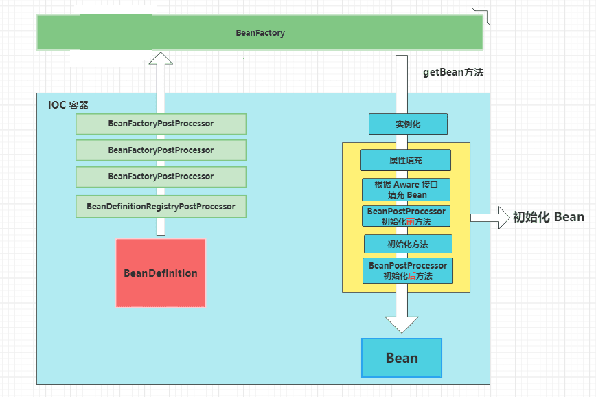

可以看到在这个容器中，完成了 Bean 的初始化，而这个过程还有很多细节 ，请往下看看 👇

DI 到时写 **属性填充** 时再介绍 🐷

### BeanFactory 后置处理器

作为 IOC 容器根接口的 BeanFactory ，有着非常高的扩展性，比如最开始获取原料 BeanDefinition 时，就出现了两个针对 BeanFactory 工厂的后置处理器 👇

BeanDefinitionRegistryPostProcessor

> 通过该接口，我们可以自己掌控我们的 **原料**，通过 BeanDefinitionRegistry 接口去 **新增**，**删除**，**获取**我们这个 BeanDefinition

BeanFactoryPostProcessor

> 通过该接口，可以在 **实例化对象前**，对 BeanDefinition 进行修改 ，**冻结** ，**预实例化单例 Bean** 等

经过上面层层阻碍后，我们最终会来到目标方法 getBean ，将原料投入生产，最终获取一个个 Bean 对象出来

那么随之而来的就是这个 Bean 的生命周期啦 😄

### Bean 生命周期

Bean 的创建和管理有**标准化的流程**！

这里在我们的工厂 BeanFactory 中写得很清楚 👇

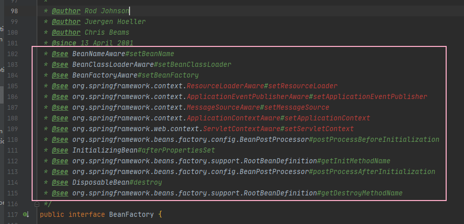

总共 **14** 个步骤，是不是一下子就清晰多了 😄

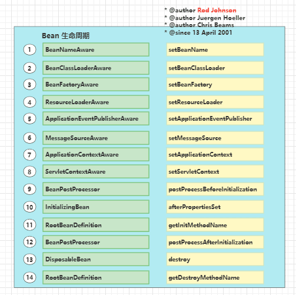

在看这部分的源码时，要多注意两个英文单词 😝

1. **实例化** 👉 **Instantiation**
2. **初始化** 👉 **Initialization**

ps: 别看快搞错了 哈哈 😝

仔细阅读上面这 14 个步骤，会发现前面 **8** 个都是 Aware 接口，而他们的作用也很简单，就是获取 xxAware 这个单词的前缀 xx 😄

比如事件发布器 ApplicationEventPublisher ，只要你实现了 ApplicationEventPublisherAware 接口，就可以**获取** 事件发布器 ApplicationEventPublisher ！

### Bean 后置处理器

在实例化 和 初始化流程中，把这个 Bean 的后置处理器 BeanPostProcessor 安排上，就得到下图啦 👇

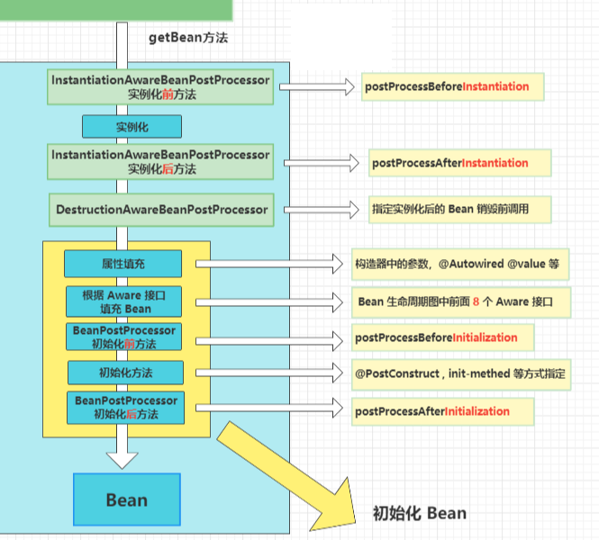

这里留意下 **实例化** 有扩展点 InstantiationAwareBeanPostProcessor ， **初始化** 扩展点 BeanPostProcessor 就非常多啦，我们主要来关注下这个 AOP

### AOP

那么 AOP 是在哪个步骤代理对象的呢？👇

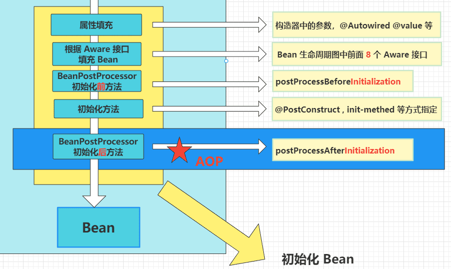

可以在 AbstractAutoProxyCreator 类中看到 👇

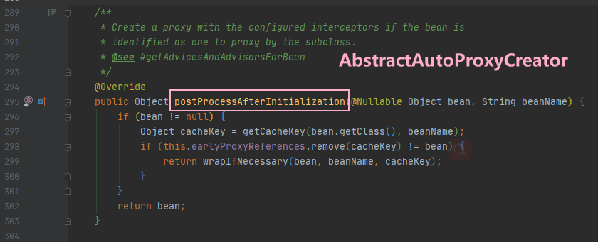

### 总结

本文就先介绍到这里啦 🐖

主要介绍了 Spring 里面的这些脉络，方便小伙伴们对它有个整体的印象先~

再介绍其中的一些扩展点，比如从源材料开始的 BeanFactoryPostprocessor ，到产物 Bean 的 BeanPostprocessor 。

实例化，初始化的顺序，Bean 的生命周期，以及 BeanFactory 及子类扩展的功能，再到 ApplicationContext 的功能。

还有这个核心机制： **工厂+XML+反射**，以及 AOP **发生的地方**。😋

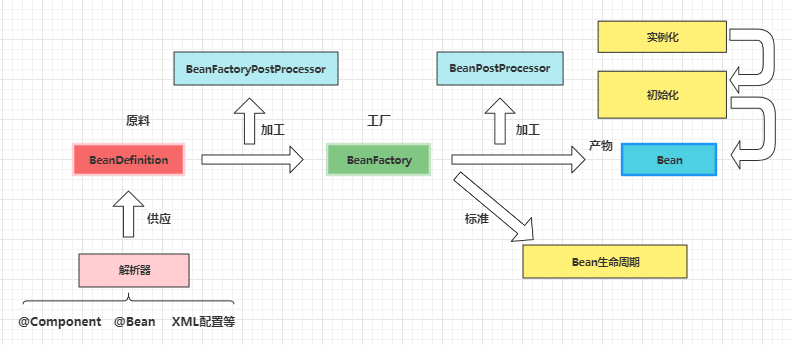
