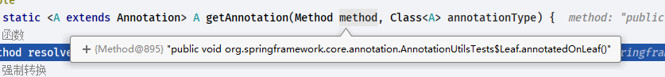
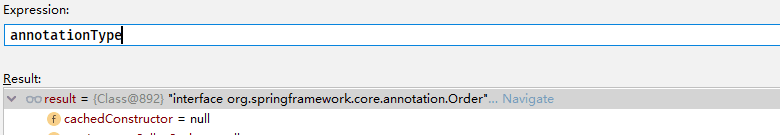
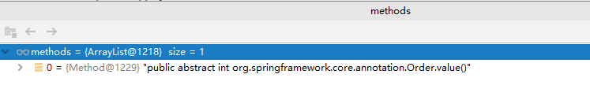
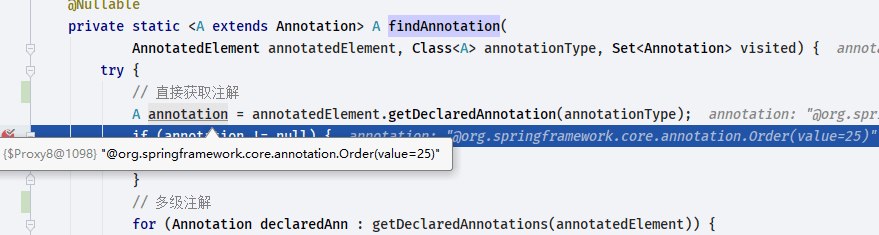

# Spring AnnotationUtils

- Author: [HuiFer](https://github.com/huifer)
- 源码阅读仓库: [SourceHot-Spring](https://github.com/SourceHot/spring-framework-read)
- `org.springframework.core.annotation.AnnotationUtils`提供了注解相关的方法
  1. getAnnotation: 获取注解
  1. findAnnotation: 寻找注解
  1. getValue: 获取属性值
  1. getDefaultValue: 获取默认值

## getAnnotation

- 测试用例如下

```java
@Test
public void findMethodAnnotationOnLeaf() throws Exception {
    Method m = Leaf.class.getMethod("annotatedOnLeaf");
    assertNotNull(m.getAnnotation(Order.class));
    assertNotNull(getAnnotation(m, Order.class));
    assertNotNull(findAnnotation(m, Order.class));
}

```

- `org.springframework.core.annotation.AnnotationUtils.getAnnotation(java.lang.reflect.Method, java.lang.Class<A>)`

```java
/**
 * Get a single {@link Annotation} of {@code annotationType} from the
 * supplied {@link Method}, where the annotation is either <em>present</em>
 * or <em>meta-present</em> on the method.
 * <p>Correctly handles bridge {@link Method Methods} generated by the compiler.
 * <p>Note that this method supports only a single level of meta-annotations.
 * For support for arbitrary levels of meta-annotations, use
 * {@link #findAnnotation(Method, Class)} instead.
 *
 * @param method         the method to look for annotations on
 *                          被检查的函数
 * @param annotationType the annotation type to look for
 *                          需要检测的注解类型
 * @return the first matching annotation, or {@code null} if not found
 * @see org.springframework.core.BridgeMethodResolver#findBridgedMethod(Method)
 * @see #getAnnotation(AnnotatedElement, Class)
 */
@Nullable
public static <A extends Annotation> A getAnnotation(Method method, Class<A> annotationType) {
    // 函数
    Method resolvedMethod = BridgeMethodResolver.findBridgedMethod(method);
    // 强制转换
    return getAnnotation((AnnotatedElement) resolvedMethod, annotationType);
}

```

- method



- annotationType



```java
@Nullable
public static <A extends Annotation> A getAnnotation(AnnotatedElement annotatedElement, Class<A> annotationType) {
    try {
        // 获取注解
        A annotation = annotatedElement.getAnnotation(annotationType);
        if (annotation == null) {
            for (Annotation metaAnn : annotatedElement.getAnnotations()) {
                annotation = metaAnn.annotationType().getAnnotation(annotationType);
                if (annotation != null) {
                    break;
                }
            }
        }
        return (annotation != null ? synthesizeAnnotation(annotation, annotatedElement) : null);
    } catch (Throwable ex) {
        handleIntrospectionFailure(annotatedElement, ex);
        return null;
    }
}

```

- `org.springframework.core.annotation.AnnotationUtils.synthesizeAnnotation(A, java.lang.reflect.AnnotatedElement)`

```java
public static <A extends Annotation> A synthesizeAnnotation(
        A annotation, @Nullable AnnotatedElement annotatedElement) {

    return synthesizeAnnotation(annotation, (Object) annotatedElement);
}

```

```java
/**
 * 注解是否存在别名,没有直接返回
 *
 * @param annotation       注解
 * @param annotatedElement 函数
 * @param <A>
 * @return
 */
@SuppressWarnings("unchecked")
static <A extends Annotation> A synthesizeAnnotation(A annotation, @Nullable Object annotatedElement) {
    if (annotation instanceof SynthesizedAnnotation || hasPlainJavaAnnotationsOnly(annotatedElement)) {
        return annotation;
    }
    // 具体的注解
    Class<? extends Annotation> annotationType = annotation.annotationType();
    if (!isSynthesizable(annotationType)) {
        return annotation;
    }

    DefaultAnnotationAttributeExtractor attributeExtractor =
            new DefaultAnnotationAttributeExtractor(annotation, annotatedElement);
    InvocationHandler handler = new SynthesizedAnnotationInvocationHandler(attributeExtractor);

    // Can always expose Spring's SynthesizedAnnotation marker since we explicitly check for a
    // synthesizable annotation before (which needs to declare @AliasFor from the same package)
    Class<?>[] exposedInterfaces = new Class<?>[]{annotationType, SynthesizedAnnotation.class};
    return (A) Proxy.newProxyInstance(annotation.getClass().getClassLoader(), exposedInterfaces, handler);
}

```

-`org.springframework.core.annotation.AnnotationUtils.isSynthesizable`

```java
@SuppressWarnings("unchecked")
private static boolean isSynthesizable(Class<? extends Annotation> annotationType) {
    if (hasPlainJavaAnnotationsOnly(annotationType)) {
        return false;
    }
    // 从缓存中获取当前注解,不存在null
    Boolean synthesizable = synthesizableCache.get(annotationType);
    if (synthesizable != null) {
        return synthesizable;
    }

    synthesizable = Boolean.FALSE;
    for (Method attribute : getAttributeMethods(annotationType)) {
        if (!getAttributeAliasNames(attribute).isEmpty()) {
            synthesizable = Boolean.TRUE;
            break;
        }
        // 获取返回值类型
        Class<?> returnType = attribute.getReturnType();

        // 根据返回值做不同处理
        if (Annotation[].class.isAssignableFrom(returnType)) {
            Class<? extends Annotation> nestedAnnotationType =
                    (Class<? extends Annotation>) returnType.getComponentType();
            if (isSynthesizable(nestedAnnotationType)) {
                synthesizable = Boolean.TRUE;
                break;
            }
        } else if (Annotation.class.isAssignableFrom(returnType)) {
            Class<? extends Annotation> nestedAnnotationType = (Class<? extends Annotation>) returnType;
            if (isSynthesizable(nestedAnnotationType)) {
                synthesizable = Boolean.TRUE;
                break;
            }
        }
    }

    synthesizableCache.put(annotationType, synthesizable);
    return synthesizable;
}

```

- `org.springframework.core.annotation.AnnotationUtils#getAttributeMethods`

```java
static List<Method> getAttributeMethods(Class<? extends Annotation> annotationType) {
    List<Method> methods = attributeMethodsCache.get(annotationType);
    if (methods != null) {
        return methods;
    }

    methods = new ArrayList<>();
    // annotationType.getDeclaredMethods() 获取注解中的方法
    for (Method method : annotationType.getDeclaredMethods()) {
        if (isAttributeMethod(method)) {
            ReflectionUtils.makeAccessible(method);
            methods.add(method);
        }
    }

    // 缓存 key:注解,value:函数列表
    attributeMethodsCache.put(annotationType, methods);
    // 函数列表
    return methods;
}

```

- `org.springframework.core.annotation.AnnotationUtils#isAttributeMethod`

```java
/**
 * Determine if the supplied {@code method} is an annotation attribute method.
 * <p>
 * 做3个判断
 * <ol>
 *     <li>函数不为空(method != null)</li>
 *     <li>参数列表是不是空(method.getParameterCount() == 0)</li>
 *     <li>返回类型不是void(method.getReturnType() != void.class)</li>
 * </ol>
 *
 * @param method the method to check
 * @return {@code true} if the method is an attribute method
 * @since 4.2
 */
static boolean isAttributeMethod(@Nullable Method method) {
    return (method != null && method.getParameterCount() == 0 && method.getReturnType() !=void.class);
}

```

- `org.springframework.util.ReflectionUtils#makeAccessible(java.lang.reflect.Method)`

```java
@SuppressWarnings("deprecation")  // on JDK 9
public static void makeAccessible(Method method) {
    // 1. 方法修饰符是不是public
    // 2. 注解是不是public
    // 3. 是否重写
    if ((!Modifier.isPublic(method.getModifiers()) ||
            !Modifier.isPublic(method.getDeclaringClass().getModifiers())) && !method.isAccessible()) {
        method.setAccessible(true);
    }
}
```

处理结果




处理结果和 Order 定义相同

```java
@Retention(RetentionPolicy.RUNTIME)
@Target({ElementType.TYPE, ElementType.METHOD, ElementType.FIELD})
@Documented
public @interface Order {

    /**
     * The order value.
     * <p>Default is {@link Ordered#LOWEST_PRECEDENCE}.
     *
     * 启动顺序,默认integer最大值
     * @see Ordered#getOrder()
     */
    int value() default Ordered.LOWEST_PRECEDENCE;

}
```

最终返回


## findAnnotation

- `org.springframework.core.annotation.AnnotationUtils#findAnnotation(java.lang.reflect.Method, java.lang.Class<A>)`

```java
@SuppressWarnings("unchecked")
@Nullable
public static <A extends Annotation> A findAnnotation(Method method, @Nullable Class<A> annotationType) {
    Assert.notNull(method, "Method must not be null");
    if (annotationType == null) {
        return null;
    }
    // 创建注解缓存,key:被扫描的函数,value:注解
    AnnotationCacheKey cacheKey = new AnnotationCacheKey(method, annotationType);
    // 从findAnnotationCache获取缓存
    A result = (A) findAnnotationCache.get(cacheKey);

    if (result == null) {
        Method resolvedMethod = BridgeMethodResolver.findBridgedMethod(method);
        // 寻找注解
        result = findAnnotation((AnnotatedElement) resolvedMethod, annotationType);
        if (result == null) {
            result = searchOnInterfaces(method, annotationType, method.getDeclaringClass().getInterfaces());
        }

        Class<?> clazz = method.getDeclaringClass();
        while (result == null) {
            clazz = clazz.getSuperclass();
            if (clazz == null || clazz == Object.class) {
                break;
            }
            Set<Method> annotatedMethods = getAnnotatedMethodsInBaseType(clazz);
            if (!annotatedMethods.isEmpty()) {
                for (Method annotatedMethod : annotatedMethods) {
                    if (isOverride(method, annotatedMethod)) {
                        Method resolvedSuperMethod = BridgeMethodResolver.findBridgedMethod(annotatedMethod);
                        result = findAnnotation((AnnotatedElement) resolvedSuperMethod, annotationType);
                        if (result != null) {
                            break;
                        }
                    }
                }
            }
            if (result == null) {
                result = searchOnInterfaces(method, annotationType, clazz.getInterfaces());
            }
        }

        if (result != null) {
            // 处理注解
            result = synthesizeAnnotation(result, method);
            // 添加缓存
            findAnnotationCache.put(cacheKey, result);
        }
    }
    // 返回
    return result;
}

```

- `org.springframework.core.annotation.AnnotationUtils.AnnotationCacheKey`

```java
private static final class AnnotationCacheKey implements Comparable<AnnotationCacheKey> {

    /**
    * 带有注解的函数或者类
    */
    private final AnnotatedElement element;

    /**
    * 注解
    */
    private final Class<? extends Annotation> annotationType;

    public AnnotationCacheKey(AnnotatedElement element, Class<? extends Annotation> annotationType) {
        this.element = element;
        this.annotationType = annotationType;
    }

}
```

- `org.springframework.core.annotation.AnnotationUtils#findAnnotation(java.lang.reflect.AnnotatedElement, java.lang.Class<A>)`

```java
@Nullable
public static <A extends Annotation> A findAnnotation(
        AnnotatedElement annotatedElement, @Nullable Class<A> annotationType) {
    // 注解类型不为空
    if (annotationType == null) {
        return null;
    }

    // Do NOT store result in the findAnnotationCache since doing so could break
    // findAnnotation(Class, Class) and findAnnotation(Method, Class).
    // 寻找注解
    A ann = findAnnotation(annotatedElement, annotationType, new HashSet<>());
    return (ann != null ? synthesizeAnnotation(ann, annotatedElement) : null);
}

```

- `org.springframework.core.annotation.AnnotationUtils#findAnnotation(java.lang.reflect.AnnotatedElement, java.lang.Class<A>, java.util.Set<java.lang.annotation.Annotation>)`

```java
@Nullable
private static <A extends Annotation> A findAnnotation(
        AnnotatedElement annotatedElement, Class<A> annotationType, Set<Annotation> visited) {
    try {
        // 直接获取注解
        A annotation = annotatedElement.getDeclaredAnnotation(annotationType);
        if (annotation != null) {
            return annotation;
        }
        // 多级注解
        for (Annotation declaredAnn : getDeclaredAnnotations(annotatedElement)) {
            Class<? extends Annotation> declaredType = declaredAnn.annotationType();
            // 注解是否 由java.lang.annotation提供
            if (!isInJavaLangAnnotationPackage(declaredType) && visited.add(declaredAnn)) {
                annotation = findAnnotation((AnnotatedElement) declaredType, annotationType, visited);
                if (annotation != null) {
                    return annotation;
                }
            }
        }
    } catch (Throwable ex) {
        handleIntrospectionFailure(annotatedElement, ex);
    }
    return null;
}

```



- `synthesizeAnnotation`方法就不再重复一遍了可以看上文

## getValue

- 测试用例

```java
@Test
public void getValueFromAnnotation() throws Exception {
    Method method = SimpleFoo.class.getMethod("something", Object.class);
    Order order = findAnnotation(method, Order.class);

    assertEquals(1, getValue(order, VALUE));
    assertEquals(1, getValue(order));
}
```

- `org.springframework.core.annotation.AnnotationUtils#getValue(java.lang.annotation.Annotation, java.lang.String)`

```java
@Nullable
public static Object getValue(@Nullable Annotation annotation, @Nullable String attributeName) {
    if (annotation == null || !StringUtils.hasText(attributeName)) {
        return null;
    }
    try {
        // 根据attributeName获取注解对应函数
        Method method = annotation.annotationType().getDeclaredMethod(attributeName);
        ReflectionUtils.makeAccessible(method);
        // 反射执行方法
        return method.invoke(annotation);
    } catch (NoSuchMethodException ex) {
        return null;
    } catch (InvocationTargetException ex) {
        rethrowAnnotationConfigurationException(ex.getTargetException());
        throw new IllegalStateException("Could not obtain value for annotation attribute '" +
                attributeName + "' in " + annotation, ex);
    } catch (Throwable ex) {
        handleIntrospectionFailure(annotation.getClass(), ex);
        return null;
    }
}

```

```java
@Nullable
public static Object getValue(Annotation annotation) {
    return getValue(annotation, VALUE);
}

```

## getDefaultValue

- `org.springframework.core.annotation.AnnotationUtils#getDefaultValue(java.lang.annotation.Annotation)`

```java
@Nullable
public static Object getDefaultValue(Annotation annotation) {
    return getDefaultValue(annotation, VALUE);
}

```

```java
@Nullable
public static Object getDefaultValue(
        @Nullable Class<? extends Annotation> annotationType, @Nullable String attributeName) {

    if (annotationType == null || !StringUtils.hasText(attributeName)) {
        return null;
    }
    try {
        // 直接获取defaultValue
        return annotationType.getDeclaredMethod(attributeName).getDefaultValue();
    } catch (Throwable ex) {
        handleIntrospectionFailure(annotationType, ex);
        return null;
    }
}

```
