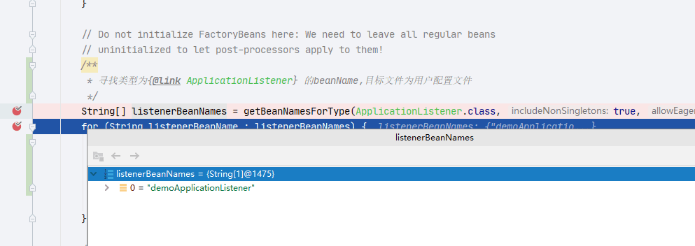
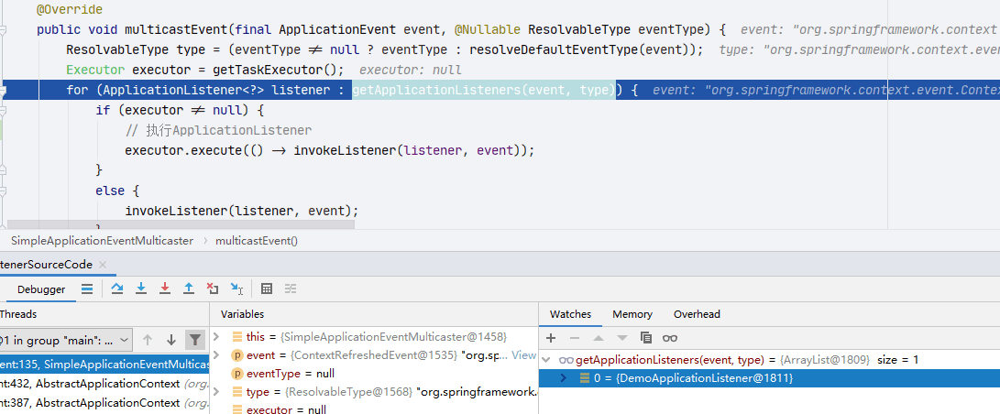
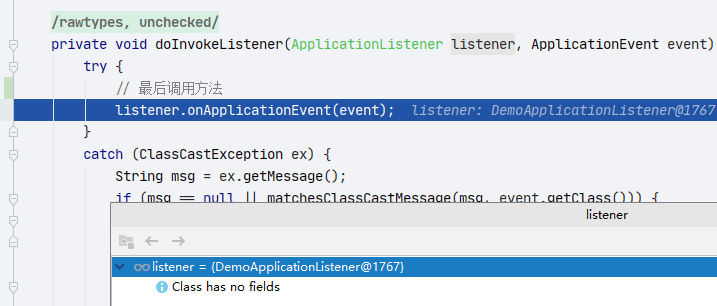
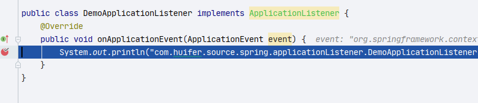

# Spring initApplicationEventMulticaster

- Author: [HuiFer](https://github.com/huifer)
- 源码阅读仓库: [SourceHot-Spring](https://github.com/SourceHot/spring-framework-read)

## demo

```java
package com.huifer.source.spring.applicationListener;

import org.springframework.context.ApplicationEvent;
import org.springframework.context.ApplicationListener;

public class DemoApplicationListener implements ApplicationListener {
    @Override
    public void onApplicationEvent(ApplicationEvent event) {
        System.out.println("com.huifer.source.spring.applicationListener.DemoApplicationListener.onApplicationEvent");
    }
}

```

```XML
<?xml version="1.0" encoding="UTF-8"?>
<beans xmlns:xsi="http://www.w3.org/2001/XMLSchema-instance"
       xmlns="http://www.springframework.org/schema/beans"
       xsi:schemaLocation="http://www.springframework.org/schema/beans http://www.springframework.org/schema/beans/spring-beans.xsd">

    <bean id="demoApplicationListener" class="com.huifer.source.spring.applicationListener.DemoApplicationListener"/>
</beans>
```

```java
public class ListenerSourceCode {
    public static void main(String[] args) {
        ApplicationContext context = new ClassPathXmlApplicationContext("Listener-demo.xml");
    }
}
```

## 初始化入口

- `org.springframework.context.support.AbstractApplicationContext.refresh`中的`initApplicationEventMulticaster`方法

```java
    protected void initApplicationEventMulticaster() {
        ConfigurableListableBeanFactory beanFactory = getBeanFactory();
        // 判断是否存在名字applicationEventMulticaster的bean
        if (beanFactory.containsLocalBean(APPLICATION_EVENT_MULTICASTER_BEAN_NAME)) {
            this.applicationEventMulticaster =
                    beanFactory.getBean(APPLICATION_EVENT_MULTICASTER_BEAN_NAME, ApplicationEventMulticaster.class);
            if (logger.isTraceEnabled()) {
                logger.trace("Using ApplicationEventMulticaster [" + this.applicationEventMulticaster + "]");
            }
        }
        else {
            // 创建一个
            this.applicationEventMulticaster = new SimpleApplicationEventMulticaster(beanFactory);
            beanFactory.registerSingleton(APPLICATION_EVENT_MULTICASTER_BEAN_NAME, this.applicationEventMulticaster);
            if (logger.isTraceEnabled()) {
                logger.trace("No '" + APPLICATION_EVENT_MULTICASTER_BEAN_NAME + "' bean, using " +
                        "[" + this.applicationEventMulticaster.getClass().getSimpleName() + "]");
            }
        }
    }

```

## 注册

```java
    protected void registerListeners() {
        // Register statically specified listeners first.
        // 读取 ApplicationListener
        for (ApplicationListener<?> listener : getApplicationListeners()) {
            getApplicationEventMulticaster().addApplicationListener(listener);
        }

        // Do not initialize FactoryBeans here: We need to leave all regular beans
        // uninitialized to let post-processors apply to them!
        /**
         * 寻找类型为{@link ApplicationListener} 的beanName,目标文件为用户配置文件
         */
        String[] listenerBeanNames = getBeanNamesForType(ApplicationListener.class, true, false);
        for (String listenerBeanName : listenerBeanNames) {
            /**
             * 1. 获取 {@link applicationEventMulticaster}
             * 2. 添加监听器名称
             */
            getApplicationEventMulticaster().addApplicationListenerBean(listenerBeanName);
        }

        // Publish early application events now that we finally have a multicaster...
        Set<ApplicationEvent> earlyEventsToProcess = this.earlyApplicationEvents;
        this.earlyApplicationEvents = null;
        if (earlyEventsToProcess != null) {
            for (ApplicationEvent earlyEvent : earlyEventsToProcess) {
                getApplicationEventMulticaster().multicastEvent(earlyEvent);
            }
        }
    }

```



## finishRefresh 发布

```java
    protected void finishRefresh() {
        // Clear context-level resource caches (such as ASM metadata from scanning).
        clearResourceCaches();

        // Initialize lifecycle processor for this context.
        initLifecycleProcessor();

        // Propagate refresh to lifecycle processor first.
        getLifecycleProcessor().onRefresh();

        // Publish the final event.
        // 发布事件做处理
        publishEvent(new ContextRefreshedEvent(this));

        // Participate in LiveBeansView MBean, if active.
        LiveBeansView.registerApplicationContext(this);
    }

```

- `org.springframework.context.support.AbstractApplicationContext#publishEvent(org.springframework.context.ApplicationEvent)`
  - `org.springframework.context.support.AbstractApplicationContext#publishEvent(java.lang.Object, org.springframework.core.ResolvableType)`

```java
protected void publishEvent(Object event, @Nullable ResolvableType eventType) {
        Assert.notNull(event, "Event must not be null");

        // Decorate event as an ApplicationEvent if necessary
        ApplicationEvent applicationEvent;
        if (event instanceof ApplicationEvent) {
            applicationEvent = (ApplicationEvent) event;
        }
        else {
            applicationEvent = new PayloadApplicationEvent<>(this, event);
            if (eventType == null) {
                eventType = ((PayloadApplicationEvent<?>) applicationEvent).getResolvableType();
            }
        }

        // Multicast right now if possible - or lazily once the multicaster is initialized
        if (this.earlyApplicationEvents != null) {
            this.earlyApplicationEvents.add(applicationEvent);
        }
        else {
            /**
             * 执行监听事件
             * {@link ApplicationEventMulticaster} ->{@link SimpleApplicationEventMulticaster}
             */
            getApplicationEventMulticaster().multicastEvent(applicationEvent, eventType);
        }

        // Publish event via parent context as well...
        if (this.parent != null) {
            if (this.parent instanceof AbstractApplicationContext) {
                ((AbstractApplicationContext) this.parent).publishEvent(event, eventType);
            }
            else {
                this.parent.publishEvent(event);
            }
        }
    }
```

- 执行监听方法



```java
    protected void invokeListener(ApplicationListener<?> listener, ApplicationEvent event) {
        ErrorHandler errorHandler = getErrorHandler();
        if (errorHandler != null) {
            try {
                doInvokeListener(listener, event);
            }
            catch (Throwable err) {
                errorHandler.handleError(err);
            }
        }
        else {
            doInvokeListener(listener, event);
        }
    }

```

```java
    @SuppressWarnings({"rawtypes", "unchecked"})
    private void doInvokeListener(ApplicationListener listener, ApplicationEvent event) {
        try {
            // 最后调用方法
            listener.onApplicationEvent(event);
        }
        catch (ClassCastException ex) {
            String msg = ex.getMessage();
            if (msg == null || matchesClassCastMessage(msg, event.getClass())) {
                // Possibly a lambda-defined listener which we could not resolve the generic event type for
                // -> let's suppress the exception and just log a debug message.
                Log logger = LogFactory.getLog(getClass());
                if (logger.isTraceEnabled()) {
                    logger.trace("Non-matching event type for listener: " + listener, ex);
                }
            }
            else {
                throw ex;
            }
        }
    }

```




