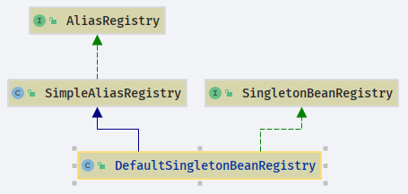

# DefaultSingletonBeanRegistry

- Author: [HuiFer](https://github.com/huifer)
- 源码阅读仓库: [SourceHot-Spring](https://github.com/SourceHot/spring-framework-read)
- 源码路径: `org.springframework.beans.factory.support.DefaultSingletonBeanRegistry`
- 官方提供的测试类: `org.springframework.beans.factory.support.DefaultSingletonBeanRegistryTests`

类图


## 注册方法解析

- 从名字可以看出这是一个单例对象的注册类
- `org.springframework.beans.factory.support.DefaultSingletonBeanRegistry.registerSingleton`

- 测试用例出发

  ```java
      @Test
      public void testSingletons() {
          DefaultSingletonBeanRegistry beanRegistry = new DefaultSingletonBeanRegistry();

          TestBean tb = new TestBean();
          beanRegistry.registerSingleton("tb", tb);
          assertSame(tb, beanRegistry.getSingleton("tb"));

          TestBean tb2 = (TestBean) beanRegistry.getSingleton("tb2", new ObjectFactory<Object>() {
              @Override
              public Object getObject() throws BeansException {
                  return new TestBean();
              }
          });
          assertSame(tb2, beanRegistry.getSingleton("tb2"));

          assertSame(tb, beanRegistry.getSingleton("tb"));
          assertSame(tb2, beanRegistry.getSingleton("tb2"));
          assertEquals(2, beanRegistry.getSingletonCount());
          String[] names = beanRegistry.getSingletonNames();
          assertEquals(2, names.length);
          assertEquals("tb", names[0]);
          assertEquals("tb2", names[1]);

          beanRegistry.destroySingletons();
          assertEquals(0, beanRegistry.getSingletonCount());
          assertEquals(0, beanRegistry.getSingletonNames().length);
      }

  ```

- 第一个关注的方法`org.springframework.beans.factory.support.DefaultSingletonBeanRegistry#registerSingleton` 注册单例对象

```java
    /**
     * 注册一个单例对象
     *
     * @param beanName        the name of the bean
     * @param singletonObject the existing singleton object
     * @throws IllegalStateException
     */
    @Override
    public void registerSingleton(String beanName, Object singletonObject) throws IllegalStateException {
        Assert.notNull(beanName, "Bean name must not be null");
        Assert.notNull(singletonObject, "Singleton object must not be null");
        synchronized (this.singletonObjects) {
            // 通过beanName获取单例对象
            Object oldObject = this.singletonObjects.get(beanName);
            // 不为空异常
            if (oldObject != null) {
                throw new IllegalStateException("Could not register object [" + singletonObject +
                        "] under bean name '" + beanName + "': there is already object [" + oldObject + "] bound");
            }
            // 添加方法
            addSingleton(beanName, singletonObject);
        }
    }

```

```java
    /**
     * Add the given singleton object to the singleton cache of this factory.
     * <p>To be called for eager registration of singletons.
     * <p>
     * 添加单例对象的操作方法
     *
     * @param beanName        the name of the bean
     * @param singletonObject the singleton object
     */
    protected void addSingleton(String beanName, Object singletonObject) {
        synchronized (this.singletonObjects) {
            this.singletonObjects.put(beanName, singletonObject);
            this.singletonFactories.remove(beanName);
            this.earlySingletonObjects.remove(beanName);
            this.registeredSingletons.add(beanName);
        }
    }
```

- 这些变量是什么

```java
    /**
     * 单例对象的缓存: beanName -> Object
     */
    private final Map<String, Object> singletonObjects = new ConcurrentHashMap<>(256);

    /**
     * 单例工厂的缓存: beanName -> ObjectFactory。
     */
    private final Map<String, ObjectFactory<?>> singletonFactories = new HashMap<>(16);

    /**
     * 延迟加载的单例对象缓存: beanName -> Object
     */
    private final Map<String, Object> earlySingletonObjects = new HashMap<>(16);

    /**
     * 已经注册过的单例对象名称(beanName)
     */
    private final Set<String> registeredSingletons = new LinkedHashSet<>(256);

    /**
     * 当前正在创建的单例对象名称(beanName)
     */
    private final Set<String> singletonsCurrentlyInCreation =
            Collections.newSetFromMap(new ConcurrentHashMap<>(16));

    private final Set<String> inCreationCheckExclusions =
            Collections.newSetFromMap(new ConcurrentHashMap<>(16));
    /**
     * 摧毁单例对象
     */
    private final Map<String, Object> disposableBeans = new LinkedHashMap<>();
    private final Map<String, Set<String>> containedBeanMap = new ConcurrentHashMap<>(16);
    /**
     * bean 和beanName的关系
     */
    private final Map<String, Set<String>> dependentBeanMap = new ConcurrentHashMap<>(64);
    /**
     * bean 依赖关系 beanName -> 依赖关系
     */
    private final Map<String, Set<String>> dependenciesForBeanMap = new ConcurrentHashMap<>(64);
    /**
     * 异常列表
     */
    @Nullable
    private Set<Exception> suppressedExceptions;
    /**
     * 标记是否在 destroySingletons 上
     */
    private boolean singletonsCurrentlyInDestruction = false;

```

- 注册方法至此结束

## 获取方法解析

- `org.springframework.beans.factory.support.DefaultSingletonBeanRegistry.getSingleton(java.lang.String)`

```java
    @Override
    @Nullable
    public Object getSingleton(String beanName) {
        return getSingleton(beanName, true);
    }
```

```java
    @Nullable
    protected Object getSingleton(String beanName, boolean allowEarlyReference) {
        // 从列表中获取单例对象
        Object singletonObject = this.singletonObjects.get(beanName);
        // 判断当前beanName是否存在
        if (singletonObject == null && isSingletonCurrentlyInCreation(beanName)) {
            synchronized (this.singletonObjects) {
                // 从延迟加载中获取
                singletonObject = this.earlySingletonObjects.get(beanName);
                if (singletonObject == null && allowEarlyReference) {
                    // 从singletonFactories获取ObjectFactory
                    ObjectFactory<?> singletonFactory = this.singletonFactories.get(beanName);
                    if (singletonFactory != null) {
                        // 获取对象
                        singletonObject = singletonFactory.getObject();
                        // 加入缓存
                        this.earlySingletonObjects.put(beanName, singletonObject);
                        this.singletonFactories.remove(beanName);
                    }
                }
            }
        }
        return singletonObject;
    }

```

- 获取单例对象的本质就是从 map 中获取 ObjectFactory 进而执行 getObject()
  `ObjectFactory<?> singletonFactory = this.singletonFactories.get(beanName);`
- 测试方法

```java

        TestBean tb2 = (TestBean) beanRegistry.getSingleton("tb2", new ObjectFactory<Object>() {
            @Override
            public Object getObject() throws BeansException {
                return new TestBean();
            }
        });
```

- 获取单例对象的方式

```java
public Object getSingleton(String beanName, ObjectFactory<?> singletonFactory) {
        Assert.notNull(beanName, "Bean name must not be null");
        synchronized (this.singletonObjects) {
            // 从单例对象中获取一个对象
            Object singletonObject = this.singletonObjects.get(beanName);
            if (singletonObject == null) {
                if (this.singletonsCurrentlyInDestruction) {
                    throw new BeanCreationNotAllowedException(beanName,
                            "Singleton bean creation not allowed while singletons of this factory are in destruction " +
                                    "(Do not request a bean from a BeanFactory in a destroy method implementation!)");
                }
                if (logger.isDebugEnabled()) {
                    logger.debug("Creating shared instance of singleton bean '" + beanName + "'");
                }
                beforeSingletonCreation(beanName);
                boolean newSingleton = false;
                boolean recordSuppressedExceptions = (this.suppressedExceptions == null);
                if (recordSuppressedExceptions) {
                    this.suppressedExceptions = new LinkedHashSet<>();
                }
                try {
                    // 调用自定义实现,或者接口实现
                    singletonObject = singletonFactory.getObject();
                    newSingleton = true;
                }
                catch (IllegalStateException ex) {
                    // Has the singleton object implicitly appeared in the meantime ->
                    // if yes, proceed with it since the exception indicates that state.
                    singletonObject = this.singletonObjects.get(beanName);
                    if (singletonObject == null) {
                        throw ex;
                    }
                }
                catch (BeanCreationException ex) {
                    if (recordSuppressedExceptions) {
                        for (Exception suppressedException : this.suppressedExceptions) {
                            ex.addRelatedCause(suppressedException);
                        }
                    }
                    throw ex;
                }
                finally {
                    if (recordSuppressedExceptions) {
                        this.suppressedExceptions = null;
                    }
                    afterSingletonCreation(beanName);
                }
                if (newSingleton) {
                    addSingleton(beanName, singletonObject);
                }
            }
            return singletonObject;
        }
    }
```

不难发现最后都是通过`singletonObject = singletonFactory.getObject();`进行获取

这个地方的方法实际上就是测试类中的

```java
new ObjectFactory<Object>() {
            @Override
            public Object getObject() throws BeansException {
                return new TestBean();
            }
        }
```

通过`getObject`就可以获取当前对象
