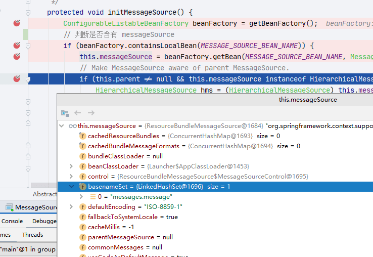
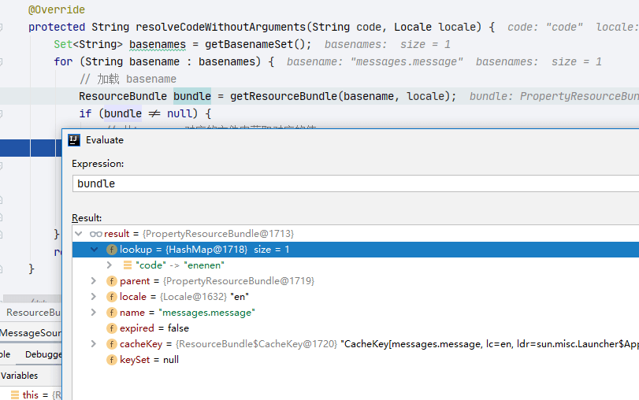
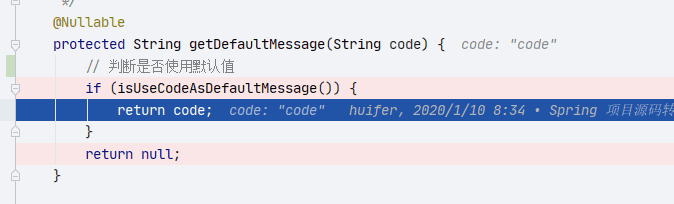

# Spring MessageSource

- Author: [HuiFer](https://github.com/huifer)
- 源码阅读仓库: [SourceHot-Spring](https://github.com/SourceHot/spring-framework-read)

## 初始化入口

- `org.springframework.context.support.AbstractApplicationContext.refresh`方法有`initMessageSource()`方法进行了`MessageSource`初始化

```java
    protected void initMessageSource() {
        ConfigurableListableBeanFactory beanFactory = getBeanFactory();
        // 判断是否含有 messageSource
        if (beanFactory.containsLocalBean(MESSAGE_SOURCE_BEAN_NAME)) {
            // 读取xml配置文件中 id="messageSource"的数据
            this.messageSource = beanFactory.getBean(MESSAGE_SOURCE_BEAN_NAME, MessageSource.class);
            // Make MessageSource aware of parent MessageSource.
            if (this.parent != null && this.messageSource instanceof HierarchicalMessageSource) {
                HierarchicalMessageSource hms = (HierarchicalMessageSource) this.messageSource;
                if (hms.getParentMessageSource() == null) {
                    // Only set parent context as parent MessageSource if no parent MessageSource
                    // registered already.
                    hms.setParentMessageSource(getInternalParentMessageSource());
                }
            }
            if (logger.isTraceEnabled()) {
                logger.trace("Using MessageSource [" + this.messageSource + "]");
            }
        }
        else {
            // Use empty MessageSource to be able to accept getMessage calls.
            // 没有使用默认的 DelegatingMessageSource
            DelegatingMessageSource dms = new DelegatingMessageSource();
            dms.setParentMessageSource(getInternalParentMessageSource());
            this.messageSource = dms;
            // 注册单例对象
            beanFactory.registerSingleton(MESSAGE_SOURCE_BEAN_NAME, this.messageSource);
            if (logger.isTraceEnabled()) {
                logger.trace("No '" + MESSAGE_SOURCE_BEAN_NAME + "' bean, using [" + this.messageSource + "]");
            }
        }
    }

```

读取 xml 配置文件



## getMessage

- `org.springframework.context.support.AbstractApplicationContext#getMessage(java.lang.String, java.lang.Object[], java.util.Locale)`

```java
    @Override
    public String getMessage(String code, @Nullable Object[] args, Locale locale) throws NoSuchMessageException {
        return getMessageSource().getMessage(code, args, locale);
    }

```

- `org.springframework.context.support.AbstractMessageSource#getMessage(java.lang.String, java.lang.Object[], java.util.Locale)`

  ```java
      @Override
      public final String getMessage(String code, @Nullable Object[] args, Locale locale) throws NoSuchMessageException {
          // 获取对应的信息
          String msg = getMessageInternal(code, args, locale);
          if (msg != null) {
              return msg;
          }
          // 默认信息 null
          String fallback = getDefaultMessage(code);
          if (fallback != null) {
              return fallback;
          }
          throw new NoSuchMessageException(code, locale);
      }

  ```

  - 两个方法

    1. `org.springframework.context.support.AbstractMessageSource#getDefaultMessage(java.lang.String)`

       ```java
           @Nullable
           protected String getDefaultMessage(String code) {
               // 判断是否使用默认值
               if (isUseCodeAsDefaultMessage()) {
                   return code;
               }
               return null;
           }

       ```

       - 返回 code 本身或者`null`

    2. `org.springframework.context.support.AbstractMessageSource#getMessageInternal`

       ```java
           @Nullable
           protected String getMessageInternal(@Nullable String code, @Nullable Object[] args, @Nullable Locale locale) {
               if (code == null) {
                   return null;
               }
               if (locale == null) {
                   // 获取语言默认值
                   locale = Locale.getDefault();
               }
               Object[] argsToUse = args;

               if (!isAlwaysUseMessageFormat() && ObjectUtils.isEmpty(args)) {
                   // Optimized resolution: no arguments to apply,
                   // therefore no MessageFormat needs to be involved.
                   // Note that the default implementation still uses MessageFormat;
                   // this can be overridden in specific subclasses.
                   String message = resolveCodeWithoutArguments(code, locale);
                   if (message != null) {
                       return message;
                   }
               }

               else {
                   // Resolve arguments eagerly, for the case where the message
                   // is defined in a parent MessageSource but resolvable arguments
                   // are defined in the child MessageSource.
                   argsToUse = resolveArguments(args, locale);

                   MessageFormat messageFormat = resolveCode(code, locale);
                   if (messageFormat != null) {
                       synchronized (messageFormat) {
                           return messageFormat.format(argsToUse);
                       }
                   }
               }

               // Check locale-independent common messages for the given message code.
               Properties commonMessages = getCommonMessages();
               if (commonMessages != null) {
                   String commonMessage = commonMessages.getProperty(code);
                   if (commonMessage != null) {
                       return formatMessage(commonMessage, args, locale);
                   }
               }

               // Not found -> check parent, if any.
               return getMessageFromParent(code, argsToUse, locale);
           }

       ```

- `org.springframework.context.support.ResourceBundleMessageSource#resolveCodeWithoutArguments`

  ```java
      @Override
      protected String resolveCodeWithoutArguments(String code, Locale locale) {
          Set<String> basenames = getBasenameSet();
          for (String basename : basenames) {
              // 加载 basename
              ResourceBundle bundle = getResourceBundle(basename, locale);
              if (bundle != null) {
                  // 从basename对应的文件中获取对应的值
                  String result = getStringOrNull(bundle, code);
                  if (result != null) {
                      return result;
                  }
              }
          }
          return null;
      }

  ```


- 加载后截图

  获取方法`String result = getStringOrNull(bundle, code);`就是 map 获取



- 没有配置文件的情况

  
