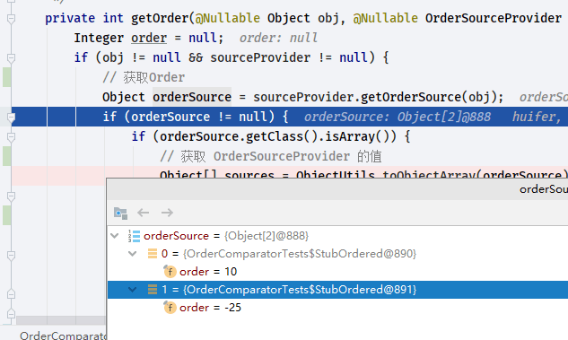
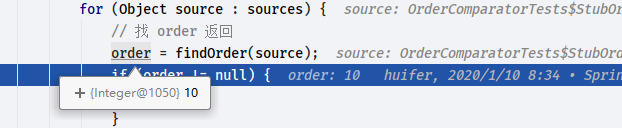

# Spring OrderComparator

- Author: [HuiFer](https://github.com/huifer)
- 源码阅读仓库: [SourceHot-Spring](https://github.com/SourceHot/spring-framework-read)

```java
    private int doCompare(@Nullable Object o1, @Nullable Object o2, @Nullable OrderSourceProvider sourceProvider) {
        boolean p1 = (o1 instanceof PriorityOrdered);
        boolean p2 = (o2 instanceof PriorityOrdered);
        if (p1 && !p2) {
            return -1;
        } else if (p2 && !p1) {
            return 1;
        }

        int i1 = getOrder(o1, sourceProvider);
        int i2 = getOrder(o2, sourceProvider);
        // 对比两个Order值得大小返回
        return Integer.compare(i1, i2);
    }

```

```java
    private int getOrder(@Nullable Object obj, @Nullable OrderSourceProvider sourceProvider) {
        Integer order = null;
        if (obj != null && sourceProvider != null) {
            // 获取Order
            Object orderSource = sourceProvider.getOrderSource(obj);
            if (orderSource != null) {
                if (orderSource.getClass().isArray()) {
                    // 获取 OrderSourceProvider 的值
                    Object[] sources = ObjectUtils.toObjectArray(orderSource);
                    for (Object source : sources) {
                        // 找 order 返回
                        order = findOrder(source);
                        if (order != null) {
                            break;
                        }
                    }
                } else {
                    // 寻找 order
                    order = findOrder(orderSource);
                }
            }
        }
        return (order != null ? order : getOrder(obj));
    }

```

- 测试用例

```java
    @Test
    public void compareWithSourceProviderArray() {
        Comparator<Object> customComparator = this.comparator.withSourceProvider(
                new TestSourceProvider(5L, new Object[]{new StubOrdered(10), new StubOrdered(-25)}));
        assertEquals(-1, customComparator.compare(5L, new Object()));
    }

```



```java
    @Nullable
    protected Integer findOrder(Object obj) {
        // 获取Ordered实现类
        return (obj instanceof Ordered ? ((Ordered) obj).getOrder() : null);
    }

```

```java
    private static final class StubOrdered implements Ordered {

        private final int order;


        public StubOrdered(int order) {
            this.order = order;
        }

        @Override
        public int getOrder() {
            return this.order;
        }
    }

```



最终`Integer.compare(i1, i2)`比较返回 OK !
