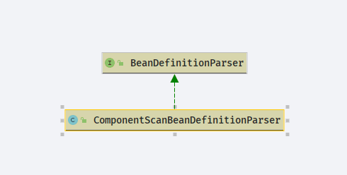
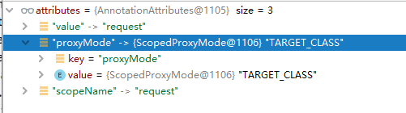
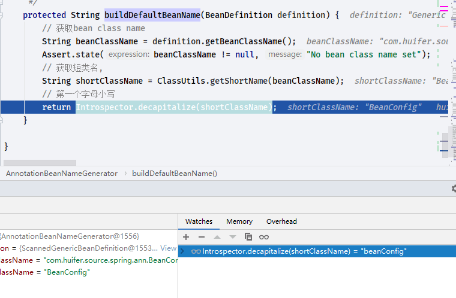

# Spring scan

- Author: [HuiFer](https://github.com/huifer)
- 源码阅读仓库: [SourceHot-Spring](https://github.com/SourceHot/spring-framework-read)

## 解析

- Spring 注解形式使用有下面两种方式
  1. 通过`AnnotationConfigApplicationContext`参数:扫描包
  2. 通过 xml 配置`context:component-scan`属性`base-package`

```java
        AnnotationConfigApplicationContext aac =
                new AnnotationConfigApplicationContext("com.huifer.source.spring.ann");
```

```xml
    <context:component-scan base-package="com.huifer.source.spring.ann">
    </context:component-scan>
```

- 目标明确开始找入口方法
- `AnnotationConfigApplicationContext`直接点进去看就找到了

```java
public AnnotationConfigApplicationContext(String... basePackages) {
        this();
        // 扫描包
        scan(basePackages);
        refresh();
    }
```

- `context:component-scan`寻找方式:冒号`:`钱+NamespaceHandler 或者全文搜索`component-scan`,最终找到`org.springframework.context.config.ContextNamespaceHandler`

```java
public class ContextNamespaceHandler extends NamespaceHandlerSupport {

    @Override
    public void init() {
        registerBeanDefinitionParser("property-placeholder", new PropertyPlaceholderBeanDefinitionParser());
        registerBeanDefinitionParser("property-override", new PropertyOverrideBeanDefinitionParser());
        registerBeanDefinitionParser("annotation-config", new AnnotationConfigBeanDefinitionParser());
        registerBeanDefinitionParser("component-scan", new ComponentScanBeanDefinitionParser());
        registerBeanDefinitionParser("load-time-weaver", new LoadTimeWeaverBeanDefinitionParser());
        registerBeanDefinitionParser("spring-configured", new SpringConfiguredBeanDefinitionParser());
        registerBeanDefinitionParser("mbean-export", new MBeanExportBeanDefinitionParser());
        registerBeanDefinitionParser("mbean-server", new MBeanServerBeanDefinitionParser());
    }

}
```

### org.springframework.context.annotation.ComponentScanBeanDefinitionParser



- 实现`BeanDefinitionParser`直接看`parse`方法

```java
    @Override
    @Nullable
    public BeanDefinition parse(Element element, ParserContext parserContext) {
        // 获取 base-package 属性值
        String basePackage = element.getAttribute(BASE_PACKAGE_ATTRIBUTE);
        // 处理 ${}
        basePackage = parserContext.getReaderContext().getEnvironment().resolvePlaceholders(basePackage);
        // 分隔符`,;\t\n`切分
        String[] basePackages = StringUtils.tokenizeToStringArray(basePackage,
                ConfigurableApplicationContext.CONFIG_LOCATION_DELIMITERS);

        // Actually scan for bean definitions and register them.
        // 扫描对象创建
        ClassPathBeanDefinitionScanner scanner = configureScanner(parserContext, element);
        // 执行扫描方法
        Set<BeanDefinitionHolder> beanDefinitions = scanner.doScan(basePackages);
        // 注册组件,触发监听
        registerComponents(parserContext.getReaderContext(), beanDefinitions, element);

        return null;
    }

```

- 回过头看`AnnotationConfigApplicationContext`

### org.springframework.context.annotation.AnnotationConfigApplicationContext

```java
public AnnotationConfigApplicationContext(String... basePackages) {
        this();
        // 扫描包
        scan(basePackages);
        refresh();
    }
```

```java
   private final ClassPathBeanDefinitionScanner scanner;

    @Override
    public void scan(String... basePackages) {
        Assert.notEmpty(basePackages, "At least one base package must be specified");
        this.scanner.scan(basePackages);
    }

```

- `org.springframework.context.annotation.ClassPathBeanDefinitionScanner.scan`

```java
public int scan(String... basePackages) {

        // 获取bean数量
        int beanCountAtScanStart = this.registry.getBeanDefinitionCount();
        // 执行扫描
        doScan(basePackages);

        // Register annotation config processors, if necessary.
        if (this.includeAnnotationConfig) {
            AnnotationConfigUtils.registerAnnotationConfigProcessors(this.registry);
        }

        return (this.registry.getBeanDefinitionCount() - beanCountAtScanStart);
    }
```

- 这个地方`doScan`似曾相识,他就是`org.springframework.context.annotation.ComponentScanBeanDefinitionParser.parse`中的`doScan`,下一步解析 doScan

### org.springframework.context.annotation.ClassPathBeanDefinitionScanner.doScan

```java
    protected Set<BeanDefinitionHolder> doScan(String... basePackages) {
        Assert.notEmpty(basePackages, "At least one base package must be specified");
        Set<BeanDefinitionHolder> beanDefinitions = new LinkedHashSet<>();
        for (String basePackage : basePackages) {
            // 寻找组件
            Set<BeanDefinition> candidates = findCandidateComponents(basePackage);
            for (BeanDefinition candidate : candidates) {
                // bean 作用域设置
                ScopeMetadata scopeMetadata = this.scopeMetadataResolver.resolveScopeMetadata(candidate);
                // 设置生命周期
                candidate.setScope(scopeMetadata.getScopeName());
                // 创建beanName
                String beanName = this.beanNameGenerator.generateBeanName(candidate, this.registry);
                if (candidate instanceof AbstractBeanDefinition) {
                    // 设置默认属性 具体方法:org.springframework.beans.factory.support.AbstractBeanDefinition.applyDefaults
                    postProcessBeanDefinition((AbstractBeanDefinition) candidate, beanName);
                }
                if (candidate instanceof AnnotatedBeanDefinition) {
                    // 读取Lazy，Primary 等注解
                    AnnotationConfigUtils.processCommonDefinitionAnnotations((AnnotatedBeanDefinition) candidate);
                }
                // bean的重复检查
                if (checkCandidate(beanName, candidate)) {
                    // 创建 BeanDefinitionHolder
                    BeanDefinitionHolder definitionHolder = new BeanDefinitionHolder(candidate, beanName);
                    // 代理对象的处理
                    definitionHolder =
                            AnnotationConfigUtils.applyScopedProxyMode(scopeMetadata, definitionHolder, this.registry);
                    // 放入list中,最后返回用
                    beanDefinitions.add(definitionHolder);
                    // 注册bean
                    registerBeanDefinition(definitionHolder, this.registry);
                }
            }
        }
        return beanDefinitions;
    }

```

#### org.springframework.context.annotation.ClassPathScanningCandidateComponentProvider#findCandidateComponents

```java
    public Set<BeanDefinition> findCandidateComponents(String basePackage) {
        // 扫描
        if (this.componentsIndex != null && indexSupportsIncludeFilters()) {
            return addCandidateComponentsFromIndex(this.componentsIndex, basePackage);
        }
        else {
            return scanCandidateComponents(basePackage);
        }
    }

```

```java
    /**
     * 扫描当前包路径下的资源
     * @param basePackage
     * @return
     */
    private Set<BeanDefinition> scanCandidateComponents(String basePackage) {
        Set<BeanDefinition> candidates = new LinkedHashSet<>();
        try {
            // 字符串拼接出一个编译后的路径 classpath://
            // 这里替换了通配符
            String packageSearchPath = ResourcePatternResolver.CLASSPATH_ALL_URL_PREFIX +
                    resolveBasePackage(basePackage) + '/' + this.resourcePattern;
            // 获取资源
            Resource[] resources = getResourcePatternResolver().getResources(packageSearchPath);
            // 日志级别
            boolean traceEnabled = logger.isTraceEnabled();
            boolean debugEnabled = logger.isDebugEnabled();
            for (Resource resource : resources) {
                if (traceEnabled) {
                    logger.trace("Scanning " + resource);
                }
                if (resource.isReadable()) {
                    try {
                        // 获取 MetadataReader
                        MetadataReader metadataReader = getMetadataReaderFactory().getMetadataReader(resource);
                        // 判断是否是 Component
                        if (isCandidateComponent(metadataReader)) {
                            ScannedGenericBeanDefinition sbd = new ScannedGenericBeanDefinition(metadataReader);
                            sbd.setResource(resource);
                            sbd.setSource(resource);
                            if (isCandidateComponent(sbd)) {
                                if (debugEnabled) {
                                    logger.debug("Identified candidate component class: " + resource);
                                }
                                candidates.add(sbd);
                            }
                            else {
                                if (debugEnabled) {
                                    logger.debug("Ignored because not a concrete top-level class: " + resource);
                                }
                            }
                        }
                        else {
                            if (traceEnabled) {
                                logger.trace("Ignored because not matching any filter: " + resource);
                            }
                        }
                    }
                    catch (Throwable ex) {
                        throw new BeanDefinitionStoreException(
                                "Failed to read candidate component class: " + resource, ex);
                    }
                }
                else {
                    if (traceEnabled) {
                        logger.trace("Ignored because not readable: " + resource);
                    }
                }
            }
        }
        catch (IOException ex) {
            throw new BeanDefinitionStoreException("I/O failure during classpath scanning", ex);
        }
        return candidates;
    }

```

#### org.springframework.context.annotation.ScopeMetadataResolver#resolveScopeMetadata

```java
    /**
     * 生命周期设置
     *
     * @param definition the target bean definition
     * @return
     */
    @Override
    public ScopeMetadata resolveScopeMetadata(BeanDefinition definition) {
        ScopeMetadata metadata = new ScopeMetadata();
        // 判断是否属于 AnnotatedBeanDefinition
        if (definition instanceof AnnotatedBeanDefinition) {
            AnnotatedBeanDefinition annDef = (AnnotatedBeanDefinition) definition;
            AnnotationAttributes attributes = AnnotationConfigUtils.attributesFor(
                    annDef.getMetadata(), this.scopeAnnotationType);
            if (attributes != null) {
                // 获取 value 属性值并且设置
                metadata.setScopeName(attributes.getString("value"));
                // 获取 proxyMode 属性值并且设置
                ScopedProxyMode proxyMode = attributes.getEnum("proxyMode");
                if (proxyMode == ScopedProxyMode.DEFAULT) {
                    proxyMode = this.defaultProxyMode;
                }
                metadata.setScopedProxyMode(proxyMode);
            }
        }
        return metadata;
    }


```

- `org.springframework.context.annotation.AnnotationScopeMetadataResolverTests#resolveScopeMetadataShouldReadScopedProxyModeFromAnnotation`测试用例

```java
    @Test
    public void resolveScopeMetadataShouldReadScopedProxyModeFromAnnotation() {
        AnnotatedBeanDefinition bd = new AnnotatedGenericBeanDefinition(AnnotatedWithScopedProxy.class);
        ScopeMetadata scopeMetadata = this.scopeMetadataResolver.resolveScopeMetadata(bd);
        assertNotNull("resolveScopeMetadata(..) must *never* return null.", scopeMetadata);
        assertEquals("request", scopeMetadata.getScopeName());
        assertEquals(TARGET_CLASS, scopeMetadata.getScopedProxyMode());
    }

```



#### org.springframework.beans.factory.support.BeanNameGenerator#generateBeanName

- 创建 beanName `org.springframework.context.annotation.AnnotationBeanNameGenerator#generateBeanName`

```java
    @Override
    public String generateBeanName(BeanDefinition definition, BeanDefinitionRegistry registry) {
        if (definition instanceof AnnotatedBeanDefinition) {
            // 如果存在bean(value="") value存在
            String beanName = determineBeanNameFromAnnotation((AnnotatedBeanDefinition) definition);
            if (StringUtils.hasText(beanName)) {
                // Explicit bean name found.
                return beanName;
            }
        }
        // Fallback: generate a unique default bean name.
        // 创建beanName
        return buildDefaultBeanName(definition, registry);
    }

```

```java
    @Nullable
    protected String determineBeanNameFromAnnotation(AnnotatedBeanDefinition annotatedDef) {
        AnnotationMetadata amd = annotatedDef.getMetadata();
        Set<String> types = amd.getAnnotationTypes();
        String beanName = null;
        for (String type : types) {
            AnnotationAttributes attributes = AnnotationConfigUtils.attributesFor(amd, type);
            if (attributes != null && isStereotypeWithNameValue(type, amd.getMetaAnnotationTypes(type), attributes)) {
                // 获取注解的value 属性值
                Object value = attributes.get("value");
                if (value instanceof String) {
                    String strVal = (String) value;
                    // 判断是否存在值
                    if (StringUtils.hasLength(strVal)) {
                        if (beanName != null && !strVal.equals(beanName)) {
                            throw new IllegalStateException("Stereotype annotations suggest inconsistent " +
                                    "component names: '" + beanName + "' versus '" + strVal + "'");
                        }
                        // beanName = value属性值
                        beanName = strVal;
                    }
                }
            }
        }
        return beanName;
    }

```

```java
@Service(value = "dhc")
public class DemoService {

}
```


- `org.springframework.context.annotation.AnnotationBeanNameGenerator#buildDefaultBeanName(org.springframework.beans.factory.config.BeanDefinition, org.springframework.beans.factory.support.BeanDefinitionRegistry)`
  - `org.springframework.context.annotation.AnnotationBeanNameGenerator#buildDefaultBeanName(org.springframework.beans.factory.config.BeanDefinition)`

```java
    protected String buildDefaultBeanName(BeanDefinition definition) {
        // 获取bean class name
        String beanClassName = definition.getBeanClassName();
        Assert.state(beanClassName != null, "No bean class name set");
        // 获取短类名,
        String shortClassName = ClassUtils.getShortName(beanClassName);
        // 第一个字母小写
        return Introspector.decapitalize(shortClassName);
    }

```

```java
@Configuration
public class BeanConfig {
    @Scope(value =ConfigurableBeanFactory.SCOPE_PROTOTYPE)
    @Bean(value = "hc")
    public Ubean f() {
        return new Ubean();
    }
}

```



#### org.springframework.context.annotation.ClassPathBeanDefinitionScanner#postProcessBeanDefinition

- 这个方法没什么难点，直接是 set 方法

```java
    protected void postProcessBeanDefinition(AbstractBeanDefinition beanDefinition, String beanName) {
        beanDefinition.applyDefaults(this.beanDefinitionDefaults);
        if (this.autowireCandidatePatterns != null) {
            beanDefinition.setAutowireCandidate(PatternMatchUtils.simpleMatch(this.autowireCandidatePatterns, beanName));
        }
    }

```

```java
    public void applyDefaults(BeanDefinitionDefaults defaults) {
        setLazyInit(defaults.isLazyInit());
        setAutowireMode(defaults.getAutowireMode());
        setDependencyCheck(defaults.getDependencyCheck());
        setInitMethodName(defaults.getInitMethodName());
        setEnforceInitMethod(false);
        setDestroyMethodName(defaults.getDestroyMethodName());
        setEnforceDestroyMethod(false);
    }

```

#### org.springframework.context.annotation.AnnotationConfigUtils#processCommonDefinitionAnnotations(org.springframework.beans.factory.annotation.AnnotatedBeanDefinition)

```java
    public static void processCommonDefinitionAnnotations(AnnotatedBeanDefinition abd) {
        processCommonDefinitionAnnotations(abd, abd.getMetadata());
    }

```

```java
static void processCommonDefinitionAnnotations(AnnotatedBeanDefinition abd, AnnotatedTypeMetadata metadata) {
        // 获取 lazy 注解
        AnnotationAttributes lazy = attributesFor(metadata, Lazy.class);
        if (lazy != null) {
            abd.setLazyInit(lazy.getBoolean("value"));
        } else if (abd.getMetadata() != metadata) {
            lazy = attributesFor(abd.getMetadata(), Lazy.class);
            if (lazy != null) {
                abd.setLazyInit(lazy.getBoolean("value"));
            }
        }

        if (metadata.isAnnotated(Primary.class.getName())) {
            abd.setPrimary(true);
        }
        AnnotationAttributes dependsOn = attributesFor(metadata, DependsOn.class);
        if (dependsOn != null) {
            abd.setDependsOn(dependsOn.getStringArray("value"));
        }

        AnnotationAttributes role = attributesFor(metadata, Role.class);
        if (role != null) {
            abd.setRole(role.getNumber("value").intValue());
        }
        AnnotationAttributes description = attributesFor(metadata, Description.class);
        if (description != null) {
            abd.setDescription(description.getString("value"));
        }
    }
```

- 方法思路:
  1. 获取注解的属性值
  2. 设置注解属性

#### org.springframework.context.annotation.ClassPathBeanDefinitionScanner#checkCandidate

- 重复检查

```java
    protected boolean checkCandidate(String beanName, BeanDefinition beanDefinition) throws IllegalStateException {
        // 判断当前 beanName 是否在注册表中
        if (!this.registry.containsBeanDefinition(beanName)) {
            return true;
        }
        // 从注册表中获取
        BeanDefinition existingDef = this.registry.getBeanDefinition(beanName);
        // 当前的bean
        BeanDefinition originatingDef = existingDef.getOriginatingBeanDefinition();
        if (originatingDef != null) {
            existingDef = originatingDef;
        }
        if (isCompatible(beanDefinition, existingDef)) {
            return false;
        }
        throw new ConflictingBeanDefinitionException("Annotation-specified bean name '" + beanName +
                "' for bean class [" + beanDefinition.getBeanClassName() + "] conflicts with existing, " +
                "non-compatible bean definition of same name and class [" + existingDef.getBeanClassName() + "]");
    }

```

#### org.springframework.context.annotation.AnnotationConfigUtils#applyScopedProxyMode

```java
    static BeanDefinitionHolder applyScopedProxyMode(
            ScopeMetadata metadata, BeanDefinitionHolder definition, BeanDefinitionRegistry registry) {

        ScopedProxyMode scopedProxyMode = metadata.getScopedProxyMode();
        if (scopedProxyMode.equals(ScopedProxyMode.NO)) {
            return definition;
        }
        boolean proxyTargetClass = scopedProxyMode.equals(ScopedProxyMode.TARGET_CLASS);
        // 创建代理对象
        return ScopedProxyCreator.createScopedProxy(definition, registry, proxyTargetClass);
    }

```
