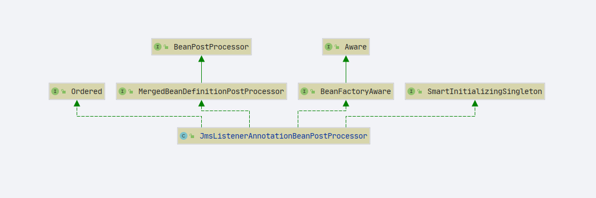
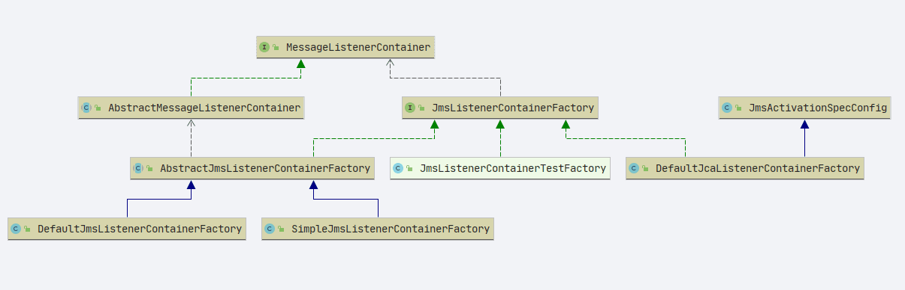

# Spring EnableJms 注解

- Author: [HuiFer](https://github.com/huifer)
- 源码阅读仓库: [SourceHot-spring](https://github.com/SourceHot/spring-framework-read)
- 源码路径: `org.springframework.jms.annotation.EnableJms`

## 源码分析

```java
@Target(ElementType.TYPE)
@Retention(RetentionPolicy.RUNTIME)
@Documented
@Import(JmsBootstrapConfiguration.class)
public @interface EnableJms {
}
```

- 该类的切入点在`@Import(JmsBootstrapConfiguration.class)` , 直接看`JmsBootstrapConfiguration`就可以了

```java
@Configuration
@Role(BeanDefinition.ROLE_INFRASTRUCTURE)
public class JmsBootstrapConfiguration {

	/**
	 * jms 监听注解后处理, 将{@link JmsListener} 注册到{@link JmsListenerContainerFactory}
	 * @return
	 */
	@Bean(name = JmsListenerConfigUtils.JMS_LISTENER_ANNOTATION_PROCESSOR_BEAN_NAME)
	@Role(BeanDefinition.ROLE_INFRASTRUCTURE)
	public JmsListenerAnnotationBeanPostProcessor jmsListenerAnnotationProcessor() {
		return new JmsListenerAnnotationBeanPostProcessor();
	}


	/**
	 * JMS 监听注册
	 * @return
	 */
	@Bean(name = JmsListenerConfigUtils.JMS_LISTENER_ENDPOINT_REGISTRY_BEAN_NAME)
	public JmsListenerEndpointRegistry defaultJmsListenerEndpointRegistry() {
		return new JmsListenerEndpointRegistry();
	}

}
```

### JmsListenerAnnotationBeanPostProcessor

类图



- 主要关注

  1. **afterSingletonsInstantiated**

2. **postProcessAfterInitialization**

#### afterSingletonsInstantiated

```java
@Override
    public void afterSingletonsInstantiated() {
        // Remove resolved singleton classes from cache
        this.nonAnnotatedClasses.clear();

        if (this.beanFactory instanceof ListableBeanFactory) {
            // Apply JmsListenerConfigurer beans from the BeanFactory, if any
            // 根据类型获取bean
            Map<String, JmsListenerConfigurer> beans =
                    ((ListableBeanFactory) this.beanFactory).getBeansOfType(JmsListenerConfigurer.class);

            List<JmsListenerConfigurer> configurers = new ArrayList<>(beans.values());
            // 排序 Order
            AnnotationAwareOrderComparator.sort(configurers);
            for (JmsListenerConfigurer configurer : configurers) {
                // 放入jms监听配置,开发者自定义
                configurer.configureJmsListeners(this.registrar);
            }
        }

        if (this.containerFactoryBeanName != null) {
            this.registrar.setContainerFactoryBeanName(this.containerFactoryBeanName);
        }

        if (this.registrar.getEndpointRegistry() == null) {
            // Determine JmsListenerEndpointRegistry bean from the BeanFactory
            if (this.endpointRegistry == null) {
                Assert.state(this.beanFactory != null, "BeanFactory must be set to find endpoint registry by bean name");
                this.endpointRegistry = this.beanFactory.getBean(
                        JmsListenerConfigUtils.JMS_LISTENER_ENDPOINT_REGISTRY_BEAN_NAME, JmsListenerEndpointRegistry.class);
            }
            this.registrar.setEndpointRegistry(this.endpointRegistry);
        }


        // Set the custom handler method factory once resolved by the configurer
        MessageHandlerMethodFactory handlerMethodFactory = this.registrar.getMessageHandlerMethodFactory();
        if (handlerMethodFactory != null) {
            this.messageHandlerMethodFactory.setMessageHandlerMethodFactory(handlerMethodFactory);
        }

        // Actually register all listeners
        this.registrar.afterPropertiesSet();
    }
```

- 关注最后一行`this.registrar.afterPropertiesSet()`

  ```java
  	@Override
  	public void afterPropertiesSet() {
  		registerAllEndpoints();
  	}

  	protected void registerAllEndpoints() {
  		Assert.state(this.endpointRegistry != null, "No JmsListenerEndpointRegistry set");
  		synchronized (this.mutex) {
  			for (JmsListenerEndpointDescriptor descriptor : this.endpointDescriptors) {
  				// 注册监听
  				this.endpointRegistry.registerListenerContainer(
  						descriptor.endpoint, resolveContainerFactory(descriptor));
  			}
  			this.startImmediately = true;  // trigger immediate startup
  		}
  	}
  ```

- 注册监听在下面分析会讲详见下文

#### postProcessAfterInitialization

```java
    @Override
    public Object postProcessAfterInitialization(Object bean, String beanName) throws BeansException {
        if (bean instanceof AopInfrastructureBean || bean instanceof JmsListenerContainerFactory ||
                bean instanceof JmsListenerEndpointRegistry) {
            // Ignore AOP infrastructure such as scoped proxies.
            return bean;
        }

        // 获取 bean 的代理对象.class
        Class<?> targetClass = AopProxyUtils.ultimateTargetClass(bean);
        if (!this.nonAnnotatedClasses.contains(targetClass)) {
            Map<Method, Set<JmsListener>> annotatedMethods = MethodIntrospector.selectMethods(targetClass,
                    (MethodIntrospector.MetadataLookup<Set<JmsListener>>) method -> {
                        Set<JmsListener> listenerMethods = AnnotatedElementUtils.getMergedRepeatableAnnotations(
                                method, JmsListener.class, JmsListeners.class);
                        return (!listenerMethods.isEmpty() ? listenerMethods : null);
                    });
            if (annotatedMethods.isEmpty()) {
                this.nonAnnotatedClasses.add(targetClass);
                if (logger.isTraceEnabled()) {
                    logger.trace("No @JmsListener annotations found on bean type: " + targetClass);
                }
            } else {
                // Non-empty set of methods
                annotatedMethods.forEach((method, listeners) ->
                        listeners.forEach(listener -> processJmsListener(listener, method, bean)));
                if (logger.isDebugEnabled()) {
                    logger.debug(annotatedMethods.size() + " @JmsListener methods processed on bean '" + beanName +
                            "': " + annotatedMethods);
                }
            }
        }
        return bean;
    }

```

```java
    protected void processJmsListener(JmsListener jmsListener, Method mostSpecificMethod, Object bean) {
        Method invocableMethod = AopUtils.selectInvocableMethod(mostSpecificMethod, bean.getClass());

        // 设置 监听方法信息
        MethodJmsListenerEndpoint endpoint = createMethodJmsListenerEndpoint();
        endpoint.setBean(bean);
        endpoint.setMethod(invocableMethod);
        endpoint.setMostSpecificMethod(mostSpecificMethod);
        endpoint.setMessageHandlerMethodFactory(this.messageHandlerMethodFactory);
        endpoint.setEmbeddedValueResolver(this.embeddedValueResolver);
        endpoint.setBeanFactory(this.beanFactory);
        endpoint.setId(getEndpointId(jmsListener));
        endpoint.setDestination(resolve(jmsListener.destination()));
        if (StringUtils.hasText(jmsListener.selector())) {
            endpoint.setSelector(resolve(jmsListener.selector()));
        }
        if (StringUtils.hasText(jmsListener.subscription())) {
            endpoint.setSubscription(resolve(jmsListener.subscription()));
        }
        if (StringUtils.hasText(jmsListener.concurrency())) {
            endpoint.setConcurrency(resolve(jmsListener.concurrency()));
        }

        JmsListenerContainerFactory<?> factory = null;
        String containerFactoryBeanName = resolve(jmsListener.containerFactory());
        if (StringUtils.hasText(containerFactoryBeanName)) {
            Assert.state(this.beanFactory != null, "BeanFactory must be set to obtain container factory by bean name");
            try {
                factory = this.beanFactory.getBean(containerFactoryBeanName, JmsListenerContainerFactory.class);
            } catch (NoSuchBeanDefinitionException ex) {
                throw new BeanInitializationException("Could not register JMS listener endpoint on [" +
                        mostSpecificMethod + "], no " + JmsListenerContainerFactory.class.getSimpleName() +
                        " with id '" + containerFactoryBeanName + "' was found in the application context", ex);
            }
        }

        // 注册监听点 到 JmsListenerContainerFactory
        this.registrar.registerEndpoint(endpoint, factory);
    }

```

- 将监听点注册的重要方法 **`org.springframework.jms.config.JmsListenerEndpointRegistrar#registerEndpoint(org.springframework.jms.config.JmsListenerEndpoint, org.springframework.jms.config.JmsListenerContainerFactory<?>)`**

```java
	public void registerEndpoint(JmsListenerEndpoint endpoint, @Nullable JmsListenerContainerFactory<?> factory) {
		Assert.notNull(endpoint, "Endpoint must not be null");
		Assert.hasText(endpoint.getId(), "Endpoint id must be set");

		// Factory may be null, we defer the resolution right before actually creating the container
		// jms 监听点描述
		JmsListenerEndpointDescriptor descriptor = new JmsListenerEndpointDescriptor(endpoint, factory);

		synchronized (this.mutex) {
			if (this.startImmediately) {  // register and start immediately
				Assert.state(this.endpointRegistry != null, "No JmsListenerEndpointRegistry set");
				// 注册
				this.endpointRegistry.registerListenerContainer(descriptor.endpoint,
						resolveContainerFactory(descriptor), true);
			}
			else {
				this.endpointDescriptors.add(descriptor);
			}
		}
	}

```

- `org.springframework.jms.config.JmsListenerEndpointRegistry#registerListenerContainer(org.springframework.jms.config.JmsListenerEndpoint, org.springframework.jms.config.JmsListenerContainerFactory<?>, boolean)`

  ```java
  public void registerListenerContainer(JmsListenerEndpoint endpoint, JmsListenerContainerFactory<?> factory,
                                            boolean startImmediately) {

          Assert.notNull(endpoint, "Endpoint must not be null");
          Assert.notNull(factory, "Factory must not be null");
          String id = endpoint.getId();
          Assert.hasText(id, "Endpoint id must be set");

          synchronized (this.listenerContainers) {
              if (this.listenerContainers.containsKey(id)) {
                  throw new IllegalStateException("Another endpoint is already registered with id '" + id + "'");
              }
              // 创建消息监听容器
              MessageListenerContainer container = createListenerContainer(endpoint, factory);
              this.listenerContainers.put(id, container);
              if (startImmediately) {
                  // 启动消息监听容器
                  startIfNecessary(container);
              }
          }
      }
  ```

- `org.springframework.jms.config.JmsListenerEndpointRegistry#createListenerContainer`

```java
    /**
     * Create and start a new container using the specified factory.
     * 创建监听容器
     */
    protected MessageListenerContainer createListenerContainer(JmsListenerEndpoint endpoint,
                                                               JmsListenerContainerFactory<?> factory) {

        // 创建监听 容器
        MessageListenerContainer listenerContainer = factory.createListenerContainer(endpoint);

        if (listenerContainer instanceof InitializingBean) {
            try {
                // 后置方法
                ((InitializingBean) listenerContainer).afterPropertiesSet();
            } catch (Exception ex) {
                throw new BeanInitializationException("Failed to initialize message listener container", ex);
            }
        }

        int containerPhase = listenerContainer.getPhase();
        if (containerPhase < Integer.MAX_VALUE) {  // a custom phase value
            if (this.phase < Integer.MAX_VALUE && this.phase != containerPhase) {
                throw new IllegalStateException("Encountered phase mismatch between container factory definitions: " +
                        this.phase + " vs " + containerPhase);
            }
            this.phase = listenerContainer.getPhase();
        }

        return listenerContainer;
    }

```

- 关键接口`JmsListenerContainerFactory<C extends MessageListenerContainer>`

  ```java
  public interface JmsListenerContainerFactory<C extends MessageListenerContainer> {

  	/**
  	 * Create a {@link MessageListenerContainer} for the given {@link JmsListenerEndpoint}.
  	 * 创建肩痛容器
  	 * @param endpoint the endpoint to configure
  	 * @return the created container
  	 */
  	C createListenerContainer(JmsListenerEndpoint endpoint);

  }
  ```

  

- 注册完成后是否立即启动

  ```java
          this.listenerContainers.put(id, container);
              if (startImmediately) {
                  // 启动消息监听容器
                  startIfNecessary(container);
              }

      private void startIfNecessary(MessageListenerContainer listenerContainer) {
          if (this.contextRefreshed || listenerContainer.isAutoStartup()) {
              listenerContainer.start();
          }
      }

  ```

  - 具体实现: `org.springframework.jms.listener.AbstractJmsListeningContainer#start`

- 执行完`start`方法就结束了`processJmsListener`的调用链路, `postProcessAfterInitialization` 也结束了

### JmsListenerEndpointRegistry

- 这个类辅助**JmsListenerAnnotationBeanPostProcessor** 处理

#### registerListenerContainer

```java
    /**
     * Create a message listener container for the given {@link JmsListenerEndpoint}.
     * <p>This create the necessary infrastructure to honor that endpoint
     * with regards to its configuration.
     * <p>The {@code startImmediately} flag determines if the container should be
     * started immediately.
     * <p>
     * 注册监听容器
     *
     * @param endpoint         the endpoint to add
     *                         监听点
     * @param factory          the listener factory to use
     *                         监听容器工厂
     * @param startImmediately start the container immediately if necessary
     *                         是否立即启动容器
     * @see #getListenerContainers()
     * @see #getListenerContainer(String)
     */
    public void registerListenerContainer(JmsListenerEndpoint endpoint, JmsListenerContainerFactory<?> factory,
                                          boolean startImmediately) {

        Assert.notNull(endpoint, "Endpoint must not be null");
        Assert.notNull(factory, "Factory must not be null");
        String id = endpoint.getId();
        Assert.hasText(id, "Endpoint id must be set");

        synchronized (this.listenerContainers) {
            if (this.listenerContainers.containsKey(id)) {
                throw new IllegalStateException("Another endpoint is already registered with id '" + id + "'");
            }
            // 创建消息监听容器
            MessageListenerContainer container = createListenerContainer(endpoint, factory);
            this.listenerContainers.put(id, container);
            if (startImmediately) {
                // 启动消息监听容器
                startIfNecessary(container);
            }
        }
    }

```
