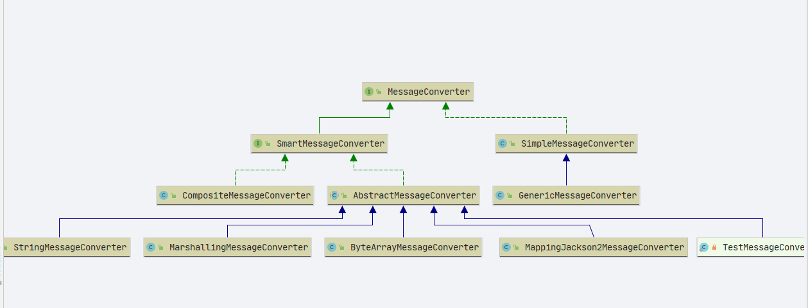
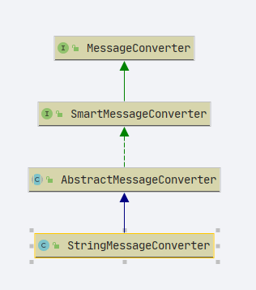
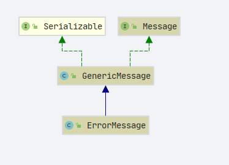

# Spring MessageConverter

- Author: [HuiFer](https://github.com/huifer)
- 源码阅读仓库: [SourceHot-spring](https://github.com/SourceHot/spring-framework-read)
- 源码路径: `org.springframework.messaging.converter.MessageConverter`

## MessageConverter

- 消息转换接口
- 类图如下
  
- 两个方法

1. fromMessage: 从消息转换到 Object

```java
    	Object fromMessage(Message<?> message, Class<?> targetClass);
```

2. toMessage: 从 Object 转换到消息

```java
    	Message<?> toMessage(Object payload, @Nullable MessageHeaders headers);
```

| 序号 | class                           | 作用                  |
| ---- | ------------------------------- | --------------------- |
| 1    | ByteArrayMessageConverter       | byte 数组消息转换器   |
| 2    | MappingJackson2MessageConverter | jackson2 的消息转换器 |
| 3    | MarshallingMessageConverter     | xml 的消息转换器      |
| 4    | StringMessageConverter          | 字符串消息转换器      |

## AbstractMessageConverter

类图:



### fromMessage

```java
	@Override
	@Nullable
	public final Object fromMessage(Message<?> message, Class<?> targetClass) {
		return fromMessage(message, targetClass, null);
	}

	@Override
	@Nullable
	public final Object fromMessage(Message<?> message, Class<?> targetClass, @Nullable Object conversionHint) {
		if (!canConvertFrom(message, targetClass)) {
			return null;
		}
		return convertFromInternal(message, targetClass, conversionHint);
	}


	// 子类实现
	@Nullable
	protected Object convertFromInternal(
			Message<?> message, Class<?> targetClass, @Nullable Object conversionHint) {

		return null;
	}

```

- 真正的转换过程

```java
	@Override
	protected Object convertFromInternal(Message<?> message, Class<?> targetClass, @Nullable Object conversionHint) {
		Charset charset = getContentTypeCharset(getMimeType(message.getHeaders()));
		Object payload = message.getPayload();
		return (payload instanceof String ? payload : new String((byte[]) payload, charset));
	}

```

### toMessage

```java
    @Override
    @Nullable
    public final Message<?> toMessage(Object payload, @Nullable MessageHeaders headers) {
        return toMessage(payload, headers, null);
    }

```

```java
    @Override
    @Nullable
    public final Message<?> toMessage(Object payload, @Nullable MessageHeaders headers, @Nullable Object conversionHint) {
        if (!canConvertTo(payload, headers)) {
            return null;
        }
        // 子类实现
        Object payloadToUse = convertToInternal(payload, headers, conversionHint);
        if (payloadToUse == null) {
            return null;
        }

        MimeType mimeType = getDefaultContentType(payloadToUse);
        if (headers != null) {
            MessageHeaderAccessor accessor = MessageHeaderAccessor.getAccessor(headers, MessageHeaderAccessor.class);
            if (accessor != null && accessor.isMutable()) {
                if (mimeType != null) {
                    accessor.setHeaderIfAbsent(MessageHeaders.CONTENT_TYPE, mimeType);
                }
                // 创建信息对象
                return MessageBuilder.createMessage(payloadToUse, accessor.getMessageHeaders());
            }
        }

        MessageBuilder<?> builder = MessageBuilder.withPayload(payloadToUse);
        if (headers != null) {
            builder.copyHeaders(headers);
        }
        if (mimeType != null) {
            builder.setHeaderIfAbsent(MessageHeaders.CONTENT_TYPE, mimeType);
        }
        return builder.build();
    }


```

- `org.springframework.messaging.converter.StringMessageConverter#convertToInternal`

  ```java
  	@Override
  	@Nullable
  	protected Object convertToInternal(
  			Object payload, @Nullable MessageHeaders headers, @Nullable Object conversionHint) {

  		if (byte[].class == getSerializedPayloadClass()) {
  			// 获取编码
  			Charset charset = getContentTypeCharset(getMimeType(headers));
  			// 获取byte数组
  			payload = ((String) payload).getBytes(charset);
  		}
  		return payload;
  	}

  ```

- 创建**Message**对象

  ```java
  	@SuppressWarnings("unchecked")
  	public static <T> Message<T> createMessage(@Nullable T payload, MessageHeaders messageHeaders) {
  		Assert.notNull(payload, "Payload must not be null");
  		Assert.notNull(messageHeaders, "MessageHeaders must not be null");
  		if (payload instanceof Throwable) {
  			return (Message<T>) new ErrorMessage((Throwable) payload, messageHeaders);
  		}
  		else {
  			return new GenericMessage<>(payload, messageHeaders);
  		}
  	}

  ```

  ```java
  	@SuppressWarnings("unchecked")
  	public Message<T> build() {
  		if (this.originalMessage != null && !this.headerAccessor.isModified()) {
  			return this.originalMessage;
  		}
  		MessageHeaders headersToUse = this.headerAccessor.toMessageHeaders();
  		if (this.payload instanceof Throwable) {
  			return (Message<T>) new ErrorMessage((Throwable) this.payload, headersToUse);
  		}
  		else {
  			return new GenericMessage<>(this.payload, headersToUse);
  		}
  	}

  ```

- 两种创建方式基本相同，如果出现异常组装异常消息对象`ErrorMessage`,成功创建`GenericMessage`



从类图上看`ErrorMessage`是`GenericMessage`的子类
