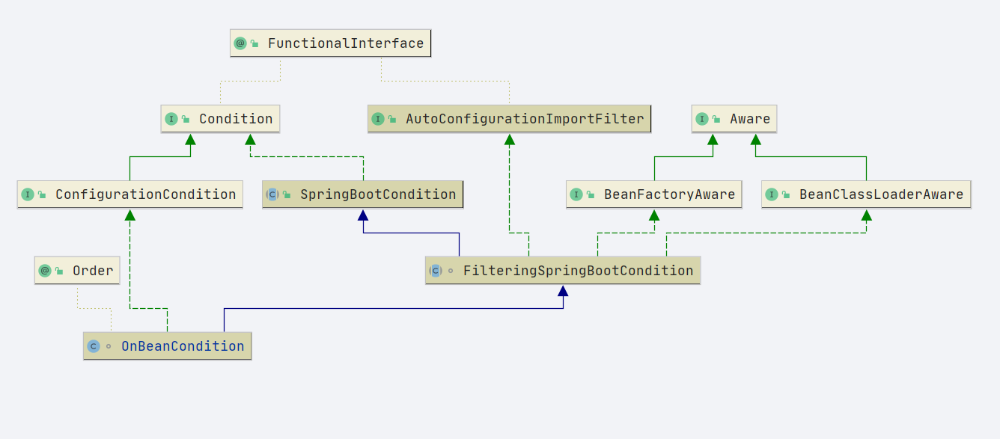
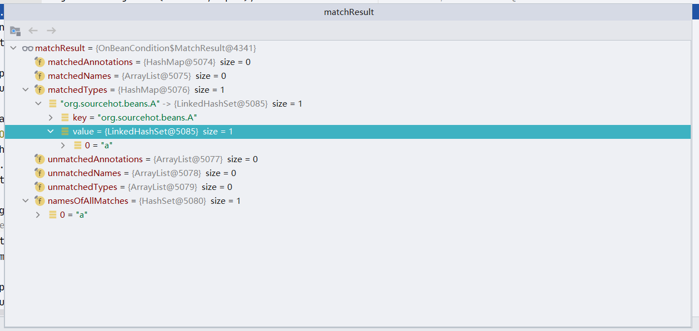
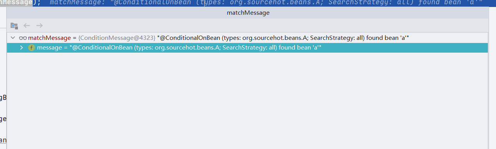
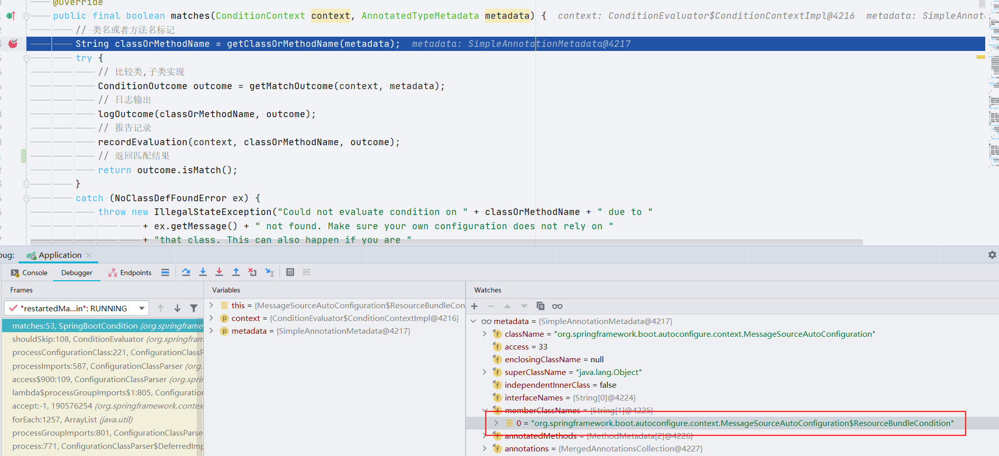
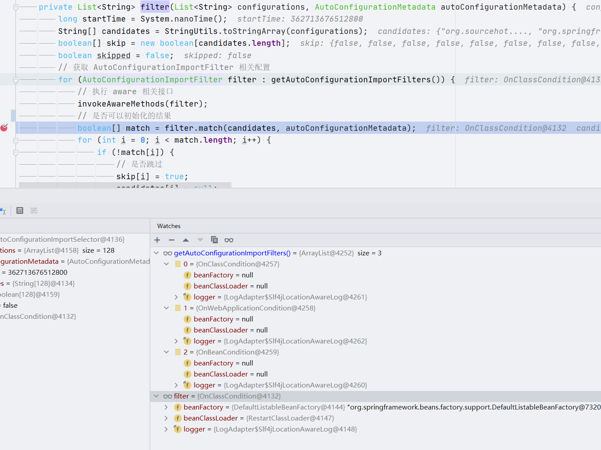
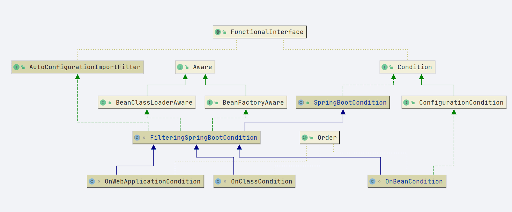

# SpringBoot ConditionalOnBean

- Author: [HuiFer](https://github.com/huifer)
- 源码阅读仓库: [SourceHot-spring-boot](https://github.com/SourceHot/spring-boot-read)

- 在 SpringBoot 中有下列当 XXX 存在或不存的时候执行初始化
  - ConditionalOnBean
    ConditionalOnClass
    ConditionalOnCloudPlatform
    ConditionalOnExpression
    ConditionalOnJava
    ConditionalOnJndi
    ConditionalOnMissingBean
    ConditionalOnMissingClass
    ConditionalOnNotWebApplication
    ConditionalOnProperty
    ConditionalOnResource
    ConditionalOnSingleCandidate
    ConditionalOnWebApplication

## ConditionalOnBean

```java
@Target({ ElementType.TYPE, ElementType.METHOD })
@Retention(RetentionPolicy.RUNTIME)
@Documented
@Conditional(OnBeanCondition.class)
public @interface ConditionalOnBean {

   /**
    * 需要匹配的 bean 类型
    */
   Class<?>[] value() default {};

   /**
    * 需要匹配的 bean 类型
    */
   String[] type() default {};

   /**
    * 匹配的 bean 注解
    */
   Class<? extends Annotation>[] annotation() default {};

   /**
    * 需要匹配的 beanName
    */
   String[] name() default {};

   /**
    * 搜索策略
    */
   SearchStrategy search() default SearchStrategy.ALL;

   /**
    */
   Class<?>[] parameterizedContainer() default {};

}
```

## SearchStrategy

```java
public enum SearchStrategy {

   /**
    * 当前 上下文
    */
   CURRENT,

   /**
    * 找所有的父容器
    */
   ANCESTORS,

   /**
    * 当前上下文+父容器
    */
   ALL

}
```

## OnBeanCondition

- org.springframework.boot.autoconfigure.condition.OnBeanCondition

- 这个类是一个条件类,相关的还有

  ```properties
  org.springframework.boot.autoconfigure.AutoConfigurationImportFilter=\
  org.springframework.boot.autoconfigure.condition.OnBeanCondition,\
  org.springframework.boot.autoconfigure.condition.OnClassCondition,\
  org.springframework.boot.autoconfigure.condition.OnWebApplicationCondition
  ```

- 类图

  

在看这部分源码之前需要先了解 `Conditional`和`Condition`的源码

- 简单描述

  通过实现`Condition` 来确认是否初始化 bean

- 从类图上我们可以看到 `condition` 的继承关系. 在这里需要去找到`SpringBootCondition`

- `org.springframework.boot.autoconfigure.condition.SpringBootCondition#matches(org.springframework.context.annotation.ConditionContext, org.springframework.core.type.AnnotatedTypeMetadata)`

  ```java
  @Override
  public final boolean matches(ConditionContext context, AnnotatedTypeMetadata metadata) {
     // 类名或者方法名标记
     String classOrMethodName = getClassOrMethodName(metadata);
     try {
        // 比较类,子类实现
        ConditionOutcome outcome = getMatchOutcome(context, metadata);
        // 日志输出
        logOutcome(classOrMethodName, outcome);
        // 报告记录
        recordEvaluation(context, classOrMethodName, outcome);
        // 返回匹配结果
        return outcome.isMatch();
     }
     catch (NoClassDefFoundError ex) {
        throw new IllegalStateException("Could not evaluate condition on " + classOrMethodName + " due to "
              + ex.getMessage() + " not found. Make sure your own configuration does not rely on "
              + "that class. This can also happen if you are "
              + "@ComponentScanning a springframework package (e.g. if you "
              + "put a @ComponentScan in the default package by mistake)", ex);
     }
     catch (RuntimeException ex) {
        throw new IllegalStateException("Error processing condition on " + getName(metadata), ex);
     }
  }
  ```

- `getOutcomes` 子类实现

  `org.springframework.boot.autoconfigure.condition.OnBeanCondition#getOutcomes`

  ```java
  String[] autoConfigurationClasses,
  			AutoConfigurationMetadata autoConfigurationMetadata
  ```

  - 第一个参数: 需要自动配置的类
  - 配置注解信息

### ConditionOutcome 和 ConditionMessage

```java
public class ConditionOutcome {

   /**
    * 是否匹配
    */
   private final boolean match;
   /**
    * 条件信息
    */
   private final ConditionMessage message;
}


public final class ConditionMessage {

	private String message;
}
```

- 造一个对象用来进行 debug

```java

@Component
public class Beans {


    @Bean
    public A a() {
        return new A();
    }


    @Bean
    @ConditionalOnBean(value = A.class)
    public B b() {
        return new B();
    }
}

```

## getMatchOutcome

```java
@Override
public ConditionOutcome getMatchOutcome(ConditionContext context, AnnotatedTypeMetadata metadata) {
    // 条件信息
    ConditionMessage matchMessage = ConditionMessage.empty();
    // 获取注解求和
    MergedAnnotations annotations = metadata.getAnnotations();
    // 注解是否匹配
    if (annotations.isPresent(ConditionalOnBean.class)) {
        // 搜索 ConditionalOnBean 注解
        Spec<ConditionalOnBean> spec = new Spec<>(context, metadata, annotations,
                ConditionalOnBean.class);
        // 匹配结果
        MatchResult matchResult = getMatchingBeans(context, spec);
        if (!matchResult.isAllMatched()) {
            String reason = createOnBeanNoMatchReason(matchResult);
            return ConditionOutcome.noMatch(spec.message().because(reason));
        }
        // 把注解解析出来获得文本
        matchMessage = spec.message(matchMessage).found("bean", "beans").items(Style.QUOTE,
                matchResult.getNamesOfAllMatches());
    }
    if (metadata.isAnnotated(ConditionalOnSingleCandidate.class.getName())) {
        Spec<ConditionalOnSingleCandidate> spec = new SingleCandidateSpec(context, metadata, annotations);
        MatchResult matchResult = getMatchingBeans(context, spec);
        if (!matchResult.isAllMatched()) {
            return ConditionOutcome.noMatch(spec.message().didNotFind("any beans").atAll());
        }
        else if (!hasSingleAutowireCandidate(context.getBeanFactory(), matchResult.getNamesOfAllMatches(),
                spec.getStrategy() == SearchStrategy.ALL)) {
            return ConditionOutcome.noMatch(spec.message().didNotFind("a primary bean from beans")
                    .items(Style.QUOTE, matchResult.getNamesOfAllMatches()));
        }
        matchMessage = spec.message(matchMessage).found("a primary bean from beans").items(Style.QUOTE,
                matchResult.getNamesOfAllMatches());
    }
    if (metadata.isAnnotated(ConditionalOnMissingBean.class.getName())) {
        Spec<ConditionalOnMissingBean> spec = new Spec<>(context, metadata, annotations,
                ConditionalOnMissingBean.class);
        MatchResult matchResult = getMatchingBeans(context, spec);
        if (matchResult.isAnyMatched()) {
            String reason = createOnMissingBeanNoMatchReason(matchResult);
            return ConditionOutcome.noMatch(spec.message().because(reason));
        }
        matchMessage = spec.message(matchMessage).didNotFind("any beans").atAll();
    }
    return ConditionOutcome.match(matchMessage);
}
```

- 开始方法分析

### getMatchingBeans

- `org.springframework.boot.autoconfigure.condition.OnBeanCondition#getMatchingBeans`

```java
protected final MatchResult getMatchingBeans(ConditionContext context, Spec<?> spec) {
    // 获取上下文
       ClassLoader classLoader = context.getClassLoader();
       // 获取 IOC 容器
   ConfigurableListableBeanFactory beanFactory = context.getBeanFactory();
   // 扫描方式比较是否为当前上下文
       boolean considerHierarchy = spec.getStrategy() != SearchStrategy.CURRENT;

   Set<Class<?>> parameterizedContainers = spec.getParameterizedContainers();
   if (spec.getStrategy() == SearchStrategy.ANCESTORS) {
      BeanFactory parent = beanFactory.getParentBeanFactory();
      Assert.isInstanceOf(ConfigurableListableBeanFactory.class, parent,
            "Unable to use SearchStrategy.ANCESTORS");
      beanFactory = (ConfigurableListableBeanFactory) parent;
   }
   // 结果对象初始化
   MatchResult result = new MatchResult();
   Set<String> beansIgnoredByType = getNamesOfBeansIgnoredByType(classLoader, beanFactory, considerHierarchy,
         spec.getIgnoredTypes(), parameterizedContainers);
   for (String type : spec.getTypes()) {
      // 通过类型获取 beanName
      Collection<String> typeMatches = getBeanNamesForType(classLoader, considerHierarchy, beanFactory, type,
            parameterizedContainers);
      typeMatches.removeAll(beansIgnoredByType);
      if (typeMatches.isEmpty()) {
         result.recordUnmatchedType(type);
      }
      else {
         result.recordMatchedType(type, typeMatches);
      }
   }
   for (String annotation : spec.getAnnotations()) {
      Set<String> annotationMatches = getBeanNamesForAnnotation(classLoader, beanFactory, annotation,
            considerHierarchy);
      annotationMatches.removeAll(beansIgnoredByType);
      if (annotationMatches.isEmpty()) {
         result.recordUnmatchedAnnotation(annotation);
      }
      else {
         result.recordMatchedAnnotation(annotation, annotationMatches);
      }
   }
   for (String beanName : spec.getNames()) {
      if (!beansIgnoredByType.contains(beanName) && containsBean(beanFactory, beanName, considerHierarchy)) {
         result.recordMatchedName(beanName);
      }
      else {
         result.recordUnmatchedName(beanName);
      }
   }
   return result;
}
```

- 在`MatchResult result = new MatchResult()` 之前的代码作用是确认 ioc 容器

#### getNamesOfBeansIgnoredByType

```java
    /**
     * 获取忽略的beans(返回对象是 beanName)
     * 循环,忽略的类型, 将类型从 beanFactory 获取,返回
     */
	private Set<String> getNamesOfBeansIgnoredByType(ClassLoader classLoader, ListableBeanFactory beanFactory,
			boolean considerHierarchy, Set<String> ignoredTypes, Set<Class<?>> parameterizedContainers) {
		Set<String> result = null;
		for (String ignoredType : ignoredTypes) {
		    // 从 beanFactory 中获取忽略的beanNames
			Collection<String> ignoredNames = getBeanNamesForType(classLoader, considerHierarchy, beanFactory,
					ignoredType, parameterizedContainers);
			result = addAll(result, ignoredNames);
		}
		return (result != null) ? result : Collections.emptySet();
	}

```

#### getBeanNamesForType

```java
/**
 * 通过类型获取 beanName
 */
private Set<String> getBeanNamesForType(ClassLoader classLoader, boolean considerHierarchy,
      ListableBeanFactory beanFactory, String type, Set<Class<?>> parameterizedContainers) throws LinkageError {
   try {
       // 从beanFactory 中获取忽略的类 返回beanNanme
      return getBeanNamesForType(beanFactory, considerHierarchy, resolve(type, classLoader),
            parameterizedContainers);
   }
   catch (ClassNotFoundException | NoClassDefFoundError ex) {
      return Collections.emptySet();
   }
}
```

#### getBeanNamesForType

```java
/**
 * 通过类型获取 beanName
 */
private Set<String> getBeanNamesForType(ListableBeanFactory beanFactory, boolean considerHierarchy, Class<?> type,
      Set<Class<?>> parameterizedContainers) {
    // 获取beanName
   Set<String> result = collectBeanNamesForType(beanFactory, considerHierarchy, type, parameterizedContainers,
         null);
   return (result != null) ? result : Collections.emptySet();
}
```

#### collectBeanNamesForType

- 这里最终回到了 spring beanFactory 的方法 getBeanNamesForType

```java
private Set<String> collectBeanNamesForType(ListableBeanFactory beanFactory, boolean considerHierarchy,
      Class<?> type, Set<Class<?>> parameterizedContainers, Set<String> result) {
   result = addAll(result, beanFactory.getBeanNamesForType(type, true, false));
   for (Class<?> container : parameterizedContainers) {
      ResolvableType generic = ResolvableType.forClassWithGenerics(container, type);
      result = addAll(result, beanFactory.getBeanNamesForType(generic, true, false));
   }
   if (considerHierarchy && beanFactory instanceof HierarchicalBeanFactory) {
      BeanFactory parent = ((HierarchicalBeanFactory) beanFactory).getParentBeanFactory();
      if (parent instanceof ListableBeanFactory) {
         result = collectBeanNamesForType((ListableBeanFactory) parent, considerHierarchy, type,
               parameterizedContainers, result);
      }
   }
   return result;
}
```

到这里需要忽略的 beanName 就全部找出来了

```java
// 匹配类型在移除
for (String type : spec.getTypes()) {
    // 通过类型获取 beanName
    Collection<String> typeMatches = getBeanNamesForType(classLoader, considerHierarchy, beanFactory, type,
            parameterizedContainers);
    typeMatches.removeAll(beansIgnoredByType);
    if (typeMatches.isEmpty()) {
        result.recordUnmatchedType(type);
    }
    else {
        result.recordMatchedType(type, typeMatches);
    }
}


        // 注解匹配删除忽略的beanname
        for (String annotation : spec.getAnnotations()) {
            Set<String> annotationMatches = getBeanNamesForAnnotation(classLoader, beanFactory, annotation,
                    considerHierarchy);
            annotationMatches.removeAll(beansIgnoredByType);
            if (annotationMatches.isEmpty()) {
                result.recordUnmatchedAnnotation(annotation);
            }
            else {
                result.recordMatchedAnnotation(annotation, annotationMatches);
            }
        }
```

- 在忽略 bean 找到之后做一个类型移除的操作.



### 返回值

- 在返回之前做一堆判断条件. 一旦符合条件这个地方会做一个 noMatch 的一个对象(`ConditionOutcome`) ，通过返回 match 对象`ConditionOutcome`

```java
public static ConditionOutcome noMatch(ConditionMessage message) {
   return new ConditionOutcome(false, message);
}
```

```java
        if (!matchResult.isAllMatched()) {
                String reason = createOnBeanNoMatchReason(matchResult);
                return ConditionOutcome.noMatch(spec.message().because(reason));
            }
            // 把注解解析出来获得文本
            matchMessage = spec.message(matchMessage).found("bean", "beans").items(Style.QUOTE,
                    matchResult.getNamesOfAllMatches());
        }
        if (metadata.isAnnotated(ConditionalOnSingleCandidate.class.getName())) {
            Spec<ConditionalOnSingleCandidate> spec = new SingleCandidateSpec(context, metadata, annotations);
            MatchResult matchResult = getMatchingBeans(context, spec);
            if (!matchResult.isAllMatched()) {
                return ConditionOutcome.noMatch(spec.message().didNotFind("any beans").atAll());
            }
            else if (!hasSingleAutowireCandidate(context.getBeanFactory(), matchResult.getNamesOfAllMatches(),
                    spec.getStrategy() == SearchStrategy.ALL)) {
                return ConditionOutcome.noMatch(spec.message().didNotFind("a primary bean from beans")
                        .items(Style.QUOTE, matchResult.getNamesOfAllMatches()));
            }
            matchMessage = spec.message(matchMessage).found("a primary bean from beans").items(Style.QUOTE,
                    matchResult.getNamesOfAllMatches());
        }
        if (metadata.isAnnotated(ConditionalOnMissingBean.class.getName())) {
            Spec<ConditionalOnMissingBean> spec = new Spec<>(context, metadata, annotations,
                    ConditionalOnMissingBean.class);
            MatchResult matchResult = getMatchingBeans(context, spec);
            if (matchResult.isAnyMatched()) {
                String reason = createOnMissingBeanNoMatchReason(matchResult);
                return ConditionOutcome.noMatch(spec.message().because(reason));
            }
            matchMessage = spec.message(matchMessage).didNotFind("any beans").atAll();
        }
        return ConditionOutcome.match(matchMessage);
```



- 到此结果封装完毕.回到方法`org.springframework.boot.autoconfigure.condition.SpringBootCondition#matches(org.springframework.context.annotation.ConditionContext, org.springframework.core.type.AnnotatedTypeMetadata)` 继续进行
  - 再往后就继续执行 spring 的 bean 初始化咯

## MessageSourceAutoConfiguration

- 启动阶段的一个类运行解读

- `org.springframework.boot.autoconfigure.context.MessageSourceAutoConfiguration`

  ```java
  @Configuration(proxyBeanMethods = false)
  @ConditionalOnMissingBean(name = AbstractApplicationContext.MESSAGE_SOURCE_BEAN_NAME, search = SearchStrategy.CURRENT)
  @AutoConfigureOrder(Ordered.HIGHEST_PRECEDENCE)
  @Conditional(ResourceBundleCondition.class)
  @EnableConfigurationProperties
  public class MessageSourceAutoConfiguration {}

  ```

  - 根据类的注解信息我们可以找到有`ResourceBundleCondition`

    

- 获取类名或者方法名的结果是`MessageSourceAutoConfiguration`全路径

- 继续往下是一个比较的方法(是否符合 match)

  `org.springframework.boot.autoconfigure.condition.SpringBootCondition#getMatchOutcome`这个方法是一个抽象方法子类实现

- 上图中红框内标注的类为`org.springframework.boot.autoconfigure.context.MessageSourceAutoConfiguration.ResourceBundleCondition`

  同时继承`org.springframework.boot.autoconfigure.condition.SpringBootCondition`

  并且重写了方法`getMatchOutcome`

  ```java
  @Override
  public ConditionOutcome getMatchOutcome(ConditionContext context, AnnotatedTypeMetadata metadata) {
      // 从 容器中获取
      String basename = context.getEnvironment().getProperty("spring.messages.basename", "messages");
      // 从缓存中获取条件信息
      ConditionOutcome outcome = cache.get(basename);
      if (outcome == null) {
          // 生成条件信息对象
          outcome = getMatchOutcomeForBasename(context, basename);
          // 放入缓存
          cache.put(basename, outcome);
      }
      return outcome;
  }
  ```

  这个方法主要将比较信息放入,

- 后续的行为依然是判断是否匹配,匹配就创建.

## Spring Boot 启动阶段的自动注入

```java
org.springframework.boot.autoconfigure.AutoConfigurationImportSelector#filter
```

```java
private List<String> filter(List<String> configurations, AutoConfigurationMetadata autoConfigurationMetadata) {
   long startTime = System.nanoTime();
   String[] candidates = StringUtils.toStringArray(configurations);
   boolean[] skip = new boolean[candidates.length];
   boolean skipped = false;
   // 获取 AutoConfigurationImportFilter 相关配置
   for (AutoConfigurationImportFilter filter : getAutoConfigurationImportFilters()) {
      // 执行 aware 相关接口
      invokeAwareMethods(filter);
      // 是否可以初始化的结果
      boolean[] match = filter.match(candidates, autoConfigurationMetadata);
      for (int i = 0; i < match.length; i++) {
         if (!match[i]) {
            // 是否跳过
            skip[i] = true;
            candidates[i] = null;
            skipped = true;
         }
      }
   }
   if (!skipped) {
      return configurations;
   }
   List<String> result = new ArrayList<>(candidates.length);
   // 处理最终需要的类
   for (int i = 0; i < candidates.length; i++) {
      if (!skip[i]) {
         result.add(candidates[i]);
      }
   }
   if (logger.isTraceEnabled()) {
      int numberFiltered = configurations.size() - result.size();
      logger.trace("Filtered " + numberFiltered + " auto configuration class in "
            + TimeUnit.NANOSECONDS.toMillis(System.nanoTime() - startTime) + " ms");
   }
   return new ArrayList<>(result);
}
```

- 在这里有一个关注点 循环方法`getAutoConfigurationImportFilters()`

```java
protected List<AutoConfigurationImportFilter> getAutoConfigurationImportFilters() {
   return SpringFactoriesLoader.loadFactories(AutoConfigurationImportFilter.class, this.beanClassLoader);
}
```

在`spring.factories`文件中找到`AutoConfigurationImportFilter`后面的值

```properties
org.springframework.boot.autoconfigure.AutoConfigurationImportFilter=\
org.springframework.boot.autoconfigure.condition.OnBeanCondition,\
org.springframework.boot.autoconfigure.condition.OnClassCondition,\
org.springframework.boot.autoconfigure.condition.OnWebApplicationCondition
```

- 此时我们可以和前文的源码分析连接起来有一个完整的认识了

  

- 最后来看整体类图

  
