# SpringBoot ConfigurationProperties

- Author: [HuiFer](https://github.com/huifer)
- 源码阅读仓库: [SourceHot-spring-boot](https://github.com/SourceHot/spring-boot-read)

- 本文主要对`org.springframework.boot.context.properties.ConfigurationProperties`进行分析

## ConfigurationProperties

- 顶部注释

```java
 * @see ConfigurationPropertiesScan
 * @see ConstructorBinding
 * @see ConfigurationPropertiesBindingPostProcessor
 * @see EnableConfigurationProperties
```

看到`ConfigurationPropertiesScan` 去看看这个

## ConfigurationPropertiesScan

```java
@Target(ElementType.TYPE)
@Retention(RetentionPolicy.RUNTIME)
@Documented
@Import(ConfigurationPropertiesScanRegistrar.class)
@EnableConfigurationProperties
public @interface ConfigurationPropertiesScan {}
```

- 熟悉的**Import**注解

## ConfigurationPropertiesScanRegistrar

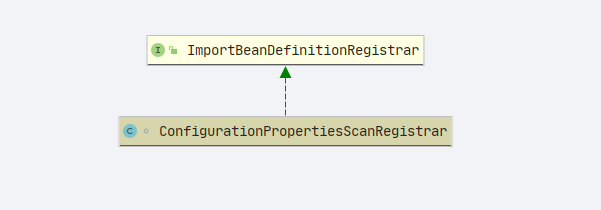

- debug 没有抓到后续补充

## EnableConfigurationProperties

```java
@Target(ElementType.TYPE)
@Retention(RetentionPolicy.RUNTIME)
@Documented
@Import(EnableConfigurationPropertiesRegistrar.class)
public @interface EnableConfigurationProperties {
}
```

## EnableConfigurationPropertiesRegistrar

- 该类会读取**spring.factories**

- 中`org.springframework.boot.autoconfigure.EnableAutoConfiguration=\` 这样的

  ```
  org.springframework.boot.autoconfigure.web.servlet.ServletWebServerFactoryAutoConfiguration
  org.springframework.boot.autoconfigure.web.servlet.DispatcherServletAutoConfiguration$DispatcherServletConfiguration
  org.springframework.boot.autoconfigure.web.servlet.DispatcherServletAutoConfiguration$DispatcherServletRegistrationConfiguration
  org.springframework.boot.autoconfigure.task.TaskExecutionAutoConfiguration
  org.springframework.boot.autoconfigure.web.servlet.error.ErrorMvcAutoConfiguration
  org.springframework.boot.autoconfigure.web.servlet.WebMvcAutoConfiguration$WebMvcAutoConfigurationAdapter
  org.springframework.boot.autoconfigure.context.ConfigurationPropertiesAutoConfiguration
  org.springframework.boot.autoconfigure.jackson.JacksonAutoConfiguration$Jackson2ObjectMapperBuilderCustomizerConfiguration
  org.springframework.boot.autoconfigure.http.HttpMessageConvertersAutoConfiguration$StringHttpMessageConverterConfiguration
  org.springframework.boot.autoconfigure.info.ProjectInfoAutoConfiguration
  org.springframework.boot.autoconfigure.security.oauth2.resource.servlet.OAuth2ResourceServerAutoConfiguration
  org.springframework.boot.autoconfigure.task.TaskSchedulingAutoConfiguration
  org.springframework.boot.autoconfigure.web.embedded.EmbeddedWebServerFactoryCustomizerAutoConfiguration
  org.springframework.boot.autoconfigure.web.servlet.HttpEncodingAutoConfiguration
  org.springframework.boot.autoconfigure.web.servlet.MultipartAutoConfiguration
  ```

```java
	@Override
	public void registerBeanDefinitions(AnnotationMetadata metadata, BeanDefinitionRegistry registry) {
	    // 注册bean
		registerInfrastructureBeans(registry);
	  // 配置属性Bean注册器
		ConfigurationPropertiesBeanRegistrar beanRegistrar = new ConfigurationPropertiesBeanRegistrar(registry);
		// 循环注册
		getTypes(metadata).forEach(beanRegistrar::register);
	}


```

### registerInfrastructureBeans

```java
	static void registerInfrastructureBeans(BeanDefinitionRegistry registry) {
	    // 属性绑定后置处理器
		ConfigurationPropertiesBindingPostProcessor.register(registry);
		// 属性校验器
		ConfigurationPropertiesBeanDefinitionValidator.register(registry);
		ConfigurationBeanFactoryMetadata.register(registry);
	}
```

- 此处操作逻辑基本相同,是否存在这个 beanName 存在直接注册，不存在补充

#### ConfigurationPropertiesBindingPostProcessor.register(registry)

```java
	public static void register(BeanDefinitionRegistry registry) {
		Assert.notNull(registry, "Registry must not be null");
		// 是否存在
		if (!registry.containsBeanDefinition(BEAN_NAME)) {
			GenericBeanDefinition definition = new GenericBeanDefinition();
			definition.setBeanClass(ConfigurationPropertiesBindingPostProcessor.class);
			definition.setRole(BeanDefinition.ROLE_INFRASTRUCTURE);
			registry.registerBeanDefinition(BEAN_NAME, definition);
		}
		ConfigurationPropertiesBinder.register(registry);
	}

```

#### ConfigurationPropertiesBeanDefinitionValidator.register(registry)

```java
	static void register(BeanDefinitionRegistry registry) {
		Assert.notNull(registry, "Registry must not be null");
		if (!registry.containsBeanDefinition(BEAN_NAME)) {
			GenericBeanDefinition definition = new GenericBeanDefinition();
			definition.setBeanClass(ConfigurationPropertiesBeanDefinitionValidator.class);
			definition.setRole(BeanDefinition.ROLE_INFRASTRUCTURE);
			registry.registerBeanDefinition(BEAN_NAME, definition);
		}
		ConfigurationPropertiesBinder.register(registry);
	}

```

### getTypes(metadata).forEach(beanRegistrar::register)

- 先看输入参数 **metadata**

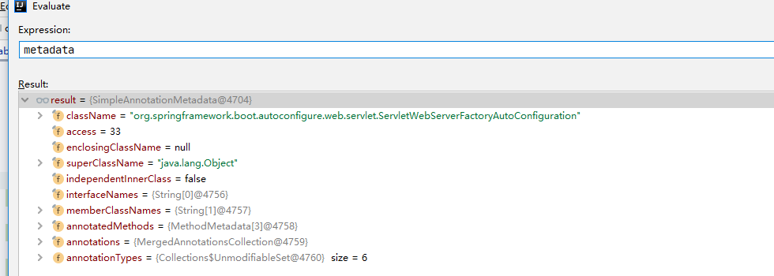

- getTypes 结果

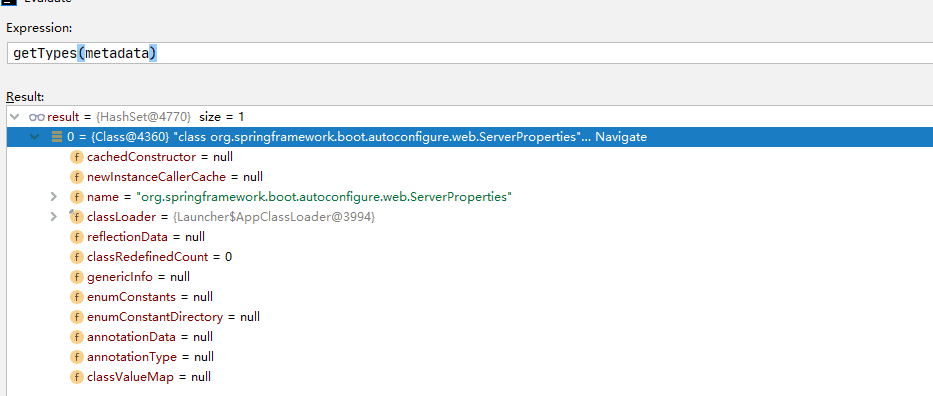

- 源码开始，先找出刚才的对象`org.springframework.boot.autoconfigure.web.servlet.ServletWebServerFactoryAutoConfiguration`

  ```java
  @Configuration(proxyBeanMethods = false)
  @AutoConfigureOrder(Ordered.HIGHEST_PRECEDENCE)
  @ConditionalOnClass(ServletRequest.class)
  @ConditionalOnWebApplication(type = Type.SERVLET)
  @EnableConfigurationProperties(ServerProperties.class)
  @Import({ ServletWebServerFactoryAutoConfiguration.BeanPostProcessorsRegistrar.class,
  		ServletWebServerFactoryConfiguration.EmbeddedTomcat.class,
  		ServletWebServerFactoryConfiguration.EmbeddedJetty.class,
  		ServletWebServerFactoryConfiguration.EmbeddedUndertow.class })
  public class ServletWebServerFactoryAutoConfiguration {}
  ```

```java
    /**
     * 找出 {@link EnableConfigurationProperties} 注解标记的中的属性值,并且返回值不是void
     * @param metadata
     * @return
     */
	private Set<Class<?>> getTypes(AnnotationMetadata metadata) {
		return

		 metadata.getAnnotations().stream(EnableConfigurationProperties.class)
				.flatMap((annotation) -> Arrays.stream(annotation.getClassArray(MergedAnnotation.VALUE)))
				.filter((type) -> void.class != type).collect(Collectors.toSet());
	}


```

- 这里我们可以直接知道返回的是`@EnableConfigurationProperties(ServerProperties.class)` 的数据值: `ServerProperties.class`

循环注册

```java
	void register(Class<?> type) {
		MergedAnnotation<ConfigurationProperties> annotation = MergedAnnotations
				.from(type, SearchStrategy.TYPE_HIERARCHY).get(ConfigurationProperties.class);
		register(type, annotation);
	}

```

---

## ConfigurationPropertiesBindingPostProcessor

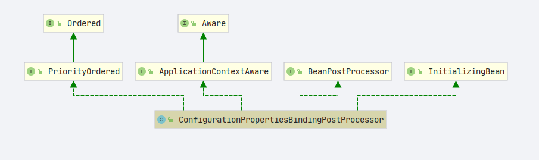

### postProcessBeforeInitialization

```java
	@Override
	public Object postProcessBeforeInitialization(Object bean, String beanName) throws BeansException {
		// 绑定
		bind(ConfigurationPropertiesBean.get(this.applicationContext, bean, beanName));
		return bean;
	}

```

- get

  ```java
  	public static ConfigurationPropertiesBean get(ApplicationContext applicationContext, Object bean, String beanName) {
  		// 寻找工厂方法
  		Method factoryMethod = findFactoryMethod(applicationContext, beanName);
  		// 创建 ConfigurationPropertiesBean
  		return create(beanName, bean, bean.getClass(), factoryMethod);
  	}

  ```

```java
	private static Method findFactoryMethod(ConfigurableListableBeanFactory beanFactory, String beanName) {
		// 判断是否存在这个beanName
		if (beanFactory.containsBeanDefinition(beanName)) {
		    // 获取bean定义
			BeanDefinition beanDefinition = beanFactory.getMergedBeanDefinition(beanName);
			// 类型判断
			if (beanDefinition instanceof RootBeanDefinition) {
			    // 解析方法
				Method resolvedFactoryMethod = ((RootBeanDefinition) beanDefinition).getResolvedFactoryMethod();
				if (resolvedFactoryMethod != null) {
					return resolvedFactoryMethod;
				}
			}
			return findFactoryMethodUsingReflection(beanFactory, beanDefinition);
		}
		return null;
	}

```

```java
	private static Method findFactoryMethodUsingReflection(ConfigurableListableBeanFactory beanFactory,
			BeanDefinition beanDefinition) {
		// 工厂方法
		String factoryMethodName = beanDefinition.getFactoryMethodName();
		// 工厂bean
		String factoryBeanName = beanDefinition.getFactoryBeanName();
		if (factoryMethodName == null || factoryBeanName == null) {
			return null;
		}
		// 转换对象
		Class<?> factoryType = beanFactory.getType(factoryBeanName);
		if (factoryType.getName().contains(ClassUtils.CGLIB_CLASS_SEPARATOR)) {
			factoryType = factoryType.getSuperclass();
		}
		AtomicReference<Method> factoryMethod = new AtomicReference<>();
		ReflectionUtils.doWithMethods(factoryType, (method) -> {
			  // 判断是否是需要的方法
		    if (method.getName().equals(factoryMethodName)) {
				// 设置方法
				factoryMethod.set(method);
			}
		});
		// 返回方法
		return factoryMethod.get();
	}

```

### create

- `org.springframework.boot.context.properties.ConfigurationPropertiesBean#create`

```java
	private static ConfigurationPropertiesBean create(String name, Object instance, Class<?> type, Method factory) {
		// 找注解
		ConfigurationProperties annotation = findAnnotation(instance, type, factory, ConfigurationProperties.class);
		if (annotation == null) {
			return null;
		}
		// 找注解
		Validated validated = findAnnotation(instance, type, factory, Validated.class);
		// 注解列表
		Annotation[] annotations = (validated != null) ? new Annotation[] { annotation, validated }
				: new Annotation[] { annotation };
		// 类型解析
		ResolvableType bindType = (factory != null) ? ResolvableType.forMethodReturnType(factory)
				: ResolvableType.forClass(type);
		// 绑定结果对象
		Bindable<Object> bindTarget = Bindable.of(bindType).withAnnotations(annotations);
		if (instance != null) {
			bindTarget = bindTarget.withExistingValue(instance);
		}
		return new ConfigurationPropertiesBean(name, instance, annotation, bindTarget);
	}

```

- 第一个需要做的类: `org.springframework.boot.autoconfigure.web.ServerProperties`

- `annotation`

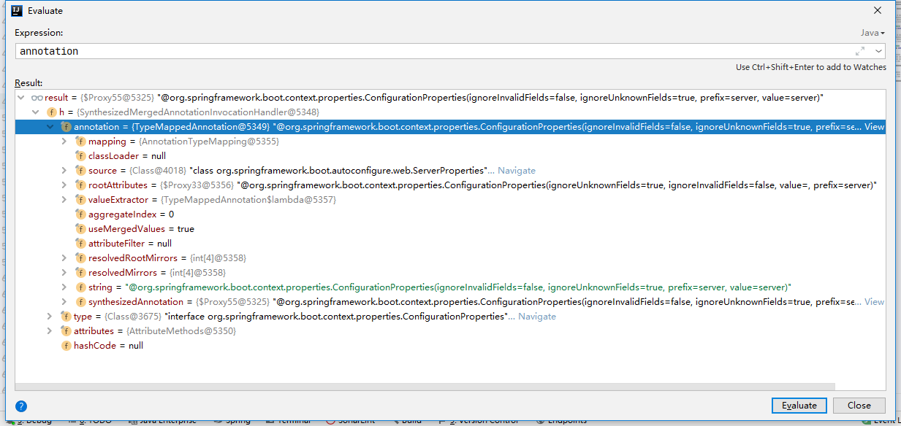

- `bindType`


- 返回对象

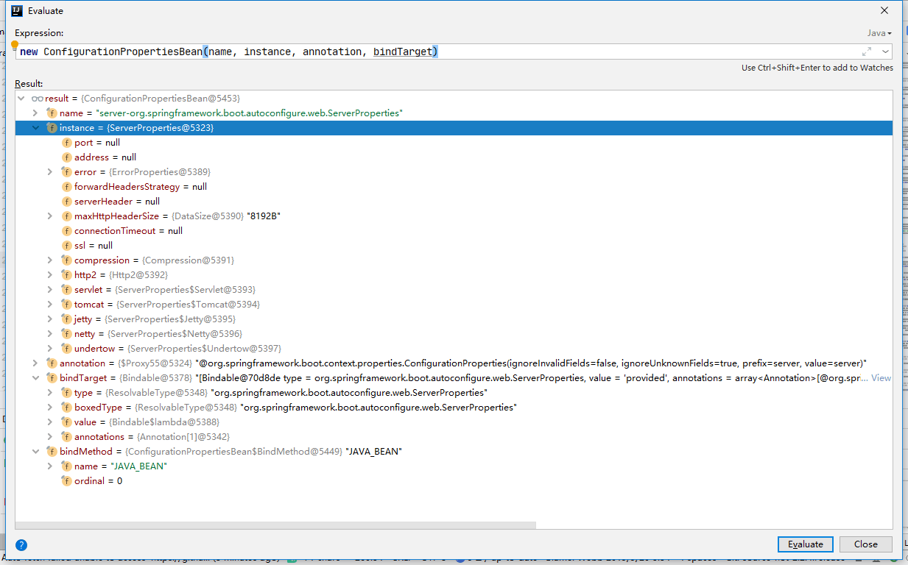

- 此时数据还没有进去

#### bind

- 数据绑定

直接看结果

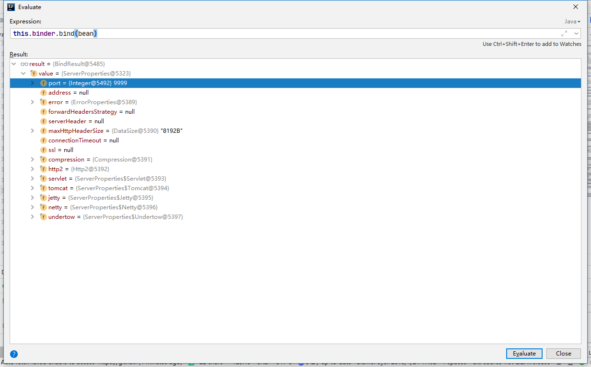

- 上述配置和我在配置文件中写的配置一致

```yml
server:
  port: 9999
```

- 具体方法: `org.springframework.boot.context.properties.ConfigurationPropertiesBindingPostProcessor#bind`

```java
	private void bind(ConfigurationPropertiesBean bean) {
		if (bean == null || hasBoundValueObject(bean.getName())) {
			return;
		}
		Assert.state(bean.getBindMethod() == BindMethod.JAVA_BEAN, "Cannot bind @ConfigurationProperties for bean '"
				+ bean.getName() + "'. Ensure that @ConstructorBinding has not been applied to regular bean");
		try {
			// 最终的绑定
			this.binder.bind(bean);
		}
		catch (Exception ex) {
			throw new ConfigurationPropertiesBindException(bean, ex);
		}
	}

```

```java
BindResult<?> bind(ConfigurationPropertiesBean propertiesBean) {
	    // 最后的结果
		Bindable<?> target = propertiesBean.asBindTarget();
		// 注解获取
		ConfigurationProperties annotation = propertiesBean.getAnnotation();
		// 获取处理器
		BindHandler bindHandler = getBindHandler(target, annotation);
		//
		return getBinder().bind(annotation.prefix(), target, bindHandler);
	}
```

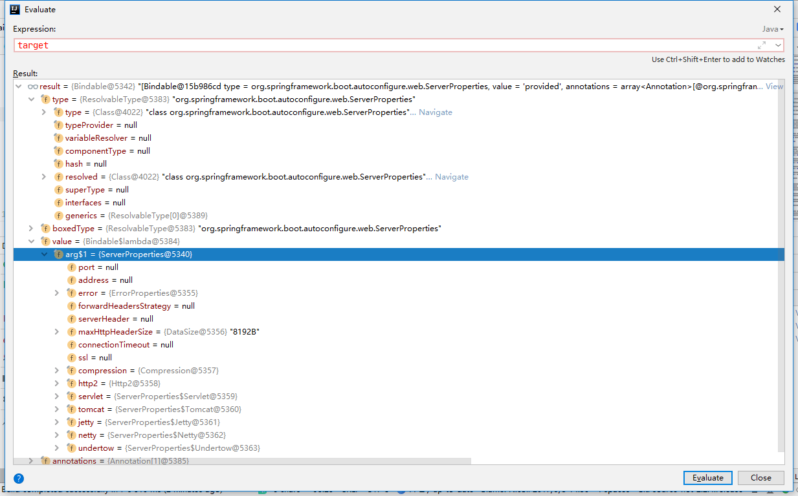

##### findProperty

```java
	private ConfigurationProperty findProperty(ConfigurationPropertyName name, Context context) {
		if (name.isEmpty()) {
			return null;
		}
		for (ConfigurationPropertySource source : context.getSources()) {
		    // 获取具体的一个属性值
			ConfigurationProperty property = source.getConfigurationProperty(name);
			if (property != null) {
				return property;
			}
		}
		return null;
	}

```

- `org.springframework.boot.context.properties.source.SpringConfigurationPropertySource#getConfigurationProperty`

  ```java
  	@Override
  	public ConfigurationProperty getConfigurationProperty(ConfigurationPropertyName name) {
  		PropertyMapping[] mappings = getMapper().map(name);
  		return find(mappings, name);
  	}

  ```

  ```java

  	protected final ConfigurationProperty find(PropertyMapping[] mappings, ConfigurationPropertyName name) {
  		for (PropertyMapping candidate : mappings) {
  			if (candidate.isApplicable(name)) {
  				ConfigurationProperty result = find(candidate);
  				if (result != null) {
  					return result;
  				}
  			}
  		}
  		return null;
  	}

  ```

  ```java
  	private ConfigurationProperty find(PropertyMapping mapping) {
  	    // 需要读取的配置信息的key
  		String propertySourceName = mapping.getPropertySourceName();
  		// 信息的value
  		Object value = getPropertySource().getProperty(propertySourceName);
  		if (value == null) {
  			return null;
  		}
  		// 创建对象
  		ConfigurationPropertyName configurationPropertyName = mapping.getConfigurationPropertyName();
  		Origin origin = PropertySourceOrigin.get(this.propertySource, propertySourceName);
  		// 包装返回
  		return ConfigurationProperty.of(configurationPropertyName, value, origin);
  	}

  ```

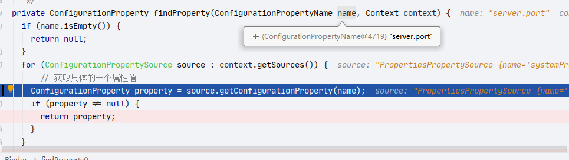

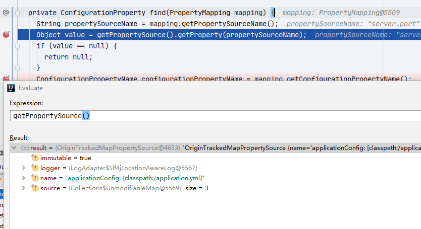

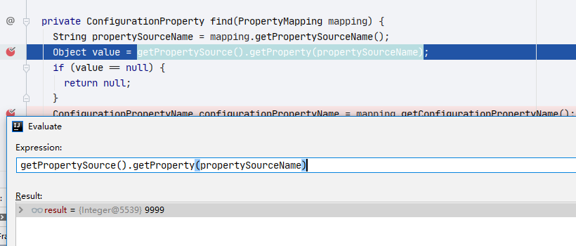

##### getBindHandler

```java
private <T> BindHandler getBindHandler(Bindable<T> target, ConfigurationProperties annotation) {
		// 获取校验接口列表
		List<Validator> validators = getValidators(target);
		// 处理器
		BindHandler handler = new IgnoreTopLevelConverterNotFoundBindHandler();
		if (annotation.ignoreInvalidFields()) {
			// 忽略错误的绑定处理器
			handler = new IgnoreErrorsBindHandler(handler);
		}
		if (!annotation.ignoreUnknownFields()) {
			UnboundElementsSourceFilter filter = new UnboundElementsSourceFilter();
			// 未绑定元素处理器
			handler = new NoUnboundElementsBindHandler(handler, filter);
		}
		if (!validators.isEmpty()) {
			// 校验绑定处理器
			handler = new ValidationBindHandler(handler, validators.toArray(new Validator[0]));
		}
		for (ConfigurationPropertiesBindHandlerAdvisor advisor : getBindHandlerAdvisors()) {
			// handler
			handler = advisor.apply(handler);
		}
		return handler;
	}
```

- 最终获取得到的处理器

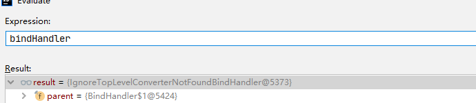

- 最后的 bind

```java
	private <T> Object bindObject(ConfigurationPropertyName name, Bindable<T> target, BindHandler handler,
			Context context, boolean allowRecursiveBinding) {
	    // 获取属性
		ConfigurationProperty property = findProperty(name, context);
		if (property == null && containsNoDescendantOf(context.getSources(), name) && context.depth != 0) {
			return null;
		}
		AggregateBinder<?> aggregateBinder = getAggregateBinder(target, context);
		if (aggregateBinder != null) {
			return bindAggregate(name, target, handler, context, aggregateBinder);
		}
		if (property != null) {
			try {
				return bindProperty(target, context, property);
			}
			catch (ConverterNotFoundException ex) {
				// We might still be able to bind it using the recursive binders
				Object instance = bindDataObject(name, target, handler, context, allowRecursiveBinding);
				if (instance != null) {
					return instance;
				}
				throw ex;
			}
		}
		return bindDataObject(name, target, handler, context, allowRecursiveBinding);
	}

```

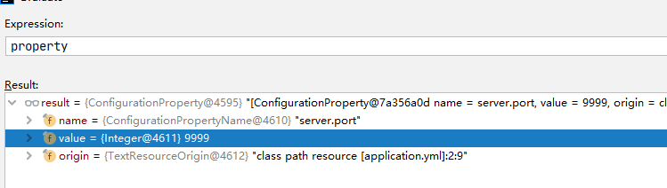

配置信息到此绑定成功,关于如何处理集合相关的配置请各位读者自行学习

---
