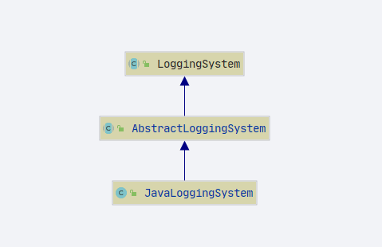
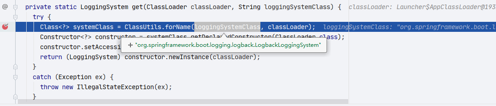
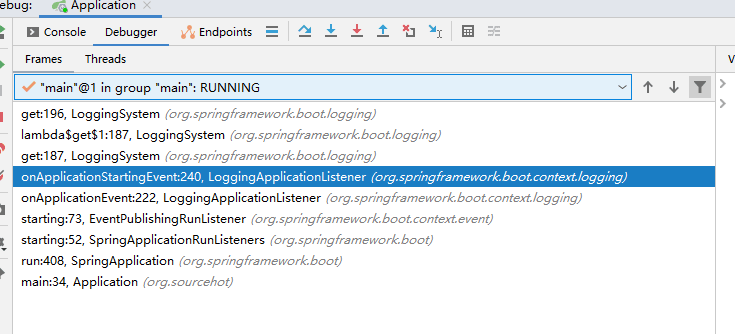
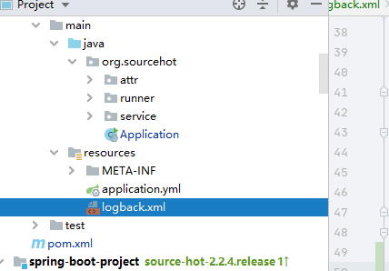
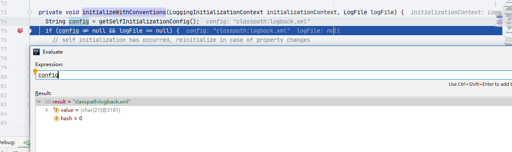

# SpringBoot 日志系统

- Author: [HuiFer](https://github.com/huifer)
- 源码阅读仓库: [SourceHot-spring-boot](https://github.com/SourceHot/spring-boot-read)

- 包路径: `org.springframework.boot.logging`

## 日志级别

- 日志级别: `org.springframework.boot.logging.LogLevel`

  ```java
  public enum LogLevel {
  	TRACE, DEBUG, INFO, WARN, ERROR, FATAL, OFF
  }
  ```

## Java 日志实现

- `org.springframework.boot.logging.java.JavaLoggingSystem`

  

  ```java
  static {
  	// KEY :  springBoot 定义的日志级别, value: jdk 定义的日志级别
  	LEVELS.map(LogLevel.TRACE, Level.FINEST);
  	LEVELS.map(LogLevel.DEBUG, Level.FINE);
  	LEVELS.map(LogLevel.INFO, Level.INFO);
  	LEVELS.map(LogLevel.WARN, Level.WARNING);
  	LEVELS.map(LogLevel.ERROR, Level.SEVERE);
  	LEVELS.map(LogLevel.FATAL, Level.SEVERE);
  	LEVELS.map(LogLevel.OFF, Level.OFF);
  }
  ```

- LEVELS 对象

  ```java
  protected static class LogLevels<T> {
  	/**
  	 * key ： SpringBoot 中定义的日志级别, value: 其他日志框架的日志级别
  	 */
  	private final Map<LogLevel, T> systemToNative;
  	/**
  	 * key : 其他日志框架的日志级别 , value: springBoot 中定义中定义的日志级别
  	 */
  	private final Map<T, LogLevel> nativeToSystem;
  }
  ```

## LoggingSystem

- 抽象类
- `org.springframework.boot.logging.LoggingSystem`

- 一个 map 对象: `SYSTEMS`

  ```java
  /**
   * key: 第三方日志框架的类 value: springBoot 中的处理类
   */
  private static final Map<String, String> SYSTEMS;

  static {
  	Map<String, String> systems = new LinkedHashMap<>();
  	systems.put("ch.qos.logback.core.Appender", "org.springframework.boot.logging.logback.LogbackLoggingSystem");
  	systems.put("org.apache.logging.log4j.core.impl.Log4jContextFactory",
  			"org.springframework.boot.logging.log4j2.Log4J2LoggingSystem");
  	systems.put("java.util.logging.LogManager", "org.springframework.boot.logging.java.JavaLoggingSystem");
  	SYSTEMS = Collections.unmodifiableMap(systems);
  }
  ```

- 各个抽象方法

  | 方法名称                | 作用                               |
  | ----------------------- | ---------------------------------- |
  | beforeInitialize        | 初始化之前调用，目的是减少日志输出 |
  | initialize              | 初始化日志                         |
  | cleanUp                 | 清除日志                           |
  | getShutdownHandler      |                                    |
  | getSupportedLogLevels   | 获取支持的日志级别                 |
  | setLogLevel             | 设置日志级别                       |
  | getLoggerConfigurations | 获取日志配置                       |

### get

```java
public static LoggingSystem get(ClassLoader classLoader) {
	// 获取系统属性
	String loggingSystem = System.getProperty(SYSTEM_PROPERTY);

	if (StringUtils.hasLength(loggingSystem)) {
		// 是不是NONE
		if (NONE.equals(loggingSystem)) {
			// 空的日志系统
			return new NoOpLoggingSystem();
		}
		return get(classLoader, loggingSystem);
	}
	// 循环所有日志,
	return SYSTEMS.entrySet().stream().filter((entry) -> ClassUtils.isPresent(entry.getKey(), classLoader))
			.map((entry) ->
			// 实例化具体日志
				get(classLoader, entry.getValue())).findFirst()
			.orElseThrow(() -> new IllegalStateException("No suitable logging system located"));
}
```

- 实例化日志系统

```java
private static LoggingSystem get(ClassLoader classLoader, String loggingSystemClass) {
	try {
		Class<?> systemClass = ClassUtils.forName(loggingSystemClass, classLoader);
		Constructor<?> constructor = systemClass.getDeclaredConstructor(ClassLoader.class);
		constructor.setAccessible(true);
		return (LoggingSystem) constructor.newInstance(classLoader);
	}
	catch (Exception ex) {
		throw new IllegalStateException(ex);
	}
}

```



- 默认日志: `org.springframework.boot.logging.logback.LogbackLoggingSystem`

### beforeInitialize

- 初始化之前

  

- 链路

  1.  `org.springframework.boot.context.logging.LoggingApplicationListener#onApplicationEvent`
  2.  `org.springframework.boot.context.logging.LoggingApplicationListener#onApplicationStartingEvent`
  3.  `org.springframework.boot.logging.LoggingSystem#beforeInitialize`

- 因为前文中我们已知对象是：`org.springframework.boot.logging.logback.LogbackLoggingSystem` 直接看这个类的 `beforeInitialize` 方法

  ```java
  @Override
  public void beforeInitialize() {
  	// 日志上下文
  	LoggerContext loggerContext = getLoggerContext();
  	// 是否初始化
  	if (isAlreadyInitialized(loggerContext)) {
  		return;
  	}
  	// 父类方法
  	super.beforeInitialize();
  	// 添加过滤器
  	loggerContext.getTurboFilterList().add(FILTER);
  }
  ```

- 初始化之前的的操作完成了初始化方法开始

### initialize

- `org.springframework.boot.context.logging.LoggingApplicationListener#onApplicationEnvironmentPreparedEvent`

  ```java
  private void onApplicationEnvironmentPreparedEvent(ApplicationEnvironmentPreparedEvent event) {
  	if (this.loggingSystem == null) {
  		this.loggingSystem = LoggingSystem.get(event.getSpringApplication().getClassLoader());
  	}
  	initialize(event.getEnvironment(), event.getSpringApplication().getClassLoader());
  }

  ```

- `org.springframework.boot.context.logging.LoggingApplicationListener#initializeSystem`

  ```java
  protected void initialize(ConfigurableEnvironment environment, ClassLoader classLoader) {
  	new LoggingSystemProperties(environment).apply();
  	this.logFile = LogFile.get(environment);
  	if (this.logFile != null) {
  		this.logFile.applyToSystemProperties();
  	}
  	this.loggerGroups = new LoggerGroups(DEFAULT_GROUP_LOGGERS);
  	// 早期 的日志级别
  	initializeEarlyLoggingLevel(environment);
  	// 初始化日志系统
  	initializeSystem(environment, this.loggingSystem, this.logFile);
  	// 初始化日志级别
  	initializeFinalLoggingLevels(environment, this.loggingSystem);
  	registerShutdownHookIfNecessary(environment, this.loggingSystem);
  }

  ```

  ```java
  private void initializeSystem(ConfigurableEnvironment environment, LoggingSystem system, LogFile logFile) {
  	LoggingInitializationContext initializationContext = new LoggingInitializationContext(environment);
  	String logConfig = environment.getProperty(CONFIG_PROPERTY);
  	if (ignoreLogConfig(logConfig)) {
  		// 日志系统初始化
  		system.initialize(initializationContext, null, logFile);
  	}
  	else {
  		try {
  			ResourceUtils.getURL(logConfig).openStream().close();
  			system.initialize(initializationContext, logConfig, logFile);
  		}
  		catch (Exception ex) {
  			// NOTE: We can't use the logger here to report the problem
  			System.err.println("Logging system failed to initialize using configuration from '" + logConfig + "'");
  			ex.printStackTrace(System.err);
  			throw new IllegalStateException(ex);
  		}
  	}
  }
  ```

- `org.springframework.boot.logging.logback.LogbackLoggingSystem#initialize`

  ```java
  @Override
  public void initialize(LoggingInitializationContext initializationContext, String configLocation, LogFile logFile) {
  	LoggerContext loggerContext = getLoggerContext();
  	if (isAlreadyInitialized(loggerContext)) {
  		return;
  	}
  	// 日志初始化
  	super.initialize(initializationContext, configLocation, logFile);
  	loggerContext.getTurboFilterList().remove(FILTER);
  	markAsInitialized(loggerContext);
  	if (StringUtils.hasText(System.getProperty(CONFIGURATION_FILE_PROPERTY))) {
  		getLogger(LogbackLoggingSystem.class.getName()).warn("Ignoring '" + CONFIGURATION_FILE_PROPERTY
  				+ "' system property. Please use 'logging.config' instead.");
  	}
  }

  ```

- `org.springframework.boot.logging.AbstractLoggingSystem#initializeWithConventions`

  ```java
  private void initializeWithConventions(LoggingInitializationContext initializationContext, LogFile logFile) {
  	String config = getSelfInitializationConfig();
  	if (config != null && logFile == null) {
  		// self initialization has occurred, reinitialize in case of property changes
  		reinitialize(initializationContext);
  		return;
  	}
  	if (config == null) {
  		config = getSpringInitializationConfig();
  	}
  	if (config != null) {
  		loadConfiguration(initializationContext, config, logFile);
  		return;
  	}
  	// 加载默认配置
  	loadDefaults(initializationContext, logFile);
  }
  ```

- `org.springframework.boot.logging.logback.LogbackLoggingSystem#loadDefaults`

  ```java
  @Override
  protected void loadDefaults(LoggingInitializationContext initializationContext, LogFile logFile) {
  	LoggerContext context = getLoggerContext();
  	stopAndReset(context);
  	boolean debug = Boolean.getBoolean("logback.debug");
  	if (debug) {
  		StatusListenerConfigHelper.addOnConsoleListenerInstance(context, new OnConsoleStatusListener());
  	}
  	LogbackConfigurator configurator = debug ? new DebugLogbackConfigurator(context)
  			: new LogbackConfigurator(context);
  	Environment environment = initializationContext.getEnvironment();
  	context.putProperty(LoggingSystemProperties.LOG_LEVEL_PATTERN,
  			environment.resolvePlaceholders("${logging.pattern.level:${LOG_LEVEL_PATTERN:%5p}}"));
  	context.putProperty(LoggingSystemProperties.LOG_DATEFORMAT_PATTERN, environment.resolvePlaceholders(
  			"${logging.pattern.dateformat:${LOG_DATEFORMAT_PATTERN:yyyy-MM-dd HH:mm:ss.SSS}}"));
  	context.putProperty(LoggingSystemProperties.ROLLING_FILE_NAME_PATTERN, environment
  			.resolvePlaceholders("${logging.pattern.rolling-file-name:${LOG_FILE}.%d{yyyy-MM-dd}.%i.gz}"));
  	new DefaultLogbackConfiguration(initializationContext, logFile).apply(configurator);
  	context.setPackagingDataEnabled(true);
  }
  ```

  ```java
  @Override
  public void initialize(LoggingInitializationContext initializationContext, String configLocation, LogFile logFile) {
  	LoggerContext loggerContext = getLoggerContext();
  	// 是否加载过
  	if (isAlreadyInitialized(loggerContext)) {
  		return;
  	}
  	// 日志初始化
  	super.initialize(initializationContext, configLocation, logFile);
  	// 删除 FILTER
  	loggerContext.getTurboFilterList().remove(FILTER);
  	// 初始化标记
  	markAsInitialized(loggerContext);
  	if (StringUtils.hasText(System.getProperty(CONFIGURATION_FILE_PROPERTY))) {
  		getLogger(LogbackLoggingSystem.class.getName()).warn("Ignoring '" + CONFIGURATION_FILE_PROPERTY
  				+ "' system property. Please use 'logging.config' instead.");
  	}
  }
  ```

- 标记 `markAsInitialized`

  ```java
  private void markAsInitialized(LoggerContext loggerContext) {
  	loggerContext.putObject(LoggingSystem.class.getName(), new Object());
  }
  ```

此时日志初始化完成。

### 默认配置文件

- `getStandardConfigLocations` 这个方法定义了默认配置文件有哪些。

  ```java
  @Override
  protected String[] getStandardConfigLocations() {
  	return new String[] { "logback-test.groovy", "logback-test.xml", "logback.groovy", "logback.xml" };
  }
  ```

- 切回 `org.springframework.boot.logging.AbstractLoggingSystem#initializeWithConventions` 方法

- 添加依赖

  ```XML
  <dependency>
  	<groupId>org.springframework.boot</groupId>
  	<artifactId>spring-boot-starter-logging</artifactId>
  	<version>${revision}</version>
  </dependency>

  ```

- 添加配置文件

  

  

- 此时配置文件地址出现了

  ```java
  protected String getSelfInitializationConfig() {
  	// 寻找配置文件
  	return findConfig(getStandardConfigLocations());
  }
  ```

  ```java
  @Override
  protected String[] getStandardConfigLocations() {
  	return new String[] { "logback-test.groovy", "logback-test.xml", "logback.groovy", "logback.xml" };
  }

  ```

  ```java
  private String findConfig(String[] locations) {
  	for (String location : locations) {
  		ClassPathResource resource = new ClassPathResource(location, this.classLoader);
  		if (resource.exists()) {
  			return "classpath:" + location;
  		}
  	}
  	return null;
  }
  ```

- 此时自定义配置文件如何获取的已经明了。

#### reinitialize

```java
@Override
protected void reinitialize(LoggingInitializationContext initializationContext) {
	// 日志上下文重新设置
	getLoggerContext().reset();
	getLoggerContext().getStatusManager().clear();
	// 加载配置文件
	loadConfiguration(initializationContext, getSelfInitializationConfig(), null);
}
```

```java
@Override
protected void loadConfiguration(LoggingInitializationContext initializationContext, String location,
		LogFile logFile) {
	// 父类方法
	super.loadConfiguration(initializationContext, location, logFile);
	// 获取上下文
	LoggerContext loggerContext = getLoggerContext();
	// 停止并且重启
	stopAndReset(loggerContext);
	try {
		// 配置文件加载
		configureByResourceUrl(initializationContext, loggerContext, ResourceUtils.getURL(location));
	}
	catch (Exception ex) {
		throw new IllegalStateException("Could not initialize Logback logging from " + location, ex);
	}
	List<Status> statuses = loggerContext.getStatusManager().getCopyOfStatusList();
	StringBuilder errors = new StringBuilder();
	for (Status status : statuses) {
		if (status.getLevel() == Status.ERROR) {
			errors.append((errors.length() > 0) ? String.format("%n") : "");
			errors.append(status.toString());
		}
	}
	if (errors.length() > 0) {
		throw new IllegalStateException(String.format("Logback configuration error detected: %n%s", errors));
	}
}

```

```java
private void configureByResourceUrl(LoggingInitializationContext initializationContext, LoggerContext loggerContext,
		URL url) throws JoranException {
	if (url.toString().endsWith("xml")) {
		// logback 日志操作
		JoranConfigurator configurator = new SpringBootJoranConfigurator(initializationContext);
		// 设置上下文
		configurator.setContext(loggerContext);
		// 执行配置
		configurator.doConfigure(url);
	}
	else {
		new ContextInitializer(loggerContext).configureByResource(url);
	}
}

```

执行配置属于 logback 操作源码不在此进行分析。
