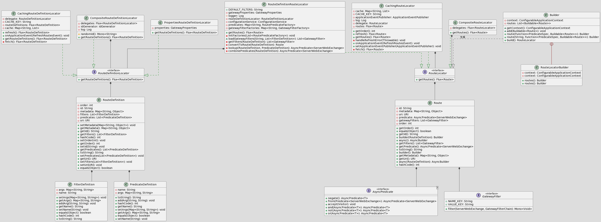
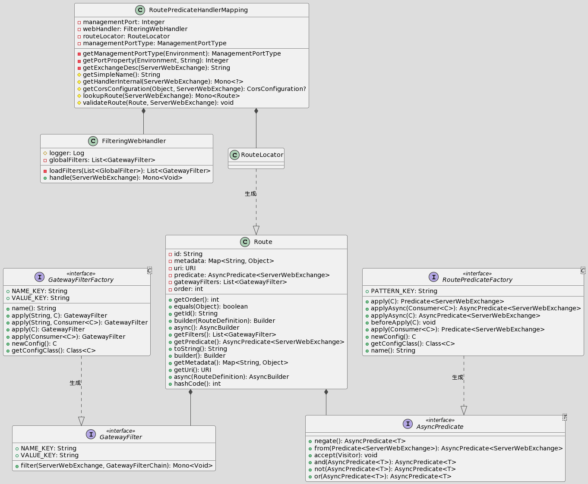
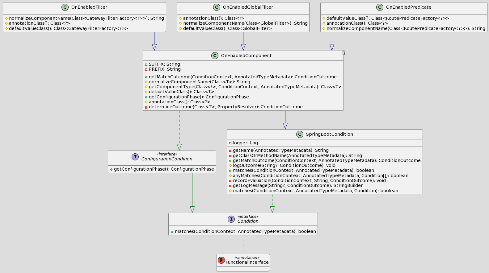
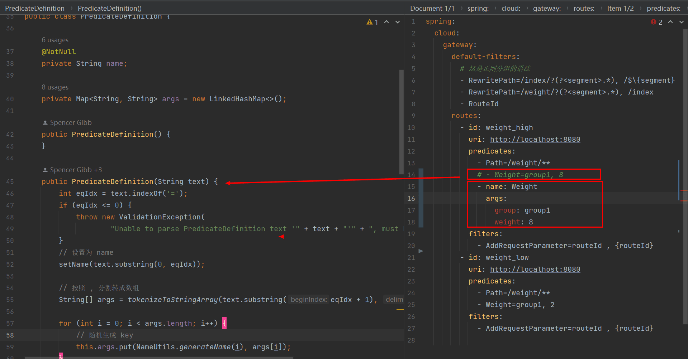
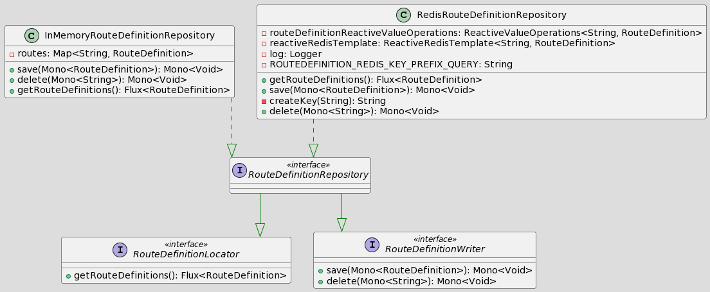
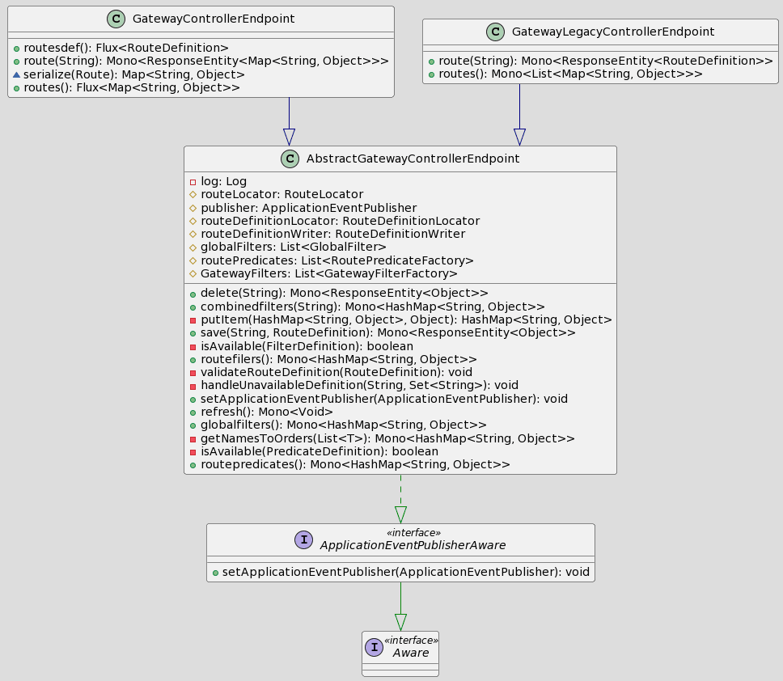

# 说明

Author: [haitaoss](https://github.com/haitaoss)

源码阅读仓库: [spring-cloud-gateway](https://github.com/haitaoss/spring-cloud-gateway)

参考资料和需要掌握的知识：

- [Spring WebFlux 源码分析](https://github.com/haitaoss/spring-framework/blob/source-v5.3.10/note/springwebflux-source-note.md)
- [Spring Cloud Circuit Breaker](https://github.com/haitaoss/spring-cloud-circuitbreaker/blob/source-v2.1.5/note/spring-cloud-circuitbreaker-source-note.md)
- [Spring Cloud Commons](https://github.com/haitaoss/spring-cloud-commons/blob/source-v3.1.5/note/spring-cloud-commons-source-note.md#blockingloadbalancerclientexecute)
- [Spring Cloud Gateway 官网文档](https://docs.spring.io/spring-cloud-gateway/docs/3.1.5/reference/html/)

# Spring Cloud Gateway 介绍

功能：**接收请求**并根据匹配的**路由**进行**转发**。

术语：

- **Route**: 是路由规则的描述。它由 ID、目标 URI、**Predicate 集合**和**Filter 集合**组成。如果 Predicate 为真，则路由匹配。
- **Predicate**: 这是一个 Java 8 函数接口。输入类型是 `ServerWebExchange` ，所以可以匹配 HTTP 请求中的任何内容，例如 Header 或参数。
- **Filter**: 这些是使用**特定工厂**构建的 `GatewayFilter` 的实例。使用这个可以在发送下游请求之前或之后修改请求和响应。

Spring Cloud Gateway 是基于 Spring WebFlux 实现的，是通过注册 WebFlux 的生命周期组件实现控制请求执行。

```properties
# Spring WebFlux 处理请求的生命周期
客户端请求 -> WebFlux服务 -> WebFilter -> DispatcherHandler -> HandlerMapping -> HandlerAdapter -> 执行Handler方法
```

Gateway 通过注册 [RoutePredicateHandlerMapping](#RoutePredicateHandlerMapping) 实现核心逻辑

# Gateway 自动装配

`spring-cloud-gateway-server.jar!META-INF/spring.factories`的部分内容

```properties
org.springframework.boot.autoconfigure.EnableAutoConfiguration=\
    org.springframework.cloud.gateway.config.GatewayClassPathWarningAutoConfiguration,\
    org.springframework.cloud.gateway.config.GatewayAutoConfiguration,\
    org.springframework.cloud.gateway.config.GatewayResilience4JCircuitBreakerAutoConfiguration,\
    org.springframework.cloud.gateway.config.GatewayNoLoadBalancerClientAutoConfiguration,\
    org.springframework.cloud.gateway.config.GatewayMetricsAutoConfiguration,\
    org.springframework.cloud.gateway.config.GatewayRedisAutoConfiguration,\
    org.springframework.cloud.gateway.discovery.GatewayDiscoveryClientAutoConfiguration,\
    org.springframework.cloud.gateway.config.SimpleUrlHandlerMappingGlobalCorsAutoConfiguration,\
    org.springframework.cloud.gateway.config.GatewayReactiveLoadBalancerClientAutoConfiguration,\
    org.springframework.cloud.gateway.config.GatewayReactiveOAuth2AutoConfiguration
```

`spring-cloud-gateway-webflux.jar!META-INF/spring.factories`的内容

```properties
org.springframework.boot.autoconfigure.EnableAutoConfiguration=\
org.springframework.cloud.gateway.webflux.config.ProxyResponseAutoConfiguration

org.springframework.boot.test.autoconfigure.web.reactive.AutoConfigureWebFlux=\
org.springframework.cloud.gateway.webflux.config.ProxyResponseAutoConfiguration
```

`spring-cloud-gateway-mvc.jar!META-INF/spring.factories`的内容

```properties
org.springframework.boot.autoconfigure.EnableAutoConfiguration=\
org.springframework.cloud.gateway.mvc.config.ProxyResponseAutoConfiguration

org.springframework.boot.test.autoconfigure.web.servlet.AutoConfigureWebMvc=\
org.springframework.cloud.gateway.mvc.config.ProxyResponseAutoConfiguration
```

## GatewayClassPathWarningAutoConfiguration

作用：检验启动环境不能是 SpringMVC

```java
@Configuration(proxyBeanMethods = false)
@ConditionalOnProperty(name = "spring.cloud.gateway.enabled", matchIfMissing = true)
public class GatewayClassPathWarningAutoConfiguration {

    @Configuration(proxyBeanMethods = false)
    // SpringMVC 会存在这个类，所以条件会满足，这个类就会注册到BeanFactory中
    @ConditionalOnClass(name = "org.springframework.web.servlet.DispatcherServlet")
    @ConditionalOnWebApplication(type = ConditionalOnWebApplication.Type.SERVLET)
    protected static class SpringMvcFoundOnClasspathConfiguration {

        public SpringMvcFoundOnClasspathConfiguration() {
            // 实例化就直接抛出异常
            throw new MvcFoundOnClasspathException();
        }

    }
}
```

## GatewayAutoConfiguration

### 类图

> RouteLocator 是为了得到`Flux<Route>`，可以使用 RouteLocatorBuilder 很方便的生成 RouteLocator。
>
> RouteDefinitionRouteLocator 是会根据 RouteDefinition 生成 Route ，而 RouteDefinition 是由 RouteDefinitionLocator 生成的。
>
> Route 是由 AsyncPredicate 和 GatewayFilter 组成的。而 AsyncPredicate 由 RoutePredicateFactory 生成，GatewayF 创建 ilter 由 GatewayFilterFactory



> RoutePredicateHandlerMapping 通过 RouteLocator 得到的 `Flux<Route>` ，遍历执行`Route.getPredicate().apply(ServerWebExchange)` 返回`true`说明命中了路由规则，将命中的 Route 存到 ServerWebExchange 中，然后执行 FilteringWebHandler 。
>
> FilteringWebHandler 的逻辑就是执行 GlobalFilter + GatewayFilter



### 源码

可以自定义这些类型的 bean 实现功能的扩展：**RouteLocator**、**HttpHeaderFilter**、**GlobalFilter** 、**GatewayFilterFactory**、**RoutePredicateFactory**

默认通过 @Bean 注册了很多的 GlobalFilter、GatewayFilterFactory、RoutePredicateFactory 且都是有条件注解的，可以通过设置属性不进行默认注册。主要是有这[三个条件注解](#conditionalonenabledglobalfilterconditionalonenabledfilterconditionalonenabledpredicate)

```java
@Configuration(proxyBeanMethods = false)
@ConditionalOnProperty(name = "spring.cloud.gateway.enabled", matchIfMissing = true)
@ConditionalOnClass(DispatcherHandler.class)
public class GatewayAutoConfiguration {

    /**
     * 是工具类，可用来构造出 RouteLocator 实例。若想使用编码的方式配置 Route，推荐使用这个 RouteLocatorBuilder。
     */
    @Bean
    public RouteLocatorBuilder routeLocatorBuilder(ConfigurableApplicationContext context) {
        return new RouteLocatorBuilder(context);
    }

    /**
     * 实现 RouteDefinitionLocator 接口，其特点是根据 GatewayProperties(配置文件中定义的route) 的内容返回 List<RouteDefinition>
     */
    @Bean
    @ConditionalOnMissingBean
    public PropertiesRouteDefinitionLocator propertiesRouteDefinitionLocator(GatewayProperties properties) {
        return new PropertiesRouteDefinitionLocator(properties);
    }

    /**
     * 实现 RouteDefinitionRepository 接口，定义如何 save、delete RouteDefinition
     * 实现 RouteDefinitionLocator 接口，其特点是从缓存(Map、Redis等等)中得到 List<RouteDefinition>
     */
    @Bean
    @ConditionalOnMissingBean(RouteDefinitionRepository.class)
    public InMemoryRouteDefinitionRepository inMemoryRouteDefinitionRepository() {
        return new InMemoryRouteDefinitionRepository();
    }

    /**
     * 聚合所有的 RouteDefinitionLocator
     */
    @Bean
    @Primary
    public RouteDefinitionLocator routeDefinitionLocator(List<RouteDefinitionLocator> routeDefinitionLocators) {
        return new CompositeRouteDefinitionLocator(Flux.fromIterable(routeDefinitionLocators));
    }

    /**
     * 是一个工具类，可用来 实例化类、属性绑定和属性校验(JSR303)
     * GatewayFilterFactory、RoutePredicateFactory 会使用 ConfigurationService 生成 Config 实例，并完成属性绑定和属性校验(JSR303)
     */
    @Bean
    public ConfigurationService gatewayConfigurationService(BeanFactory beanFactory,
                                                            @Qualifier("webFluxConversionService") ObjectProvider<ConversionService> conversionService,
                                                            ObjectProvider<Validator> validator) {
        return new ConfigurationService(beanFactory, conversionService, validator);
    }

    /**
     * RouteLocator 接口是用来生成 Flux<Route> 的。
     *
     * 依赖 RouteDefinitionLocator 得到 RouteDefinition , 而 RouteDefinition 中定义了 FilterDefinition、PredicateDefinition，
     * 会使用 GatewayFilterFactory、RoutePredicateFactory 生成 GatewayFilter、Predicate ，然后配置给 Route 实例
     * 而 GatewayFilterFactory、RoutePredicateFactory 继承这两个接口 ShortcutConfigurable、Configurable，这两个接口是为了得到 Config 。
     * 会使用 ConfigurationService 生成 Config 实例，并完成属性绑定和属性校验(JSR303)。
     * GatewayFilterFactory、RoutePredicateFactory 会根据 Config 来生成 GatewayFilter、Predicate
     */
    @Bean
    public RouteLocator routeDefinitionRouteLocator(GatewayProperties properties,
                                                    List<GatewayFilterFactory> gatewayFilters, List<RoutePredicateFactory> predicates,
                                                    RouteDefinitionLocator routeDefinitionLocator, ConfigurationService configurationService) {
        return new RouteDefinitionRouteLocator(routeDefinitionLocator, predicates, gatewayFilters, properties,
                configurationService);
    }

    /**
     * 聚合所有的 RouteLocator 。所以我们可以自定义 RouteLocator 自定义路由
     */
    @Bean
    @Primary
    @ConditionalOnMissingBean(name = "cachedCompositeRouteLocator")
    public RouteLocator cachedCompositeRouteLocator(List<RouteLocator> routeLocators) {
        return new CachingRouteLocator(new CompositeRouteLocator(Flux.fromIterable(routeLocators)));
    }

    /**
     * 实现 ApplicationListener<ApplicationEvent> 接口，
     * 收到关心的事件(ContextRefreshedEvent、RefreshScopeRefreshedEvent、InstanceRegisteredEvent、ParentHeartbeatEvent、HeartbeatEvent)
     * 就会 发布一个 RefreshRoutesEvent 事件
     */
    @Bean
    @ConditionalOnClass(name = "org.springframework.cloud.client.discovery.event.HeartbeatMonitor")
    public RouteRefreshListener routeRefreshListener(ApplicationEventPublisher publisher) {
        return new RouteRefreshListener(publisher);
    }

    /**
     * FilteringWebHandler 实现 WebHandler 接口，可以理解成 SpringMVC 中的 handler，
     * RoutePredicateHandlerMapping.getHandler() 返回的就是 FilteringWebHandler，
     * FilteringWebHandler 就是遍历执行 GlobalFilter + Route配置的WebFilter
     */
    @Bean
    public FilteringWebHandler filteringWebHandler(List<GlobalFilter> globalFilters) {
        return new FilteringWebHandler(globalFilters);
    }

    /**
     * RoutePredicateHandlerMapping 实现 HandlerMapping 接口。
     *
     * RoutePredicateHandlerMapping#getHandler 是根据 RouteLocator 得到的 List<Route> 遍历执行 Route.getPredicate().apply(ServerWebExchange)
     * 为 true 就说明匹配，会返回 FilteringWebHandler
     */
    @Bean
    @ConditionalOnMissingBean
    public RoutePredicateHandlerMapping routePredicateHandlerMapping(FilteringWebHandler webHandler,
                                                                     RouteLocator routeLocator, GlobalCorsProperties globalCorsProperties, Environment environment) {
        return new RoutePredicateHandlerMapping(webHandler, routeLocator, globalCorsProperties, environment);
    }

    // 生成 Predicate 的工厂
    @Bean
    @ConditionalOnEnabledPredicate
    public AfterRoutePredicateFactory afterRoutePredicateFactory() {
        return new AfterRoutePredicateFactory();
    }

    // 生成 GatewayFilter 的
    @Bean
    @ConditionalOnEnabledFilter
    public AddRequestHeaderGatewayFilterFactory addRequestHeaderGatewayFilterFactory() {
        return new AddRequestHeaderGatewayFilterFactory();
    }

    // 实现 HttpHeadersFilter 接口。 NettyRoutingFilter、WebsocketRoutingFilter 会依赖这种类型的bean，用来对 Header 进行修改
    @Bean
    @ConditionalOnProperty(name = "spring.cloud.gateway.x-forwarded.enabled", matchIfMissing = true)
    public XForwardedHeadersFilter xForwardedHeadersFilter() {
        return new XForwardedHeadersFilter();
    }

    // 会使用这个执行 Http、Https 请求，同时依赖 HttpHeadersFilter 用来对 Header 进行修改
    @Bean
    @ConditionalOnEnabledGlobalFilter
    public NettyRoutingFilter routingFilter(HttpClient httpClient,
                                            ObjectProvider<List<HttpHeadersFilter>> headersFilters, HttpClientProperties properties) {
        return new NettyRoutingFilter(httpClient, headersFilters, properties);
    }
    // HttpHeaderFilter beans ...
    // GlobalFilter beans  ...
    // Predicate Factory beans ...
    // GatewayFilter Factory beans ...
    // GatewayActuatorConfiguration 会注册 Endpoint 用于查看、新增、更新、删除 RouteDefinition
}
```

## GatewayResilience4JCircuitBreakerAutoConfiguration

```java
@Configuration(proxyBeanMethods = false)
@ConditionalOnProperty(name = "spring.cloud.gateway.enabled", matchIfMissing = true)
@ConditionalOnClass({ DispatcherHandler.class, ReactiveResilience4JAutoConfiguration.class,
        ReactiveCircuitBreakerFactory.class, ReactiveResilience4JCircuitBreakerFactory.class })
public class GatewayResilience4JCircuitBreakerAutoConfiguration {

    /**
     * SpringCloudCircuitBreakerResilience4JFilterFactory 实现 GatewayFilterFactory 接口，
     * 其核心逻辑是使用 ReactiveCircuitBreaker 来执行业务逻辑，当 出现异常 或者 路由请求返回的状态码是期望值 就
     * 直接使用 DispatcherHandler 来执行 fallbackUrl，可以理解成使用 fallbackUrl 重新执行一次请求。
     * 并且会往 ServerWebExchange 设置一个key记录异常对象。
     */
    @Bean
    @ConditionalOnBean(ReactiveResilience4JCircuitBreakerFactory.class)
    @ConditionalOnEnabledFilter
    public SpringCloudCircuitBreakerResilience4JFilterFactory springCloudCircuitBreakerResilience4JFilterFactory(
            ReactiveResilience4JCircuitBreakerFactory reactiveCircuitBreakerFactory,
            ObjectProvider<DispatcherHandler> dispatcherHandler) {
        return new SpringCloudCircuitBreakerResilience4JFilterFactory(reactiveCircuitBreakerFactory, dispatcherHandler);
    }

    /**
     * FallbackHeadersGatewayFilterFactory 实现 GatewayFilterFactory 接口，
     * 其核心逻辑：如果请求是 fallbackUrl 执行的（通过异常key判断），那就设置一些请求头
     */
    @Bean
    @ConditionalOnMissingBean
    @ConditionalOnEnabledFilter
    public FallbackHeadersGatewayFilterFactory fallbackHeadersGatewayFilterFactory() {
        return new FallbackHeadersGatewayFilterFactory();
    }

}
```

## GatewayNoLoadBalancerClientAutoConfiguration

```java
@Configuration(proxyBeanMethods = false)
@ConditionalOnMissingClass("org.springframework.cloud.loadbalancer.core.ReactorLoadBalancer")
@ConditionalOnMissingBean(ReactiveLoadBalancer.class)
@EnableConfigurationProperties(GatewayLoadBalancerProperties.class)
@AutoConfigureAfter(GatewayReactiveLoadBalancerClientAutoConfiguration.class)
public class GatewayNoLoadBalancerClientAutoConfiguration {

    /**
     * NoLoadBalancerClientFilter 实现 GlobalFilter 接口，也就是每个 Route 的请求都会执行。
     * 功能：路由的Url 有 lb 前缀 就直接抛出异常，也就是说不支持 负载均衡的路由
     *
     * BeanFactory 中没有 ReactiveLoadBalancerClientFilter 才会生效。
     */
    @Bean
    @ConditionalOnMissingBean(ReactiveLoadBalancerClientFilter.class)
    public NoLoadBalancerClientFilter noLoadBalancerClientFilter(GatewayLoadBalancerProperties properties) {
        return new NoLoadBalancerClientFilter(properties.isUse404());
    }

    protected static class NoLoadBalancerClientFilter implements GlobalFilter, Ordered {

        private final boolean use404;

        public NoLoadBalancerClientFilter(boolean use404) {
            this.use404 = use404;
        }

        @Override
        public int getOrder() {
            return LOAD_BALANCER_CLIENT_FILTER_ORDER;
        }

        @Override
        @SuppressWarnings("Duplicates")
        public Mono<Void> filter(ServerWebExchange exchange, GatewayFilterChain chain) {
            URI url = exchange.getAttribute(GATEWAY_REQUEST_URL_ATTR);
            String schemePrefix = exchange.getAttribute(GATEWAY_SCHEME_PREFIX_ATTR);
            // url 没有 lb 前缀 就放行
            if (url == null || (!"lb".equals(url.getScheme()) && !"lb".equals(schemePrefix))) {
                return chain.filter(exchange);
            }
            // 不能处理 lb:// 所以 直接报错
            throw NotFoundException.create(use404, "Unable to find instance for " + url.getHost());
        }

    }

}
```

## GatewayMetricsAutoConfiguration

```java
@Configuration(proxyBeanMethods = false)
@ConditionalOnProperty(name = GatewayProperties.PREFIX + ".enabled", matchIfMissing = true)
@EnableConfigurationProperties(GatewayMetricsProperties.class)
@ConditionalOnClass({ DispatcherHandler.class, MeterRegistry.class, MetricsAutoConfiguration.class })
public class GatewayMetricsAutoConfiguration {

    // 会从 ServerWebExchange 中得到 请求的Method、响应的状态码等
    @Bean
    public GatewayHttpTagsProvider gatewayHttpTagsProvider() {
        return new GatewayHttpTagsProvider();
    }

    // 会从 ServerWebExchange 中得到 匹配的路由地址
    @Bean
    @ConditionalOnProperty(name = GatewayProperties.PREFIX + ".metrics.tags.path.enabled")
    public GatewayPathTagsProvider gatewayPathTagsProvider() {
        return new GatewayPathTagsProvider();
    }

    // 会从 ServerWebExchange 中得到 routId、route uri
    @Bean
    public GatewayRouteTagsProvider gatewayRouteTagsProvider() {
        return new GatewayRouteTagsProvider();
    }

    // 将 GatewayMetricsProperties 的信息映射成 Tags
    @Bean
    public PropertiesTagsProvider propertiesTagsProvider(GatewayMetricsProperties properties) {
        return new PropertiesTagsProvider(properties.getTags());
    }

    /**
     * GatewayMetricsFilter 实现 GlobalFilter 接口，
     * 将 List<GatewayTagsProvider> 返回的信息记录到 MeterRegistry 中
     */
    @Bean
    @ConditionalOnBean(MeterRegistry.class)
    @ConditionalOnProperty(name = GatewayProperties.PREFIX + ".metrics.enabled", matchIfMissing = true)
    public GatewayMetricsFilter gatewayMetricFilter(MeterRegistry meterRegistry,
                                                    List<GatewayTagsProvider> tagsProviders, GatewayMetricsProperties properties) {
        return new GatewayMetricsFilter(meterRegistry, tagsProviders, properties.getPrefix());
    }

    /**
     * RouteDefinitionMetrics 实现 ApplicationListener<RefreshRoutesEvent> 接口，
     * 收到事件的逻辑是 RouteDefinitionLocator.getRouteDefinitions().count() 记录到 MeterRegistry 中
     */
    @Bean
    @ConditionalOnBean(MeterRegistry.class)
    @ConditionalOnProperty(name = GatewayProperties.PREFIX + ".metrics.enabled", matchIfMissing = true)
    public RouteDefinitionMetrics routeDefinitionMetrics(MeterRegistry meterRegistry,
                                                         RouteDefinitionLocator routeDefinitionLocator, GatewayMetricsProperties properties) {
        return new RouteDefinitionMetrics(meterRegistry, routeDefinitionLocator, properties.getPrefix());
    }

}
```

## GatewayRedisAutoConfiguration

```java
@Configuration(proxyBeanMethods = false)
@ConditionalOnBean(ReactiveRedisTemplate.class)
@ConditionalOnClass({ RedisTemplate.class, DispatcherHandler.class })
@ConditionalOnProperty(name = "spring.cloud.gateway.redis.enabled", matchIfMissing = true)
class GatewayRedisAutoConfiguration {

    /**
     * RedisRouteDefinitionRepository 实现 RouteDefinitionRepository 接口。
     * 使用 redis 作为缓存层，存储 RouteDefinition
     */
    @Bean
    @ConditionalOnProperty(value = "spring.cloud.gateway.redis-route-definition-repository.enabled",
            havingValue = "true")
    @ConditionalOnClass(ReactiveRedisTemplate.class)
    public RedisRouteDefinitionRepository redisRouteDefinitionRepository(
            ReactiveRedisTemplate<String, RouteDefinition> reactiveRedisTemplate) {
        return new RedisRouteDefinitionRepository(reactiveRedisTemplate);
    }

    // ...
}
```

## GatewayDiscoveryClientAutoConfiguration

```java
@Configuration(proxyBeanMethods = false)
@ConditionalOnProperty(name = "spring.cloud.gateway.enabled", matchIfMissing = true)
@ConditionalOnClass({ DispatcherHandler.class, CompositeDiscoveryClientAutoConfiguration.class })
@EnableConfigurationProperties
public class GatewayDiscoveryClientAutoConfiguration {

    /**
     * 这是一个 PathRoutePredicateFactory，根据 serviceId 进行路由
     * @return
     */
    public static List<PredicateDefinition> initPredicates() {
        ArrayList<PredicateDefinition> definitions = new ArrayList<>();
        // TODO: add a predicate that matches the url at /serviceId?

        // add a predicate that matches the url at /serviceId/**
        PredicateDefinition predicate = new PredicateDefinition();
        predicate.setName(normalizeRoutePredicateName(PathRoutePredicateFactory.class));
        predicate.addArg(PATTERN_KEY, "'/'+serviceId+'/**'");
        definitions.add(predicate);
        return definitions;
    }

    /**
     * 这是一个 RewritePathGatewayFilterFactory，移除 serviceId 路径前缀
     * @return
     */
    public static List<FilterDefinition> initFilters() {
        ArrayList<FilterDefinition> definitions = new ArrayList<>();

        // add a filter that removes /serviceId by default
        FilterDefinition filter = new FilterDefinition();
        filter.setName(normalizeFilterFactoryName(RewritePathGatewayFilterFactory.class));
        String regex = "'/' + serviceId + '/?(?<remaining>.*)'";
        String replacement = "'/${remaining}'";
        filter.addArg(REGEXP_KEY, regex);
        filter.addArg(REPLACEMENT_KEY, replacement);
        definitions.add(filter);

        return definitions;
    }

    /**
     * DiscoveryLocatorProperties 类上标注了 @ConfigurationProperties("spring.cloud.gateway.discovery.locator")
     * 也就是可以通过配置属性的方式设置属性值，下面的逻辑是设置默认值的意思。
     * DiscoveryClientRouteDefinitionLocator 会使用这两个属性会作为生成 RouteDefinition 的 Predicate 和 Filter
     * @return
     */
    @Bean
    public DiscoveryLocatorProperties discoveryLocatorProperties() {
        DiscoveryLocatorProperties properties = new DiscoveryLocatorProperties();
        // 默认就设置 PathRoutePredicateFactory
        properties.setPredicates(initPredicates());
        // 默认就设置 RewritePathGatewayFilterFactory
        properties.setFilters(initFilters());
        return properties;
    }

    @Configuration(proxyBeanMethods = false)
    @ConditionalOnProperty(value = "spring.cloud.discovery.reactive.enabled", matchIfMissing = true)
    public static class ReactiveDiscoveryClientRouteDefinitionLocatorConfiguration {

        /**
         * DiscoveryClientRouteDefinitionLocator 实现 RouteDefinitionLocator。
         * 会根据 ReactiveDiscoveryClient.getServices() 返回的 Flux<ServiceInstance> 生成 Flux<RouteDefinition>
         * 每个 RouteDefinition 是由 ServiceInstance + DiscoveryLocatorProperties 的内容 配置 路由Uri、Predicate、Filter
         * 大部分属性值是通过解析 SPEL 表达式得到的，其中根对象是 ServiceInstance，所以说 编写的 SPEL 表达式可以引用 ServiceInstance 中的属性
         *
         * @param discoveryClient
         * @param properties
         * @return
         */
        @Bean
        @ConditionalOnProperty(name = "spring.cloud.gateway.discovery.locator.enabled")
        public DiscoveryClientRouteDefinitionLocator discoveryClientRouteDefinitionLocator(
                ReactiveDiscoveryClient discoveryClient, DiscoveryLocatorProperties properties) {
            return new DiscoveryClientRouteDefinitionLocator(discoveryClient, properties);
        }

    }

}
```

## SimpleUrlHandlerMappingGlobalCorsAutoConfiguration

```java
@Configuration(proxyBeanMethods = false)
@ConditionalOnClass(SimpleUrlHandlerMapping.class)
@ConditionalOnProperty(name = "spring.cloud.gateway.globalcors.add-to-simple-url-handler-mapping",
        matchIfMissing = false)
public class SimpleUrlHandlerMappingGlobalCorsAutoConfiguration {

    @Autowired
    private GlobalCorsProperties globalCorsProperties;

    @Autowired
    private SimpleUrlHandlerMapping simpleUrlHandlerMapping;

    /**
     * 为 SimpleUrlHandlerMapping 配置 跨域配置信息
     */
    @PostConstruct
    void config() {
        simpleUrlHandlerMapping.setCorsConfigurations(globalCorsProperties.getCorsConfigurations());
    }

}
```

## GatewayReactiveLoadBalancerClientAutoConfiguration

```java
@Configuration(proxyBeanMethods = false)
@ConditionalOnClass({ ReactiveLoadBalancer.class, LoadBalancerAutoConfiguration.class, DispatcherHandler.class })
@EnableConfigurationProperties(GatewayLoadBalancerProperties.class)
public class GatewayReactiveLoadBalancerClientAutoConfiguration {

    /**
     * ReactiveLoadBalancerClientFilter 实现 GlobalFilter 接口。
     * 作用：url 没有 lb 协议 就放行，有 lb 就使用 LoadBalancerClientFactory 得到负载均衡后的 uri，修改 ServerWebExchange 放行filter
     */
    @Bean
    @ConditionalOnBean(LoadBalancerClientFactory.class)
    @ConditionalOnMissingBean(ReactiveLoadBalancerClientFilter.class)
    @ConditionalOnEnabledGlobalFilter
    public ReactiveLoadBalancerClientFilter gatewayLoadBalancerClientFilter(LoadBalancerClientFactory clientFactory,
                                                                            GatewayLoadBalancerProperties properties) {
        return new ReactiveLoadBalancerClientFilter(clientFactory, properties);
    }

    /**
     * LoadBalancerServiceInstanceCookieFilter 实现 GlobalFilter 接口
     * 作用：是负载均衡的路由，就添加一个Cookie键值对
     */
    @Bean
    @ConditionalOnBean({ ReactiveLoadBalancerClientFilter.class, LoadBalancerClientFactory.class })
    @ConditionalOnMissingBean
    @ConditionalOnEnabledGlobalFilter
    public LoadBalancerServiceInstanceCookieFilter loadBalancerServiceInstanceCookieFilter(
            LoadBalancerClientFactory loadBalancerClientFactory) {
        return new LoadBalancerServiceInstanceCookieFilter(loadBalancerClientFactory);
    }

}
```

## GatewayReactiveOAuth2AutoConfiguration

这是 Spring Security 的组件，没研究过，不知道具体的作用是啥，暂时不管了。

## ProxyResponseAutoConfiguration

ProxyResponseAutoConfiguration 是 HandlerMethodArgumentResolver 接口的实现类，是用来解析方法参数的。它支持解析 `ProxyExchange` 类型的参数。`ProxyExchange` 可用来执行 Http 请求，感觉好鸡肋...

又因为 SpringWebFlux 和 SpringMVC 的执行流程是类似的，定义的类名也是一样的(包不同)，所以就搞了两套。

注：HandlerMethodArgumentResolver 是 SpringMVC 、SpringWebFlux 的内容，不细说了。

# 核心源码

## @ConditionalOnEnabledGlobalFilter、@ConditionalOnEnabledFilter、@ConditionalOnEnabledPredicate

`类的定义`

```java
@Retention(RetentionPolicy.RUNTIME)@Target({ ElementType.TYPE, ElementType.METHOD })
@Conditional(OnEnabledGlobalFilter.class)
public @interface ConditionalOnEnabledGlobalFilter {
    Class<? extends GlobalFilter> value() default OnEnabledGlobalFilter.DefaultValue.class;
}

@Retention(RetentionPolicy.RUNTIME)@Target({ ElementType.TYPE, ElementType.METHOD })
@Conditional(OnEnabledFilter.class)
public @interface ConditionalOnEnabledFilter {
    Class<? extends GatewayFilterFactory<?>> value() default OnEnabledFilter.DefaultValue.class;
}

@Retention(RetentionPolicy.RUNTIME)@Target({ ElementType.TYPE, ElementType.METHOD })
@Conditional(OnEnabledPredicate.class)
public @interface ConditionalOnEnabledPredicate {
    Class<? extends RoutePredicateFactory<?>> value() default OnEnabledPredicate.DefaultValue.class;
}
```

因为 @ConditionalOnEnabledGlobalFilter 上标注了 @Conditional，所以在 [ConfigurationClassPostProcessor](https://github.com/haitaoss/spring-framework/blob/source-v5.3.10/note/spring-source-note.md#conditional) 解析配置类时，会执行 `OnEnabledGlobalFilter#matches(ConditionContext,AnnotatedTypeMetadata)` 结果是`true`才会将 bean 注册到 BeanFactory 中



```java
/**
 * {@link Condition#matches(ConditionContext, AnnotatedTypeMetadata)}
 * {@link SpringBootCondition#matches(ConditionContext, AnnotatedTypeMetadata)}
 *      {@link OnEnabledComponent#getMatchOutcome(ConditionContext, AnnotatedTypeMetadata)}
 *          1. 拿到类型。若注解的 value 不是默认值就返回value值,否则就拿到方法的返回值类型。
 *              Class<? extends T> candidate = getComponentType(annotationClass(), context, metadata);
 *          2. 确定匹配结果。前缀 + 类处理后的值 + 后缀 作为key，从 Environment 获取值，值是false则不匹配，否则匹配
 *              determineOutcome(candidate, context.getEnvironment())
 *
 *      Tips: OnEnabledComponent 定义了三个抽象方法，由子类决定返回值是啥
 *             normalizeComponentName() 得到 类处理后的值
 *             annotationClass()   得到 注解
 *             defaultValueClass() 得到 默认值
 * */
```

可以通过这种方式让默认注入的失效。

```properties
spring.cloud.gateway.global-filter.XX.enabled=false
spring.cloud.gateway.filter.XX.enabled=false
spring.cloud.gateway.predicate.XX.enabled=false
```

## NettyRoutingFilter

是非常重要的 GlobalFilter。Gateway 是通过它执行 http、https 协议的请求，依赖 HttpClient 执行请求。

```java
public class NettyRoutingFilter implements GlobalFilter, Ordered {

    @Override
    public int getOrder() {
        return Integer.MAX_VALUE; // 最大值，说明这是最后要执行的 GatewayFilter
    }

    @Override
    @SuppressWarnings("Duplicates")
    public Mono<Void> filter(ServerWebExchange exchange, GatewayFilterChain chain) {
        URI requestUrl = exchange.getRequiredAttribute(GATEWAY_REQUEST_URL_ATTR);

        String scheme = requestUrl.getScheme();
        // 已经路由 或者 不是 http、https 就放行
        if (isAlreadyRouted(exchange) || (!"http".equalsIgnoreCase(scheme) && !"https".equalsIgnoreCase(scheme))) {
            return chain.filter(exchange);
        }
        // 设置一个属性，标记 已经路由了
        setAlreadyRouted(exchange);

        /**
         * 遍历执行所有的 HttpHeadersFilter 得到 HttpHeaders。
         * 也就是说可以对最终要执行的 请求头 进行加工
         *
         * 注：HttpHeadersFilter 是从BeanFactory中获取的，所以我们可以自定义 HttpHeadersFilter 达到扩展的目的
         * */
        HttpHeaders filtered = filterRequest(getHeadersFilters(), exchange);

        // 根据 Route 的元数据构造 HttpClient 然后执行请求
        Flux<HttpClientResponse> responseFlux = getHttpClient(route, exchange)
                .headers()
                .responseConnection((res, connection) -> {});

        // 放行
        return responseFlux.then(chain.filter(exchange));
    }

}
```

## WebsocketRoutingFilter

是非常重要的 GlobalFilter。Gateway 是通过它执行 ws、wss 协议的请求，依赖 WebSocketService 执行请求。

```java
public class WebsocketRoutingFilter implements GlobalFilter, Ordered {
    @Override
    public int getOrder() {
        // 在 NettyRoutingFilter 之前执行
        return Integer.MAX_VALUE - 1;
    }

    @Override
    public Mono<Void> filter(ServerWebExchange exchange, GatewayFilterChain chain) {
        // 有请求头 upgrade=WebSocket ，那就将 http、https 转成 ws、wss 协议
        changeSchemeIfIsWebSocketUpgrade(exchange);

        URI requestUrl = exchange.getRequiredAttribute(GATEWAY_REQUEST_URL_ATTR);
        String scheme = requestUrl.getScheme();

        // 已经路由过 或者 不是 ws、wss 协议 就放行
        if (isAlreadyRouted(exchange) || (!"ws".equals(scheme) && !"wss".equals(scheme))) {
            return chain.filter(exchange);
        }
        // 标记路由了
        setAlreadyRouted(exchange);

        HttpHeaders headers = exchange.getRequest().getHeaders();
        /**
         * 遍历执行所有的 HttpHeadersFilter 得到 HttpHeaders。
         * 也就是说可以对最终要执行的 请求头 进行加工
         *
         * 注：HttpHeadersFilter 是从BeanFactory中获取的，所以我们可以自定义 HttpHeadersFilter 达到扩展的目的
         * */
        HttpHeaders filtered = filterRequest(getHeadersFilters(), exchange);

        List<String> protocols = getProtocols(headers);

        // 使用 webSocketService 执行请求。且不在执行后续的filter
        return this.webSocketService.handleRequest(exchange,
                new ProxyWebSocketHandler(requestUrl, this.webSocketClient, filtered, protocols));
    }
}
```

## RoutePredicateHandlerMapping

RoutePredicateHandlerMapping 是由 [GatewayAutoConfiguration](#GatewayAutoConfiguration) 注册的。

**大致流程**：由 [RouteLocator](#RouteLocator) 得到 `Flux<Route>` ，遍历执行 `Route.getPredicate().apply(exchange) == true`

就将 Route 存到 exchange 中然后返回 [FilteringWebHandler](#FilteringWebHandler)，最后会由 HandlerAdapter 执行 [FilteringWebHandler](#FilteringWebHandler) 。

```java
public class RoutePredicateHandlerMapping extends AbstractHandlerMapping {
    /**
     * 通过依赖注入得到这些bean
     */
    public RoutePredicateHandlerMapping(FilteringWebHandler webHandler, RouteLocator routeLocator,
                                        GlobalCorsProperties globalCorsProperties, Environment environment) {
        this.webHandler = webHandler;
        this.routeLocator = routeLocator;
        /**
         * 获取属性作为 order 值，默认是1。从而决定是 DispatcherHandler 使用的第几个 HandlerMapping，
         * 因为 HandlerMapping 的特点是能处理就使用，不在使用其他的 HandlerMapping，所以优先级是很重要的。
         * */
        setOrder(environment.getProperty(GatewayProperties.PREFIX + ".handler-mapping.order", Integer.class, 1));
        // 设置同源配置信息
        setCorsConfigurations(globalCorsProperties.getCorsConfigurations());
    }

    /**
     * 返回值不是 Mono.empty() 就表示 RoutePredicateHandlerMapping 命中了，
     * 就会执行 HandlerAdapter.handle(serverWebExchange,webHandler)
     */
    @Override
    protected Mono<?> getHandlerInternal(ServerWebExchange exchange) {
        // 设置一个属性
        exchange.getAttributes().put(GATEWAY_HANDLER_MAPPER_ATTR, getSimpleName());
        /**
         * 使用 routeLocator 得到 List<Route> 遍历
         * */
        return lookupRoute(exchange)
                .flatMap((Function<Route, Mono<?>>) r -> {
                    exchange.getAttributes().remove(GATEWAY_PREDICATE_ROUTE_ATTR);
                    /**
                     * 将 Route 设置到 exchange 中
                     *
                     * 后续流程会用到
                     *        {@link FilteringWebHandler#handle(ServerWebExchange)}
                     * */
                    exchange.getAttributes().put(GATEWAY_ROUTE_ATTR, r);
                    /**
                     * 会由 SimpleHandlerAdapter 处理
                     * */
                    return Mono.just(webHandler);
                }).switchIfEmpty(Mono.empty().then(Mono.fromRunnable(() -> {
                    exchange.getAttributes().remove(GATEWAY_PREDICATE_ROUTE_ATTR);
                })));
    }

    protected Mono<Route> lookupRoute(ServerWebExchange exchange) {
        /**
         * 得到 Route，根据 Route 的 Predicate 决定是否匹配
         * */
        return this.routeLocator.getRoutes()
                /**
                 * concatMap 的特点是 返回的内容不是 Mono.empty() 、Flux.empty() 才收集到 Flux 中
                 * */
                .concatMap(route -> Mono.just(route).filterWhen(r -> {
                    // exchange 中存一下 routeId
                    exchange.getAttributes().put(GATEWAY_PREDICATE_ROUTE_ATTR, r.getId());
                    /**
                     * 执行谓词
                     * {@link AsyncPredicate.AndAsyncPredicate#apply(Object)}
                     * */
                    return r.getPredicate().apply(exchange);
                }).onErrorResume(e -> Mono.empty()))
                // 拿到第一个。所以 Route 的顺序会决定最终的方法的执行
                .next();
    }

}
```

## RouteLocator

RouteLocator 是由 [GatewayAutoConfiguration](#GatewayAutoConfiguration) 注册的，因为标注了 @Primary，所以 [RoutePredicateHandlerMapping](#RoutePredicateHandlerMapping) 通过依赖注入拿到的是 CachingRouteLocator。

CachingRouteLocator 是对 CompositeRouteLocator 的代理。功能：

- 使用 ConcurrentHashMap 缓存结果。
- 它实现 `ApplicationListener<RefreshRoutesEvent> `接口，接收事件的处理逻辑是 **更新缓存结果**，然后发布 RefreshRoutesResultEvent 事件

CompositeRouteLocator 是用来聚合容器中所有的 RouteLocator 的，默认的 RouteLocator 是 [RouteDefinitionRouteLocator](#RouteDefinitionRouteLocator)

Tips：若想通过编码的方式生成 RouteLocator 可以使用 RouteLocatorBuilder。

```java
public class CachingRouteLocator
        implements Ordered, RouteLocator, ApplicationListener<RefreshRoutesEvent>, ApplicationEventPublisherAware {

    private final RouteLocator delegate;
    private final Map<String, List> cache = new ConcurrentHashMap<>();

    private ApplicationEventPublisher applicationEventPublisher;

    public CachingRouteLocator(RouteLocator delegate) {
        // 是这个 CompositeRouteLocator
        this.delegate = delegate;
        // 使用 ConcurrentHashMap 缓存 Route，缓存中没有就执行 fetch 方法得到
        routes = CacheFlux.lookup(cache, CACHE_KEY, Route.class).onCacheMissResume(this::fetch);
    }

    private Flux<Route> fetch() {
        // 通过 delegate 得到，然后再对 Route 进行排序
        return this.delegate.getRoutes().sort(AnnotationAwareOrderComparator.INSTANCE);
    }

    @Override
    public Flux<Route> getRoutes() {
        return this.routes;
    }

    public Flux<Route> refresh() {
        // 清空缓存
        this.cache.clear();
        return this.routes;
    }

    @Override
    public void onApplicationEvent(RefreshRoutesEvent event) {
        // 收到事件，就执行 fetch() 也就是会会重新解析得到 List<Route>
        fetch().collect(Collectors.toList()).subscribe(
                list -> Flux.fromIterable(list).materialize().collect(Collectors.toList()).subscribe(signals -> {
                    // 发布 RefreshRoutesResultEvent 事件
                    applicationEventPublisher.publishEvent(new RefreshRoutesResultEvent(this));
                    // 重新设置缓存内容
                    cache.put(CACHE_KEY, signals);
                }, this::handleRefreshError), this::handleRefreshError);
    }

}
```

## RouteDefinitionRouteLocator

RouteDefinitionRouteLocator 是由 [GatewayAutoConfiguration](#GatewayAutoConfiguration) 注册的。它依赖 [RouteDefinitionLocator](#RouteDefinitionLocator) 得到 `Flux<RouteDefinition>`。根据 RouteDefinition 记录的 PredicateDefinition 的 name 得到 `RoutePredicateFactory<Config>`， 使用 ConfigurationService 用来 实例化、属性绑定、属性校验得到泛型 Config 的实例对象，最后 RoutePredicateFactory 根据 Config 生成 AsyncPredicate。

根据 RouteDefinition 记录的 FilterDefinition 的 name 得到 `GatewayFilterFactory<Config>`， 使用 ConfigurationService 用来 实例化、属性绑定、属性校验得到泛型 Config 的实例对象，最后 GatewayFilterFactory 根据 Config 生成 GatewayFilter。

然后使用 AsyncPredicate、GatewayFilter 构造出 Route 实例

```java
public class RouteDefinitionRouteLocator implements RouteLocator {
    /**
     * 通过依赖注入得到
     */
    public RouteDefinitionRouteLocator(RouteDefinitionLocator routeDefinitionLocator,
                                       List<RoutePredicateFactory> predicates, List<GatewayFilterFactory> gatewayFilterFactories,
                                       GatewayProperties gatewayProperties, ConfigurationService configurationService) {
        this.routeDefinitionLocator = routeDefinitionLocator;
        this.configurationService = configurationService;
        /**
         * 将 List 转成 Map，key 是执行 {@link RoutePredicateFactory#name()} 得到的。
         * 默认的逻辑是 类名去除 RoutePredicateFactory
         * 比如 AddHeadRoutePredicateFactory 的key是 AddHead
         * */
        initFactories(predicates);
        /**
         * 逻辑同上 {@link GatewayFilterFactory#name()}
         * 默认的逻辑是 类名去除 GatewayFilterFactory
         * 比如 AddRequestHeaderGatewayFilterFactory 的key是 AddRequestHeader
         * */
        gatewayFilterFactories.forEach(factory -> this.gatewayFilterFactories.put(factory.name(), factory));
        this.gatewayProperties = gatewayProperties;
    }

    @Override
    public Flux<Route> getRoutes() {
        /**
         * 通过 RouteDefinitionLocator 得到 RouteDefinition ，然后根据 RouteDefinition 转成 Route
         * */
        Flux<Route> routes = this.routeDefinitionLocator.getRouteDefinitions().map(this::convertToRoute);
        return routes;
    }

    private Route convertToRoute(RouteDefinition routeDefinition) {
        /**
         * 会根据定义 predicates 的顺序，遍历处理。根据 predicate.getName() 找到 RoutePredicateFactory，
         * 再使用 factory 生成 AsyncPredicate
         * */
        AsyncPredicate<ServerWebExchange> predicate = combinePredicates(routeDefinition);
        /**
         * 先处理通过属性定义的 默认Filter（spring.cloud.gateway.defaultFilters），再根据定义 filters 的顺序，遍历处理。根据 filter.getName() 找到 GatewayFilterFactory，
         * 再使用 factory 生成 GatewayFilter
         *
         * 最后会根据 order 进行排序。
         * */
        List<GatewayFilter> gatewayFilters = getFilters(routeDefinition);

        // 构造出 Route
        return Route.async(routeDefinition).asyncPredicate(predicate).replaceFilters(gatewayFilters).build();
    }

    @SuppressWarnings("unchecked")
    List<GatewayFilter> loadGatewayFilters(String id, List<FilterDefinition> filterDefinitions) {
        ArrayList<GatewayFilter> ordered = new ArrayList<>(filterDefinitions.size());
        for (int i = 0; i < filterDefinitions.size(); i++) {
            FilterDefinition definition = filterDefinitions.get(i);
            // 根据 definition.getName() 拿到 GatewayFilterFactory
            GatewayFilterFactory factory = this.gatewayFilterFactories.get(definition.getName());
            if (factory == null) {
                throw new IllegalArgumentException(
                        "Unable to find GatewayFilterFactory with name " + definition.getName());
            }

            /**
             * 使用 configurationService 生成 configuration
             *
             * 和这个是一样的的，看这里就知道了
             *        {@link RouteDefinitionRouteLocator#lookup(RouteDefinition, PredicateDefinition)}
             * */
            // @formatter:off
            Object configuration = this.configurationService.with(factory)
                    .name(definition.getName())
                    .properties(definition.getArgs())
                    .eventFunction((bound, properties) -> new FilterArgsEvent(
                            // TODO: why explicit cast needed or java compile fails
                            RouteDefinitionRouteLocator.this, id, (Map<String, Object>) properties))
                    .bind();
            // @formatter:on

            if (configuration instanceof HasRouteId) {
                HasRouteId hasRouteId = (HasRouteId) configuration;
                // 设置 routeId
                hasRouteId.setRouteId(id);
            }

            // factory 根据 configuration 生成 GatewayFilter
            GatewayFilter gatewayFilter = factory.apply(configuration);
            if (gatewayFilter instanceof Ordered) {
                ordered.add(gatewayFilter);
            }
            else {
                // 默认的 order 值 就是 定义 filter 的顺序
                ordered.add(new OrderedGatewayFilter(gatewayFilter, i + 1));
            }
        }

        return ordered;
    }

    private List<GatewayFilter> getFilters(RouteDefinition routeDefinition) {
        List<GatewayFilter> filters = new ArrayList<>();

        if (!this.gatewayProperties.getDefaultFilters().isEmpty()) {
            /**
             * 先添加通过属性定义的默认Filter
             * spring.cloud.gateway.defaultFilters=[f1,f2]
             * */
            filters.addAll(loadGatewayFilters(routeDefinition.getId(),
                    new ArrayList<>(this.gatewayProperties.getDefaultFilters())));
        }

        final List<FilterDefinition> definitionFilters = routeDefinition.getFilters();
        if (!CollectionUtils.isEmpty(definitionFilters)) {
            // 再添加 RouteDefinition 定义的 filter
            filters.addAll(loadGatewayFilters(routeDefinition.getId(), definitionFilters));
        }

        // 排序
        AnnotationAwareOrderComparator.sort(filters);
        return filters;
    }

    private AsyncPredicate<ServerWebExchange> combinePredicates(RouteDefinition routeDefinition) {
        List<PredicateDefinition> predicates = routeDefinition.getPredicates();
        // routeDefinition 没有定义 predicate ，就设置一个返回 ture 的 AsyncPredicate
        if (predicates == null || predicates.isEmpty()) {
            // this is a very rare case, but possible, just match all
            return AsyncPredicate.from(exchange -> true);
        }

        /**
         * 获取 AsyncPredicate。
         *
         * 会根据 predicate.getName() 拿到 RoutePredicateFactory，执行 RoutePredicateFactory.apply(config) 生成 AsyncPredicate
         * */
        AsyncPredicate<ServerWebExchange> predicate = lookup(routeDefinition, predicates.get(0));
        // 遍历剩下的 predicate
        for (PredicateDefinition andPredicate : predicates.subList(1, predicates.size())) {
            AsyncPredicate<ServerWebExchange> found = lookup(routeDefinition, andPredicate);
            /**
             * and 的连接多个 predicate。返回的是这个类型 AndAsyncPredicate
             *
             * 其实就是不断的套娃。
             * */
            predicate = predicate.and(found);
        }

        return predicate;
    }

    @SuppressWarnings("unchecked")
    private AsyncPredicate<ServerWebExchange> lookup(RouteDefinition route, PredicateDefinition predicate) {
        /**
         * predicates 是根据 BeanFactory 中 RoutePredicateFactory 类型的 bean 生成的。
         * 所以可以理解成是从 BeanFactory 中得到 RoutePredicateFactory。
         * */
        RoutePredicateFactory<Object> factory = this.predicates.get(predicate.getName());
        if (factory == null) {
            throw new IllegalArgumentException("Unable to find RoutePredicateFactory with name " + predicate.getName());
        }
        if (logger.isDebugEnabled()) {
            logger.debug("RouteDefinition " + route.getId() + " applying " + predicate.getArgs() + " to "
                         + predicate.getName());
        }

        /**
         * factory 实现 ShortcutConfigurable 接口，规定如何生成的 属性绑定的Map
         * factory 实现 Configurable 接口，规定使用 config 是啥
         *
         * configurationService 会依赖 factory 生成 属性绑定的Map 得到 Config 的类型
         * 然后使用 属性绑定的Map + ConversionsService + Validator 实例化 Config ，并且会对 Config 进行属性绑定和属性校验（JSR303）
         * */
        // @formatter:off
        Object config = this.configurationService.with(factory)
                .name(predicate.getName())
                // 设置属性。会根据这个生成用于属性绑定的Map
                .properties(predicate.getArgs())
                // 定义事件。对 config 完成属性绑定完后，会发布这个事件
                .eventFunction((bound, properties) -> new PredicateArgsEvent(
                        RouteDefinitionRouteLocator.this, route.getId(), properties))
                .bind();
        // @formatter:on

        // 根据 config 使用 factory 生成 AsyncPredicate
        return factory.applyAsync(config);
    }

}
```

## RouteDefinitionLocator

RouteDefinitionLocator 是由 [GatewayAutoConfiguration](#GatewayAutoConfiguration) 注册的，因为标注了 @Primary，所以 [RouteDefinitionRouteLocator](#RouteDefinitionRouteLocator) 通过依赖注入拿到的是 CompositeRouteDefinitionLocator。

CompositeRouteDefinitionLocator 的作用是聚合容器中所有的 RouteDefinitionLocator。默认是注册了 [PropertiesRouteDefinitionLocator](#PropertiesRouteDefinitionLocator) 和 [InMemoryRouteDefinitionRepository](#InMemoryRouteDefinitionRepository)

## PropertiesRouteDefinitionLocator

PropertiesRouteDefinitionLocator 是由 [GatewayAutoConfiguration](#GatewayAutoConfiguration) 注册的。

```java
public class PropertiesRouteDefinitionLocator implements RouteDefinitionLocator {
    public PropertiesRouteDefinitionLocator(GatewayProperties properties) {
        /**
         * 依赖注入得到的
         *
         * GatewayProperties 标注了 @ConfigurationProperties("spring.cloud.gateway")
         * 所以会通过属性绑定设置值
         * */
        this.properties = properties;
    }

    @Override
    public Flux<RouteDefinition> getRouteDefinitions() {
        // 直接返回 properties.getRoutes()
        return Flux.fromIterable(this.properties.getRoutes());
    }
}
```

看 PredicateDefinition、FilterDefinition 的构造器，就能明白属性文件为啥可以写 `Weight=group1,8`



## InMemoryRouteDefinitionRepository

InMemoryRouteDefinitionRepository 是由 [GatewayAutoConfiguration](#GatewayAutoConfiguration) 注册的。它主要是实现了 RouteDefinitionRepository 接口，而 RouteDefinitionRepository 继承 RouteDefinitionLocator，RouteDefinitionWriter 接口。

RouteDefinitionRepository 的职责是通过缓存的方式记录 RouteDefinition，而不是通过属性 映射成 RouteDefinition。而 [AbstractGatewayControllerEndpoint](#AbstractGatewayControllerEndpoint) 会依赖 RouteDefinitionWriter 的实例，用来缓存通过接口方式注册的 RouteDefinition。



```java
public class InMemoryRouteDefinitionRepository implements RouteDefinitionRepository {
    // 线程安全的
    private final Map<String, RouteDefinition> routes = synchronizedMap(new LinkedHashMap<String, RouteDefinition>());

    @Override
    public Mono<Void> save(Mono<RouteDefinition> route) {
        /**
         * Gateway Endpoint 会依赖 RouteDefinitionRepository 类型的bean 记录通过 Endpoint 动态添加的 RouteDefinition
         *
         * 源码在这里
         *        {@link AbstractGatewayControllerEndpoint#save(String, RouteDefinition)}
         * */
        return route.flatMap(r -> {
            if (ObjectUtils.isEmpty(r.getId())) {
                return Mono.error(new IllegalArgumentException("id may not be empty"));
            }
            // 存到缓存中
            routes.put(r.getId(), r);
            return Mono.empty();
        });
    }

    @Override
    public Mono<Void> delete(Mono<String> routeId) {
        return routeId.flatMap(id -> {
            if (routes.containsKey(id)) {
                // 从缓存中移除
                routes.remove(id);
                return Mono.empty();
            }
            return Mono.defer(() -> Mono.error(new NotFoundException("RouteDefinition not found: " + routeId)));
        });
    }

    @Override
    public Flux<RouteDefinition> getRouteDefinitions() {
        // 返回缓存中的值
        Map<String, RouteDefinition> routesSafeCopy = new LinkedHashMap<>(routes);
        return Flux.fromIterable(routesSafeCopy.values());
    }

}
```

## AbstractGatewayControllerEndpoint

GatewayControllerEndpoint 和 GatewayLegacyControllerEndpoint 是由 [GatewayAutoConfiguration](#GatewayAutoConfiguration) 注册的，默认是注册 GatewayControllerEndpoint ，可以设置属性`spring.cloud.gateway.actuator.verbose.enabled=false` 变成让 GatewayLegacyControllerEndpoint 生效。

主要是提供这些功能：查看 RouteDefinitions、Routes、GlobalFilters、routefilters、routepredicates、更新或者新增 RouteDefinition、刷新 RouteDefinition。

更新或新增 RouteDefinition 是依赖 [RouteDefinitionRepository](#InMemoryRouteDefinitionRepository) 进行缓存。

刷新 RouteDefinition 是会发布 RefreshRoutesEvent 事件，该事件会有 [CachingRouteLocator](#RouteLocator) 处理



## RouteRefreshListener

RouteRefreshListener 是由 [GatewayAutoConfiguration](#GatewayAutoConfiguration) 注册的

```java
public class RouteRefreshListener implements ApplicationListener<ApplicationEvent> {

    @Override
    public void onApplicationEvent(ApplicationEvent event) {
        // 这是 IOC 容器 refresh 的最后阶段会发布的事件
        if (event instanceof ContextRefreshedEvent) {
            ContextRefreshedEvent refreshedEvent = (ContextRefreshedEvent) event;
            // 不是
            if (!WebServerApplicationContext.hasServerNamespace(refreshedEvent.getApplicationContext(), "management")) {
                /**
                 * 重设
                 *
                 * 其实就是发布一个 RefreshRoutesEvent 事件，
                 * 该事件会由 CachingRouteLocator 接收，会对 List<Route> 进行缓存
                 *        {@link CachingRouteLocator#onApplicationEvent(RefreshRoutesEvent)}
                 * */
                reset();
            }
        }
        else if (event instanceof RefreshScopeRefreshedEvent || event instanceof InstanceRegisteredEvent) {
            reset();
        }
        else if (event instanceof ParentHeartbeatEvent) {
            ParentHeartbeatEvent e = (ParentHeartbeatEvent) event;
            resetIfNeeded(e.getValue());
        }
        else if (event instanceof HeartbeatEvent) {
            HeartbeatEvent e = (HeartbeatEvent) event;
            resetIfNeeded(e.getValue());
        }
    }

    private void resetIfNeeded(Object value) {
        if (this.monitor.update(value)) {
            reset();
        }
    }

    private void reset() {
        this.publisher.publishEvent(new RefreshRoutesEvent(this));
    }

}
```

## FilteringWebHandler

FilteringWebHandler 是由 [GatewayAutoConfiguration](#GatewayAutoConfiguration) 注册的。

拿到容器中的 `List<GlobaFilter> + Route.getFilters()` 对 Filter 进行排序，紧接着按顺序执行所有的 GatewayFilter。这么说是不准确的，只有每个 filter 都执行`chain.fiter` 才会执行所有的 GatewayFilter，这其实就是责任链模式。

优先级最高(最后执行) 的 Filter 是 [NettyRoutingFilter](#NettyRoutingFilter) ，它是用来执行 http、https 请求的，也就是完成路由的职责。

```java
public class FilteringWebHandler implements WebHandler {
    public FilteringWebHandler(List<GlobalFilter> globalFilters) {
        // 这是依赖注入得到的
        this.globalFilters = loadFilters(globalFilters);
    }

    private static List<GatewayFilter> loadFilters(List<GlobalFilter> filters) {
        return filters.stream().map(filter -> {
            // 装饰成 GatewayFilter 类型
            GatewayFilterAdapter gatewayFilter = new GatewayFilterAdapter(filter);
            if (filter instanceof Ordered) {
                int order = ((Ordered) filter).getOrder();
                return new OrderedGatewayFilter(gatewayFilter, order);
            }
            return gatewayFilter;
        }).collect(Collectors.toList());
    }
    @Override
    public Mono<Void> handle(ServerWebExchange exchange) {
        /**
         * 拿到 Route 实例。这个是在前一个步骤设置的
         *        {@link RoutePredicateHandlerMapping#getHandlerInternal(ServerWebExchange)}
         * */
        Route route = exchange.getRequiredAttribute(GATEWAY_ROUTE_ATTR);
        // 拿到 Route 的 GatewayFilter
        List<GatewayFilter> gatewayFilters = route.getFilters();

        // 先添加 globalFilter
        List<GatewayFilter> combined = new ArrayList<>(this.globalFilters);
        // 再添加 route 定义的 Filter
        combined.addAll(gatewayFilters);

        // 排序
        AnnotationAwareOrderComparator.sort(combined);

        /**
         * 装饰成 DefaultGatewayFilterChain 执行。
         *
         * 其实就是遍历执行所有的 GatewayFilter
         * */
        return new DefaultGatewayFilterChain(combined).filter(exchange);
    }

    private static class DefaultGatewayFilterChain implements GatewayFilterChain {
        @Override
        public Mono<Void> filter(ServerWebExchange exchange) {
            return Mono.defer(() -> {
                if (this.index < filters.size()) {
                    GatewayFilter filter = filters.get(this.index);
                    // 套娃行为
                    DefaultGatewayFilterChain chain = new DefaultGatewayFilterChain(this, this.index + 1);
                    // 执行
                    return filter.filter(exchange, chain);
                }
                else {
                    return Mono.empty(); // complete
                }
            });
        }

    }
}
```
