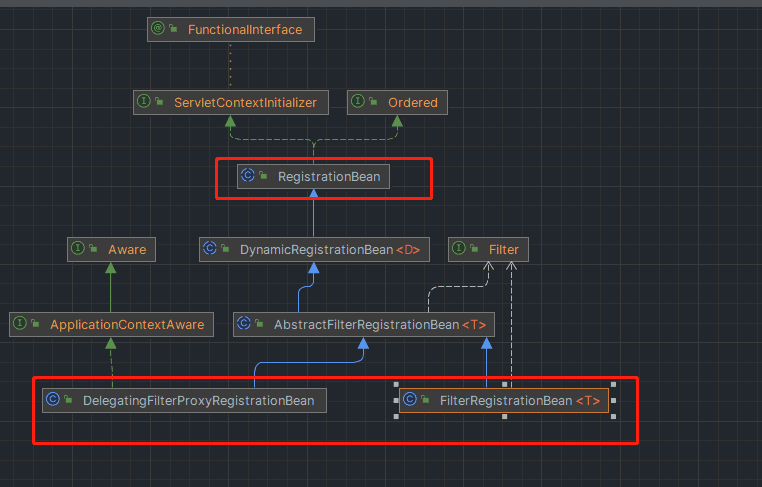
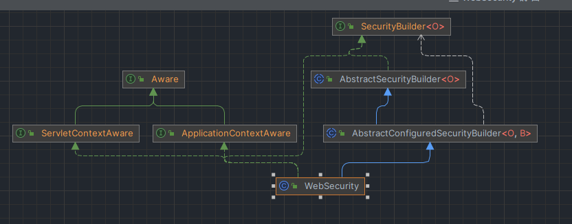
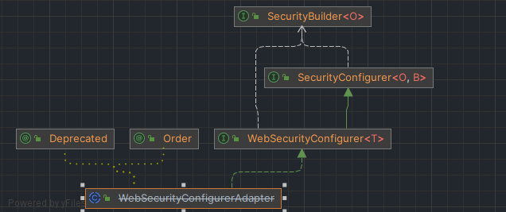
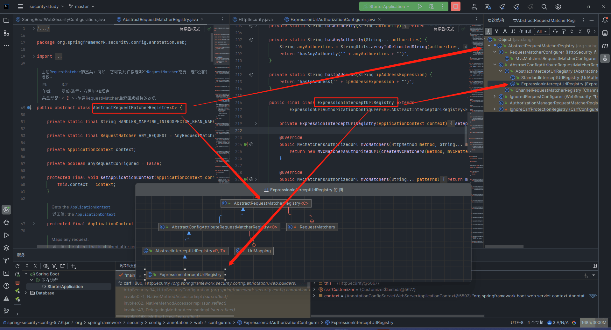

# SpringSecurity 流程补充

注意:

1. 基于 spring-boot-dependencies:2.7.7
2. 首先需要了解 [springboot2.7 升级](https://github.com/spring-projects/spring-boot/wiki/Spring-Boot-2.7-Release-Notes)
   `Changes to Auto-configuration` 以后使用 `autoconfigure` 进行自动注入
3. 代码地址 [io.github.poo0054](https://github.com/poo0054/security-study/blob/master/starter/src/main/java/io/github/poo0054/security/StarterApplication.java)

## 启动

我们每次添加 `<artifactId>spring-boot-starter-security</artifactId>`，启动的时候会有一条类似的日志：

```
Using generated springSecurity password: 1db8eb87-e2ee-4c72-88e7-9b85268c4430

This generated password is for development use only. Your springSecurity configuration must be updated before running your
application in production.
```

找到 `UserDetailsServiceAutoConfiguration#InMemoryUserDetailsManager` 类，它是 springboot 自动装配的。

下面这些都是 springboot 自动装配类，在 `spring-boot-autoconfigure-2.7.7.jar` > META-INF > spring > org.springframework.boot.autoconfigure.AutoConfiguration.imports 中。这些类就是 Spring Security 的全部了。

```imports
org.springframework.boot.autoconfigure.security.servlet.SecurityAutoConfiguration
org.springframework.boot.autoconfigure.security.servlet.UserDetailsServiceAutoConfiguration
org.springframework.boot.autoconfigure.security.servlet.SecurityFilterAutoConfiguration
org.springframework.boot.autoconfigure.security.reactive.ReactiveSecurityAutoConfiguration
org.springframework.boot.autoconfigure.security.reactive.ReactiveUserDetailsServiceAutoConfiguration
org.springframework.boot.autoconfigure.security.rsocket.RSocketSecurityAutoConfiguration
org.springframework.boot.autoconfigure.security.saml2.Saml2RelyingPartyAutoConfiguration
..........
org.springframework.boot.autoconfigure.security.oauth2.client.servlet.OAuth2ClientAutoConfiguration
org.springframework.boot.autoconfigure.security.oauth2.client.reactive.ReactiveOAuth2ClientAutoConfiguration
org.springframework.boot.autoconfigure.security.oauth2.resource.servlet.OAuth2ResourceServerAutoConfiguration
org.springframework.boot.autoconfigure.security.oauth2.resource.reactive.ReactiveOAuth2ResourceServerAutoConfiguration
```

## SecurityAutoConfiguration

```java

/**
 * {@code EnableAutoConfiguration} for Spring Security.
 *
 * @author Dave Syer
 * @author Andy Wilkinson
 * @author Madhura Bhave
 * @since 1.0.0
 */
@AutoConfiguration
@ConditionalOnClass(DefaultAuthenticationEventPublisher.class)
@EnableConfigurationProperties(SecurityProperties.class)
@Import({SpringBootWebSecurityConfiguration.class, SecurityDataConfiguration.class})
public class SecurityAutoConfiguration {

    @Bean
    @ConditionalOnMissingBean(AuthenticationEventPublisher.class)
    public DefaultAuthenticationEventPublisher authenticationEventPublisher(ApplicationEventPublisher publisher) {
        return new DefaultAuthenticationEventPublisher(publisher);
    }

}
```

### @EnableConfigurationProperties(SecurityProperties.class)

这个是 springSecurity 的核心配置类`SecurityProperties`，里面能配置
`filter`: 过滤，`user` : 用户信息

### @Import({ SpringBootWebSecurityConfiguration.class, SecurityDataConfiguration.class })

这里导入了 2 个类 `SpringBootWebSecurityConfiguration`和`SecurityDataConfiguration`，`SecurityDataConfiguration`是 Spring
springSecurity 与 Spring 数据的集成，暂时不做讲解，重点是`SpringBootWebSecurityConfiguration`

#### SpringBootWebSecurityConfiguration

这个类就是一个 `Configuration` 类，条件必须为 `@ConditionalOnWebApplication(type = Type.SERVLET)` 才会注入

##### SecurityFilterChainConfiguration

其中第一个子类`SecurityFilterChainConfiguration`添加了`@ConditionalOnDefaultWebSecurity`，这个类有个注解
`@Conditional(DefaultWebSecurityCondition.class)`，而`DefaultWebSecurityCondition`类继承了`AllNestedConditions`

所以下面代码就是判断该类是否生效，如果不存在`SecurityFilterChain`和`WebSecurityConfigurerAdapter`
的 bean，就生效。创建默认的`SecurityFilterChain`

```java
/**
 * {@link Condition} for
 * {@link ConditionalOnDefaultWebSecurity @ConditionalOnDefaultWebSecurity}.
 *
 * @author Phillip Webb
 */
class DefaultWebSecurityCondition extends AllNestedConditions {

    DefaultWebSecurityCondition() {
        super(ConfigurationPhase.REGISTER_BEAN);
    }

    @ConditionalOnClass({SecurityFilterChain.class, HttpSecurity.class})
    static class Classes {

    }

    @ConditionalOnMissingBean({
            org.springframework.security.config.annotation.web.configuration.WebSecurityConfigurerAdapter.class,
            SecurityFilterChain.class})
    @SuppressWarnings("deprecation")
    static class Beans {

    }

}
```

`SecurityFilterChain`就是整个 springsecurity 的流程了，有俩个方法，一个是`boolean matches(HttpServletRequest request);`
，是否匹配这次请求，匹配成功就获取当前所有`Filter`进行处理

`SecurityFilterChain`类会放在最下面单独讲解

##### ErrorPageSecurityFilterConfiguration

这是第二个子类，主要就是通过`FilterRegistrationBean`注入了一个`ErrorPageSecurityFilter`。 用于拦截错误调度，以确保对错误页面的授权访问。

```java
   /**
* Configures the {@link ErrorPageSecurityFilter}
*/
@Configuration(proxyBeanMethods = false)
@ConditionalOnClass(WebInvocationPrivilegeEvaluator.class)
@ConditionalOnBean(WebInvocationPrivilegeEvaluator.class)
static class ErrorPageSecurityFilterConfiguration {

   @Bean
   FilterRegistrationBean<ErrorPageSecurityFilter> errorPageSecurityFilter(ApplicationContext context) {
       FilterRegistrationBean<ErrorPageSecurityFilter> registration = new FilterRegistrationBean<>(
               new ErrorPageSecurityFilter(context));
       registration.setDispatcherTypes(DispatcherType.ERROR);
       return registration;
   }

}
```

##### WebSecurityEnablerConfiguration

这个类主要就是添加了`@EnableWebSecurity`注解，这个注解也很重要，后面跟`SecurityFilterChain`一起讲解

### DefaultAuthenticationEventPublisher

在类中还存在`SecurityAutoConfiguration`bean，这个是属于 spring 的发布订阅。改装一下，就是 springSecurity 的成功和失败事件，可以订阅失败后的一些处理，如日志打印等

```java
/**
 * @author Luke Taylor
 * @since 3.0
 */
public interface AuthenticationEventPublisher {

    void publishAuthenticationSuccess(Authentication authentication);

    void publishAuthenticationFailure(AuthenticationException exception, Authentication authentication);

}
```

## UserDetailsServiceAutoConfiguration

注入条件

```java

@ConditionalOnBean(ObjectPostProcessor.class)
@ConditionalOnMissingBean(
        value = {AuthenticationManager.class, AuthenticationProvider.class, UserDetailsService.class,
                AuthenticationManagerResolver.class},
        type = {"org.springframework.security.oauth2.jwt.JwtDecoder",
                "org.springframework.security.oauth2.server.resource.introspection.OpaqueTokenIntrospector",
                "org.springframework.security.oauth2.client.registration.ClientRegistrationRepository",
                "org.springframework.security.saml2.provider.service.registration.RelyingPartyRegistrationRepository"})
```

### InMemoryUserDetailsManager

UserDetailsManager 的非持久化实现，支持内存映射。
主要用于测试和演示目的，其中不需要完整的持久系统

## SecurityFilterAutoConfiguration

SpringSecurity 的过滤器

自动配置。与 SpringBootWebSecurityConfiguration 分开配置，以确保在存在用户提供的 WebSecurityConfiguration 时，过滤器的顺序仍然被配置。

### DelegatingFilterProxyRegistrationBean

这个类是继承了`AbstractFilterRegistrationBean`，`FilterRegistrationBean`也是继承的`AbstractFilterRegistrationBean`
。但是`DelegatingFilterProxyRegistrationBean`是使用的一个`targetBeanName`
找到 bean。进行注入。其中`private static final String DEFAULT_FILTER_NAME = AbstractSecurityWebApplicationInitializer.DEFAULT_FILTER_NAME;`
也就是`springSecurityFilterChain`

其中有俩个属性， Order 和 DispatcherTypes

- Order 默认为-100

- `DispatcherType`就是`DispatcherType`类

  `private Set<DispatcherType> dispatcherTypes = new HashSet<>(
Arrays.asList(DispatcherType.ASYNC， DispatcherType.ERROR， DispatcherType.REQUEST));`

注意: 这里需要了解一下`DelegatingFilterProxyRegistrationBean`以及 spring 如何整合 filter 和 mvc 的。 springSecurity 核心就是 filter

image.png
`DelegatingFilterProxyRegistrationBean`和`FilterRegistrationBean`都是继承的`RegistrationBean`，而`RegistrationBean`
又是`ServletContextInitializer`的实现类。其中`void onStartup(ServletContext servletContext)`方法是关键。 在`javax.servlet`
中，存在这样一个类

```java
public interface ServletContainerInitializer {

    /**
     * Receives notification during startup of a web application of the classes
     * within the web application that matched the criteria defined via the
     * {@link javax.servlet.annotation.HandlesTypes} annotation.
     *
     * @param c     The (possibly null) set of classes that met the specified
     *              criteria
     * @param ctx   The ServletContext of the web application in which the
     *              classes were discovered
     *
     * @throws ServletException If an error occurs
     */
    void onStartup(Set<Class<?>> c, ServletContext ctx) throws ServletException;
```

springboot 中的`TomcatStarter`继承了这个类，而这个类又是 spring 启动的核心`AbstractApplicationContext#refresh()`
中的`onRefresh();`方法。

找到实现类`ServletWebServerApplicationContext`的`onRefresh()`方法。里面有`createWebServer();`方法。
在里面有创建`webServer`的方法。`this.webServer = factory.getWebServer(getSelfInitializer());`这个就是创建`tomcat`的工厂。
`TomcatServletWebServerFactory#getWebServer(ServletContextInitializer... initializers)`
。里面就是创建 tomcat，并启动`TomcatWebServer#initialize()`(这就是 springboot 不用 tamcat 的原因)

而把 filter 注入 servlet 中的是`TomcatServletWebServerFactory#prepareContext(Host host, ServletContextInitializer[] initializers)`
中的`TomcatServletWebServerFactory#configureContext(context, initializersToUse)`
方法，在里面创建了一个`TomcatStarter starter = new TomcatStarter(initializers);`。而`TomcatStarter`
继承了`ServletContainerInitializer`类。调用`ServletContainerInitializer#onStartup(ServletContext servletContext)`
时候会进入到`RegistrationBean`中。
然后`AbstractFilterRegistrationBean#addRegistration`里面添加 filter
`return servletContext.addFilter(getOrDeduceName(filter), filter);`这样每次请求 servlet，tomcat 就会先使用 filter 过滤器进行拦截

简单来说就是`TomcatStarter`继承了`ServletContainerInitializer`。tomcat 会调用`onStartup`
方法，在这个方法里面会调用`ServletContextInitializer#onStartup`。在这个里面有`filter`和其余需要整合`ServletContext`的方法

比如`springSecurityFilterChain`使用的是`DelegatingFilterProxyRegistrationBean`，需要使用 bean 去获取`getFilter`
。而`ErrorPageFilter`使用的是`FilterRegistrationBean`。直接就可以注入

## @EnableWebSecurity

这个就是 springSecurity 的核心注解
需要注意，`@EnableWebMvcSecurity`已经弃用，请使用`@EnableWebSecurity`

```java

@Retention(RetentionPolicy.RUNTIME)
@Target(ElementType.TYPE)
@Documented
@Import({WebSecurityConfiguration.class, SpringWebMvcImportSelector.class, OAuth2ImportSelector.class,
        HttpSecurityConfiguration.class})
@EnableGlobalAuthentication
@Configuration
public @interface EnableWebSecurity {

    /**
     * Controls debugging support for Spring Security. Default is false.
     * @return if true, enables debug support with Spring Security
     */
    boolean debug() default false;

}
```

### WebSecurityConfiguration

首先先看类注释(以后都默认翻译成简体中文.ali 翻译):

使用 WebSecurity 创建执行 Spring 安全 web 安全的 FilterChainProxy。然后导出必要的 bean。
可以通过实现 WebSecurityConfigurer WebSecurityConfigurer 并将其公开为 Configuration 或公开 WebSecurityCustomizer bean 来进行自定义。
使用 EnableWebSecurity 时会导入该配置。

#### setFilterChainProxySecurityConfigurer

逐行解释:

> this.webSecurity = objectPostProcessor.postProcess(new WebSecurity(objectPostProcessor));

`ObjectPostProcessor`也就是`AutowireBeanFactoryObjectPostProcessor`。在`AuthenticationConfiguration`
类上`@Import(ObjectPostProcessorConfiguration.class)`.

`AutowireBeanFactoryObjectPostProcessor`类里面创建`webSecurity`
`AutowireBeanFactoryObjectPostProcessor.postProcess(new WebSecurity(objectPostProcessor));`
使用`AutowireCapableBeanFactory`创建出`WebSecurity`
`AutowireBeanFactoryObjectPostProcessor`把`SmartInitializingSingleton`和`DisposableBean`拿出来，使用自己的`destroy()`
和`afterSingletonsInstantiated()`执行

> List<SecurityConfigurer<Filter, WebSecurity>> webSecurityConfigurers = new
> AutowiredWebSecurityConfigurersIgnoreParents(beanFactory).getWebSecurityConfigurers();

`AutowiredWebSecurityConfigurersIgnoreParents`也就是获取所有的`WebSecurityConfigurerAdapter`

这里有几个类需要了解`SecurityConfigurer`和`SecurityBuilder`

先了解一下结构




使用`WebSecurity`
聚合了`private final LinkedHashMap<Class<? extends SecurityConfigurer<O, B>>, List<SecurityConfigurer<O, B>>> configurers = new LinkedHashMap<>();`
也就是`WebSecurityConfigurerAdapter`(当然还有别的，这里主要讲`WebSecurityConfigurerAdapter`)

`WebSecurityConfigurerAdapter`也可以认为就是`SecurityConfigurer`

`WebSecurity`也就是`SecurityBuilder`

然后在`SecurityBuilder`的实现类`AbstractConfiguredSecurityBuilder`的`doBuild()`方法进行很多别的操作。

```java
protected final O doBuild() throws Exception {
    synchronized (this.configurers) {
        this.buildState = BuildState.INITIALIZING;
        beforeInit();
        init();
        this.buildState = BuildState.CONFIGURING;
        beforeConfigure();
        configure();
        this.buildState = BuildState.BUILDING;
        O result = performBuild();
        this.buildState = BuildState.BUILT;
        return result;
    }
}
```

回到原来地方，返回的`webSecurityConfigurers`，里面的

```java
for (SecurityConfigurer<Filter, WebSecurity> webSecurityConfigurer : webSecurityConfigurers) {
    this.webSecurity.apply(webSecurityConfigurer);
}
```

然后就到了`AbstractConfiguredSecurityBuilder#apply`方法，里面调用了`add(configurer);` 也就是把`SecurityConfigurer`
放入了`AbstractConfiguredSecurityBuilder#configurers`的一个 map 中，这样就使用`SecurityBuilder`聚合了`SecurityConfigurer`。
在构建的时候可以做一些事情

也就是说使用`WebSecurity`聚合了`SecurityConfigurer`(包括`WebSecurityConfigurerAdapter`)

> this.securityFilterChains = securityFilterChains;

获取所有的`securityFilterChains`

> this.webSecurityCustomizers = webSecurityCustomizers;

获取所有`webSecurityCustomizers`

#### public Filter springSecurityFilterChain()

这个里面最关键的也就是这个了。

```java
for (SecurityFilterChain securityFilterChain : this.securityFilterChains) {
    this.webSecurity.addSecurityFilterChainBuilder(() -> securityFilterChain);
    for (Filter filter : securityFilterChain.getFilters()) {
        if (filter instanceof FilterSecurityInterceptor) {
            this.webSecurity.securityInterceptor((FilterSecurityInterceptor) filter);
            break;
        }
    }
}
for (WebSecurityCustomizer customizer : this.webSecurityCustomizers) {
    customizer.customize(this.webSecurity);
}
return this.webSecurity.build();
```

首先使用根据获取到的`securityFilterChains`set 入`WebSecurity#securityFilterChainBuilders`的 List 属性

这里有个需要注意的地方，如果你继承了`WebSecurityConfigurerAdapter`。`this.securityFilterChains` 就是一个空的。

而且会由`WebSecurityConfigurerAdapter#getHttp()`进行创建`WebSecurity`
。这就跟 spring 的 order 有关了。 `@Order(SecurityProperties.BASIC_AUTH_ORDER)`

其中`SpringBootWebSecurityConfiguration#SecurityFilterChainConfiguration`有一个注解`@ConditionalOnDefaultWebSecurity`

```java

@Configuration(proxyBeanMethods = false)
@ConditionalOnDefaultWebSecurity
static class SecurityFilterChainConfiguration {

    @Bean
    @Order(SecurityProperties.BASIC_AUTH_ORDER)
    SecurityFilterChain defaultSecurityFilterChain(HttpSecurity http) throws Exception {
        http.authorizeRequests().anyRequest().authenticated();
        http.formLogin();
        http.httpBasic();
        return http.build();
    }

}
```

这里会创建`SecurityFilterChain`。 还会有一个`HttpSecurity`的注入

继续回到上面，

```java
if (filter instanceof FilterSecurityInterceptor) {
    this.webSecurity.securityInterceptor((FilterSecurityInterceptor) filter);
    break;
}
```

`FilterSecurityInterceptor`也在这里进行处理，也就是`SecurityMetadataSource`元数据

然后自定义的`WebSecurityCustomizer`也在这里。可以自行改变`webSecurity`

```java
for (WebSecurityCustomizer customizer : this.webSecurityCustomizers) {
    customizer.customize(this.webSecurity);
}
```

接下来就是构建了，来到 `AbstractConfiguredSecurityBuilder#doBuild()`

```java
protected final O doBuild() throws Exception {
    synchronized (this.configurers) {
        this.buildState = BuildState.INITIALIZING;
        beforeInit();
        init();
        this.buildState = BuildState.CONFIGURING;
        beforeConfigure();
        configure();
        this.buildState = BuildState.BUILDING;
        O result = performBuild();
        this.buildState = BuildState.BUILT;
        return result;
    }
}
```

> init();
> 如果继承了`WebSecurityConfigurerAdapter`，就会在这里创建`HttpSecurity`

注意: 这里个`buildState`，用来控制当前状态的

> beforeConfigure();

在当前是没有什么处理

> configure();

这行代码就是我们每次继承`WebSecurityConfigurerAdapter`的处理了

> O result = performBuild();

然后就到了`WebSecurity#performBuild()`。

1. 首先排除忽略的`RequestMatcher`
2. 添加入`securityFilterChain` 和`requestMatcherPrivilegeEvaluatorsEntries`
3. 创建出`FilterChainProxy`bean 的名称为`springSecurityFilterChain` (重点)

剩下的都是一些创建一些 bean 了。

`SecurityExpressionHandler`: 默认为`DefaultWebSecurityExpressionHandler`类(Facade 将 springSecurity 评估安全表达式的要求与基础表达式对象的实现隔离)

`WebInvocationPrivilegeEvaluator`: 为 `WebSecurity#performBuild()`中创建的 `requestMatcherPrivilegeEvaluatorsEntries`
使用`RequestMatcherDelegatingWebInvocationPrivilegeEvaluator`包装。(允许用户确定他们是否具有给定 web URI 的特权。)

这俩个类都是很重要的。 一个是解析器，一个是判断 uri 是否合格的类。 后面单独讲

### HttpSecurityConfiguration

接下来到了`HttpSecurityConfiguration`

根据上面`WebSecurityConfiguration`，可以得出。`WebSecurityConfiguration`创建`WebSecurity`，`WebSecurity`
创建了`FilterChainProxy`的 bean。

`HttpSecurityConfiguration`创建`HttpSecurity`。 而在`SecurityFilterChainConfiguration`类中，使用`HttpSecurity`
创建了`SecurityFilterChain`。这也就是我们使用了`WebSecurityConfigurerAdapter`。为什么会存在`SecurityFilterChain`
类的原因。是`SecurityFilterChainConfiguration#defaultSecurityFilterChain`创建了一个`SecurityFilterChain`。

得出结论，`FilterChainProxy`持有`SecurityFilterChain`。而`DelegatingFilterProxyRegistrationBean`又持有`FilterChainProxy`

`DelegatingFilterProxyRegistrationBean`->`FilterChainProxy`->`SecurityFilterChain`

其实到了这一步。后面的就是我们自己编写的代码了比如

```java
@Bean
public SecurityFilterChain securityFilterChain(HttpSecurity http) throws Exception {
    // 配置认证
    http.formLogin();

    // 设置URL的授权问题
    // 多个条件取交集
    http.authorizeRequests()
            // 匹配 / 控制器  permitAll() 不需要被认证就可以访问
            .antMatchers("/login").permitAll()
            .antMatchers("/error").permitAll()
            .antMatchers("/fail").permitAll()
            // anyRequest() 所有请求   authenticated() 必须被认证
            .anyRequest().authenticated();
            // .accessDecisionManager(accessDecisionManager());
    // 关闭csrf
    http.csrf().disable();
    return http.build();
}
```

或者继承 WebSecurityConfigurerAdapter 的类了。

这里我们用 springSecurity 默认的`SpringBootWebSecurityConfiguration`来举例

```java
@Bean
@Order(SecurityProperties.BASIC_AUTH_ORDER)
SecurityFilterChain defaultSecurityFilterChain(HttpSecurity http) throws Exception {
    http.authorizeRequests().anyRequest().authenticated();
    http.formLogin();
    http.httpBasic();
    return http.build();
}
```

首先获取`HttpSecurity http`(这里的`HttpSecurity`是从`HttpSecurityConfiguration`
里面创建的，如果是自定义的`SecurityFilterChain`就是从自己写的里面来的)

> 我们来到`HttpSecurityConfiguration#httpSecurity()`
> 先创建一个默认的密码管理器，

接下来进入`authenticationBuilder.parentAuthenticationManager(authenticationManager());`
，这里就是`AuthenticationConfiguration`
里面的处理。这个类后面和 springaop 加载我们写的注释单独在`@EnableGlobalAuthentication`注解类说

接着创建`    HttpSecurity http = new HttpSecurity(this.objectPostProcessor, authenticationBuilder, createSharedObjects());`,

> .csrf(withDefaults())
> 启用 CSRF 保护，创建`CsrfConfigurer`类，并添加入添加入`AbstractConfiguredSecurityBuilder#configurers`

> .addFilter(new WebAsyncManagerIntegrationFilter())

这个有一个很有意思的类`FilterOrderRegistration`。 前面问的根据 filter 是如何包装顺序的。就在这个类里面

```java
FilterOrderRegistration() {
    Step order = new Step(INITIAL_ORDER, ORDER_STEP);
    put(DisableEncodeUrlFilter.class, order.next());
    put(ForceEagerSessionCreationFilter.class, order.next());
    put(ChannelProcessingFilter.class, order.next());
    order.next(); // gh-8105
    put(WebAsyncManagerIntegrationFilter.class, order.next());
    put(SecurityContextHolderFilter.class, order.next());
    put(SecurityContextPersistenceFilter.class, order.next());
    put(HeaderWriterFilter.class, order.next());
    put(CorsFilter.class, order.next());
    put(CsrfFilter.class, order.next());
    put(LogoutFilter.class, order.next());
}
```

springSecurity 事先使用这个类把预加载的类全部排序好，然后每次 add 一个新的 filter 就会使用这个里面的序号。如果我们有自定义的类，也要提前加载到里面去，不然就会

```java
throw new IllegalArgumentException("The Filter class "+filter.getClass().getName()
    +" does not have a registered order and cannot be added without a specified order. Consider using addFilterBefore or addFilterAfter instead.");
```

`WebAsyncManagerIntegrationFilter`: 与处理异步 web 请求相关的实用程序方法

> .exceptionHandling(withDefaults())

这个是异常的处理

提示: 这个里面每次添加一个类，如果在`HttpSecurity`中调用`getOrApply`
。比如这个代码调用的是`exceptionHandlingCustomizer.customize(getOrApply(new ExceptionHandlingConfigurer<>()));`。
打开`ExceptionHandlingConfigurer`类，发现是一个`HttpSecurityBuilder`， 这样只需要看`configure`方法大概就能明白这个是一个什么类。
这个就是在 filter 中添加了一个`ExceptionTranslationFilter`filter.主要就是`SecurityConfigurer`
的俩个方法。先调用`init(B builder)`，然后`configure(B builder)`

后面都是一样，就跳过了

> applyDefaultConfigurers(http);

这里的这一句，就是从"META-INF/spring.factories" 中加载并实例化给定类型的工厂实现
`SpringFactoriesLoader.loadFactories(AbstractHttpConfigurer.class, classLoader)`
然后调用`http.apply(configurer);` 添加到`configurers`里面

接下来回到`SecurityFilterChainConfiguration`类

> http.authorizeRequests().anyRequest().authenticated();

首先添加了`http.authorizeRequests()`
然后调用 `return getOrApply(new ExpressionUrlAuthorizationConfigurer<>(context)).getRegistry();`。
先把`ExpressionUrlAuthorizationConfigurer`放入 config 中，返回一个调用了`getRegistry()`。
也就是`ExpressionInterceptUrlRegistry`类。

后面调用的`.anyRequest()`，也就是`AbstractRequestMatcherRegistry#anyRequest()`。先了解一下结构图



完整调用链就是`AbstractRequestMatcherRegistry#anyRequest()` -> `AbstractRequestMatcherRegistry#requestMatchers(RequestMatcher... requestMatchers)` -> `AbstractConfigAttributeRequestMatcherRegistry#chainRequestMatchers(List<RequestMatcher> requestMatchers)` -> `ExpressionUrlAuthorizationConfigurer#chainRequestMatchersInternal(List<RequestMatcher> requestMatchers)` -> `return new AuthorizedUrl(requestMatchers);`

`http.authorizeRequests().anyRequest().authenticated();`是需要所有请求登录后才能访问

1. `authorizeRequests`是创建了一个`ExpressionUrlAuthorizationConfigurer`并添加入 configurer 中。
2. `anyRequest`是创建了一个`new AuthorizedUrl(requestMatchers)`，其中 `requestMatchers`
   是`AnyRequestMatcher.INSTANCE;`也就是`AnyRequestMatcher`对象。里面`matches(HttpServletRequest request)`直接返回 ture
3. `authenticated()`也就是授权，`ExpressionInterceptUrlRegistry#addMapping`。里面放入了一个`UrlMapping`，`UrlMapping`
   的俩个属性，一个是`AnyRequestMatcher`(所有请求)，`configAttrs`表示`SecurityConfig`。`SecurityConfig`
   的值为`private static final String authenticated = "authenticated"`

> http.formLogin();

创建了一个`FormLoginConfigurer`，也就是`SecurityConfigurer`。关注`init`和`configure`方法。后面统一讲解

> http.httpBasic();

`HttpBasicConfigurer`类

> http.build()

进行构建，这个就是非常重要的一个方法，build 对象，老规矩。进入`AbstractConfiguredSecurityBuilder#doBuild()`方法
`beforeInit();`: 还是没有什么

`init()`: 调用里面所有的`configurers`里面的`init方法`，后面`HttpSecurity#doBuild`统一讲解，先把流程捋一遍

接下来`SecurityFilterChain`就已经创建好了，看一下里面的方法

```java
/**
 * Defines a filter chain which is capable of being matched against an
 * {@code HttpServletRequest}. in order to decide whether it applies to that request.
 * <p>
 * Used to configure a {@code FilterChainProxy}.
 *
 * @author Luke Taylor
 * @since 3.1
 */
public interface SecurityFilterChain {

    boolean matches(HttpServletRequest request);

    List<Filter> getFilters();
}
```

肯定是先匹配，如果成功了，就返回里面所有的 filter 进行过滤，比如刚刚设置的所有请求需要登录，也还有我们需要排除的请求

`SecurityAutoConfiguration`类就已经大致讲完了，

### @EnableGlobalAuthentication

当前注解在`@EnableSecurity`中会自动加上

#### @Import(AuthenticationConfiguration.class)

`AuthenticationConfiguration`上面`@Import(ObjectPostProcessorConfiguration.class)`。 以前使用的`ObjectPostProcessor`
就是在这里注入的，注入`AutowireBeanFactoryObjectPostProcessor`对象

#### AuthenticationManagerBuilder

```java
@Bean
public AuthenticationManagerBuilder authenticationManagerBuilder(ObjectPostProcessor<Object> objectPostProcessor,
                                                                 ApplicationContext context) {
    LazyPasswordEncoder defaultPasswordEncoder = new LazyPasswordEncoder(context);
    AuthenticationEventPublisher authenticationEventPublisher = getAuthenticationEventPublisher(context);
    DefaultPasswordEncoderAuthenticationManagerBuilder result = new DefaultPasswordEncoderAuthenticationManagerBuilder(
            objectPostProcessor, defaultPasswordEncoder);
    if (authenticationEventPublisher != null) {
        result.authenticationEventPublisher(authenticationEventPublisher);
    }
    return result;
}
```

这里面返回了一个`AuthenticationManagerBuilder`的 bean，也就是上面``
HttpSecurityConfiguration#httpSecurity()`的时候需要的类，这个类也是一个`SecurityBuilder`。

> LazyPasswordEncoder defaultPasswordEncoder = new LazyPasswordEncoder(context);

首先创建了一个`LazyPasswordEncoder`，就是`PasswordEncoder`，用来管理密码的

> AuthenticationEventPublisher authenticationEventPublisher = getAuthenticationEventPublisher(context);

这个就是在`SecurityAutoConfiguration`中创建的 springSecurity 的发布订阅，用来订阅事件

> DefaultPasswordEncoderAuthenticationManagerBuilder result = new DefaultPasswordEncoderAuthenticationManagerBuilder(
> objectPostProcessor, defaultPasswordEncoder);

就是`AuthenticationManagerBuilder`的真正实现了。接下来回到`getAuthenticationManager()`方法

```java
public AuthenticationManager getAuthenticationManager() throws Exception {
    if (this.authenticationManagerInitialized) {
        return this.authenticationManager;
    }
    AuthenticationManagerBuilder authBuilder = this.applicationContext.getBean(AuthenticationManagerBuilder.class);
    if (this.buildingAuthenticationManager.getAndSet(true)) {
        return new AuthenticationManagerDelegator(authBuilder);
    }
    for (GlobalAuthenticationConfigurerAdapter config : this.globalAuthConfigurers) {
        authBuilder.apply(config);
    }
    this.authenticationManager = authBuilder.build();
    if (this.authenticationManager == null) {
        this.authenticationManager = getAuthenticationManagerBean();
    }
    this.authenticationManagerInitialized = true;
    return this.authenticationManager;
}
```

> AuthenticationManagerBuilder authBuilder = this.applicationContext.getBean(AuthenticationManagerBuilder.class);

获取到`DefaultPasswordEncoderAuthenticationManagerBuilder`

```java
for (GlobalAuthenticationConfigurerAdapter config : this.globalAuthConfigurers) {
    authBuilder.apply(config);
}
```

需要注意的是，`this.globalAuthConfigurers`就是上面三个类，

```java
@Bean
public static GlobalAuthenticationConfigurerAdapter enableGlobalAuthenticationAutowiredConfigurer(
        ApplicationContext context) {
    return new EnableGlobalAuthenticationAutowiredConfigurer(context);
}

@Bean
public static InitializeUserDetailsBeanManagerConfigurer initializeUserDetailsBeanManagerConfigurer(
        ApplicationContext context) {
    return new InitializeUserDetailsBeanManagerConfigurer(context);
}

@Bean
public static InitializeAuthenticationProviderBeanManagerConfigurer initializeAuthenticationProviderBeanManagerConfigurer(
        ApplicationContext context) {
    return new InitializeAuthenticationProviderBeanManagerConfigurer(context);
}
```

调用了`apply`也就是`add`方法。添加到`configurers`中

然后调用`build`并返回。 又是到了 `doBuild()` 这里

> beforeInit();

没有

> init();

上面三个类的`init`方法

1. `EnableGlobalAuthenticationAutowiredConfigurer#init`
2. `InitializeUserDetailsBeanManagerConfigurer#init` 调用了`auth.apply(new InitializeUserDetailsManagerConfigurer());`
   这个类比上面类名字少了一个 bean，并且没有后 init 方法 只有`configure`方法。 里面创建的`DaoAuthenticationProvider`
   ，里面默认有一个`passwordEncoder`，在无参构造方法里面。而`UserDetailsService`和`DaoAuthenticationProvider`
   是同一个，也就是在`UserDetailsServiceAutoConfiguration#inMemoryUserDetailsManager`这里创建的。里面继承了，所以是同一个
3. `InitializeAuthenticationProviderBeanManagerConfigurer#init`
   跟 2 一样，apply 了一个`InitializeAuthenticationProviderManagerConfigurer`

> beforeConfigure();

没有

> configure();

调用里面的`configure`方法

2: `InitializeUserDetailsManagerConfigurer#configure`方法

```java
@Override
public void configure(AuthenticationManagerBuilder auth) throws Exception {
    if (auth.isConfigured()) {
        return;
    }
    UserDetailsService userDetailsService = getBeanOrNull(UserDetailsService.class);
    if (userDetailsService == null) {
        return;
    }
    PasswordEncoder passwordEncoder = getBeanOrNull(PasswordEncoder.class);
    UserDetailsPasswordService passwordManager = getBeanOrNull(UserDetailsPasswordService.class);
    DaoAuthenticationProvider provider = new DaoAuthenticationProvider();
    provider.setUserDetailsService(userDetailsService);
    if (passwordEncoder != null) {
        provider.setPasswordEncoder(passwordEncoder);
    }
    if (passwordManager != null) {
        provider.setUserDetailsPasswordService(passwordManager);
    }
    provider.afterPropertiesSet();
    auth.authenticationProvider(provider);
}
```

获取所有`UserDetailsService`和`PasswordEncoder`和`UserDetailsPasswordService`，使用`DaoAuthenticationProvider`
进行管理，然后添加到`AuthenticationManagerBuilder#authenticationProviders`中

3: `InitializeAuthenticationProviderManagerConfigurer#configure`方法，把 spring 中的所有`AuthenticationProvider`
添加到`AuthenticationManagerBuilder#authenticationProviders`中

然后又到了熟悉的`AuthenticationManagerBuilder#performBuild`

```java
ProviderManager providerManager = new ProviderManager(this.authenticationProviders,
        this.parentAuthenticationManager);
if (this.eraseCredentials != null) {
    providerManager.setEraseCredentialsAfterAuthentication(this.eraseCredentials);
}
if (this.eventPublisher != null) {
    providerManager.setAuthenticationEventPublisher(this.eventPublisher);
}
providerManager = postProcess(providerManager);
return providerManager;
```

首先使用`ProviderManager`管理`authenticationProviders`和`parentAuthenticationManager`，这里的`eraseCredentials`
和`CredentialsContainer`类有关，也就是敏感数据。接着的`eventPublisher`就是发布订阅了，默认会创建的
然后`providerManager = postProcess(providerManager);`就是注入 spring 容器中，接着返回
，这里返回的其实是`ProviderManager`对象了，接着就是到了`HttpSecurity`的创建了，后面`HttpSecurity#doBuild()`
时候再讲`HttpSecurity`的构建

这里面的`LazyPasswordEncoder`这个类也很有意思，手动制造一个懒加载类

## @EnableGlobalMethodSecurity

这里有个很坑的地方，里面的`prePostEnabled`，`securedEnabled`这些属性，不是直接在`GlobalMethodSecuritySelector`
中进行处理的，放在了`GlobalMethodSecuritySelector#methodSecurityMetadataSource`
这个 bean 里面进行处理，然后开启`prePostEnabled`之后，就会加载`PrePostAnnotationSecurityMetadataSource`类。 这个我找了半天，后面无意中才发现

这个注解也添加了`@EnableGlobalAuthentication`注解

主要是看`GlobalMethodSecuritySelector`类
里面加载了`AutoProxyRegistrar`，这个就是 springaop 的类，创建代理对象的一个类。会创建`InfrastructureAdvisorAutoProxyCreator`
类来创建代理对象。关键是`GlobalMethodSecurityConfiguration`和`MethodSecurityMetadataSourceAdvisorRegistrar`这俩个类

`MethodSecurityMetadataSourceAdvisorRegistrar`类里面都用到了`GlobalMethodSecurityConfiguration`。我就放在一起了

### MethodSecurityMetadataSourceAdvisorRegistrar

这个类里面就是往 spring 中注册了一个`MethodSecurityMetadataSourceAdvisor`对象

#### MethodSecurityMetadataSourceAdvisor

这个类就是`PointcutAdvisor`，使用`AbstractAutoProxyCreator`创建代理对象的是，会获取`Pointcut`
来判断是否需要代理对象，然后使用`Advice`来进行其余操作。这是 springaop 的内容就不过多讲解了

aop 首先获取`pointcut`，进行匹配，当前的为

```java
class MethodSecurityMetadataSourcePointcut extends StaticMethodMatcherPointcut implements Serializable {

    @Override
    public boolean matches(Method m, Class<?> targetClass) {
        MethodSecurityMetadataSource source = MethodSecurityMetadataSourceAdvisor.this.attributeSource;
        return !CollectionUtils.isEmpty(source.getAttributes(m, targetClass));
    }

}
```

也就是`StaticMethodMatcherPointcut`，`ClassFilter`
默认都是 true，方法匹配为`MethodSecurityMetadataSourceAdvisor#attributeSource`进行匹配。而`methodSecurityMetadataSource`
是在`GlobalMethodSecurityConfiguration#methodSecurityMetadataSource`里面进行创建的。这俩个类后面讲。只要匹配成功就和 aop 一样流程了

这里的`Advice`就是`MethodSecurityInterceptor`类。在`GlobalMethodSecurityConfiguration#methodSecurityInterceptor`中创建

##### MethodSecurityInterceptor

> isPrePostEnabled

添加`PrePostAnnotationSecurityMetadataSource`类，主要关注`getAttributes`方法后面会讲。
这里面就是我们常用的注解了，然后构建成`ConfigAttribute`并返回。里面的构建主要用的是`PrePostInvocationAttributeFactory`
的实现，只有一个实现

> isSecuredEnabled

这个就是`@Secured`注解的处理。 逻辑基本和上面一样

最后返回一个`DelegatingMethodSecurityMetadataSource`对象，就是`MethodSecurityInterceptor`中用到的对象

匹配成功的 aop 都会进入`MethodSecurityInterceptor#invoke`

```java
@Override
public Object invoke(MethodInvocation mi) throws Throwable {
    InterceptorStatusToken token = super.beforeInvocation(mi);
    Object result;
    try {
        result = mi.proceed();
    } finally {
        super.finallyInvocation(token);
    }
    return super.afterInvocation(token, result);
}
```

这个一看就是标准 aop

###### super.beforeInvocation(mi)

这个里面就有授权了，`Authorization`和`authentication`不一样，一个是认证一个是授权。这个是授权，简单说就是角色

> Collection<ConfigAttribute> attributes = this.obtainSecurityMetadataSource().getAttributes(object);

接着来到了`DelegatingMethodSecurityMetadataSource#getAttributes`

```java
for (MethodSecurityMetadataSource s : this.methodSecurityMetadataSources) {
    attributes = s.getAttributes(method, targetClass);
    if (attributes != null && !attributes.isEmpty()) {
        break;
    }
}
```

`this.methodSecurityMetadataSources`里面的值，就是`GlobalMethodSecurityConfiguration#methodSecurityMetadataSource`
里面的`sources`.
构建出来返回`attributes`。

> Authentication authenticated = authenticateIfRequired();

这个就是获取当前认证信息

> attemptAuthorization(object, attributes, authenticated);

使用`accessDecisionManager`进行授权。放到`MethodInterceptor`中进行讲解
里面还有授权失败发布事件`publishEvent(new AuthorizationFailureEvent(object, attributes, authenticated, ex));`

接着就是授权成功发送事件，接着就是返回一个`InterceptorStatusToken`对象

###### result = mi.proceed();

执行业务

###### super.finallyInvocation(token);

是否刷新`InterceptorStatusToken`，前面传参是 false

###### return super.afterInvocation(token, result);

后处理器，与前处理器基本一样。剩下的`MethodInterceptor`中进行讲解

#### MethodInterceptor

创建出`MethodSecurityInterceptor`对象给`MethodInterceptor`用也就是`securityMetadataSource`属性

##### this.methodSecurityInterceptor = isAspectJ() ? new AspectJMethodSecurityInterceptor(): new MethodSecurityInterceptor();

一般都是`MethodSecurityInterceptor`

##### accessDecisionManager()

这个就是`AbstractSecurityInterceptor#attemptAuthorization`的授权方法

```java
protected AccessDecisionManager accessDecisionManager(){
    List<AccessDecisionVoter<?>>decisionVoters=new ArrayList<>();
    if(prePostEnabled()){
        ExpressionBasedPreInvocationAdvice expressionAdvice=new ExpressionBasedPreInvocationAdvice();
        expressionAdvice.setExpressionHandler(getExpressionHandler());
        decisionVoters.add(new PreInvocationAuthorizationAdviceVoter(expressionAdvice));
    }
    if(jsr250Enabled()){
        decisionVoters.add(new Jsr250Voter());
    }
    RoleVoter roleVoter=new RoleVoter();
    GrantedAuthorityDefaults grantedAuthorityDefaults=getSingleBeanOrNull(GrantedAuthorityDefaults.class);
    if(grantedAuthorityDefaults!=null){
        roleVoter.setRolePrefix(grantedAuthorityDefaults.getRolePrefix());
    }
    decisionVoters.add(roleVoter);
    decisionVoters.add(new AuthenticatedVoter());
    return new AffirmativeBased(decisionVoters);
}
```

前提条件必须开启`prePostEnabled`

这里面返回的也是`AffirmativeBased`，有时候我们自定义也会使用这个，只要有一个`AccessDecisionVoter`通过就认为是有权限的，这里就不过多讲解了

里面的`GrantedAuthorityDefaults`对象，也可以是我们自定义的一个前缀，默认前缀为`ROLE_`

我们一般自定义的，会使用`.accessDecisionManager(accessDecisionManager())`，在`HttpSecurity#doBuild()`中进行讲解

##### afterInvocationManager

与上面前处理一样

##### methodSecurityMetadataSource

这个就是`MethodSecurityMetadataSource`对象了

总结一下这里，就是实现 springaop 的`AbstractPointcutAdvisor`对象`MethodSecurityMetadataSourceAdvisor`， 进行 aop 加载，处理

## EnableMethodSecurity

这个注解没有`@EnableGlobalMethodSecurity`这么强大，代码基本跟`@EnableGlobalMethodSecurity`一样

## HttpSecurity#doBuild()

接下来是最后一块内容了，主要是看里面初始化，构建了哪些类

又是熟悉的`AbstractConfiguredSecurityBuilder#doBuild()`

首先看看我们一开始创建`HttpSecurity`的时候添加了哪些类 `HttpSecurityConfiguration#httpSecurity()`

```java
@Bean(HTTPSECURITY_BEAN_NAME)
@Scope("prototype")
HttpSecurity httpSecurity() throws Exception {
    WebSecurityConfigurerAdapter.LazyPasswordEncoder passwordEncoder = new WebSecurityConfigurerAdapter.LazyPasswordEncoder(
            this.context);
    AuthenticationManagerBuilder authenticationBuilder = new WebSecurityConfigurerAdapter.DefaultPasswordEncoderAuthenticationManagerBuilder(
            this.objectPostProcessor, passwordEncoder);
    authenticationBuilder.parentAuthenticationManager(authenticationManager());
    authenticationBuilder.authenticationEventPublisher(getAuthenticationEventPublisher());
    HttpSecurity http = new HttpSecurity(this.objectPostProcessor, authenticationBuilder, createSharedObjects());
    // @formatter:off
    http
            .csrf(withDefaults())
            .addFilter(new WebAsyncManagerIntegrationFilter())
            .exceptionHandling(withDefaults())
            .headers(withDefaults())
            .sessionManagement(withDefaults())
            .securityContext(withDefaults())
            .requestCache(withDefaults())
            .anonymous(withDefaults())
            .servletApi(withDefaults())
            .apply(new DefaultLoginPageConfigurer<>());
    http.logout(withDefaults());
    // @formatter:on
    applyDefaultConfigurers(http);
    return http;
}
```

`CsrfConfigurer`，`ExceptionHandlingConfigurer`，`HeadersConfigurer`，`SessionManagementConfigurer`，`SecurityContextConfigurer`，`RequestCacheConfigurer`，`AnonymousConfigurer`，`ServletApiConfigurer`，`DefaultLoginPageConfigurer`，`LogoutConfigurer`
还有我们添加到`META-INF/spring.factories`中的`AbstractHttpConfigurer.class`类

接着回到这里， 我们是自定义了一个`SecurityFilterChain`，所以在这里面进行构建

首先` http.formLogin();`添加了`FormLoginConfigurer`

`http.authorizeRequests()` 添加了`ExpressionUrlAuthorizationConfigurer`，这个只有`configure` 没有`init`

` http.csrf()` 添加了`CsrfConfigurer`

`http.userDetailsService(userDetailsService())` 添加了一个自定义的`UserDetailsService`

### FormLoginConfigurer

也是一个`SecurityConfigurer`

首先创建对象给属性赋值

```java
authFilter = UsernamePasswordAuthenticationFilter()
loginPage = "/login"
this.authenticationEntryPoint = new LoginUrlAuthenticationEntryPoint(loginPage);
```

接着来到`init`

```java
@Override
public void init(B http) throws Exception {
    updateAuthenticationDefaults();
    updateAccessDefaults(http);
    registerDefaultAuthenticationEntryPoint(http);
}
```

> updateAuthenticationDefaults();

```java
/**
 * Updates the default values for authentication.
 *
 * @throws Exception
 */
protected final void updateAuthenticationDefaults() {
    if (this.loginProcessingUrl == null) {
        loginProcessingUrl(this.loginPage);
    }
    if (this.failureHandler == null) {
        failureUrl(this.loginPage + "?error");
    }
    LogoutConfigurer<B> logoutConfigurer = getBuilder().getConfigurer(LogoutConfigurer.class);
    if (logoutConfigurer != null && !logoutConfigurer.isCustomLogoutSuccess()) {
        logoutConfigurer.logoutSuccessUrl(this.loginPage + "?logout");
    }
}
```

`loginProcessingUrl(this.loginPage);`

1. 设置登录页面
2. `this.authFilter`也就是`UsernamePasswordAuthenticationFilter`的`RequestMatcher`
   设置为`new AntPathRequestMatcher(loginProcessingUrl, "POST")`

`failureUrl(this.loginPage + "?error");`

1. 设置失败页面
2. `this.failureHandler`设置为`new SimpleUrlAuthenticationFailureHandler(authenticationFailureUrl)`
   里面的`authenticationFailureUrl`是`/login + "?error"`

`getBuilder().getConfigurer(LogoutConfigurer.class);` 就是前面加入的那一堆`Configurer`中的一个.这个默认就是当前设置的值，不用理会

> updateAccessDefaults(http);

里面默认为 false

> registerDefaultAuthenticationEntryPoint(http);

获取上面`Configurer`里面的`ExceptionHandlingConfigurer`

在`ExceptionHandlingConfigurer`中有俩个属性， `defaultEntryPointMappings`和`defaultDeniedHandlerMappings`， 基本看注释就能知道是做什么的
，这个注释是 map 的 value 类上的注释

```java
/**
 * 开始一个身份验证方案。
 在调用该方法之前， ExceptionTranslationFilter将使用请求的目标URL填充HttpSession属性abstractathenticationprocessingfilter.SPRING_SECURITY_SAVED_REQUEST _key。
 实现应根据需要修改ServletResponse上的标头，以开始身份验证过程。
 */
private LinkedHashMap<RequestMatcher, AuthenticationEntryPoint> defaultEntryPointMappings=new LinkedHashMap<>();

/**
 * 处理拒绝访问失败。
 */
private LinkedHashMap<RequestMatcher, AccessDeniedHandler> defaultDeniedHandlerMappings=new LinkedHashMap<>();
```

我们这里的是添加`defaultDeniedHandlerMappings`， `key`是`RequestMatcher`，是否匹配。 `value`是匹配成功就执行
这个类里面也是只有`configure()`，没有`init()`， 后面讲解

先说里面的`value`，就是当前类的`this.authenticationEntryPoint` 也就是创建类时候的`LoginUrlAuthenticationEntryPoint`

`key`就是`AndRequestMatcher`，但是里面聚合了俩个`RequestMatcher`， 一个是`MediaTypeRequestMatcher`
，还有一个是`NegatedRequestMatcher`

其实到了这一步，我们只需要了解其中一个，剩下的都大同小异了

举例: `ExceptionHandlingConfigurer`

`ExceptionHandlingConfigurer`这个类就是刚刚在`FormLoginConfigurer`
中处理的那个，往这个里面添加了`defaultEntryPointMappings`属性

然后我们找到`ExceptionHandlingConfigurer`中的`configure(H http)`方法， 里面就是创建了一个`ExceptionTranslationFilter`
过滤器，添加到了`http`中， 代码是这一段

```java
@Override
public void configure(H http) {
    AuthenticationEntryPoint entryPoint = getAuthenticationEntryPoint(http);
    ExceptionTranslationFilter exceptionTranslationFilter = new ExceptionTranslationFilter(entryPoint,
            getRequestCache(http));
    AccessDeniedHandler deniedHandler = getAccessDeniedHandler(http);
    exceptionTranslationFilter.setAccessDeniedHandler(deniedHandler);
    exceptionTranslationFilter = postProcess(exceptionTranslationFilter);
    http.addFilter(exceptionTranslationFilter);
}
```

接着我们打开`ExceptionTranslationFilter`，这就是一个`Filter`
，找到`doFilter(ServletRequest request, ServletResponse response, FilterChain chain)`
方法，就是在处理`catch (Exception ex) {`
的时候，做的一些事情，接着继续打开`handleSpringSecurityException(HttpServletRequest request, HttpServletResponse response,FilterChain chain, RuntimeException exception)`
方法，

```java
private void handleSpringSecurityException(HttpServletRequest request, HttpServletResponse response,
                                           FilterChain chain, RuntimeException exception) throws IOException, ServletException {
    if (exception instanceof AuthenticationException) {
        handleAuthenticationException(request, response, chain, (AuthenticationException) exception);
    } else if (exception instanceof AccessDeniedException) {
        handleAccessDeniedException(request, response, chain, (AccessDeniedException) exception);
    }
}
```

发现最后还是到了

```java
protected void sendStartAuthentication(HttpServletRequest request, HttpServletResponse response, FilterChain chain,
                                       AuthenticationException reason) throws ServletException, IOException {
    // SEC-112: Clear the SecurityContextHolder's Authentication, as the
    // existing Authentication is no longer considered valid
    SecurityContext context = SecurityContextHolder.createEmptyContext();
    SecurityContextHolder.setContext(context);
    this.requestCache.saveRequest(request, response);
    this.authenticationEntryPoint.commence(request, response, reason);
}
```

里面就有`this.authenticationEntryPoint.commence(request, response, reason);`这段代码，
创建的是`DelegatingAuthenticationEntryPoint`

```java
@Override
public void commence(HttpServletRequest request, HttpServletResponse response,
                     AuthenticationException authException) throws IOException, ServletException {
    for (RequestMatcher requestMatcher : this.entryPoints.keySet()) {
        logger.debug(LogMessage.format("Trying to match using %s", requestMatcher));
        if (requestMatcher.matches(request)) {
            AuthenticationEntryPoint entryPoint = this.entryPoints.get(requestMatcher);
            logger.debug(LogMessage.format("Match found! Executing %s", entryPoint));
            entryPoint.commence(request, response, authException);
            return;
        }
    }
    logger.debug(LogMessage.format("No match found. Using default entry point %s", this.defaultEntryPoint));
    // No EntryPoint matched, use defaultEntryPoint
    this.defaultEntryPoint.commence(request, response, authException);
}
```

基本上流程就完成了，请求先走过滤器，然后走不同的 filter，报错就到了这一步，进行错误处理，其余都基本一致了

## 备注

剩下的一些处理基本和上面这个流程一致，还有几个注解需要注意下

`@CsrfToken`

`@CurrentSecurityContext`

`@AuthenticationPrincipal`

这三个注解是在`WebMvcSecurityConfiguration`类进行处理的，只要启动了`@EnableWebSecurity`注解，就会启动

```java

@Retention(RetentionPolicy.RUNTIME)
@Target(ElementType.TYPE)
@Documented
@Import({WebSecurityConfiguration.class, SpringWebMvcImportSelector.class, OAuth2ImportSelector.class,
        HttpSecurityConfiguration.class})
@EnableGlobalAuthentication
@Configuration
public @interface EnableWebSecurity {

    /**
     * Controls debugging support for Spring Security. Default is false.
     * @return if true, enables debug support with Spring Security
     */
    boolean debug() default false;

}
```

使用方法

```java
@GetMapping("/get")
//	public Users getUser(String username,@CsrfToken CsrfToken token, @AuthenticationPrincipal Users customUser, @CurrentSecurityContext Authentication authentication) {
public Users getUser(String username, @AuthenticationPrincipal Users customUser, @CurrentSecurityContext SecurityContext securityContext) {
    return userInfoService.getUsers(username);
}
```

里面的`SpringWebMvcImportSelector`类注入了`WebMvcSecurityConfiguration`，这就是 springmvc 中`HandlerMethodArgumentResolver`
的处理，也就是参数的处理，比如我们添加的`@PathVariable`，`@RequestBody`等，都是`HandlerMethodArgumentResolver`
的实现类处理的，当然还有`HandlerMethodReturnValueHandler`，这些就是`DispatcherServlet`里面的处理了
